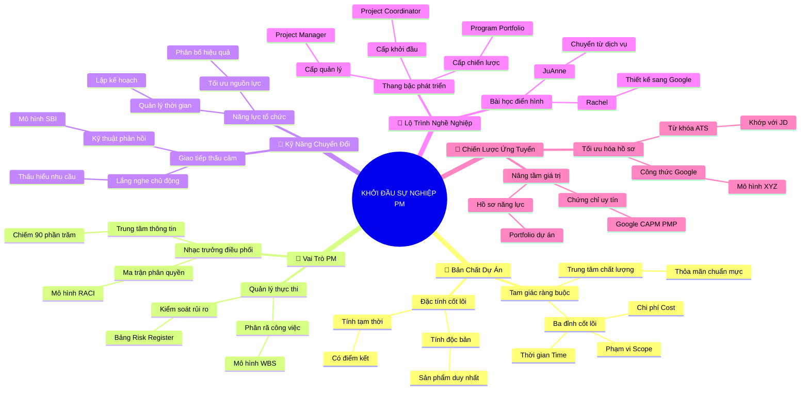

# Tóm Tắt Học Phần 1: Khởi Đầu Sự Nghiệp Quản Trị Dự Án (Embarking on a Career in Project Management)

## 1. Thông điệp cốt lõi (Core Message)
> Quản trị dự án là nghệ thuật và khoa học chuyển hóa ý tưởng thành giá trị thực tế thông qua việc kiểm soát tam giác ràng buộc (Phạm vi - Thời gian - Chi phí), tối ưu hóa các kỹ năng có thể chuyển đổi và kiến tạo lộ trình sự nghiệp vững chắc từ các tình huống đời sống thường nhật.

---

## 2. Lược Đồ Phân Bổ Cấu Trúc Tài Liệu (Content Distribution Overview)

| Phần / Đề Mục Tài Liệu Gốc | Nội Dung Trọng Tâm | Số Luận Điểm Đại Diện |
| :--- | :--- | :---: |
| **Phần I: Bản Chất & Định Nghĩa Cốt Lõi Của Dự Án** *(What Is Project Management?)* | Khái niệm dự án, tính tạm thời và độc bản, phân biệt với vận hành thường quy, cơ chế cân bằng tam giác ràng buộc. | 2 Luận điểm |
| **Phần II: Vai Trò & Nhiệm Vụ Thường Nhật Của PM** *(What Does a PM Do?)* | Vai trò nhạc trưởng điều phối, trung tâm truyền thông, lập kế hoạch, phân rã công việc và chủ động kiểm soát rủi ro. | 2 Luận điểm |
| **Phần III: Bộ Kỹ Năng Quản Trị Chuyển Đổi Được** *(Transferable Project Management Skills)* | Năng lực tổ chức, kỹ năng giao tiếp thấu cảm, tư duy giải quyết vấn đề và cách thức quy đổi kinh nghiệm đời sống vào CV. | 2 Luận điểm |
| **Phần IV: Lộ Trình Sự Nghiệp & Câu Chuyện Điển Hình** *(Path to Becoming a PM: JuAnne & Rachel)* | Phân cấp bậc nghề nghiệp (Coordinator $\to$ PM $\to$ Program $\to$ Portfolio) và bài học thực tế từ JuAnne và Rachel tại Google. | 2 Luận điểm |
| **Phần V: Chiến Lược Ứng Tuyển & Chứng Chỉ Quốc Tế** *(Finding Role & Certificate to Career Success)* | Giải mã bản mô tả công việc (JD), vượt qua bộ lọc ATS, giá trị thực tế của chứng chỉ (Google, CAPM, PMP) và xây dựng Portfolio. | 2 Luận điểm |
| **Tổng cộng** | **Bao quát 100% cấu trúc 5 phần của tài liệu gốc** | **10 Luận điểm** |

---

## 3. Luận điểm quan trọng theo cấu trúc tài liệu (Key Takeaways: 10 Luận Điểm Chuyên Sâu)

### 📑 PHẦN I: BẢN CHẤT & ĐỊNH NGHĨA CỐT LÕI CỦA DỰ ÁN (WHAT IS PROJECT MANAGEMENT?)

1. **TÍNH TẠM THỜI VÀ TÍNH ĐỘC BẢN CỦA DỰ ÁN (TEMPORARY & UNIQUE)**
   - **Bản chất & Phân tích chuyên sâu:** Dự án là một nỗ lực tạm thời được thực hiện nhằm tạo ra một sản phẩm, dịch vụ hoặc kết quả độc nhất. Dự án luôn sở hữu điểm khởi đầu và điểm kết thúc rõ ràng. Khác biệt sống còn giữa dự án và vận hành thường quy (Operations): Vận hành lặp đi lặp lại nhằm duy trì trạng thái ổn định của tổ chức, còn dự án tạo ra sự đổi mới, đột phá và kết thúc ngay khi bàn giao xong mục tiêu đã định.
   - **Phương pháp / Công cụ / Quy trình đi kèm:** Điều lệ dự án (Project Charter), Tiêu chí hoàn thành (Definition of Done - DoD), Mục tiêu SMART.
   - **Ví dụ thực tế đời thường:** Việc tổ chức đám cưới là một dự án: có ngân sách ấn định, thời hạn ngày cưới và kết thúc khi tiệc tàn; trong khi việc dọn dẹp, nấu ăn và chi tiêu mỗi ngày của gia đình là công việc vận hành thường quy.

2. **CƠ CHẾ ĐIỀU PHỐI TAM GIÁC RÀNG BUỘC (TRIPLE CONSTRAINTS)**
   - **Bản chất & Phân tích chuyên sâu:** Mọi dự án đều bị chi phối bởi ba đỉnh của tam giác ràng buộc: Phạm vi (Scope - khối lượng công việc), Thời gian (Time - lịch trình bàn giao) và Chi phí (Cost - ngân sách và nhân lực). Ba yếu tố này bao bọc lấy Chất lượng (Quality). Khi một biến số bị tác động, bắt buộc phải đánh đổi hoặc điều chỉnh ít nhất một trong hai biến số còn lại để giữ cân bằng hệ thống.
   - **Phương pháp / Công cụ / Quy trình đi kèm:** Mô hình Tam giác quản trị dự án (Project Management Triangle), Đường cơ sở dự án (Project Baselines: Scope, Schedule, Cost Baseline).
   - **Ví dụ thực tế đời thường:** Khi sửa nhà đón Tết: Nếu chủ nhà muốn hoàn thiện sớm hơn 2 tuần (rút ngắn Thời gian), họ buộc phải trả thêm tiền thuê thợ làm ca đêm (tăng Chi phí) hoặc chấp nhận bỏ bớt hạng mục ốp đá sân vườn (giảm Phạm vi).

---

### 📑 PHẦN II: VAI TRÒ & NHIỆM VỤ THƯỜNG NHẬT CỦA PM (WHAT DOES A PM DO?)

3. **VAI TRÒ NHẠC TRƯỞNG VÀ TRUNG TÂM ĐIỀU PHỐI TRUYỀN THÔNG**
   - **Bản chất & Phân tích chuyên sâu:** Quản lý dự án không trực tiếp làm từng tác vụ kỹ thuật mà giữ vai trò nhạc trưởng điều hướng toàn bộ dàn nhạc. PM chịu trách nhiệm bảo đảm mọi thành viên hiểu rõ mục tiêu, gỡ bỏ nút thắt (roadblocks) và duy trì sự liên kết chặt chẽ. Hoạt động truyền thông chiếm đến 90% quỹ thời gian của PM nhằm đảm bảo thông tin chính xác đến đúng người vào đúng thời điểm.
   - **Phương pháp / Công cụ / Quy trình đi kèm:** Kế hoạch quản lý truyền thông (Communications Management Plan), Ma trận RACI (Responsible, Accountable, Consulted, Informed).
   - **Ví dụ thực tế đời thường:** Vị nhạc trưởng trong dàn nhạc giao hưởng: không trực tiếp thổi kèn hay kéo đàn violon, nhưng giữ nhịp phách, ra hiệu từng bè vào đúng lúc để tạo nên bản giao hưởng hoàn mỹ.

4. **PHÂN RÃ CÔNG VIỆC, QUẢN LÝ TIẾN ĐỘ VÀ DỰ BÁO RỦI RO**
   - **Bản chất & Phân tích chuyên sâu:** Nhiệm vụ thường nhật của PM là chia nhỏ mục tiêu phức tạp thành các gói công việc thực thi được, thiết lập các mốc bàn giao (Milestones) và phân công nhân sự cụ thể. Đồng thời, PM phải luôn sở hữu tư duy phòng ngừa: nhận diện các bất định có thể ảnh hưởng tiêu cực đến dự án và lập kế hoạch giảm thiểu rủi ro ngay từ đầu.
   - **Phương pháp / Công cụ / Quy trình đi kèm:** Cấu trúc phân chia công việc (Work Breakdown Structure - WBS), Biểu đồ Gantt (Gantt Chart), Bảng ghi nhận rủi ro (Risk Register).
   - **Ví dụ thực tế đời thường:** Kế hoạch ôn thi đại học: chia toàn bộ kiến thức lớp 12 thành các chuyên đề theo tuần (WBS), ấn định lịch thi thử hàng tháng (Milestones) và chuẩn bị sẵn đèn tích điện phòng khi mất điện đột xuất (Quản trị rủi ro).

---

### 📑 PHẦN III: BỘ KỸ NĂNG QUẢN TRỊ CHUYỂN ĐỔI ĐƯỢC (TRANSFERABLE SKILLS)

5. **NĂNG LỰC TỔ CHỨC VÀ GIAO TIẾP THẤU CẢM (EMPATHIC COMMUNICATION)**
   - **Bản chất & Phân tích chuyên sâu:** Kỹ năng tổ chức giúp biến sự hỗn loạn thành trật tự có hệ thống, trong khi kỹ năng giao tiếp thấu cảm giúp PM kết nối sâu sắc với các thành viên và các bên liên quan. Giao tiếp thấu cảm đòi hỏi lắng nghe chủ động, đặt câu hỏi gợi mở và hiểu được động lực ngầm của từng cá nhân để động viên đội ngũ cùng tiến bước.
   - **Phương pháp / Công cụ / Quy trình đi kèm:** Kỹ thuật Lắng nghe chủ động (Active Listening), Phỏng vấn 1-on-1, Phản hồi theo mô hình SBI (Situation - Behavior - Impact).
   - **Ví dụ thực tế đời thường:** Trưởng ban tổ chức hội đồng niên họp mặt: lắng nghe tâm tư của các bạn ở xa, sắp xếp lịch họp trực tuyến phù hợp múi giờ và khéo léo dung hòa sở thích ăn uống của từng nhóm thành viên.

6. **TƯ DUY QUY ĐỔI TRẢI NGHIỆM ĐỜI THƯỜNG VÀO NĂNG LỰC DỰ ÁN**
   - **Bản chất & Phân tích chuyên sâu:** Rất nhiều hoạt động thường nhật trong cuộc sống thực chất chính là quản trị dự án mà chúng ta không nhận ra. Khả năng nhận thức và tái định hình các trải nghiệm như tổ chức sự kiện gia đình, chuyển nhà, quản lý ngân sách cá nhân thành các thuật ngữ quản trị chuẩn mực là chìa khóa vàng giúp người mới gia nhập ngành định vị năng lực bản thân.
   - **Phương pháp / Công cụ / Quy trình đi kèm:** Bản đồ đối chiếu kỹ năng (Skill Mapping Matrix), Kỹ thuật kể chuyện phỏng vấn STAR (Situation - Task - Action - Result).
   - **Ví dụ thực tế đời thường:** Một bà mẹ nội trợ tổ chức tiệc sinh nhật cho con: lên danh sách khách mời (Stakeholder Management), cân đối ngân sách 5 triệu (Cost Baseline), đặt bánh và thuê chú hề (Vendor Management) và hoàn thành đúng 18h tối (Schedule Baseline).

---

### 📑 PHẦN IV: LỘ TRÌNH SỰ NGHIỆP & CÂU CHUYỆN ĐIỂN HÌNH (PATHWAYS & STORIES)

7. **THANG BẬC PHÁT TRIỂN NGHỀ NGHIỆP QUẢN TRỊ DỰ ÁN CHUYÊN NGHIỆP**
   - **Bản chất & Phân tích chuyên sâu:** Lộ trình nghề nghiệp PM không cố định mà phân tầng theo độ phức tạp và phạm vi tác động: Bắt đầu từ Điều phối viên dự án (Project Coordinator) hỗ trợ thủ tục $\to$ Quản lý dự án (Project Manager) điều hành dự án đơn lẻ $\to$ Quản lý chương trình (Program Manager) điều phối nhóm các dự án có liên kết $\to$ Quản lý danh mục (Portfolio Manager) căn chỉnh toàn bộ dự án với chiến lược tối cao của tập đoàn.
   - **Phương pháp / Công cụ / Quy trình đi kèm:** Khung năng lực nghề nghiệp (Career Competency Framework), Bản đồ năng lực PMI Talent Triangle (Kỹ năng kỹ thuật, Kỹ năng lãnh đạo, Chiến lược kinh doanh).
   - **Ví dụ thực tế đời thường:** Ngành xây dựng đô thị: Kỹ sư phụ trách 1 tòa nhà chung cư là Project Manager; Trưởng ban điều hành toàn bộ khu đô thị gồm 10 tòa chung cư, trường học, bệnh viện là Program Manager; Giám đốc đầu tư quyết định rót vốn vào các khu đô thị nào sinh lời nhất là Portfolio Manager.

8. **BÀI HỌC VƯƠN LÊN TỪ NỀN TẢNG PHI TRUYỀN THỐNG: JUANNE & RACHEL**
   - **Bản chất & Phân tích chuyên sâu:** JuAnne xuất thân từ ngành dịch vụ chăm sóc khách hàng và bảo hiểm, tận dụng năng lực giao tiếp và quản lý thời gian để chuyển hướng thành công sang làm PM công nghệ. Rachel bắt đầu là một nhà thiết kế nội thất, chuyển hóa tư duy không gian và quản lý nhà thầu để trở thành Technical PM hàng đầu tại Google New York. Bài học then chốt: Đừng sợ xuất phát điểm trái ngành, hãy tập trung vào các kỹ năng chuyển giao cốt lõi.
   - **Phương pháp / Công cụ / Quy trình đi kèm:** Phân tích khoảng trống kỹ năng cá nhân (Gap Analysis), Kế hoạch phát triển cá nhân (Individual Development Plan - IDP).
   - **Ví dụ thực tế đời thường:** Một giáo viên dạy ngoại ngữ chuyển hướng làm PM cho công ty phần mềm giáo dục (EdTech): dùng kỹ năng soạn giáo án làm WBS, dùng kỹ năng quản lý học sinh làm Stakeholder Management.

---

### 📑 PHẦN V: CHIẾN LƯỢC ỨNG TUYỂN & CHỨNG CHỈ QUỐC TẾ (CAREER SUCCESS)

9. **GIẢI MÃ BẢN MÔ TẢ CÔNG VIỆC (JD) VÀ TỐI ƯU HÓA TỪ KHÓA ATS**
   - **Bản chất & Phân tích chuyên sâu:** Các doanh nghiệp thường sử dụng hệ thống theo dõi ứng viên (ATS) để quét CV tự động. Ứng viên cần biết bóc tách các từ khóa trọng tâm trong JD (Scrum, Kanban, Risk Management, Budgeting, Cross-functional) và đưa các từ khóa này vào hồ sơ một cách tự nhiên gắn liền với các thành tựu đo lường được bằng số liệu.
   - **Phương pháp / Công cụ / Quy trình đi kèm:** Công thức viết CV định lượng XYZ của Google: "Accomplished [X] as measured by [Y], by doing [Z]", Hệ thống lọc ATS.
   - **Ví dụ thực tế đời thường:** Thay vì viết: "Đã quản lý đội ngũ hoàn thành dự án đúng hạn", hãy viết: "Đã điều phối đội ngũ 8 kỹ sư hoàn thành dự án triển khai ERP trước hạn 2 tuần, tiết kiệm 15% ngân sách dự trù thông qua việc áp dụng quy trình Scrum".

10. **GIÁ TRỊ THỰC TIỄN CỦA CHỨNG CHỈ VÀ XÂY DỰNG PORTFOLIO DỰ ÁN**
    - **Bản chất & Phân tích chuyên sâu:** Các chứng chỉ chuyên nghiệp (Google PM Certificate, CAPM, PMP) chứng minh sự am hiểu chuẩn mực quốc tế và tinh thần học hỏi liên tục. Tuy nhiên, bằng cấp chỉ là tấm vé qua cửa; yếu tố quyết định trúng tuyển là Portfolio dự án thực tế thể hiện tư duy xử lý vấn đề, tài liệu mẫu (Charter, WBS, Risk Register) mà ứng viên đã tự tay xây dựng.
    - **Phương pháp / Công cụ / Quy trình đi kèm:** Lộ trình chứng chỉ (CAPM $\to$ PMP $\to$ PMI-ACP), Bộ hồ sơ năng lực dự án (Project Portfolio Showcase).
    - **Ví dụ thực tế đời thường:** Một kiến trúc sư khi đi xin việc luôn mang theo tập bản vẽ các công trình đã thiết kế; một PM tương lai đi phỏng vấn mang theo tập tài liệu dự án hoàn chỉnh gồm Charter, Gantt Chart và Risk Matrix để chứng minh năng lực thực chiến.

---

## 4. Kế hoạch hành động (Action Plan: 17 việc cụ thể)

#### Nhóm 1: Hành động ngay hôm nay (Micro-habits dưới 2 phút - 5 việc)
- [ ] **Hành động 1:** Viết ra giấy 1 mục tiêu quan trọng nhất của ngày hôm nay theo chuẩn SMART (Cụ thể, Đo lường được, Khả thi, Phù hợp, Thời hạn).
- [ ] **Hành động 2:** Tải một bản mẫu Điều lệ Dự án (Project Charter Template) chuẩn của Google về Google Docs hoặc máy tính cá nhân.
- [ ] **Hành động 3:** Kiểm tra hòm thư điện tử, dọn dẹp các email tồn đọng và gán nhãn phân loại theo 3 mức: Khẩn cấp, Quan trọng, Tham khảo.
- [ ] **Hành động 4:** Cập nhật chức danh hoặc dòng giới thiệu trên LinkedIn thêm từ khóa "Aspiring Project Manager" hoặc "Project Coordinator".
- [ ] **Hành động 5:** Dành 2 phút ghi lại 3 việc bạn đã hoàn thành tốt trong tuần vừa qua có yếu tố quản lý thời gian và phân bổ nguồn lực.

#### Nhóm 2: Kế hoạch rèn luyện trong tuần (Áp dụng vào công việc & đời sống - 7 việc)
- [ ] **Hành động 6:** Bóc tách 1 kế hoạch cá nhân sắp tới (chuyến du lịch, dọn nhà, mua sắm) thành sơ đồ WBS với tối thiểu 3 cấp độ phân rã.
- [ ] **Hành động 7:** Lập một Bảng ghi nhận rủi ro (Risk Register) đơn giản cho công việc hiện tại gồm: Mô tả rủi ro, Xác suất, Mức độ tác động, Phương án giảm thiểu.
- [ ] **Hành động 8:** Tìm kiếm 3 bản mô tả công việc (Job Description) vị trí Junior PM trên LinkedIn, bôi đậm 10 từ khóa kỹ năng xuất hiện nhiều nhất.
- [ ] **Hành động 9:** Viết lại 3 gạch đầu dòng kinh nghiệm trong CV của bản thân theo đúng công thức XYZ của Google (Đạt được X, đo lường bằng Y, thông qua Z).
- [ ] **Hành động 10:** Thực hành kỹ thuật lắng nghe chủ động trong ít nhất 2 cuộc trò chuyện với đồng nghiệp: ghi chép lại yêu cầu mà không ngắt lời.
- [ ] **Hành động 11:** Vẽ sơ đồ Tam giác ràng buộc (Triple Constraints) cho dự án bạn đang tham gia, xác định rõ đâu là yếu tố cố định và đâu là yếu tố linh hoạt.
- [ ] **Hành động 12:** Lập Ma trận RACI thu nhỏ cho nhóm làm việc hiện tại nhằm làm rõ ai là người chịu trách nhiệm chính (A) cho từng đầu việc.

#### Nhóm 3: Thói quen duy trì & Chuyển hóa lâu dài (Phát triển bền vững - 5 việc)
- [ ] **Hành động 13:** Duy trì thói quen viết nhật ký dự án (Project Log) vào cuối mỗi tuần: ghi lại bài học thành công, sai lầm và phương án cải tiến.
- [ ] **Hành động 14:** Đặt mục tiêu học tập và hoàn thành toàn bộ 6 khóa học trong chương trình Google Project Management Professional Certificate.
- [ ] **Hành động 15:** Xây dựng một Portfolio dự án mẫu (lưu trên Google Drive hoặc Notion) bao gồm: Charter, WBS, Schedule, Risk Register để sẵn sàng ứng tuyển.
- [ ] **Hành động 16:** Kết nối chủ động với ít nhất 2 Quản lý dự án kỳ cựu trên LinkedIn hoặc qua các hội thảo chuyên ngành để xin lời khuyên định hướng sự nghiệp.
- [ ] **Hành động 17:** Lập kế hoạch tài chính và thời gian để thi chứng chỉ quốc tế CAPM hoặc PMP trong vòng 12 đến 24 tháng tới.

---

## 5. Câu hỏi tự ngẫm (Reflection: 24 câu hỏi sâu sắc)

#### Nhóm 1: Tự vấn Nhận thức & Hệ tư duy (Self-Awareness & Mindset: 6 câu)
1. Tôi đang nhìn nhận công việc hàng ngày của mình như một chuỗi tác vụ vụn vặt hay như một dự án có mục tiêu và cấu trúc rõ ràng?
2. Khi đối mặt với sự thay đổi đột ngột về thời hạn hoặc ngân sách, phản xạ đầu tiên của tôi là lo sợ hay bình tĩnh điều chỉnh Tam giác ràng buộc?
3. Tôi có đang đóng vai trò một người thợ trực tiếp ôm đồm mọi việc thay vì một nhạc trưởng biết phân công và truyền cảm hứng cho đội ngũ?
4. Xuất phát điểm trái ngành của tôi có thực sự là nhược điểm, hay chính là góc nhìn độc đáo mang lại lợi thế cạnh tranh khác biệt?
5. Tôi đánh giá mức độ chịu áp lực và khả năng kiên định trước những xung đột lợi ích của bản thân ở mức mấy điểm trên thang điểm 10?
6. Chân lý nào trong quản trị dự án khiến tôi ấn tượng nhất sau khi học xong phần này?

#### Nhóm 2: Nhận diện Thói quen & Điểm mù (Habits & Blind Spots: 6 câu)
7. Tôi có thói quen cả nể đồng ý nhận thêm yêu cầu phát sinh của sếp hoặc đối tác mà không đánh giá tác động lên tiến độ và chi phí hay không?
8. Kênh truyền thông tôi hay sử dụng nhất có thực sự hiệu quả với tất cả các thành viên trong đội ngũ, hay chỉ thuận tiện cho riêng tôi?
9. Tôi có thường xuyên chủ động dự báo rủi ro trước khi bắt tay làm việc, hay chỉ đợi khi có sự cố mới hốt hoảng tìm cách chữa cháy?
10. Bản mô tả công việc (CV) hiện tại của tôi đã chứa các số liệu định lượng cụ thể chứng minh kết quả, hay vẫn chỉ là những câu mô tả chung chung?
11. Tôi có xu hướng tự giải quyết khó khăn một mình thay vì chia sẻ và tìm kiếm sự trợ giúp từ các bên liên quan hay không?
12. Điểm mù lớn nhất trong kỹ năng lắng nghe của tôi khi trao đổi với các thành viên khác trong nhóm là gì?

#### Nhóm 3: Ứng dụng Thực tế & Giải quyết Vấn đề (Practical Application: 6 câu)
13. Làm thế nào để tôi có thể chuyển thể một mục tiêu mơ hồ từ cấp trên thành một Điều lệ Dự án (Project Charter) với các mốc SMART rõ ràng?
14. Trong công việc hiện tại, tôi có thể áp dụng ngay công cụ WBS để giải quyết tình trạng trễ hạn hoặc chồng chéo nhiệm vụ như thế nào?
15. Khi một thành viên chủ chốt xin nghỉ việc giữa chừng, tôi sẽ kích hoạt phương án quản trị rủi ro nào để dự án không bị đình trệ?
16. Nếu khách hàng yêu cầu bổ sung tính năng mới mà không tăng ngân sách, tôi sẽ dùng lập luận gì trên Tam giác ràng buộc để đàm phán?
17. Bằng cách nào tôi có thể áp dụng ma trận RACI vào gia đình hoặc nhóm bạn để giải quyết sự đùn đẩy trách nhiệm trong các sự kiện chung?
18. Tôi sẽ sử dụng câu chuyện vượt khó nào của bản thân theo mô hình STAR để gây ấn tượng mạnh nhất với nhà tuyển dụng PM sắp tới?

#### Nhóm 4: Bứt phá Giới hạn & Chuyển hóa Tương lai (Breakthrough & Transformation: 6 câu)
19. Nếu được tự do lựa chọn, tôi muốn phát triển sự nghiệp theo hướng chuyên sâu vào một ngành (chuyên gia) hay điều hành đa ngành (quản lý tổng quát)?
20. Mục tiêu vị trí công việc tiếp theo của tôi sau 1 năm nữa là gì: Project Coordinator, Assistant PM hay Project Manager toàn quyền?
21. Tôi cần trau dồi thêm kỹ năng công nghệ hoặc phương pháp luận nào (Scrum, Kanban, Jira, Asana) để nâng cao giá trị bản thân trên thị trường lao động?
22. Hình mẫu nhà quản trị dự án lý tưởng mà tôi khao khát trở thành sở hữu những phẩm chất và phong thái lãnh đạo như thế nào?
23. Tôi sẽ đóng góp giá trị gì khác biệt cho tổ chức khi được trao quyền quản lý một dự án chiến lược quy mô lớn?
24. Kế hoạch cụ thể của tôi để duy trì ngọn lửa đam mê và không ngừng nâng cấp bản thân trên con đường quản trị dự án chuyên nghiệp là gì?

---

## 6. Bản Đồ Tư Duy Trực Quan (Visual Mindmap Overview - Tinh Gọn 4-5 Tầng)

