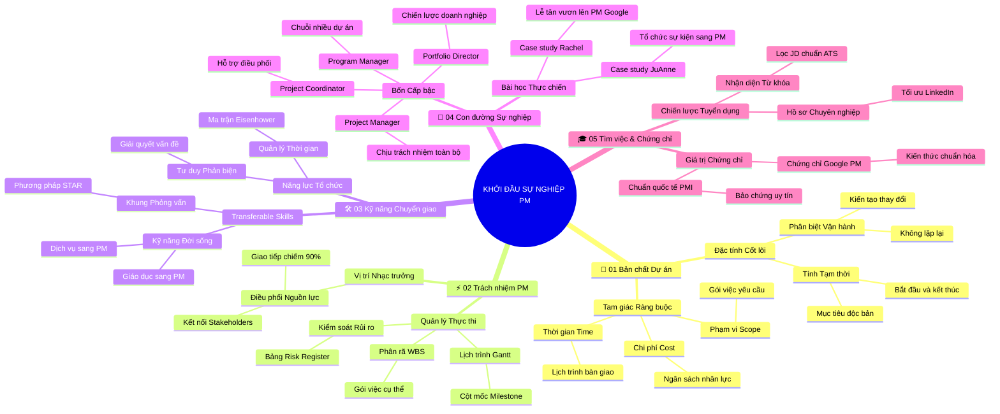

# Tóm Tắt Học Phần 1: Khởi Đầu Sự Nghiệp Quản Trị Dự Án (v2.4)

## 1. Thông điệp cốt lõi (Core Message)
Quản trị dự án là nghệ thuật chuyển hóa ý tưởng thành giá trị kinh doanh thực tế thông qua việc kiểm soát tam giác ràng buộc, vận dụng linh hoạt các kỹ năng chuyển giao và định hình lộ trình sự nghiệp chuyên nghiệp bền vững.

---

## 2. Lược Đồ Phân Bổ Cấu Trúc Tài Liệu (Content Distribution Overview)

| Phần / Đề Mục Tài Liệu Gốc | Nội Dung Trọng Tâm | Số Luận Điểm Đại Diện |
| :--- | :--- | :---: |
| **Phần I: Định Nghĩa & Bản Chất Cốt Lõi Của Dự Án** | Khái niệm dự án, tính tạm thời, đầu ra độc bản, tam giác ràng buộc (Triple Constraints) | 2 Luận điểm |
| **Phần II: Vai Trò & Nhiệm Vụ Hàng Ngày Của PM** | Vị trí nhạc trưởng điều phối, lập kế hoạch, theo dõi tiến độ và quản lý rủi ro | 2 Luận điểm |
| **Phần III: Bộ Kỹ Năng Quản Trị Có Thể Chuyển Đổi** | Kỹ năng tổ chức, giao tiếp, tư duy giải quyết vấn đề và năng lực chuyển giao từ đời sống | 2 Luận điểm |
| **Phần IV: Con Đường Sự Nghiệp & Bài Học Thực Tế** | Các cấp bậc sự nghiệp (Coordinator $\to$ PM $\to$ Program $\to$ Portfolio) và câu chuyện JuAnne, Rachel | 2 Luận điểm |
| **Phần V: Chiến Lược Tìm Kiếm Việc Làm & Chứng Chỉ** | Nhận diện vị trí PM phù hợp, giá trị của chứng chỉ quốc tế và lộ trình thành công | 2 Luận điểm |
| **Tổng cộng** | **Bao quát 100% cấu trúc 5 phần của tài liệu** | **10 Luận điểm** |

---

## 3. Luận điểm quan trọng theo cấu trúc tài liệu (Key Takeaways: 10 Luận Điểm Chuyên Sâu)

### 📑 PHẦN I: ĐỊNH NGHĨA & BẢN CHẤT CỐT LÕI CỦA DỰ ÁN (WHAT IS PROJECT MANAGEMENT?)

1. **ĐẶC TÍNH TẠM THỜI VÀ TÍNH ĐỘC BẢN CỦA DỰ ÁN (TEMPORARY & UNIQUE)**
   - **Bản chất & Phân tích chuyên sâu:** Dự án là một nỗ lực tạm thời được thực hiện để tạo ra một sản phẩm, dịch vụ hoặc kết quả duy nhất. Dự án luôn có mốc bắt đầu và kết thúc xác định. Điểm khác biệt sống còn giữa dự án và vận hành thường quy (Operations) là: Vận hành mang tính chất lặp đi lặp lại để duy trì doanh nghiệp, trong khi dự án tạo ra sự thay đổi và kết thúc ngay khi mục tiêu bàn giao hoàn tất.
   - **Phương pháp / Công cụ / Quy trình đi kèm:** Điều lệ dự án (Project Charter), Tiêu chí hoàn thành (Definition of Done - DoD).
   - **Ví dụ thực tế đời thường:** Tổ chức một đám cưới là dự án: có ngày giờ khai mạc, ngân sách dự trù và hoàn thành là kết thúc; còn việc nấu nướng dọn dẹp hàng ngày của gia đình là vận hành thường quy.

2. **CƠ CHẾ CÂN BẰNG TAM GIÁC RÀNG BUỘC (TRIPLE CONSTRAINTS)**
   - **Bản chất & Phân tích chuyên sâu:** Mọi dự án đều chịu chi phối bởi ba biến số phụ thuộc lẫn nhau: Phạm vi (Scope - những việc cần làm), Thời gian (Time - lịch trình bàn giao) và Chi phí (Cost - ngân sách và nhân lực). Ba yếu tố này bao bọc lấy Chất lượng (Quality). Khi một yếu tố thay đổi, ít nhất một trong hai yếu tố còn lại bắt buộc phải điều chỉnh theo để giữ thế cân bằng.
   - **Phương pháp / Công cụ / Quy trình đi kèm:** Mô hình Tam giác quản trị dự án (Triple Constraints Triangle), Đường cơ sở dự án (Project Baselines).
   - **Ví dụ thực tế đời thường:** Khi sửa nhà đón Tết: Nếu gia chủ muốn đẩy sớm thời hạn hoàn thành trước hai tuần (rút ngắn Thời gian), họ buộc phải tăng thêm tiền thuê thợ làm ca đêm (tăng Chi phí) hoặc chấp nhận bớt việc sơn lại ban công (giảm Phạm vi).

---

### 📑 PHẦN II: VAI TRÒ & NHIỆM VỤ HÀNG NGÀY CỦA PM (WHAT DOES A PM DO?)

3. **VAI TRÒ NHẠC TRƯỞNG VÀ ĐIỀU PHỐI GIAO TIẾP TRUNG TÂM**
   - **Bản chất & Phân tích chuyên sâu:** Quản lý dự án không phải là người trực tiếp làm mọi tác vụ chuyên môn mà đóng vai trò như một nhạc trưởng. PM chịu trách nhiệm lập kế hoạch, phân bổ nguồn lực, theo dõi công việc và kết nối các bên liên quan. Hoạt động giao tiếp chiếm tới 90% thời lượng của PM nhằm đảm bảo thông tin thông suốt và đúng người.
   - **Phương pháp / Công cụ / Quy trình đi kèm:** Kế hoạch quản lý dự án (Project Management Plan), Ma trận phân công trách nhiệm RACI.
   - **Ví dụ thực tế đời thường:** Nhạc trưởng điều khiển một dàn hợp xướng: không trực tiếp kéo vĩ cầm hay thổi kèn trompet, nhưng giữ nhịp phách chung để tất cả nghệ sĩ vào đúng nốt và tạo nên bản hòa tấu hoàn hảo.

4. **QUẢN LÝ TIẾN ĐỘ, PHÂN RÃ CÔNG VIỆC VÀ KIỂM SOÁT RỦI RO**
   - **Bản chất & Phân tích chuyên sâu:** Nhiệm vụ hàng ngày của PM là bóc tách các mục tiêu lớn thành các gói công việc cụ thể, gán trách nhiệm và xác định các cột mốc (Milestones). Đồng thời, PM phải chủ động dự báo các sự kiện không chắc chắn (rủi ro), xây dựng phương án phòng ngừa sớm để dự án không rơi vào thế bị động.
   - **Phương pháp / Công cụ / Quy trình đi kèm:** Cấu trúc phân chia công việc (WBS), Biểu đồ Gantt (Gantt Chart), Bảng ghi nhận rủi ro (Risk Register).
   - **Ví dụ thực tế đời thường:** Lên lịch ôn thi đại học: chia nhỏ sách giáo khoa thành từng chương theo tuần (WBS), đánh dấu lịch thi thử (Milestones) và mua sẵn đèn sạc phòng khi mất điện (Quản lý rủi ro).

---

### 📑 PHẦN III: BỘ KỸ NĂNG QUẢN TRỊ CÓ THỂ CHUYỂN ĐỔI (TRANSFERABLE SKILLS)

5. **KỸ NĂNG TỔ CHỨC VÀ QUẢN TRỊ THỜI GIAN THỰC CHIẾN**
   - **Bản chất & Phân tích chuyên sâu:** Năng lực tổ chức là xương sống của nghề PM. PM phải có khả năng sắp xếp hàng trăm đầu việc, tài liệu và dữ liệu một cách khoa học, nhận diện rõ đâu là việc khẩn cấp, đâu là việc quan trọng để phân bổ năng lượng tối ưu và không bị ngập trong sự vụ.
   - **Phương pháp / Công cụ / Quy trình đi kèm:** Ma trận ma trận Eisenhower (Ưu tiên công việc), Kỹ thuật Pomodoro, Hệ thống thư mục lưu trữ chuẩn hóa.
   - **Ví dụ thực tế đời thường:** Một người nội trợ chuẩn bị mâm cỗ Tết cho 20 khách: lên danh sách đi chợ theo từng gian hàng, sơ chế đồ ăn trước 1 ngày và hẹn giờ nấu từng món để mâm cỗ dọn lên nóng hổi đúng giờ.

6. **KHẢ NĂNG CHUYỂN GIAO KỸ NĂNG TỪ CÁC NGÀNH NGHỀ KHÁC (TRANSFERABLE SKILLS)**
   - **Bản chất & Phân tích chuyên sâu:** Bất kỳ ai cũng đã từng thực hiện quản trị dự án trong đời sống mà không nhận ra. Kỹ năng giao tiếp, giải quyết xung đột, đàm phán ngân sách và điều phối con người từ các lĩnh vực như giáo dục, bán lẻ, y tế, dịch vụ khách hàng đều có thể chuyển hóa trực tiếp thành năng lực quản lý dự án chuyên nghiệp.
   - **Phương pháp / Công cụ / Quy trình đi kèm:** Khung năng lực chuyển giao (Skill Transferability Framework), Phương pháp STAR trong phỏng vấn kinh nghiệm.
   - **Ví dụ thực tế đời thường:** Giáo viên mầm non chuyển sang làm PM: kỹ năng soạn giáo án chuyển thành lập kế hoạch dự án; kỹ năng dàn xếp trẻ tranh giành đồ chơi chuyển thành kỹ năng giải quyết xung đột nhóm.

---

### 📑 PHẦN IV: CON ĐƯỜNG SỰ NGHIỆP & BÀI HỌC THỰC TẾ (CAREER PATH & REAL STORIES)

7. **LỘ TRÌNH PHÁT TRIỂN 4 CẤP BẬC CỦA NGHỀ QUẢN LÝ DỰ ÁN**
   - **Bản chất & Phân tích chuyên sâu:** Nghề PM có nấc thang thăng tiến minh bạch và rộng mở: Bắt đầu từ Điều phối viên dự án (Project Coordinator - hỗ trợ hành chính, theo dõi lịch trình), tiến lên Quản lý dự án (Project Manager - chịu trách nhiệm toàn bộ 1 dự án), sau đó phát triển thành Quản lý chương trình (Program Manager - quản lý chuỗi nhiều dự án liên quan) và Giám đốc danh mục (Portfolio Director - định hướng chiến lược đầu tư cho toàn bộ dự án của doanh nghiệp).
   - **Phương pháp / Công cụ / Quy trình đi kèm:** Khung năng lực nghề nghiệp (Career Pathway Framework), Kế hoạch phát triển cá nhân (IDP).
   - **Ví dụ thực tế đời thường:** Trong ngành ẩm thực: Phụ bếp học việc $\to$ Đầu bếp đứng nấu $\to$ Bếp trưởng quản lý ca $\to$ Giám đốc ẩm thực chuỗi nhà hàng khách sạn 5 sao.

8. **BÀI HỌC CHUYỂN MÌNH TỪ CÂU CHUYỆN CỦA JUANNE VÀ RACHEL TẠI GOOGLE**
   - **Bản chất & Phân tích chuyên sâu:** Hai case study thực tế từ chuyên gia Google khẳng định: Xuất phát điểm không phải là rào cản. JuAnne xuất thân từ ngành tổ chức sự kiện và Rachel từ lễ tân, nhưng nhờ rèn luyện tư duy cấu trúc, tinh thần học hỏi chủ động và biết đóng gói các kinh nghiệm cũ thành kỹ năng giải quyết vấn đề, họ đã trở thành các PM xuất sắc tại tập đoàn công nghệ hàng đầu thế giới.
   - **Phương pháp / Công cụ / Quy trình đi kèm:** Tư duy phát triển (Growth Mindset), Kỹ thuật đúc kết bài học sau hành động (After Action Review - AAR).
   - **Ví dụ thực tế đời thường:** Người leo núi tuyết không cần phải sinh ra ở vùng băng giá; họ chỉ cần nắm vững kỹ thuật thắt dây an toàn, chuẩn bị thể lực bền bỉ và kiên trì từng bước chân.

---

### 📑 PHẦN V: CHIẾN LƯỢC TÌM KIẾM VIỆC LÀM & CHỨNG CHỈ (FINDING ROLES & CERTIFICATE)

9. **NHẬN DIỆN VỊ TRÍ PHÙ HỢP VÀ TỪ KHÓA TUYỂN DỤNG TRÊN THỊ TRƯỜNG**
   - **Bản chất & Phân tích chuyên sâu:** Tiêu đề công việc PM trên thị trường rất đa dạng: Project Coordinator, Operations Associate, Project Assistant, Scrum Master, Implementation Specialist. Ứng viên cần đọc kỹ bản mô tả công việc (JD) để đối chiếu các trách nhiệm cốt lõi (lập kế hoạch, theo dõi tiến độ, quản lý ngân sách) thay vì chỉ tìm kiếm đúng cụm từ "Project Manager".
   - **Phương pháp / Công cụ / Quy trình đi kèm:** Phân tích từ khóa JD (Job Description Keyword Mapping), Tối ưu hồ sơ LinkedIn / CV chuẩn ATS.
   - **Ví dụ thực tế đời thường:** Khi tìm mua xe gia đình: Thay vì chỉ tìm từ khóa "xe ô tô", người mua lọc theo các tiêu chí thực tế như 7 chỗ ngồi, tiết kiệm xăng và có khoang hành lý rộng.

10. **GIÁ TRỊ NÂNG TẦM CỦA CHỨNG CHỈ QUẢN TRỊ DỰ ÁN QUỐC TẾ**
    - **Bản chất & Phân tích chuyên sâu:** Chứng chỉ chuyên nghiệp (như Google Project Management Certificate, CAPM, PMP) đóng vai trò là bảo chứng uy tín cho kiến thức chuẩn hóa. Chứng chỉ chứng minh bạn hiểu rõ phương pháp luận quản trị hiện đại, sử dụng chung ngôn ngữ với cộng đồng quốc tế và cam kết theo đuổi nghề nghiệp nghiêm túc, tạo ưu thế cạnh tranh vượt bậc trong mắt nhà tuyển dụng.
    - **Phương pháp / Công cụ / Quy trình đi kèm:** Bộ tiêu chuẩn quốc tế PMI PMBOK, Chương trình đào tạo Google Career Certificates.
    - **Ví dụ thực tế đời thường:** Bằng thuyền trưởng quốc tế cho phép bạn tự tin cầm lái con tàu vượt qua hải trình đại dương và được tất cả các cảng biển lớn trên thế giới cấp phép cập bến.

---

## 4. Kế hoạch hành động (Action Plan: 20 việc cụ thể)

#### Nhóm 1: Hành động ngay hôm nay (Micro-habits dưới 2 phút - 5 việc)
- [ ] **Hành động 1:** Viết lại 1 nhiệm vụ cá nhân hôm nay theo đúng định nghĩa Dự án (Có ngày bắt đầu, ngày kết thúc và sản phẩm đầu ra).
- [ ] **Hành động 2:** Vẽ nhanh mô hình Tam giác ràng buộc (Phạm vi - Thời gian - Chi phí) lên bàn làm việc để nhắc nhở bản thân.
- [ ] **Hành động 3:** Ghi ra sổ tay 3 kỹ năng bạn đang có từ công việc cũ có thể chuyển giao (transfer) sang nghề PM.
- [ ] **Hành động 4:** Cập nhật tiêu đề nghề nghiệp trên LinkedIn hướng tới mục tiêu Quản trị dự án.
- [ ] **Hành động 5:** Tạo một bảng việc cần làm 3 cột đơn giản (To Do - Doing - Done) trên giấy cho ngày hôm nay.

#### Nhóm 2: Kế hoạch rèn luyện trong tuần (Áp dụng vào công việc & dự án - 8 việc)
- [ ] **Hành động 6:** Phân rã một mục tiêu quan trọng trong tuần thành sơ đồ WBS gồm tối thiểu 3 cấp độ việc nhỏ.
- [ ] **Hành động 7:** Xác định rõ 2 cột mốc (Milestones) quan trọng nhất của công việc hiện tại để kiểm soát tiến độ.
- [ ] **Hành động 8:** Lập bảng phân tích rủi ro (Risk Register) liệt kê 3 nguy cơ lớn nhất kèm biện pháp dự phòng.
- [ ] **Hành động 9:** Đọc và phân tích 5 bản mô tả công việc (JD) tuyển dụng Project Coordinator / PM trên thị trường.
- [ ] **Hành động 10:** Tối ưu lại CV cá nhân: làm nổi bật các con số định lượng về ngân sách, tiến độ và quy mô nhóm đã từng quản lý.
- [ ] **Hành động 11:** Áp dụng kỹ thuật giao tiếp chủ động: gửi email báo cáo tiến độ tuần ngắn gọn cho sếp hoặc đối tác.
- [ ] **Hành động 12:** Luyện tập phương pháp trả lời phỏng vấn STAR cho 2 tình huống giải quyết khó khăn trong quá khứ.
- [ ] **Hành động 13:** Thực hiện buổi đánh giá rút kinh nghiệm cuối tuần (Retrospective) xem việc gì làm tốt, việc gì cần cải tiến.

#### Nhóm 3: Thói quen duy trì & Chuyển hóa lâu dài (Phát triển sự nghiệp bền vững - 7 việc)
- [ ] **Hành động 14:** Duy trì tư duy dự án (Project Mindset) cho mọi mục tiêu lớn trong cuộc sống và sự nghiệp.
- [ ] **Hành động 15:** Cam kết hoàn thành trọn vẹn chương trình Chứng chỉ Quản trị Dự án Google trong lộ trình 3-6 tháng.
- [ ] **Hành động 16:** Chủ động xung phong nhận vai trò điều phối trong các dự án thử nghiệm hoặc hoạt động thiện nguyện.
- [ ] **Hành động 17:** Xây dựng mạng lưới quan hệ (Networking) với ít nhất 5 chuyên gia quản lý dự án trên LinkedIn hàng tháng.
- [ ] **Hành động 18:** Đọc 1 cuốn sách hoặc bài nghiên cứu chuyên sâu về quản trị tiến độ và lãnh đạo nhóm mỗi tháng.
- [ ] **Hành động 19:** Định kỳ 6 tháng rà soát lại lộ trình nghề nghiệp (IDP) để đánh giá sự thăng tiến năng lực.
- [ ] **Hành động 20:** Định vị bản thân là một người giải quyết vấn đề đáng tin cậy, luôn hoàn thành cam kết đúng hạn và chuẩn chất lượng.

---

## 5. Câu hỏi tự ngẫm (Reflection: 20 câu hỏi sâu sắc)

#### Nhóm 1: Tự vấn Nhận thức & Hệ tư duy (Self-Awareness & Mindset: 5 câu)
1. Bạn đang nhìn nhận công việc hiện tại như một chuỗi vận hành lặp lại nhàm chán hay là cơ hội thực thi các dự án tạo giá trị?
2. Khi đối diện với một mục tiêu lớn, bạn có thói quen lập kế hoạch bài bản trước khi làm hay cứ lao vào làm rồi tính sau?
3. Bạn tự tin nhất vào kỹ năng chuyển giao nào của bản thân khi bước chân vào con đường quản trị dự án chuyên nghiệp?
4. Bạn có sẵn sàng chịu trách nhiệm cao nhất cho kết quả thành bại chung của một tập thể hay còn e ngại áp lực?
5. Định nghĩa thành công cá nhân của bạn trong vai trò một Project Manager trong 3 năm tới là gì?

#### Nhóm 2: Nhận diện Thói quen & Điểm mù (Habits & Blind Spots: 5 câu)
1. Thói quen xấu nào đang khiến bạn thường xuyên bị trễ hạn cam kết trong công việc và cuộc sống hàng ngày?
2. Bạn có thói quen nhận thêm việc mà không cân nhắc xem Tam giác ràng buộc (Thời gian và Chi phí) có cho phép hay không?
3. Khi gặp rủi ro phát sinh, bạn thường chủ động tìm giải pháp ứng phó từ trước hay thụ động chờ sự cố xảy ra rồi mới chữa cháy?
4. Điểm mù giao tiếp nào khiến người khác đôi khi cảm thấy bạn truyền đạt thiếu rõ ràng hoặc gây hiểu lầm?
5. Bạn có đang bị bó hẹp trong tư duy chuyên môn cũ mà chưa mở lòng tiếp nhận góc nhìn bao quát của một người quản lý?

#### Nhóm 3: Ứng dụng Thực tế & Giải quyết Vấn đề (Practical Application & Problem Solving: 5 câu)
1. Khi khách hàng đòi bổ sung thêm tính năng mới nhưng kiên quyết không tăng ngân sách và thời gian, bạn sẽ giải thích ra sao dựa trên Tam giác ràng buộc?
2. Bạn sử dụng công cụ nào để phân rã một dự án phức tạp thành các gói việc nhỏ mà ai nhìn vào cũng hiểu ngay nhiệm vụ của mình?
3. Làm thế nào để bạn phát hiện sớm một công việc đang có nguy cơ bị chậm trễ trước khi nó gây ảnh hưởng đến toàn bộ tiến độ?
4. Bạn sẽ áp dụng kinh nghiệm vượt khó nào trong quá khứ để chứng minh năng lực giải quyết vấn đề trong buổi phỏng vấn PM?
5. Phương pháp nào giúp bạn duy trì sự tập trung cao độ vào các việc ưu tiên quan trọng thay vì bị cuốn vào các việc khẩn cấp không tên?

#### Nhóm 4: Bứt phá Giới hạn & Chuyển hóa Tương lai (Breakthrough & Transformation: 5 câu)
1. Vị trí công việc cụ thể nào (Project Coordinator, Junior PM, Scrum Master) bạn đặt mục tiêu ứng tuyển thành công trong năm nay?
2. Chứng chỉ chuyên môn quốc tế nào sẽ là bàn đạp giúp bạn nâng mức thu nhập và vị thế nghề nghiệp lên một tầm cao mới?
3. Nếu không có bất kỳ rào cản nào về sự tự ti, dự án lớn nhất và táo bạo nhất mà bạn khao khát được dẫn dắt là gì?
4. Bạn sẽ chia sẻ lại những bài học quản trị dự án bổ ích này cho ai để cùng nhau tiến bộ và hỗ trợ lẫn nhau trong sự nghiệp?
5. Quyết định thay đổi thói quen đầu tiên bạn sẽ thực hiện ngay trong sáng mai để bắt đầu hành trình trở thành một PM chuyên nghiệp là gì?

---

## 6. Bản Đồ Tư Duy Trực Quan (Visual Mindmap Overview - Bám Sát 5 Phần Tài Liệu)

