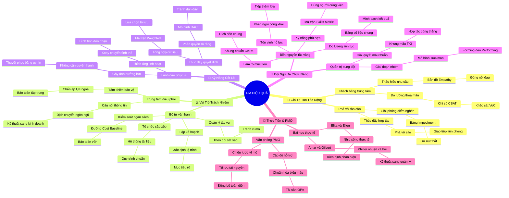

# 🧠 BẢN ĐỒ TƯ DUY TINH GỌN (4-5 TẦNG): HỌC PHẦN 2 - PM HIỆU QUẢ

## 1. Sơ Đồ Tư Duy Trực Quan (Mermaid Mindmap Tinh Gọn)

---

## 2. Cây Phân Cấp Tri Thức Gợi Nhớ Nhanh 4-5 Tầng (Active Recall Hierarchy)

- 📌 **[Phần I: Giá Trị & Cách Thức Tạo Tác Động Tới Tổ Chức]**
  - 🔹 *Khách hàng là trung tâm:* ➔ *Bản đồ Empathy Map* ➔ *Đo lường chỉ số CSAT & VoC* ➔ *Ví dụ: Thiết kế nút bấm to cho tài xế giao hàng*
  - 🔹 *Phá vỡ rào cản silo:* ➔ *Bảng Impediment Log* ➔ *Họp đứng Stand-up & Đàm phán nguyên tắc* ➔ *Ví dụ: PM trực tiếp xin duyệt bản quyền phần mềm trong 24h*

- 📌 **[Phần II: Vai Trò, Trách Nhiệm & Vị Trí Trong Đội Ngũ]**
  - 🔹 *Bộ tứ vận hành cốt lõi:* ➔ *Kế hoạch ➔ Tổ chức ➔ Tác vụ ➔ Ngân sách* ➔ *Theo dõi tiến độ & Cost Baseline* ➔ *Ví dụ: Sửa chung cư giữ 10% ngân sách dự phòng*
  - 🔹 *Vị trí trung tâm kết nối:* ➔ *Tấm khiên bảo vệ đội ngũ* ➔ *Dịch ngôn ngữ kỹ thuật sang kinh doanh* ➔ *Ví dụ: Huấn luyện viên trưởng bảo vệ cầu thủ trước truyền thông*

- 📌 **[Phần III: Bộ Tứ Kỹ Năng Cốt Lõi Của PM Xuất Sắc]**
  - 🔹 *Thúc đẩy ra quyết định:* ➔ *Ma trận Weighted Decision Matrix* ➔ *Mô hình phân quyền DACI* ➔ *Ví dụ: Lập bảng so sánh AWS vs Google Cloud để nhóm biểu quyết*
  - 🔹 *Lãnh đạo không quyền hành:* ➔ *Servant Leadership & Thích ứng linh hoạt* ➔ *Ảnh hưởng qua thấu cảm và uy tín* ➔ *Ví dụ: Trưởng nhóm thiện nguyện kêu gọi bạn bè bằng tâm huyết*

- 📌 **[Phần IV: Lãnh Đạo & Điều Phối Đội Ngũ Đa Chức Năng]**
  - 🔹 *Bốn nguyên tắc vàng:* ➔ *Mục tiêu OKRs ➔ Skills Matrix ➔ Đo lường công khai ➔ Tôn vinh nỗ lực* ➔ *Đoàn kết đa phòng ban* ➔ *Ví dụ: Đội ra mắt sản phẩm chung tay đạt 10.000 lượt tải*
  - 🔹 *Quản trị xung đột:* ➔ *Mô hình Tuckman (4 giai đoạn)* ➔ *Mô hình xử lý mâu thuẫn TKI* ➔ *Ví dụ: Dung hòa tranh cãi giữa thẩm mỹ thiết kế và tốc độ lập trình*

- 📌 **[Phần V: Thực Tiễn Muôn Màu & Văn Phòng PMO]**
  - 🔹 *Văn phòng PMO chuẩn hóa:* ➔ *Ba cấp độ PMO (Supportive, Controlling, Directive)* ➔ *Kho tài sản quy trình OPA* ➔ *Ví dụ: Phòng đào tạo trường đại học chuẩn hóa quy chế thi*
  - 🔹 *Bài học từ chuyên gia:* ➔ *Elita ➔ Ellen ➔ Amar ➔ Gilbert* ➔ *Ứng dụng từ đời sống đến kỹ thuật cao* ➔ *Ví dụ: Bác sĩ trưởng khoa dùng tư duy PM giảm 30% chờ cấp cứu*

---

## 3. Bảng Neo Trí Nhớ Từ Khóa Vàng (Memory Anchor Cheat Sheet)

| Từ Khóa Cốt Lõi | Phần Trong Tài Liệu | Bản Chất / Vai Trò (3-5 từ) | Tín Hiệu Gợi Nhớ (Memory Trigger) |
| :--- | :--- | :--- | :--- |
| **Customer Centricity** | Phần I | Đặt khách hàng trung tâm | Chiếc kính lúp soi vào nỗi đau người dùng |
| **Barrier Buster** | Phần I | Cỗ máy ủi rào cản | Chiếc máy ủi san phẳng bờ tường ngăn cách |
| **Four Operations** | Phần II | Bốn cột trụ vận hành | Bàn làm việc bốn chân vững chắc của PM |
| **Protective Shield** | Phần II | Tấm khiên chắn xao nhãng | Chiếc khiên người lính đỡ mưa tên cho thợ xây |
| **Enabling Decisions** | Phần III | Mở đường ra quyết định | Chiếc compa và thước kẻ giúp đội ngũ vẽ đường |
| **Influence No Authority** | Phần III | Lãnh đạo không chức danh | Thỏi nam châm hút sắt bằng sức hút tự thân |
| **Cross-Functional** | Phần IV | Đội ngũ đa lĩnh vực | Bàn cờ hội tụ đủ xe, pháo, mã, tốt nhịp nhàng |
| **Tuckman Model** | Phần IV | Bốn giai đoạn phát triển | Đứa trẻ tập đi từ bỡ ngỡ đến chạy nhảy vững vàng |
| **PMO Office** | Phần V | Văn phòng chuẩn hóa dự án | Tháp hải đăng dẫn đường cho mọi con thuyền |
| **OPA Assets** | Phần V | Kho tài sản quy trình | Tủ sách cẩm nang bí kíp của người đi trước |
