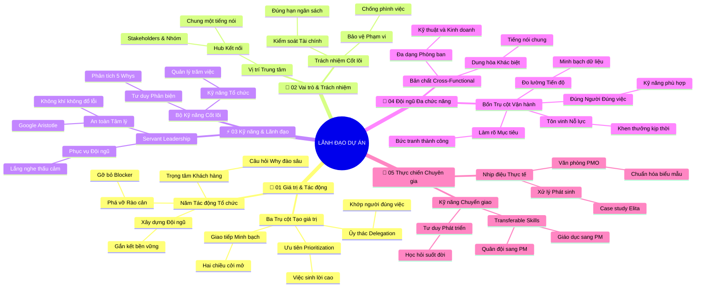

# 🧠 BẢN ĐỒ TƯ DUY TINH GỌN (5 TẦNG): Trở Thành Một Người Quản Lý Dự Án Hiệu Quả (v2.4)

## 1. Sơ Đồ Tư Duy Trực Quan (Mermaid Mindmap Bám Sát 5 Phần Tài Liệu)

---

## 2. Cây Phân Cấp Tri Thức Gợi Nhớ Nhanh 5 Tầng (Active Recall Hierarchy)

- 📌 **[Phần I: Giá trị & Tác động của PM tới Tổ chức]**
  - 🔹 *Ba Trụ cột Giá trị:* ➔ *Ưu tiên hóa (Prioritization)* ➔ *Ủy thác thông minh (Delegation)* ➔ *Giao tiếp minh bạch (Transparency)*
  - 🔹 *Trọng tâm Khách hàng:* ➔ *Khách hàng nội bộ & bên ngoài* ➔ *Đào sâu câu hỏi "Tại sao" (Why)* ➔ *Khám phá kỳ vọng cốt lõi*
- 📌 **[Phần II: Vai trò, Trách nhiệm & Vị trí trong Đội ngũ]**
  - 🔹 *Vị trí Nhạc trưởng:* ➔ *Cầu nối trung tâm (Hub)* ➔ *Kết nối Bên liên quan & Đội ngũ* ➔ *Đồng bộ tiếng nói chung*
  - 🔹 *Trách nhiệm Tháo gỡ:* ➔ *Bảo vệ Phạm vi, Tiến độ, Ngân sách* ➔ *Nhận diện điểm nghẽn sớm* ➔ *Phá vỡ các rào cản cản trở*
- 📌 **[Phần III: Kỹ năng Cốt lõi & Nghệ thuật Lãnh đạo]**
  - 🔹 *Kỹ năng Cốt lõi:* ➔ *Kỹ năng tổ chức* ➔ *Tư duy phản biện (Critical Thinking)* ➔ *Phân tích 5 Whys tìm nguyên nhân gốc*
  - 🔹 *Servant Leadership:* ➔ *Phục vụ và hỗ trợ nhóm* ➔ *Tháo gỡ vật cản* ➔ *Xây dựng An toàn tâm lý (Google Aristotle)*
- 📌 **[Phần IV: Vận hành Đội ngũ Đa chức năng]**
  - 🔹 *Bản chất Cross-Functional:* ➔ *Hội tụ đa phòng ban* ➔ *Khác biệt văn hóa & chuyên môn* ➔ *Cần chất kết dính điều phối*
  - 🔹 *Bốn Trụ cột Thành công:* ➔ *1. Làm rõ mục tiêu* ➔ *2. Chiêu mộ đúng kỹ năng* ➔ *3. Đo lường tiến độ* ➔ *4. Tôn vinh nỗ lực*
- 📌 **[Phần V: Góc nhìn Thực chiến từ Chuyên gia Google]**
  - 🔹 *Bài học Thực tế:* ➔ *Một ngày làm việc linh hoạt (Elita)* ➔ *Vai trò chiến lược của Văn phòng PMO (Lan)*
  - 🔹 *Kỹ năng Chuyển giao:* ➔ *Transferable Skills (Ellen, Amar, Gilbert)* ➔ *Chuyển hóa kinh nghiệm đời sống thành năng lực PM*

---

## 3. Bảng Neo Trí Nhớ Từ Khóa Vàng (Memory Anchor Cheat Sheet)

| Từ Khóa Cốt Lõi | Phần Trong Tài Liệu | Bản Chất / Vai Trò (3-5 từ) | Tín Hiệu Gợi Nhớ (Memory Trigger) |
| :--- | :--- | :--- | :--- |
| **Prioritization** | Phần I | Chọn việc quan trọng nhất làm trước | Người phân luồng giao thông tại ngã tư giờ cao điểm |
| **Delegation** | Phần I | Giao đúng việc cho đúng người | Bếp trưởng phân công phụ bếp chuyên làm món tráng miệng |
| **Customer-Centric** | Phần I | Đặt khách hàng làm tâm điểm | Người may đo lấy số đo tỉ mỉ từng chi tiết khách hàng |
| **Central Hub** | Phần II | Vị trí kết nối mọi mắt xích | Đài kiểm soát không lưu điều phối mọi đường bay cất cánh |
| **Barrier Buster** | Phần II | Chủ động tháo gỡ mọi rào cản | Xe ủi đất dọn sạch chướng ngại vật mở đường cho đoàn xe |
| **Critical Thinking** | Phần III | Phân tích sâu tìm nguyên nhân gốc | Thám tử dùng kính lúp soi dấu vết thay vì kết luận vội vàng |
| **Servant Leadership** | Phần III | Lãnh đạo bằng sự phục vụ đội ngũ | Người làm vườn tận tụy tưới nước nhổ cỏ cho cây đơm hoa |
| **Psychological Safety** | Phần III | Không gian an toàn dám thừa nhận sai | Gia đình ấm áp cùng nhau tìm cách sửa lỗi thay vì trách phạt |
| **Cross-Functional Team** | Phần IV | Nhóm quy tụ đa dạng chuyên môn | Dàn nhạc kết hợp cả nhạc cụ dân tộc lẫn giao hưởng phương Tây |
| **Four Pillars** | Phần IV | 4 nguyên tắc vận hành nhóm đa chức năng | Bốn chân vững chãi giữ mặt bàn thăng bằng không chao đảo |
| **PMO (Project Office)** | Phần V | Văn phòng chuẩn hóa quy trình dự án | Trung tâm đào tạo và cấp phép bay hàng không chuyên nghiệp |
| **Transferable Skills** | Phần V | Kỹ năng chuyển hóa linh hoạt | Ống kính vạn hoa nhìn cùng một cảnh ra nhiều hình ảnh mới |
