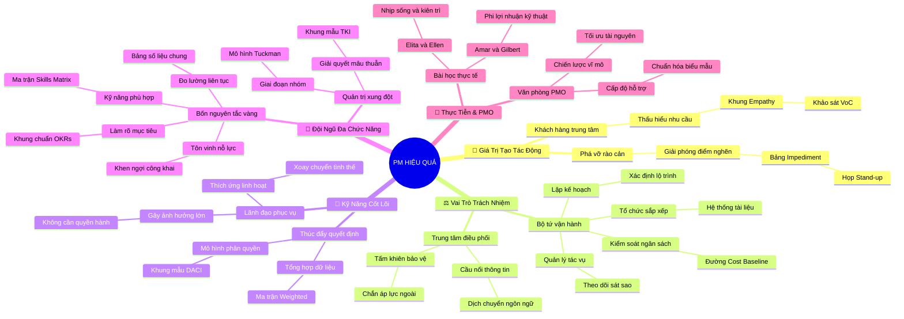

# Tóm Tắt Học Phần 2: Trở Thành Một Người Quản Lý Dự Án Hiệu Quả (Becoming an Effective Project Manager)

## 1. Thông điệp cốt lõi (Core Message)
> Một người quản lý dự án hiệu quả là chất xúc tác tạo giá trị kinh doanh đột phá thông qua năng lực lãnh đạo phục vụ, nghệ thuật dẫn dắt đội ngũ đa chức năng, phá vỡ các rào cản tổ chức và linh hoạt điều hướng dự án trong môi trường PMO chuyên nghiệp.

---

## 2. Lược Đồ Phân Bổ Cấu Trúc Tài Liệu (Content Distribution Overview)

| Phần / Đề Mục Tài Liệu Gốc | Nội Dung Trọng Tâm | Số Luận Điểm Đại Diện |
| :--- | :--- | :---: |
| **Phần I: Giá Trị & Cách Thức Tạo Tác Động Tới Tổ Chức** *(Value of a PM & Impacting Organizations)* | 5 trụ cột tạo tác động: Khách hàng là trung tâm, xây dựng đội ngũ, thúc đẩy hợp tác, quản trị toàn diện, phá vỡ rào cản. | 2 Luận điểm |
| **Phần II: Vai Trò, Trách Nhiệm & Vị Trí Trong Đội Ngũ** *(Key Roles, Responsibilities & Position in Team)* | 4 trách nhiệm thường nhật (Lập kế hoạch, Tổ chức, Quản lý tác vụ, Kiểm soát ngân sách) và vị trí kết nối đa tầng. | 2 Luận điểm |
| **Phần III: Bộ Tứ Kỹ Năng Cốt Lõi Của PM Xuất Sắc** *(The Core Skills of a Project Manager)* | Thúc đẩy ra quyết định, giao tiếp đa kênh, khả năng thích ứng linh hoạt và nghệ thuật lãnh đạo không cần chức danh. | 2 Luận điểm |
| **Phần IV: Lãnh Đạo & Điều Phối Đội Ngũ Đa Chức Năng** *(Leadership, Team Dynamics & Cross-Functional Teams)* | 4 nguyên tắc dẫn dắt đội ngũ đa chức năng: Làm rõ mục tiêu, đúng kỹ năng, đo lường liên tục và tôn vinh nỗ lực. | 2 Luận điểm |
| **Phần V: Thực Tiễn Muôn Màu & Văn Phòng PMO** *(Real Stories: Elita, Ellen, Amar, Lan, Gilbert & PMO)* | Mô hình vận hành Văn phòng PMO (Lan), phong thái quản lý (Elita, Ellen), ứng dụng phi lợi nhuận (Amar) và kỹ thuật (Gilbert). | 2 Luận điểm |
| **Tổng cộng** | **Bao quát 100% cấu trúc 5 phần của tài liệu gốc** | **10 Luận điểm** |

---

## 3. Luận điểm quan trọng theo cấu trúc tài liệu (Key Takeaways: 10 Luận Điểm Chuyên Sâu)

### 📑 PHẦN I: GIÁ TRỊ & CÁCH THỨC TẠO TÁC ĐỘNG TỚI TỔ CHỨC (VALUE & IMPACT)

1. **CHIẾN LƯỢC TẬP TRUNG CAO ĐỘ VÀO KHÁCH HÀNG VÀ CÁC BÊN LIÊN QUAN**
   - **Bản chất & Phân tích chuyên sâu:** Dự án chỉ thành công thực sự khi tạo ra giá trị giải quyết đúng nỗi đau của khách hàng cuối cùng. PM không chỉ nhìn vào các tính năng kỹ thuật mà phải liên tục đặt những câu hỏi chiến lược: "Ai là người dùng sản phẩm này?", "Sản phẩm giải quyết vấn đề gì của họ?", và "Làm thế nào để đo lường mức độ thỏa mãn của họ?".
   - **Phương pháp / Công cụ / Quy trình đi kèm:** Khung thấu cảm khách hàng (Empathy Map), Chỉ số thỏa mãn khách hàng (CSAT), Khảo sát tiếng nói khách hàng (Voice of Customer - VoC).
   - **Ví dụ thực tế đời thường:** Phát triển ứng dụng đặt đồ ăn: thay vì chỉ tập trung vào tốc độ xử lý phần mềm, PM phỏng vấn các bác tài xế và người dùng lớn tuổi để thiết kế nút bấm to hơn và giao diện dễ thao tác khi đang di chuyển ngoài đường.

2. **PHÁ VỠ CÁC RÀO CẢN VÀ THÚC ĐẨY HỢP TÁC LIÊN BỘ PHẬN**
   - **Bản chất & Phân tích chuyên sâu:** Rào cản lớn nhất trong doanh nghiệp là các "silo thông tin" - nơi mỗi phòng ban chỉ chăm chăm vào KPI riêng mà quên đi bức tranh tổng thể. PM giữ vai trò như một cỗ máy ủi đất, chủ động nhận diện các xung đột về tài nguyên, thủ tục rườm rà hay mâu thuẫn cá nhân để can thiệp kịp thời, mở đường cho đội ngũ bứt tốc.
   - **Phương pháp / Công cụ / Quy trình đi kèm:** Bảng phân tích rào cản (Impediment Log / Blocker List), Cuộc họp đứng hàng ngày (Daily Stand-up), Kỹ thuật đàm phán dựa trên nguyên tắc (Principled Negotiation).
   - **Ví dụ thực tế đời thường:** Khi đội ngũ lập trình bị nghẽn do phòng pháp chế chưa duyệt bản quyền phần mềm, PM trực tiếp sang gặp trưởng phòng pháp chế để giải thích tính cấp thiết và xin phê duyệt đặc cách trong vòng 24 giờ.

---

### 📑 PHẦN II: VAI TRÒ, TRÁCH NHIỆM & VỊ TRÍ TRONG ĐỘI NGŨ (ROLES & RESPONSIBILITIES)

3. **BỘ TỨ TRÁCH NHIỆM THƯỜNG NHẬT: KẾ HOẠCH, TỔ CHỨC, TÁC VỤ VÀ NGÂN SÁCH**
   - **Bản chất & Phân tích chuyên sâu:** PM đảm nhận 4 trọng trách vận hành cốt lõi: (1) Lập kế hoạch xác định lộ trình từ ý tưởng đến đích; (2) Tổ chức sắp xếp tài liệu, công cụ và quy trình làm việc; (3) Quản lý tác vụ giao đúng người, theo dõi sát sao mà không vi mô (micro-manage); (4) Quản lý ngân sách dự toán chi phí chính xác và kiểm soát chi tiêu không để vượt trần.
   - **Phương pháp / Công cụ / Quy trình đi kèm:** Đường cơ sở chi phí (Cost Baseline), Bảng theo dõi tiến độ (Task Tracker trên Trello/Jira/Asana), Báo cáo phương sai ngân sách (Budget Variance Report).
   - **Ví dụ thực tế đời thường:** Quản lý sửa chữa một căn chung cư: lập bảng chi phí chi tiết từng mét gạch, theo dõi tiến độ thợ điện nước hàng ngày và giữ lại 10% ngân sách dự phòng cho các hạng mục phát sinh.

4. **VỊ TRÍ ĐẦU MỐI KẾT NỐI TẬP TRUNG TRONG CẤU TRÚC ĐỘI NGŨ**
   - **Bản chất & Phân tích chuyên sâu:** PM không đứng trên đầu đội ngũ như một ông chủ độc tài, cũng không đứng ngoài lề như một thư ký ghi chép. PM đứng ở trung tâm mạng lưới, đóng vai trò tấm khiên bảo vệ các chuyên gia kỹ thuật khỏi những yêu cầu xao nhãng từ cấp trên, đồng thời là cầu nối dịch ngôn ngữ kỹ thuật phức tạp thành ngôn ngữ kinh doanh cho ban giám đốc.
   - **Phương pháp / Công cụ / Quy trình đi kèm:** Sơ đồ mạng lưới các bên liên quan (Stakeholder Communication Wheel), Quy chế làm việc của đội ngũ (Team Working Agreement).
   - **Ví dụ thực tế đời thường:** Huấn luyện viên trưởng một đội bóng đá: đứng ở đường biên quan sát tổng thể, bảo vệ các cầu thủ khỏi áp lực truyền thông và truyền đạt chiến thuật của ban lãnh đạo câu lạc bộ vào sân cỏ.

---

### 📑 PHẦN III: BỘ TỨ KỸ NĂNG CỐT LÕI CỦA PM XUẤT SẮC (CORE SKILLS)

5. **THÚC ĐẨY RA QUYẾT ĐỊNH VÀ GIAO TIẾP ĐA TẦNG LINH HOẠT**
   - **Bản chất & Phân tích chuyên sâu:** PM không nhất thiết phải là người tự ra mọi quyết định kỹ thuật, mà là người "mở đường cho việc ra quyết định" (Enabling decision-making) bằng cách tổng hợp dữ liệu, phân tích ưu nhược điểm của các phương án và điều phối cuộc thảo luận đi đến đồng thuận. Kỹ năng giao tiếp đòi hỏi phải linh hoạt: súc tích với lãnh đạo, chi tiết với kỹ sư và ân cần với khách hàng.
   - **Phương pháp / Công cụ / Quy trình đi kèm:** Ma trận quyết định có trọng số (Weighted Decision Matrix), Mô hình DACI (Driver, Approver, Contributor, Informed), Báo cáo tóm tắt điều hành (Executive Summary).
   - **Ví dụ thực tế đời thường:** Khi đội nhóm tranh cãi nên chọn nền tảng đám mây AWS hay Google Cloud, PM lập bảng so sánh chi phí, tính năng và thời gian triển khai của hai bên, triệu tập buổi họp 30 phút để các bên biểu quyết chọn phương án tối ưu.

6. **KHẢ NĂNG THÍCH ỨNG LINH HOẠT VÀ NĂNG LỰC LÃNH ĐẠO KHÔNG CHỨC DANH**
   - **Bản chất & Phân tích chuyên sâu:** Dự án hiếm khi diễn ra đúng 100% kế hoạch ban đầu. Một PM xuất sắc phải có độ linh hoạt cao (adaptability), bình tĩnh xoay chuyển khi thị trường hoặc yêu cầu thay đổi. Đặc biệt, vì các thành viên trong dự án thường thuộc nhiều phòng ban khác nhau và không báo cáo trực tiếp về mặt hành chính cho PM, PM phải sử dụng "năng lực lãnh đạo gây ảnh hưởng không cần chức danh" (Leadership without authority).
   - **Phương pháp / Công cụ / Quy trình đi kèm:** Thuyết lãnh đạo phục vụ (Servant Leadership), Mô hình gây ảnh hưởng của Cohen-Bradford (Trao đổi tiền tệ tương hỗ).
   - **Ví dụ thực tế đời thường:** Trưởng nhóm thiện nguyện kêu gọi bạn bè tham gia quyên góp: không thể ép buộc bằng mệnh lệnh hành chính, nhưng dùng sự tâm huyết, minh bạch tài chính và lời kêu gọi chân thành để mọi người tự nguyện cống hiến thời gian cuối tuần.

---

### 📑 PHẦN IV: LÃNH ĐẠO & ĐIỀU PHỐI ĐỘI NGŨ ĐA CHỨC NĂNG (CROSS-FUNCTIONAL TEAMS)

7. **BỐN NGUYÊN TẮC VÀNG DẪN DẮT ĐỘI NGŨ ĐA CHỨC NĂNG**
   - **Bản chất & Phân tích chuyên sâu:** Đội ngũ đa chức năng (Cross-functional team) quy tụ các cá nhân từ nhiều lĩnh vực chuyên môn khác nhau (Thiết kế, Lập trình, Marketing, Tài chính, Pháp chế). Để đội ngũ này vận hành trơn tru, PM phải áp dụng 4 nguyên tắc: (1) Làm rõ mục tiêu chung; (2) Đảm bảo nhân sự có đủ kỹ năng phù hợp; (3) Đo lường tiến độ công khai liên tục; (4) Thường xuyên ghi nhận và tôn vinh nỗ lực của từng cá nhân.
   - **Phương pháp / Công cụ / Quy trình đi kèm:** Khung mục tiêu OKRs (Objectives and Key Results), Bảng phân tích kỹ năng đội ngũ (Team Skills Matrix), Kênh ghi nhận Shout-outs trên Slack/Teams.
   - **Ví dụ thực tế đời thường:** Đội ngũ ra mắt sản phẩm mới gồm kỹ sư phần mềm, nhân viên tiếp thị và chuyên viên tài chính: PM tổ chức buổi khởi động (Kick-off) để cả nhóm cùng nhìn về mục tiêu đạt 10.000 lượt tải đầu tiên và chúc mừng công khai lập trình viên khi sửa xong lỗi then chốt.

8. **QUẢN TRỊ ĐỘNG LỰC VÀ GIẢI QUYẾT XUNG ĐỘT TRONG ĐỘI NGŨ**
   - **Bản chất & Phân tích chuyên sâu:** Mâu thuẫn là điều tất yếu khi các chuyên gia có góc nhìn và văn hóa làm việc khác nhau va chạm. PM cần nhìn nhận xung đột lành mạnh là cơ hội đổi mới, phân biệt rõ giữa xung đột về nhiệm vụ (Task conflict - cần khuyến khích) và xung đột cá nhân (Relationship conflict - cần dập tắt ngay).
   - **Phương pháp / Công cụ / Quy trình đi kèm:** Mô hình phát triển nhóm của Bruce Tuckman (Forming - Storming - Norming - Performing), Mô hình giải quyết xung đột Thomas-Kilmann (TKI).
   - **Ví dụ thực tế đời thường:** Thiết kế muốn giao diện thật đẹp nhiều hiệu ứng còn lập trình muốn đơn giản để tải nhanh: PM điều phối cuộc họp để cả hai cùng thử nghiệm phiên bản rút gọn, đáp ứng cả tính thẩm mỹ lẫn tốc độ tải trang.

---

### 📑 PHẦN V: THỰC TIỄN MUÔN MÀU & VĂN PHÒNG PMO (STORIES & PMO)

9. **VĂN PHÒNG QUẢN TRỊ DỰ ÁN (PMO) VÀ VAI TRÒ CHUẨN HÓA HỆ THỐNG (LAN'S STORY)**
   - **Bản chất & Phân tích chuyên sâu:** PMO (Project Management Office) là bộ phận chuyên trách trong doanh nghiệp chịu trách nhiệm chuẩn hóa các quy trình, biểu mẫu, công cụ và đào tạo phương pháp quản trị dự án cho toàn tổ chức. Câu chuyện của Lan chứng minh rằng làm việc trong PMO giúp người làm dự án có cái nhìn chiến lược vĩ mô, hỗ trợ ban lãnh đạo phân bổ tài nguyên hợp lý giữa hàng chục dự án song hành.
   - **Phương pháp / Công cụ / Quy trình đi kèm:** Ba cấp độ PMO (Supportive - Hỗ trợ, Controlling - Kiểm soát, Directive - Định hướng), Hệ thống lưu trữ tài sản quy trình tổ chức (Organizational Process Assets - OPA).
   - **Ví dụ thực tế đời thường:** Phòng đào tạo và khảo thí của một trường đại học: ban hành mẫu đề cương chuẩn, quy chế thi chung và phần mềm chấm điểm cho tất cả các khoa trong trường cùng tuân thủ.

10. **BÀI HỌC TỪ CÁC GƯƠNG MẶT THỰC TẾ: ELITA, ELLEN, AMAR VÀ GILBERT**
    - **Bản chất & Phân tích chuyên sâu:** Elita cho thấy một ngày thực tế của PM tràn ngập việc gỡ rối và truyền thông liên tục; Ellen nhấn mạnh sự kiên trì và tư duy phản biện; Amar minh họa cách ứng dụng kỹ năng PM vào tổ chức phi chính phủ và sự kiện cộng đồng; Gilbert chứng minh ngay cả kỹ sư kỹ thuật khi bổ sung tư duy PM cũng thăng tiến vượt bậc. Quản trị dự án là một năng lực phổ quát áp dụng được trong mọi lĩnh vực.
    - **Phương pháp / Công cụ / Quy trình đi kèm:** Nhật ký công việc PM (Daily PM Routine Checklist), Khung phát triển năng lực phản biện (Critical Thinking Framework).
    - **Ví dụ thực tế đời thường:** Bác sĩ trưởng khoa bệnh viện áp dụng tư duy PM của Gilbert để chuẩn hóa quy trình tiếp nhận bệnh nhân cấp cứu, giúp giảm 30% thời gian chờ đợi và cứu sống nhiều ca nguy kịch hơn.

---

## 4. Kế hoạch hành động (Action Plan: 18 việc cụ thể)

#### Nhóm 1: Hành động ngay hôm nay (Micro-habits dưới 2 phút - 5 việc)
- [ ] **Hành động 1:** Gửi một tin nhắn cảm ơn hoặc lời khen ngợi (Shout-out) chân thành đến 1 đồng nghiệp vừa hỗ trợ bạn hoàn thành công việc.
- [ ] **Hành động 2:** Liệt kê ra giấy 1 rào cản (blocker) lớn nhất đang làm chậm tiến độ làm việc trong ngày của bạn.
- [ ] **Hành động 3:** Dừng lại 2 phút trước khi bắt đầu công việc để tự hỏi: "Khách hàng của đầu việc này thực sự cần gì?".
- [ ] **Hành động 4:** Tạo một thư mục riêng đặt tên là "Project Assets" để lưu trữ các biểu mẫu, checklist làm việc chuẩn.
- [ ] **Hành động 5:** Viết ra 3 giá trị cốt lõi cá nhân mà bạn cam kết giữ vững trong các mối quan hệ công việc.

#### Nhóm 2: Kế hoạch rèn luyện trong tuần (Áp dụng vào công việc & đời sống - 7 việc)
- [ ] **Hành động 6:** Tổ chức hoặc đề xuất một cuộc họp ngắn 15 phút (Daily Stand-up) với nhóm để làm rõ 3 câu hỏi: Hôm qua làm gì? Hôm nay làm gì? Có rào cản nào không?.
- [ ] **Hành động 7:** Lập một Bảng phân tích kỹ năng nhóm (Team Skills Matrix) để xác định điểm mạnh và khoảng trống chuyên môn của từng thành viên.
- [ ] **Hành động 8:** Sử dụng Ma trận quyết định có trọng số (Weighted Decision Matrix) để giải quyết 1 bài toán lựa chọn phương án đang băn khoăn.
- [ ] **Hành động 9:** Soạn thảo một bản "Thỏa thuận làm việc nhóm" (Working Agreement) ngắn gọn với các đồng nghiệp xung quanh về giờ phản hồi tin nhắn và cách xử lý việc gấp.
- [ ] **Hành động 10:** Trực tiếp hẹn gặp 1 bên liên quan khó tính để lắng nghe kỳ vọng của họ và tìm điểm dung hòa lợi ích chung.
- [ ] **Hành động 11:** Rà soát lại ngân sách chi tiêu của dự án hoặc phòng ban hiện tại, đối chiếu với kế hoạch ban đầu để phát hiện sai lệch chi phí.
- [ ] **Hành động 12:** Thực hành kỹ năng "Lãnh đạo phục vụ" (Servant Leadership): hỏi một thành viên trong nhóm xem bạn có thể làm gì để giúp họ làm việc dễ dàng hơn.

#### Nhóm 3: Thói quen duy trì & Chuyển hóa lâu dài (Phát triển bền vững - 6 việc)
- [ ] **Hành động 13:** Thiết lập thói quen ghi nhận và cập nhật danh sách rào cản (Impediment Log) định kỳ hàng tuần để giải quyết triệt để.
- [ ] **Hành động 14:** Xây dựng phong cách lãnh đạo tạo ảnh hưởng không cần chức danh: thuyết phục đồng nghiệp bằng dữ liệu, sự thấu cảm và uy tín cá nhân.
- [ ] **Hành động 15:** Tham gia nghiên cứu các chuẩn mực quản trị dự án của PMO doanh nghiệp để áp dụng các quy trình chuẩn hóa vào công việc của mình.
- [ ] **Hành động 16:** Rèn luyện năng lực tư duy đa chức năng (Cross-functional mindset): chủ động tìm hiểu kiến thức cơ bản về Marketing, Tài chính và Lập trình.
- [ ] **Hành động 17:** Định kỳ hàng quý đánh giá giai đoạn phát triển của nhóm theo mô hình Tuckman (Forming, Storming, Norming, Performing) để có biện pháp điều chỉnh.
- [ ] **Hành động 18:** Duy trì văn hóa tôn vinh thành tích nhóm thay vì chỉ tập trung vào lỗi sai, tạo dựng môi trường an toàn tâm lý (Psychological Safety).

---

## 5. Câu hỏi tự ngẫm (Reflection: 24 câu hỏi sâu sắc)

#### Nhóm 1: Tự vấn Nhận thức & Hệ tư duy (Self-Awareness & Mindset: 6 câu)
1. Tôi đang lãnh đạo đội ngũ bằng quyền lực vị trí (chức danh) hay bằng sự tôn trọng và uy tín chuyên môn thực thụ?
2. Khi dự án gặp sự cố, tôi có xu hướng tìm người để đổ lỗi hay bình tĩnh cùng đội ngũ tìm nguyên nhân gốc rễ và giải pháp?
3. Tôi đã thực sự đặt trải nghiệm của khách hàng cuối cùng làm kim chỉ nam cho mọi quyết định, hay chỉ đang chạy theo ý muốn chủ quan của bản thân?
4. Mức độ sẵn sàng phục vụ và gỡ bỏ rào cản cho đồng nghiệp của tôi đang ở mức độ nào?
5. Tôi có cảm thấy lo sợ khi phải làm việc với những chuyên gia giỏi chuyên môn hơn mình trong đội ngũ đa chức năng không?
6. Phong thái làm việc của tôi mỗi ngày truyền tải sự tự tin, điềm tĩnh hay gieo rắc sự căng thẳng, hoảng loạn cho những người xung quanh?

#### Nhóm 2: Nhận diện Thói quen & Điểm mù (Habits & Blind Spots: 6 câu)
7. Tôi có mắc bẫy quản lý vi mô (micro-management) - can thiệp quá sâu vào cách làm chi tiết của cấp dưới thay vì tin tưởng và trao quyền?
8. Tôi có thường xuyên trì hoãn các cuộc hội thoại khó khăn (difficult conversations) khi cần giải quyết xung đột nội bộ hay không?
9. Tôi có thói quen chỉ gửi email một chiều thay vì trực tiếp gọi điện hoặc gặp mặt để làm rõ các khúc mắc phức tạp?
10. Đội ngũ của tôi có thực sự cảm thấy an toàn tâm lý để nói lên sự thật và báo cáo tin xấu cho tôi sớm nhất có thể không?
11. Tôi có nhớ ghi nhận và khen ngợi nỗ lực của các thành viên thầm lặng, hay chỉ chú ý đến những người hay nói to và nổi bật?
12. Điểm mù lớn nhất của tôi khi đàm phán phân bổ tài nguyên với các phòng ban khác là gì?

#### Nhóm 3: Ứng dụng Thực tế & Giải quyết Vấn đề (Practical Application: 6 câu)
13. Khi hai chuyên gia then chốt trong nhóm bất đồng quan điểm dữ dội về giải pháp kỹ thuật, tôi sẽ áp dụng kỹ thuật gì để hòa giải?
14. Bằng cách nào tôi có thể đo lường và chứng minh giá trị vô hình của vai trò PM bằng các con số định lượng cho ban giám đốc thấy?
15. Nếu được giao nhiệm vụ thiết lập quy trình làm việc chuẩn cho một phòng ban mới, tôi sẽ bắt đầu từ những biểu mẫu và công cụ nào?
16. Làm thế nào để duy trì động lực làm việc bền bỉ cho một đội ngũ đa chức năng trong một dự án kéo dài nhiều tháng nhiều năm?
17. Khi khách hàng liên tục thay đổi yêu cầu giữa chừng, tôi sẽ sử dụng quy trình quản trị thay đổi nào để bảo vệ đội ngũ khỏi kiệt sức?
18. Tôi có thể học hỏi điều gì từ câu chuyện của Lan tại PMO để xây dựng kho tài sản quy trình (OPA) cho riêng mình?

#### Nhóm 4: Bứt phá Giới hạn & Chuyển hóa Tương lai (Breakthrough & Transformation: 6 câu)
19. Tôi muốn phát triển phong cách lãnh đạo cá nhân của mình theo hình mẫu nào trong số các nhà lãnh đạo truyền cảm hứng nhất thế giới?
20. Những kỹ năng mềm nào tôi cần tập trung bồi dưỡng trong 6 tháng tới để nâng cấp năng lực gây ảnh hưởng không cần chức danh?
21. Nếu tổ chức hiện tại chưa có văn phòng PMO, tôi có thể đóng góp những sáng kiến gì để từng bước chuẩn hóa phương pháp quản trị dự án?
22. Làm thế nào để tôi có thể chuyển hóa từ một người quản lý tác vụ thuần túy (Task Manager) thành một nhà lãnh đạo chuyển đổi chiến lược?
23. Di sản lớn nhất mà tôi muốn để lại cho mỗi đội ngũ sau khi dự án kết thúc là gì: một sản phẩm hoàn hảo, hay những con người trưởng thành hơn?
24. Tôi sẽ cam kết thực hiện thay đổi cụ thể nào ngay trong tuần này để trở thành một người cộng sự đáng tin cậy hơn trong mắt đồng nghiệp?

---

## 6. Bản Đồ Tư Duy Trực Quan (Visual Mindmap Overview - Tinh Gọn 4-5 Tầng)

