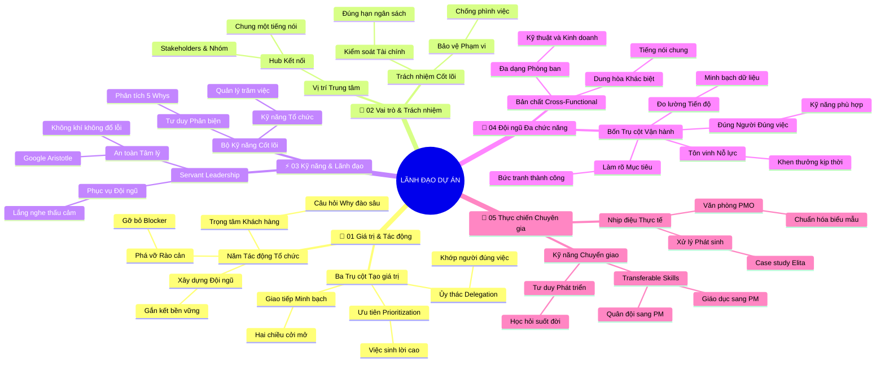

# Tóm Tắt Học Phần 2: Trở Thành Một Người Quản Lý Dự Án Hiệu Quả (v2.4)

## 1. Thông điệp cốt lõi (Core Message)
Một Project Manager hiệu quả là người làm chủ ba trụ cột tạo giá trị (Ưu tiên - Ủy thác - Giao tiếp), thấu hiểu vị trí trung tâm kết nối, vận hành xuất sắc đội ngũ đa chức năng bằng tư duy Servant Leadership và chuyển hóa kỹ năng linh hoạt vào mọi bối cảnh thực tế.

---

## 2. Lược Đồ Phân Bổ Cấu Trúc Tài Liệu (Content Distribution Overview)

| Phần / Đề Mục Tài Liệu Gốc | Nội Dung Trọng Tâm | Số Luận Điểm Đại Diện |
| :--- | :--- | :---: |
| **Phần I: Giá trị & Tác động của PM tới Tổ chức** | 3 trụ cột tạo giá trị, 5 tác động tổ chức, câu hỏi chiến lược khách hàng | 2 Luận điểm |
| **Phần II: Vai trò, Trách nhiệm & Vị trí PM trong Đội ngũ** | Vị trí trung tâm kết nối, điều phối các bên liên quan, phá vỡ rào cản | 2 Luận điểm |
| **Phần III: Kỹ năng Cốt lõi & Nghệ thuật Lãnh đạo Đội ngũ** | Kỹ năng thiết yếu, phong cách Servant Leadership và an toàn tâm lý | 2 Luận điểm |
| **Phần IV: Điều phối Đội ngũ Đa chức năng (Cross-Functional)** | Bản chất nhóm đa chức năng và 4 trụ cột vận hành thành công | 2 Luận điểm |
| **Phần V: Góc nhìn Thực chiến từ các Chuyên gia Google** | Các bài học thực tế, quản lý văn phòng PMO và kỹ năng chuyển giao | 2 Luận điểm |
| **Tổng cộng** | **Bao quát 100% cấu trúc 5 phần của tài liệu** | **10 Luận điểm** |

---

## 3. Luận điểm quan trọng theo cấu trúc tài liệu (Key Takeaways: 10 Luận Điểm Chuyên Sâu)

### 📑 PHẦN I: GIÁ TRỊ & TÁC ĐỘNG CỦA PM TỚI TỔ CHỨC (THE VALUE & IMPACT OF A PM)

1. **BA TRỤ CỘT TẠO GIÁ TRỊ VÀ TÍNH MINH BẠCH (PRIORITIZATION, DELEGATION, COMMUNICATION)**
   - **Bản chất & Phân tích chuyên sâu:** Người quản lý dự án mang lại giá trị to lớn cho tổ chức thông qua ba năng lực cốt lõi: Xác định mức độ ưu tiên (Prioritization) để nhóm tập trung vào nhiệm vụ sinh lời cao nhất; Ủy thác thông minh (Delegation) nhằm trao quyền và khớp đúng việc cho đúng người; và Giao tiếp minh bạch (Effective Communication & Transparency) để thông tin luôn thông suốt hai chiều giữa đội ngũ và khách hàng.
   - **Phương pháp / Công cụ / Quy trình đi kèm:** Ma trận ưu tiên Eisenhower, Ma trận phân công trách nhiệm RACI, Kế hoạch quản lý truyền thông nội bộ.
   - **Ví dụ thực tế đời thường:** Khi sơn lại căn nhà: PM xác định việc cạo sạch tường cũ là ưu tiên số một; phân công người có tay nghề khéo nhất phụ trách viền cửa sổ gỗ; và báo trước cho chủ nhà biết ngày thi công để họ che đậy bàn ghế cẩn thận.

2. **NĂM PHƯƠNG THỨC TẠO TÁC ĐỘNG TỔ CHỨC VÀ ĐẶT TRỌNG TÂM VÀO KHÁCH HÀNG**
   - **Bản chất & Phân tích chuyên sâu:** PM tạo tác động sâu rộng qua 5 phương thức: Tập trung vào khách hàng, Xây dựng đội ngũ xuất sắc, Nuôi dưỡng quan hệ giao tiếp, Quản trị dự án toàn diện, và Phá vỡ rào cản cản trở. Trong đó, khách hàng (cả nội bộ và bên ngoài) là trung tâm. PM phải chủ động đào sâu câu hỏi "Tại sao" (Why) để hiểu tường tận nỗi đau và kỳ vọng thực chất của khách hàng.
   - **Phương pháp / Công cụ / Quy trình đi kèm:** Bộ câu hỏi khai vấn chiến lược khách hàng (Customer-Centric Questioning Framework), Khảo sát đo lường mức độ thỏa mãn (CSAT/NPS).
   - **Ví dụ thực tế đời thường:** Thay vì chỉ nhận yêu cầu "Làm cho tôi một phần mềm giao hàng nhanh", PM hỏi sâu lý do vì sao khách hàng muốn tính năng này và phát hiện ra vấn đề cốt lõi là tỷ lệ hủy đơn hàng do chờ đợi lâu đang làm tụt 20% doanh thu.

---

### 📑 PHẦN II: VAI TRÒ, TRÁCH NHIỆM & VỊ TRÍ PM TRONG ĐỘI NGŨ (ROLES & POSITION WITHIN A TEAM)

3. **VỊ TRÍ TRUNG TÂM KẾT NỐI VÀ ĐIỀU PHỐI CÁC BÊN LIÊN QUAN (STAKEHOLDERS)**
   - **Bản chất & Phân tích chuyên sâu:** PM là "hub" giao tiếp trung tâm, đứng ở giao điểm giữa khách hàng, nhà tài trợ (Sponsor), ban giám đốc và đội ngũ phát triển sản phẩm. PM không trực tiếp tạo ra dòng code hay bản vẽ thiết kế, nhưng chịu trách nhiệm giữ cho tất cả các mắt xích này chuyển động nhịp nhàng, cùng nhìn về một mục tiêu và chung một tiếng nói.
   - **Phương pháp / Công cụ / Quy trình đi kèm:** Sổ đăng ký bên liên quan (Stakeholder Register), Ma trận quyền lực và sự quan tâm (Power/Interest Grid).
   - **Ví dụ thực tế đời thường:** Nhạc trưởng đứng giữa sân khấu: không trực tiếp thổi kèn hay kéo đàn violon, nhưng giữ nhịp phách chung để toàn bộ dàn nhạc 50 người hòa thanh mượt mà không bị lệch nhịp.

4. **TRÁCH NHIỆM BẢO VỆ PHẠM VI VÀ PHÁ VỠ CÁC RÀO CẢN CẢN TRỞ (BREAKING DOWN BARRIERS)**
   - **Bản chất & Phân tích chuyên sâu:** Trách nhiệm lớn nhất của PM là bảo vệ thời hạn (Schedule), ngân sách (Budget) và phạm vi (Scope). Khi phát sinh các trở ngại như chậm giải ngân vốn, thiếu hụt nguyên vật liệu hoặc xung đột giữa các phòng ban, PM phải chủ động đứng ra làm việc với cấp quản lý để gỡ bỏ vật cản (Impediment Removal) trước khi công việc bị đình trệ.
   - **Phương pháp / Công cụ / Quy trình đi kèm:** Quy trình kiểm soát thay đổi (Change Control Process), Bảng theo dõi điểm nghẽn dự án (Blocker & Issue Log).
   - **Ví dụ thực tế đời thường:** Đội thi công đang xây cầu thì bị vướng mặt bằng do một hộ dân chưa chịu di dời; PM trực tiếp phối hợp cùng chính quyền địa phương đàm phán giải phóng mặt bằng để công nhân tiếp tục thi công.

---

### 📑 PHẦN III: KỸ NĂNG CỐT LÕI & NGHỆ THUẬT LÃNH ĐẠO ĐỘI NGŨ (CORE SKILLS & LEADERSHIP)

5. **BỘ KỸ NĂNG CỐT LÕI CỦA PM: TỔ CHỨC, GIAO TIẾP VÀ TƯ DUY PHẢN BIỆN**
   - **Bản chất & Phân tích chuyên sâu:** Quản trị dự án đòi hỏi sự dung hòa giữa kỹ năng phân tích và trí tuệ cảm xúc (EQ). PM cần kỹ năng tổ chức để quản lý hàng trăm đầu việc, tư duy phản biện (Critical Thinking) để nhận diện các giả định sai lầm, và phong cách giao tiếp linh hoạt theo từng đối tượng để truyền cảm hứng và thuyết phục.
   - **Phương pháp / Công cụ / Quy trình đi kèm:** Khung năng lực PMBOK Talent Triangle, Kỹ thuật đặt câu hỏi 5 Whys, Kỹ thuật lắng nghe chủ động (Active Listening).
   - **Ví dụ thực tế đời thường:** Khi nhận báo cáo "Hệ thống bị sập do server quá tải", PM không vội vàng mua thêm server đắt đỏ mà dùng tư duy phản biện tìm hiểu nguyên nhân gốc, phát hiện ra do một đoạn mã vòng lặp vô tận gây nghẽn bộ nhớ.

6. **NGHỆ THUẬT LÃNH ĐẠO PHỤC VỤ (SERVANT LEADERSHIP) VÀ AN TOÀN TÂM LÝ**
   - **Bản chất & Phân tích chuyên sâu:** Lãnh đạo không phải là người ra lệnh mà là người phục vụ đội ngũ. PM thực hành Servant Leadership bằng cách trao quyền tự chủ cho thành viên, lắng nghe thấu cảm và kiến tạo môi trường an toàn tâm lý (Psychological Safety) – nơi mọi người không sợ bị chỉ trích khi thừa nhận sai lầm hoặc nêu ra sáng kiến khác biệt.
   - **Phương pháp / Công cụ / Quy trình đi kèm:** Mô hình Servant Leadership của Robert Greenleaf, Khung an toàn tâm lý Google Aristotle Project.
   - **Ví dụ thực tế đời thường:** Người quản lý tổ chức buổi họp rút kinh nghiệm dự án: Thay vì truy cứu "Ai đã làm hỏng tính năng này?", PM mở đầu bằng câu: "Quy trình nào của chúng ta đã tạo ra sơ hở này và chúng ta có thể cải tiến nó ra sao?".

---

### 📑 PHẦN IV: ĐIỀU PHỐI ĐỘI NGŨ ĐA CHỨC NĂNG (CROSS-FUNCTIONAL TEAMS)

7. **BẢN CHẤT VÀ THÁCH THỨC CỦA ĐỘI NGŨ ĐA CHỨC NĂNG (CROSS-FUNCTIONAL TEAMS)**
   - **Bản chất & Phân tích chuyên sâu:** Đội ngũ đa chức năng tập hợp các chuyên gia từ nhiều phòng ban khác nhau (Kỹ thuật, Thiết kế, Marketing, Pháp chế, Tài chính). Thách thức lớn nhất là mỗi bộ phận có ưu tiên, ngôn ngữ chuyên ngành và văn hóa làm việc riêng biệt. PM phải đóng vai trò là "chất kết dính" dung hòa các góc nhìn đối lập.
   - **Phương pháp / Công cụ / Quy trình đi kèm:** Bản thỏa ước làm việc chung (Team Working Agreements), Ma trận điều phối đa phòng ban.
   - **Ví dụ thực tế đời thường:** Dự án ra mắt một loại nước giải khát mới: Kỹ sư hóa thực phẩm muốn hương vị đậm đà, Thiết kế muốn mẫu chai phá cách, còn Marketing muốn giá thành rẻ; PM điều phối để cả ba cùng thống nhất một phương án khả thi nhất.

8. **BỐN TRỤ CỘT VẬN HÀNH THÀNH CÔNG NHÓM ĐA CHỨC NĂNG (GOALS, SKILLS, PROGRESS, RECOGNITION)**
   - **Bản chất & Phân tích chuyên sâu:** Tài liệu Google chỉ rõ 4 trụ cột thép để dẫn dắt nhóm đa chức năng: (1) Làm rõ mục tiêu (Clarify goals) để mọi người có chung bức tranh thành công; (2) Chiêu mộ nhân sự có kỹ năng phù hợp (Get right skills); (3) Đo lường tiến độ liên tục (Measure progress) qua dữ liệu minh bạch; và (4) Ghi nhận, tôn vinh nỗ lực (Recognize efforts) để duy trì ngọn lửa nhiệt huyết.
   - **Phương pháp / Công cụ / Quy trình đi kèm:** Khung mục tiêu OKRs/KPIs, Bảng Kanban trực quan tiến độ, Hệ thống phần thưởng và công nhận thành tích (Recognition System).
   - **Ví dụ thực tế đời thường:** Trưởng nhóm thiện nguyện xác định rõ mục tiêu cứu trợ 500 suất quà, phân đúng người biết lái xe tải chở đồ, cập nhật số quà đã giao mỗi buổi trưa lên nhóm chat và gửi lời cảm ơn ấm áp tới từng tình nguyện viên sau mỗi ngày.

---

### 📑 PHẦN V: GÓC NHÌN THỰC CHIẾN TỪ CÁC CHUYÊN GIA GOOGLE (REAL-WORLD INSIGHTS & CASE STUDIES)

9. **NHỊP ĐIỆU CÔNG VIỆC THỰC TẾ VÀ QUẢN LÝ VĂN PHÒNG DỰ ÁN (PMO INSIGHTS)**
   - **Bản chất & Phân tích chuyên sâu:** Qua câu chuyện của Elita và Lan tại Google, một ngày thực tế của PM không diễn ra trên lý thuyết mà gắn liền với việc xử lý liên tục các phát sinh bất ngờ. Văn phòng Quản lý Dự án (Project Management Office - PMO) đóng vai trò trung tâm chiến lược: chuẩn hóa biểu mẫu, đào tạo công cụ và định hướng văn hóa quản trị cho toàn công ty.
   - **Phương pháp / Công cụ / Quy trình đi kèm:** Khung vận hành PMO (PMO Framework), Nhật ký công việc PM hàng ngày (Daily PM Log).
   - **Ví dụ thực tế đời thường:** Bộ phận hành chính tổng hợp của trường học: chuẩn hóa mẫu giáo án, cung cấp trang thiết bị giảng dạy và hỗ trợ giải quyết sự cố phát sinh cho giáo viên các khối lớp.

10. **TÍNH LINH HOẠT VÀ KHẢ NĂNG CHUYỂN GIAO KỸ NĂNG TRONG ĐỜI SỐNG (TRANSFERABLE SKILLS)**
    - **Bản chất & Phân tích chuyên sâu:** Qua câu chuyện của Ellen, Amar và Gilbert, quản trị dự án là một siêu năng lực có thể chuyển giao (Transferable Skills) từ bất kỳ ngành nghề nào (giáo dục, y tế, nghệ thuật, quân sự). PM thành công nhờ rèn luyện sự tò mò học hỏi, khả năng thích ứng linh hoạt trước biến động và tư duy coi mọi vấn đề đời sống đều là một dự án cần tối ưu.
    - **Phương pháp / Công cụ / Quy trình đi kèm:** Bản đồ chuyển giao kỹ năng (Skill Transferability Map), Tư duy phát triển (Growth Mindset Framework).
    - **Ví dụ thực tế đời thường:** Một giáo viên chuyển sang làm PM: kỹ năng soạn giáo án chuyển thành lập kế hoạch dự án; kỹ năng quản lý học sinh chuyển thành kỹ năng điều phối nhân sự; và kỹ năng họp phụ huynh chuyển thành kỹ năng quản lý bên liên quan.

---

## 4. Kế hoạch hành động (Action Plan: 20 việc cụ thể)

#### Nhóm 1: Hành động ngay hôm nay (Micro-habits dưới 2 phút - 5 việc)
- [ ] **Hành động 1:** Nhìn vào danh sách việc hôm nay và chọn ra 1 việc ưu tiên cao nhất theo nguyên tắc Prioritization.
- [ ] **Hành động 2:** Hỏi một đồng đội câu hỏi phục vụ: "Có vật cản (blocker) nào đang làm chậm tiến độ của bạn mà tôi có thể giúp không?".
- [ ] **Hành động 3:** Ghi ra giấy câu hỏi "Tại sao" (Why) cho mục tiêu của nhiệm vụ đang làm để làm rõ kỳ vọng khách hàng.
- [ ] **Hành động 4:** Gửi 1 tin nhắn cảm ơn hoặc khen ngợi cụ thể tới một thành viên trong nhóm vì nỗ lực của họ.
- [ ] **Hành động 5:** Xác định rõ 1 đầu việc bạn có thể ủy quyền (Delegate) cho người khác thay vì tự ôm đồm.

#### Nhóm 2: Kế hoạch rèn luyện trong tuần (Áp dụng vào công việc & dự án - 8 việc)
- [ ] **Hành động 6:** Phân loại toàn bộ các bên liên quan của dự án hiện tại vào Ma trận Power/Interest Grid.
- [ ] **Hành động 7:** Thiết lập một buổi gặp mặt ngắn với đại diện khách hàng để làm rõ 4 câu hỏi chiến lược về kỳ vọng dự án.
- [ ] **Hành động 8:** Tổ chức một buổi họp nhóm áp dụng nguyên tắc An toàn tâm lý (Google Aristotle): khích lệ mọi người nói thật về các rủi ro.
- [ ] **Hành động 9:** Xây dựng bản Thỏa ước làm việc chung (Team Working Agreements) cho đội ngũ đa chức năng đang hợp tác.
- [ ] **Hành động 10:** Tạo bảng theo dõi vật cản (Blocker & Issue Log) để cập nhật và gỡ bỏ định kỳ vào đầu giờ mỗi sáng.
- [ ] **Hành động 11:** Rà soát lại kỹ năng giao tiếp minh bạch: gửi báo cáo cập nhật tiến độ súc tích cho cấp trên và các phòng ban liên quan.
- [ ] **Hành động 12:** Lập bảng đo lường tiến độ trực quan (Kanban/Burndown) để cả nhóm đa chức năng cùng nhìn thấy bước tiến mỗi ngày.
- [ ] **Hành động 13:** Thực hiện buổi tổng kết tuần rút kinh nghiệm không đổ lỗi (Blameless Retrospective) cùng đồng đội.

#### Nhóm 3: Thói quen duy trì & Chuyển hóa lâu dài (Phát triển sự nghiệp bền vững - 7 việc)
- [ ] **Hành động 14:** Duy trì nhất quán phong cách lãnh đạo Servant Leadership: luôn đặt sự thành công của đội ngũ lên trước hào quang cá nhân.
- [ ] **Hành động 15:** Xây dựng văn hóa an toàn tâm lý bền vững trong tổ chức, biến sai lầm thành tài sản học tập chung.
- [ ] **Hành động 16:** Rèn luyện kỹ năng tư duy phản biện (Critical Thinking) hàng tuần bằng phương pháp đào sâu 5 Whys trước mọi vấn đề phức tạp.
- [ ] **Hành động 17:** Nâng cao năng lực điều phối đội ngũ đa chức năng, trở thành cầu nối tin cậy giữa khối kỹ thuật và khối kinh doanh.
- [ ] **Hành động 18:** Tìm hiểu mô hình vận hành của Văn phòng Quản trị Dự án (PMO) để chuẩn hóa quy trình làm việc cho doanh nghiệp.
- [ ] **Hành động 19:** Lập bản đồ chuyển giao kỹ năng (Skill Transferability) để định kỳ đúc kết kinh nghiệm sống vào nâng cấp tay nghề quản trị.
- [ ] **Hành động 20:** Định hình bản thân trở thành một người gỡ nút thắt xuất sắc (Master Problem Solver) được mọi đối tác tín nhiệm.

---

## 5. Câu hỏi tự ngẫm (Reflection: 20 câu hỏi sâu sắc)

#### Nhóm 1: Tự vấn Nhận thức & Hệ tư duy (Self-Awareness & Mindset: 5 câu)
1. Bạn đang dẫn dắt dự án với tư duy của một người giám sát kiểm soát hay với tâm thế của một người lãnh đạo phục vụ (Servant Leader)?
2. Bạn có thực sự xem khách hàng là trung tâm của mọi quyết định hay chỉ chăm chăm hoàn thành các đầu việc kỹ thuật máy móc?
3. Trong giao tiếp hàng ngày, bạn đã thực sự minh bạch và thẳng thắn về các khó khăn của dự án với các bên liên quan hay chưa?
4. Bạn có cảm thấy bất an khi ủy quyền công việc quan trọng cho cấp dưới, và nguyên nhân gốc rễ của sự bất an đó là gì?
5. Bạn định nghĩa thế nào là giá trị thực sự mà một Project Manager mang lại cho một doanh nghiệp?

#### Nhóm 2: Nhận diện Thói quen & Điểm mù (Habits & Blind Spots: 5 câu)
1. Bạn có thói quen ôm đồm mọi việc sự vụ (Micromanagement) vì sợ người khác làm không vừa ý mình hay không?
2. Khi nhóm gặp thất bại hoặc chậm tiến độ, phản xạ đầu tiên của bạn là tìm người chịu tội hay tìm kiếm lỗ hổng quy trình?
3. Bạn có thường xuyên quên ghi nhận và tôn vinh nỗ lực của các thành viên thầm lặng trong đội ngũ đa chức năng?
4. Điểm mù nào trong cách bạn giao tiếp đang vô tình dựng lên rào cản ngăn cách giữa nhóm kỹ thuật và ban lãnh đạo?
5. Bạn có lắng nghe đầy đủ câu trả lời của khách hàng hay thường vội vàng đưa ra giải pháp theo định kiến sẵn có của bản thân?

#### Nhóm 3: Ứng dụng Thực tế & Giải quyết Vấn đề (Practical Application & Problem Solving: 5 câu)
1. Khi hai thành viên thuộc hai phòng ban khác nhau trong nhóm đa chức năng xảy ra bất đồng gay gắt, bạn xử lý ra sao?
2. Kỹ thuật cụ thể nào giúp bạn nói lời từ chối khéo léo nhưng cương quyết trước một yêu cầu phình phạm vi bất hợp lý từ bên liên quan?
3. Bạn làm thế nào để biến một cuộc họp cập nhật tiến độ nhàm chán thành một buổi thảo luận tháo gỡ điểm nghẽn đầy năng lượng?
4. Bạn ứng dụng bộ câu hỏi chiến lược cho khách hàng như thế nào để khám phá ra những kỳ vọng ngầm chưa được viết trong hợp đồng?
5. Khi một nhân sự chủ chốt trong dự án đột ngột xin nghỉ, kế hoạch dự phòng nguồn lực của bạn sẽ được kích hoạt như thế nào?

#### Nhóm 4: Bứt phá Giới hạn & Chuyển hóa Tương lai (Breakthrough & Transformation: 5 câu)
1. Những kỹ năng mềm nào trong cuộc sống cá nhân bạn có thể chuyển giao (transfer) ngay lập tức để nâng tầm hiệu suất quản lý dự án?
2. Bạn sẽ xây dựng môi trường làm việc của nhóm mình ra sao để mọi thành viên đều cảm thấy được an toàn tâm lý và cống hiến hết mình?
3. Vai trò tiếp theo mà bạn muốn chinh phục trong sự nghiệp quản trị (Senior PM, PMO Lead, Program Director) đòi hỏi bước đột phá nào từ hôm nay?
4. Bạn muốn các cộng sự đa chức năng nhớ tới bạn là một người quản lý như thế nào sau khi dự án hoàn thành xuất sắc?
5. Hành động cụ thể và mạnh mẽ nhất bạn sẽ thực hiện ngay trong sáng mai để tháo gỡ một rào cản lớn đang cản đường đội ngũ của mình là gì?

---

## 6. Bản Đồ Tư Duy Trực Quan (Visual Mindmap Overview - Bám Sát 5 Phần Tài Liệu)

