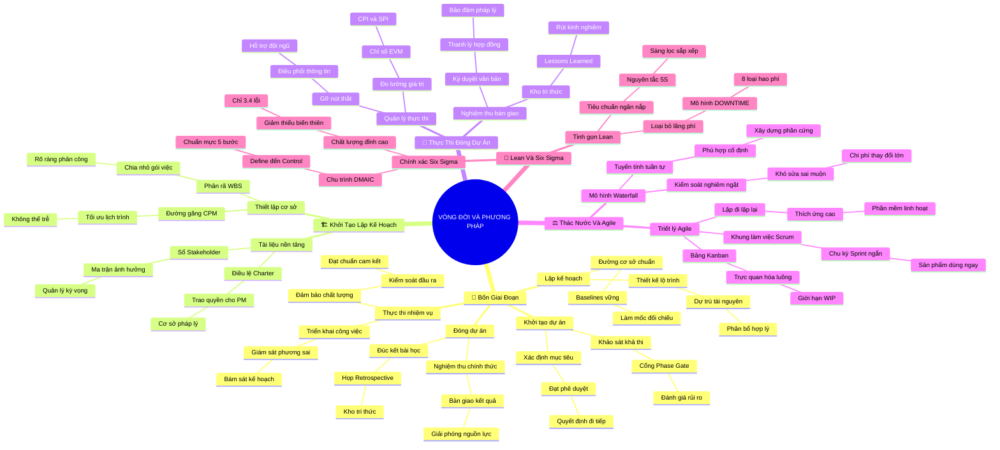

# 🧠 BẢN ĐỒ TƯ DUY TINH GỌN (4-5 TẦNG): HỌC PHẦN 3 - VÒNG ĐỜI & PHƯƠNG PHÁP LUẬN

## 1. Sơ Đồ Tư Duy Trực Quan (Mermaid Mindmap Tinh Gọn)

---

## 2. Cây Phân Cấp Tri Thức Gợi Nhớ Nhanh 4-5 Tầng (Active Recall Hierarchy)

- 📌 **[Phần I: Bốn Giai Đoạn Của Vòng Đời Dự Án]**
  - 🔹 *Khởi tạo ➔ Kế hoạch ➔ Thực thi ➔ Đóng:* ➔ *Lộ trình xuyên suốt* ➔ *Cổng kiểm soát Phase-Gate Reviews* ➔ *Ví dụ: Các bước xây dựng hoàn thiện một căn nhà*
  - 🔹 *Động thái nguồn lực & Chi phí:* ➔ *Chi phí thay đổi tăng theo thời gian* ➔ *Đường cong chữ S (S-Curve)* ➔ *Ví dụ: In sách xong mà muốn sửa một chương thì cực tốn kém*

- 📌 **[Phần II: Thực Tế Triển Khai: Khởi Tạo & Lập Kế Hoạch]**
  - 🔹 *Điều lệ Charter & Stakeholder:* ➔ *Văn bản trao quyền cho PM* ➔ *Ma trận Power-Interest Grid* ➔ *Ví dụ: Ký biên bản góp vốn mở quán cà phê và khảo sát khách*
  - 🔹 *Bộ ba Đường cơ sở (Baselines):* ➔ *Scope, Schedule, Cost Baseline* ➔ *Cấu trúc WBS & Đường găng CPM* ➔ *Ví dụ: Chuẩn bị leo Fansipan lên danh sách đồ và cung đường*

- 📌 **[Phần III: Thực Tế Triển Khai: Thực Thi & Đóng Dự Án]**
  - 🔹 *Quản trị thực thi & Chất lượng:* ➔ *Theo dõi phương sai thực tế* ➔ *Quản lý giá trị EVM (CPI, SPI)* ➔ *Ví dụ: Cầm thước đo kiểm tra độ chuẩn của tủ bếp gỗ*
  - 🔹 *Đóng dự án chuyên nghiệp:* ➔ *Biên bản ký nghiệm thu Sign-off* ➔ *Họp đúc kết Lessons Learned* ➔ *Ví dụ: Tất niên thanh toán nhà hàng và ghi lại kinh nghiệm thực đơn*

- 📌 **[Phần IV: Đối Chiếu Phương Pháp Luận: Thác Nước & Agile]**
  - 🔹 *Thác nước (Waterfall):* ➔ *Tuyến tính, dự đoán trước* ➔ *Phù hợp yêu cầu cố định, rủi ro cao* ➔ *Ví dụ: Xây cầu bắc qua sông phải đúc móng xong mới gác dầm*
  - 🔹 *Linh hoạt (Agile & Scrum):* ➔ *Lặp đi lặp lại thích ứng cao* ➔ *Chu kỳ Sprint 1-4 tuần & Bảng Kanban* ➔ *Ví dụ: Ứng dụng gọi xe ra mắt bản MVP rồi liên tục nâng cấp*

- 📌 **[Phần V: Tinh Gọn & Đột Phá Chất Lượng: Lean & Six Sigma]**
  - 🔹 *Tinh gọn Lean & 5S:* ➔ *Triệt tiêu 8 lãng phí (DOWNTIME)* ➔ *Mô hình tổ chức ngăn nắp 5S* ➔ *Ví dụ: Bếp nhà hàng sắp xếp gia vị tầm tay và chỉ nấu khi có order*
  - 🔹 *Chính xác Six Sigma & DMAIC:* ➔ *Giảm thiểu biến thiên (3.4 lỗi/triệu)* ➔ *Quy trình 5 bước DMAIC* ➔ *Ví dụ: Căn chỉnh áp lực máy rót để 100.000 chai nước đều nhau*

---

## 3. Bảng Neo Trí Nhớ Từ Khóa Vàng (Memory Anchor Cheat Sheet)

| Từ Khóa Cốt Lõi | Phần Trong Tài Liệu | Bản Chất / Vai Trò (3-5 từ) | Tín Hiệu Gợi Nhớ (Memory Trigger) |
| :--- | :--- | :--- | :--- |
| **Project Life Cycle** | Phần I | Bốn giai đoạn vòng đời | Bốn mùa Xuân - Hạ - Thu - Đông của dự án |
| **Phase-Gate Review** | Phần I | Trạm kiểm soát giai đoạn | Trạm thu phí cao tốc duyệt xe mới được đi tiếp |
| **Project Charter** | Phần II | Giấy ủy quyền tối cao | Chiếu thư sắc phong trao quyền cho vị tướng xuất quân |
| **Baseline Triad** | Phần II | Bộ ba thước đo chuẩn | Mốc cọc tiêu đo đạc không ai được tự ý dịch chuyển |
| **EVM (Earned Value)** | Phần III | Đo lường giá trị thực | Đồng hồ đo tốc độ và lượng xăng tiêu hao trên xe |
| **Lessons Learned** | Phần III | Bài học rút kinh nghiệm | Quyển nhật ký hành trình lưu truyền cho hậu thế |
| **Waterfall Model** | Phần IV | Thác nước đổ một chiều | Dòng thác chảy xiết không thể bơi ngược dòng |
| **Agile & Scrum** | Phần IV | Linh hoạt lặp chu kỳ | Thuyền buồm linh hoạt chuyển hướng theo luồng gió |
| **Lean DOWNTIME** | Phần V | Quét sạch 8 lãng phí | Cây chổi quét sạch rác rưởi vương vãi trên sàn |
| **Six Sigma DMAIC** | Phần V | Năm bước triệt sai sót | Kính hiển vi quang học soi từng hạt bụi siêu vi |
