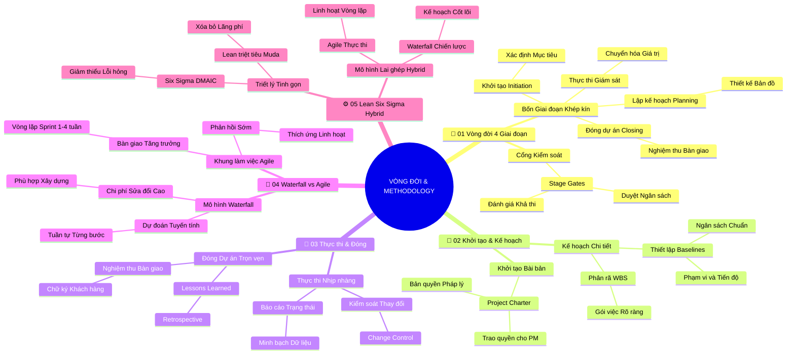

# 🧠 BẢN ĐỒ TƯ DUY TINH GỌN (5 TẦNG): Vòng Đời Dự Án Và Các Phương Pháp Luận (v2.4)

## 1. Sơ Đồ Tư Duy Trực Quan (Mermaid Mindmap Bám Sát 5 Phần Tài Liệu)

---

## 2. Cây Phân Cấp Tri Thức Gợi Nhớ Nhanh 5 Tầng (Active Recall Hierarchy)

- 📌 **[Phần I: Tổng Quan 4 Giai Đoạn Vòng Đời Dự Án]**
  - 🔹 *Bốn Giai đoạn:* ➔ *Khởi tạo (Initiation) ➔ Lập kế hoạch (Planning) ➔ Thực thi (Execution) ➔ Đóng (Closing)*
  - 🔹 *Cổng Kiểm soát:* ➔ *Stage Gates giữa các giai đoạn* ➔ *Đánh giá tính khả thi* ➔ *Phê duyệt tiếp tục giải ngân*
- 📌 **[Phần II: Thực Tế Khởi Tạo & Lập Kế Hoạch]**
  - 🔹 *Giai đoạn Khởi tạo:* ➔ *Xác định Business Case* ➔ *Ký duyệt Project Charter* ➔ *Chính thức trao quyền cho PM*
  - 🔹 *Giai đoạn Lập kế hoạch:* ➔ *Phân rã cấu trúc WBS* ➔ *Thiết lập 3 đường cơ sở (Scope, Schedule, Cost Baselines)*
- 📌 **[Phần III: Thực Tế Thực Thi & Đóng Dự Án]**
  - 🔹 *Giai đoạn Thực thi:* ➔ *Theo dõi tiến độ trên Gantt* ➔ *Quản trị rủi ro phát sinh* ➔ *Kích hoạt Integrated Change Control*
  - 🔹 *Giai đoạn Đóng dự án:* ➔ *Nghiệm thu chính thức (Sign-off)* ➔ *Họp rút kinh nghiệm (Retrospective)* ➔ *Lưu kho tri thức*
- 📌 **[Phần IV: So Sánh Waterfall Và Agile]**
  - 🔹 *Waterfall Tuyến tính:* ➔ *Kế hoạch cố định từ đầu* ➔ *Trình tự từng bước không nhảy cóc* ➔ *Chi phí sửa sai cao*
  - 🔹 *Agile Linh hoạt:* ➔ *Chu kỳ Sprint 1-4 tuần* ➔ *Bàn giao giá trị tăng dần (Incremental)* ➔ *Phản hồi sớm thích ứng nhanh*
- 📌 **[Phần V: Phương Pháp Lean, Six Sigma & Hybrid]**
  - 🔹 *Lean & Six Sigma:* ➔ *Triệt tiêu 7 loại lãng phí (Muda)* ➔ *Cải tiến quy trình DMAIC 5 bước* ➔ *Hạn chế việc đang làm (WIP)*
  - 🔹 *Mô hình Hybrid:* ➔ *Waterfall cho kế hoạch tổng thể & ngân sách* ➔ *Agile cho vòng lặp thực thi của nhóm*

---

## 3. Bảng Neo Trí Nhớ Từ Khóa Vàng (Memory Anchor Cheat Sheet)

| Từ Khóa Cốt Lõi | Phần Trong Tài Liệu | Bản Chất / Vai Trò (3-5 từ) | Tín Hiệu Gợi Nhớ (Memory Trigger) |
| :--- | :--- | :--- | :--- |
| **Stage Gate** | Phần I | Cổng kiểm soát phê duyệt giai đoạn | Trạm thu phí kiểm tra vé trước khi vào cao tốc |
| **Cost S-Curve** | Phần I | Đường cong chi phí hình chữ S | Đồ thị hình con dốc thoải leo lên đỉnh núi rồi thoai thoải xuống |
| **Project Charter** | Phần II | Bản điều lệ pháp lý khai sinh dự án | Giấy khai sinh và giấy phép kinh doanh của một công ty |
| **Baselines** | Phần II | Bộ ba đường cơ sở chuẩn để đối chiếu | Cọc mốc ranh giới đất được đóng cọc cố định |
| **Change Control** | Phần III | Quy trình kiểm soát thay đổi chặt chẽ | Trạm hải quan kiểm tra hành lý nghiêm ngặt tại sân bay |
| **Retrospective** | Phần III | Buổi họp đúc kết bài học sau dự án | Buổi họp mặt gia đình cuối năm cùng nhau tâm tình chia sẻ |
| **Waterfall Model** | Phần IV | Mô hình tuần tự theo một chiều | Dòng thác nước đổ thẳng xuống không bao giờ chảy ngược |
| **Sprint** | Phần IV | Vòng lặp bàn giao ngắn từ 1-4 tuần | Chặng chạy tiếp sức 100 mét chuyển giao gậy cho đồng đội |
| **Muda (Waste)** | Phần V | Bảy loại lãng phí cần triệt tiêu | Cỏ dại mọc lấn át chất dinh dưỡng trong vườn hoa |
| **DMAIC** | Phần V | Chu trình 5 bước cải tiến Six Sigma | Năm ngón tay phối hợp nhịp nhàng trên một bàn tay |
| **WIP Limit** | Phần V | Giới hạn số lượng việc đang làm dở | Cây cầu chỉ cho phép tối đa 5 xe tải qua cùng một lúc |
| **Hybrid Approach** | Phần V | Mô hình kết hợp Waterfall và Agile | Chiếc xe ô tô lai xăng điện tiết kiệm và cơ động |
