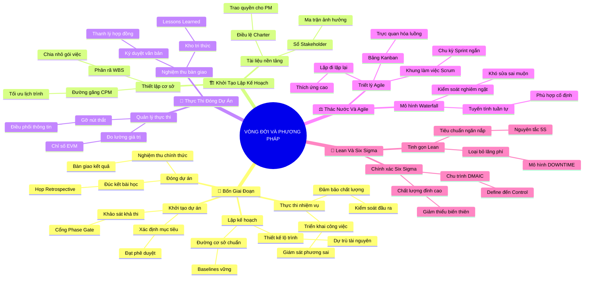

# Tóm Tắt Học Phần 3: Vòng Đời Quản Trị Dự Án Và Các Phương Pháp Luận (The Project Management Life Cycle and Methodologies)

## 1. Thông điệp cốt lõi (Core Message)
> Làm chủ bốn giai đoạn của vòng đời dự án (Khởi tạo - Lập kế hoạch - Thực thi - Đóng dự án) và kết hợp linh hoạt các phương pháp luận (Thác nước, Agile/Scrum, Lean và Six Sigma) là chìa khóa giúp người quản lý dự án chuyển hóa mọi mục tiêu phức tạp thành kết quả chuẩn xác và bền vững.

---

## 2. Lược Đồ Phân Bổ Cấu Trúc Tài Liệu (Content Distribution Overview)

| Phần / Đề Mục Tài Liệu Gốc | Nội Dung Trọng Tâm | Số Luận Điểm Đại Diện |
| :--- | :--- | :---: |
| **Phần I: Bốn Giai Đoạn Của Vòng Đời Dự Án** *(Exploring Project Life Cycle Phases)* | Tổng quan 4 giai đoạn: Khởi tạo (Initiate), Lập kế hoạch (Plan), Thực thi (Execute), Đóng dự án (Close) và vai trò của từng pha. | 2 Luận điểm |
| **Phần II: Thực Tế Triển Khai: Khởi Tạo & Lập Kế Hoạch** *(Phases in Action: Initiating & Planning)* | Thiết lập Điều lệ dự án (Charter), phân tích các bên liên quan, xây dựng cấu trúc WBS, lịch trình và ngân sách cơ sở. | 2 Luận điểm |
| **Phần III: Thực Tế Triển Khai: Thực Thi & Đóng Dự Án** *(Phases in Action: Executing & Closing)* | Điều phối tác vụ, kiểm soát chất lượng, bàn giao sản phẩm, nghiệm thu chính thức và đúc kết bài học (Retrospective). | 2 Luận điểm |
| **Phần IV: Đối Chiếu Phương Pháp Luận: Thác Nước & Agile** *(Overview of Waterfall & Agile)* | So sánh Thác nước (tuyến tính, dự đoán trước) và Agile (lặp đi lặp lại, thích ứng cao); khung làm việc Scrum và bảng Kanban. | 2 Luận điểm |
| **Phần V: Tinh Gọn & Đột Phá Chất Lượng: Lean & Six Sigma** *(Introduction to Lean & Six Sigma)* | Triết lý Lean loại bỏ 8 loại lãng phí (Muda), phương pháp 5S, quy trình 5 bước cải tiến DMAIC của Six Sigma và mô hình lai Lean Six Sigma. | 2 Luận điểm |
| **Tổng cộng** | **Bao quát 100% cấu trúc 5 phần của tài liệu gốc** | **10 Luận điểm** |

---

## 3. Luận điểm quan trọng theo cấu trúc tài liệu (Key Takeaways: 10 Luận Điểm Chuyên Sâu)

### 📑 PHẦN I: BỐN GIAI ĐOẠN CỦA VÒNG ĐỜI DỰ ÁN (EXPLORING PHASES)

1. **BẢN CHẤT TUẦN TỰ VÀ MỤC TIÊU CỐT LÕI CỦA BỐN GIAI ĐOẠN**
   - **Bản chất & Phân tích chuyên sâu:** Vòng đời dự án là lộ trình chuẩn tắc dẫn dắt một ý tưởng từ lúc hình thành đến khi nghiệm thu hoàn tất. Bốn giai đoạn bao gồm: Khởi tạo (xác định mục tiêu và xin phê duyệt), Lập kế hoạch (vạch rõ đường đi nước bước và dự trù tài nguyên), Thực thi (triển khai các tác vụ và giám sát chất lượng), và Đóng dự án (bàn giao thành phẩm và giải phóng nguồn lực). Mỗi giai đoạn đều có cổng kiểm soát (Phase Gates) để quyết định có đi tiếp hay dừng lại.
   - **Phương pháp / Công cụ / Quy trình đi kèm:** Cổng kiểm soát giai đoạn (Phase-Gate Review), Báo cáo tính khả thi (Feasibility Study), Sơ đồ vòng đời dự án (Project Life Cycle Map).
   - **Ví dụ thực tế đời thường:** Quá trình xây dựng một ngôi nhà: Khảo sát địa chất và xin giấy phép xây dựng (Khởi tạo) $\to$ Thuê kiến trúc sư vẽ bản thiết kế và tính dự toán (Lập kế hoạch) $\to$ Đổ móng, xây thô và hoàn thiện nội thất (Thực thi) $\to$ Nghiệm thu công trình và dọn vào ở (Đóng dự án).

2. **DÒNG CHẢY NĂNG LƯỢNG VÀ NGUỒN LỰC THEO THỜI GIAN**
   - **Bản chất & Phân tích chuyên sâu:** Nguồn lực, chi phí và mức độ tham gia của nhân sự không dàn trải đều mà tăng dần từ Khởi tạo, đạt đỉnh cực đại ở giai đoạn Thực thi, và giảm dốc nhanh chóng ở giai đoạn Đóng dự án. Ngược lại, mức độ bất định và rủi ro cao nhất ở giai đoạn Khởi tạo và giảm dần theo thời gian khi các quyết định được hiện thực hóa; chi phí cho việc thay đổi yêu cầu lại tăng vọt theo cấp số nhân nếu phát hiện muộn ở các pha sau.
   - **Phương pháp / Công cụ / Quy trình đi kèm:** Đường cong phân bổ chi phí dự án (Project Cost Curve), Biểu đồ đường cong chữ S (S-Curve), Biểu đồ chi phí thay đổi (Cost of Changes Curve).
   - **Ví dụ thực tế đời thường:** Viết một cuốn sách: lúc lên ý tưởng thì chi phí gần như bằng không nhưng rủi ro không viết được rất cao; khi đã in ra hàng ngàn cuốn sách (pha cuối) mà muốn sửa lại một chương thì chi phí thu hồi và in lại cực kỳ tốn kém.

---

### 📑 PHẦN II: THỰC TẾ TRIỂN KHAI: KHỞI TẠO & LẬP KẾ HOẠCH (INITIATING & PLANNING)

3. **GIAI ĐOẠN KHỞI TẠO: ĐIỀU LỆ DỰ ÁN VÀ ĐỊNH VỊ BÊN LIÊN QUAN**
   - **Bản chất & Phân tích chuyên sâu:** Giai đoạn Khởi tạo là bước tạo nền móng pháp lý và sự đồng thuận tối cao cho dự án. Hai tài liệu sống còn phải được tạo ra: Điều lệ dự án (Project Charter) - văn bản trao quyền chính thức cho PM huy động tài nguyên công ty; và Sổ đăng ký các bên liên quan (Stakeholder Register) - phân tích ai là người ảnh hưởng hoặc bị ảnh hưởng bởi dự án, mức độ quan tâm và quyền lực của họ.
   - **Phương pháp / Công cụ / Quy trình đi kèm:** Điều lệ dự án (Project Charter), Ma trận Quyền lực - Lợi ích (Power-Interest Grid), Tiêu chí thành công của dự án (Success Metrics).
   - **Ví dụ thực tế đời thường:** Mở một quán cà phê: Lập biên bản góp vốn có chữ ký của tất cả cổ đông trao quyền cho bạn điều hành (Project Charter), đồng thời khảo sát cư dân xung quanh và chính quyền sở tại (Stakeholder Analysis).

4. **GIAI ĐOẠN LẬP KẾ HOẠCH: BỘ BA ĐƯỜNG CƠ SỞ VÀ KẾ HOẠCH TOÀN DIỆN**
   - **Bản chất & Phân tích chuyên sâu:** Lập kế hoạch là giai đoạn chi tiết hóa mọi cam kết thành các bản thiết kế hành động. PM phải thiết lập được 3 "Đường cơ sở" (Baselines) bất biến để làm mốc đối chiếu sau này: Đường cơ sở phạm vi (Scope Baseline từ WBS), Đường cơ sở lịch trình (Schedule Baseline từ Gantt Chart), và Đường cơ sở chi phí (Cost Baseline từ ngân sách chi tiết). Bất kỳ sự thay đổi nào vượt khỏi đường cơ sở này đều phải qua hội đồng duyệt thay đổi (CCB).
   - **Phương pháp / Công cụ / Quy trình đi kèm:** Cấu trúc phân rã công việc (WBS & WBS Dictionary), Phương pháp Đường găng (Critical Path Method - CPM), Hội đồng kiểm soát thay đổi (Change Control Board - CCB).
   - **Ví dụ thực tế đời thường:** Chuẩn bị chuyến leo núi Fansipan: lên danh sách chi tiết các đồ bảo hộ cần mua (Scope), xác định cung đường và các trạm nghỉ theo giờ (Schedule), dự trù tiền thuê người dẫn đường và đồ ăn (Cost).

---

### 📑 PHẦN III: THỰC TẾ TRIỂN KHAI: THỰC THI & ĐÓNG DỰ ÁN (EXECUTING & CLOSING)

5. **GIAI ĐOẠN THỰC THI: ĐIỀU PHỐI, GIÁM SÁT VÀ QUẢN TRỊ CHẤT LƯỢNG**
   - **Bản chất & Phân tích chuyên sâu:** Đây là giai đoạn đội ngũ bắt tay vào biến bản kế hoạch thành sản phẩm thực tế, chiếm phần lớn ngân sách và năng lượng dự án. Vai trò của PM chuyển từ "kiến trúc sư" sang "người giám sát và gỡ nút thắt". PM theo dõi sát sao phương sai giữa thực tế với đường cơ sở, quản lý luồng thông tin và đảm bảo các đầu ra thỏa mãn đúng tiêu chuẩn chất lượng đã cam kết.
   - **Phương pháp / Công cụ / Quy trình đi kèm:** Quản lý giá trị thu được (Earned Value Management - EVM với các chỉ số CPI, SPI), Bảng kiểm tra chất lượng (Quality Checklists), Báo cáo tiến độ định kỳ (Progress Status Reports).
   - **Ví dụ thực tế đời thường:** Thi công nội thất căn hộ: thợ thi công lắp đặt theo bản vẽ, PM hàng ngày tới công trình cầm thước đo kiểm tra xem tủ bếp có làm đúng kích thước và gỗ có đạt chuẩn chống ẩm như hợp đồng đã ghi hay không.

6. **GIAI ĐOẠN ĐÓNG DỰ ÁN: BÀN GIAO, NGHIỆM THU VÀ BÀI HỌC KINH NGHIỆM**
   - **Bản chất & Phân tích chuyên sâu:** Nhiều dự án thất bại ở khâu về đích vì không đóng được dự án một cách chuyên nghiệp. Đóng dự án đòi hỏi: (1) Khách hàng ký văn bản nghiệm thu chính thức; (2) Thanh lý toàn bộ hợp đồng nhà thầu; (3) Bàn giao tài liệu vận hành cho đội ngũ bảo trì; (4) Giải phóng và tri ân nhân sự; và (5) Tổ chức buổi tổng kết bài học kinh nghiệm (Retrospective / Post-mortem) để ghi nhận những gì làm tốt và những gì cần cải tiến cho tương lai.
   - **Phương pháp / Công cụ / Quy trình đi kèm:** Biên bản nghiệm thu bàn giao (Sign-off Document), Báo cáo tổng kết dự án (Project Closure Report), Tài liệu bài học kinh nghiệm (Lessons Learned Register).
   - **Ví dụ thực tế đời thường:** Sau tiệc tất niên công ty: kiểm tra thanh toán nốt tiền cho nhà hàng, trả lại trang thiết bị thuê ngoài, cảm ơn ban tổ chức và họp 30 phút ghi lại danh sách những món ăn bị thừa để năm sau rút kinh nghiệm.

---

### 📑 PHẦN IV: ĐỐI CHIẾU PHƯƠNG PHÁP LUẬN: THÁC NƯỚC & AGILE (WATERFALL VS. AGILE)

7. **PHƯƠNG PHÁP LUẬN THÁC NƯỚC (WATERFALL): TUYẾN TÍNH VÀ TIÊN ĐOÁN**
   - **Bản chất & Phân tích chuyên sâu:** Waterfall là phương pháp luận truyền thống, nơi các giai đoạn nối tiếp nhau như dòng thác đổ: giai đoạn trước phải hoàn tất và nghiệm thu 100% thì giai đoạn sau mới được bắt đầu. Phương pháp này cực kỳ hiệu quả đối với các dự án có yêu cầu rõ ràng ngay từ đầu, ít thay đổi, chi phí sửa sai cao (như xây dựng, sản xuất phần cứng, y tế, hàng không vũ trụ).
   - **Phương pháp / Công cụ / Quy trình đi kèm:** Kế hoạch thác nước tuần tự (Sequential Phases), Biểu đồ Gantt truyền thống, Cổng phê duyệt tài liệu nghiêm ngặt.
   - **Ví dụ thực tế đời thường:** Xây một cây cầu bắc qua sông: phải khảo sát địa chất và đổ móng trụ cầu xong xuôi mới có thể gác dầm cầu và thảm nhựa mặt cầu, tuyệt đối không thể vừa xây vừa thử nghiệm đổi thiết kế móng.

8. **PHƯƠNG PHÁP LUẬN LINH HOẠT (AGILE) VÀ KHUNG LÀM VIỆC SCRUM**
   - **Bản chất & Phân tích chuyên sâu:** Agile là triết lý quản trị thích ứng, chia nhỏ dự án thành các chu kỳ lặp ngắn (Sprints từ 1-4 tuần), sau mỗi chu kỳ đều xuất xưởng một phần sản phẩm dùng được ngay (Potentially Shippable Product). Agile tôn trọng sự thay đổi, tập trung vào phản hồi thực tế của khách hàng thay vì bám cứng vào kế hoạch ban đầu. Scrum là khung làm việc phổ biến nhất của Agile với 3 vai trò (Product Owner, Scrum Master, Developers) và 4 sự kiện chính.
   - **Phương pháp / Công cụ / Quy trình đi kèm:** Khung làm việc Scrum (Sprint Planning, Daily Scrum, Sprint Review, Sprint Retrospective), Bảng Kanban, Biểu đồ cháy (Burndown Chart).
   - **Ví dụ thực tế đời thường:** Phát triển ứng dụng di động: thay vì mất 2 năm viết toàn bộ tính năng, đội ngũ ra mắt bản rút gọn (MVP) chỉ có chức năng đăng nhập và gọi xe trong vòng 2 tuần, sau đó liên tục nâng cấp tính năng thanh toán thẻ và khuyến mãi dựa trên đánh giá của người dùng.

---

### 📑 PHẦN V: TINH GỌN & ĐỘT PHÁ CHẤT LƯỢNG: LEAN & SIX SIGMA (LEAN & SIX SIGMA)

9. **TRIẾT LÝ LEAN: TRIỆT TIÊU 8 LOẠI LÃNG PHÍ VÀ MÔ HÌNH 5S**
   - **Bản chất & Phân tích chuyên sâu:** Khởi nguồn từ Hệ thống sản xuất Toyota (TPS), Lean tập trung tối đa hóa giá trị cho khách hàng bằng cách loại bỏ mọi hoạt động không tạo ra giá trị gia tăng (Lãng phí - Muda). Lean nhận diện 8 loại lãng phí (DOWNTIME: Defects - Khuyết tật, Overproduction - Sản xuất thừa, Waiting - Chờ đợi, Non-utilized Talent - Lãng phí tài năng, Transportation - Vận chuyển thừa, Inventory - Tồn kho, Motion - Thao tác thừa, Extra-processing - Gia công quá mức) và áp dụng 5S để giữ môi trường làm việc ngăn nắp.
   - **Phương pháp / Công cụ / Quy trình đi kèm:** Mô hình 8 lãng phí (DOWNTIME), Tiêu chuẩn 5S (Seiri - Sàng lọc, Seiton - Sắp xếp, Seiso - Sạch sẽ, Seiketsu - Săn sóc, Shitsuke - Sẵn sàng), Sơ đồ chuỗi giá trị (Value Stream Mapping - VSM).
   - **Ví dụ thực tế đời thường:** Tối ưu hóa gian bếp nhà hàng: sắp xếp gia vị và dao thớt ngay tầm tay đầu bếp (loại bỏ Motion), chỉ nấu khi có đơn gọi món (loại bỏ Overproduction) và rửa sạch dụng cụ ngay sau khi dùng (5S).

10. **SIX SIGMA, MÔ HÌNH DMAIC VÀ SỰ KẾT HỢP LEAN SIX SIGMA**
    - **Bản chất & Phân tích chuyên sâu:** Được tiên phong bởi Motorola và phát triển rực rỡ tại General Electric, Six Sigma là phương pháp tiếp cận dựa trên dữ liệu thống kê nhằm triệt tiêu các biến thiên và lỗi sai trong quy trình, hướng tới tỷ lệ hoàn hảo 99.99966% (chỉ 3.4 lỗi trên một triệu cơ hội). Six Sigma vận hành theo chu trình 5 bước chuẩn mực DMAIC (Define - Đo lường, Measure - Đo đạc, Analyze - Phân tích, Improve - Cải tiến, Control - Kiểm soát). Khi kết hợp thành Lean Six Sigma, doanh nghiệp vừa đạt tốc độ xử lý nhanh (Lean) vừa đạt chất lượng chính xác tuyệt đối (Six Sigma).
    - **Phương pháp / Công cụ / Quy trình đi kèm:** Chu trình DMAIC, Biểu đồ nguyên nhân - kết quả Xương cá (Ishikawa/Fishbone Diagram), Biểu đồ kiểm soát thống kê (Statistical Process Control - SPC).
    - **Ví dụ thực tế đời thường:** Dây chuyền đóng chai nước khoáng: áp dụng DMAIC để tìm nguyên nhân tại sao có 1% chai bị đóng vơi nước, phân tích dữ liệu áp suất vòi bơm để căn chỉnh lại máy, giúp 100.000 chai đều tăm tắp đúng thể tích 500ml.

---

## 4. Kế hoạch hành động (Action Plan: 18 việc cụ thể)

#### Nhóm 1: Hành động ngay hôm nay (Micro-habits dưới 2 phút - 5 việc)
- [ ] **Hành động 1:** Xác định 1 dự án cá nhân hoặc công việc hiện tại của bạn đang nằm ở giai đoạn nào trong 4 pha (Khởi tạo, Kế hoạch, Thực thi, Đóng).
- [ ] **Hành động 2:** Tải một biểu mẫu Bảng Kanban cá nhân trên Trello hoặc Notion và tạo 3 cột cơ bản: To Do, In Progress, Done.
- [ ] **Hành động 3:** Dọn dẹp bàn làm việc cá nhân theo nguyên tắc 5S: vứt bỏ ngay 3 đồ vật không còn giá trị sử dụng (Sàng lọc - Seiri).
- [ ] **Hành động 4:** Viết ra giấy 1 loại lãng phí (chờ đợi, thao tác thừa, hoặc sửa lỗi) mà bạn gặp phải nhiều nhất trong ngày hôm nay.
- [ ] **Hành động 5:** Nhắn tin hỏi một đồng nghiệp hoặc đối tác để xác nhận xem tiêu chí hoàn thành (Definition of Done) của một công việc chung đã rõ ràng chưa.

#### Nhóm 2: Kế hoạch rèn luyện trong tuần (Áp dụng vào công việc & đời sống - 7 việc)
- [ ] **Hành động 6:** Phác thảo một bản Điều lệ Dự án (Project Charter) ngắn 1 trang giấy cho một ý tưởng công việc mới mà bạn đang ấp ủ.
- [ ] **Hành động 7:** Lập biểu đồ Gantt đơn giản cho 1 kế hoạch diễn ra trong tháng tới trên Excel hoặc Google Sheets để thấy rõ các mốc bàn giao.
- [ ] **Hành động 8:** Tổ chức một buổi họp rút kinh nghiệm ngắn (Sprint Retrospective) với nhóm sau khi kết thúc một đợt công việc, thảo luận: Làm tốt gì? Cần cải tiến gì?.
- [ ] **Hành động 9:** Vẽ sơ đồ chuỗi giá trị (Value Stream Mapping) cho 1 quy trình làm việc quen thuộc để chỉ ra những bước làm mất nhiều thời gian chờ đợi nhất.
- [ ] **Hành động 10:** Áp dụng phương pháp phân tích nguyên nhân gốc rễ Xương cá (Ishikawa Diagram) để mổ xẻ một lỗi kỹ thuật hoặc sự cố vừa xảy ra.
- [ ] **Hành động 11:** Thiết lập một buổi đánh giá cổng kiểm soát giai đoạn (Phase-Gate Review) trước khi chuyển từ khâu lập kế hoạch sang triển khai thực tế.
- [ ] **Hành động 12:** Thử nghiệm áp dụng chu kỳ Sprint 1 tuần cho công việc cá nhân: lập kế hoạch đầu tuần, rà soát giữa tuần và nghiệm thu cuối tuần.

#### Nhóm 3: Thói quen duy trì & Chuyển hóa lâu dài (Phát triển bền vững - 6 việc)
- [ ] **Hành động 13:** Duy trì thói quen tổ chức buổi tổng kết bài học kinh nghiệm (Lessons Learned) chính thức cho mọi dự án trước khi giải tán đội ngũ.
- [ ] **Hành động 14:** Xây dựng tư duy linh hoạt (Agile Mindset): sẵn sàng đón nhận và thích ứng với thay đổi thay vì cứng nhắc bám theo kế hoạch lỗi thời.
- [ ] **Hành động 15:** Thực hành triết lý cải tiến liên tục (Kaizen): mỗi tuần tìm cách tối ưu hóa để giảm 5% thời gian thực hiện một tác vụ lặp lại.
- [ ] **Hành động 16:** Nghiên cứu và thi lấy các chứng chỉ phương pháp luận chuyên sâu như Professional Scrum Master (PSM I) hoặc Lean Six Sigma Green Belt.
- [ ] **Hành động 17:** Xây dựng một thư viện các biểu mẫu nghiệm thu dự án (Project Closure Checklists) để chuẩn hóa khâu kết thúc dự án của phòng ban.
- [ ] **Hành động 18:** Định kỳ hàng quý rà soát lại 8 loại lãng phí (DOWNTIME) trong toàn bộ quy trình làm việc của đội ngũ để tinh gọn bộ máy.

---

## 5. Câu hỏi tự ngẫm (Reflection: 24 câu hỏi sâu sắc)

#### Nhóm 1: Tự vấn Nhận thức & Hệ tư duy (Self-Awareness & Mindset: 6 câu)
1. Bản thân tôi có xu hướng nghiêng về phong cách quản lý tiên đoán chặt chẽ (Waterfall) hay phong cách thích ứng linh hoạt (Agile)?
2. Khi dự án gặp thay đổi lớn ngoài dự kiến, tôi thường cảm thấy hoang mang phản kháng hay nhìn nhận đó là cơ hội để cải tiến sản phẩm?
3. Tôi có đang dành quá nhiều thời gian cho khâu chuẩn bị (lập kế hoạch) đến mức rơi vào tê liệt hành động (analysis paralysis) hay không?
4. Đội ngũ của tôi có thực sự hiểu rõ sự khác biệt giữa "kết thúc công việc" và "đóng dự án chính thức có nghiệm thu" hay không?
5. Tôi nhìn nhận lãng phí (Muda) trong quy trình làm việc như một điều hiển nhiên không thể tránh khỏi, hay như một kẻ thù cần phải triệt tiêu?
6. Chân lý cốt lõi nào trong sự kết hợp giữa Lean và Six Sigma khiến tôi thay đổi góc nhìn về chất lượng công việc nhất?

#### Nhóm 2: Nhận diện Thói quen & Điểm mù (Habits & Blind Spots: 6 câu)
7. Tôi có thói quen nhảy bổ ngay vào thực thi công việc mà bỏ qua giai đoạn Khởi tạo và Lập kế hoạch cơ bản hay không?
8. Trong quá trình triển khai, tôi có thường xuyên đối chiếu tiến độ thực tế với các Đường cơ sở (Baselines), hay chỉ dựa vào cảm tính mơ hồ?
9. Dự án của tôi có thường rơi vào tình trạng "xâm lấn phạm vi" (Scope Creep) do không có quy trình kiểm soát thay đổi (Change Control) chặt chẽ?
10. Tôi có hay bỏ qua buổi họp rút kinh nghiệm (Retrospective) vì lý do bận rộn, để rồi lặp lại đúng những sai lầm cũ trong dự án tiếp theo?
11. Đâu là loại lãng phí lớn nhất trong 8 loại lãng phí DOWNTIME đang âm thầm rút cạn năng lượng và thời gian làm việc mỗi ngày của tôi?
12. Tôi có đang áp dụng phương pháp Agile một cách nửa vời (Agile giả tạo) - chỉ dùng bảng Kanban và họp đứng nhưng vẫn tư duy độc đoán kiểu cũ?

#### Nhóm 3: Ứng dụng Thực tế & Giải quyết Vấn đề (Practical Application: 6 câu)
13. Với một dự án phần mềm có yêu cầu thay đổi liên tục theo thị hiếu người dùng, tôi sẽ cấu hình chu kỳ Sprint và vai trò Scrum như thế nào?
14. Khi nào thì tôi nhất quyết phải áp dụng mô hình Thác nước (Waterfall) thay vì chạy theo trào lưu Agile để bảo đảm an toàn dự án?
15. Làm thế nào để áp dụng quy trình 5 bước DMAIC của Six Sigma để giảm thiểu tỷ lệ lỗi hoặc sự phàn nàn của khách hàng trong dịch vụ hiện tại?
16. Nếu nhà tài trợ dự án yêu cầu cắt ngắn 1 tháng tiến độ ở pha Thực thi, tôi sẽ sử dụng phương pháp Đường găng (CPM) như thế nào để đàm phán?
17. Bằng cách nào tôi có thể áp dụng nguyên tắc 5S vào việc quản lý dữ liệu số, thư điện tử và tài liệu dùng chung trên Google Drive của công ty?
18. Tôi sẽ thiết kế một buổi họp Retrospective như thế nào để mọi thành viên cởi mở chia sẻ sai sót mà không sợ bị phán xét hay trừng phạt?

#### Nhóm 4: Bứt phá Giới hạn & Chuyển hóa Tương lai (Breakthrough & Transformation: 6 câu)
19. Làm thế nào để tôi có thể làm chủ mô hình quản trị lai (Hybrid Project Management) - kết hợp thế mạnh kiểm soát của Waterfall và tốc độ của Agile?
20. Tôi có thể đóng góp sáng kiến gì để loại bỏ ít nhất 2 bước thừa thãi gây lãng phí thời gian chờ đợi trong quy trình làm việc hiện tại của công ty?
21. Nếu trở thành người dẫn dắt quá trình chuyển đổi số cho doanh nghiệp, tôi sẽ lựa chọn phương pháp luận nào làm bàn đạp chiến lược?
22. Khung năng lực về chất lượng Six Sigma có thể mở ra những cơ hội thăng tiến vượt bậc nào cho sự nghiệp quản lý của tôi trong 3 năm tới?
23. Tôi muốn xây dựng văn hóa làm việc trong đội ngũ của mình như thế nào: kỷ luật như quân đội (Six Sigma) hay sáng tạo không ngừng (Agile)?
24. Hành động cụ thể đầu tiên tôi sẽ làm vào ngày mai để nâng cao hiệu suất và giảm thiểu lãng phí cho chính bản thân là gì?

---

## 6. Bản Đồ Tư Duy Trực Quan (Visual Mindmap Overview - Tinh Gọn 4-5 Tầng)

