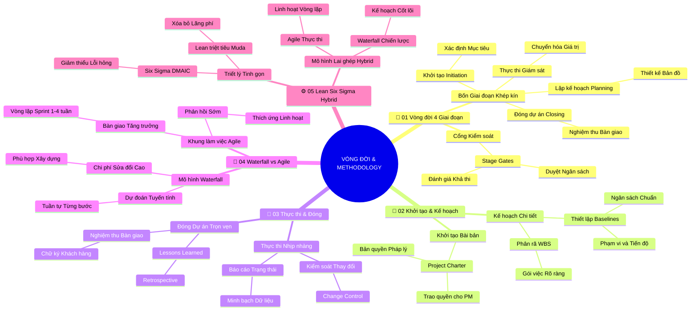

# Tóm Tắt Học Phần 3: Vòng Đời Dự Án Và Các Phương Pháp Luận (v2.4)

## 1. Thông điệp cốt lõi (Core Message)
Thành công của dự án bắt nguồn từ việc làm chủ 4 giai đoạn vòng đời khép kín và lựa chọn chính xác phương pháp luận phù hợp (Waterfall cho mục tiêu cố định, Agile cho môi trường biến động, hoặc Lean/Hybrid cho tối ưu hóa hiệu suất).

---

## 2. Lược Đồ Phân Bổ Cấu Trúc Tài Liệu (Content Distribution Overview)

| Phần / Đề Mục Tài Liệu Gốc | Nội Dung Trọng Tâm | Số Luận Điểm Đại Diện |
| :--- | :--- | :---: |
| **Phần I: Tổng Quan 4 Giai Đoạn Vòng Đời Dự Án** | Khái niệm vòng đời, dòng chảy giá trị và các cổng kiểm soát (Stage Gates) | 2 Luận điểm |
| **Phần II: Thực Tế Khởi Tạo & Lập Kế Hoạch** | Điều lệ dự án (Project Charter), phân rã WBS và thiết lập các đường cơ sở | 2 Luận điểm |
| **Phần III: Thực Tế Thực Thi & Đóng Dự Án** | Quản lý tiến độ, nghiệm thu bàn giao và đúc kết bài học (Retrospective) | 2 Luận điểm |
| **Phần IV: So Sánh Waterfall Và Agile** | Dự đoán tuyến tính vs. Bàn giao tăng dần (Incremental Value) qua Sprint | 2 Luận điểm |
| **Phần V: Phương Pháp Lean, Six Sigma & Hybrid** | Triệt tiêu lãng phí (Muda), cải tiến DMAIC và mô hình lai ghép thực chiến | 2 Luận điểm |
| **Tổng cộng** | **Bao quát 100% cấu trúc 5 phần của tài liệu** | **10 Luận điểm** |

---

## 3. Luận điểm quan trọng theo cấu trúc tài liệu (Key Takeaways: 10 Luận Điểm Chuyên Sâu)

### 📑 PHẦN I: TỔNG QUAN 4 GIAI ĐOẠN VÒNG ĐỜI DỰ ÁN (PROJECT LIFE CYCLE OVERVIEW)

1. **KHÁI NIỆM VÒNG ĐỜI DỰ ÁN VÀ CÁC CỔNG KIỂM SOÁT (STAGE GATES)**
   - **Bản chất & Phân tích chuyên sâu:** Vòng đời dự án là lộ trình chuẩn mực dẫn dắt một ý tưởng từ lúc sơ khai đến khi hoàn thành bàn giao. 4 giai đoạn nối tiếp nhau: Khởi tạo $\to$ Lập kế hoạch $\to$ Thực thi & Giám sát $\to$ Đóng dự án. Tại điểm giao giữa các giai đoạn luôn có các "cổng kiểm soát" (Stage Gates) để ban lãnh đạo và các bên liên quan đánh giá tính khả thi trước khi cấp ngân sách cho chặng tiếp theo.
   - **Phương pháp / Công cụ / Quy trình đi kèm:** Mô hình Vòng đời 4 giai đoạn, Cổng phê duyệt giai đoạn (Phase-Gate Review Process).
   - **Ví dụ thực tế đời thường:** Quá trình sản xuất một bộ phim điện ảnh: từ duyệt kịch bản (Khởi tạo), tuyển diễn viên dựng bối cảnh (Lập kế hoạch), quay phim ghi hình (Thực thi), đến dựng hậu kỳ và công chiếu ra rạp (Đóng).

2. **DÒNG CHẢY GIÁ TRỊ VÀ TÍNH TĂNG DẦN CỦA NỖ LỰC DỰ ÁN**
   - **Bản chất & Phân tích chuyên sâu:** Mức độ chi tiêu ngân sách và sự tham gia của nhân sự thay đổi theo hình chuông xuyên suốt vòng đời. Chi phí và nhân lực ở mức thấp trong giai đoạn Khởi tạo, đạt đỉnh điểm ở giai đoạn Thực thi, và giảm nhanh chóng khi bước vào giai đoạn Đóng. Ngược lại, khả năng tác động đến chi phí mà không tốn kém đạt cao nhất ở giai đoạn đầu và giảm dần về sau.
   - **Phương pháp / Công cụ / Quy trình đi kèm:** Đường cong phân bổ chi phí dự án (Cost Curve S-Curve), Phân tích mức độ ảnh hưởng của bên liên quan theo thời gian.
   - **Ví dụ thực tế đời thường:** Xây một cây cầu vượt: Thay đổi thiết kế từ 4 làn sang 6 làn khi còn trên bản vẽ giấy chỉ tốn vài ngày công tẩy xóa; nhưng nếu đợi đến khi đã đổ bê tông trụ cầu mới đòi sửa thì chi phí đội lên gấp hàng trăm lần.

---

### 📑 PHẦN II: THỰC TẾ KHỞI TẠO & LẬP KẾ HOẠCH (INITIATING & PLANNING)

3. **GIAI ĐOẠN KHỞI TẠO: XÁC ĐỊNH MỤC TIÊU VÀ ĐIỀU LỆ DỰ ÁN (PROJECT CHARTER)**
   - **Bản chất & Phân tích chuyên sâu:** Giai đoạn Khởi tạo đặt nền móng pháp lý và mục tiêu cho dự án. Văn bản quan trọng nhất là Điều lệ dự án (Project Charter) – tài liệu chính thức tuyên bố sự tồn tại của dự án, xác định nhà tài trợ (Sponsor), chỉ định PM và trao quyền sử dụng ngân sách. Nếu không có Charter được ký duyệt, dự án chưa chính thức bắt đầu.
   - **Phương pháp / Công cụ / Quy trình đi kèm:** Điều lệ dự án (Project Charter), Phân tích tính khả thi kinh doanh (Business Case).
   - **Ví dụ thực tế đời thường:** Giấy phép xây dựng do Ủy ban nhân dân cấp: chứng nhận quyền hạn của chủ đầu tư được phép khởi công xây dựng tòa nhà theo đúng quy hoạch được duyệt.

4. **GIAI ĐOẠN LẬP KẾ HOẠCH: PHÂN RÃ WBS VÀ THIẾT LẬP ĐƯỜNG CƠ SỞ (BASELINES)**
   - **Bản chất & Phân tích chuyên sâu:** Giai đoạn Lập kế hoạch chuyển hóa mục tiêu thành bản đồ hành động chi tiết. PM phân rã toàn bộ phạm vi thành cấu trúc WBS, dự toán thời lượng từng việc, tính toán ngân sách và thiết lập các đường cơ sở (Scope Baseline, Schedule Baseline, Cost Baseline). Đây là thước đo chuẩn để đối chiếu và kiểm soát tiến độ trong suốt quá trình thực thi.
   - **Phương pháp / Công cụ / Quy trình đi kèm:** Cấu trúc phân chia công việc (WBS), Biểu đồ đường găng CPM, Kế hoạch quản lý dự án tích hợp.
   - **Ví dụ thực tế đời thường:** Bản thiết kế kiến trúc và dự toán xây dựng chi tiết từng viên gạch, bao xi măng trước khi thợ bắt đầu đào móng nhà.

---

### 📑 PHẦN III: THỰC TẾ THỰC THI & ĐÓNG DỰ ÁN (EXECUTING & CLOSING)

5. **GIAI ĐOẠN THỰC THI & GIÁM SÁT: ĐIỀU PHỐI VÀ KIỂM SOÁT THAY ĐỔI**
   - **Bản chất & Phân tích chuyên sâu:** Thực thi là giai đoạn chuyển hóa kế hoạch thành sản phẩm thực tế. PM theo dõi sát sao chỉ số tiến độ và ngân sách, giải quyết xung đột nhân sự và loại bỏ các điểm nghẽn. Khi có yêu cầu thay đổi từ khách hàng, PM kích hoạt quy trình kiểm soát thay đổi (Change Control) để đánh giá tác động trước khi cập nhật kế hoạch.
   - **Phương pháp / Công cụ / Quy trình đi kèm:** Báo cáo trạng thái dự án (Project Status Report), Quy trình kiểm soát thay đổi tích hợp (Integrated Change Control).
   - **Ví dụ thực tế đời thường:** Thuyền trưởng liên tục kiểm tra hải trình trên radar, điều chỉnh bánh lái khi gặp sóng to gió lớn để giữ con tàu đi đúng hướng và cập cảng an toàn.

6. **GIAI ĐOẠN ĐÓNG DỰ ÁN: NGHIỆM THU VÀ HỌP RÚT KINH NGHIỆM (RETROSPECTIVE)**
   - **Bản chất & Phân tích chuyên sâu:** Đóng dự án không chỉ đơn giản là bàn giao sản phẩm mà là một thủ tục hành chính và học hỏi nghiêm ngặt. PM phải xin chữ ký nghiệm thu chính thức của khách hàng, thanh lý các hợp đồng nhà cung cấp, giải phóng nhân sự và tổ chức buổi họp Retrospective để ghi nhận các bài học kinh nghiệm (Lessons Learned) lưu trữ vào kho tri thức doanh nghiệp.
   - **Phương pháp / Công cụ / Quy trình đi kèm:** Biên bản nghiệm thu bàn giao (Sign-off Document), Báo cáo bài học kinh nghiệm (Project Retrospective Report).
   - **Ví dụ thực tế đời thường:** Sau tiệc cưới, gia đình họp lại để kiểm tra tiền mừng, thanh toán tiền thuê rạp và nhà hàng, rồi chia sẻ những thiếu sót để lần sau nhà có đám cưới thì tổ chức chu đáo hơn.

---

### 📑 PHẦN IV: SO SÁNH WATERFALL VÀ AGILE (WATERFALL VS. AGILE)

7. **MÔ HÌNH THÁC NƯỚC (WATERFALL): DỰ ĐOÁN TUYẾN TÍNH VÀ CỐ ĐỊNH**
   - **Bản chất & Phân tích chuyên sâu:** Waterfall là phương pháp luận truyền thống tiếp cận theo trình tự tuyến tính: một giai đoạn phải hoàn thành 100% và được nghiệm thu thì giai đoạn tiếp theo mới được bắt đầu. Mô hình này đòi hỏi phạm vi rõ ràng ngay từ đầu, rất phù hợp cho các dự án xây dựng, sản xuất phần cứng nơi mà chi phí sửa đổi khi đã thực thi là cực kỳ đắt đỏ.
   - **Phương pháp / Công cụ / Quy trình đi kèm:** Phương pháp đường găng CPM, Biểu đồ Gantt tuần tự, Tài liệu đặc tả yêu cầu (BRD/PRD).
   - **Ví dụ thực tế đời thường:** Đổ bê tông mái nhà: bắt buộc phải ghép cốp pha và đan sắt thép xong xuôi hoàn chỉnh mới được đổ bê tông; một khi bê tông đã khô thì không thể đan thêm sắt vào được nữa.

8. **KHUNG LÀM VIỆC LINH HOẠT (AGILE/SCRUM): BÀN GIAO TĂNG TRƯỞNG THEO SPRINT**
   - **Bản chất & Phân tích chuyên sâu:** Agile ra đời để giải quyết bài toán môi trường biến động nhanh và yêu cầu chưa rõ ràng. Thay vì đợi 1 năm mới bàn giao toàn bộ sản phẩm, Agile chia nhỏ dự án thành các vòng lặp ngắn gọi là Sprint (thường từ 1 đến 4 tuần). Mỗi Sprint bàn giao một phần sản phẩm sử dụng được (Increment) để lấy phản hồi sớm từ người dùng thực tế và liên tục thích ứng.
   - **Phương pháp / Công cụ / Quy trình đi kèm:** Khung làm việc Scrum (Product Backlog, Sprint Backlog, Daily Scrum, Sprint Review, Sprint Retrospective).
   - **Ví dụ thực tế đời thường:** Ứng dụng Grab/Shopee: cứ 2 tuần lại cập nhật một phiên bản ứng dụng mới trên App Store với 1-2 tính năng nhỏ được cải tiến dựa trên phản hồi của khách hàng.

---

### 📑 PHẦN V: PHƯƠNG PHÁP LEAN, SIX SIGMA & HYBRID (LEAN, SIX SIGMA & HYBRID)

9. **TRIẾT LÝ LEAN & SIX SIGMA: TRIỆT TIÊU LÃNG PHÍ VÀ KHẮC PHỤC LỖI (DMAIC)**
   - **Bản chất & Phân tích chuyên sâu:** Lean tập trung vào việc tối đa hóa giá trị cho khách hàng bằng cách triệt tiêu 7 loại lãng phí (Muda: tồn kho, chờ đợi, vận chuyển thừa, lỗi hỏng...). Six Sigma tập trung vào việc giảm thiểu sự sai lệch và lỗi trong quy trình sản xuất (mục tiêu 3.4 lỗi trên 1 triệu cơ hội) thông qua chu trình cải tiến 5 bước DMAIC: Define, Measure, Analyze, Improve, Control.
   - **Phương pháp / Công cụ / Quy trình đi kèm:** Bảng Kanban (Hạn chế việc đang làm WIP), Chu trình cải tiến chất lượng DMAIC, Mô hình Lean Six Sigma.
   - **Ví dụ thực tế đời thường:** Dây chuyền sản xuất xe ô tô Toyota: phụ tùng chỉ được chuyển đến đúng vị trí lắp ráp ngay khi người thợ cần (Just-in-Time), không để phụ tùng chất đống gây lãng phí mặt bằng và hư hỏng.

10. **NGHỆ THUẬT KẾT HỢP HYBRID: TỐI ƯU HÓA THEO ĐẶC THÙ DỰ ÁN**
    - **Bản chất & Phân tích chuyên sâu:** Người quản lý dự án xuất sắc không giáo điều theo một phương pháp duy nhất mà áp dụng mô hình lai ghép (Hybrid Approach). PM sử dụng Waterfall để lập kế hoạch tiến độ tổng thể và kiểm soát ngân sách ở tầm chiến lược, đồng thời áp dụng Agile Scrum hoặc Kanban trong quá trình thực thi hàng ngày của nhóm kỹ thuật để thích ứng linh hoạt.
    - **Phương pháp / Công cụ / Quy trình đi kèm:** Khung quản trị dự án Hybrid (Waterfall Planning + Agile Execution), Bảng điều khiển tích hợp.
    - **Ví dụ thực tế đời thường:** Phát triển một chiếc xe ô tô điện thông minh: phần khung gầm động cơ và pin được phát triển tuần tự theo Waterfall để đảm bảo an toàn va chạm; trong khi hệ điều hành màn hình giải trí trung tâm được viết theo Agile để liên tục cập nhật tính năng mới.

---

## 4. Kế hoạch hành động (Action Plan: 20 việc cụ thể)

#### Nhóm 1: Hành động ngay hôm nay (Micro-habits dưới 2 phút - 5 việc)
- [ ] **Hành động 1:** Nhìn vào dự án bạn đang làm và xác định nó đang nằm chính xác ở giai đoạn nào trong 4 giai đoạn vòng đời.
- [ ] **Hành động 2:** Kiểm tra xem nhiệm vụ hiện tại của bạn đã có tiêu chí hoàn thành (Definition of Done) rõ ràng chưa.
- [ ] **Hành động 3:** Viết ra 1 rào cản lãng phí (thời gian chờ đợi hoặc giấy tờ thủ tục thừa) theo nguyên lý Lean để tìm cách cắt giảm.
- [ ] **Hành động 4:** Chọn 1 việc đang tồn đọng quá lâu và dán nhãn "Việc đang làm" (WIP) trên bảng Kanban cá nhân.
- [ ] **Hành động 5:** Hỏi 1 thành viên trong nhóm xem tài liệu kế hoạch gần nhất có điểm nào chưa rõ ràng.

#### Nhóm 2: Kế hoạch rèn luyện trong tuần (Áp dụng vào công việc & dự án - 8 việc)
- [ ] **Hành động 6:** Soạn thảo một bản Điều lệ dự án (Project Charter) 1 trang cho một sáng kiến công việc mới.
- [ ] **Hành động 7:** Phân tích xem dự án của bạn phù hợp nhất với Waterfall, Agile hay Hybrid dựa trên mức độ ổn định của yêu cầu.
- [ ] **Hành động 8:** Thiết lập một chu kỳ Sprint thử nghiệm 1 tuần cho nhóm với các mục tiêu bàn giao rõ ràng.
- [ ] **Hành động 9:** Tổ chức buổi họp đứng Daily Standup 15 phút đầu giờ sáng tập trung vào tiến độ và vật cản.
- [ ] **Hành động 10:** Xác định các mốc phê duyệt giai đoạn (Stage Gates) cần có chữ ký nghiệm thu của lãnh đạo.
- [ ] **Hành động 11:** Áp dụng chu trình DMAIC để phân tích nguyên nhân gốc của một lỗi lặp đi lặp lại trong quy trình làm việc.
- [ ] **Hành động 12:** Lập bảng theo dõi yêu cầu thay đổi (Change Request Log) để kiểm soát việc phát sinh ngoài phạm vi.
- [ ] **Hành động 13:** Tổ chức một buổi họp rút kinh nghiệm cuối Sprint/dự án (Retrospective) đúc kết 3 bài học lớn.

#### Nhóm 3: Thói quen duy trì & Chuyển hóa lâu dài (Phát triển sự nghiệp bền vững - 7 việc)
- [ ] **Hành động 14:** Duy trì kỷ luật hoàn tất giai đoạn Đóng dự án (Closing) một cách trọn vẹn, không bỏ dở giữa chừng.
- [ ] **Hành động 15:** Thành thạo cả hai phương pháp luận Waterfall và Agile để sẵn sàng đảm nhận bất kỳ loại hình dự án nào.
- [ ] **Hành động 16:** Áp dụng tư duy Tinh gọn (Lean) hàng tháng để rà soát và loại bỏ các thủ tục hành chính vô bổ trong tổ chức.
- [ ] **Hành động 17:** Xây dựng kho tri thức số lưu trữ các bài học kinh nghiệm (Lessons Learned) của các dự án đã hoàn thành.
- [ ] **Hành động 18:** Rèn luyện kỹ năng kiểm soát đường cơ sở (Baselines) để kịp thời cảnh báo khi chi phí hoặc tiến độ lệch chuẩn.
- [ ] **Hành động 19:** Đạt chứng chỉ chuyên sâu về phương pháp luận linh hoạt (PMI-ACP hoặc Scrum Master).
- [ ] **Hành động 20:** Định hình phong cách quản lý thích ứng (Adaptive Leadership), luôn linh hoạt ứng biến theo bối cảnh thực tế.

---

## 5. Câu hỏi tự ngẫm (Reflection: 20 câu hỏi sâu sắc)

#### Nhóm 1: Tự vấn Nhận thức & Hệ tư duy (Self-Awareness & Mindset: 5 câu)
1. Bạn có đang bị cuốn vào việc bắt tay thực thi ngay mà bỏ qua bước khởi tạo và lập kế hoạch bài bản không?
2. Bạn có thói quen đóng dự án hời hợt mà quên mất việc lưu lại các bài học kinh nghiệm cho tương lai?
3. Bạn nhìn nhận mô hình Waterfall và Agile là hai trường phái đối đầu hay là hai công cụ bổ trợ đắc lực cho nhau?
4. Tư duy Tinh gọn (Lean) có đang được bạn áp dụng vào việc quản lý thời gian và năng lượng của chính bản thân mình?
5. Bạn đánh giá mức độ thành công của một phương pháp luận dựa trên sự tuân thủ quy trình hay giá trị thực tế mang lại cho người dùng?

#### Nhóm 2: Nhận diện Thói quen & Điểm mù (Habits & Blind Spots: 5 câu)
1. Thói quen nào khiến bạn dễ dàng chấp nhận các yêu cầu thay đổi tùy tiện mà không đánh giá tác động tới ngân sách và tiến độ?
2. Bạn có đang áp dụng cứng nhắc mô hình Agile cho một dự án có yêu cầu cố định và chi phí sai sót cao hay không?
3. Trong các buổi họp Daily Standup, nhóm của bạn có thực sự trao đổi về rào cản hay biến nó thành buổi báo cáo sự vụ dài dòng?
4. Điểm mù nào trong khâu lập kế hoạch (Planning) thường khiến dự án của bạn bị thiếu hụt ngân sách ở giai đoạn cuối?
5. Bạn có thường xuyên bỏ qua bước thu thập phản hồi của khách hàng sau mỗi đợt bàn giao nhỏ?

#### Nhóm 3: Ứng dụng Thực tế & Giải quyết Vấn đề (Practical Application & Problem Solving: 5 câu)
1. Khi khách hàng muốn áp dụng Agile nhưng ban giám đốc lại yêu cầu một bản cam kết ngân sách và ngày về đích cố định theo Waterfall, bạn dung hòa ra sao?
2. Bạn sử dụng kỹ thuật nào để thuyết phục nhà tài trợ ký duyệt vào bản Điều lệ dự án (Project Charter) trước khi bắt đầu?
3. Làm thế nào để áp dụng chu trình DMAIC vào việc giảm thiểu tỷ lệ lỗi hoặc chậm trễ trong các báo cáo định kỳ của nhóm?
4. Khi phát hiện tiến độ dự án đang bị chậm 2 tuần so với đường cơ sở (Schedule Baseline), bạn sẽ thực hiện các bước xử lý nào?
5. Bạn làm cách nào để một buổi họp Retrospective không biến thành nơi đổ lỗi cho nhau mà trở thành không gian cải tiến xây dựng?

#### Nhóm 4: Bứt phá Giới hạn & Chuyển hóa Tương lai (Breakthrough & Transformation: 5 câu)
1. Mô hình quản trị Hybrid sáng tạo nào bạn sẽ thử nghiệm áp dụng cho dự án trọng điểm tiếp theo của doanh nghiệp?
2. Kỹ năng làm chủ phương pháp luận nào (Scrum, Lean Six Sigma, Kanban) bạn cam kết sẽ đào sâu và thành thạo trong 6 tháng tới?
3. Bạn sẽ tái cấu trúc quy trình bàn giao của nhóm mình ra sao để rút ngắn thời gian phản hồi từ khách hàng xuống một nửa?
4. Đâu là lãng phí lớn nhất trong văn hóa làm việc của tổ chức mà bạn quyết tâm sẽ đóng vai trò người tiên phong loại bỏ?
5. Hành động cụ thể đầu tiên bạn sẽ thực hiện vào sáng mai để tối ưu hóa giai đoạn lập kế hoạch cho công việc hiện tại là gì?

---

## 6. Bản Đồ Tư Duy Trực Quan (Visual Mindmap Overview - Bám Sát 5 Phần Tài Liệu)

