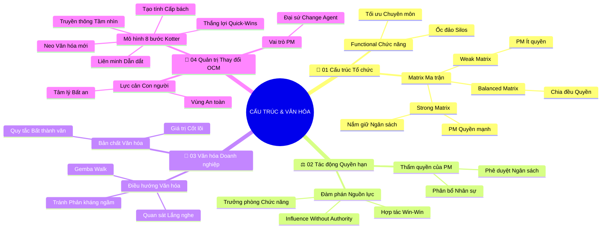

# 🧠 BẢN ĐỒ TƯ DUY TINH GỌN (5 TẦNG): Cấu Trúc Tổ Chức Và Văn Hóa Doanh Nghiệp (v2.4)

## 1. Sơ Đồ Tư Duy Trực Quan (Mermaid Mindmap Bám Sát 4 Phần Tài Liệu)

---

## 2. Cây Phân Cấp Tri Thức Gợi Nhớ Nhanh 5 Tầng (Active Recall Hierarchy)

- 📌 **[Phần I: Các Loại Hình Cấu Trúc Tổ Chức]**
  - 🔹 *Functional Cổ điển:* ➔ *Phân cấp theo chuyên môn sâu* ➔ *Hạn chế giao tiếp chéo* ➔ *Tạo ra các ốc đảo Silos*
  - 🔹 *Matrix Ma trận:* ➔ *Báo cáo kép (Dual Reporting)* ➔ *Giao thoa Chức năng và Dự án* ➔ *Phân cấp Weak, Balanced, Strong Matrix*
- 📌 **[Phần II: Tác Động Của Cấu Trúc Đến Quyền Hạn PM]**
  - 🔹 *Thẩm quyền PM:* ➔ *Quyền lực hành chính vs. Quyền lực ngân sách* ➔ *Phân bổ nhân lực dự án* ➔ *Mức độ tự chủ cao nhất ở Strong Matrix*
  - 🔹 *Đàm phán Nguồn lực:* ➔ *Sức ảnh hưởng không cần quyền lực (Influence Without Authority)* ➔ *Đàm phán Win-Win với Trưởng phòng*
- 📌 **[Phần III: Văn Hóa Doanh Nghiệp & Định Vị PM]**
  - 🔹 *Bản chất Văn hóa:* ➔ *Giá trị cốt lõi và niềm tin tập thể* ➔ *Quy tắc bất thành văn chi phối hành vi* ➔ *Mô hình tảng băng văn hóa*
  - 🔹 *Điều hướng Văn hóa:* ➔ *Quan sát và thấu hiểu chuẩn mực* ➔ *Kỹ thuật Gemba Walk* ➔ *Tránh xung đột ngầm và đồng thuận tập thể*
- 📌 **[Phần IV: Quản Trị Sự Thay Đổi Tổ Chức (OCM)]**
  - 🔹 *Lực cản Tâm lý:* ➔ *Yếu tố con người quyết định thành bại* ➔ *Nỗi sợ mất an toàn* ➔ *Mô hình đường cong biến đổi Kubler-Ross*
  - 🔹 *Mô hình 8 bước Kotter:* ➔ *Cấp bách ➔ Liên minh ➔ Tầm nhìn ➔ Truyền thông ➔ Trao quyền ➔ Quick-Wins ➔ Bứt phá ➔ Neo văn hóa*
  - 🔹 *Vai trò Change Agent:* ➔ *PM làm gương dẫn dắt* ➔ *Truyền thông đồng cảm* ➔ *Kiến tạo thắng lợi ngắn hạn củng cố niềm tin*

---

## 3. Bảng Neo Trí Nhớ Từ Khóa Vàng (Memory Anchor Cheat Sheet)

| Từ Khóa Cốt Lõi | Phần Trong Tài Liệu | Bản Chất / Vai Trò (3-5 từ) | Tín Hiệu Gợi Nhớ (Memory Trigger) |
| :--- | :--- | :--- | :--- |
| **Functional Structure** | Phần I | Cơ cấu tổ chức theo chuyên môn | Các tòa tháp riêng biệt đứng cạnh nhau không có cầu nối |
| **Silos (Ốc đảo)** | Phần I | Hiện tượng cô lập chia rẽ phòng ban | Các hầm chứa ngũ cốc đóng kín cửa không giao lưu |
| **Matrix Structure** | Phần I | Cơ cấu đa tuyến kết hợp dự án | Ngã tư giao nhau giữa hai làn đường cao tốc trên cao |
| **Dual Reporting** | Phần I | Cơ chế báo cáo cho hai người sếp | Người con nghe lời dặn của cả cha và mẹ trong gia đình |
| **Influence Without Authority** | Phần II | Thuyết phục không cần dùng quyền lực | Nhà ngoại giao thuyết phục các nước ký hiệp ước hòa bình |
| **Unwritten Rules** | Phần III | Các quy tắc ngầm định trong văn hóa | Lệ làng được truyền miệng qua nhiều thế hệ |
| **Gemba Walk** | Phần III | Đi thực tế quan sát hiện trường | Bác sĩ đi thăm buồng bệnh để trực tiếp hỏi thăm bệnh nhân |
| **OCM (Change Management)** | Phần IV | Quản trị khía cạnh con người khi đổi mới | Người dẫn đường đưa cả đoàn người vững bước qua cây cầu mới |
| **Kotter 8-Step** | Phần IV | Quy trình 8 bước chuyển đổi bài bản | Tám nhịp thang leo lên đỉnh tháp ngọn hải đăng |
| **Quick-Wins** | Phần IV | Thắng lợi ngắn hạn nhìn thấy ngay | Bữa tiệc mừng công đầu tiên sau tháng chạy dự án thử nghiệm |
| **Change Agent** | Phần IV | Đại sứ tích cực dẫn dắt thay đổi | Ngọn đuốc sáng soi đường xua tan bóng tối hoang mang |
| **Anchoring Culture** | Phần IV | Neo giữ thói quen mới thành văn hóa | Chiếc mỏ neo thả sâu giữ con tàu đứng vững trước sóng to |
