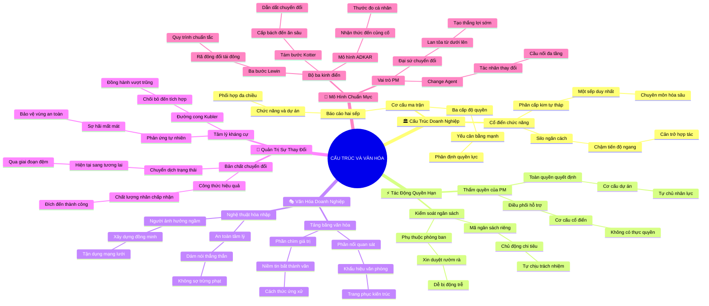

# 🧠 BẢN ĐỒ TƯ DUY TINH GỌN (4-5 TẦNG): HỌC PHẦN 4 - CẤU TRÚC & VĂN HÓA DOANH NGHIỆP

## 1. Sơ Đồ Tư Duy Trực Quan (Mermaid Mindmap Tinh Gọn)

---

## 2. Cây Phân Cấp Tri Thức Gợi Nhớ Nhanh 4-5 Tầng (Active Recall Hierarchy)

- 📌 **[Phần I: Tổng Quan Cấu Trúc Cổ Điển & Cấu Trúc Ma Trận]**
  - 🔹 *Cơ cấu chức năng cổ điển:* ➔ *Phân cấp kim tự tháp* ➔ *Một sếp duy nhất & Rào cản Silo* ➔ *Ví dụ: Quân đội hoặc cơ quan nhà nước báo cáo thẳng cấp trên*
  - 🔹 *Cơ cấu ma trận:* ➔ *Báo cáo hai sếp (Dual Reporting)* ➔ *Phân định 3 cấp: Yếu, Cân bằng, Mạnh* ➔ *Ví dụ: Lập trình viên Google vừa báo cáo Trưởng phòng vừa báo cáo PM*

- 📌 **[Phần II: Tác Động Của Cấu Trúc Tới Quyền Hạn Của PM]**
  - 🔹 *Thẩm quyền & Nhân sự:* ➔ *Từ điều phối viên đến toàn quyền* ➔ *Khung PM Authority Spectrum* ➔ *Ví dụ: Xin mượn người thiết kế 3 ngày vs. Tự quyền thuê ngoài*
  - 🔹 *Kiểm soát tài chính:* ➔ *Ngân sách phòng ban vs. Mã Cost Center riêng* ➔ *Thẩm quyền ký duyệt chi tiêu* ➔ *Ví dụ: Tự ký mua máy in hỏng trong ngày thay vì đợi duyệt 2 tuần*

- 📌 **[Phần III: Giải Mã & Điều Hướng Văn Hóa Doanh Nghiệp]**
  - 🔹 *Mô hình Tảng băng văn hóa:* ➔ *Phần nổi (10%) & Phần chìm niềm tin (90%)* ➔ *Thang đo An toàn tâm lý* ➔ *Ví dụ: PM độc đoán bị tẩy chay trong công ty startup cởi mở*
  - 🔹 *Nghệ thuật hòa nhập:* ➔ *Thuận theo văn hóa để thúc đẩy việc* ➔ *Người có ảnh hưởng ngầm (Opinion Leaders)* ➔ *Ví dụ: Demo sản phẩm vào tiệc trà chiều thứ Sáu thay vì họp căng thẳng*

- 📌 **[Phần IV: Bản Chất Sống Còn Của Quản Trị Sự Thay Đổi]**
  - 🔹 *Bản chất chuyển dịch:* ➔ *Hiện tại ➔ Chuyển tiếp ➔ Tương lai* ➔ *Công thức $Q \times A = E$* ➔ *Ví dụ: Mua phần mềm viện phí tiền tỷ nhưng bác sĩ vẫn viết sổ tay*
  - 🔹 *Tâm lý kháng cự:* ➔ *Đường cong thay đổi Kübler-Ross* ➔ *Chối bỏ ➔ Giận dữ ➔ Chấp nhận* ➔ *Ví dụ: Chuyển sang chấm công nhận diện khuôn mặt nhân viên càu nhàu*

- 📌 **[Phần V: Thực Thi Mô Hình Quản Trị Thay Đổi Chuẩn Mực]**
  - 🔹 *Bộ ba Lewin - Kotter - ADKAR:* ➔ *Rã đông ➔ 8 bước Kotter ➔ Khung ADKAR* ➔ *Tạo thắng lợi ngắn hạn (Short-term Wins)* ➔ *Ví dụ: Thưởng nóng thủ kho đầu tiên nhập liệu phần mềm mới chuẩn 100%*
  - 🔹 *PM là Change Agent:* ➔ *Tác nhân thay đổi & Lắng nghe đồng hành* ➔ *Mạng lưới Change Champions* ➔ *Ví dụ: Dự án Hybrid Work hỗ trợ màn hình làm việc tại nhà*

---

## 3. Bảng Neo Trí Nhớ Từ Khóa Vàng (Memory Anchor Cheat Sheet)

| Từ Khóa Cốt Lõi | Phần Trong Tài Liệu | Bản Chất / Vai Trò (3-5 từ) | Tín Hiệu Gợi Nhớ (Memory Trigger) |
| :--- | :--- | :--- | :--- |
| **Functional Silos** | Phần I | Bức tường ngăn phòng ban | Các lô cốt riêng biệt không có cửa sổ nhìn sang nhau |
| **Dual Reporting** | Phần I | Báo cáo hai sếp song song | Người đứng giữa hai ngã rẽ vừa nghe cha vừa nghe mẹ |
| **Authority Spectrum** | Phần II | Thang đo quyền hạn PM | Thước đo vạch từ số 0 đến số 10 về quyền quyết định |
| **Cost Center** | Phần II | Mã tài khoản ngân sách riêng | Chiếc ví tiền độc lập được cấp quyền tự chi tiêu |
| **Culture Iceberg** | Phần III | Tảng băng trôi văn hóa | Núi băng trôi dưới biển chỉ lộ 10% chóp nhọn |
| **Psychological Safety** | Phần III | Vùng an toàn tâm lý | Tổ chim êm ấm không sợ bị gió bão quật ngã |
| **Q x A = E** | Phần IV | Công thức vàng chuyển đổi | Giải pháp tốt mà không ai dùng thì hiệu quả bằng 0 |
| **Kübler-Ross Curve** | Phần IV | Đường cong trũng tâm lý | Thung lũng hình chữ V trước khi leo lên đỉnh núi mới |
| **Kotter 8 Steps** | Phần V | Tám bước dẫn dắt thay đổi | Tám bậc thang đá dẫn lên đền thờ thành công |
| **ADKAR Framework** | Phần V | Thước đo chuyển đổi cá nhân | Năm mắt xích vàng kết nối tư duy người học |
| **Change Agent** | Phần V | Sứ giả dẫn dắt chuyển đổi | Ngọn đuốc soi đường vượt qua màn đêm bỡ ngỡ |
