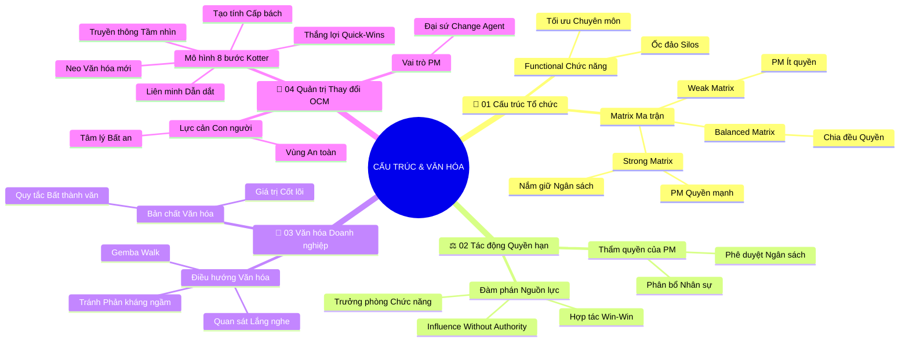

# Tóm Tắt Học Phần 4: Cấu Trúc Tổ Chức Và Văn Hóa Doanh Nghiệp (v2.4)

## 1. Thông điệp cốt lõi (Core Message)
Người quản lý dự án xuất sắc phải thấu suốt cơ chế vận hành của cấu trúc tổ chức, khéo léo hòa nhập vào dòng chảy văn hóa doanh nghiệp và trở thành đại sứ dẫn dắt sự thay đổi (Change Agent) thông qua mô hình chuyển đổi con người OCM.

---

## 2. Lược Đồ Phân Bổ Cấu Trúc Tài Liệu (Content Distribution Overview)

| Phần / Đề Mục Tài Liệu Gốc | Nội Dung Trọng Tâm | Số Luận Điểm Đại Diện |
| :--- | :--- | :---: |
| **Phần I: Các Loại Hình Cấu Trúc Tổ Chức** | Cấu trúc Cổ điển/Chức năng (Classic/Functional) vs. Cấu trúc Ma trận (Matrix) | 2 Luận điểm |
| **Phần II: Tác Động Của Cấu Trúc Đến Quyền Hạn PM** | Mức độ thẩm quyền, quyền quản lý ngân sách và kỹ năng đàm phán tài nguyên | 2 Luận điểm |
| **Phần III: Văn Hóa Doanh Nghiệp & Định Vị PM** | Giá trị cốt lõi, quy tắc bất thành văn và nghệ thuật điều hướng văn hóa | 2 Luận điểm |
| **Phần IV: Quản Trị Sự Thay Đổi Tổ Chức (OCM)** | Lực cản tâm lý, mô hình 8 bước Kotter, Quick-Wins và vai trò Change Agent | 4 Luận điểm |
| **Tổng cộng** | **Bao quát 100% cấu trúc 4 phần của tài liệu** | **10 Luận điểm** |

---

## 3. Luận điểm quan trọng theo cấu trúc tài liệu (Key Takeaways: 10 Luận Điểm Chuyên Sâu)

### 📑 PHẦN I: CÁC LOẠI HÌNH CẤU TRÚC TỔ CHỨC (CLASSIC VS. MATRIX STRUCTURES)

1. **CẤU TRÚC CHỨC NĂNG CỔ ĐIỂN (CLASSIC/FUNCTIONAL) VÀ TÍNH ỐC ĐẢO**
   - **Bản chất & Phân tích chuyên sâu:** Cấu trúc chức năng cổ điển tổ chức nhân sự theo từng phòng ban chuyên môn (Tài chính, Marketing, Kỹ thuật, Nhân sự) dưới quyền chỉ huy trực tiếp của Trưởng phòng (Functional Manager). Ưu điểm là tối ưu hóa chuyên môn sâu; nhưng nhược điểm chí mạng là tạo ra tư duy "ốc đảo" (Silos) – các phòng ban ít giao tiếp chéo, khiến các dự án liên phòng ban gặp nhiều khó khăn và chậm trễ.
   - **Phương pháp / Công cụ / Quy trình đi kèm:** Sơ đồ phân cấp tổ chức hình cây (Hierarchical Org Chart), Quy trình phê duyệt dọc.
   - **Ví dụ thực tế đời thường:** Quân đội truyền thống: Binh nhì chỉ báo cáo Trung đội trưởng, Trung đội trưởng báo cáo Đại đội trưởng; mệnh lệnh truyền từ trên xuống theo đường dọc nghiêm ngặt, không tự ý phối hợp ngang.

2. **CẤU TRÚC MA TRẬN (MATRIX STRUCTURE) VÀ MÔ HÌNH BÁO CÁO KÉP**
   - **Bản chất & Phân tích chuyên sâu:** Cấu trúc ma trận ra đời để phá vỡ các ốc đảo bằng cách thiết lập mạng lưới lưới giao thoa giữa các phòng ban chức năng và các dự án. Nhân viên trong cấu trúc này có "hai người sếp" (Dual Reporting): báo cáo chuyên môn cho Trưởng phòng chức năng và báo cáo tiến độ công việc cho Quản lý dự án. Ma trận được chia làm 3 cấp độ: Ma trận yếu (Weak - PM ít quyền), Ma trận cân bằng (Balanced - chia đều quyền), và Ma trận mạnh (Strong - PM nắm quyền ngân sách và điều phối chính).
   - **Phương pháp / Công cụ / Quy trình đi kèm:** Ma trận trách nhiệm đa tuyến (Matrix Management Model), Bản đồ điều phối tài nguyên chung.
   - **Ví dụ thực tế đời thường:** Bác sĩ phẫu thuật: hàng ngày thuộc quyền quản lý nhân sự của Trưởng khoa Ngoại (Chức năng), nhưng khi bước vào phòng mổ khẩn cấp thì tuân thủ tuyệt đối mệnh lệnh của Trưởng kíp phẫu thuật (Dự án).

---

### 📑 PHẦN II: TÁC ĐỘNG CỦA CẤU TRÚC ĐẾN QUYỀN HẠN PM (STRUCTURAL IMPACT ON PM)

3. **MỨC ĐỘ THẨM QUYỀN VÀ QUYỀN KIỂM SOÁT NGÂN SÁCH CỦA PM**
   - **Bản chất & Phân tích chuyên sâu:** Cấu trúc doanh nghiệp định đoạt trực tiếp thẩm quyền của PM. Trong cấu trúc Chức năng, PM hầu như không có quyền lực chính thức (chỉ đóng vai trò điều phối viên hành chính), ngân sách do Trưởng phòng nắm giữ. Trong cấu trúc Ma trận mạnh hoặc Định hướng Dự án (Projectized), PM nắm toàn quyền ngân sách, tự quyết định phân bổ nhân sự và chịu trách nhiệm cao nhất về kết quả kinh doanh.
   - **Phương pháp / Công cụ / Quy trình đi kèm:** Bảng phân cấp thẩm quyền (Delegation of Authority Matrix), Ma trận phân bổ quyền hạn RACI.
   - **Ví dụ thực tế đời thường:** Sự khác biệt giữa người tổ chức đám cưới trọn gói được gia đình giao toàn bộ ngân sách tự quyết (Projectized), với người anh họ chỉ được nhờ đi thuê rạp và phải xin phép phụ huynh mỗi khi chi tiền (Functional).

4. **CHIẾN LƯỢC ĐÀM PHÁN NGUỒN LỰC VỚI TRƯỞNG PHÒNG CHỨC NĂNG**
   - **Bản chất & Phân tích chuyên sâu:** Trong môi trường ma trận, PM không có quyền sinh quyền sát với thành viên nhóm nên bắt buộc phải dùng "sức ảnh hưởng không cần quyền lực" (Influence Without Authority). PM phải chủ động đàm phán với các Trưởng phòng chức năng, làm cho họ thấy rõ sự đóng góp của dự án vào mục tiêu chung của phòng ban, từ đó được ưu tiên mượn những nhân sự giỏi nhất.
   - **Phương pháp / Công cụ / Quy trình đi kèm:** Kỹ thuật đàm phán hợp tác Win-Win (Harvard Negotiation Project), Kế hoạch cân bằng tài nguyên (Resource Leveling).
   - **Ví dụ thực tế đời thường:** Đạo diễn phim thuyết phục phụ huynh cho một diễn viên nhí đóng phim bằng cách cam kết lịch quay chỉ diễn ra vào cuối tuần và bố trí gia sư kèm bài tập để việc học không bị ảnh hưởng.

---

### 📑 PHẦN III: VĂN HÓA DOANH NGHIỆP & ĐỊNH VỊ PM (ORGANIZATIONAL CULTURE)

5. **BẢN CHẤT VĂN HÓA DOANH NGHIỆP: GIÁ TRỊ VÀ QUY TẮC BẤT THÀNH VĂN**
   - **Bản chất & Phân tích chuyên sâu:** Văn hóa tổ chức là tập hợp các giá trị cốt lõi, niềm tin, biểu tượng và chuẩn mực hành vi được tập thể cùng chia sẻ ("Cách chúng ta làm việc ở đây"). Bên cạnh quy chế bằng văn bản, các "quy tắc bất thành văn" (Unwritten Rules) về cách ăn mặc, cách xưng hô, cách ra quyết định và cách xử lý khi mắc lỗi mới là thứ chi phối mạnh mẽ nhất bầu không khí làm việc.
   - **Phương pháp / Công cụ / Quy trình đi kèm:** Mô hình tảng băng văn hóa (Culture Iceberg Model), Bản đồ nhận diện văn hóa doanh nghiệp.
   - **Ví dụ thực tế đời thường:** Bước vào một gia đình gia giáo: quy tắc bất thành văn là con cháu phải chào hỏi người lớn từ ngoài cổng và mời cơm trước khi cầm đũa; không ai viết thành bảng nội quy nhưng ai cũng tự giác tuân theo.

6. **NGHỆ THUẬT ĐIỀU HƯỚNG VÀ THÍCH ỨNG VĂN HÓA CỦA PROJECT MANAGER**
   - **Bản chất & Phân tích chuyên sâu:** Một dự án dù có kế hoạch hoàn hảo đến đâu cũng sẽ bị văn hóa tổ chức "nuốt chửng" nếu PM không biết cách điều hướng. PM phải nhạy bén quan sát cách thức tổ chức khen thưởng, cách giải quyết xung đột (công khai hay kín đáo), và mức độ chấp nhận rủi ro để điều chỉnh phong cách giao tiếp và dẫn dắt phù hợp, tránh tạo ra sự phản kháng ngầm.
   - **Phương pháp / Công cụ / Quy trình đi kèm:** Đánh giá mức độ sẵn sàng văn hóa (Cultural Readiness Assessment), Kỹ thuật lắng nghe và quan sát hiện trường (Gemba Walk).
   - **Ví dụ thực tế đời thường:** Một người chuyển từ công ty khởi nghiệp trẻ trung sang làm việc tại cơ quan nhà nước: họ lập tức chuyển từ nhắn tin trao đổi suồng sã sang soạn thảo công văn trang trọng kèm chữ ký để phù hợp với văn hóa hành chính chuẩn mực.

---

### 📑 PHẦN IV: QUẢN TRỊ SỰ THAY ĐỔI TỔ CHỨC (ORGANIZATIONAL CHANGE MANAGEMENT - OCM)

7. **BẢN CHẤT CỦA OCM: YẾU TỐ CON NGƯỜI VÀ LỰC CẢN TÂM LÝ**
   - **Bản chất & Phân tích chuyên sâu:** Hầu hết các dự án thất bại không phải do công nghệ hay kỹ thuật mà do con người từ chối thay đổi. Quản lý thay đổi tổ chức (OCM) là quá trình dẫn dắt con người vượt qua nỗi sợ hãi, bỡ ngỡ và mất mát vùng an toàn để chấp nhận quy trình/công nghệ mới. PM phải thấu cảm với các giai đoạn tâm lý của con người trước biến động.
   - **Phương pháp / Công cụ / Quy trình đi kèm:** Đường cong biến đổi tâm lý Kubler-Ross (Change Curve), Mô hình chuyển đổi cá nhân ADKAR.
   - **Ví dụ thực tế đời thường:** Chuyển nhà từ nông thôn lên chung cư thành phố: người lớn tuổi ban đầu cảm thấy bí bách, nhớ vườn tược và sợ đi thang máy; chỉ khi được con cháu kiên nhẫn hướng dẫn và thấy được sự tiện nghi an ninh thì họ mới vui vẻ hòa nhập.

8. **MÔ HÌNH 8 BƯỚC CỦA JOHN KOTTER DẪN DẮT SỰ CHUYỂN ĐỔI**
   - **Bản chất & Phân tích chuyên sâu:** John Kotter đúc kết lộ trình 8 bước chuẩn mực để chuyển đổi thành công: (1) Tạo tính cấp bách (Create Urgency); (2) Xây dựng liên minh dẫn dắt (Form a Guiding Coalition); (3) Xây dựng tầm nhìn chiến lược; (4) Truyền thông tầm nhìn mạnh mẽ; (5) Trao quyền và tháo gỡ rào cản; (6) Tạo ra các thắng lợi ngắn hạn; (7) Duy trì đà bứt phá; (8) Neo giữ văn hóa mới vào tổ chức.
   - **Phương pháp / Công cụ / Quy trình đi kèm:** Mô hình 8 bước Kotter (Kotter's 8-Step Change Framework), Kế hoạch OCM tích hợp.
   - **Ví dụ thực tế đời thường:** Chiến dịch khuyến khích người dân đội mũ bảo hiểm: Bắt đầu từ cảnh báo tai nạn giao thông (Tạo tính cấp bách), các nghệ sĩ và lãnh đạo cùng đội mũ làm gương (Liên minh dẫn dắt), truyền thông khắp báo đài (Tầm nhìn), và xử phạt nghiêm kết hợp tặng mũ đạt chuẩn (Trao quyền & Bền vững).

9. **KIẾN TẠO THẮNG LỢI NGẮN HẠN (QUICK-WINS) VÀ CỦNG CỐ NIỀM TIN**
   - **Bản chất & Phân tích chuyên sâu:** Quá trình chuyển đổi thường kéo dài khiến nhân sự hoài nghi và nản lòng. Nhiệm vụ sống còn của PM trong mô hình Kotter là phải sớm thiết kế và tạo ra các "thắng lợi ngắn hạn" (Quick-Wins) – những kết quả tích cực, nhìn thấy được ngay trong 1-3 tháng đầu. Thắng lợi này dập tắt sự hoài nghi của phe phản đối và tiếp thêm động lực cho tập thể.
   - **Phương pháp / Công cụ / Quy trình đi kèm:** Chiến lược tạo Quick-Wins, Bảng vinh danh thành tựu giai đoạn ngắn.
   - **Ví dụ thực tế đời thường:** Người bắt đầu tập gym giảm cân: Nhìn thấy cân nặng giảm được 1.5 kg ngay trong tuần đầu tiên chính là "Quick-Win" vô giá giúp họ có đủ niềm tin kiên trì tập luyện tiếp 6 tháng sau.

10. **VAI TRÒ CỦA PM NHƯ MỘT ĐẠI SỨ THAY ĐỔI (CHANGE AGENT) TÍCH CỰC**
    - **Bản chất & Phân tích chuyên sâu:** PM không chỉ quản lý bảng tính tiến độ mà là một "Đại sứ thay đổi" (Change Agent). PM làm gương trong việc áp dụng quy trình mới, chủ động lắng nghe tâm tư bất an của nhân viên, giải thích cặn kẽ lợi ích cá nhân của họ khi thay đổi thành công và bắc cầu nối niềm tin giữa ban lãnh đạo với nhân viên thực thi.
    - **Phương pháp / Công cụ / Quy trình đi kèm:** Kế hoạch truyền thông đồng cảm (Empathetic Communication Plan), Mạng lưới đại sứ thay đổi nội bộ.
    - **Ví dụ thực tế đời thường:** Người hướng dẫn viên du lịch trong một chuyến đi rừng gặp trời mưa to: luôn giữ vẻ mặt bình tĩnh, tươi cười động viên, phát áo mưa cho từng người và hướng dẫn họ đi theo con đường mòn an toàn nhất.

---

## 4. Kế hoạch hành động (Action Plan: 20 việc cụ thể)

#### Nhóm 1: Hành động ngay hôm nay (Micro-habits dưới 2 phút - 5 việc)
- [ ] **Hành động 1:** Xác định cấu trúc tổ chức hiện tại của công ty bạn là Chức năng, Ma trận hay Dự án.
- [ ] **Hành động 2:** Ghi ra giấy 1 "quy tắc bất thành văn" đang chi phối cách giao tiếp trong nhóm của bạn.
- [ ] **Hành động 3:** Quan sát một đồng nghiệp đang gặp khó khăn trước quy trình mới và gửi 1 câu hỏi thăm chân thành.
- [ ] **Hành động 4:** Tìm kiếm xem ai là người có tầm ảnh hưởng ngầm lớn nhất trong phòng ban của bạn.
- [ ] **Hành động 5:** Xác định 1 thắng lợi nhỏ (Quick-Win) bạn có thể hoàn thành ngay trong ngày hôm nay.

#### Nhóm 2: Kế hoạch rèn luyện trong tuần (Áp dụng vào công việc & dự án - 8 việc)
- [ ] **Hành động 6:** Vẽ sơ đồ các bên liên quan và phân tích mức độ ủng hộ của họ đối với sáng kiến thay đổi của bạn.
- [ ] **Hành động 7:** Thiết lập buổi uống cà phê 20 phút với một Trưởng phòng chức năng để hiểu rõ các ưu tiên của họ.
- [ ] **Hành động 8:** Lập kế hoạch truyền thông về tầm nhìn dự án bằng một thông điệp ngắn gọn, dễ hiểu dưới 3 câu.
- [ ] **Hành động 9:** Nhận diện 3 rào cản tâm lý lớn nhất khiến nhóm e ngại thay đổi và lên phương án giải tỏa.
- [ ] **Hành động 10:** Tổ chức một buổi chia sẻ ghi nhận thành quả đợt 1 (Quick-Win) để tạo không khí phấn khởi cho nhóm.
- [ ] **Hành động 11:** Rà soát lại xem dự án của bạn có đang vô tình vi phạm giá trị cốt lõi nào của doanh nghiệp không.
- [ ] **Hành động 12:** Xây dựng một liên minh dẫn dắt gồm 3 người tích cực nhất để cùng lan tỏa sự đổi mới.
- [ ] **Hành động 13:** Đánh giá lại mức độ sẵn sàng chuyển đổi của tập thể vào cuối tuần qua bảng khảo sát ngắn.

#### Nhóm 3: Thói quen duy trì & Chuyển hóa lâu dài (Phát triển sự nghiệp bền vững - 7 việc)
- [ ] **Hành động 14:** Duy trì vai trò là một Đại sứ thay đổi (Change Agent) luôn truyền tải năng lượng tích cực trong mọi dự án.
- [ ] **Hành động 15:** Thành thạo nghệ thuật "Sức ảnh hưởng không cần quyền lực" (Influence Without Authority).
- [ ] **Hành động 16:** Áp dụng bài bản mô hình 8 bước Kotter cho mọi chương trình cải tiến quy trình quy mô lớn.
- [ ] **Hành động 17:** Xây dựng cầu nối hợp tác bền chặt giữa các phòng ban chức năng, triệt tiêu tư duy ốc đảo.
- [ ] **Hành động 18:** Định kỳ rà soát và đóng góp xây dựng văn hóa doanh nghiệp ngày càng cởi mở và an toàn tâm lý.
- [ ] **Hành động 19:** Đạt chứng chỉ chuyên sâu về Quản trị Sự thay đổi Tổ chức (như Prosci Change Management Certification).
- [ ] **Hành động 20:** Định hình bản thân trở thành một nhà lãnh đạo chuyển đổi (Transformational Leader) có tầm nhìn chiến lược.

---

## 5. Câu hỏi tự ngẫm (Reflection: 20 câu hỏi sâu sắc)

#### Nhóm 1: Tự vấn Nhận thức & Hệ tư duy (Self-Awareness & Mindset: 5 câu)
1. Bạn đang tiếp cận sự thay đổi với tâm thế của một người chống cự thụ động hay người chủ động dẫn dắt chuyển đổi?
2. Trong môi trường ma trận, bạn dựa vào chức danh quyền lực hay dựa vào uy tín và khả năng thuyết phục để huy động nguồn lực?
3. Bạn có thực sự thấu cảm với nỗi sợ mất an toàn của nhân viên cấp dưới khi triển khai phần mềm/quy trình mới?
4. Giá trị cốt lõi của công ty hiện tại có thực sự đồng điệu với hệ giá trị sống của cá nhân bạn hay không?
5. Bạn định nghĩa thế nào là một sự chuyển đổi thành công bền vững trong một tổ chức?

#### Nhóm 2: Nhận diện Thói quen & Điểm mù (Habits & Blind Spots: 5 câu)
1. Thói quen áp đặt mệnh lệnh cứng nhắc nào của bạn đang vô tình tạo ra sự phản kháng ngầm từ các phòng ban khác?
2. Bạn có hay quên bước "Tạo tính cấp bách" mà vội vàng ép mọi người phải thực thi ngay quy trình mới?
3. Điểm mù nào khiến bạn đánh giá thấp sức mạnh của các quy tắc bất thành văn trong văn hóa công ty?
4. Bạn có thường xuyên tuyên bố thành công quá sớm khi sự thay đổi mới chỉ dừng lại ở bề nổi mà chưa ăn sâu vào văn hóa?
5. Bạn có lắng nghe tiếng nói của những người phản đối để tìm ra các lỗ hổng tiềm ẩn của dự án hay vội vàng quy chụp họ?

#### Nhóm 3: Ứng dụng Thực tế & Giải quyết Vấn đề (Practical Application & Problem Solving: 5 câu)
1. Khi một Trưởng phòng chức năng từ chối nhả nhân sự giỏi cho dự án ma trận của bạn, bạn dùng chiến lược đàm phán nào?
2. Làm thế nào để thiết kế một Thắng lợi ngắn hạn (Quick-Win) thuyết phục được cả ban giám đốc lẫn nhân viên trong tháng đầu tiên?
3. Khi phát hiện văn hóa phòng ban đang có xu hướng đổ lỗi và che giấu sai phạm, bạn can thiệp từng bước ra sao?
4. Bạn áp dụng các bước nào của mô hình Kotter để giúp nhóm vượt qua giai đoạn hoang mang khi công ty tái cơ cấu?
5. Phương pháp cụ thể nào giúp bạn đo lường được mức độ chấp nhận thực tế của người dùng sau khi bàn giao hệ thống mới?

#### Nhóm 4: Bứt phá Giới hạn & Chuyển hóa Tương lai (Breakthrough & Transformation: 5 câu)
1. Đâu là sự thay đổi lớn nhất về văn hóa hoặc quy trình mà bạn khao khát kiến tạo cho tổ chức của mình trong 2 năm tới?
2. Bạn sẽ xây dựng liên minh dẫn dắt gồm những nhân vật chủ chốt nào để hỗ trợ bạn hiện thực hóa tầm nhìn đó?
3. Kỹ năng lãnh đạo chuyển đổi nào bạn cần rèn luyện mạnh mẽ nhất ngay từ tuần này?
4. Bạn muốn các đồng nghiệp mô tả về vai trò của bạn trong các giai đoạn khủng hoảng thay đổi bằng những từ ngữ nào?
5. Hành động cụ thể đầu tiên bạn sẽ thực hiện vào sáng mai để giúp một đồng đội bớt lo âu trước sự thay đổi là gì?

---

## 6. Bản Đồ Tư Duy Trực Quan (Visual Mindmap Overview - Bám Sát 4 Phần Tài Liệu)

