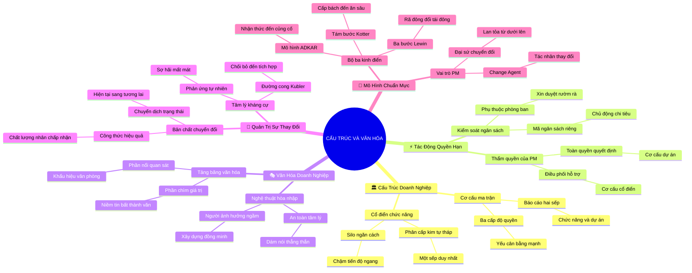

# Tóm Tắt Học Phần 4: Cấu Trúc Tổ Chức Và Văn Hóa Doanh Nghiệp (Organizational Structure and Culture)

## 1. Thông điệp cốt lõi (Core Message)
> Quản trị dự án thành công đòi hỏi sự thấu hiểu sâu sắc hệ thống cấu trúc tổ chức (Cổ điển hay Ma trận), hòa nhập và tận dụng bản sắc văn hóa doanh nghiệp, đồng thời đóng vai trò một tác nhân thay đổi (Change Agent) chủ động dẫn dắt quá trình chuyển đổi thông qua các mô hình quản trị thay đổi chuẩn mực.

---

## 2. Lược Đồ Phân Bổ Cấu Trúc Tài Liệu (Content Distribution Overview)

| Phần / Đề Mục Tài Liệu Gốc | Nội Dung Trọng Tâm | Số Luận Điểm Đại Diện |
| :--- | :--- | :---: |
| **Phần I: Tổng Quan Cấu Trúc Cổ Điển & Cấu Trúc Ma Trận** *(Classic & Matrix Structures)* | So sánh cơ cấu chức năng truyền thống (Classic/Functional) và cơ cấu Ma trận (Ma trận yếu, cân bằng, mạnh); cơ chế báo cáo 2 sếp. | 2 Luận điểm |
| **Phần II: Tác Động Của Cấu Trúc Tới Quyền Hạn Của PM** *(How Structure Impacts Project Management)* | Phân tích mức độ quyền lực của PM, khả năng tiếp cận tài nguyên nhân lực, quyền kiểm soát ngân sách và cơ chế ra quyết định. | 2 Luận điểm |
| **Phần III: Giải Mã & Điều Hướng Văn Hóa Doanh Nghiệp** *(Introduction to Organizational Culture)* | Khái niệm văn hóa tổ chức, các giá trị ngầm định, văn hóa thưởng phạt, môi trường an toàn tâm lý và cách PM hòa nhập. | 2 Luận điểm |
| **Phần IV: Bản Chất Sống Còn Của Quản Trị Sự Thay Đổi** *(Introduction to Change Management)* | Định nghĩa Change Management, mối quan hệ hữu cơ giữa Project Management và Change Management, tâm lý kháng cự thay đổi. | 2 Luận điểm |
| **Phần V: Thực Thi Mô Hình Quản Trị Thay Đổi Chuẩn Mực** *(Participating in Change Management)* | Bộ ba mô hình chuyển đổi kinh điển: 3 giai đoạn của Kurt Lewin, 8 bước của John Kotter, mô hình ADKAR và vai trò Change Agent của PM. | 2 Luận điểm |
| **Tổng cộng** | **Bao quát 100% cấu trúc 5 phần của tài liệu gốc** | **10 Luận điểm** |

---

## 3. Luận điểm quan trọng theo cấu trúc tài liệu (Key Takeaways: 10 Luận Điểm Chuyên Sâu)

### 📑 PHẦN I: TỔNG QUAN CẤU TRÚC CỔ ĐIỂN & CẤU TRÚC MA TRẬN (CLASSIC & MATRIX)

1. **CƠ CẤU CỔ ĐIỂN / CHỨC NĂNG (CLASSIC / FUNCTIONAL STRUCTURE)**
   - **Bản chất & Phân tích chuyên sâu:** Cấu trúc cổ điển là mô hình phân cấp hình kim tự tháp truyền thống, nơi doanh nghiệp được chia thành các phòng ban chuyên môn biệt lập (Tài chính, Tiếp thị, Kỹ thuật, Nhân sự). Mỗi nhân viên có một người quản lý trực tiếp duy nhất (Trưởng phòng chức năng). Ưu điểm là chuyên môn hóa sâu, quyền hạn phân minh; nhược điểm chí mạng là tạo ra các "silo thông tin", cản trở giao tiếp ngang giữa các bộ phận và làm chậm tiến độ dự án.
   - **Phương pháp / Công cụ / Quy trình đi kèm:** Sơ đồ tổ chức phân cấp (Hierarchical Org Chart), Chuỗi mệnh lệnh (Chain of Command).
   - **Ví dụ thực tế đời thường:** Quân đội hoặc cơ quan nhà nước truyền thống: Binh nhì chỉ nhận lệnh trực tiếp từ Trung đội trưởng, Trung đội trưởng báo cáo Đại đội trưởng; nếu bộ phận Hậu cần muốn phối hợp với bộ phận Tác chiến thì phải báo cáo lên cấp Chỉ huy trưởng phê duyệt.

2. **CƠ CẤU MA TRẬN VÀ CƠ CHẾ BÁO CÁO KÉP (MATRIX STRUCTURE & DUAL REPORTING)**
   - **Bản chất & Phân tích chuyên sâu:** Cơ cấu ma trận kết hợp giữa trục chức năng (theo chuyên môn) và trục dự án (theo sản phẩm/thị trường). Nhân viên thuộc một phòng ban chức năng nhưng được biệt phái vào các dự án cụ thể, dẫn đến tình trạng "báo cáo hai sếp" (Dual Reporting): báo cáo chuyên môn cho Trưởng phòng và báo cáo tiến độ cho PM. Tùy theo mức độ quyền lực của PM, cơ cấu ma trận được chia thành: Ma trận yếu (Trưởng phòng quyết định hết), Ma trận cân bằng (chia sẻ quyền lực), và Ma trận mạnh (PM nắm quyền tối cao).
   - **Phương pháp / Công cụ / Quy trình đi kèm:** Mô hình Ma trận tổ chức (Weak, Balanced, Strong Matrix), Thỏa thuận phân bổ nguồn lực (Resource Allocation Agreement).
   - **Ví dụ thực tế đời thường:** Một lập trình viên tại Google: Trưởng phòng kỹ thuật phụ trách đánh giá năng lực, tăng lương và đào tạo (Functional Manager); trong khi PM dự án Google Maps giao việc hàng ngày và theo dõi tiến độ hoàn thành tính năng (Project Manager).

---

### 📑 PHẦN II: TÁC ĐỘNG CỦA CẤU TRÚC TỚI QUYỀN HẠN CỦA PM (STRUCTURE IMPACT)

3. **MỨC ĐỘ QUYỀN LỰC VÀ KHẢ NĂNG HUY ĐỘNG TÀI NGUYÊN**
   - **Bản chất & Phân tích chuyên sâu:** Cấu trúc tổ chức quyết định trực tiếp thẩm quyền của PM: Trong cơ cấu Cổ điển, PM thực chất chỉ là một "Điều phối viên" (Coordinator) không có thực quyền, phải xin xỏ nhân sự từ các Trưởng phòng; trong cơ cấu Ma trận mạnh hoặc Định hướng dự án (Project-oriented), PM toàn quyền quyết định ngân sách, điều động nhân sự và đánh giá hiệu quả công việc. Hiểu rõ cấu trúc giúp PM chọn đúng chiến thuật đàm phán tài nguyên.
   - **Phương pháp / Công cụ / Quy trình đi kèm:** Khung phân loại quyền hạn PM (PM Authority Spectrum: None $\to$ Low $\to$ Moderate $\to$ High $\to$ Total), Bảng cân đối nhân sự dự án (Staffing Management Plan).
   - **Ví dụ thực tế đời thường:** Trong công ty gia đình cổ điển: PM muốn mượn 1 nhân viên thiết kế trong 3 ngày phải viết đơn xin phép Tổng giám đốc; trong khi ở công ty công nghệ ma trận mạnh: PM chủ động quyết định thuê ngoài (Outsource) lập trình viên nếu ngân sách dự án cho phép.

4. **CHIẾN LƯỢC KIỂM SOÁT NGÂN SÁCH VÀ RA QUYẾT ĐỊNH THEO CƠ CẤU**
   - **Bản chất & Phân tích chuyên sâu:** Ai nắm túi tiền, người đó nắm quyền lực. Trong tổ chức chức năng, ngân sách dự án nằm rải rác trong tài khoản của các phòng ban, khiến PM gặp muôn vàn khó khăn khi cần chi tiêu đột xuất. Trong tổ chức hướng dự án, PM được cấp một mã ngân sách riêng độc lập (Cost Center) và tự chịu trách nhiệm về lời lỗ của dự án. PM phải nhận thức rõ thẩm quyền ký duyệt tài chính tối đa của mình là bao nhiêu để không vượt thẩm quyền.
   - **Phương pháp / Công cụ / Quy trình đi kèm:** Ma trận phân quyền phê duyệt tài chính (Financial Approval Authority Matrix), Quy trình kiểm soát mua sắm (Procurement Management Plan).
   - **Ví dụ thực tế đời thường:** Khi máy in của dự án bị hỏng: Nếu có quyền hạn cao, PM tự ký chi 5 triệu mua máy mới ngay trong buổi sáng; nếu ở cơ cấu cổ điển, PM phải làm tờ trình qua 3 phòng ban và chờ đợi 2 tuần để được duyệt chi.

---

### 📑 PHẦN III: GIẢI MÃ & ĐIỀU HƯỚNG VĂN HÓA DOANH NGHIỆP (ORGANIZATIONAL CULTURE)

5. **BẢN CHẤT VĂN HÓA DOANH NGHIỆP: TẢNG BĂNG CHÌM VÀ CÁC GIÁ TRỊ NGẦM ĐỊNH**
   - **Bản chất & Phân tích chuyên sâu:** Văn hóa doanh nghiệp giống như một tảng băng trôi: Phần nổi là trang phục, khẩu hiệu, kiến trúc văn phòng; phần chìm (chiếm 90%) là các niềm tin cốt lõi, thói quen bất thành văn, cách thức phân chia quyền lực và cách mọi người ứng xử khi không có sếp quan sát. Dự án thất bại nhiều nhất không phải do năng lực kỹ thuật yếu kém, mà do giải pháp kỹ thuật đó "xung đột" với văn hóa ngầm định của tổ chức.
   - **Phương pháp / Công cụ / Quy trình đi kèm:** Mô hình Tảng băng văn hóa (Culture Iceberg Model), Bản đồ văn hóa doanh nghiệp (Culture Map), Thang đo an toàn tâm lý (Psychological Safety Survey).
   - **Ví dụ thực tế đời thường:** Một công ty khởi nghiệp có văn hóa giao tiếp bình đẳng, nhân viên tranh luận thẳng thắn với sếp; nếu một PM mới từ môi trường nhà nước chuyển sang áp dụng phong cách độc đoán, chỉ đạo áp đặt thì sẽ bị đội ngũ tẩy chay ngay lập tức.

6. **NGHỆ THUẬT ĐIỀU HƯỚNG DỰ ÁN HÒA NHẬP VỚI BẢN SẮC VĂN HÓA**
   - **Bản chất & Phân tích chuyên sâu:** PM không thể đơn phương thay đổi văn hóa một công ty trong ngày một ngày hai. Cách tiếp cận khôn ngoan là "thuận theo văn hóa để thúc đẩy dự án": Nhận diện các nghi thức giao tiếp (họp trực tiếp hay gửi chat?), nhận diện những "người có ảnh hưởng ngầm" (Opinion Leaders) trong văn phòng, và thiết kế cách thức báo cáo tiến độ phù hợp với mức độ chấp nhận rủi ro của ban lãnh đạo.
   - **Phương pháp / Công cụ / Quy trình đi kèm:** Phân tích mạng lưới tổ chức (Organizational Network Analysis - ONA), Kế hoạch truyền thông văn hóa (Cultural Communication Protocol).
   - **Ví dụ thực tế đời thường:** Trong một doanh nghiệp coi trọng tiệc trà chiều thứ Sáu: PM khéo léo lồng ghép buổi demo sản phẩm mới vào 15 phút đầu giờ tiệc trà trong không khí vui vẻ, thay vì ép đội ngũ vào phòng họp kín căng thẳng sáng thứ Hai.

---

### 📑 PHẦN IV: BẢN CHẤT SỐNG CÒN CỦA QUẢN TRỊ SỰ THAY ĐỔI (CHANGE MANAGEMENT)

7. **VÌ SAO MỌI DỰ ÁN ĐỀU ĐỒNG NGHĨA VỚI SỰ THAY ĐỔI?**
   - **Bản chất & Phân tích chuyên sâu:** Mục đích tối hậu của mọi dự án là đưa tổ chức từ trạng thái hiện tại (Current State) chuyển dịch qua giai đoạn chuyển tiếp (Transition State) để đạt tới trạng thái tương lai tốt đẹp hơn (Future State). Tuy nhiên, bản năng tự nhiên của con người là tìm kiếm sự ổn định và sợ hãi mất mát quyền lợi. Nếu PM chỉ tập trung vào việc tạo ra sản phẩm (Project Management) mà bỏ quên việc giúp con người thích nghi với sản phẩm đó (Change Management), dự án sẽ bị đào thải.
   - **Phương pháp / Công cụ / Quy trình đi kèm:** Mô hình chuyển dịch trạng thái tổ chức (Current $\to$ Transition $\to$ Future State), Phương trình hiệu quả chuyển đổi $Q \times A = E$ (Quality of Solution $\times$ Acceptance of People = Effectiveness).
   - **Ví dụ thực tế đời thường:** Bệnh viện đầu tư 20 tỷ mua phần mềm bệnh án điện tử (Project Management thành công), nhưng không đào tạo và thuyết phục các bác sĩ già, dẫn đến việc họ vẫn viết tay vào sổ giấy và vứt xó máy tính (Change Management thất bại).

8. **TÂM LÝ KHÁNG CỰ THAY ĐỔI VÀ ĐƯỜNG CONG THAY ĐỔI KÜBLER-ROSS**
   - **Bản chất & Phân tích chuyên sâu:** Kháng cự thay đổi không phải là hành vi xấu mà là phản ứng tâm lý tự nhiên. Khi đối diện với quy trình mới, con người thường trải qua các giai đoạn trên Đường cong thay đổi Kübler-Ross: Từ chối (Shock/Denial) $\to$ Tức giận & Lo âu (Anger/Frustration) $\to$ Thương lượng (Bargaining) $\to$ Trầm cảm/Chán nản (Depression) $\to$ Thử nghiệm & Chấp nhận (Experiment/Acceptance) $\to$ Tích hợp hoàn toàn (Integration). PM cần thấu cảm và đồng hành để rút ngắn thời gian đội ngũ chìm trong lo âu.
   - **Phương pháp / Công cụ / Quy trình đi kèm:** Đường cong thay đổi (Change Curve / Kübler-Ross Model), Bảng phân tích mức độ sẵn sàng thay đổi (Change Readiness Assessment).
   - **Ví dụ thực tế đời thường:** Khi công ty chuyển từ chấm công bằng vân tay sang nhận diện khuôn mặt AI: Tuần đầu tiên nhân viên càu nhàu, lo sợ lộ thông tin cá nhân; PM tổ chức buổi giải đáp minh bạch về bảo mật, giúp mọi người dần quen và thích thú vì không phải xếp hàng chờ đợi nữa.

---

### 📑 PHẦN V: THỰC THI MÔ HÌNH QUẢN TRỊ THAY ĐỔI CHUẨN MỰC (CHANGE FRAMEWORKS)

9. **BỘ BA MÔ HÌNH KINH ĐIỂN: LEWIN, KOTTER VÀ ADKAR**
   - **Bản chất & Phân tích chuyên sâu:** Ba mô hình cốt lõi dẫn đường cho mọi chiến dịch chuyển đổi: (1) Mô hình 3 bước của Kurt Lewin: Rã đông (Unfreeze) $\to$ Thay đổi (Change) $\to$ Tái đông (Refreeze); (2) Mô hình 8 bước của John Kotter: Tạo tính cấp bách $\to$ Xây dựng liên minh $\to$ Định hình tầm nhìn $\to$ Truyền thông $\to$ Trao quyền $\to$ Tạo thắng lợi ngắn hạn $\to$ Củng cố đà tiến $\to$ Ăn sâu vào văn hóa; (3) Mô hình cá nhân ADKAR của Prosci: Nhận thức (Awareness) $\to$ Mong muốn (Desire) $\to$ Kiến thức (Knowledge) $\to$ Khả năng (Ability) $\to$ Củng cố (Reinforcement).
   - **Phương pháp / Công cụ / Quy trình đi kèm:** Khung năng lực ADKAR, Kế hoạch truyền thông Kotter 8 bước, Chiến lược tạo thắng lợi ngắn hạn (Short-term Wins).
   - **Ví dụ thực tế đời thường:** Triển khai phần mềm quản lý kho hàng mới: Tạo tính cấp bách bằng việc chỉ ra công ty đang thất thoát 5% hàng (Kotter 1), đào tạo thao tác cho thủ kho (ADKAR Knowledge & Ability), và thưởng nóng cho thủ kho đầu tiên nhập liệu chính xác 100% (Short-term Win).

10. **PM VỚI VAI TRÒ TÁC NHÂN THAY ĐỔI (CHANGE AGENT)**
    - **Bản chất & Phân tích chuyên sâu:** Một PM hiện đại không chỉ là người giữ tiến độ kỹ thuật mà còn là một Tác nhân thay đổi (Change Agent). PM phải chủ động truyền thông tầm nhìn, lắng nghe những phản hồi tiêu cực mà không phòng thủ, bảo vệ nhân viên khỏi cảm giác hoang mang và đóng vai trò cầu nối giữa ban lãnh đạo cấp cao với nhân viên vận hành tuyến đầu.
    - **Phương pháp / Công cụ / Quy trình đi kèm:** Kế hoạch quản trị thay đổi tích hợp (Integrated Change Management Plan), Mạng lưới đại sứ thay đổi (Change Champions Network).
    - **Ví dụ thực tế đời thường:** Trong dự án chuyển đổi văn phòng sang làm việc linh hoạt (Hybrid Work): PM đóng vai trò Change Agent lắng nghe tâm tư của các nhân viên có con nhỏ, đề xuất chính sách hỗ trợ màn hình làm việc tại nhà, biến những người phản đối quyết liệt nhất thành những người ủng hộ nhiệt thành nhất.

---

## 4. Kế hoạch hành động (Action Plan: 18 việc cụ thể)

#### Nhóm 1: Hành động ngay hôm nay (Micro-habits dưới 2 phút - 5 việc)
- [ ] **Hành động 1:** Vẽ nhanh sơ đồ tổ chức của công ty hoặc phòng ban bạn lên 1 tờ giấy và xác định xem nó thuộc dạng Cổ điển hay Ma trận.
- [ ] **Hành động 2:** Tự chấm điểm mức độ An toàn tâm lý (Psychological Safety) của nhóm bạn hiện tại trên thang điểm 1 đến 10.
- [ ] **Hành động 3:** Viết ra giấy 1 thói quen ngầm định (văn hóa bất thành văn) của tổ chức mà không có trong bất kỳ văn bản nội quy nào.
- [ ] **Hành động 4:** Xác định 1 cá nhân có ảnh hưởng ngầm (Opinion Leader) lớn nhất trong phòng ban của bạn hiện nay.
- [ ] **Hành động 5:** Dành 2 phút tự đánh giá: Bản thân bạn đang đứng ở bước nào trong mô hình ADKAR (A, D, K, A, hay R) đối với 1 thay đổi công nghệ gần đây.

#### Nhóm 2: Kế hoạch rèn luyện trong tuần (Áp dụng vào công việc & đời sống - 7 việc)
- [ ] **Hành động 6:** Thiết lập một cuộc trò chuyện ngắn với Trưởng phòng chức năng để làm rõ mức độ cam kết thời gian của nhân sự được biệt phái vào dự án.
- [ ] **Hành động 7:** Lập Bảng phân tích mức độ sẵn sàng thay đổi (Change Readiness Assessment) cho một quy trình mới sắp áp dụng tại nơi làm việc.
- [ ] **Hành động 8:** Áp dụng bước 1 của mô hình Kotter: Soạn thảo một thông điệp ngắn 3 câu tạo "Tính cấp bách" (Sense of Urgency) cho mục tiêu sắp tới.
- [ ] **Hành động 9:** Xác định một "Chiến thắng ngắn hạn" (Short-term Win) có thể đạt được trong vòng 7 ngày tới để tạo hưng phấn cho đội ngũ.
- [ ] **Hành động 10:** Quan sát cách thức ra quyết định của ban giám đốc trong 1 cuộc họp lớn: Họ bị thuyết phục bởi số liệu tài chính hay câu chuyện truyền cảm hứng?.
- [ ] **Hành động 11:** Thực hành nghệ thuật thích ứng văn hóa: Tham gia vào một hoạt động gắn kết tập thể hoặc nghi thức chung của công ty.
- [ ] **Hành động 12:** Lập danh sách 3 đối tượng có nguy cơ phản đối hoặc lo sợ thay đổi nhất trong dự án của bạn và lên kế hoạch trò chuyện 1-on-1 với họ.

#### Nhóm 3: Thói quen duy trì & Chuyển hóa lâu dài (Phát triển bền vững - 6 việc)
- [ ] **Hành động 13:** Rèn luyện phản xạ luôn tích hợp Kế hoạch Quản trị Thay đổi (Change Management Plan) song hành với Kế hoạch Dự án kỹ thuật.
- [ ] **Hành động 14:** Xây dựng mạng lưới "Đại sứ thay đổi" (Change Champions) trong tổ chức để lan tỏa các giá trị tích cực từ dưới lên.
- [ ] **Hành động 15:** Nghiên cứu và thi lấy chứng chỉ quản trị thay đổi chuyên nghiệp như Prosci Certified Change Practitioner hoặc CCMP.
- [ ] **Hành động 16:** Duy trì thói quen củng cố (Reinforcement trong ADKAR): Luôn tôn vinh và trao thưởng cho những cá nhân kiên trì áp dụng quy trình mới sau 3-6 tháng.
- [ ] **Hành động 17:** Nâng cao năng lực dẫn dắt trong cơ cấu Ma trận: Rèn luyện kỹ năng đàm phán cùng thắng (Win-Win Negotiation) với các cấp quản lý ngang hàng.
- [ ] **Hành động 18:** Định kỳ hàng năm đánh giá lại mức độ phù hợp của bản thân với văn hóa doanh nghiệp hiện tại để có định hướng nghề nghiệp đúng đắn.

---

## 5. Câu hỏi tự ngẫm (Reflection: 24 câu hỏi sâu sắc)

#### Nhóm 1: Tự vấn Nhận thức & Hệ tư duy (Self-Awareness & Mindset: 6 câu)
1. Tôi đang nhìn nhận sự phản đối của đồng nghiệp trước cái mới như một sự chống đối cá nhân hay như một phản ứng tâm lý sợ mất mát bình thường?
2. Trong cấu trúc tổ chức hiện tại, tôi có đang đòi hỏi quyền lực tối cao một cách vô lý thay vì học cách gây ảnh hưởng thông qua niềm tin và chuyên môn?
3. Bản thân tôi có thực sự là người yêu thích sự thay đổi, hay tôi chỉ thích thay đổi khi mình là người đề xuất chứ không thích khi người khác áp đặt lên mình?
4. Môi trường văn hóa tổ chức hiện tại có đang dung dưỡng sự sáng tạo và an toàn tâm lý, hay bao trùm bởi nỗi sợ sai và thói quen đổ lỗi?
5. Khi dự án thành công về mặt kỹ thuật nhưng người dùng tẩy chay không sử dụng, tôi có dũng cảm nhận phần lỗi Quản trị thay đổi về mình không?
6. Giá trị cá nhân cốt lõi của tôi có đang thực sự hòa hợp và cộng hưởng với bản sắc văn hóa của công ty mà tôi đang cống hiến hay không?

#### Nhóm 2: Nhận diện Thói quen & Điểm mù (Habits & Blind Spots: 6 câu)
7. Tôi có thói quen gửi thông báo áp đặt quy trình mới qua email rồi mặc định coi như mọi người đã tự hiểu và làm theo hay không?
8. Tôi có thường bỏ qua khâu "Rã đông" (Unfreeze) trong mô hình Lewin - vội vã bắt tay vào đổi mới khi mọi người chưa nhận ra sự cấp bách?
9. Điểm mù lớn nhất của tôi khi làm việc trong cơ cấu Ma trận báo cáo 2 sếp là gì: Ngại va chạm hay không làm rõ ưu tiên ngay từ đầu?
10. Tôi có xu hướng tập trung mọi thời gian vào việc hoàn thiện sản phẩm mà lơ là việc đào tạo kỹ năng (Ability) cho người dùng cuối hay không?
11. Tôi có nhớ ghi nhận và tạo ra các chiến thắng ngắn hạn (Short-term Wins) để tiếp thêm năng lượng cho đội ngũ trong những chặng đường dài?
12. Có bao giờ tôi vô tình biến mình thành một rào cản văn hóa do định kiến cá nhân hoặc sự bảo thủ trước những phương pháp làm việc mới?

#### Nhóm 3: Ứng dụng Thực tế & Giải quyết Vấn đề (Practical Application: 6 câu)
13. Nếu Trưởng phòng chức năng kiên quyết không nhả nhân sự giỏi cho dự án chiến lược của bạn trong cơ cấu Ma trận yếu, bạn sẽ xử lý thế nào?
14. Bằng cách nào bạn có thể áp dụng 5 bước của mô hình ADKAR để thuyết phục một phòng ban chuyển từ Excel sang sử dụng phần mềm quản lý Jira?
15. Khi văn hóa công ty có thói quen "nói vậy nhưng không phải vậy" (nói một đằng làm một nẻo), PM cần trang bị kỹ năng gì để bảo vệ tiến độ dự án?
16. Làm thế nào để duy trì động lực cho đội ngũ khi dự án rơi vào "vùng trũng thất vọng" (Depression Trough) trên Đường cong thay đổi Kübler-Ross?
17. Bạn sẽ thiết kế một chiến dịch truyền thông nội bộ như thế nào theo 8 bước của Kotter để phát động một phong trào tiết kiệm chi phí trong công ty?
18. Khi ban giám đốc muốn áp dụng quy trình mới siêu tốc trong 1 tuần, bạn sẽ dùng lập luận gì để thuyết phục họ đầu tư thời gian cho khâu Change Management?

#### Nhóm 4: Bứt phá Giới hạn & Chuyển hóa Tương lai (Breakthrough & Transformation: 6 câu)
19. Làm thế nào để tôi có thể nâng cấp bản thân từ một PM thuần kỹ thuật trở thành một Chuyên gia Quản trị Chuyển đổi số (Digital Transformation Leader)?
20. Nếu có cơ hội kiến tạo văn hóa làm việc cho một doanh nghiệp mới từ con số không, tôi sẽ đặt nền móng trên những giá trị cốt lõi nào?
21. Những năng lực chính trị nội bộ (Organizational Politics) tích cực nào mà một PM cấp cao bắt buộc phải làm chủ để điều hướng các dự án nghìn tỷ?
22. Làm sao để tôi rèn luyện cho bản thân sự dẻo dai tâm lý (Psychological Resilience) để không bị kiệt sức trước những biến động liên tục của thời đại?
23. Tôi sẽ xây dựng thương hiệu cá nhân của mình như một "Người phá vỡ hiện trạng" (Disruptor) hay một "Người hòa giải xây dựng cầu nối" (Bridge Builder)?
24. Hành động cụ thể đầu tiên tôi sẽ thực hiện vào ngày mai để giúp một đồng nghiệp xung quanh cảm thấy bớt lo âu trước một thay đổi công việc là gì?

---

## 6. Bản Đồ Tư Duy Trực Quan (Visual Mindmap Overview - Tinh Gọn 4-5 Tầng)

