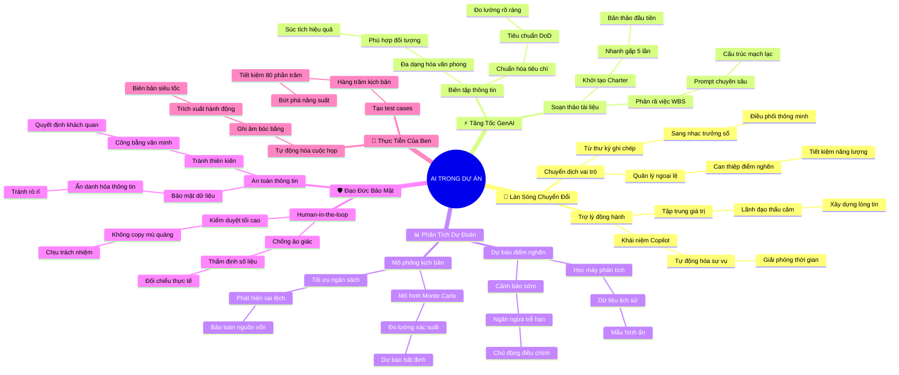

# 🧠 BẢN ĐỒ TƯ DUY TINH GỌN (4-5 TẦNG): HỌC PHẦN 5 - AI TRONG QUẢN TRỊ DỰ ÁN

## 1. Sơ Đồ Tư Duy Trực Quan (Mermaid Mindmap Tinh Gọn)

---

## 2. Cây Phân Cấp Tri Thức Gợi Nhớ Nhanh 4-5 Tầng (Active Recall Hierarchy)

- 📌 **[Phần I: Làn Sóng AI & Chuyển Dịch Tư Duy Quản Trị]**
  - 🔹 *AI là Copilot chiến lược:* ➔ *Đảm nhận tính toán soạn thảo thô* ➔ *Giải phóng 40-50% thời gian cho PM* ➔ *Ví dụ: Hệ thống Autopilot giữ thăng bằng, cơ trưởng quyết định hạ cánh bão*
  - 🔹 *Chuyển dịch từ thủ công sang ngoại lệ:* ➔ *Quản lý theo ngoại lệ (MBE)* ➔ *Bot AI tự động quét tiến độ* ➔ *Ví dụ: Bot tự động cảnh báo nhiệm vụ trễ hạn quá 24h thay vì giục từng người*

- 📌 **[Phần II: Ứng Dụng GenAI Trong Khởi Tạo & Lập Kế Hoạch]**
  - 🔹 *Soạn thảo siêu tốc qua Prompting:* ➔ *Khung Role - Task - Context - Constraints* ➔ *Xuất bản thảo Charter & WBS trong 3 phút* ➔ *Ví dụ: Ra lệnh cho AI tạo khung WBS 3 cấp độ cho dự án mỹ phẩm*
  - 🔹 *Chuẩn hóa DoD & Tùy biến văn phong:* ➔ *Tiêu chuẩn Definition of Done* ➔ *Dịch báo cáo kỹ thuật phức tạp sang tóm tắt điều hành* ➔ *Ví dụ: Tóm tắt sự cố sập server thành 2 câu cho ban giám đốc*

- 📌 **[Phần III: Phân Tích Dự Đoán & Quản Trị Rủi Ro Thông Minh]**
  - 🔹 *Phát hiện mẫu hình rủi ro tiềm ẩn:* ➔ *Học máy quét dữ liệu lịch sử* ➔ *Dự báo điểm nghẽn dựa trên Velocity* ➔ *Ví dụ: Google Maps cảnh báo kẹt xe trước 30 phút*
  - 🔹 *Mô phỏng kịch bản Monte Carlo:* ➔ *Đo lường xác suất trễ hạn và bội chi* ➔ *Chủ động kích hoạt phương án dự phòng* ➔ *Ví dụ: Mô phỏng xác suất hoàn thành tính năng thanh toán đúng hạn*

- 📌 **[Phần IV: Đạo Đức, Bảo Mật Dữ Liệu & Human-in-the-Loop]**
  - 🔹 *Nguyên tắc con người làm chủ:* ➔ *Human-in-the-loop & Chống ảo giác (Hallucination)* ➔ *PM chịu trách nhiệm pháp lý cuối cùng* ➔ *Ví dụ: Bác sĩ dùng AI soi phim nhưng tự tay khám và ký đơn thuốc*
  - 🔹 *Bảo mật & Tránh thiên kiến:* ➔ *Ẩn danh hóa dữ liệu (Data Masking)* ➔ *Không đưa dữ liệu mật lên AI công cộng* ➔ *Ví dụ: Đổi tên khách hàng và số tiền thành Dự án Alpha trước khi prompt*

- 📌 **[Phần V: Thực Tiễn Ứng Dụng Đột Phá: Câu Chuyện Của Ben]**
  - 🔹 *Tự động hóa cuộc họp:* ➔ *Ghi âm ➔ Tóm tắt ➔ Trích xuất Action Items* ➔ *Email giao việc xuất xưởng sau 30 giây* ➔ *Ví dụ: Họp 60 phút có ngay danh sách ai làm gì trước thứ Sáu*
  - 🔹 *Sinh kịch bản kiểm thử (Test Cases):* ➔ *Tạo hàng trăm trường hợp thử nghiệm tự động* ➔ *Tiết kiệm 80% thời gian hành chính* ➔ *Ví dụ: Ben giải phóng năng lượng sáng tạo bứt phá năng suất*

---

## 3. Bảng Neo Trí Nhớ Từ Khóa Vàng (Memory Anchor Cheat Sheet)

| Từ Khóa Cốt Lõi | Phần Trong Tài Liệu | Bản Chất / Vai Trò (3-5 từ) | Tín Hiệu Gợi Nhớ (Memory Trigger) |
| :--- | :--- | :--- | :--- |
| **PM Copilot** | Phần I | Trợ lý số đắc lực | Người phụ lái thông minh ngồi cạnh cơ trưởng |
| **Management by Exception** | Phần I | Chỉ can thiệp ngoại lệ | Chuông báo cháy chỉ reo khi có khói bốc lên |
| **Prompt Engineering** | Phần II | Nghệ thuật ra lệnh AI | Chiếc đũa thần gõ đúng câu thần chú chuẩn xác |
| **DoD Clarification** | Phần II | Chuẩn hóa tiêu chí xong | Vạch vôi trắng rõ ràng ở đích đến cuộc đua |
| **Predictive Risk** | Phần III | Dự báo rủi ro tự động | Kính viễn vọng thiên văn nhìn thấy trước cơn bão |
| **Human-in-the-Loop** | Phần IV | Con người giữ quyền chốt | Người gác cổng kiên định không cho lỗi lọt qua |
| **AI Hallucination** | Phần IV | Ảo giác của thuật toán | Ảo ảnh ốc đảo cát giữa sa mạc nắng cháy |
| **Data Masking** | Phần IV | Ẩn danh hóa dữ liệu mật | Chiếc mặt nạ che kín danh tính người tham gia |
| **Ben's Automation** | Phần V | Thực chiến tự động hóa | Cỗ máy thần kỳ biến 3 ngày việc thành vài phút |
