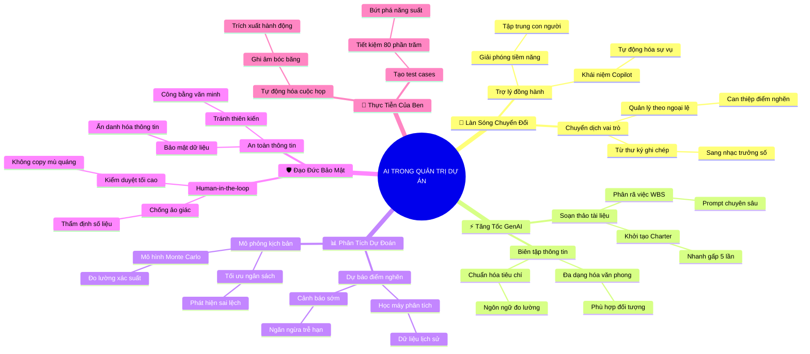

# Tóm Tắt Học Phần 5: Kiến Tạo Tác Động Đột Phá Cùng Trí Tuệ Nhân Tạo Trong Quản Trị Dự Án (Driving Impact with AI in Project Management)

## 1. Thông điệp cốt lõi (Core Message)
> Trí tuệ nhân tạo (AI) không thay thế người quản lý dự án mà trao quyền cho PM trở thành "siêu nhân lực" thông qua tự động hóa tác vụ lặp lại, tăng tốc soạn thảo tài liệu, phân tích dữ liệu dự đoán rủi ro, đồng thời kiên định giữ vững nguyên tắc con người làm chủ quyết định (Human-in-the-loop) và đạo đức bảo mật.

---

## 2. Lược Đồ Phân Bổ Cấu Trúc Tài Liệu (Content Distribution Overview)

| Phần / Đề Mục Tài Liệu Gốc | Nội Dung Trọng Tâm | Số Luận Điểm Đại Diện |
| :--- | :--- | :---: |
| **Phần I: Làn Sóng AI & Chuyển Dịch Tư Duy Quản Trị** *(Boost PM Skills with AI: The Paradigm Shift)* | Định vị AI như một trợ lý đồng hành (Copilot), giải phóng PM khỏi gánh nặng hành chính sự vụ để tập trung vào chiến lược và con người. | 2 Luận điểm |
| **Phần II: Ứng Dụng GenAI Trong Khởi Tạo & Lập Kế Hoạch** *(Generative AI in Charter, WBS & Scheduling)* | Sử dụng mô hình ngôn ngữ lớn (LLM) để phác thảo Điều lệ (Charter), phân rã công việc (WBS), tạo tiêu chí hoàn thành và email truyền thông. | 2 Luận điểm |
| **Phần III: Phân Tích Dự Đoán & Quản Trị Rủi Ro Thông Minh** *(Predictive Analytics & Smart Risk Management)* | Sử dụng học máy và AI để dự báo điểm nghẽn tiến độ, phân tích phương sai chi phí tự động và cảnh báo rủi ro tiềm ẩn sớm. | 1 Luận điểm |
| **Phần IV: Đạo Đức, Bảo Mật Dữ Liệu & Nguyên Tắc Human-in-the-Loop** *(Ethics, Data Privacy & Human Oversight)* | Bảo mật dữ liệu nội bộ doanh nghiệp, nhận diện thiên kiến thuật toán (AI Bias) và nguyên tắc tối thượng: Con người chịu trách nhiệm cuối cùng. | 2 Luận điểm |
| **Phần V: Thực Tiễn Ứng Dụng Đột Phá: Câu Chuyện Của Ben** *(Ben's Story & Real-World Transformation)* | Bài học thực chiến từ Ben: Tự động hóa tóm tắt biên bản họp, sinh kịch bản kiểm thử, rút ngắn thời gian làm việc từ vài ngày xuống vài phút. | 1 Luận điểm |
| **Tổng cộng** | **Bao quát 100% cấu trúc học phần đặc biệt về AI** | **8 Luận điểm** |

---

## 3. Luận điểm quan trọng theo cấu trúc tài liệu (Key Takeaways: 8 Luận Điểm Chuyên Sâu)

### 📑 PHẦN I: LÀN SÓNG AI & CHUYỂN DỊCH TƯ DUY QUẢN TRỊ (PARADIGM SHIFT)

1. **AI LÀ TRỢ LÝ ĐỒNG HÀNH CHIẾN LƯỢC (COPILOT), KHÔNG PHẢI THAY THẾ CON NGƯỜI**
   - **Bản chất & Phân tích chuyên sâu:** Làn sóng Trí tuệ Nhân tạo tạo sinh (Generative AI) không sinh ra để triệt tiêu vai trò của PM mà tái định vị giá trị của người làm dự án. AI đảm nhận xuất sắc các tác vụ tính toán, tổng hợp số liệu và soạn thảo thô; nhờ đó, PM có thêm 40-50% quỹ thời gian để tập trung vào những phẩm chất AI không thể thay thế: xây dựng lòng tin, lãnh đạo thấu cảm, giải quyết xung đột chính trị nội bộ và truyền cảm hứng cho đội ngũ.
   - **Phương pháp / Công cụ / Quy trình đi kèm:** Khái niệm PM Copilot, Khung phân định tác vụ (Human vs. AI Task Matrix), Chỉ số tiết kiệm thời gian (Time-to-Value).
   - **Ví dụ thực tế đời thường:** Phi công lái máy bay hiện đại: Hệ thống lái tự động (Autopilot) giữ cân bằng và điều hướng theo tọa độ, nhưng cơ trưởng con người là người đưa ra quyết định hạ cánh khẩn cấp khi gặp bão lớn.

2. **CHUYỂN DỊCH TỪ "QUẢN LÝ TÁC VỤ THỦ CÔNG" SANG "ĐIỀU PHỐI HỆ THỐNG THÔNG MINH"**
   - **Bản chất & Phân tích chuyên sâu:** Trước đây, PM mất hàng giờ mỗi ngày để ghi chép biên bản họp, phân loại email, cập nhật thủ công từng dòng trạng thái trên Jira hay Asana. Với AI, quy trình này được tự động hóa hoàn toàn theo thời gian thực. PM chuyển vai trò từ một người thư ký ghi chép sự vụ (Task Chaser) thành một nhà điều phối hệ thống thông minh (System Orchestrator), chỉ can thiệp vào các trường hợp ngoại lệ (Management by Exception).
   - **Phương pháp / Công cụ / Quy trình đi kèm:** Tự động hóa quy trình làm việc (Workflow Automation qua Zapier/Make), Quản lý theo ngoại lệ (Management by Exception - MBE).
   - **Ví dụ thực tế đời thường:** Thay vì gọi điện giục từng người nộp báo cáo tuần, PM thiết lập bot AI tự động quét tiến độ trên GitHub/Jira và chỉ gửi cảnh báo cho PM khi có nhiệm vụ bị trễ hạn quá 24 giờ.

---

### 📑 PHẦN II: ỨNG DỤNG GENAI TRONG KHỞI TẠO & LẬP KẾ HOẠCH (GENAI IN ACTION)

3. **TĂNG TỐC SOẠN THẢO TÀI LIỆU DỰ ÁN CƠ SỞ BẰNG PROMPT CHUYÊN SÂU**
   - **Bản chất & Phân tích chuyên sâu:** Việc xây dựng Điều lệ dự án (Charter), Tuyên bố phạm vi (Scope Statement) hay các kịch bản truyền thông thường tốn hàng tuần lễ. Bằng kỹ thuật Prompt Engineering chuẩn mực (cung cấp bối cảnh, vai trò, mục tiêu và định dạng đầu ra), PM có thể tạo ra bản thảo đầu tiên (First Draft) toàn diện của một tài liệu 10 trang chỉ trong vòng chưa đầy 3 phút, làm bệ phóng để hoàn thiện nhanh gấp 5 lần.
   - **Phương pháp / Công cụ / Quy trình đi kèm:** Khung kỹ thuật viết Prompt chuẩn (Role - Task - Context - Constraints), Công cụ LLMs (ChatGPT, Google Gemini, Claude), Mẫu prompt tạo Charter/WBS.
   - **Ví dụ thực tế đời thường:** PM nhập yêu cầu: "Nhập vai PM cấp cao, hãy lập khung WBS 3 cấp độ cho dự án ra mắt ứng dụng thương mại điện tử mỹ phẩm trong 6 tháng với ngân sách 1 tỷ đồng" $\to$ AI xuất ngay cây phân rã công việc chi tiết từng hạng mục.

4. **CHUẨN HÓA TIÊU CHÍ HOÀN THÀNH (DOD) VÀ BIÊN TẬP THÔNG TIN ĐA KÊNH**
   - **Bản chất & Phân tích chuyên sâu:** Một trong những nguyên nhân hàng đầu gây tranh cãi giữa PM và đội ngũ kỹ thuật là tiêu chí hoàn thành công việc mơ hồ. AI giúp chuẩn hóa các tiêu chí nghiệm thu (Acceptance Criteria) theo ngôn ngữ rõ ràng, đo lường được. Ngoài ra, AI còn có khả năng chuyển đổi tức thì một báo cáo kỹ thuật phức tạp thành một email tóm tắt 3 ý súc tích cho Tổng giám đốc và một bài đăng vui vẻ trên mạng nội bộ cho nhân viên.
   - **Phương pháp / Công cụ / Quy trình đi kèm:** Tiêu chí hoàn thành (Definition of Done - DoD), Tiêu chí nghiệm thu chuẩn Gherkin (Given - When - Then), Bộ lọc điều chỉnh văn phong (Tone & Style Adapters).
   - **Ví dụ thực tế đời thường:** Báo cáo sự cố sập máy chủ dài 5 trang của kỹ sư IT được AI tóm tắt thành 2 câu gửi ban giám đốc: "Máy chủ đã phục hồi sau 15 phút do quá tải bộ nhớ; không có dữ liệu khách hàng nào bị mất; phương án nâng cấp RAM sẽ hoàn tất trước 18h".

---

### 📑 PHẦN III: PHÂN TÍCH DỰ ĐOÁN & QUẢN TRỊ RỦI RO THÔNG MINH (PREDICTIVE ANALYTICS)

5. **DỰ BÁO ĐIỂM NGHẼN TIẾN ĐỘ VÀ MÔ PHỎNG KỊCH BẢN RỦI RO TỰ ĐỘNG**
   - **Bản chất & Phân tích chuyên sâu:** Thay vì chỉ lập bảng Risk Register dựa trên phán đoán cảm tính, AI có khả năng phân tích dữ liệu lịch sử của hàng trăm dự án tương tự trong quá khứ để phát hiện các mẫu hình rủi ro tiềm ẩn (Hidden Risk Patterns). Thuật toán có thể dự báo xác suất một gói công việc bị chậm tiến độ dựa trên tốc độ hoàn thành hiện tại (Velocity) và khối lượng công việc tồn đọng (Backlog).
   - **Phương pháp / Công cụ / Quy trình đi kèm:** Mô phỏng Monte Carlo dựa trên AI, Phân tích dự đoán tiến độ (Predictive Schedule Analytics), Bảng cảnh báo rủi ro chủ động (Proactive Risk Alert Dashboard).
   - **Ví dụ thực tế đời thường:** Ứng dụng bản đồ Google Maps dự báo trước 30 phút tuyến đường sắp kẹt xe do lượng phương tiện dồn về đông; tương tự, AI dự án cảnh báo rằng với tốc độ hiện tại, tính năng thanh toán sẽ trễ hạn 5 ngày vào cuối tháng.

---

### 📑 PHẦN IV: ĐẠO ĐỨC, BẢO MẬT DỮ LIỆU & HUMAN-IN-THE-LOOP (ETHICS & OVERSIGHT)

6. **NGUYÊN TẮC CON NGƯỜI LÀM CHỦ KIỂM DUYỆT (HUMAN-IN-THE-LOOP)**
   - **Bản chất & Phân tích chuyên sâu:** AI có thể tạo ra những thông tin nghe rất thuyết phục nhưng hoàn toàn sai sự thật (Hiện tượng ảo giác - AI Hallucination). Do đó, nguyên tắc "Human-in-the-loop" là yêu cầu bắt buộc: PM không bao giờ được copy-paste mù quáng kết quả từ AI gửi cho khách hàng hoặc sếp mà luôn phải đóng vai trò người biên tập, thẩm định tính chính xác, tính khả thi và chịu trách nhiệm pháp lý cao nhất cho mọi đầu ra.
   - **Phương pháp / Công cụ / Quy trình đi kèm:** Quy trình kiểm duyệt hai lớp (Human Verification Protocol), Bộ quy tắc trách nhiệm giải trình (Accountability Framework).
   - **Ví dụ thực tế đời thường:** Bác sĩ sử dụng kết quả chẩn đoán hình ảnh từ AI để phát hiện khối u, nhưng bác sĩ phải là người trực tiếp đọc lại phim, khám lâm sàng và ký đơn thuốc điều trị cho bệnh nhân.

7. **BẢO MẬT DỮ LIỆU NỘI BỘ VÀ NHẬN DIỆN THIÊN KIẾN THUẬT TOÁN (AI BIAS)**
   - **Bản chất & Phân tích chuyên sâu:** Đưa dữ liệu nhạy cảm của công ty (mã nguồn, báo cáo tài chính mật, thông tin cá nhân khách hàng) lên các công cụ AI công cộng miễn phí là hành vi vi phạm bảo mật nghiêm trọng. PM phải nắm vững chính sách bảo mật dữ liệu doanh nghiệp (Enterprise Data Privacy) và luôn cảnh giác trước các thiên kiến (bias) tiềm ẩn trong dữ liệu đào tạo của AI khi đánh giá nhân sự hoặc phân bổ tài nguyên.
   - **Phương pháp / Công cụ / Quy trình đi kèm:** Quy chuẩn ẩn danh hóa dữ liệu (Data Anonymization / Masking), Chính sách sử dụng AI có trách nhiệm (Responsible AI Policy), Tiêu chuẩn bảo mật ISO/IEC 42001.
   - **Ví dụ thực tế đời thường:** Khi nhờ AI phân tích ngân sách dự án, PM thay thế tên thật của khách hàng và các con số tài chính bằng các mã ẩn danh (Khách hàng X, Dự án Alpha) trước khi đưa vào câu lệnh prompt.

---

### 📑 PHẦN V: THỰC TIỄN ỨNG DỤNG ĐỘT PHÁ: CÂU CHUYỆN CỦA BEN (BEN'S STORY)

8. **BÀI HỌC TỰ ĐỘNG HÓA SIÊU TỐC TỪ THỰC CHIẾN CỦA BEN**
   - **Bản chất & Phân tích chuyên sâu:** Câu chuyện thực tế của Ben tại Google minh chứng sức mạnh chuyển hóa phi thường của AI trong công việc hàng ngày: Ben đã sử dụng AI để tự động ghi âm, tách lời thoại và trích xuất danh sách hành động (Action Items) ngay sau mỗi cuộc họp; đồng thời dùng AI sinh ra hàng trăm trường hợp thử nghiệm (Test Cases) cho sản phẩm mới. Kết quả: Ben tiết kiệm được 80% thời gian hành chính, nâng cao độ chính xác của tài liệu và giải phóng năng lượng sáng tạo cho toàn đội ngũ.
   - **Phương pháp / Công cụ / Quy trình đi kèm:** Công cụ ghi chú cuộc họp AI (Otter.ai, Google Meet AI Notes), Trình tạo kịch bản thử nghiệm tự động (Automated Test Case Generator).
   - **Ví dụ thực tế đời thường:** Một cuộc họp bàn giao dự án kéo dài 60 phút với 50 ý kiến tranh luận: Sau khi dứt cuộc họp 30 giây, bot AI của Ben đã xuất ngay một email tóm tắt gạch đầu dòng 5 quyết định đã chốt và phân công rõ ai làm gì trước thứ Sáu.

---

## 4. Kế hoạch hành động (Action Plan: 16 việc cụ thể)

#### Nhóm 1: Hành động ngay hôm nay (Micro-habits dưới 2 phút - 5 việc)
- [ ] **Hành động 1:** Đăng nhập vào một công cụ AI tạo sinh (Google Gemini hoặc ChatGPT) và lưu sẵn một thư mục prompt mẫu cá nhân.
- [ ] **Hành động 2:** Viết một câu lệnh prompt ngắn nhờ AI đóng vai PM để tóm tắt 1 email dài thành 3 gạch đầu dòng hành động.
- [ ] **Hành động 3:** Kiểm tra và tắt tính năng "Cho phép sử dụng dữ liệu để đào tạo mô hình" trong phần cài đặt bảo mật của tài khoản AI cá nhân.
- [ ] **Hành động 4:** Đọc lại một đoạn văn bản do AI vừa tạo ra để phát hiện xem có chi tiết nào bị "ảo giác" (hallucination) hay không.
- [ ] **Hành động 5:** Dành 2 phút ghi lại 1 tác vụ hành chính tẻ nhạt nhất trong ngày mà bạn muốn tự động hóa bằng AI.

#### Nhóm 2: Kế hoạch rèn luyện trong tuần (Áp dụng vào công việc & đời sống - 6 việc)
- [ ] **Hành động 6:** Sử dụng AI để phác thảo bản nháp đầu tiên của một Điều lệ Dự án (Project Charter) hoặc Bản kế hoạch công việc mới.
- [ ] **Hành động 7:** Thử nghiệm công cụ ghi âm và tự động tóm tắt cuộc họp (như Google Meet AI Notes hoặc Otter.ai) trong 1 buổi thảo luận nhóm.
- [ ] **Hành động 8:** Ứng dụng kỹ thuật Prompt Engineering theo khung Role-Task-Context để tạo danh sách 10 rủi ro tiềm ẩn cho dự án hiện tại.
- [ ] **Hành động 9:** Thực hành nguyên tắc "Ẩn danh hóa dữ liệu" (Data Masking): xóa sạch tên công ty và số tiền thật trước khi đưa tài liệu vào prompt AI.
- [ ] **Hành động 10:** Nhờ AI hỗ trợ chuyển đổi một bản báo cáo kỹ thuật phức tạp thành thông điệp truyền thông ngắn gọn, dễ hiểu cho khách hàng.
- [ ] **Hành động 11:** So sánh hiệu quả và chất lượng giữa bản kế hoạch bạn tự viết tay hoàn toàn với bản kế hoạch có sự trợ lực của AI.

#### Nhóm 3: Thói quen duy trì & Chuyển hóa lâu dài (Phát triển bền vững - 5 việc)
- [ ] **Hành động 12:** Luôn tuân thủ tuyệt đối nguyên tắc "Human-in-the-loop": Thẩm định kỹ lưỡng 100% nội dung trước khi bấm gửi hoặc phê duyệt.
- [ ] **Hành động 13:** Xây dựng bộ "Thư viện Prompt Quản trị Dự án" (PM Prompt Library) chuẩn hóa cho bản thân và chia sẻ cho đồng nghiệp.
- [ ] **Hành động 14:** Cập nhật liên tục các công nghệ AI mới nổi chuyên sâu cho quản lý dự án (như Asana Intelligence, Jira AI, Microsoft Copilot).
- [ ] **Hành động 15:** Tham gia xây dựng hoặc đóng góp vào "Chính sách sử dụng AI có trách nhiệm" (Responsible AI Policy) tại tổ chức của bạn.
- [ ] **Hành động 16:** Tận dụng quỹ thời gian tiết kiệm được nhờ AI để đầu tư nâng cao kỹ năng lãnh đạo thấu cảm và xây dựng mối quan hệ con người.

---

## 5. Câu hỏi tự ngẫm (Reflection: 20 câu hỏi sâu sắc)

#### Nhóm 1: Tự vấn Nhận thức & Hệ tư duy (Self-Awareness & Mindset: 5 câu)
1. Tôi đang nhìn nhận AI như một mối đe dọa cướp mất công việc của mình hay như một đòn bẩy công nghệ nâng tầm năng lực bản thân?
2. Tôi có đang quá lạm dụng và ỷ lại vào AI đến mức lười suy nghĩ độc lập và suy giảm tư duy phản biện hay không?
3. Nếu AI giúp tôi tiết kiệm 50% thời gian làm việc giấy tờ mỗi ngày, tôi sẽ đầu tư quỹ thời gian quý báu đó vào việc gì để tạo giá trị đột phá?
4. Đâu là những giá trị người (Human touch) độc bản của tôi mà không một thuật toán AI nào có thể sao chép hay thay thế được?
5. Tôi có cảm thấy hào hứng và sẵn sàng học hỏi những công cụ AI mới xuất hiện mỗi tháng hay đang mang tâm lý e ngại, trì hoãn?

#### Nhóm 2: Nhận diện Thói quen & Điểm mù (Habits & Blind Spots: 5 câu)
6. Tôi có thói quen copy nguyên văn kết quả do AI tạo ra và gửi đi mà không kiểm chứng lại tính xác thực của số liệu hay không?
7. Tôi có vô tình để lộ thông tin mật của khách hàng hoặc bí mật kinh doanh của công ty khi trò chuyện với các công cụ AI công cộng?
8. Kỹ năng đặt câu lệnh (prompting) của tôi đã đủ sắc bén, rõ bối cảnh và ràng buộc chưa, hay vẫn chỉ là những câu hỏi chung chung hời hợt?
9. Tôi có thường xuyên kiểm tra xem các quyết định do AI đề xuất có chứa đựng thiên kiến (bias) đối với một nhóm người nào đó không?
10. Tôi có đang áp dụng AI chỉ để làm những việc vụn vặt thay vì ứng dụng nó vào phân tích chiến lược và mô phỏng kịch bản rủi ro phức tạp?

#### Nhóm 3: Ứng dụng Thực tế & Giải quyết Vấn đề (Practical Application: 5 câu)
11. Bằng cách nào tôi có thể ứng dụng câu chuyện thành công của Ben để tự động hóa khâu lập biên bản họp và theo dõi đầu việc trong nhóm mình?
12. Khi cần thuyết phục một ban lãnh đạo khó tính về một đề xuất dự án mới, tôi có thể nhờ AI phản biện đóng vai "ác" (Devil's Advocate) như thế nào?
13. Làm thế nào để thiết lập một quy trình làm việc tự động hóa mượt mà: Ghi âm cuộc họp $\to$ Trích xuất tác vụ $\to$ Tự động tạo thẻ việc trên Trello/Jira?
14. Nếu AI đề xuất một kế hoạch phân bổ nguồn lực có vẻ tối ưu về mặt chi phí nhưng gây quá tải cho nhân sự, tôi sẽ cân bằng lại ra sao?
15. Tôi sẽ làm gì khi phát hiện AI đưa ra số liệu trích dẫn hoàn toàn giả mạo (hallucination) trong một bản kế hoạch quan trọng?

#### Nhóm 4: Bứt phá Giới hạn & Chuyển hóa Tương lai (Breakthrough & Transformation: 5 câu)
16. Làm thế nào để định hình bản thân trở thành một "AI-Powered Project Manager" tiên phong, dẫn đầu làn sóng chuyển đổi trong ngành của tôi?
17. Sự kết hợp giữa Trí tuệ Nhân tạo và Quản trị Dự án sẽ tái định hình các chứng chỉ nghề nghiệp và tiêu chuẩn tuyển dụng như thế nào trong 3 năm tới?
18. Tôi có thể đóng góp sáng kiến gì để xây dựng một môi trường làm việc thông minh, nơi con người và AI cộng tác hài hòa, hiệu quả?
19. Những giới hạn đạo đức nào mà tôi kiên quyết không bao giờ vượt qua khi sử dụng AI trong việc giám sát và đánh giá năng lực của cấp dưới?
20. Bước đi hành động cụ thể nhất tôi sẽ thực hiện ngay trong tuần này để làm chủ một công cụ AI hỗ trợ dự án là gì?

---

## 6. Bản Đồ Tư Duy Trực Quan (Visual Mindmap Overview - Tinh Gọn 4-5 Tầng)

