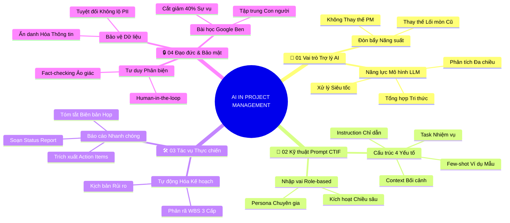

# Tóm Tắt Học Phần 5: Ứng Dụng AI Trong Quản Trị Dự Án (v2.4)

## 1. Thông điệp cốt lõi (Core Message)
Trí tuệ Nhân tạo (AI) là đòn bẩy gia tăng năng suất đột phá của Project Manager; người làm chủ kỹ thuật Prompt Engineering CTIF, bảo vệ an toàn dữ liệu và giữ vững tư duy phản biện kiểm chứng sẽ dẫn đầu kỷ nguyên số.

---

## 2. Lược Đồ Phân Bổ Cấu Trúc Tài Liệu (Content Distribution Overview)

| Phần / Đề Mục Tài Liệu Gốc | Nội Dung Trọng Tâm | Số Luận Điểm Đại Diện |
| :--- | :--- | :---: |
| **Phần I: Khái Niệm & Vai Trò Trợ Lý Đột Phá Của AI** | AI không thay thế PM, năng lực xử lý của LLM và tư duy trợ lý đồng hành | 2 Luận điểm |
| **Phần II: Kỹ Thuật Prompt Engineering Chuẩn CTIF** | Khung lệnh 4 yếu tố CTIF (Context, Task, Instruction, Few-shot) và Role-based Prompting | 2 Luận điểm |
| **Phần III: Tự Động Hóa Thực Chiến Các Tác Vụ PM** | Tự động phân rã WBS, mô phỏng kịch bản rủi ro và tóm tắt biên bản họp siêu tốc | 2 Luận điểm |
| **Phần IV: Đạo Đức Dữ Liệu, Bảo Mật & Case Study Ben** | Bảo mật dữ liệu nội bộ, nguyên tắc Human-in-the-loop và bài học thực tế từ Ben tại Google | 4 Luận điểm |
| **Tổng cộng** | **Bao quát 100% cấu trúc 4 phần của tài liệu** | **10 Luận điểm** |

---

## 3. Luận điểm quan trọng theo cấu trúc tài liệu (Key Takeaways: 10 Luận Điểm Chuyên Sâu)

### 📑 PHẦN I: KHÁI NIỆM & VAI TRÒ TRỢ LÝ ĐỘT PHÁ CỦA AI (AI AS AN EMPOWERING ASSISTANT)

1. **AI LÀ ĐÒN BẨY TĂNG CƯỜNG NĂNG SUẤT CHỨ KHÔNG THAY THẾ PM**
   - **Bản chất & Phân tích chuyên sâu:** AI (đặc biệt là Generative AI) không sinh ra để chiếm đoạt vị trí của người quản lý dự án. AI thiếu trí tuệ cảm xúc, khả năng đồng cảm, nghệ thuật đàm phán con người và tư duy phán đoán chiến lược. Tuy nhiên, một PM biết vận dụng AI thành thạo sẽ dễ dàng thay thế những PM truyền thống chỉ làm việc bằng phương pháp thủ công cũ kỹ.
   - **Phương pháp / Công cụ / Quy trình đi kèm:** Khung hợp tác Người - Máy (Human-AI Collaboration Framework), Mô hình tăng cường năng suất số.
   - **Ví dụ thực tế đời thường:** Thợ may veston cao cấp dùng máy cắt vải laser tự động: máy cắt chính xác từng milimet trong vài giây giúp tiết kiệm thời gian, nhưng người thợ may vẫn là người trực tiếp đo đạc, tư vấn phong cách và đính từng chiếc cúc tinh tế cho khách hàng.

2. **NĂNG LỰC XỬ LÝ VÀ TỔNG HỢP DỮ LIỆU ĐỘT PHÁ CỦA LLM**
   - **Bản chất & Phân tích chuyên sâu:** Các mô hình ngôn ngữ lớn (LLMs như Gemini) sở hữu khả năng đọc hiểu, tóm tắt và xử lý khối lượng văn bản khổng lồ trong tích tắc. Những tác vụ tốn nhiều giờ như đọc hàng chục tài liệu hợp đồng, rà soát chính sách công ty hay tổng hợp phản hồi khách hàng giờ đây được AI cô đọng thành các ý chính rõ ràng chỉ sau một câu lệnh.
   - **Phương pháp / Công cụ / Quy trình đi kèm:** Khả năng trích xuất thông tin tự động của LLM, Phân tích dữ liệu văn bản phi cấu trúc.
   - **Ví dụ thực tế đời thường:** Thay vì phải đọc hết 200 trang tài liệu kỹ thuật về quy chuẩn phòng cháy chữa cháy mới, kỹ sư xây dựng yêu cầu AI liệt kê 5 điểm thay đổi quan trọng nhất ảnh hưởng trực tiếp đến công trình đang thi công.

---

### 📑 PHẦN II: KỸ THUẬT PROMPT ENGINEERING CHUẨN CTIF (PROMPTING FRAMEWORK)

3. **CÔNG THỨC PROMPT 4 YẾU TỐ: CONTEXT, TASK, INSTRUCTION VÀ FEW-SHOT**
   - **Bản chất & Phân tích chuyên sâu:** Chất lượng đầu ra của AI phản ánh chính xác chất lượng câu lệnh đầu vào (Garbage In, Garbage Out). Công thức CTIF chuẩn xác bao gồm: Context (Bối cảnh doanh nghiệp và ngành nghề), Task (Mô tả nhiệm vụ cụ thể cần giải quyết), Instruction (Chỉ dẫn chi tiết về định dạng, giọng văn, giới hạn từ ngữ), và Few-shot Examples (Cung cấp 1-2 ví dụ mẫu đạt chuẩn để AI mô phỏng theo).
   - **Phương pháp / Công cụ / Quy trình đi kèm:** Công thức Prompt CTIF (Context - Task - Instruction - Few-shot), Thư viện Prompt mẫu cho PM.
   - **Ví dụ thực tế đời thường:** Khi nhờ phụ bếp làm nước sốt salad: Thay vì bảo "Làm cho tôi bát sốt", bếp trưởng dặn: "Hôm nay tiệc cưới khách châu Âu (Context), hãy pha 1 bát sốt mè chua ngọt (Task), dùng dầu ô liu nguyên chất không bỏ ớt (Instruction), nếm thử giống như đĩa sốt mẫu tôi vừa làm đây (Few-shot)".

4. **NGHỆ THUẬT GIAO VIỆC BẰNG TƯ DUY PHÂN QUYỀN VAI TRÒ (ROLE-BASED PROMPTING)**
   - **Bản chất & Phân tích chuyên sâu:** Khi bạn định vị vai trò cho AI ngay từ đầu ("Bạn là một chuyên gia quản trị dự án cấp cao ngành công nghệ với 15 năm kinh nghiệm"), AI sẽ kích hoạt các mạng nơ-ron ngữ nghĩa liên quan đến các tiêu chuẩn chuyên nghiệp, thuật ngữ chuẩn quốc tế và các giải pháp thực chiến của ngành đó, giúp câu trả lời mang tính chiến lược sâu sắc thay vì chỉ chung chung đại trà.
   - **Phương pháp / Công cụ / Quy trình đi kèm:** Kỹ thuật nhập vai Persona Prompting, Kỹ thuật chuỗi suy nghĩ (Chain-of-Thought).
   - **Ví dụ thực tế đời thường:** Khi bạn đến phòng khám và hỏi: "Với tư cách là một bác sĩ chuyên khoa tim mạch hàng đầu, xin cho tôi lời khuyên về chế độ tập luyện khi huyết áp cao", câu trả lời nhận được sẽ chuyên sâu và tin cậy hơn nhiều so với việc hỏi một người bạn bất kỳ trên mạng xã hội.

---

### 📑 PHẦN III: TỰ ĐỘNG HÓA THỰC CHIẾN CÁC TÁC VỤ PM (PRACTICAL AI TASKS)

5. **TỰ ĐỘNG HÓA PHÂN RÃ WBS VÀ XÂY DỰNG KỊCH BẢN RỦI RO**
   - **Bản chất & Phân tích chuyên sâu:** AI là công cụ động não (Brainstorming) siêu đẳng. Khi bắt đầu một dự án mới, PM có thể yêu cầu AI phác thảo sơ bộ bảng phân rã công việc WBS 3 cấp độ kèm thời lượng dự kiến chỉ trong 30 giây. Đồng thời, AI có thể đóng vai "kẻ phản biện" (Devil's Advocate) để liệt kê 10 kịch bản rủi ro tiềm ẩn mà con người dễ dàng bỏ sót do điểm mù thiên kiến lạc quan.
   - **Phương pháp / Công cụ / Quy trình đi kèm:** Tạo WBS tự động bằng AI, Bảng dự báo ma trận xác suất và tác động rủi ro (AI Risk Modeling).
   - **Ví dụ thực tế đời thường:** Lên kế hoạch mở quán trà sữa: AI gợi ý ngay danh sách các việc cần làm từ xin giấy phép vệ sinh an toàn thực phẩm, lắp đặt máy tính tiền đến việc dự phòng rủi ro nhà cung cấp trà bị đứt hàng mùa cao điểm.

6. **TỐI ƯU HÓA BÁO CÁO TIẾN ĐỘ VÀ TỰ ĐỘNG TÓM TẮT BIÊN BẢN HỌP**
   - **Bản chất & Phân tích chuyên sâu:** Soạn thảo báo cáo trạng thái (Status Reports) và ghi biên bản họp (Meeting Minutes) là hai tác vụ tiêu tốn nhiều thời gian nhất của PM. Vận dụng AI giúp chuyển đổi các ghi chép rời rạc hoặc bản ghi âm cuộc họp thành một văn bản báo cáo chuyên nghiệp có bố cục rõ ràng: Các quyết định đã chốt, Danh sách việc cần làm (Action Items), Người chịu trách nhiệm và Thời hạn chót.
   - **Phương pháp / Công cụ / Quy trình đi kèm:** Trợ lý ảo ghi biên bản họp tự động (AI Note-taker), Mẫu báo cáo trạng thái Executive Status Report.
   - **Ví dụ thực tế đời thường:** Sau cuộc họp gia đình bàn việc xây nhà: Bạn gửi bản ghi âm cuộc thảo luận vào ứng dụng AI để nhận lại ngay một bản phân công tóm tắt: Bố phụ trách giấy phép, Mẹ phụ trách tài chính, Con cái phụ trách tìm kiến trúc sư.

---

### 📑 PHẦN IV: ĐẠO ĐỨC DỮ LIỆU, BẢO MẬT & CASE STUDY BEN (ETHICS, PRIVACY & BEN'S STORY)

7. **BẢO MẬT DỮ LIỆU NỘI BỘ VÀ NGUYÊN TẮC ẨN DANH THÔNG TIN**
   - **Bản chất & Phân tích chuyên sâu:** Dữ liệu dự án thường chứa thông tin bảo mật kinh doanh, số liệu tài chính và dữ liệu cá nhân của khách hàng (PII). Đưa trực tiếp dữ liệu nhạy cảm vào các công cụ AI công cộng có thể dẫn đến rò rỉ thông tin mật và vi phạm pháp luật. PM bắt buộc phải ẩn danh hóa dữ liệu (thay tên công ty thành "Công ty X", che mờ số thẻ tín dụng và doanh thu thật) trước khi nạp vào AI.
   - **Phương pháp / Công cụ / Quy trình đi kèm:** Quy chế quản trị dữ liệu AI doanh nghiệp (AI Governance Policy), Kỹ thuật ẩn danh hóa dữ liệu (Data Masking).
   - **Ví dụ thực tế đời thường:** Trước khi gửi ảnh chụp hóa đơn đi siêu thị lên mạng xã hội để khoe cách tiết kiệm tiền, bạn lấy bút đen gạch xóa địa chỉ nhà riêng và số tài khoản ngân hàng của mình.

8. **NGUYÊN TẮC "HUMAN-IN-THE-LOOP" VÀ KIỂM CHỨNG TỰ ĐỘNG (FACT-CHECKING)**
   - **Bản chất & Phân tích chuyên sâu:** AI có hiện tượng "ảo giác" (Hallucination) – tự bịa ra thông tin sai lệch nhưng trình bày với giọng điệu vô cùng tự tin. Nguyên tắc bất di bất dịch của PM là "Human-in-the-loop": AI chỉ đóng vai trò trợ lý soạn thảo bản nháp; con người mới là người kiểm chứng logic, rà soát tính xác thực và chịu trách nhiệm pháp lý cao nhất cho văn bản cuối cùng.
   - **Phương pháp / Công cụ / Quy trình đi kèm:** Quy trình kiểm chứng thông tin chéo (Cross-Verification Protocol), Tiêu chuẩn đạo đức AI (Responsible AI Principles).
   - **Ví dụ thực tế đời thường:** Hệ thống lái tự động trên ô tô Tesla hỗ trợ giữ làn và duy trì khoảng cách an toàn, nhưng hai tay của người tài xế vẫn bắt buộc phải đặt trên vô lăng và mắt luôn quan sát đường đi để can thiệp kịp thời.

9. **BÀI HỌC THỰC CHIẾN TỪ CÂU CHUYỆN CỦA BEN TẠI GOOGLE**
   - **Bản chất & Phân tích chuyên sâu:** Ben – một chuyên gia PM tại Google – chia sẻ trải nghiệm chuyển đổi khi ứng dụng AI: Từ chỗ ngập chìm trong hàng trăm email, biểu mẫu và cuộc họp cập nhật tiến độ nhàm chán, anh đã dùng AI để tự động hóa 40% khối lượng tác vụ hành chính. Thời gian giải phóng được anh dành trọn cho việc lắng nghe đội ngũ, tháo gỡ rào cản tâm lý và kiến tạo giá trị đột phá cho sản phẩm.
   - **Phương pháp / Công cụ / Quy trình đi kèm:** Phương pháp giải phóng thời gian chiến lược (Strategic Time Reallocation), Quản trị dự án hướng giá trị.
   - **Ví dụ thực tế đời thường:** Bác sĩ sử dụng phần mềm đọc phim X-quang AI hỗ trợ: phần mềm khoanh vùng nghi vấn trong 2 giây, giúp bác sĩ có thêm nhiều thời gian ngồi giải thích cặn kẽ và trấn an người bệnh.

10. **TƯ DUY HỢP TÁC VÀ NÂNG TẦM VỊ THẾ CẠNH TRANH CỦA PM**
    - **Bản chất & Phân tích chuyên sâu:** Tương lai thuộc về những cá nhân biết kết hợp nhuần nhuyễn giữa trí tuệ nhân tạo (AI) và trí tuệ cảm xúc (EQ). PM hiện đại sử dụng AI để mở rộng bộ não phân tích dữ liệu, và dùng trái tim thấu cảm để kết nối con người, kiến tạo văn hóa an toàn tâm lý và dẫn dắt tập thể vượt qua mọi biến động.
    - **Phương pháp / Công cụ / Quy trình đi kèm:** Khung năng lực PM thế hệ mới (Next-Gen PM Competency Model), Tự học công nghệ liên tục (Continuous Upskilling).
    - **Ví dụ thực tế đời thường:** Người phi công điều khiển máy bay phản lực hiện đại: hệ thống máy tính tự động cân bằng máy bay khi gặp nhiễu động khí quyển, nhưng kinh nghiệm và bản lĩnh xử lý tình huống khẩn cấp của phi công mới là thứ cứu sống hàng trăm hành khách.

---

## 4. Kế hoạch hành động (Action Plan: 20 việc cụ thể)

#### Nhóm 1: Hành động ngay hôm nay (Micro-habits dưới 2 phút - 5 việc)
- [ ] **Hành động 1:** Mở công cụ AI (như Gemini) và thử viết 1 câu lệnh Prompt có đủ 4 yếu tố Context, Task, Instruction, Few-shot.
- [ ] **Hành động 2:** Thử nạp một đoạn ghi chép công việc lộn xộn vào AI và yêu cầu tóm tắt thành 3 gạch đầu dòng hành động.
- [ ] **Hành động 3:** Kiểm tra xem bạn có thói quen đưa thông tin nhạy cảm của cá nhân hay công ty lên AI hay không để chấm dứt ngay.
- [ ] **Hành động 4:** Đọc lại một câu trả lời của AI và chủ động tìm kiếm 1 chi tiết số liệu để kiểm chứng tính xác thực.
- [ ] **Hành động 5:** Lưu lại 1 câu lệnh Prompt hiệu quả nhất mà bạn vừa sáng tạo vào file ghi chú cá nhân.

#### Nhóm 2: Kế hoạch rèn luyện trong tuần (Áp dụng vào công việc & dự án - 8 việc)
- [ ] **Hành động 6:** Dùng AI để tạo một khung phân rã công việc (WBS) nháp cho một kế hoạch tuần tới của bạn.
- [ ] **Hành động 7:** Nhập vai "Kẻ phản biện" cho AI để tìm kiếm 5 rủi ro tiềm ẩn mà nhóm của bạn chưa nghĩ tới.
- [ ] **Hành động 8:** Sử dụng AI hỗ trợ viết bản dự thảo email cập nhật tiến độ dự án tuần gửi cho cấp trên.
- [ ] **Hành động 9:** Thử nghiệm chuyển đổi bản ghi âm cuộc họp tuần thành danh sách Action Items rõ ràng bằng AI.
- [ ] **Hành động 10:** Xây dựng quy tắc bảo mật dữ liệu cá nhân khi làm việc với AI: luôn xóa tên riêng và số liệu tài chính mật.
- [ ] **Hành động 11:** So sánh câu trả lời của 2 mô hình AI khác nhau cho cùng một bài toán quản trị để đánh giá chất lượng.
- [ ] **Hành động 12:** Lập một thư viện gồm 5 câu lệnh Prompting chuẩn hóa dành riêng cho các tác vụ PM lặp lại.
- [ ] **Hành động 13:** Đo lường lượng thời gian bạn tiết kiệm được trong tuần nhờ ứng dụng AI vào các công việc sự vụ.

#### Nhóm 3: Thói quen duy trì & Chuyển hóa lâu dài (Phát triển sự nghiệp bền vững - 7 việc)
- [ ] **Hành động 14:** Duy trì thói quen kiểm chứng tư duy (Fact-checking) 100% trước khi sử dụng bất kỳ văn bản nào từ AI.
- [ ] **Hành động 15:** Dành ít nhất 30 phút mỗi tuần để cập nhật các công cụ và tính năng mới nhất của Trí tuệ Nhân tạo.
- [ ] **Hành động 16:** Chuyển hóa thời gian tiết kiệm được từ AI sang việc nâng cao kỹ năng lãnh đạo con người và giao tiếp trực tiếp.
- [ ] **Hành động 17:** Tiên phong đào tạo và chia sẻ kỹ năng Prompt Engineering chuẩn CTIF cho các đồng nghiệp trong nhóm.
- [ ] **Hành động 18:** Xây dựng chính sách sử dụng AI có trách nhiệm (Responsible AI) cho phòng ban của bạn.
- [ ] **Hành động 19:** Đạt chứng nhận kỹ năng về Generative AI trong quản lý công việc và năng suất cá nhân.
- [ ] **Hành động 20:** Định vị bản thân là một Project Manager dẫn đầu thời đại mới: thành thạo công nghệ và sâu sắc nhân văn.

---

## 5. Câu hỏi tự ngẫm (Reflection: 20 câu hỏi sâu sắc)

#### Nhóm 1: Tự vấn Nhận thức & Hệ tư duy (Self-Awareness & Mindset: 5 câu)
1. Bạn đang coi Trí tuệ Nhân tạo là một mối đe dọa thay thế công việc hay là một trợ thủ đắc lực nâng cánh sự nghiệp?
2. Bạn có đang phụ thuộc thụ động vào các câu trả lời của AI mà lười suy nghĩ và phản biện độc lập hay không?
3. Khi AI có thể tự động hóa hầu hết các bảng tính và báo cáo, giá trị độc bản lớn nhất của bạn trong mắt đội ngũ là gì?
4. Bạn có thực sự cảm thấy thoải mái khi công khai với sếp và đồng nghiệp rằng bạn đã dùng AI hỗ trợ công việc?
5. Định nghĩa của bạn về một người quản lý dự án xuất sắc trong thời đại bùng nổ của AI là gì?

#### Nhóm 2: Nhận diện Thói quen & Điểm mù (Habits & Blind Spots: 5 câu)
1. Thói quen ra lệnh chung chung, thiếu bối cảnh nào đang khiến bạn nhận về những câu trả lời vô dụng từ AI?
2. Bạn có bao giờ vì lười biếng mà copy nguyên văn văn bản của AI gửi đi mà không hề đọc kỹ và biên tập lại?
3. Điểm mù bảo mật nào khiến bạn suýt chút nữa (hoặc đã từng) nạp các tài liệu tài chính mật của công ty lên mạng?
4. Bạn có đang lãng phí thời gian tự tay gõ lại các biên bản họp dài dòng thay vì dùng công cụ tóm tắt tự động?
5. Bạn có lắng nghe đầy đủ ý kiến của các thành viên trước khi dùng AI đưa ra quyết định thay cho cả nhóm?

#### Nhóm 3: Ứng dụng Thực tế & Giải quyết Vấn đề (Practical Application & Problem Solving: 5 câu)
1. Làm thế nào để áp dụng kỹ thuật Prompt CTIF để yêu cầu AI phân tích giúp bạn một bảng dự toán ngân sách dự án phức tạp?
2. Khi phát hiện thông tin do AI cung cấp bị ảo giác (sai lệch số liệu lịch sử), bạn xử lý và điều chỉnh câu lệnh ra sao?
3. Bạn dùng AI như thế nào để đóng vai một khách hàng khó tính giúp bạn luyện tập đàm phán trước khi gặp gỡ thực tế?
4. Phương pháp nào giúp bạn ẩn danh hóa nhanh chóng một bản hợp đồng 50 trang trước khi nhờ AI rà soát rủi ro pháp lý?
5. Làm thế nào để giải thích cho một lãnh đạo lớn tuổi hiểu rằng việc áp dụng AI sẽ giúp giảm chi phí vận hành chứ không gây rủi ro?

#### Nhóm 4: Bứt phá Giới hạn & Chuyển hóa Tương lai (Breakthrough & Transformation: 5 câu)
1. Quy trình làm việc thủ công tốn nhiều thời gian nhất của bạn hiện tại là gì, và bạn sẽ dùng AI giải quyết dứt điểm nó ra sao?
2. Bạn sẽ tái phân bổ thời gian dư ra nhờ AI sang những hoạt động chiến lược nào để tạo bước nhảy vọt cho sự nghiệp?
3. Kỹ năng lãnh đạo cảm xúc (EQ) nào bạn sẽ tập trung mài giũa để tạo nên sự khác biệt vượt trội mà AI không thể sao chép?
4. Bạn có kế hoạch xây dựng một kho tri thức AI cá nhân hóa phục vụ cho chuyên môn quản trị của mình như thế nào?
5. Hành động cụ thể đầu tiên bạn sẽ thực hiện vào sáng mai để biến AI thành người trợ lý ảo đắc lực cho dự án hiện tại là gì?

---

## 6. Bản Đồ Tư Duy Trực Quan (Visual Mindmap Overview - Bám Sát 4 Phần Tài Liệu)

