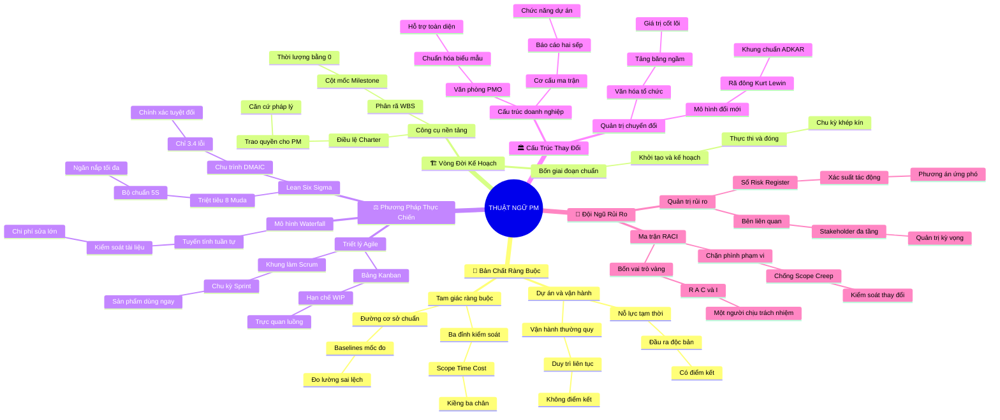

# 🧠 BẢN ĐỒ TƯ DUY TINH GỌN (4-5 TẦNG): HỌC PHẦN 6 - BẢNG THUẬT NGỮ CHUẨN QUỐC TẾ

## 1. Sơ Đồ Tư Duy Trực Quan (Mermaid Mindmap Tinh Gọn)

---

## 2. Cây Phân Cấp Tri Thức Gợi Nhớ Nhanh 4-5 Tầng (Active Recall Hierarchy)

- 📌 **[Cụm I: Bản Chất Dự Án & Bộ Ràng Buộc Nền Tảng]**
  - 🔹 *Project vs. Operations:* ➔ *Tạm thời & Độc bản vs. Liên tục & Lặp lại* ➔ *Definition of Done* ➔ *Ví dụ: Xây nhà máy sản xuất xe hơi vs. Lắp ráp xe hàng ngày*
  - 🔹 *Triple Constraints & Baselines:* ➔ *Scope - Time - Cost* ➔ *Đường cơ sở làm mốc đối chiếu* ➔ *Ví dụ: Đóng tủ quần áo muốn thêm ngăn kéo phải bù tiền*

- 📌 **[Cụm II: Vòng Đời Triển Khai & Công Cụ Lập Kế Hoạch]**
  - 🔹 *Project Charter & Stakeholders:* ➔ *Văn bản trao quyền chính thức* ➔ *Quản lý kỳ vọng các bên* ➔ *Ví dụ: Giấy phép xây dựng nhà và biên bản họp tổ dân phố*
  - 🔹 *WBS & Milestones:* ➔ *Phân rã gói công việc Deliverable-oriented* ➔ *Mốc hoàn thành thời lượng bằng 0* ➔ *Ví dụ: Cây phân chia môn thi đại học và ngày thi thử*

- 📌 **[Cụm III: Phương Pháp Luận & Khung Làm Việc Thực Chiến]**
  - 🔹 *Waterfall vs. Agile:* ➔ *Tuyến tính tuần tự vs. Lặp chu kỳ thích ứng* ➔ *Scrum Sprints & Kanban WIP Limit* ➔ *Ví dụ: Xây cầu vượt bê tông vs. Phát triển ứng dụng di động*
  - 🔹 *Lean & Six Sigma:* ➔ *8 lãng phí Muda (DOWNTIME) & 5S* ➔ *Chu trình DMAIC (3.4 lỗi/triệu)* ➔ *Ví dụ: Tối ưu gian bếp nhà hàng và căn chỉnh máy rót nước ngọt*

- 📌 **[Cụm IV: Cấu Trúc Tổ Chức, Văn Hóa & Chuyển Đổi]**
  - 🔹 *Matrix & PMO:* ➔ *Báo cáo hai sếp song song* ➔ *Văn phòng chuẩn hóa OPA* ➔ *Ví dụ: Bác sĩ trực cấp cứu tuân theo Trưởng kíp mổ*
  - 🔹 *Culture & Change Management:* ➔ *Mô hình tảng băng trôi* ➔ *3 bước Lewin & Khung ADKAR* ➔ *Ví dụ: Chuyển đổi từ họp trực tiếp sang họp Zoom có quy chế*

- 📌 **[Cụm V: Lãnh Đạo Đội Ngũ, Truyền Thông & Quản Trị Rủi Ro]**
  - 🔹 *RACI Matrix & Scope Creep:* ➔ *Chỉ duy nhất 1 người chịu trách nhiệm (A)* ➔ *Quy trình Change Control chặn phình việc* ➔ *Ví dụ: Thuê thợ sơn nhà nhưng nhờ sơn thêm cửa sổ miễn phí*
  - 🔹 *Risk Register:* ➔ *Xác suất và mức độ tác động* ➔ *Bốn chiến lược ứng phó rủi ro* ➔ *Ví dụ: Đi nước ngoài chụp ảnh hộ chiếu lưu trên điện thoại*

---

## 3. Bảng Neo Trí Nhớ Từ Khóa Vàng (Memory Anchor Cheat Sheet)

| Từ Khóa Cốt Lõi | Cụm Trong Tài Liệu | Bản Chất / Vai Trò (3-5 từ) | Tín Hiệu Gợi Nhớ (Memory Trigger) |
| :--- | :--- | :--- | :--- |
| **Project Definition** | Cụm I | Nỗ lực tạm thời độc bản | Chuyến thám hiểm có đích đến và ngày trở về |
| **Baseline Triad** | Cụm I | Thước đo chuẩn cơ sở | Cọc mốc ranh giới không được tự ý nhổ đi |
| **Project Charter** | Cụm II | Giấy ủy quyền tối thượng | Ấn tín của vua trao cho khâm sai đại thần |
| **Milestone Marker** | Cụm II | Cột mốc thời lượng 0 | Lá cờ cắm trên đỉnh núi đánh dấu chiến thắng |
| **WBS Decomposition** | Cụm II | Phân rã gói việc nhỏ | Xẻ khúc gỗ lớn thành từng thanh củi vừa bếp |
| **Agile Sprint** | Cụm III | Chu kỳ lặp nước rút | Vòng chạy tiếp sức 2 tuần trao gậy sản phẩm |
| **Kanban WIP** | Cụm III | Giới hạn việc đang làm | Cửa soát vé chỉ cho 3 người qua một lượt |
| **DMAIC Cycle** | Cụm III | Năm bước diệt trừ lỗi | Năm ngón tay siết chặt kiểm soát quy trình |
| **Matrix Dual Boss** | Cụm IV | Cơ chế hai sếp quản | Người chơi đàn hai tay đánh hai bè khác nhau |
| **RACI Accountability** | Cụm V | Một người chịu trách nhiệm | Vị thuyền trưởng quyết định hướng lái con tàu |
| **Scope Creep** | Cụm V | Phình phạm vi ngoài luồng | Con quái vật ăn thêm việc làm vỡ bụng ngân sách |
