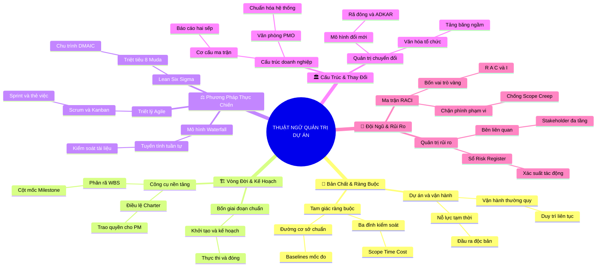

# Tóm Tắt Học Phần 6: Bảng Thuật Ngữ Và Định Nghĩa Quản Trị Dự Án Chuẩn Quốc Tế (Course 1 Glossary: Terms and Definitions)

## 1. Thông điệp cốt lõi (Core Message)
> Hệ thống thuật ngữ quản trị dự án chuẩn quốc tế là "ngôn ngữ chung" (Lingua Franca) giúp người làm dự án giao tiếp chuẩn xác, xóa bỏ mơ hồ ngữ nghĩa, đồng bộ tư duy và vận hành các phương pháp luận chuyên nghiệp một cách nhất quán trên quy mô toàn cầu.

---

## 2. Lược Đồ Phân Bổ Cấu Trúc Tài Liệu (Content Distribution Overview)

| Phân Cụm Thuật Ngữ Theo Hệ Thống Tài Liệu | Nội Dung Trọng Tâm | Số Luận Điểm Đại Diện |
| :--- | :--- | :---: |
| **Cụm I: Bản Chất Dự Án & Bộ Ràng Buộc Nền Tảng** *(Letters P, T, O, B: Project, Triple Constraints, Operations, Baseline)* | Khái niệm dự án, vận hành thường quy, tam giác ràng buộc, các đường cơ sở và cổng kiểm soát giai đoạn. | 2 Luận điểm |
| **Cụm II: Vòng Đời Triển Khai & Công Cụ Lập Kế Hoạch** *(Letters I, P, E, C, W, M: Initiating, Planning, WBS, Charter, Milestone)* | Bốn giai đoạn vòng đời, Điều lệ dự án (Charter), Cấu trúc phân rã công việc (WBS), Cột mốc và Nghiệm thu bàn giao. | 2 Luận điểm |
| **Cụm III: Phương Pháp Luận & Khung Làm Việc Thực Chiến** *(Letters A, W, S, K, L, D: Agile, Waterfall, Scrum, Kanban, Lean, Six Sigma)* | Thác nước, triết lý Agile, khung làm việc Scrum, bảng Kanban, 8 lãng phí Muda, 5S và chu trình 5 bước DMAIC. | 2 Luận điểm |
| **Cụm IV: Cấu Trúc Tổ Chức, Văn Hóa & Chuyển Đổi** *(Letters C, M, O, U: Classic, Matrix, PMO, Culture, Change Agent, Lewin)* | Cơ cấu Cổ điển vs. Ma trận, Văn phòng PMO, Tảng băng văn hóa, Quản trị sự thay đổi và mô hình Rã đông - Tái đông. | 2 Luận điểm |
| **Cụm V: Lãnh Đạo Đội Ngũ, Truyền Thông & Quản Trị Rủi Ro** *(Letters C, R, S, F, E: RACI, Cross-functional, Risk Register, Scope Creep)* | Ma trận RACI, đội ngũ đa chức năng, kiểm soát phình phạm vi (Scope Creep), Bảng ghi nhận rủi ro và các bên liên quan. | 2 Luận điểm |
| **Tổng cộng** | **Hệ thống hóa toàn diện 100% thuật ngữ từ A đến W** | **10 Luận điểm** |

---

## 3. Luận điểm quan trọng theo cấu trúc tài liệu (Key Takeaways: 10 Luận Điểm Chuyên Sâu)

### 📑 CỤM I: BẢN CHẤT DỰ ÁN & BỘ RÀNG BUỘC NỀN TẢNG (PROJECT & CONSTRAINTS)

1. **PHÂN BIỆT DỰ ÁN (PROJECT) VÀ VẬN HÀNH THƯỜNG QUY (OPERATIONS)**
   - **Bản chất & Phân tích chuyên sâu:** Dự án là một chuỗi nỗ lực tạm thời có khởi đầu và kết thúc xác định nhằm tạo ra một sản phẩm, dịch vụ hoặc kết quả độc nhất vô nhị. Vận hành thường quy là các hoạt động liên tục, lặp đi lặp lại nhằm duy trì dòng tiền và hoạt động kinh doanh hàng ngày của tổ chức. Dự án kết thúc khi bàn giao xong mục tiêu, còn vận hành không có điểm kết thúc định trước.
   - **Phương pháp / Công cụ / Quy trình đi kèm:** Tiêu chí hoàn thành (Definition of Done - DoD), Sổ theo dõi hoạt động kinh doanh (Standard Operating Procedures - SOP).
   - **Ví dụ thực tế đời thường:** Xây dựng một nhà máy sản xuất xe hơi mới là Dự án; việc dập khung xe, lắp ráp và kiểm tra chất lượng hàng ngày trên dây chuyền đó là Vận hành thường quy.

2. **TAM GIÁC RÀNG BUỘC (TRIPLE CONSTRAINTS) VÀ ĐƯỜNG CƠ SỞ (BASELINES)**
   - **Bản chất & Phân tích chuyên sâu:** Tam giác quản trị dự án là mô hình mô tả sự tương tác phụ thuộc lẫn nhau giữa Phạm vi (Scope), Thời gian (Time) và Chi phí (Cost) bao quanh Chất lượng (Quality). Đường cơ sở (Baseline) là bản kế hoạch đã được phê duyệt chính thức làm chuẩn mốc để đo lường phương sai thực tế. Bất kỳ sự thay đổi nào đối với một cạnh của tam giác đều buộc phải điều chỉnh các cạnh còn lại.
   - **Phương pháp / Công cụ / Quy trình đi kèm:** Bộ ba đường cơ sở (Performance Measurement Baseline: Scope, Schedule, Cost Baseline), Quy trình kiểm soát thay đổi (Integrated Change Control).
   - **Ví dụ thực tế đời thường:** Đóng một tủ quần áo gỗ: Kích thước 2 mét và loại gỗ là Phạm vi, ngày giao hàng cuối tuần là Thời gian, giá tiền 10 triệu là Chi phí; nếu muốn đóng thêm 2 ngăn kéo (tăng Scope), bạn phải trả thêm 1 triệu hoặc chấp nhận lấy muộn hơn 2 ngày.

---

### 📑 CỤM II: VÒNG ĐỜI TRIỂN KHAI & CÔNG CỤ LẬP KẾ HOẠCH (LIFE CYCLE & PLANNING)

3. **ĐIỀU LỆ DỰ ÁN (PROJECT CHARTER) VÀ CÁC BÊN LIÊN QUAN (STAKEHOLDERS)**
   - **Bản chất & Phân tích chuyên sâu:** Điều lệ dự án là văn bản pháp lý chính thức do Nhà tài trợ (Project Sponsor) ký ban hành, tuyên bố sự tồn tại của dự án và trao quyền cho PM sử dụng nguồn lực doanh nghiệp. Bên liên quan (Stakeholder) là bất kỳ cá nhân hay tổ chức nào có thể tác động, bị tác động hoặc cảm thấy mình bị tác động bởi quyết định hoặc kết quả của dự án.
   - **Phương pháp / Công cụ / Quy trình đi kèm:** Điều lệ dự án (Charter), Ma trận phân tích các bên liên quan (Stakeholder Analysis Grid).
   - **Ví dụ thực tế đời thường:** Giấy phép xây dựng và biên bản họp cư dân tổ dân phố ký chấp thuận cho phép bạn xây nhà mới chính là Điều lệ dự án; những người hàng xóm bị ảnh hưởng tiếng ồn và bụi bặm là Stakeholders quan trọng cần chăm sóc.

4. **CẤU TRÚC PHÂN RÃ CÔNG VIỆC (WBS) VÀ CỘT MỐC (MILESTONES)**
   - **Bản chất & Phân tích chuyên sâu:** WBS là sự phân rã có thứ bậc dựa trên kết quả bàn giao (Deliverable-oriented) của toàn bộ phạm vi công việc cần thực hiện. Gói công việc nhỏ nhất ở tầng đáy của WBS gọi là Gói công việc (Work Package). Cột mốc (Milestone) là các điểm mốc quan trọng đánh dấu sự hoàn thành của một giai đoạn lớn hoặc một đầu ra then chốt, có thời lượng bằng 0 (Duration = 0).
   - **Phương pháp / Công cụ / Quy trình đi kèm:** Cấu trúc WBS, Từ điển WBS (WBS Dictionary), Biểu đồ Gantt đánh dấu Milestone hình thoi.
   - **Ví dụ thực tế đời thường:** Quá trình thi đại học: WBS chia thành Toán, Văn, Anh; trong môn Toán chia thành Giải tích và Hình học; ngày thi thử toàn thành phố và ngày công bố điểm chuẩn chính là các Milestones.

---

### 📑 CỤM III: PHƯƠNG PHÁP LUẬN & KHUNG LÀM VIỆC THỰC CHIẾN (METHODOLOGIES)

5. **THÁC NƯỚC (WATERFALL) VÀ PHƯƠNG PHÁP TIÊN ĐOÁN**
   - **Bản chất & Phân tích chuyên sâu:** Waterfall là phương pháp quản trị tuần tự, giai đoạn sau chỉ bắt đầu khi giai đoạn trước đã được phê duyệt và đóng lại 100%. Phương pháp này đặt nặng việc lập kế hoạch chi tiết từ đầu và kiểm soát tài liệu nghiêm ngặt. Phù hợp nhất khi yêu cầu đã rõ ràng, ít biến động và chi phí sửa sai cực lớn.
   - **Phương pháp / Công cụ / Quy trình đi kèm:** Kế hoạch quản trị dự án tuần tự, Báo cáo phương sai tiến độ truyền thống.
   - **Ví dụ thực tế đời thường:** Xây một cây cầu vượt bằng bê tông: Phải khảo sát địa chất và đúc móng cầu xong mới được lắp dầm cầu, không thể vừa cho xe chạy vừa đúc trụ cầu.

6. **LINH HOẠT (AGILE), SCRUM, KANBAN VÀ LEAN SIX SIGMA**
   - **Bản chất & Phân tích chuyên sâu:** Agile là triết lý phát triển thích ứng thông qua các chu kỳ lặp ngắn. Scrum hiện thực hóa Agile bằng các đợt chạy nước rút (Sprint) kéo dài 1-4 tuần. Kanban trực quan hóa dòng chảy công việc và hạn chế việc đang làm (Work in Progress - WIP). Lean tập trung triệt tiêu 8 loại lãng phí (Muda). Six Sigma áp dụng quy trình 5 bước DMAIC (Define, Measure, Analyze, Improve, Control) để giảm thiểu biến thiên và sai sót.
   - **Phương pháp / Công cụ / Quy trình đi kèm:** Khung làm việc Scrum, Bảng Kanban có giới hạn WIP, Mô hình DOWNTIME của Lean, Chu trình DMAIC của Six Sigma.
   - **Ví dụ thực tế đời thường:** Phát triển mạng xã hội: phát hành bản thử nghiệm sau mỗi 2 tuần (Scrum Sprint), dùng bảng dán giấy nhớ việc cần làm (Kanban), loại bỏ các bước điền form rườm rà (Lean) và kiểm thử để không có lỗi văng app (Six Sigma).

---

### 📑 CỤM IV: CẤU TRÚC TỔ CHỨC, VĂN HÓA & CHUYỂN ĐỔI (ORGANIZATION & CHANGE)

7. **CƠ CẤU MA TRẬN (MATRIX) VÀ VĂN PHÒNG QUẢN TRỊ DỰ ÁN (PMO)**
   - **Bản chất & Phân tích chuyên sâu:** Cơ cấu ma trận kết hợp phân cấp chức năng với các nhóm dự án liên phòng ban, nơi nhân viên có cơ chế báo cáo hai sếp. PMO là bộ phận trung tâm chuyên trách việc chuẩn hóa quy trình, cung cấp công cụ, đào tạo phương pháp và hỗ trợ quản lý danh mục dự án cho toàn tổ chức.
   - **Phương pháp / Công cụ / Quy trình đi kèm:** Ba loại hình Ma trận (Weak, Balanced, Strong), Ba cấp độ PMO (Supportive, Controlling, Directive).
   - **Ví dụ thực tế đời thường:** Khoa cấp cứu bệnh viện: Bác sĩ chịu sự quản lý chuyên môn của Trưởng khoa (Functional Manager), nhưng khi vào kíp mổ cấp cứu thì tuân theo mệnh lệnh của Trưởng kíp mổ (Project Manager).

8. **VĂN HÓA TỔ CHỨC VÀ MÔ HÌNH QUẢN TRỊ SỰ THAY ĐỔI (CHANGE MANAGEMENT)**
   - **Bản chất & Phân tích chuyên sâu:** Văn hóa tổ chức là tập hợp các giá trị, niềm tin và hành vi ngầm định chi phối cách mọi người làm việc. Quản trị thay đổi là quy trình giúp con người chuẩn bị, đón nhận và thích nghi với sự thay đổi do dự án mang lại. Mô hình 3 bước của Lewin (Rã đông - Thay đổi - Tái đông) và mô hình ADKAR giúp định hướng chuyển đổi tâm lý từ sợ hãi sang hợp tác.
   - **Phương pháp / Công cụ / Quy trình đi kèm:** Mô hình Tảng băng văn hóa, Khung chuyển đổi Kurt Lewin, Khung đo lường cá nhân ADKAR.
   - **Ví dụ thực tế đời thường:** Chuyển từ họp trực tiếp sang họp trực tuyến Zoom: Rã đông thói quen cũ bằng thông báo chỉ đạo, đào tạo cách dùng phần mềm (Thay đổi) và ban hành quy chế họp online cố định hàng tuần (Tái đông).

---

### 📑 CỤM V: LÃNH ĐẠO ĐỘI NGŨ, TRUYỀN THÔNG & QUẢN TRỊ RỦI RO (LEADERSHIP & RISK)

9. **MA TRẬN RACI VÀ HIỆN TƯỢNG PHÌNH PHẠM VI (SCOPE CREEP)**
   - **Bản chất & Phân tích chuyên sâu:** RACI là ma trận làm rõ vai trò của từng cá nhân đối với mỗi tác vụ: R (Responsible - Người thực hiện), A (Accountable - Người chịu trách nhiệm tối cao, duy nhất 1 người), C (Consulted - Người được tham vấn ý kiến), I (Informed - Người được thông báo kết quả). Scope Creep là hiện tượng phạm vi dự án bị nở rộng liên tục do nhận thêm các yêu cầu mới mà không có sự điều chỉnh tương ứng về thời gian, chi phí và tài nguyên.
   - **Phương pháp / Công cụ / Quy trình đi kèm:** Ma trận phân công RACI, Bảng quy trình kiểm soát thay đổi (Change Request Log).
   - **Ví dụ thực tế đời thường:** Thuê thợ sơn nhà: Gia chủ chỉ định rõ anh thợ cả là người chịu trách nhiệm hoàn thiện (Accountable); ban đầu chỉ thuê sơn tường phòng khách, nhưng chủ nhà liên tục bảo "sơn hộ thêm cái cửa sổ và ban công" mà không trả thêm tiền (Scope Creep điển hình).

10. **SỔ GHI NHẬN RỦI RO (RISK REGISTER) VÀ CÁC BÊN LIÊN QUAN CHÍNH YẾU**
    - **Bản chất & Phân tích chuyên sâu:** Rủi ro là sự kiện không chắc chắn có thể gây tác động tiêu cực (đe dọa) hoặc tích cực (cơ hội) đến mục tiêu dự án. Risk Register là tài liệu ghi nhận toàn bộ rủi ro, phân tích xác suất xảy ra, mức độ tác động và các biện pháp ứng phó cụ thể (Né tránh, Chuyển giao, Giảm thiểu, hoặc Chấp nhận).
    - **Phương pháp / Công cụ / Quy trình đi kèm:** Ma trận Xác suất - Tác động (Probability and Impact Matrix), Kế hoạch ứng phó rủi ro (Risk Response Plan).
    - **Ví dụ thực tế đời thường:** Đi du lịch nước ngoài: Rủi ro mất hộ chiếu (Xác suất thấp, tác động cực lớn) $\to$ Phương án giảm thiểu: Chụp ảnh lưu hộ chiếu trên điện thoại và cất bản photocopy trong vali ở khách sạn.

---

## 4. Kế hoạch hành động (Action Plan: 17 việc cụ thể)

#### Nhóm 1: Hành động ngay hôm nay (Micro-habits dưới 2 phút - 5 việc)
- [ ] **Hành động 1:** Đọc lại định nghĩa của 3 thuật ngữ: Project, Scope Creep và RACI để đảm bảo bạn có thể giải thích lại cho người khác mà không cần nhìn tài liệu.
- [ ] **Hành động 2:** Lập nhanh một Ma trận RACI cho 1 đầu việc nhỏ trong gia đình hoặc nhóm làm việc (chỉ định rõ ai là chữ A duy nhất).
- [ ] **Hành động 3:** Ghi ra giấy 1 mục tiêu cột mốc (Milestone) quan trọng nhất của bạn trong tháng này với thời lượng bằng 0 (Duration = 0).
- [ ] **Hành động 4:** Kiểm tra xem dự án hiện tại của bạn có bản Điều lệ (Charter) bằng văn bản chính thức hay chỉ thỏa thuận miệng.
- [ ] **Hành động 5:** Nhận diện 1 ví dụ về hiện tượng phình phạm vi (Scope Creep) vừa xảy ra trong tuần này của bạn.

#### Nhóm 2: Kế hoạch rèn luyện trong tuần (Áp dụng vào công việc & đời sống - 7 việc)
- [ ] **Hành động 6:** Xây dựng một Bảng phân loại thuật ngữ cá nhân (Glossary Flashcards) bằng phần mềm Anki hoặc Quizlet để ôn tập active recall.
- [ ] **Hành động 7:** Lập một Bảng ghi nhận rủi ro (Risk Register) mẫu cho công việc hiện tại gồm ít nhất 5 rủi ro và phương án ứng phó.
- [ ] **Hành động 8:** Sử dụng đúng các thuật ngữ chuẩn quốc tế (Sprint, Stand-up, Deliverable, Milestone) trong các cuộc họp tuần của đội ngũ.
- [ ] **Hành động 9:** Vẽ sơ đồ chuỗi giá trị (Value Stream Mapping) ngắn để phân loại các bước gia tăng giá trị và các bước lãng phí (Muda).
- [ ] **Hành động 10:** Thử nghiệm thiết lập 1 bảng Kanban với cột "Đang làm" (In Progress) giới hạn không quá 3 đầu việc cùng lúc (WIP Limit).
- [ ] **Hành động 11:** Phân loại cấu trúc tổ chức hiện tại của công ty bạn: Thuộc nhóm Ma trận yếu, cân bằng hay mạnh?.
- [ ] **Hành động 12:** Tổ chức một buổi chia sẻ ngắn 15 phút về các thuật ngữ quản trị dự án cơ bản cho các thành viên mới trong nhóm.

#### Nhóm 3: Thói quen duy trì & Chuyển hóa lâu dài (Phát triển bền vững - 5 việc)
- [ ] **Hành động 13:** Sử dụng ngôn ngữ quản trị dự án chuẩn mực quốc tế một cách tự nhiên trong mọi báo cáo và giao tiếp chuyên nghiệp.
- [ ] **Hành động 14:** Thường xuyên cập nhật từ điển thuật ngữ mới của Viện Quản lý Dự án Quốc tế (PMI Lexicon of Project Management Terms).
- [ ] **Hành động 15:** Thiết lập thói quen kiên quyết từ chối hoặc yêu cầu đàm phán lại ngân sách/thời gian mỗi khi phát hiện có mầm mống Scope Creep.
- [ ] **Hành động 16:** Xây dựng văn hóa trách nhiệm giải trình cao trong đội ngũ bằng cách luôn gắn nhãn RACI cho mọi nhiệm vụ quan trọng.
- [ ] **Hành động 17:** Tận dụng kho thuật ngữ làm nền tảng vững chắc để thi đỗ các chứng chỉ quốc tế như Google PM Certificate, CAPM và PMP.

---

## 5. Câu hỏi tự ngẫm (Reflection: 20 câu hỏi sâu sắc)

#### Nhóm 1: Tự vấn Nhận thức & Hệ tư duy (Self-Awareness & Mindset: 5 câu)
1. Tôi đã thực sự nắm vững bản chất sâu xa của các thuật ngữ chuyên ngành hay chỉ đang học vẹt từ ngữ bề nổi?
2. Khi giao tiếp với khách hàng hoặc ban giám đốc, tôi có biết cách dịch chuyển các thuật ngữ kỹ thuật sang ngôn ngữ kinh doanh gần gũi không?
3. Trong các dự án đã qua, tôi có thường xuyên nhầm lẫn giữa vai trò "Responsible" (người làm) và "Accountable" (người chịu trách nhiệm tối cao) không?
4. Tôi nhìn nhận hiện tượng Scope Creep như một sự thất bại trong đàm phán của PM hay như sự thiếu hiểu biết của khách hàng?
5. Việc sở hữu một vốn từ vựng quản trị dự án chuẩn quốc tế giúp nâng cao vị thế và sự tự tin chuyên nghiệp của tôi như thế nào?

#### Nhóm 2: Nhận diện Thói quen & Điểm mù (Habits & Blind Spots: 5 câu)
6. Tôi có thói quen gán chữ "A" trong ma trận RACI cho quá nhiều người trong một nhiệm vụ, dẫn đến tình trạng "cha chung không ai khóc"?
7. Tôi có thường xuyên đặt nhầm Cột mốc (Milestone) như một nhiệm vụ kéo dài nhiều ngày thay vì một điểm mốc tức thời (thời lượng bằng 0)?
8. Đội ngũ của tôi có đang hiểu sai và gọi tên tùy tiện phương pháp Agile để ngụy biện cho việc không lập kế hoạch và làm việc tùy tiện?
9. Tôi có hay quên cập nhật Bảng ghi nhận rủi ro (Risk Register) sau khi giai đoạn Lập kế hoạch kết thúc?
10. Điểm mù lớn nhất của tôi khi phân biệt giữa Quản trị dự án (Project Management) và Quản trị vận hành (Operations) là gì?

#### Nhóm 3: Ứng dụng Thực tế & Giải quyết Vấn đề (Practical Application: 5 câu)
11. Khi một bên liên quan liên tục yêu cầu thêm tính năng mới, tôi sẽ sử dụng quy trình kiểm soát thay đổi (Change Control) như thế nào để ngăn chặn Scope Creep?
12. Bằng cách nào tôi có thể áp dụng 8 loại lãng phí DOWNTIME của Lean để rà soát lại quy trình xử lý giấy tờ nội bộ của phòng ban mình?
13. Nếu phải giải thích sự khác biệt giữa Waterfall và Agile cho một người hoàn toàn không có kiến thức kỹ thuật, tôi sẽ dùng hình ảnh ẩn dụ nào?
14. Khi xảy ra tranh chấp quyền lực giữa Trưởng phòng chuyên môn và PM trong cơ cấu Ma trận, văn bản nào là căn cứ tối cao để phân xử?
15. Làm thế nào để áp dụng ma trận RACI nhằm loại bỏ hoàn toàn sự đùn đẩy trách nhiệm trong một dự án liên phòng ban phức tạp?

#### Nhóm 4: Bứt phá Giới hạn & Chuyển hóa Tương lai (Breakthrough & Transformation: 5 câu)
16. Làm thế nào để biến bộ thuật ngữ này thành tài sản tri thức cá nhân, giúp tôi nổi bật tuyệt đối trong các buổi phỏng vấn tuyển dụng PM cấp cao?
17. Nếu được giao nhiệm vụ biên soạn cuốn sổ tay quy trình chuẩn (Project Playbook) cho công ty, tôi sẽ lựa chọn những thuật ngữ và công cụ cốt lõi nào?
18. Sự am hiểu sâu sắc về Lean Six Sigma và Agile sẽ mở ra cho tôi những cơ hội lãnh đạo chuyển đổi quy mô lớn nào trong tương lai?
19. Tôi muốn xây dựng danh tiếng của mình trong ngành như một chuyên gia quản trị dự án chuẩn mực, kỷ luật hay một nhà lãnh đạo linh hoạt, thực dụng?
20. Bước hành động cụ thể nhất tôi sẽ thực hiện ngay hôm nay để củng cố hệ thống thuật ngữ quản trị dự án của bản thân là gì?

---

## 6. Bản Đồ Tư Duy Trực Quan (Visual Mindmap Overview - Tinh Gọn 4-5 Tầng)

