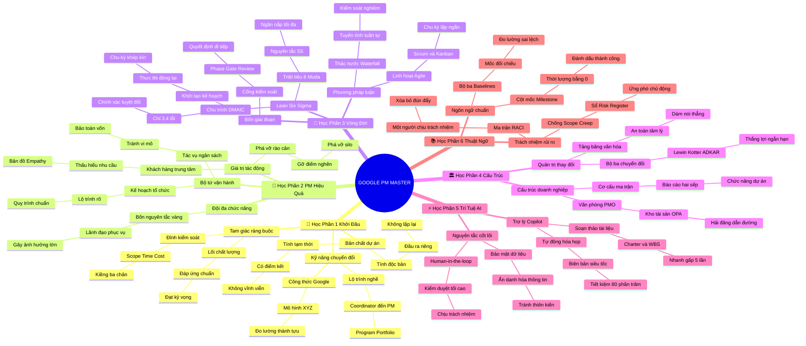

# 🧠 BẢN ĐỒ TƯ DUY TINH GỌN (4-5 TẦNG): GOOGLE PROJECT MANAGEMENT MASTER

## 1. Sơ Đồ Tư Duy Trực Quan (Mermaid Mindmap Tinh Gọn)

---

## 2. Cây Phân Cấp Tri Thức Gợi Nhớ Nhanh 4-5 Tầng (Active Recall Hierarchy)

- 📌 **[Học Phần 1: Khởi Đầu Sự Nghiệp Quản Trị Dự Án]**
  - 🔹 *Bản chất dự án & Tam giác ràng buộc:* ➔ *Tạm thời & Độc bản* ➔ *Scope - Time - Cost bao quanh Quality* ➔ *Ví dụ: Tổ chức đám cưới và sửa nhà đón Tết*
  - 🔹 *Kỹ năng chuyển đổi & Lộ trình PM:* ➔ *Kỹ năng tổ chức & Giao tiếp thấu cảm* ➔ *Công thức viết CV XYZ của Google* ➔ *Ví dụ: Rachel từ thiết kế nội thất thành Tech PM Google*

- 📌 **[Học Phần 2: Trở Thành Một PM Hiệu Quả]**
  - 🔹 *Khách hàng trung tâm & Phá vỡ rào cản:* ➔ *Bản đồ Empathy Map & Chỉ số CSAT* ➔ *Phá vỡ các Silo phòng ban* ➔ *Ví dụ: Thiết kế nút bấm to cho tài xế giao hàng*
  - 🔹 *Lãnh đạo phục vụ & Đội đa chức năng:* ➔ *Ảnh hưởng không cần chức danh* ➔ *4 nguyên tắc vàng & Mô hình Tuckman* ➔ *Ví dụ: Điều phối kỹ sư, thiết kế, tiếp thị ra mắt app số*

- 📌 **[Học Phần 3: Vòng Đời & Phương Pháp Luận]**
  - 🔹 *Bốn giai đoạn vòng đời & Baselines:* ➔ *Khởi tạo ➔ Kế hoạch ➔ Thực thi ➔ Đóng* ➔ *Cổng kiểm soát Phase-Gate Reviews* ➔ *Ví dụ: Các bước thi công hoàn thiện một tòa nhà*
  - 🔹 *Waterfall vs. Agile vs. Lean Six Sigma:* ➔ *Tuyến tính vs. Lặp Sprint 2 tuần* ➔ *8 lãng phí Muda (DOWNTIME) & Chu trình DMAIC* ➔ *Ví dụ: Xây cầu vượt bê tông vs. Phát triển app gọi xe*

- 📌 **[Học Phần 4: Cấu Trúc Tổ Chức & Văn Hóa]**
  - 🔹 *Cơ cấu Ma trận & Văn phòng PMO:* ➔ *Báo cáo 2 sếp (Dual Reporting)* ➔ *Kho tài sản OPA chuẩn hóa* ➔ *Ví dụ: Bác sĩ trực cấp cứu tuân theo Trưởng kíp mổ*
  - 🔹 *Văn hóa tảng băng & Quản trị thay đổi:* ➔ *An toàn tâm lý (Psychological Safety)* ➔ *Bộ ba Lewin - Kotter - ADKAR* ➔ *Ví dụ: Thưởng nóng đơn hàng online đầu tiên chuyển đổi số*

- 📌 **[Học Phần 5: AI Trong Quản Trị Dự Án]**
  - 🔹 *AI là Copilot chiến lược:* ➔ *GenAI soạn Charter & WBS siêu tốc* ➔ *Tự động hóa bóc băng biên bản họp của Ben* ➔ *Ví dụ: Tiết kiệm 80% thời gian hành chính giấy tờ*
  - 🔹 *Nguyên tắc tối cao Human-in-the-loop:* ➔ *Con người kiểm duyệt chống ảo giác* ➔ *Ẩn danh hóa dữ liệu mật (Data Masking)* ➔ *Ví dụ: Bác sĩ dùng AI soi phim nhưng tự tay khám kê đơn*

- 📌 **[Học Phần 6: Hệ Thống Thuật Ngữ Chuẩn Quốc Tế]**
  - 🔹 *Ngôn ngữ chung Lingua Franca:* ➔ *Điều lệ Charter, WBS, Milestone* ➔ *Đường cơ sở chuẩn đối chiếu sai lệch* ➔ *Ví dụ: Khâm sai mang ấn tín triều đình đi điều hành việc lớn*
  - 🔹 *Ma trận RACI & Kiểm soát rủi ro:* ➔ *Chữ A duy nhất chịu trách nhiệm* ➔ *Chặn đứng Scope Creep & Sổ Risk Register* ➔ *Ví dụ: Ký phụ lục hợp đồng khi khách hàng đòi thêm tính năng*

---

## 3. Bảng Neo Trí Nhớ Từ Khóa Vàng (Memory Anchor Cheat Sheet)

| Từ Khóa Cốt Lõi | Học Phần / Đề Mục | Bản Chất / Vai Trò (3-5 từ) | Tín Hiệu Gợi Nhớ (Memory Trigger) |
| :--- | :--- | :--- | :--- |
| **Triple Constraints** | Học phần 1 | Tam giác ràng buộc vàng | Chiếc kiềng ba chân kéo một chân hai chân kia rung |
| **XYZ Resume Formula** | Học phần 1 | Công thức CV chuẩn Google | Thước đo thành tựu bằng những con số biết nói |
| **Servant Leadership** | Học phần 2 | Lãnh đạo phục vụ thấu cảm | Vị thuyền trưởng cúi mình nâng đỡ các thủy thủ |
| **Cross-Functional Team** | Học phần 2 | Đội ngũ đa chức năng | Bàn cờ tướng hội tụ đủ binh chủng nhịp nhàng |
| **Phase-Gate Review** | Học phần 3 | Trạm kiểm soát giai đoạn | Cửa ải gác đèo chỉ mở khi đủ lệnh bài thông hành |
| **Agile & Scrum** | Học phần 3 | Linh hoạt lặp chu kỳ ngắn | Cánh buồm lướt sóng xoay chuyển đón hướng gió mới |
| **Lean Six Sigma** | Học phần 3 | Tốc độ tinh gọn chuẩn xác | Nhát kiếm samurai vừa bén ngót vừa chuẩn xác |
| **Matrix Structure** | Học phần 4 | Cơ cấu báo cáo hai sếp | Người chơi đàn hai tay gảy hai phím nhịp nhàng |
| **ADKAR & Kotter** | Học phần 4 | Khung quản trị sự thay đổi | Chiếc thang bắc qua dòng sông biến động |
| **Human-in-the-Loop** | Học phần 5 | Con người kiểm duyệt tối cao | Người gác cổng kiên định không cho hạt cát lọt qua |
| **Ben's Automation** | Học phần 5 | Tự động hóa tác vụ siêu tốc | Cỗ máy thần kỳ biến 3 ngày việc thành 30 giây |
| **RACI Accountability** | Học phần 6 | Một người chịu trách nhiệm | Vị cơ trưởng nắm tay lái quyết định sinh mệnh tàu bay |
| **Scope Creep Buster** | Học phần 6 | Triệt tiêu phình phạm vi | Chiếc phanh xe hãm lại đà lao dốc của ngân sách |
