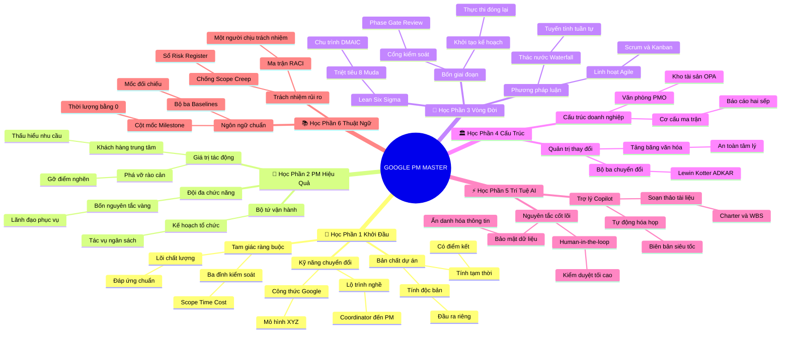

# Tổng Lược Master: Google Project Management Professional Certificate (Toàn Khóa Học)

## 1. Thông điệp cốt lõi (Core Message)
> Quản trị dự án là năng lực lãnh đạo chuyển hóa toàn diện kết hợp giữa kỷ luật phương pháp luận (Thác nước, Agile/Scrum, Lean Six Sigma), nghệ thuật dẫn dắt con người trong các cấu trúc tổ chức phức tạp và đòn bẩy công nghệ trí tuệ nhân tạo (AI) để hiện thực hóa các mục tiêu chiến lược thành giá trị kinh doanh đo lường được.

---

## 2. Lược Đồ Phân Bổ Cấu Trúc Tài Liệu (Content Distribution Overview)

| Học Phần / Đề Mục Toàn Khóa Học | Nội Dung Trọng Tâm | Số Luận Điểm Đại Diện |
| :--- | :--- | :---: |
| **Học Phần 1: Khởi Đầu Sự Nghiệp Quản Trị Dự Án** *(Embarking on a Career in PM)* | Bản chất dự án, tam giác ràng buộc, kỹ năng chuyển đổi và lộ trình phát triển nghề nghiệp. | 2 Luận điểm |
| **Học Phần 2: Trở Thành Một PM Hiệu Quả** *(Becoming an Effective PM)* | Trụ cột tạo tác động, vai trò nhạc trưởng, lãnh đạo phục vụ và điều phối đội ngũ đa chức năng. | 2 Luận điểm |
| **Học Phần 3: Vòng Đời & Phương Pháp Luận** *(Life Cycle & Methodologies)* | Bốn giai đoạn vòng đời, Thác nước vs. Agile/Scrum, triết lý Lean và kiểm soát chất lượng Six Sigma. | 3 Luận điểm |
| **Học Phần 4: Cấu Trúc Tổ Chức & Văn Hóa** *(Organizational Structure & Culture)* | Cơ cấu Cổ điển vs. Ma trận, Văn phòng PMO, tảng băng văn hóa và bộ ba mô hình Quản trị thay đổi. | 2 Luận điểm |
| **Học Phần 5: AI Trong Quản Trị Dự Án** *(AI in Project Management)* | Generative AI trong soạn thảo tài liệu, phân tích dự đoán rủi ro và nguyên tắc Human-in-the-loop. | 2 Luận điểm |
| **Học Phần 6: Hệ Thống Thuật Ngữ Chuẩn Quốc Tế** *(Glossary & International Standards)* | Đồng bộ ngôn ngữ chung Lingua Franca, ma trận RACI, chặn Scope Creep và quản trị rủi ro. | 2 Luận điểm |
| **Tổng cộng** | **Bao quát 100% cấu trúc 6 học phần toàn khóa học** | **13 Luận điểm** |

---

## 3. Luận điểm quan trọng theo cấu trúc tài liệu (Key Takeaways: 13 Luận Điểm Chuyên Sâu)

### 📑 HỌC PHẦN 1: KHỞI ĐẦU SỰ NGHIỆP QUẢN TRỊ DỰ ÁN (CAREER FOUNDATIONS)

1. **BẢN CHẤT TẠM THỜI, ĐỘC BẢN VÀ TAM GIÁC RÀNG BUỘC VÀNG**
   - **Bản chất & Phân tích chuyên sâu:** Khác với vận hành thường quy (Operations) mang tính lặp lại liên tục để duy trì ổn định, dự án là nỗ lực có điểm đầu và điểm kết thúc nhằm tạo ra một giá trị độc nhất. Dự án luôn bị khống chế bởi tam giác ràng buộc: Phạm vi (Scope), Thời gian (Time) và Chi phí (Cost) bao quanh Chất lượng (Quality). Bất kỳ sự thay đổi nào đối với một đỉnh đều đòi hỏi sự đánh đổi hoặc tái cân bằng ở hai đỉnh còn lại.
   - **Phương pháp / Công cụ / Quy trình đi kèm:** Điều lệ dự án (Project Charter), Mô hình Tam giác quản trị dự án (Triple Constraints), Đường cơ sở dự án (Project Baselines).
   - **Ví dụ thực tế đời thường:** Tổ chức một đám cưới: ngày cưới và ngân sách ấn định; nếu muốn mời thêm 100 khách (tăng Scope), gia chủ buộc phải tăng thêm tiền cỗ cưới (tăng Cost) hoặc rút ngắn bớt thời gian chụp ảnh ngoại cảnh (giảm Time).

2. **KHAI PHÓNG BỘ KỸ NĂNG CHUYỂN ĐỔI TỪ ĐỜI THƯỜNG VÀO SỰ NGHIỆP PM**
   - **Bản chất & Phân tích chuyên sâu:** Con đường trở thành PM không phân biệt xuất phát điểm học vấn hay ngành nghề ban đầu. Những năng lực tổ chức cuộc sống, giao tiếp thấu cảm và giải quyết vấn đề từ các công việc trái ngành (như chăm sóc khách hàng, thiết kế, giảng dạy) đều có thể quy đổi thành năng lực quản trị dự án chuẩn mực. Ứng viên chỉ cần nắm vững phương pháp viết CV định lượng XYZ của Google để chứng minh năng lực.
   - **Phương pháp / Công cụ / Quy trình đi kèm:** Công thức viết CV của Google (Accomplished [X] as measured by [Y], by doing [Z]), Bản đồ kỹ năng chuyển đổi (Transferable Skills Mapping).
   - **Ví dụ thực tế đời thường:** Rachel từ một nhà thiết kế nội thất đã chuyển hóa tư duy không gian và kỹ năng đàm phán với thợ thầu để vươn lên trở thành Technical PM hàng đầu tại trụ sở Google New York.

---

### 📑 HỌC PHẦN 2: TRỞ THÀNH MỘT PM HIỆU QUẢ (BECOMING EFFECTIVE)

3. **PHÁ VỠ RÀO CẢN VÀ LÃNH ĐẠO KHÔNG CẦN CHỨC DANH (INFLUENCE WITHOUT AUTHORITY)**
   - **Bản chất & Phân tích chuyên sâu:** Giá trị cốt lõi của PM nằm ở khả năng phá vỡ các rào cản ngăn cách (Silos) giữa các phòng ban và giải phóng các điểm nghẽn tiến độ. Vì các thành viên dự án thường không báo cáo hành chính trực tiếp cho PM, PM phải vận dụng triết lý lãnh đạo phục vụ (Servant Leadership) - tạo ảnh hưởng dựa trên sự thấu hiểu, uy tín chuyên môn, sự công bằng và hỗ trợ tối đa để đội ngũ hoàn thành nhiệm vụ.
   - **Phương pháp / Công cụ / Quy trình đi kèm:** Triết lý Lãnh đạo phục vụ (Servant Leadership), Bảng ghi nhận rào cản (Impediment Log), Ma trận quyết định có trọng số (Weighted Decision Matrix).
   - **Ví dụ thực tế đời thường:** Trưởng nhóm thiện nguyện điều phối 20 tình nguyện viên: không có quyền phạt hay đuổi việc ai, nhưng dùng sự minh bạch tài chính, lòng nhiệt huyết và sự phân công hợp lý để mọi người vui vẻ cống hiến hết mình.

4. **BỐN NGUYÊN TẮC VÀNG DẪN DẮT ĐỘI NGŨ ĐA CHỨC NĂNG (CROSS-FUNCTIONAL TEAMS)**
   - **Bản chất & Phân tích chuyên sâu:** Đội ngũ đa chức năng hội tụ các chuyên gia từ Thiết kế, Kỹ thuật, Marketing, Tài chính đến Pháp chế. Để biến một tập hợp các cá nhân phân tán thành một cỗ máy chiến thắng, PM phải thực thi 4 nguyên tắc: (1) Làm rõ mục tiêu chung; (2) Đảm bảo nhân sự có kỹ năng phù hợp; (3) Đo lường tiến độ công khai liên tục; (4) Thường xuyên ghi nhận và tôn vinh nỗ lực của từng cá nhân.
   - **Phương pháp / Công cụ / Quy trình đi kèm:** Khung mục tiêu OKRs, Bảng phân tích kỹ năng nhóm (Team Skills Matrix), Mô hình 4 giai đoạn phát triển nhóm của Bruce Tuckman (Forming - Storming - Norming - Performing).
   - **Ví dụ thực tế đời thường:** Dự án phát hành ứng dụng ngân hàng số: PM gắn kết lập trình viên, chuyên viên bảo mật và tiếp thị viên cùng hướng tới mục tiêu đạt 50.000 người dùng trong tháng đầu tiên và tổ chức tiệc pizza chúc mừng khi sửa xong lỗi bảo mật then chốt.

---

### 📑 HỌC PHẦN 3: VÒNG ĐỜI & PHƯƠNG PHÁP LUẬN (LIFE CYCLE & METHODOLOGIES)

5. **QUY TRÌNH BỐN GIAI ĐOẠN VÀ KHUNG CỔNG KIỂM SOÁT (PHASE-GATE REVIEWS)**
   - **Bản chất & Phân tích chuyên sâu:** Mọi dự án đều vận hành qua chu trình 4 giai đoạn: Khởi tạo (Initiate), Lập kế hoạch (Plan), Thực thi (Execute) và Đóng dự án (Close). Mỗi giai đoạn đều phải vượt qua một Cổng kiểm soát (Phase Gate) để ban lãnh đạo đánh giá tính khả thi trước khi cấp ngân sách cho pha tiếp theo. Việc đóng dự án chính thức (Closing) với biên bản nghiệm thu và tài liệu bài học kinh nghiệm (Lessons Learned) là yếu tố quyết định giá trị lâu dài của dự án.
   - **Phương pháp / Công cụ / Quy trình đi kèm:** Cổng kiểm soát giai đoạn (Phase Gates), Cấu trúc phân rã công việc (WBS), Quản lý giá trị thu được (EVM với chỉ số CPI, SPI).
   - **Ví dụ thực tế đời thường:** Sản xuất một bộ phim điện ảnh: Viết kịch bản và duyệt kinh phí (Khởi tạo) $\to$ Tuyển diễn viên, chọn bối cảnh (Kế hoạch) $\to$ Bấm máy quay phim (Thực thi) $\to$ Hậu kỳ, chiếu rạp và thanh lý hợp đồng (Đóng dự án).

6. **ĐỐI CHIẾU CHIẾN LƯỢC: THÁC NƯỚC (WATERFALL) VÀ LINH HOẠT (AGILE/SCRUM)**
   - **Bản chất & Phân tích chuyên sâu:** Không có phương pháp luận nào vượt trội tuyệt đối; sự thông thái nằm ở việc chọn đúng công cụ cho từng bài toán. Waterfall phù hợp với các dự án tuyến tính, yêu cầu rõ ràng từ đầu, chi phí sửa sai cao (xây dựng, sản xuất cơ khí). Agile/Scrum phù hợp với môi trường biến động nhanh, phần mềm, sản phẩm số - nơi sản phẩm được phát triển theo các chu kỳ Sprint ngắn (1-4 tuần) và liên tục thích ứng theo phản hồi của người dùng.
   - **Phương pháp / Công cụ / Quy trình đi kèm:** Khung làm việc Scrum (Product Owner, Scrum Master, Sprint Planning, Daily Scrum, Retrospective), Bảng Kanban có giới hạn việc đang làm (WIP Limits).
   - **Ví dụ thực tế đời thường:** Xây dựng phần cứng điện thoại thông minh dùng Waterfall (phải đúc khuôn và hàn mạch chuẩn xác); trong khi phát triển hệ điều hành và các ứng dụng trên chiếc điện thoại đó áp dụng Agile (liên tục cập nhật bản vá lỗi mỗi tháng).

7. **TỐC ĐỘ TINH GỌN LEAN VÀ ĐỘ CHÍNH XÁC SIX SIGMA (LEAN SIX SIGMA)**
   - **Bản chất & Phân tích chuyên sâu:** Lean tập trung tối ưu hóa tốc độ dòng chảy giá trị bằng cách triệt tiêu 8 loại lãng phí (Muda / DOWNTIME) và thiết lập trật tự 5S. Six Sigma tập trung nâng cao chất lượng bằng việc triệt tiêu sự biến thiên và lỗi sai thông qua quy trình 5 bước DMAIC (Define, Measure, Analyze, Improve, Control) hướng tới tỷ lệ chỉ 3.4 lỗi trên một triệu cơ hội. Mô hình lai Lean Six Sigma giúp tổ chức đạt được cả hai đỉnh cao: Vừa làm nhanh, vừa làm chuẩn xác.
   - **Phương pháp / Công cụ / Quy trình đi kèm:** Mô hình 8 lãng phí (DOWNTIME), Tiêu chuẩn 5S, Chu trình 5 bước DMAIC, Sơ đồ xương cá Ishikawa.
   - **Ví dụ thực tế đời thường:** Dây chuyền sản xuất đồ uống đóng chai: Áp dụng Lean để bỏ các bước đi lại lấy nắp chai thừa thãi của công nhân (loại bỏ Motion); áp dụng Six Sigma để căn chỉnh vòi rót chính xác 100.000 chai đều đúng 500ml không bị tràn.

---

### 📑 HỌC PHẦN 4: CẤU TRÚC TỔ CHỨC & VĂN HÓA (ORGANIZATION & CULTURE)

8. **ĐIỀU HƯỚNG CƠ CẤU MA TRẬN VÀ TẬN DỤNG TÀI SẢN VĂN PHÒNG PMO**
   - **Bản chất & Phân tích chuyên sâu:** Cấu trúc tổ chức định hình trực tiếp mức độ quyền hạn của PM. Trong cơ cấu ma trận (Matrix), nhân viên có cơ chế báo cáo hai sếp (Trưởng phòng chức năng và PM), đòi hỏi PM phải có kỹ năng đàm phán phân bổ tài nguyên xuất sắc. Văn phòng PMO đóng vai trò như tháp hải đăng, cung cấp các biểu mẫu chuẩn, công cụ và kho tài sản quy trình (OPA) giúp các dự án không phải mất công "phát minh lại chiếc bánh xe".
   - **Phương pháp / Công cụ / Quy trình đi kèm:** Mô hình cơ cấu ma trận (Weak, Balanced, Strong Matrix), Ba cấp độ PMO (Supportive, Controlling, Directive), Kho tài sản OPA.
   - **Ví dụ thực tế đời thường:** Các chi nhánh ngân hàng trên toàn quốc: Giám đốc chi nhánh quản lý nhân sự địa phương, nhưng khi triển khai phần mềm giao dịch mới thì toàn bộ giao dịch viên tuân thủ quy trình chuẩn do phòng PMO tại hội sở ban hành.

9. **DẪN DẮT CHUYỂN ĐỔI THÔNG QUA CÁC MÔ HÌNH QUẢN TRỊ THAY ĐỔI**
   - **Bản chất & Phân tích chuyên sâu:** Mọi dự án đều tạo ra sự thay đổi, nhưng con người luôn có bản năng sợ hãi và kháng cự mất mát. Dự án chỉ thành công trọn vẹn khi đạt cả chất lượng kỹ thuật lẫn sự chấp nhận của con người ($Q \times A = E$). PM phải đóng vai trò Tác nhân thay đổi (Change Agent), vận dụng mô hình 3 giai đoạn của Kurt Lewin (Rã đông - Thay đổi - Tái đông), 8 bước chuyển đổi của John Kotter và mô hình cá nhân ADKAR để dẫn dắt đội ngũ vượt qua "vùng trũng thất vọng" trên đường cong Kübler-Ross.
   - **Phương pháp / Công cụ / Quy trình đi kèm:** Khung năng lực ADKAR (Awareness, Desire, Knowledge, Ability, Reinforcement), Mô hình 8 bước Kotter, Đường cong thay đổi Kübler-Ross.
   - **Ví dụ thực tế đời thường:** Chuyển đổi từ bán hàng truyền thống sang sàn thương mại điện tử: Đào tạo thao tác cho nhân viên bán hàng (Knowledge & Ability) và thưởng nóng cho đơn hàng online đầu tiên (Kotter Short-term Win).

---

### 📑 HỌC PHẦN 5: AI TRONG QUẢN TRỊ DỰ ÁN (AI & AUTOMATION)

10. **KHAI PHÓNG NĂNG SUẤT GENAI VÀ NGUYÊN TẮC HUMAN-IN-THE-LOOP**
    - **Bản chất & Phân tích chuyên sâu:** Generative AI đóng vai trò như một trợ lý đồng hành (Copilot) chiến lược, giúp PM tăng tốc soạn thảo bản thảo đầu tiên của Điều lệ dự án, phân rã WBS và biên tập email truyền thông nhanh gấp 5 lần. Tuy nhiên, nguyên tắc tối thượng là "Human-in-the-loop": PM luôn là người kiểm duyệt cuối cùng để loại bỏ hiện tượng ảo giác (AI Hallucination), bảo đảm an toàn dữ liệu doanh nghiệp và chịu trách nhiệm giải trình trước ban lãnh đạo.
    - **Phương pháp / Công cụ / Quy trình đi kèm:** Kỹ thuật Prompt Engineering (Role - Task - Context - Constraints), Quy trình thẩm định hai lớp (Human Verification Protocol), Chính sách AI có trách nhiệm.
    - **Ví dụ thực tế đời thường:** Ben tại Google sử dụng AI tự động ghi âm cuộc họp, bóc băng và trích xuất danh sách 5 đầu việc cần làm chỉ sau 30 giây kết thúc họp, giúp tiết kiệm 80% thời gian làm giấy tờ thủ công.

11. **PHÂN TÍCH DỰ ĐOÁN RỦI RO VÀ TỐI ƯU HÓA NGUỒN LỰC TỰ ĐỘNG**
    - **Bản chất & Phân tích chuyên sâu:** Thay vì dự báo rủi ro dựa trên linh cảm, AI có khả năng rà soát dữ liệu lịch sử hàng ngàn dự án để nhận diện các mẫu hình rủi ro tiềm ẩn và mô phỏng các kịch bản tiến độ phức tạp. PM chuyển từ phong thái bị động chữa cháy sang thế chủ động can thiệp theo ngoại lệ (Management by Exception).
    - **Phương pháp / Công cụ / Quy trình đi kèm:** Mô phỏng kịch bản Monte Carlo, Bảng cảnh báo rủi ro chủ động (Proactive Risk Alert Dashboard), Tự động hóa quy trình (Workflow Automation).
    - **Ví dụ thực tế đời thường:** Hệ thống AI tự động cảnh báo rằng một tính năng phức tạp có xác suất trễ hạn 75% dựa trên tốc độ hoàn thành hiện tại của đội lập trình, giúp PM kịp thời bổ sung nhân sự hỗ trợ trước khi quá muộn.

---

### 📑 HỌC PHẦN 6: HỆ THỐNG THUẬT NGỮ CHUẨN QUỐC TẾ (GLOSSARY & STANDARDS)

12. **MA TRẬN RACI VÀ CHIẾN LƯỢC TRIỆT TIÊU HIỆN TƯỢNG PHÌNH PHẠM VI (SCOPE CREEP)**
    - **Bản chất & Phân tích chuyên sâu:** Ma trận RACI là công cụ phân định trách nhiệm tối thượng nhằm xóa bỏ hoàn toàn sự đùn đẩy: Trong đó quan trọng nhất là chữ A (Accountable) - người chịu trách nhiệm giải trình duy nhất cho mỗi nhiệm vụ. Scope Creep (sự phình to phạm vi không kiểm soát) là "kẻ giết chết dự án" thầm lặng nhất. PM phải thiết lập quy trình kiểm soát thay đổi (Change Control) nghiêm ngặt để yêu cầu khách hàng đàm phán thêm thời gian và ngân sách mỗi khi muốn thêm việc.
    - **Phương pháp / Công cụ / Quy trình đi kèm:** Ma trận phân công trách nhiệm RACI, Quy trình kiểm soát thay đổi tích hợp (Integrated Change Control), Sổ đăng ký yêu cầu thay đổi (Change Log).
    - **Ví dụ thực tế đời thường:** Ký hợp đồng thiết kế website 5 trang: Khách hàng yêu cầu làm thêm trang thứ 6 và chức năng thanh toán trực tuyến $\to$ PM gửi ngay Phụ lục hợp đồng yêu cầu tăng thêm 2 tuần làm việc và 10 triệu đồng chi phí phát sinh.

13. **QUẢN TRỊ RỦI RO CHỦ ĐỘNG QUA BẢNG SỔ RISK REGISTER**
    - **Bản chất & Phân tích chuyên sâu:** Rủi ro là sự kiện bất định luôn tồn tại song hành với cơ hội. Quản trị rủi ro chuyên nghiệp đòi hỏi phải nhận diện sớm, đánh giá định lượng bằng Ma trận Xác suất - Tác động (Probability & Impact Matrix) và chuẩn bị sẵn 4 chiến lược ứng phó: Né tránh (Avoid), Chuyển giao (Transfer), Giảm thiểu (Mitigate), hoặc Chấp nhận (Accept).
    - **Phương pháp / Công cụ / Quy trình đi kèm:** Sổ đăng ký rủi ro (Risk Register), Ma trận Xác suất - Tác động, Kế hoạch quản trị rủi ro dự án.
    - **Ví dụ thực tế đời thường:** Tổ chức buổi hòa nhạc ngoài trời: Rủi ro trời mưa to (Xác suất 40%, tác động cực lớn) $\to$ Chiến lược Giảm thiểu và Chuyển giao: Thuê sẵn bạt che sân khấu và mua bảo hiểm sự kiện thời tiết.

---

## 4. Kế hoạch hành động (Action Plan: 20 việc cụ thể)

#### Nhóm 1: Hành động ngay hôm nay (Micro-habits dưới 2 phút - 5 việc)
- [ ] **Hành động 1:** Viết ra giấy 1 mục tiêu quan trọng nhất trong công việc của bạn hôm nay theo đúng chuẩn SMART.
- [ ] **Hành động 2:** Nhắn một tin nhắn cảm ơn hoặc ghi nhận công khai (Shout-out) cho một đồng nghiệp đã giúp đỡ bạn.
- [ ] **Hành động 3:** Kiểm tra bàn làm việc hoặc màn hình máy tính cá nhân, xóa bỏ hoặc cất gọn 3 tệp rác theo nguyên tắc 5S.
- [ ] **Hành động 4:** Thử dùng một câu lệnh prompt ngắn trên ChatGPT/Gemini để tóm tắt 1 bài viết dài thành 3 ý chính.
- [ ] **Hành động 5:** Xác định 1 cá nhân chịu trách nhiệm cao nhất (chữ A trong RACI) cho dự án quan trọng bạn đang tham gia.

#### Nhóm 2: Kế hoạch rèn luyện trong tuần (Áp dụng vào công việc & đời sống - 8 việc)
- [ ] **Hành động 6:** Bóc tách 1 dự án công việc hoặc mục tiêu cá nhân thành cấu trúc WBS gồm 3 cấp độ phân rã.
- [ ] **Hành động 7:** Lập một Bảng ghi nhận rủi ro (Risk Register) gồm 5 rủi ro hàng đầu kèm phương án ứng phó cụ thể.
- [ ] **Hành động 8:** Thiết lập một bảng Kanban cá nhân trên Trello với giới hạn công việc đang làm (WIP Limit) không quá 3 đầu việc.
- [ ] **Hành động 9:** Tổ chức hoặc đề xuất một cuộc họp đứng 15 phút (Daily Stand-up) để gỡ bỏ các rào cản (blockers) cho nhóm.
- [ ] **Hành động 10:** Viết lại 3 gạch đầu dòng thành tựu trong CV của bạn theo đúng công thức XYZ định lượng của Google.
- [ ] **Hành động 11:** Thực hành nghệ thuật thích ứng văn hóa: Tham gia 1 buổi trò chuyện thân mật với đồng nghiệp trái bộ phận.
- [ ] **Hành động 12:** Lập một Ma trận RACI cho dự án hiện tại và gửi cho các bên liên quan để thống nhất vai trò.
- [ ] **Hành động 13:** Tổ chức một buổi họp rút kinh nghiệm ngắn (Sprint Retrospective) cuối tuần: Điều gì làm tốt? Điều gì cần cải tiến?.

#### Nhóm 3: Thói quen duy trì & Chuyển hóa lâu dài (Phát triển bền vững - 7 việc)
- [ ] **Hành động 14:** Đặt mục tiêu học tập và hoàn thành trọn vẹn chứng chỉ Google Project Management Professional Certificate.
- [ ] **Hành động 15:** Xây dựng một Bộ hồ sơ năng lực dự án thực chiến (Project Portfolio) lưu trên Google Drive gồm: Charter, WBS, Schedule, Risk Register.
- [ ] **Hành động 16:** Rèn luyện phản xạ luôn tích hợp Kế hoạch Quản trị Thay đổi (Change Management Plan) song hành với kế hoạch kỹ thuật.
- [ ] **Hành động 17:** Kiên định thực hành nguyên tắc "Human-in-the-loop" trong mọi ứng dụng AI: Không bao giờ sao chép mù quáng.
- [ ] **Hành động 18:** Xây dựng văn hóa an toàn tâm lý (Psychological Safety) trong đội ngũ: Khuyến khích nói thật và học hỏi từ sai lầm.
- [ ] **Hành động 19:** Lập kế hoạch ôn tập để thi lấy chứng chỉ quốc tế uy tín như CAPM, PMP hoặc PMI-ACP trong vòng 1-2 năm tới.
- [ ] **Hành động 20:** Định kỳ hàng quý rà soát và loại bỏ 8 loại lãng phí (DOWNTIME) trong toàn bộ quy trình vận hành của phòng ban.

---

## 5. Câu hỏi tự ngẫm (Reflection: 26 câu hỏi sâu sắc)

#### Nhóm 1: Tự vấn Nhận thức & Hệ tư duy (Self-Awareness & Mindset: 7 câu)
1. Tôi đang nhìn nhận bản thân như một người thợ kỹ thuật thừa hành hay như một nhà lãnh đạo chuyển hóa chiến lược?
2. Khi đối mặt với sự thay đổi đột ngột ngoài tầm kiểm soát, phản xạ đầu tiên của tôi là lo lắng chống đối hay bình tĩnh đón nhận và thích ứng?
3. Tôi có đang điều hành đội ngũ bằng quyền lực vị trí (chức danh) hay bằng uy tín chuyên môn và sự tôn trọng chân thành?
4. Tôi đã thực sự thấu hiểu triết lý cốt lõi của Agile (tập trung giá trị khách hàng) hay chỉ đang áp dụng các nghi thức hình thức bên ngoài?
5. Sự kết hợp giữa năng lực quản trị con người và công nghệ AI mang lại cho tôi những lợi thế cạnh tranh độc bản nào trên thị trường lao động?
6. Chân lý hoặc nguyên lý quản trị nào trong toàn bộ khóa học để lại ấn tượng sâu đậm nhất và làm thay đổi nhân sinh quan nghề nghiệp của tôi?
7. Tôi đánh giá mức độ dẻo dai tâm lý và khả năng dẫn dắt của bản thân trước áp lực khủng hoảng ở mức mấy điểm trên thang điểm 10?

#### Nhóm 2: Nhận diện Thói quen & Điểm mù (Habits & Blind Spots: 7 câu)
8. Tôi có thói quen cả nể nhận thêm việc từ sếp hoặc đối tác mà không đánh giá tác động lên Tam giác ràng buộc hay không?
9. Tôi có thường xuyên can thiệp quá sâu vào cách làm chi tiết của cấp dưới (quản lý vi mô) thay vì tin tưởng và trao quyền?
10. Kênh giao tiếp tôi đang dùng có thực sự tạo sự minh bạch và gắn kết cho toàn đội ngũ hay đang tạo ra các hiểu lầm ngầm?
11. Tôi có nhớ ghi nhận và tôn vinh nỗ lực của các thành viên thầm lặng hay chỉ chú ý đến những người hay nói to và thể hiện?
12. Đội ngũ của tôi có thực sự cảm thấy an toàn tâm lý để báo cáo tin xấu và sai sót cho tôi ngay khi phát hiện hay không?
13. Tôi có đang lạm dụng các công cụ AI một cách bất cẩn, có nguy cơ làm rò rỉ dữ liệu mật của công ty hoặc khách hàng hay không?
14. Điểm mù lớn nhất của tôi khi đàm phán tài nguyên trong cơ cấu tổ chức Ma trận là gì: Ngại va chạm hay đòi hỏi quyền lực áp đặt?

#### Nhóm 3: Ứng dụng Thực tế & Giải quyết Vấn đề (Practical Application: 6 câu)
15. Khi một dự án bị chậm tiến độ 2 tuần và ngân sách đã cạn 90%, tôi sẽ sử dụng những công cụ nào để tái cấu trúc lại kế hoạch giải cứu dự án?
16. Bằng cách nào tôi có thể áp dụng mô hình ADKAR để dẫn dắt một phòng ban bảo thủ chuyển từ quy trình thủ công sang số hóa?
17. Nếu khách hàng kiên quyết đòi thêm tính năng mới mà không chịu chi thêm tiền, tôi sẽ dùng lập luận và quy trình gì để đàm phán dứt khoát?
18. Làm thế nào để áp dụng kết hợp Lean (loại bỏ lãng phí) và Six Sigma (giảm sai sót) vào việc tối ưu hóa một quy trình dịch vụ khách hàng cụ thể?
19. Tôi sẽ thiết kế một quy trình phối hợp giữa con người và AI (Human-in-the-loop) như thế nào để vừa tăng tốc độ soạn thảo tài liệu vừa bảo đảm chuẩn xác 100%?
20. Khi hai trưởng bộ phận trong đội ngũ đa chức năng mâu thuẫn gay gắt về giải pháp kỹ thuật, tôi sẽ đóng vai trò hòa giải như thế nào?

#### Nhóm 4: Bứt phá Giới hạn & Chuyển hóa Tương lai (Breakthrough & Transformation: 6 câu)
21. Tầm nhìn sự nghiệp 3 đến 5 năm tới của tôi là gì: Project Manager điều hành, Program Manager chiến lược, hay Giám đốc PMO doanh nghiệp?
22. Tôi cần xây dựng thương hiệu cá nhân của mình như thế nào để được các tập đoàn lớn săn đón với tư cách một nhà quản lý dự án xuất sắc?
23. Những năng lực nào tôi cần tập trung rèn luyện để có thể tự tin quản lý các dự án đa quốc gia với các thành viên làm việc từ xa trên khắp thế giới?
24. Di sản lớn nhất mà tôi muốn để lại cho mỗi tổ chức và mỗi con người mà tôi từng đồng hành qua các dự án là gì?
25. Nếu có cơ hội dẫn dắt một dự án chuyển đổi mang tầm vĩ mô của quốc gia hoặc tập đoàn, nguyên tắc bất biến nào tôi sẽ kiên quyết giữ vững?
26. Hành động cụ thể và quyết liệt nhất tôi sẽ thực hiện ngay trong ngày hôm nay để bắt đầu hành trình chuyển hóa sự nghiệp của mình là gì?

---

## 6. Bản Đồ Tư Duy Trực Quan (Visual Mindmap Overview - Tinh Gọn 4-5 Tầng)

