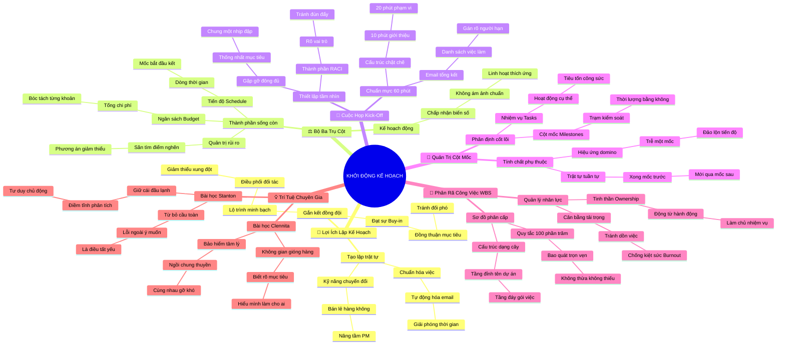

# 🧠 BẢN ĐỒ TƯ DUY TINH GỌN (4-5 TẦNG): HỌC PHẦN 1 - KHỞI ĐỘNG LẬP KẾ HOẠCH

## 1. Sơ Đồ Tư Duy Trực Quan (Mermaid Mindmap Tinh Gọn)

---

## 2. Cây Phân Cấp Tri Thức Gợi Nhớ Nhanh 4-5 Tầng (Active Recall Hierarchy)

- 📌 **Lợi Ích Lập Kế Hoạch (Benefits of Planning)**
  - 🔹 *Thiết lập trật tự:* ➔ *Quy trình hóa* ➔ *Tự động hóa tác vụ* ➔ *Rowena chuẩn hóa kho hàng*
  - 🔹 *Gắn kết đồng thuận:* ➔ *Stakeholder Buy-in* ➔ *Thấu suốt bức tranh lớn* ➔ *Cam kết nỗ lực 100%*
- 📌 **Bộ Ba Trụ Cột (Triple Planning Baselines)**
  - 🔹 *Tiến độ Schedule:* ➔ *Dòng thời gian tổng* ➔ *Mốc khởi đầu kết thúc* ➔ *Plant Pals ra mắt cuối năm*
  - 🔹 *Ngân sách Budget:* ➔ *Tổng mức đầu tư* ➔ *Bóc tách từng khoản mục* ➔ *Chi phí web và nhà vườn*
  - 🔹 *Quản trị rủi ro:* ➔ *Săn tìm điểm nghẽn* ➔ *Kế hoạch giảm thiểu* ➔ *Cắt giảm scope khi web trễ*
- 📌 **Cuộc Họp Khởi Động (Kick-off Facilitation)**
  - 🔹 *Thiết lập tầm nhìn:* ➔ *Hội tụ toàn đội* ➔ *Bản đồ vai trò RACI* ➔ *Chung một nhịp đập*
  - 🔹 *Quy trình 60 phút:* ➔ *Phá băng 10p* ➔ *Phạm vi 20p* ➔ *Email Action Items ngay sau họp*
- 📌 **Quản Trị Cột Mốc (Tasks vs. Milestones)**
  - 🔹 *Bản chất khác biệt:* ➔ *Task tốn công sức* ➔ *Milestone thời lượng bằng 0* ➔ *Duyệt bản vẽ là Milestone*
  - 🔹 *Hiệu ứng dây chuyền:* ➔ *Ràng buộc tuần tự* ➔ *Chậm mốc trước làm đổ mốc sau* ➔ *Lùi code và mất đợt tiền*
- 📌 **Cấu Trúc Phân Rã WBS (Work Breakdown Structure)**
  - 🔹 *Cấu trúc dạng cây:* ➔ *Tên dự án* ➔ *Cột mốc chính* ➔ *Gói công việc thực thi*
  - 🔹 *Quy tắc 100%: * ➔ *Bao quát trọn vẹn scope* ➔ *Không thiếu không thừa* ➔ *Triệt tiêu điểm mù*
  - 🔹 *Trao quyền làm chủ:* ➔ *Động từ hành động* ➔ *Gán 1 người 1 hạn trên Asana* ➔ *Chống kiệt sức Burnout*
- 📌 **Trí Tuệ Chuyên Gia (Stanton & Clennita Wisdom)**
  - 🔹 *Bản lĩnh điềm tĩnh:* ➔ *Chấp nhận đổi yêu cầu* ➔ *Không hoảng loạn* ➔ *Stanton xử lý app bóng đá*
  - 🔹 *Không gian gióng hàng:* ➔ *Biết rõ làm cho ai* ➔ *Thống nhất kế hoạch kiểm thử* ➔ *Clennita gắn kết Google*

---

## 3. Bảng Neo Trí Nhớ Từ Khóa Vàng (Memory Anchor Cheat Sheet)

| Từ Khóa Cốt Lõi | Phần Trong Tài Liệu | Bản Chất / Vai Trò (3-5 từ) | Tín Hiệu Gợi Nhớ (Memory Trigger) |
| :--- | :--- | :--- | :--- |
| **Transferable Skills** | Phần I: Giới Thiệu | Chuyển hóa kinh nghiệm cũ | Tiếp viên hàng không thành PM |
| **Buy-in** | Phần I: Lợi Ích | Cam kết ủng hộ tự nguyện | Bắt tay đồng lòng trước khi chạy |
| **Living Document** | Phần II: Khởi Động | Kế hoạch thích ứng linh hoạt | Cây xanh uốn mình theo gió |
| **Triple Baselines** | Phần II: Bộ Ba Trụ Cột | Tiến độ, ngân sách, rủi ro | Chiếc kiềng 3 chân của dự án |
| **Kick-off Meeting** | Phần III: Họp Khởi Động | Buổi gặp gỡ hợp nhất tầm nhìn | Tiếng còi khai cuộc trận đấu |
| **RACI Chart** | Phần III: Họp Khởi Động | Rõ người chịu trách nhiệm | Bảng phân vai trên sân khấu |
| **Action Items** | Phần III: Họp Khởi Động | Đầu việc có người và hạn | Email chốt việc ngay sau họp |
| **Milestone** | Phần IV: Cột Mốc | Trạm kiểm soát thời lượng bằng 0 | Cột cây số trên đường cao tốc |
| **Sequential Order** | Phần IV: Cột Mốc | Trật tự trước sau bắt buộc | Xây xong móng mới dựng tường |
| **WBS** | Phần V: Phân Rã WBS | Sơ đồ cây phân rã việc | Cành cây chẻ nhánh ra từng lá |
| **100% Rule** | Phần V: Phân Rã WBS | Bao hàm trọn vẹn phạm vi | Chiếc bánh pizza không thiếu lát nào |
| **Ownership** | Phần V: Giao Việc | Tinh thần làm chủ nhiệm vụ | Tấm khiên và trách nhiệm cá nhân |
| **Burnout Prevention** | Phần V: Tải Trọng | Cân bằng khối lượng công việc | Chiếc cân không bị lệch cán |
| **Calm Leadership** | Phần VI: Chuyên Gia | Điềm tĩnh trước hỗn độn | Tảng đá kiên định giữa giông bão |
| **Testing Plan** | Phần VI: Chuyên Gia | Định nghĩa thước đo thành công | Vạch đích rõ ràng cho vận động viên |
