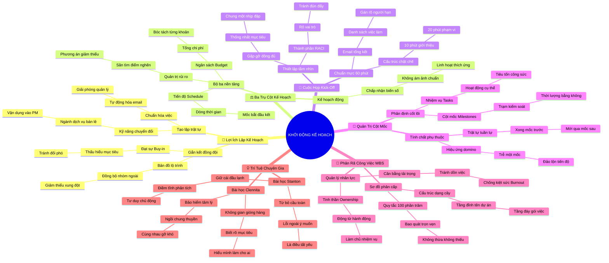

# Tóm Tắt Học Phần 1: Khởi Động Giai Đoạn Lập Kế Hoạch (Beginning the Planning Phase)

## 1. Thông điệp cốt lõi (Core Message)
> Lập kế hoạch không phải là một bài tập tìm kiếm sự hoàn hảo cứng nhắc, mà là tiến trình thiết lập trật tự từ sự hỗn loạn: gắn kết đội ngũ qua cuộc họp Kick-off, xác lập các trạm kiểm soát Cột mốc (Milestones), phân rã triệt để 100% phạm vi công việc vào biểu đồ WBS và trao quyền làm chủ (Ownership) để biến bất định thành lộ trình thực thi khả thi.

---

## 2. Lược Đồ Phân Bổ Cấu Trúc Tài Liệu (Content Distribution Overview)

| Phần / Đề Mục Tài Liệu Gốc | Nội Dung Trọng Tâm | Số Luận Điểm Đại Diện |
| :--- | :--- | :---: |
| **Phần I: Giới Thiệu & Lợi Ích Của Lập Kế Hoạch** *(Introduction & Benefits of Planning)* | Tầm nhìn khóa học từ Rowena, bản đồ lộ trình, giảm thiểu rủi ro từ sớm và kiến tạo tinh thần đồng đội. | 2 Luận điểm |
| **Phần II: Khởi Động Lập Kế Hoạch & Bộ Ba Trụ Cột** *(Launching Planning: Schedule, Budget, Risk)* | Chấp nhận sự thay đổi, ba thành phần sống còn (Tiến độ - Ngân sách - Quản trị rủi ro), bài học dự án Plant Pals. | 2 Luận điểm |
| **Phần III: Điều Phối Cuộc Họp Khởi Động Dự Án** *(Facilitating Project Kick-off Meeting)* | Mục đích gắn kết, thành phần RACI tham dự, cấu trúc chương trình họp chuẩn 60 phút và email tổng kết. | 2 Luận điểm |
| **Phần IV: Bản Chất Nhiệm Vụ & Nghệ Thuật Thiết Lập Cột Mốc** *(Tasks vs. Milestones & How to Set Them)* | Phân biệt Task (hoạt động) vs Milestone (trạm kiểm soát 0 ngày), tính tuần tự bắt buộc, quy trình 6 bước chốt mốc. | 2 Luận điểm |
| **Phần V: Cấu Trúc Phân Rã Công Việc (WBS) & Phân Bổ Nhân Lực** *(Creating a WBS & Task Delegation)* | Cấu trúc phân cấp hình cây, Quy tắc 100% Rule, cân bằng tải trọng chống kiệt sức (Burnout), tinh thần Ownership trên Asana. | 2 Luận điểm |
| **Phần VI: Góc Nhìn Chuyên Gia Google & YouTube** *(Stanton & Clennita Stories)* | Stanton: Giữ cái đầu lạnh trước biến số ngoài ý muốn; Clennita: Lập kế hoạch để gióng hàng (Align) và định nghĩa thành công. | 2 Luận điểm |
| **Tổng cộng** | **Bao quát 100% cấu trúc 6 mảng nội dung tài liệu gốc** | **12 Luận điểm** |

---

## 3. Luận điểm quan trọng theo cấu trúc tài liệu (Key Takeaways: 12 Luận Điểm Chuyên Sâu)

### 📑 PHẦN I: GIỚI THIỆU & LỢI ÍCH CỦA LẬP KẾ HOẠCH DỰ ÁN

1. **CHUYỂN HÓA KỸ NĂNG ĐỜI THƯỜNG THÀNH NĂNG LỰC THIẾT LẬP TRẬT TỰ**
   - **Bản chất & Phân tích chuyên sâu:** Mọi tổ chức, kể cả những tập đoàn công nghệ toàn cầu hàng đầu như Google Cloud, luôn tồn tại những quy trình vận hành phân mảnh và lộn xộn. Người quản lý dự án xuất sắc không nhất thiết phải có xuất phát điểm hoàn hảo mà bắt đầu từ năng lực quan sát, chủ động chuẩn hóa các thao tác thủ công thành quy trình tự động và vận dụng những kỹ năng chuyển đổi (transferable skills) từ ngành dịch vụ, bán lẻ hay vận hành vào quản trị dự án.
   - **Phương pháp / Công cụ / Quy trình đi kèm:** Bản đồ kỹ năng chuyển đổi (Transferable Skills Mapping), Kỹ thuật tự động hóa quy trình thường nhật (Workflow Standardization).
   - **Ví dụ thực tế đời thường:** Rowena bắt đầu sự nghiệp từ tiếp viên hàng không và nhân viên bán lẻ, nhưng bằng cách tổ chức lại các kho hàng lộn xộn và tự động hóa email báo cáo, cô đã vươn lên thành Senior Program Manager tại Google Cloud điều phối 100 nhân viên và 300 nhà thầu quốc tế.

2. **LẬP KẾ HOẠCH LÀ CHÌA KHÓA XÂY DỰNG TINH THẦN ĐỒNG ĐỘI VÀ SỰ ĐỒNG THUẬN (BUY-IN)**
   - **Bản chất & Phân tích chuyên sâu:** Lập kế hoạch không chỉ là hành động kỹ thuật vẽ đường đi trên giấy, mà là quá trình đối thoại để đạt được sự cam kết và ủng hộ (Buy-in) từ các bên liên quan. Khi các thành viên được cùng nhau động não, nhận diện rủi ro và xác định luồng công việc ngay từ đầu, họ thấu hiểu bức tranh tổng thể và gắn kết thành một khối thống nhất, xóa bỏ hoàn toàn tâm lý làm việc đối phó.
   - **Phương pháp / Công cụ / Quy trình đi kèm:** Bản điều lệ dự án (Project Charter), Phiên thảo luận tạo dựng đồng thuận (Stakeholder Buy-in Sessions).
   - **Ví dụ thực tế đời thường:** Khi một nhóm bạn lên kế hoạch đi phượt xuyên Việt, việc cùng nhau ngồi thảo luận lịch trình, phân công ai lo đồ ăn, ai lo sửa xe sẽ giúp cả nhóm hào hứng và sẵn sàng hỗ trợ nhau khi gặp sự cố hỏng xe giữa đường.

---

### 📑 PHẦN II: KHỞI ĐỘNG LẬP KẾ HOẠCH & BỘ BA TRỤ CỘT

3. **TỪ BỎ ÁM ẢNH HOÀN HẢO ĐỂ BẮT ĐẦU VỚI KẾ HOẠCH ĐỘNG (LIVING PLAN)**
   - **Bản chất & Phân tích chuyên sâu:** Kế hoạch dự án sinh ra không phải để bất biến mà chắc chắn sẽ thay đổi liên tục theo biến động thực tế. Việc cố chấp tạo ra một bản kế hoạch hoàn hảo tuyệt đối ngay từ bản thảo đầu tiên sẽ dẫn tới sự tê liệt phân tích (Analysis Paralysis). Người quản lý dự án bản lĩnh chấp nhận tính tương đối của bản kế hoạch sơ khai, coi nó là "tài liệu sống" (Living Document) sẵn sàng thích ứng linh hoạt.
   - **Phương pháp / Công cụ / Quy trình đi kèm:** Vòng đời dự án 4 pha (Project Life Cycle), Kế hoạch lặp và thích ứng (Iterative Planning Baseline).
   - **Ví dụ thực tế đời thường:** Lên kế hoạch xây một ngôi nhà: dù bản vẽ thiết kế đã duyệt, gia chủ vẫn phải chuẩn bị tinh thần giá vật liệu cát đá có thể tăng hoặc thời tiết mưa bão kéo dài làm lùi ngày đổ móng.

4. **BỘ BA TRỤ CỘT CỐT LÕI: TIẾN ĐỘ, NGÂN SÁCH VÀ KẾ HOẠCH QUẢN TRỊ RỦI RO**
   - **Bản chất & Phân tích chuyên sâu:** Giai đoạn lập kế hoạch tập trung giải quyết ba bài toán sống còn: (1) Tiến độ (Schedule) định vị dòng thời gian từ ngày khởi động đến ngày ra mắt; (2) Ngân sách (Budget) phản ánh chi tiết chi phí cần thiết cho từng gói thầu và nhân sự; (3) Quản trị rủi ro (Risk Management) chủ động săn tìm các điểm nghẽn tiềm ẩn để chuẩn bị sẵn phương án giảm thiểu trước khi sự cố xảy ra.
   - **Phương pháp / Công cụ / Quy trình đi kèm:** Kế hoạch ba trụ cột (Triple Baseline: Schedule - Budget - Risk Management Plan), Dự án mẫu Plant Pals tại Office Green.
   - **Ví dụ thực tế đời thường:** Dự án ra mắt dịch vụ cây cảnh Plant Pals: Nếu đội lập trình ước tính cần 6 tháng làm web trong khi hạn ra mắt chỉ còn 4 tháng, PM lập tức cắt giảm bớt tính năng thanh toán phức tạp (giảm Scope) để cứu vãn tiến độ.

---

### 📑 PHẦN III: ĐIỀU PHỐI CUỘC HỌP KHỞI ĐỘNG DỰ ÁN (KICK-OFF)

5. **THIẾT LẬP NHỊP ĐẬP CHUNG VÀ TẦM NHÌN QUA CUỘC HỌP KICK-OFF**
   - **Bản chất & Phân tích chuyên sâu:** Bản điều lệ dự án (Project Charter) dù chi tiết đến đâu cũng chỉ là văn bản tĩnh. Cuộc họp Kick-off là điểm hội tụ đầu tiên để toàn bộ nhân sự dự án và các bên liên quan gặp gỡ, cảm nhận nhiệt huyết, thống nhất tầm nhìn và hiểu rõ vai trò cá nhân. Cuộc họp này biến một nhóm người xa lạ thành một tập thể có chung một nhịp đập và mục tiêu rõ ràng.
   - **Phương pháp / Công cụ / Quy trình đi kèm:** Ma trận RACI (Responsible, Accountable, Consulted, Informed), Biên bản họp khởi động (Kick-off Charter Alignment).
   - **Ví dụ thực tế đời thường:** Đội bóng trước trận chung kết: Huấn luyện viên không chỉ phát tờ sơ đồ chiến thuật mà tập hợp toàn đội trong phòng thay đồ để truyền lửa, giải thích vai trò của từng vị trí trên sân và tạo niềm tin chiến thắng.

6. **CẤU TRÚC 60 PHÚT CHUẨN MỰC VÀ EMAIL KẾT QUẢ HÀNH ĐỘNG (ACTION ITEMS)**
   - **Bản chất & Phân tích chuyên sâu:** Một cuộc họp khởi động hiệu quả cần được kiểm soát thời lượng chặt chẽ theo khung 60 phút: 10 phút giới thiệu phá băng; 5 phút bối cảnh kinh doanh; 20 phút đào sâu phạm vi, mục tiêu và ma trận RACI; 15 phút giải đáp thắc mắc; và 10 phút chốt các bước tiếp theo. Ngay sau cuộc họp, PM bắt buộc phải gửi email tổng kết đính kèm danh sách đầu việc hành động (Action Items) gán rõ người chịu trách nhiệm và hạn chót.
   - **Phương pháp / Công cụ / Quy trình đi kèm:** Chương trình họp Kick-off 60 phút (Standard 60-minute Agenda), Biên bản tổng kết hành động (Meeting Minutes & Action Items Tracker).
   - **Ví dụ thực tế đời thường:** Kết thúc cuộc họp khởi động làm trang web Office Green, PM gửi ngay email xác nhận: "An phụ trách gửi 3 mẫu giao diện trước 17h thứ Sáu, Bình liên hệ nhà vườn lấy báo giá cây trước thứ Ba tới".

---

### 📑 PHẦN IV: BẢN CHẤT NHIỆM VỤ & NGHỆ THUẬT THIẾT LẬP CỘT MỐC

7. **PHÂN ĐỊNH RẠCH RÒI GIỮA NHIỆM VỤ (TASKS) VÀ CỘT MỐC (MILESTONES)**
   - **Bản chất & Phân tích chuyên sâu:** Nhiệm vụ (Task) là một hoạt động cụ thể tốn thời gian và nguồn lực để thực hiện (như vẽ phác thảo, lập trình form đăng ký). Cột mốc (Milestone) là một thời điểm then chốt có thời lượng bằng 0, đánh dấu sự hoàn thành của một sản phẩm bàn giao (Deliverable) lớn hoặc kết thúc một giai đoạn. Nhiều nhiệm vụ nhỏ tích lũy lại sẽ đẩy dự án chạm tới một cột mốc.
   - **Phương pháp / Công cụ / Quy trình đi kèm:** Trạm kiểm soát tiến độ (Checkpoints), Tiêu chí nghiệm thu sản phẩm bàn giao (Deliverables Acceptance Criteria).
   - **Ví dụ thực tế đời thường:** Hành trình học đại học: Đọc sách, làm bài tập, thi hết môn là các Nhiệm vụ (Tasks); nhận Giấy báo trúng tuyển đại học và Lễ tốt nghiệp nhận bằng là các Cột mốc (Milestones).

8. **TÍNH PHỤ THUỘC TUẦN TỰ VÀ HỆ LỤY DÂY CHUYỀN KHI CHẬM CỘT MỐC**
   - **Bản chất & Phân tích chuyên sâu:** Các cột mốc trong dự án thường có mối quan hệ phụ thuộc tuần tự nghiêm ngặt: Cột mốc sau chỉ có thể bắt đầu khi cột mốc trước đã hoàn thành. Nếu một cột mốc bất khả thương lượng (Non-negotiable) bị trễ, nó sẽ kích hoạt hiệu ứng domino làm trì hoãn toàn bộ các khâu phía sau, kéo theo chi phí làm thêm giờ (Overtime) hoặc mất các đợt giải ngân thanh toán từ khách hàng.
   - **Phương pháp / Công cụ / Quy trình đi kèm:** Mối quan hệ phụ thuộc tuần tự (Finish-to-Start Dependencies), Quy trình 6 bước thiết lập cột mốc (Tổng thể $\to$ Bóc tách $\to$ Gán hạn $\to$ Stakeholder duyệt $\to$ Đưa vào tool $\to$ Giám sát).
   - **Ví dụ thực tế đời thường:** Trong dự án website Plant Pals: Chưa duyệt xong bản thiết kế (Milestone 1) thì lập trình viên không thể code giao diện; chưa code xong trang web (Milestone 2) thì không thể mời khách hàng thử nghiệm trải nghiệm (Milestone 3).

---

### 📑 PHẦN V: CẤU TRÚC PHÂN RÃ CÔNG VIỆC (WBS) & PHÂN BỔ NHÂN LỰC

9. **QUY TẮC 100% TRONG CẤU TRÚC PHÂN RÃ CÔNG VIỆC (WBS)**
   - **Bản chất & Phân tích chuyên sâu:** Cấu trúc phân rã công việc WBS là công cụ tổ chức các cột mốc và nhiệm vụ theo sơ đồ cây phân cấp. Nguyên tắc tối cao của WBS là "Quy tắc 100%" (100% Rule): Biểu đồ WBS phải bao hàm trọn vẹn 100% công việc thuộc phạm vi dự án, không thừa một việc ngoài lề và không thiếu bất kỳ đầu việc bàn giao nào. Tuân thủ quy tắc này giúp triệt tiêu hoàn toàn điểm mù quản trị.
   - **Phương pháp / Công cụ / Quy trình đi kèm:** Sơ đồ cây phân rã công việc (WBS Tree Diagram), Gói công việc (Work Packages), Quy tắc 100% (100% Rule).
   - **Ví dụ thực tế đời thường:** Khi chuẩn bị một bữa tiệc tân gia: WBS cấp 1 là Tiệc tân gia; cấp 2 gồm Thực đơn, Khách mời, Trang trí; cấp 3 dưới Thực đơn gồm Mua nguyên liệu, Nấu nướng, Dọn bàn. Mọi món ăn và chi phí đều phải nằm trong danh mục này.

10. **CÂN BẰNG TẢI TRỌNG CÔNG VIỆC VÀ XÂY DỰNG TINH THẦN LÀM CHỦ (OWNERSHIP)**
    - **Bản chất & Phân tích chuyên sâu:** Khi phân chia nhiệm vụ trên phần mềm quản lý như Asana, PM phải dùng động từ hành động cụ thể, gán rõ một người chịu trách nhiệm duy nhất (Assignee) và hạn chót (Due date). Việc này khơi dậy ý thức làm chủ (Ownership) của cá nhân. Tuy nhiên, PM phải luôn theo dõi tổng tải trọng (Workload) để tránh dồn ép quá mức lên nhân sự xuất sắc, gây kiệt sức (Burnout) và làm gãy đổ tiến độ cả nhóm.
    - **Phương pháp / Công cụ / Quy trình đi kèm:** Quản trị tải trọng công việc (Workload Management), Bảng quản lý nhiệm vụ trên Asana (Action Verbs, Assignee, Due Dates, Descriptions).
    - **Ví dụ thực tế đời thường:** Thay vì đặt tên việc là "Website", hãy đặt là "Viết 5 bài giới thiệu sản phẩm cho website". Giao cho Lan làm chủ nhiệm vụ này, nhưng nếu thấy Lan đang quá tải việc thiết kế logo, PM lập tức điều chuyển bớt 2 bài viết sang cho Hùng hỗ trợ.

---

### 📑 PHẦN VI: GÓC NHÌN CHUYÊN GIA GOOGLE & YOUTUBE

11. **BẢN LĨNH ĐIỀM TĨNH TRƯỚC HỖN ĐỘN VÀ TƯ DUY CHỦ ĐỘNG: BÀI HỌC CỦA STANTON**
    - **Bản chất & Phân tích chuyên sâu:** Trong dự án đầu tay phát triển ứng dụng thể thao đa nền tảng tại YouTube, Stanton từng bị ám ảnh bởi sự hoàn hảo không tì vết. Nhưng thực tế dạy rằng lỗi phần mềm bất ngờ hay yêu cầu đổi màu màn hình phút chót của khách hàng là điều không thể tránh khỏi. Giá trị lớn nhất của một PM là giữ cái đầu lạnh, điềm tĩnh trước hỗn độn, không hoảng loạn mà tập trung phân tích bản chất vấn đề và vận dụng tư duy chủ động (Proactivity) để tìm giải pháp.
    - **Phương pháp / Công cụ / Quy trình đi kèm:** Kỹ năng ứng phó khủng hoảng (Calm Under Pressure), Quản trị thay đổi yêu cầu phút chót (Change Request Triage).
    - **Ví dụ thực tế đời thường:** Khách hàng đổi ý muốn chuyển toàn bộ tông màu ứng dụng từ đỏ sang xanh ngay trước giờ ra mắt: Thay vì tranh cãi hay tức giận, PM điềm tĩnh triệu tập đội kỹ thuật đánh giá thời gian chỉnh sửa mã nguồn và đề xuất lùi giờ phát hành thêm 3 tiếng để thử nghiệm lại.

12. **LẬP KẾ HOẠCH LÀ KHÔNG GIAN GIÓNG HÀNG VÀ BẢO HIỂM TÂM LÝ: BÀI HỌC CỦA CLENNITA**
    - **Bản chất & Phân tích chuyên sâu:** Theo Clennita (Senior Engineering Program Manager tại Google), lập kế hoạch là lúc cả đội lùi lại một bước để hiểu rõ: Mình đang làm cái gì, làm cho ai, có bao nhiêu thời gian và thành công đo bằng chỉ số nào. Nếu thiếu lập kế hoạch bài bản, các sự cố truyền thông sai lệch (miscommunications) sẽ xuất hiện, mọi người sợ hãi không dám lên tiếng khi gặp trục trặc. Lập kế hoạch kiến tạo nên một không gian an toàn tâm lý nơi mọi người cùng chung một con thuyền và cùng nhau giải quyết chướng ngại vật.
    - **Phương pháp / Công cụ / Quy trình đi kèm:** Khung gióng hàng mục tiêu (Goal Alignment Framework), Kế hoạch kiểm thử & Tiêu chí thành công (Testing Plan & Success Metrics).
    - **Ví dụ thực tế đời thường:** Đội ngũ kỹ thuật của Google thống nhất trước các kịch bản kiểm thử: Ứng dụng phải chịu được 1 triệu người truy cập đồng thời với độ trễ dưới 200ms. Khi mọi người đồng lòng về con số này, không ai còn tranh cãi về việc khi nào hệ thống đủ điều kiện xuất xưởng.

---

## 4. Kế hoạch hành động (Action Plan: 18 việc cụ thể)

#### Nhóm 1: Hành động ngay hôm nay (Micro-habits dưới 2 phút - 5 việc)
- [ ] **Hành động 1:** Rà soát lại to-do list hôm nay, viết lại ít nhất 3 đầu việc bắt đầu bằng một động từ hành động dứt khoát (ví dụ: "Gửi báo cáo", "Gọi điện chốt lịch").
- [ ] **Hành động 2:** Kiểm tra lịch làm việc tuần này và xác định đâu là 1 "Cột mốc" thực sự (sản phẩm bàn giao xong) thay vì chỉ là các nhiệm vụ thông thường.
- [ ] **Hành động 3:** Ghi nhận và gửi lời cảm ơn tới một đồng nghiệp đang gánh vác tải trọng công việc nặng nề trong nhóm.
- [ ] **Hành động 4:** Tự hỏi bản thân: "Nếu dự án hiện tại chỉ được giữ lại 3 cột mốc sống còn, chúng là những mốc nào?".
- [ ] **Hành động 5:** Lưu lại biểu mẫu chương trình họp 60 phút vào kho tài liệu cá nhân để áp dụng cho lần họp tới.

#### Nhóm 2: Kế hoạch rèn luyện trong tuần (Áp dụng vào công việc & đời sống - 7 việc)
- [ ] **Hành động 6:** Thiết kế một cấu trúc phân rã công việc (WBS) dạng cây cho dự án cá nhân hoặc công việc hiện tại, tuân thủ đúng Quy tắc 100%.
- [ ] **Hành động 7:** Lập chương trình họp Kick-off chi tiết theo khung 60 phút cho dự án mới sắp triển khai.
- [ ] **Hành động 8:** Lập ma trận RACI sơ bộ để xác định rõ ai là người chịu trách nhiệm chính (R) và ai chịu trách nhiệm giải trình (A) cho từng phần việc.
- [ ] **Hành động 9:** Đánh giá tải trọng công việc (Workload) của từng thành viên trong nhóm để kịp thời tái phân bổ, ngăn chặn nguy cơ kiệt sức.
- [ ] **Hành động 10:** Soạn thảo email tổng kết họp (Meeting Minutes) gửi trong vòng 2 giờ sau khi kết thúc buổi họp nhóm, nêu rõ người phụ trách và deadline.
- [ ] **Hành động 11:** Xác định ít nhất 2 cột mốc phụ thuộc tuần tự (Finish-to-Start) trong công việc và dự trù phương án nếu mốc 1 bị chậm.
- [ ] **Hành động 12:** Luyện tập giữ sự điềm tĩnh và lắng nghe trọn vẹn trong một cuộc trao đổi phát sinh sự cố thay đổi yêu cầu từ khách hàng/sếp.

#### Nhóm 3: Thói quen duy trì & Chuyển hóa lâu dài (Phát triển bền vững - 6 việc)
- [ ] **Hành động 13:** Định kỳ rà soát các kỹ năng sống và công việc cũ để lập bản đồ kỹ năng chuyển đổi (Transferable Skills) phục vụ lộ trình thăng tiến.
- [ ] **Hành động 14:** Xây dựng văn hóa "Coi kế hoạch là tài liệu sống", khuyến khích đội ngũ chủ động đề xuất cập nhật khi có biến số mới.
- [ ] **Hành động 15:** Thiết lập cơ chế ăn mừng và ghi nhận công khai mỗi khi đội ngũ hoàn thành xuất sắc một cột mốc trọng yếu.
- [ ] **Hành động 16:** Rèn luyện tư duy chủ động (Proactivity) trong mọi quyết định quản trị, luôn chuẩn bị sẵn kế hoạch dự phòng trước khi sự cố xảy ra.
- [ ] **Hành động 17:** Tạo dựng môi trường làm việc an toàn tâm lý, nơi các thành viên không ngần ngại lên tiếng báo động khi thấy nguy cơ trễ hạn.
- [ ] **Hành động 18:** Chuẩn hóa toàn bộ quy trình giao việc trên công cụ số (như Asana/Trello) với đầy đủ mô tả, file đính kèm và tiêu chí hoàn thành.

---

## 5. Câu hỏi tự ngẫm (Reflection: 24 câu hỏi sâu sắc)

#### Nhóm 1: Tự vấn Nhận thức & Hệ tư duy (Self-Awareness & Mindset: 6 câu)
1. Tôi có đang bị ám ảnh bởi việc phải tạo ra một bản kế hoạch hoàn hảo không tì vết ngay từ đầu giống như Stanton trước đây hay không?
2. Khi quy trình làm việc xung quanh lộn xộn, phản xạ đầu tiên của tôi là than phiền hay chủ động tìm cách thiết lập lại trật tự?
3. Tôi đánh giá bản thân đang điều hành dự án với tư duy "bị động chữa cháy" hay "chủ động dự báo rủi ro"?
4. Những kỹ năng nào từ quá khứ trái ngành hoặc trải nghiệm đời thường mà tôi chưa khai thác hết trong công việc quản lý hiện tại?
5. Tôi có thực sự tin rằng việc dành nhiều thời gian lập kế hoạch sẽ tiết kiệm gấp nhiều lần thời gian thực thi sau này không?
6. Mức độ điềm tĩnh và vững vàng của tôi khi đối diện với sự cố bất ngờ được đồng nghiệp đánh giá ra sao?

#### Nhóm 2: Nhận diện Thói quen & Điểm mù (Habits & Blind Spots: 6 câu)
7. Tôi có hay nhầm lẫn giữa một "Nhiệm vụ thông thường" với một "Cột mốc chiến lược" trong danh sách việc cần làm của mình không?
8. Tôi có đang vô tình dồn ép quá nhiều việc quan trọng lên một vài cá nhân xuất sắc trong nhóm dẫn tới nguy cơ kiệt sức của họ không?
9. Trong các cuộc họp tôi chủ trì, tôi có lắng nghe đủ nhiều để thấu cảm hay chỉ tập trung áp đặt quan điểm cá nhân?
10. Tôi có thói quen gửi email tổng kết kèm danh sách Action Items cụ thể ngay sau mỗi buổi họp quan trọng không?
11. Bản kế hoạch của tôi có đang vi phạm Quy tắc 100% (bỏ sót việc quan trọng hoặc ôm đồm những việc nằm ngoài phạm vi) không?
12. Có cột mốc nào trong dự án hiện tại mà tôi chưa hề gán hạn chót hoặc chưa được các bên liên quan chính thức ký duyệt không?

#### Nhóm 3: Ứng dụng Thực tế & Giải quyết Vấn đề (Practical Application & Problem Solving: 6 câu)
13. Nếu một cột mốc bất khả thương lượng bị chậm 1 tuần, kế hoạch điều chỉnh phạm vi hoặc nguồn lực của tôi là gì để bảo toàn ngày ra mắt?
14. Tôi có thể tái cấu trúc chương trình cuộc họp Kick-off sắp tới ra sao để đảm bảo kết thúc đúng 60 phút mà vẫn đạt được sự đồng thuận cao nhất?
15. Những động từ hành động nào cần được cập nhật ngay vào tên các nhiệm vụ trên hệ thống quản lý công việc để đội ngũ không hiểu lầm?
16. Làm thế nào để giải thích cho khách hàng hiểu rằng yêu cầu đổi tính năng của họ sẽ làm trì hoãn cột mốc bàn giao tiếp theo?
17. Tôi đã chuẩn bị những số liệu và sản phẩm thực chứng nào để chứng minh tiến độ dự án minh bạch trước ban lãnh đạo?
18. Làm sao để tôi tạo dựng tinh thần Ownership cho một thành viên đang có biểu hiện làm việc thụ động, chờ việc được giao?

#### Nhóm 4: Bứt phá Giới hạn & Chuyển hóa Tương lai (Breakthrough & Transformation: 6 câu)
19. Làm thế nào để biến giai đoạn lập kế hoạch thành một trải nghiệm gắn kết tinh thần đồng đội sâu sắc nhất mà các cộng sự từng trải qua?
20. Nếu muốn nhân rộng quy mô quản lý từ 10 người lên 100 người như Rowena, tôi cần nâng cấp những hệ thống và công cụ quản trị nào?
21. Đâu là những chỉ số đo lường thành công (Success Metrics) mà tôi sẽ thiết lập để cả đội cùng hướng tới trong 1 năm tới?
22. Tôi sẽ xây dựng văn hóa đội ngũ ra sao để mọi người coi chướng ngại vật là cơ hội học hỏi chung thay vì tìm kiếm người đổ lỗi?
23. Bằng cách nào tôi có thể chứng minh giá trị chiến lược của văn phòng quản lý dự án trước hội đồng quản trị?
24. Một năm sau nhìn lại, dự án nào sẽ là "sản phẩm thực chứng" xuất sắc nhất khẳng định đẳng cấp chuyên gia quản trị dự án của tôi?

---

## 6. Bản Đồ Tư Duy Trực Quan (Visual Mindmap Overview - Tinh Gọn 4-5 Tầng)

