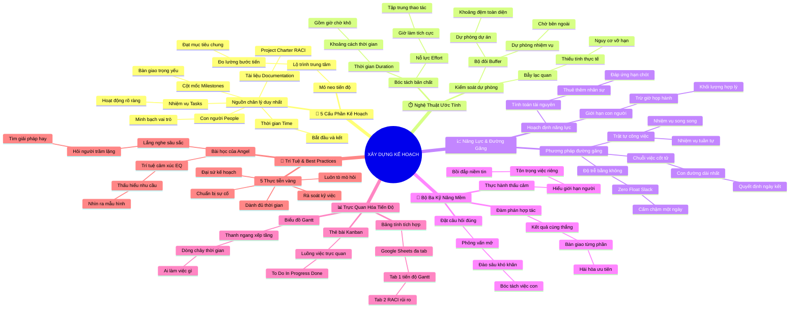

# 🧠 BẢN ĐỒ TƯ DUY TINH GỌN (4-5 TẦNG): HỌC PHẦN 2 - XÂY DỰNG KẾ HOẠCH DỰ ÁN

## 1. Sơ Đồ Tư Duy Trực Quan (Mermaid Mindmap Tinh Gọn)

---

## 2. Cây Phân Cấp Tri Thức Gợi Nhớ Nhanh 4-5 Tầng (Active Recall Hierarchy)

- 📌 **5 Cấu Phần Kế Hoạch (Components of a Project Plan)**
  - 🔹 *Mỏ neo tiến độ:* ➔ *Lộ trình trung tâm* ➔ *Đo lường bước tiến* ➔ *Dẫn dắt về đích*
  - 🔹 *Nguồn chân lý duy nhất:* ➔ *Tasks & Milestones* ➔ *People & Documentation* ➔ *Thời gian Time*
- 📌 **Nghệ Thuật Ước Tính (Time & Effort Estimation)**
  - 🔹 *Phân biệt nỗ lực vs thời gian:* ➔ *Nỗ lực 30 phút sơn* ➔ *Thời gian 24 giờ chờ khô* ➔ *Làm việc khác lúc chờ*
  - 🔹 *Bộ đôi đệm thời gian:* ➔ *Task Buffer cho đối tác* ➔ *Project Buffer cho cả nhóm* ➔ *Bảo vệ khỏi trễ hạn*
- 📌 **Năng Lực & Đường Găng (Capacity & Critical Path)**
  - 🔹 *Hoạch định năng lực:* ➔ *Giới hạn sức người* ➔ *Tính toán tài xế Plant Pals* ➔ *Tuyển đủ người đúng hạn*
  - 🔹 *Đường găng CPM:* ➔ *Con đường dài nhất* ➔ *Thời gian dự trữ Float = 0* ➔ *Chậm 1 ngày trễ cả dự án*
  - 🔹 *Trật tự công việc:* ➔ *Nhiệm vụ tuần tự FS* ➔ *Nhiệm vụ song song độc lập* ➔ *Tối ưu hóa tiến độ*
- 📌 **Bộ Ba Kỹ Năng Mềm (Soft Skills Triad)**
  - 🔹 *Đặt câu hỏi mở:* ➔ *Đào sâu khâu khó nhất* ➔ *Bóc tách Sub-tasks* ➔ *Phát hiện điểm mù kỹ thuật*
  - 🔹 *Đàm phán hợp tác:* ➔ *Dung hòa ưu tiên cạnh tranh* ➔ *Nộp trước bản phác thảo* ➔ *Kết quả cùng thắng*
  - 🔹 *Thực hành thấu cảm:* ➔ *Tôn trọng kỳ nghỉ phép* ➔ *Tránh giao việc dồn dập* ➔ *Gắn kết bền chặt*
- 📌 **Trực Quan Hóa Tiến Độ (Schedule Visualization)**
  - 🔹 *Biểu đồ Gantt:* ➔ *Thanh ngang xếp tầng* ➔ *Leon soạn thảo Kylie hiệu đính* ➔ *Rõ người rõ hạn*
  - 🔹 *Bảng tính tích hợp:* ➔ *Google Sheets nhiều tab* ➔ *Tập trung Gantt, RACI, Rủi ro* ➔ *Xóa bỏ tam sao thất bản*
- 📌 **Trí Tuệ & Thực Tiễn Tốt Nhất (Angel & Best Practices)**
  - 🔹 *Trí tuệ cảm xúc của Angel:* ➔ *Nhận diện mẫu hình bế tắc* ➔ *Hỏi người trầm lặng* ➔ *Khai phóng ý tưởng đột phá*
  - 🔹 *Đại sứ kế hoạch:* ➔ *Champion Your Plan* ➔ *Chứng minh lợi ích cho nhóm* ➔ *Kế hoạch thực sự sống động*

---

## 3. Bảng Neo Trí Nhớ Từ Khóa Vàng (Memory Anchor Cheat Sheet)

| Từ Khóa Cốt Lõi | Phần Trong Tài Liệu | Bản Chất / Vai Trò (3-5 từ) | Tín Hiệu Gợi Nhớ (Memory Trigger) |
| :--- | :--- | :--- | :--- |
| **SSOT** | Phần I: 5 Cấu Phần | Nguồn chân lý duy nhất | Cuốn kinh thánh của dự án |
| **Effort** | Phần II: Ước Tính | Giờ làm tích cực thực tế | Đôi bàn tay trực tiếp cầm cọ sơn |
| **Duration** | Phần II: Ước Tính | Tổng khoảng cách thời gian | Kim đồng hồ chạy hết 24 giờ |
| **Task Buffer** | Phần II: Dự Phòng | Đệm an toàn từng việc | Khoảng hở giữa thứ Hai và thứ Năm |
| **Project Buffer** | Phần II: Dự Phòng | Đệm thời gian toàn dự án | Chiếc đệm lò xo đỡ toàn bộ hệ thống |
| **Capacity Planning** | Phần III: Năng Lực | Tính toán sức người thực tế | Bình chứa nước có dung tích giới hạn |
| **Critical Path (CPM)** | Phần III: Đường Găng | Chuỗi việc quyết định hạn chót | Sợi dây thừng căng không có độ chùng |
| **Zero Float** | Phần III: Đường Găng | Không được trễ một ngày | Vạch đích sắt đá không xê dịch |
| **Sub-tasks** | Phần IV: Kỹ Năng Mềm | Đầu việc nhỏ bị ẩn giấu | Tảng băng chìm dưới mặt nước |
| **Empathy** | Phần IV: Kỹ Năng Mềm | Thấu hiểu cảm xúc cộng sự | Đặt mình vào vị trí người khác |
| **Gantt Chart** | Phần V: Trực Quan Hóa | Biểu đồ thanh ngang theo tuần | Lịch làm việc xếp tầng màu sắc |
| **Kanban Board** | Phần V: Trực Quan Hóa | Bảng thẻ trực quan luồng việc | Các mẩu giấy ghi chú di chuyển trên bảng |
| **Quiet Members** | Phần VI: Angel Wisdom | Khai phóng người trầm lặng | Viên ngọc ẩn mình dưới đáy biển |
| **Champion Your Plan** | Phần VI: Best Practices | Đại sứ truyền cảm hứng kế hoạch | Người cầm cờ dẫn đầu đoàn quân |
