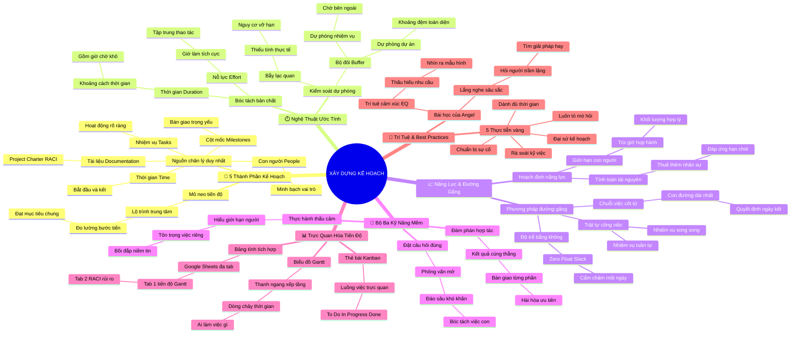

# Tóm Tắt Học Phần 2: Xây Dựng Kế Hoạch Dự Án (Building a Project Plan)

## 1. Thông điệp cốt lõi (Core Message)
> Kế hoạch dự án là "Nguồn chân lý duy nhất" (Single Source of Truth) kết nối hài hòa 5 yếu tố Nhiệm vụ, Cột mốc, Con người, Tài liệu và Thời gian; trong đó nghệ thuật kiểm soát tiến độ phụ thuộc vào việc phân biệt rạch ròi giữa Thời gian (Duration) và Nỗ lực (Effort), làm chủ Phương pháp Đường găng (Critical Path Method) và vận dụng Trí tuệ Cảm xúc (EQ) để thu thập các ước tính khả thi nhất từ đội ngũ.

---

## 2. Lược Đồ Phân Bổ Cấu Trúc Tài Liệu (Content Distribution Overview)

| Phần / Đề Mục Tài Liệu Gốc | Nội Dung Trọng Tâm | Số Luận Điểm Đại Diện |
| :--- | :--- | :---: |
| **Phần I: 5 Thành Phần Cốt Lõi Của Kế Hoạch Dự Án** *(Components of a Project Plan)* | Vai trò mỏ neo của Tiến độ, 5 thành tố cấu thành kế hoạch toàn diện và cơ chế vận hành nguồn chân lý duy nhất. | 2 Luận điểm |
| **Phần II: Nghệ Thuật Ước Tính Thời Gian & Bộ Đôi Dự Phòng** *(Realistic Time Estimation & Buffers)* | Phân biệt Thời gian (Duration) vs Nỗ lực (Effort), bẫy lạc quan thái quá và cơ chế thiết lập Task Buffer vs Project Buffer. | 2 Luận điểm |
| **Phần III: Hoạch Định Năng Lực & Phương Pháp Đường Găng** *(Capacity Planning & Critical Path Method)* | Giới hạn năng lực thực tế, định vị chuỗi găng quyết định tiến độ, nhiệm vụ song song vs tuần tự, thời gian dự trữ (Float/Slack). | 2 Luận điểm |
| **Phần IV: Thu Thập Ước Tính Qua Bộ Ba Kỹ Năng Mềm** *(Getting Accurate Estimates via Soft Skills)* | Tam giác kỹ năng mềm: Đặt câu hỏi mở, đàm phán hợp tác cùng thắng và thấu cảm đời sống cá nhân của cộng sự. | 2 Luận điểm |
| **Phần V: Trực Quan Hóa Tiến Độ & Công Cụ Quản Trị** *(Developing Project Schedule & Gantt Charts)* | Cấu trúc biểu đồ thanh ngang Gantt, bảng tính Google Sheets đa tài liệu và phương pháp thẻ trực quan Kanban. | 2 Luận điểm |
| **Phần VI: Trí Tuệ Đối Nhân Xử Thế & 5 Best Practices** *(Angel's Story & Project Plan Best Practices)* | Angel: Trí tuệ cảm xúc và lắng nghe người trầm lặng; 5 thực tiễn vàng để trở thành Đại sứ truyền cảm hứng (Champion Your Plan). | 2 Luận điểm |
| **Tổng cộng** | **Bao quát 100% cấu trúc 6 mảng nội dung tài liệu gốc** | **12 Luận điểm** |

---

## 3. Luận điểm quan trọng theo cấu trúc tài liệu (Key Takeaways: 12 Luận Điểm Chuyên Sâu)

### 📑 PHẦN I: 5 THÀNH PHẦN CỐT LÕI CỦA KẾ HOẠCH DỰ ÁN

1. **TIẾN ĐỘ DỰ ÁN LÀ TRÁI TIM ĐỊNH HƯỚNG MỌI HOẠT ĐỘNG**
   - **Bản chất & Phân tích chuyên sâu:** Một kế hoạch dự án không phải là một tập tài liệu lý thuyết rời rạc mà là một cỗ máy vận hành thống nhất. Nằm ở vị trí trung tâm của bản kế hoạch chính là Tiến độ Dự án (Project Schedule). Bản tiến độ vạch rõ lộ trình từ điểm xuất phát tới đích đến, ước tính chính xác tổng thời gian hoàn thành và cung cấp cho toàn đội một công cụ trực quan để đối soát giữa tiến độ thực tế với các mục tiêu đã cam kết.
   - **Phương pháp / Công cụ / Quy trình đi kèm:** Đường cơ sở tiến độ (Schedule Baseline), Lộ trình dự án (Project Roadmap).
   - **Ví dụ thực tế đời thường:** Bản đồ hải trình của một con tàu viễn dương: Thuyền trưởng và thủy thủ đoàn nhìn vào hải trình để biết ngày nào cập cảng nào, nếu gặp bão phải điều chỉnh hải trình ra sao để về đích an toàn.

2. **CƠ CẤU 5 THÀNH TỐ TẠO NÊN NGUỒN CHÂN LÝ DUY NHẤT (SINGLE SOURCE OF TRUTH)**
   - **Bản chất & Phân tích chuyên sâu:** Một bản kế hoạch dự án chuẩn mực kết hợp chặt chẽ 5 thành phần: (1) Nhiệm vụ (Tasks) phân công cụ thể; (2) Cột mốc (Milestones) đánh dấu bàn giao; (3) Con người (People) với vai trò rõ ràng; (4) Tài liệu (Documentation) liên kết Project Charter và RACI; (5) Thời gian (Time) ấn định ngày bắt đầu và kết thúc. Khi tích hợp đủ 5 yếu tố này, kế hoạch trở thành "Nguồn chân lý duy nhất", xóa bỏ hoàn toàn tình trạng tam sao thất bản.
   - **Phương pháp / Công cụ / Quy trình đi kèm:** Mô hình 5 thành tố kế hoạch dự án (Tasks, Milestones, People, Documentation, Time), Nguồn chân lý duy nhất (Single Source of Truth - SSOT).
   - **Ví dụ thực tế đời thường:** Hồ sơ thiết kế và thi công nội thất căn hộ: Bao gồm bản vẽ từng phòng (Tasks), ngày bàn giao sàn gỗ (Milestone), số điện thoại thợ điện/thợ mộc (People), hợp đồng báo giá (Documentation) và lịch thi công 30 ngày (Time).

---

### 📑 PHẦN II: NGHỆ THUẬT ƯỚC TÍNH THỜI GIAN & BỘ ĐÔI DỰ PHÒNG

3. **PHÂN BIỆT RẠCH RÒI GIỮA THỜI GIAN (DURATION) VÀ NỖ LỰC (EFFORT)**
   - **Bản chất & Phân tích chuyên sâu:** Sai lầm phổ biến nhất của người mới làm quản trị là đồng nhất thời gian kéo dài của một nhiệm vụ với công sức làm việc. Nỗ lực (Effort) là tổng số giờ thao tác tích cực (active work) mà nhân sự phải trực tiếp tập trung làm. Thời gian (Duration) là tổng khoảng thời gian trôi qua từ lúc bắt đầu đến khi kết thúc, bao gồm cả thời gian chờ thụ động (inactive/idle time). Hiểu được sự khác biệt này giúp PM tối ưu hóa nguồn lực bằng cách giao việc khác cho nhân sự trong lúc chờ đợi.
   - **Phương pháp / Công cụ / Quy trình đi kèm:** Kỹ thuật bóc tách thời gian và nỗ lực (Active Work vs. Inactive Time Analysis), Quản lý thời gian nhàn rỗi (Idle Time Optimization).
   - **Ví dụ thực tế đời thường:** Sơn một bức tường: Nỗ lực quét sơn chỉ tốn 30 phút, nhưng thời gian để sơn khô và được nghiệm thu kéo dài tới 24 giờ. Trong 23 giờ 30 phút chờ sơn khô, người thợ có thể đi sơn cửa sổ hoặc lắp ổ cắm điện.

4. **BẪY LẠC QUAN THÁI QUÁ VÀ CƠ CHẾ ĐIỀU PHỐI BỘ ĐÔI DỰ PHÒNG (BUFFERS)**
   - **Bản chất & Phân tích chuyên sâu:** Sự lạc quan là phẩm chất tốt nhưng lạc quan thái quá (Optimism Bias) là kẻ thù số một của tiến độ. Để bảo vệ dự án trước những biến số bất ngờ, PM vận dụng hai loại thời gian dự phòng: (1) Thời gian dự phòng nhiệm vụ (Task Buffer) bổ sung cho các công việc có yếu tố phụ thuộc bên ngoài hoặc kỹ thuật phức tạp (như chờ nhà vườn gửi cây); (2) Thời gian dự phòng dự án (Project Buffer) cộng dồn một khoảng thời gian chung vào cuối tiến độ để hấp thụ mọi sự chậm trễ phát sinh của toàn đội.
   - **Phương pháp / Công cụ / Quy trình đi kèm:** Đệm thời gian nhiệm vụ (Task Buffers), Đệm thời gian dự án (Project Buffers), Kiểm soát độ lệch lạc quan (Mitigating Optimism Bias).
   - **Ví dụ thực tế đời thường:** Yêu cầu nhà cung cấp gửi báo giá trước thứ Hai dù thực tế thứ Năm mới cần (Task Buffer 3 ngày); hoặc dự kiến hoàn thiện website vào ngày 20 tháng 12 dù sự kiện khai trương là ngày 31 tháng 12 (Project Buffer 11 ngày).

---

### 📑 PHẦN III: HOẠCH ĐỊNH NĂNG LỰC & PHƯƠNG PHÁP ĐƯỜNG GĂNG (CPM)

5. **HOẠCH ĐỊNH NĂNG LỰC DỰA TRÊN GIỚI HẠN THỰC TẾ CỦA CON NGƯỜI**
   - **Bản chất & Phân tích chuyên sâu:** Năng lực (Capacity) là khối lượng công việc tối đa mà một người hoặc một nguồn lực có thể giải quyết hợp lý trong một ngày. Ngay cả khi nhân sự dành 100% thời gian cho dự án, họ vẫn bị tiêu hao năng lượng bởi các cuộc họp, trao đổi và xử lý sự cố phát sinh. Hoạch định năng lực giúp PM tính toán chính xác số lượng nhân sự cần bổ sung để đáp ứng hạn chót mà không vắt kiệt sức lực của đội ngũ.
   - **Phương pháp / Công cụ / Quy trình đi kèm:** Hoạch định năng lực nguồn lực (Capacity Planning Formula: $\text{Số nhân sự} = \frac{\text{Tổng khối lượng}}{\text{Năng suất/ngày} \times \text{Số ngày}}$).
   - **Ví dụ thực tế đời thường:** Dự án Plant Pals cần giao 100 chậu cây trong 5 ngày. Nếu một tài xế chỉ chở được 4 chuyến/ngày, PM lập tức tính ra năng lực 1 tài xế trong 5 ngày là 20 chuyến $\to$ Bắt buộc phải thuê ít nhất 5 tài xế để kịp tiến độ.

6. **PHƯƠNG PHÁP ĐƯỜNG GĂNG (CPM) VÀ NGUYÊN TẮC THỜI GIAN DỰ TRỮ BẰNG 0**
   - **Bản chất & Phân tích chuyên sâu:** Đường găng (Critical Path) là chuỗi dài nhất gồm các nhiệm vụ và cột mốc phụ thuộc tuần tự bắt buộc phải hoàn thành đúng hạn để đưa dự án về đích. Điểm cốt tử của đường găng là: Mọi nhiệm vụ trên đường găng đều có Thời gian dự trữ bằng không ($\text{Float/Slack} = 0$). Bất kỳ một nhiệm vụ nào trên đường găng bị chậm trễ dù chỉ một ngày cũng sẽ làm chậm trọn vẹn toàn bộ ngày kết thúc của dự án. Các nhiệm vụ có thời gian dự trữ (Float $> 0$) nằm ngoài đường găng và có thể linh hoạt điều chỉnh.
   - **Phương pháp / Công cụ / Quy trình đi kèm:** Phương pháp đường găng (Critical Path Method - CPM), Phân tích thời gian dự trữ (Total Float & Free Float Analysis), Nhiệm vụ song song vs tuần tự.
   - **Ví dụ thực tế đời thường:** Ra mắt dịch vụ Plant Pals: Ký hợp đồng nhà cung cấp $\to$ Lập trình website $\to$ Giao đợt cây đầu tiên là Đường Găng (trễ 1 ngày là trễ ra mắt); trong khi nhiệm vụ "In tờ rơi quảng cáo kèm theo" có thể trễ 3 ngày mà không ảnh hưởng ngày mở bán web.

---

### 📑 PHẦN IV: THU THẬP ƯỚC TÍNH QUA BỘ BA KỸ NĂNG MỀM

7. **PHƯỚNG PHÁP PHỎNG VẤN VÀ ĐẶT CÂU HỎI MỞ CHI TIẾT**
   - **Bản chất & Phân tích chuyên sâu:** Người trực tiếp thực thi công việc là người hiểu rõ nhất độ phức tạp của nhiệm vụ. Thay vì áp đặt thời hạn hoặc hỏi những câu hỏi đóng "Bao giờ xong?", PM biến cuộc trao đổi thành buổi phỏng vấn thấu hiểu bằng các câu hỏi mở: "Những rủi ro nào có thể khiến tác vụ này kéo dài hơn?", "Bạn cần tài nguyên gì từ phòng ban khác?", "Đâu là khâu khó nhất?". Những câu hỏi này kích hoạt tư duy phản biện và giúp bóc tách các nhiệm vụ con (Sub-tasks) bị ẩn giấu.
   - **Phương pháp / Công cụ / Quy trình đi kèm:** Kỹ thuật đặt câu hỏi mở đào sâu (Open-Ended Estimation Inquiries), Phân rã nhiệm vụ con (Sub-task Decomposition).
   - **Ví dụ thực tế đời thường:** Khi hỏi lập trình viên về việc tạo form đăng ký: Nhờ câu hỏi mở "Có cần tích hợp hệ thống nào không?", PM phát hiện ra việc kết nối cổng thanh toán ngân hàng mất thêm 3 ngày cấu hình bảo mật mà ban đầu chưa ai nghĩ tới.

8. **ĐÀM PHÁN HỢP TÁC CÙNG THẮNG VÀ THỰC HÀNH SỰ THẤU CẢM (EMPATHY)**
   - **Bản chất & Phân tích chuyên sâu:** Các thành viên trong nhóm luôn phải đối mặt với nhiều ưu tiên cạnh tranh từ các dự án khác. Đàm phán hiệu quả không phải là ép buộc mà là tìm kiếm điểm dung hòa đôi bên cùng có lợi (chẳng hạn bàn giao trước phiên bản thử nghiệm 1 trang). Đi kèm với đó là sự thấu cảm: quan tâm đến lịch nghỉ phép, trách nhiệm gia đình và sức khỏe của cộng sự để không giao việc vào những thời điểm nhạy cảm, xây dựng lòng tin bền vững.
   - **Phương pháp / Công cụ / Quy trình đi kèm:** Kỹ thuật đàm phán dựa trên lợi ích (Interest-Based Negotiation), Lắng nghe thấu cảm và tôn trọng ranh giới cá nhân (Empathic Leadership).
   - **Ví dụ thực tế đời thường:** Chuyên viên thiết kế đang bị quá tải vì phụ trách 2 dự án cùng lúc: PM chủ động đàm phán với PM dự án kia để chia sẻ nhân sự, đồng thời đồng ý cho thiết kế nộp trước bản thảo nét thô để lấy phản hồi sớm.

---

### 📑 PHẦN V: TRỰC QUAN HÓA TIẾN ĐỘ & CÔNG CỤ QUẢN TRỊ

9. **SỨC MẠNH TRỰC QUAN CỦA BIỂU ĐỒ GANTT THEO DÒNG THỜI GIAN**
   - **Bản chất & Phân tích chuyên sâu:** Được phát triển bởi kỹ sư Henry Gantt từ đầu những năm 1900, biểu đồ Gantt là công cụ trực quan hóa tiến độ kinh điển và mạnh mẽ nhất. Bằng cách hiển thị các nhiệm vụ dưới dạng các thanh ngang xếp tầng theo trục thời gian, biểu đồ giúp toàn bộ đội ngũ nhìn thấy rõ ngày bắt đầu, ngày kết thúc, thời lượng, người phụ trách và mối quan hệ phụ thuộc trước - sau giữa các phần việc chỉ trong một ánh nhìn.
   - **Phương pháp / Công cụ / Quy trình đi kèm:** Biểu đồ Gantt (Gantt Chart Cascading Bars), Mối quan hệ liên kết nhiệm vụ (Task Dependencies).
   - **Ví dụ thực tế đời thường:** Soạn thảo bản điều lệ dự án: Thanh màu xanh của Leon kéo dài từ thứ Sáu đến thứ Ba; thanh màu cam của Kylie bắt đầu từ thứ Tư (sau khi thanh của Leon kết thúc) để tiến hành hiệu đính. Cả đội nhìn vào biểu đồ là hiểu ngay ai làm trước ai làm sau.

10. **TÍCH HỢP TÀI LIỆU ĐA TẦNG TRÊN BẢNG TÍNH VÀ BẢNG KANBAN**
    - **Bản chất & Phân tích chuyên sâu:** Kế hoạch dự án có thể được xây dựng linh hoạt trên Bảng tính (Spreadsheets) như Google Sheets hoặc phần mềm quản lý chuyên nghiệp. Bảng tính cho phép tạo nhiều tab tích hợp: Tab 1 là Biểu đồ Gantt tiến độ; các tab tiếp theo lưu trữ Bản điều lệ dự án, Ma trận RACI, Bảng quản trị rủi ro và Kế hoạch truyền thông. Đối với các dự án linh hoạt, bảng thẻ Kanban (To Do - In Progress - Done) là công cụ trực quan xuất sắc giúp kiểm soát luồng công việc.
    - **Phương pháp / Công cụ / Quy trình đi kèm:** Hệ thống bảng tính quản trị dự án tích hợp (Integrated Project Management Spreadsheet), Bảng thẻ trực quan Kanban (Kanban Workflows).
    - **Ví dụ thực tế đời thường:** Một file Google Sheets duy nhất của Dự án Plant Pals: Mở link ra là có đầy đủ tiến độ tuần, danh sách nhà cung cấp cây cảnh, phân công ai duyệt thiết kế và biên bản nghiệm thu sản phẩm.

---

### 📑 PHẦN VI: TRÍ TUỆ ĐỐI NHÂN XỬ THẾ & 5 BEST PRACTICES

11. **TRÍ TUỆ CẢM XÚC (EQ) VÀ LẮNG NGHE NGƯỜI TRẦM LẶNG: BÀI HỌC CỦA ANGEL**
    - **Bản chất & Phân tích chuyên sâu:** Angel (Program Manager tại Google) tốt nghiệp kỹ sư cơ khí nhưng tạo nên sự đột phá nhờ trí tuệ cảm xúc (EQ) vượt trội. Kỹ năng quản trị dự án không phụ thuộc vào ngành nghề (từ máy in nhãn, đầu máy xe lửa đến công nghệ) mà nằm ở cách kết nối con người. Đặc biệt, PM xuất sắc phải biết chủ động tìm đến những đồng nghiệp trầm lặng, ít khi phát biểu trong cuộc họp, bởi họ thường là những người suy nghĩ sâu sắc nhất và nắm giữ những giải pháp tháo gỡ điểm nghẽn đột phá.
    - **Phương pháp / Công cụ / Quy trình đi kèm:** Khung năng lực trí tuệ cảm xúc (Emotional Intelligence in PM), Nhận diện quy luật mẫu hình bế tắc (Identifying Project Bottleneck Patterns).
    - **Ví dụ thực tế đời thường:** Trong cuộc họp thảo luận lỗi kỹ thuật của ứng dụng: Một lập trình viên kỳ cựu ngồi im lặng suốt buổi; Angel nhẹ nhàng hỏi riêng: "Anh nghĩ sao về giải pháp này?", và anh ấy đã chỉ ra ngay lỗ hổng bảo mật chết người mà cả phòng họp đang bỏ qua.

12. **5 KINH NGHIỆM THỰC TIỄN TỐT NHẤT ĐỂ TRỞ THÀNH ĐẠI SỨ KẾ HOẠCH (CHAMPION YOUR PLAN)**
    - **Bản chất & Phân tích chuyên sâu:** Để kế hoạch thực sự sống động và dẫn dắt dự án thành công, PM phải thực hành 5 nguyên tắc: (1) Rà soát tỉ mỉ từng sản phẩm bàn giao; (2) Dành đủ thời gian xứng đáng để lập kế hoạch; (3) Nhận diện và chuẩn bị sẵn cho những trục trặc tất yếu; (4) Luôn tò mò học hỏi từ chuyên môn của cộng sự; (5) Trở thành đại sứ truyền cảm hứng (Champion Your Plan) bằng cách chứng minh cho mọi người thấy việc bám sát kế hoạch mang lại lợi ích và sự an tâm tuyệt đối cho chính họ.
    - **Phương pháp / Công cụ / Quy trình đi kèm:** 5 Nguyên tắc thực tiễn tốt nhất cho kế hoạch dự án (5 Best Practices), Nghệ thuật truyền cảm hứng cam kết (Plan Advocacy & Sponsorship).
    - **Ví dụ thực tế đời thường:** PM chia sẻ trong buổi họp đầu tuần: "Bản kế hoạch trên Google Sheets này không phải để kiểm soát các bạn, mà để đảm bảo không ai phải làm thêm giờ vào cuối tuần và sếp lớn luôn nhìn thấy công lao của từng người!".

---

## 4. Kế hoạch hành động (Action Plan: 18 việc cụ thể)

#### Nhóm 1: Hành động ngay hôm nay (Micro-habits dưới 2 phút - 5 việc)
- [ ] **Hành động 1:** Khi ước tính một đầu việc hôm nay, tự phân tách rõ: Việc này cần bao nhiêu phút "nỗ lực tập trung" và bao nhiêu phút "chờ đợi thụ động".
- [ ] **Hành động 2:** Cộng thêm 15-20% thời gian dự phòng (Buffer) vào hạn chót của công việc tiếp theo để đối phó với sự cố gián đoạn.
- [ ] **Hành động 3:** Nhắn tin hỏi thăm một cộng sự trầm lặng trong nhóm về cảm nhận của họ đối với khối lượng công việc hiện tại.
- [ ] **Hành động 4:** Kiểm tra nhanh: Trong 3 việc ưu tiên nhất hôm nay, việc nào thực sự nằm trên "Đường găng" quyết định tiến độ của tuần?
- [ ] **Hành động 5:** Lưu lại định nghĩa và công thức tính Năng lực (Capacity) vào sổ tay quản lý cá nhân.

#### Nhóm 2: Kế hoạch rèn luyện trong tuần (Áp dụng vào công việc & đời sống - 7 việc)
- [ ] **Hành động 6:** Vẽ một biểu đồ Gantt đơn giản trên Google Sheets cho dự án hoặc mục tiêu cá nhân trong tháng tới.
- [ ] **Hành động 7:** Thực hiện buổi phỏng vấn ước tính thời gian với một thành viên trong nhóm bằng các câu hỏi mở thay vì câu hỏi đóng.
- [ ] **Hành động 8:** Xác định chính xác Đường găng (Critical Path) cho dự án đang chạy bằng cách lập danh sách các nhiệm vụ có $\text{Float} = 0$.
- [ ] **Hành động 9:** Tính toán năng lực thực tế của đội ngũ trong tuần (trừ đi thời gian họp hành, nghỉ lễ và trao đổi thông tin).
- [ ] **Hành động 10:** Thiết lập một khoảng "Thời gian dự phòng dự án" (Project Buffer) dài 2-3 ngày ở cuối mốc bàn giao sắp tới.
- [ ] **Hành động 11:** Thực hành kỹ năng đàm phán hợp tác cùng thắng khi phát hiện một thành viên đang bị quá tải bởi nhiều dự án cạnh tranh.
- [ ] **Hành động 12:** Tổ chức lại bảng tính quản lý dự án với các tab chuyên biệt: Kế hoạch, RACI, Rủi ro và Truyền thông để tạo thành Single Source of Truth.

#### Nhóm 3: Thói quen duy trì & Chuyển hóa lâu dài (Phát triển bền vững - 6 việc)
- [ ] **Hành động 13:** Rèn luyện Trí tuệ Cảm xúc (EQ) như Angel: Luôn tự vấn xem phong cách quản lý của mình đang tạo tác động tích cực hay tiêu cực lên nhóm.
- [ ] **Hành động 14:** Duy trì thói quen coi kế hoạch là một nguồn chân lý duy nhất (Single Source of Truth), cập nhật tiến độ công khai mỗi tuần.
- [ ] **Hành động 15:** Xây dựng thói quen luôn tò mò học hỏi (Stay Curious), chủ động tìm hiểu các thuật ngữ kỹ thuật chuyên sâu từ các chuyên gia trong đội ngũ.
- [ ] **Hành động 16:** Đóng vai trò là "Đại sứ truyền cảm hứng cho kế hoạch", thường xuyên giải thích giá trị bảo vệ của kế hoạch cho các thành viên.
- [ ] **Hành động 17:** Định kỳ đánh giá và tối ưu hóa thời gian nhàn rỗi (idle time) trong các quy trình vận hành phức tạp của tổ chức.
- [ ] **Hành động 18:** Thiết lập văn hóa không đổ lỗi khi dự án phát sinh lỗi trễ hạn, tập trung cùng nhau phân tích nguyên nhân và bài học kinh nghiệm.

---

## 5. Câu hỏi tự ngẫm (Reflection: 24 câu hỏi sâu sắc)

#### Nhóm 1: Tự vấn Nhận thức & Hệ tư duy (Self-Awareness & Mindset: 6 câu)
1. Tôi có đang mắc bẫy "Lạc quan thái quá" khi luôn giả định rằng mọi việc sẽ diễn ra hoàn hảo 100% không trục trặc không?
2. Khi ước tính tiến độ, tôi có đang nhầm lẫn giữa "Tổng thời gian kéo dài" với "Số giờ nỗ lực thực tế" của nhân sự không?
3. Trí tuệ cảm xúc (EQ) của tôi đang ở mức nào khi tiếp nhận thông tin về một sự cố chậm trễ từ đồng nghiệp?
4. Tôi có coi kế hoạch dự án là công cụ kiểm soát cứng nhắc hay là ngọn hải đăng linh hoạt dẫn đường cho đội ngũ?
5. Khi một thành viên đưa ra ước tính thời gian dài hơn kỳ vọng, phản xạ đầu tiên của tôi là nghi ngờ hay tìm hiểu lý do sâu xa?
6. Tôi có đang dành đủ thời gian xứng đáng cho giai đoạn lập kế hoạch hay luôn nóng vội muốn nhảy ngay vào thực thi?

#### Nhóm 2: Nhận diện Thói quen & Điểm mù (Habits & Blind Spots: 6 câu)
7. Tôi có thường xuyên cộng thêm thời gian dự phòng (Buffers) một cách khoa học hay chỉ ấn định deadline sát nút theo cảm tính?
8. Tôi có bỏ sót ý kiến đóng góp của những thành viên trầm lặng, hướng nội trong các buổi họp lập kế hoạch không?
9. Trong dự án của tôi, đâu là các nhiệm vụ thực sự nằm trên Đường găng mà tôi chưa theo dõi sát sao hàng ngày?
10. Tài liệu dự án của tôi hiện nay đã tập hợp thành "Nguồn chân lý duy nhất" chưa hay vẫn nằm phân tán rải rác trên email, chat cá nhân?
11. Tôi có tính toán đến thời gian chết (idle time/chờ phê duyệt) khi lập tiến độ bàn giao cho khách hàng không?
12. Tôi có đang giao việc vượt quá năng lực (Capacity) thực tế của một vài cá nhân nòng cốt mà không nhận ra không?

#### Nhóm 3: Ứng dụng Thực tế & Giải quyết Vấn đề (Practical Application & Problem Solving: 6 câu)
13. Làm thế nào để giải thích cho khách hàng hiểu lý do tại sao một tác vụ chỉ tốn 2 giờ làm việc nhưng phải mất 3 ngày mới bàn giao được?
14. Nếu một nhiệm vụ trên Đường găng bị chậm 2 ngày, tôi sẽ áp dụng những biện pháp nào (cắt giảm scope, tăng người, đổi việc tuần tự thành song song) để cứu vãn tiến độ?
15. Tôi có thể đặt ra những câu hỏi mở cụ thể nào để người trực tiếp làm việc tự tin đưa ra ước tính nỗ lực chân thực nhất?
16. Khi hai người quản lý dự án tranh giành một nhân sự giỏi, tôi sẽ vận dụng kỹ năng đàm phán hợp tác ra sao để đạt kết quả cùng thắng?
17. Bằng cách nào tôi có thể trực quan hóa biểu đồ Gantt để các bên liên quan cấp cao nắm bắt tình hình dự án chỉ trong 30 giây?
18. Làm sao để thuyết phục đội ngũ cập nhật tiến độ công việc lên bảng tính/phần mềm một cách tự giác và đều đặn mỗi ngày?

#### Nhóm 4: Bứt phá Giới hạn & Chuyển hóa Tương lai (Breakthrough & Transformation: 6 câu)
19. Làm thế nào để chuyển hóa năng lực quản trị dự án từ việc chỉ quản lý kỹ thuật sang năng lực lãnh đạo dẫn dắt con người xuất sắc như Angel?
20. Nếu quy mô dự án tăng gấp 10 lần với hàng trăm nhiệm vụ đan xen, hệ thống quản trị đường găng của tôi cần được nâng cấp ra sao?
21. Đâu là những chuẩn mực thực hành tốt nhất (Best Practices) mà tôi sẽ xây dựng thành cẩm nang đào tạo cho thế hệ PM kế cận?
22. Tôi sẽ xây dựng văn hóa "Đại sứ kế hoạch" trong tổ chức như thế nào để mọi phòng ban đều chủ động tôn trọng các mốc tiến độ?
23. Làm thế nào để các dữ liệu lịch sử về thời gian và nỗ lực từ dự án này trở thành tài sản tri thức quý báu cho các dự án tương lai?
24. Phong cách lãnh đạo của tôi sẽ chuyển hóa ra sao khi tôi hoàn toàn làm chủ nghệ thuật cân bằng giữa kỷ luật tiến độ và sự thấu cảm con người?

---

## 6. Bản Đồ Tư Duy Trực Quan (Visual Mindmap Overview - Tinh Gọn 4-5 Tầng)

