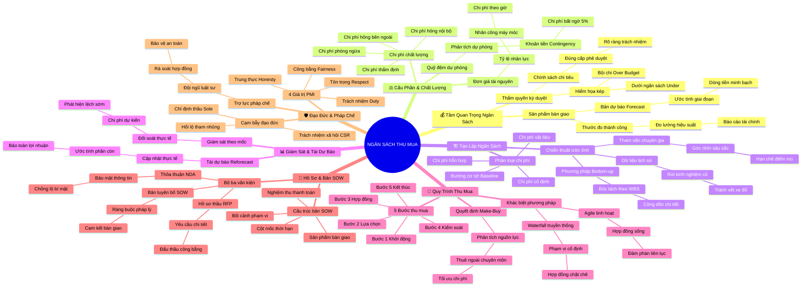

# 🧠 BẢN ĐỒ TƯ DUY TINH GỌN (4-5 TẦNG): HỌC PHẦN 3 - QUẢN LÝ NGÂN SÁCH VÀ THU MUA

## 1. Sơ Đồ Tư Duy Trực Quan (Mermaid Mindmap Tinh Gọn)

---

## 2. Cây Phân Cấp Tri Thức Gợi Nhớ Nhanh 4-5 Tầng (Active Recall Hierarchy)

- 📌 **Tầm Quan Trọng Ngân Sách (Importance of Budgeting)**
  - 🔹 *Thước đo thành công:* ➔ *Sản phẩm bàn giao* ➔ *Dự báo dòng tiền Forecast* ➔ *Sức khỏe tài chính công ty*
  - 🔹 *Chính sách ký duyệt:* ➔ *Thẩm quyền chi tiêu* ➔ *Hiểm họa Bội chi* ➔ *Nguy cơ Dưới ngân sách*
- 📌 **Cấu Phần & Chất Lượng (Budget Components & CoQ)**
  - 🔹 *Tỷ lệ chi phí tài nguyên:* ➔ *Resource Cost Rates* ➔ *Nhân công x Đơn giá giờ* ➔ *Tổng chi phí trực tiếp*
  - 🔹 *Quỹ đệm Contingency:* ➔ *Phân tích dự phòng 5%* ➔ *Hấp thụ chi phí nứt vỡ chậu* ➔ *Bảo vệ tiến độ*
  - 🔹 *Chi phí chất lượng CoQ:* ➔ *Phòng ngừa & Thẩm định* ➔ *Thất bại nội bộ & Bên ngoài* ➔ *Đầu tư từ sớm*
- 📌 **Tạo Lập Ngân Sách (Creating a Budget)**
  - 🔹 *Phương pháp Bottom-up:* ➔ *Bóc tách theo WBS* ➔ *Cộng dồn chi phí chi tiết* ➔ *Khảo sát giá nhà cung ứng*
  - 🔹 *Khóa cứng Baseline:* ➔ *Phân loại cố định, vật liệu, hỗn hợp* ➔ *Cost Baseline phê duyệt* ➔ *Thước đo bất biến*
- 📌 **Giám Sát & Tái Dự Báo (Maintaining & Reforecasting)**
  - 🔹 *Giám sát theo cột mốc:* ➔ *Planned vs. Actual Cost* ➔ *Chặn đứng Scope Creep* ➔ *Giải trình minh bạch*
  - 🔹 *Tái dự báo định kỳ:* ➔ *Reforecasting ETC & EAC* ➔ *Cập nhật biến động giá* ➔ *Bảo toàn biên lợi nhuận*
- 📌 **Quy Trình Thu Mua (Procurement Process)**
  - 🔹 *Make-or-Buy Analysis:* ➔ *Thuê ngoài Copywriter* ➔ *Tối ưu chuyên môn* ➔ *Giảm gánh nặng cố định*
  - 🔹 *5 Bước thu mua:* ➔ *Khởi động ➔ Lựa chọn ➔ Hợp đồng ➔ Kiểm soát ➔ Kết thúc* ➔ *Chuẩn mực quốc tế*
  - 🔹 *Thu mua Agile vs Waterfall:* ➔ *Living Contract linh hoạt* ➔ *Hợp đồng cố định rạch ròi* ➔ *Thích ứng bối cảnh*
- 📌 **Hồ Sơ Thu Mua & Bản SOW (Procurement Documents & SOW)**
  - 🔹 *Bộ ba văn kiện:* ➔ *NDA bảo mật* ➔ *RFP mời thầu công bằng* ➔ *SOW ràng buộc pháp lý*
  - 🔹 *Cấu trúc bản SOW:* ➔ *Background & Scope* ➔ *Deliverables & Milestones* ➔ *Thanh toán sau nghiệm thu*
- 📌 **Đạo Đức & Pháp Chế (Ethics & Legal Support)**
  - 🔹 *Hậu thuẫn pháp chế:* ➔ *Luật sư rà soát hợp đồng* ➔ *Kiểm dịch cây an toàn thú cưng* ➔ *Tránh kiện tụng*
  - 🔹 *4 Trụ cột PMI:* ➔ *Honesty & Responsibility* ➔ *Respect & Fairness* ➔ *Chống cạm bẫy Sole-supplier*

---

## 3. Bảng Neo Trí Nhớ Từ Khóa Vàng (Memory Anchor Cheat Sheet)

| Từ Khóa Cốt Lõi | Phần Trong Tài Liệu | Bản Chất / Vai Trò (3-5 từ) | Tín Hiệu Gợi Nhớ (Memory Trigger) |
| :--- | :--- | :--- | :--- |
| **Project Budget** | Phần I: Tầm Quan Trọng | Thước đo thành công dự án | Bảng cân đối tài chính công ty |
| **Spending Policy** | Phần I: Thẩm Quyền | Thẩm quyền ký duyệt chi tiêu | Chiếc bút ký của Giám đốc |
| **Resource Cost Rate** | Phần II: Cấu Phần | Chi phí nhân lực theo giờ | Bảng chấm công gắn đơn giá |
| **Contingency Reserve** | Phần II: Quỹ Đệm | Dự phòng rủi ro 5-10% | Lốp xe phụ dưới gầm ô tô |
| **Cost of Quality (CoQ)** | Phần II: Chất Lượng | Chi phí phòng ngừa và lỗi | Chiếc áo phao cứu sinh |
| **Bottom-up Estimating** | Phần III: Tạo Lập | Cộng dồn chi phí từ WBS | Xếp từng viên gạch xây ngôi nhà |
| **Cost Baseline** | Phần III: Đường Cơ Sở | Mốc chi phí chuẩn được duyệt | Thước đo vàng của dự án |
| **Reforecasting** | Phần IV: Tái Dự Báo | Cập nhật dự báo chi phí còn lại | Ống nhòm điều chỉnh tiêu cự |
| **Make-or-Buy** | Phần V: Thu Mua | Quyết định tự làm hay mua | Nấu cơm nhà hay đi ăn tiệm |
| **Living Contract** | Phần V: Thu Mua Agile | Hợp đồng linh hoạt thích ứng | Dòng sông uốn lượn theo địa hình |
| **NDA** | Phần VI: Hồ Sơ | Thỏa thuận bảo mật thông tin | Chiếc ổ khóa bảo vệ bí mật |
| **RFP** | Phần VI: Hồ Sơ | Yêu cầu đề xuất báo giá thầu | Thư mời thi đấu tranh tài |
| **SOW** | Phần VI: Bản SOW | Tuyên bố công việc chi tiết | Bản thiết kế thi công công trình |
| **Sole-supplier** | Phần VII: Đạo Đức | Cạm bẫy chỉ định thầu độc quyền | Chiếc cầu độc đạo thiếu cạnh tranh |
| **PMI Ethics** | Phần VII: Đạo Đức | 4 giá trị trung thực công bằng | Ngọn hải đăng soi đường lương tri |
