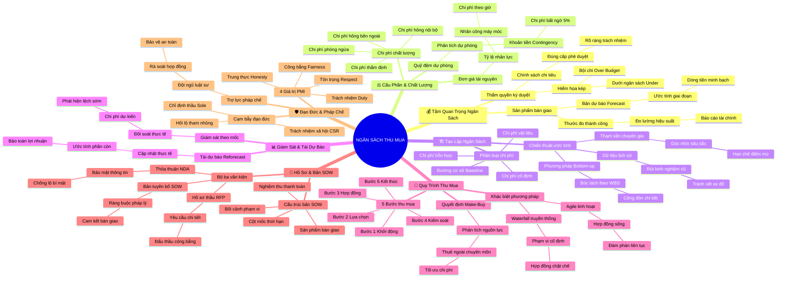

# Tóm Tắt Học Phần 3: Quản Lý Ngân Sách Và Thu Mua (Managing Budgeting and Procurement)

## 1. Thông điệp cốt lõi (Core Message)
> Ngân sách dự án không đơn thuần là bài toán tiết kiệm tiền bạc mà là thước đo sống còn của hiệu suất và sức khỏe doanh nghiệp; kết hợp với quy trình thu mua 5 bước minh bạch, bộ ba văn kiện pháp lý (NDA, RFP, SOW) và 4 trụ cột đạo đức nghề nghiệp PMI để biến nguồn lực bên ngoài thành giá trị bền vững, bảo vệ tổ chức trước rủi ro tài chính và pháp lý.

---

## 2. Lược Đồ Phân Bổ Cấu Trúc Tài Liệu (Content Distribution Overview)

| Phần / Đề Mục Tài Liệu Gốc | Nội Dung Trọng Tâm | Số Luận Điểm Đại Diện |
| :--- | :--- | :---: |
| **Phần I: Tầm Quan Trọng Của Ngân Sách & Thẩm Quyền Ký Duyệt** *(Importance of Budget & Signing Policies)* | Ngân sách là sản phẩm bàn giao, bản dự báo tài chính (Forecast), chính sách ký duyệt chi tiêu và hệ lụy kép của bội chi vs dưới ngân sách. | 2 Luận điểm |
| **Phần II: Cấu Phần Ngân Sách, Quỹ Dự Phòng & Chi Phí Chất Lượng** *(Key Budget Components & Cost of Quality)* | Tỷ lệ chi phí tài nguyên, phân tích dự phòng (Reserve Analysis), ngân sách dự phòng rủi ro (Contingency) và 4 tầng Chi phí chất lượng (CoQ). | 2 Luận điểm |
| **Phần III: Phương Pháp Tạo Lập Ngân Sách Từ Dưới Lên** *(Creating a Budget: Bottom-Up & Baseline)* | Dữ liệu lịch sử, tận dụng chuyên gia, cộng dồn từ dưới lên (Bottom-up), chi phí cố định/vật liệu/hỗn hợp và thiết lập Đường cơ sở (Baseline). | 2 Luận điểm |
| **Phần IV: Duy Trì, Giám Sát Theo Cột Mốc & Tái Dự Báo** *(Maintaining Budget & Reforecasting)* | Giám sát chi tiêu theo từng cột mốc, cơ chế ứng phó bội chi (Over Budget), giải mã nguy hiểm của dưới ngân sách (Under Budget), Tái dự báo. | 2 Luận điểm |
| **Phần V: Bản Chất Thu Mua & Khác Biệt Giữa Agile vs Waterfall** *(Procurement Process: Agile vs. Traditional)* | Quyết định Tự làm hay Mua ngoài (Make-or-Buy), quy trình thu mua 5 bước, Hợp đồng sống linh hoạt (Agile) vs Hợp đồng phạm vi cố định (Truyền thống). | 2 Luận điểm |
| **Phần VI: Bộ Ba Tài Liệu Pháp Lý & Cấu Trúc Bản SOW Chuẩn Mực** *(Procurement Documentation & SOW Structure)* | Bộ ba NDA - RFP - SOW; cấu trúc 6 phần của bản SOW (Bối cảnh, Phạm vi, Deliverables, Cột mốc, Điều khoản thanh toán, Miễn trừ trách nhiệm). | 2 Luận điểm |
| **Phần VII: Đạo Đức Nghề Nghiệp & Trách Nhiệm Pháp Lý** *(Ethics in Procurement & Legal Compliance)* | Vai trò đội ngũ pháp chế, 4 giá trị cốt lõi PMI (Trung thực, Trách nhiệm, Tôn trọng, Công bằng), cạm bẫy chỉ định thầu (Sole-supplier) và CSR. | 1 Luận điểm |
| **Tổng cộng** | **Bao quát 100% cấu trúc 7 mảng nội dung tài liệu gốc** | **13 Luận điểm** |

---

## 3. Luận điểm quan trọng theo cấu trúc tài liệu (Key Takeaways: 13 Luận Điểm Chuyên Sâu)

### 📑 PHẦN I: TẦM QUAN TRỌNG CỦA NGÂN SÁCH & THẨM QUYỀN KÝ DUYỆT

1. **NGÂN SÁCH DỰ ÁN LÀ SẢN PHẨM BÀN GIAO CHÍNH THỨC VÀ BẢN DỰ BÁO TÀI CHÍNH**
   - **Bản chất & Phân tích chuyên sâu:** Khác với suy nghĩ thông thường xem ngân sách chỉ là việc ghi chép sổ sách kế toán, trong quản trị dự án, Ngân sách (Project Budget) là một sản phẩm bàn giao (Deliverable) chính thức và là thước đo thành công tối thượng. Ngân sách thể hiện một Bản dự báo (Forecast) có cấu trúc về dòng tiền cần thiết theo từng mốc thời gian để đáp ứng mục tiêu chiến lược, tác động trực tiếp đến khả năng sinh tồn và báo cáo tài chính của doanh nghiệp.
   - **Phương pháp / Công cụ / Quy trình đi kèm:** Bản dự báo dòng tiền dự án (Cash Flow Forecasting), Báo cáo hiệu suất tài chính trước kiểm toán và cổ đông.
   - **Ví dụ thực tế đời thường:** Doanh nghiệp niêm yết trên sàn chứng khoán: Nếu PM quản lý dự án công nghệ vượt ngân sách hoặc chi tiêu quá thấp lệch xa dự báo, báo cáo tài chính cuối năm sẽ bị kiểm toán gắn cờ cảnh báo, làm sụt giảm niềm tin của các nhà đầu tư.

2. **CHÍNH SÁCH KÝ DUYỆT CHI TIÊU VÀ HIỂM HỌA KÉP: BỘI CHI VS DƯỚI NGÂN SÁCH**
   - **Bản chất & Phân tích chuyên sâu:** Mọi tổ chức đều vận hành dựa trên Chính sách Ký duyệt (Signing/Spending Policy) phân định rõ cấp bậc nào có quyền cam kết tài chính. Người quản lý dự án phải đối mặt với "nguy cơ kép": Bội chi (Over Budget) làm tổn thất lợi nhuận và đòi hỏi giải trình gay gắt; nhưng Dưới ngân sách quá mức (Under Budget) cũng nguy hiểm không kém vì chứng tỏ dự án đang bị cắt xén chất lượng, ước tính xa rời thực tế và khiến ban giám đốc cắt giảm ngân sách phân bổ của phòng ban trong năm tài chính tiếp theo.
   - **Phương pháp / Công cụ / Quy trình đi kèm:** Chính sách phân quyền ký duyệt (Spending Authorization Thresholds), Phân tích sai lệch chi phí (Cost Variance Analysis).
   - **Ví dụ thực tế đời thường:** Được cấp ngân sách 1 tỷ đồng để làm website: Chi hết 1,4 tỷ đồng là Bội chi (bị kỷ luật); nhưng chỉ chi 400 triệu đồng thì năm sau ban giám đốc sẽ mặc định rằng phòng ban chỉ cần 400 triệu và cắt giảm 600 triệu còn lại.

---

### 📑 PHẦN II: CẤU PHẦN NGÂN SÁCH, QUỸ DỰ PHÒNG & CHI PHÍ CHẤT LƯỢNG

3. **TỶ LỆ CHI PHÍ TÀI NGUYÊN VÀ NGÂN SÁCH DỰ PHÒNG RỦI RO (CONTINGENCY BUDGET)**
   - **Bản chất & Phân tích chuyên sâu:** Ngân sách hoàn chỉnh được cấu thành từ: (1) Tỷ lệ chi phí tài nguyên (Resource Cost Rates) tính theo đơn giá giờ/ngày của từng chuyên gia; (2) Phân tích dự phòng (Reserve Analysis) nhằm chủ động thiết lập Ngân sách dự phòng rủi ro (Contingency Budget). Khoản quỹ đệm này (thường chiếm 5% – 10% tổng ngân sách) được lập ra không phải để tiêu xài hoang phí mà để bù đắp cho sự không chắc chắn và hấp thụ các cú sốc chi phí bất ngờ.
   - **Phương pháp / Công cụ / Quy trình đi kèm:** Phân tích dự phòng rủi ro (Reserve Analysis), Ngân sách dự phòng đối phó rủi ro (Contingency Reserves), Tỷ lệ chi phí tài nguyên (Resource Cost Rates).
   - **Ví dụ thực tế đời thường:** Trong dự án Plant Pals của Office Green: Một chuyến xe chở 50 chậu cây cao cấp bị va chạm trên đường khiến chậu bị nứt vỡ; PM không cần hoảng loạn xin tiền khẩn cấp vì đã có sẵn Quỹ Contingency 5% để đặt mua ngay đợt chậu mới thay thế.

4. **BỐN TẦNG CỦA MÔ HÌNH CHI PHÍ CHẤT LƯỢNG (COST OF QUALITY - COQ)**
   - **Bản chất & Phân tích chuyên sâu:** Tiết kiệm tiền ở khâu phòng ngừa sẽ phải trả giá đắt gấp trăm lần ở khâu khắc phục hậu quả. Chi phí chất lượng (CoQ) chia làm 4 tầng: (1) Chi phí Phòng ngừa (Prevention Costs: đào tạo, quy trình chuẩn); (2) Chi phí Đánh giá thẩm định (Appraisal Costs: thanh tra, kiểm thử); (3) Chi phí Thất bại nội bộ (Internal Failure Costs: sửa lỗi phần mềm trước khi phát hành); (4) Chi phí Thất bại bên ngoài (External Failure Costs: bồi thường, thu hồi sản phẩm khi khách hàng khiếu nại).
   - **Phương pháp / Công cụ / Quy trình đi kèm:** Ma trận Chi phí chất lượng (Cost of Quality Matrix: PAF Model - Prevention, Appraisal, Failure).
   - **Ví dụ thực tế đời thường:** Bỏ ra 10 triệu đồng thuê thợ kiểm tra hệ thống ống nước trước khi bàn giao nhà (Appraisal Cost) sẽ giúp tránh được thảm họa vỡ đường ống nước ngầm gây ngập sàn gỗ và bồi thường 200 triệu đồng cho gia chủ (External Failure Cost).

---

### 📑 PHẦN III: PHƯƠNG PHÁP TẠO LẬP NGÂN SÁCH TỪ DƯỚI LÊN

5. **PHƯƠNG PHÁP CỘNG DỒN TỪ DƯỚI LÊN (BOTTOM-UP ESTIMATION) THEO WBS**
   - **Bản chất & Phân tích chuyên sâu:** Thay vì ban lãnh đạo áp đặt một con số từ trên xuống (Top-down) thiếu căn cứ, phương pháp chuyên nghiệp nhất là ước tính từ dưới lên (Bottom-up). PM bóc tách dự án thành các nhiệm vụ cụ thể trên WBS, liệt kê chi tiết mọi chi phí gắn liền (nhân công, thiết bị, phần mềm), thu thập báo giá từ các nhà cung ứng và cộng dồn tất cả lại. Kết hợp với việc tham khảo Dữ liệu lịch sử (Historical Data) và tham vấn chuyên gia kỳ cựu để đảm bảo các ước tính sát thực tế nhất.
   - **Phương pháp / Công cụ / Quy trình đi kèm:** Ước tính từ dưới lên (Bottom-Up Cost Estimating), Phân tích dữ liệu lịch sử dự án (Historical Data Benchmarking), Ý kiến chuyên gia (Expert Judgment).
   - **Ví dụ thực tế đời thường:** Lên ngân sách đám cưới bằng Bottom-up: Liệt kê tiền in 200 thiệp, tiền thuê váy cưới, tiền 20 mâm cỗ, tiền hoa tươi, tiền âm thanh ánh sáng $\to$ Cộng dồn lại thành tổng dự toán chi phí chính xác từng khoản mục.

6. **PHÂN ĐỊNH CHI PHÍ VẬT LIỆU, CỐ ĐỊNH, BIẾN ĐỔI, HỖN HỢP VÀ ĐƯỜNG CƠ SỞ**
   - **Bản chất & Phân tích chuyên sâu:** Bảng ngân sách phải rạch ròi giữa Chi phí cố định (Fixed Costs: phí đăng tin tuyển dụng 50 USD, tiền thuê mặt bằng); Chi phí vật liệu (Material Costs: máy tính, phần mềm, cây cối, thiết bị hỗ trợ nhân sự khuyết tật); và Chi phí hỗn hợp (Miscellaneous: các khoản lặt vặt phát sinh 1-2 lần). Sau khi tổng hợp toàn bộ, PM chốt con số Đường cơ sở ngân sách (Cost Baseline) được cấp thẩm quyền ký duyệt làm mốc đối chiếu bất biến.
   - **Phương pháp / Công cụ / Quy trình đi kèm:** Đường cơ sở chi phí (Cost Baseline / Đường cong S-Curve), Bảng biểu ngân sách dự kiến vs thực tế (Planned vs. Actual Cost Sheet).
   - **Ví dụ thực tế đời thường:** Xây dựng cửa hàng: Tiền biển hiệu và giấy phép kinh doanh là Chi phí cố định; tiền mua cây và phân bón là Chi phí vật liệu; tiền ốc vít và băng keo đóng gói là Chi phí hỗn hợp. Toàn bộ được khóa cứng thành Cost Baseline 500 triệu đồng.

---

### 📑 PHẦN IV: DUY TRÌ, GIÁM SÁT THEO CỘT MỐC & TÁI DỰ BÁO

7. **KIỂM SOÁT NGÂN SÁCH THEO TỪNG CỘT MỐC VÀ TRÁCH NHIỆM GIẢI TRÌNH**
   - **Bản chất & Phân tích chuyên sâu:** Giám sát ngân sách không phải là việc đợi đến cuối dự án mới mở sổ kiểm tra mà phải được thực hiện định kỳ tại từng Cột mốc (Milestones). Việc đối soát giữa chi phí dự kiến (Planned Cost) và chi phí thực tế (Actual Cost) tại mỗi mốc cho phép PM phát hiện sự sai lệch ngay từ trong trứng nước, duy trì tính trách nhiệm giải trình và ngăn chặn hiện tượng phình to phạm vi (Scope Creep) âm thầm rút cạn ngân quỹ.
   - **Phương pháp / Công cụ / Quy trình đi kèm:** Kiểm toán chi phí theo cột mốc (Milestone Cost Reviews), Bảng đối soát chi phí dự kiến vs thực tế (Variance Tracking Sheets).
   - **Ví dụ thực tế đời thường:** Tại cột mốc hoàn thành giao diện web: Dự toán ban đầu là 100 triệu, thực tế kế toán báo đã chi 130 triệu $\to$ PM lập tức rà soát và phát hiện đội thiết kế tự ý vẽ thêm 5 trang đồ họa ngoài hợp đồng, kịp thời chặn đứng chi phí phát sinh trước khi sang khâu lập trình.

8. **CƠ CHẾ TÁI DỰ BÁO (REFORECASTING) VÀ BẢO TOÀN LỢI NHUẬN**
   - **Bản chất & Phân tích chuyên sâu:** Khi dự án có biến động lớn về giá cả thị trường hoặc thay đổi nguồn lực, con số ước tính ban đầu không còn phản ánh đúng thực tế. PM bắt buộc phải thực hiện Tái dự báo (Reforecasting)—tính toán lại Chi phí ước tính để hoàn thành dự án (Estimate to Complete - ETC) và Chi phí ước tính khi kết thúc (Estimate at Completion - EAC). Việc này giúp ban lãnh đạo luôn nhìn thấy bức tranh tài chính chân thực để kịp thời đưa ra quyết định cắt giảm tính năng hoặc bổ sung vốn.
   - **Phương pháp / Công cụ / Quy trình đi kèm:** Quy trình Tái dự báo tài chính (Financial Reforecasting Protocol), Quản lý chi phí hoàn thành (EAC & ETC Calculations).
   - **Ví dụ thực tế đời thường:** Giữa chừng dự án, giá phân bón và chậu sứ nhập khẩu tăng 20%: PM thực hiện tái dự báo toàn bộ chi phí các tháng còn lại, trình Giám đốc Sản phẩm duyệt phương án dùng chậu composite nội địa để giữ nguyên biên lợi nhuận của dịch vụ Plant Pals.

---

### 📑 PHẦN V: BẢN CHẤT THU MUA & KHÁC BIỆT AGILE VS TRUYỀN THỐNG

9. **QUYẾT ĐỊNH TỰ LÀM HAY MUA NGOÀI (MAKE-OR-BUY) VÀ QUY TRÌNH 5 BƯỚC**
   - **Bản chất & Phân tích chuyên sâu:** Thu mua (Procurement) là hành động tìm kiếm, mua sắm các nguồn lực bên ngoài mà tổ chức không có sẵn chuyên môn nội bộ (như Office Green thuê ngoài người viết lời quảng cáo Copywriter). Quy trình thu mua chuẩn tắc vận hành qua 5 bước liên hoàn: (1) Khởi động (Initiating - lập Business Case); (2) Lựa chọn (Selecting nhà thầu); (3) Soạn thảo hợp đồng (Contract Writing); (4) Kiểm soát (Control - kiểm tra chất lượng, thanh toán); (5) Kết thúc (Completing - đánh giá nghiệm thu).
   - **Phương pháp / Công cụ / Quy trình đi kèm:** Phân tích Tự làm hay Mua ngoài (Make-or-Buy Analysis), Chu trình 5 bước thu mua quốc tế (5-Stage Procurement Lifecycle).
   - **Ví dụ thực tế đời thường:** Công ty cần làm video quảng cáo: Thay vì bỏ 500 triệu mua máy quay và trả lương cả năm cho đội quay phim (Make), công ty quyết định ký hợp đồng thuê một Studio ngoài sản xuất trọn gói trong 2 tuần với giá 80 triệu (Buy).

10. **ĐỐI CHIẾU CHIẾN LƯỢC THU MUA: HỢP ĐỒNG SỐNG (AGILE) VS HỢP ĐỒNG CỐ ĐỊNH (WATERFALL)**
    - **Bản chất & Phân tích chuyên sâu:** Trong phương pháp Truyền thống (Waterfall), hợp đồng thu mua được đóng đinh ngay từ đầu với phạm vi và điều khoản cứng nhắc; PM chịu trách nhiệm toàn diện, ít có cơ hội đàm phán lại nếu có thay đổi. Ngược lại, trong môi trường Linh hoạt (Agile), thu mua tập trung vào mối quan hệ hợp tác gắn kết; hợp đồng được coi là "Hợp đồng sống" (Living Contract) có thể thích ứng, đánh giá và tái đàm phán định kỳ theo từng chu kỳ Sprint, chia sẻ rủi ro giữa khách hàng và nhà cung cấp.
    - **Phương pháp / Công cụ / Quy trình đi kèm:** Hợp đồng linh hoạt thích ứng (Agile Living Contracts), Hợp đồng phạm vi cố định truyền thống (Fixed-Scope Contracts).
    - **Ví dụ thực tế đời thường:** Thuê đội lập trình ứng dụng di động: Theo Waterfall, nếu muốn sửa giao diện ở tháng thứ 3 thì phải làm thủ tục hủy hợp đồng rất phức tạp; theo Agile, hai bên thỏa thuận thanh toán theo từng chu kỳ 2 tuần, tính năng nào chưa hợp lý được đổi ngay trong chu kỳ tiếp theo.

---

### 📑 PHẦN VI: BỘ BA TÀI LIỆU PHÁP LÝ & CẤU TRÚC BẢN SOW CHUẨN MỰC

11. **BỘ BA VĂN KIỆN THU MUA SỐNG CÒN: NDA, RFP VÀ SOW**
    - **Bản chất & Phân tích chuyên sâu:** Để bảo vệ tổ chức và duy trì tính chuyên nghiệp, PM phải làm chủ bộ ba tài liệu: (1) Thỏa thuận Bảo mật Thông tin (NDA - Nondisclosure Agreement) ký ngay từ đầu để bảo vệ bí mật công nghệ và chiến lược kinh doanh; (2) Yêu cầu Đề xuất Báo giá (RFP - Request for Proposal) phát hành ra thị trường để tạo sân chơi đấu thầu công bằng, so sánh khách quan các nhà cung ứng; (3) Bản Tuyên bố Công việc (SOW - Statement of Work) ràng buộc pháp lý chi tiết mọi sản phẩm bàn giao.
    - **Phương pháp / Công cụ / Quy trình đi kèm:** Thỏa thuận bảo mật (NDA), Hồ sơ mời thầu (RFP), Bản tuyên bố công việc ràng buộc pháp lý (SOW).
    - **Ví dụ thực tế đời thường:** Phát triển tính năng mới cho Google Cloud: Bắt buộc đối tác gia công ký NDA trước khi họp; gửi RFP tới 5 công ty phần mềm để nhận báo giá; và ký SOW với công ty thắng thầu để ấn định ngày bàn giao mã nguồn.

12. **CẤU TRÚC 6 PHẦN CỦA BẢN SOW CHUẨN VÀ NGUYÊN TẮC THANH TOÁN THEO NGHIỆM THU**
    - **Bản chất & Phân tích chuyên sâu:** Một bản SOW xuất sắc bao gồm 6 khối: Bối cảnh dự án, Phạm vi công việc (nêu rõ cả việc nằm ngoài phạm vi), Sản phẩm bàn giao đo lường được, Lịch trình cột mốc, Điều khoản thanh toán và Tuyên bố miễn trừ trách nhiệm khi có biến cố bất khả kháng. Nguyên tắc vàng trong thu mua: Tuyệt đối không trả tiền trước toàn bộ mà thanh toán theo từng cột mốc sau khi sản phẩm đã được kiểm tra và ký biên bản nghiệm thu đạt chuẩn chất lượng.
    - **Phương pháp / Công cụ / Quy trình đi kèm:** Cấu trúc tài liệu SOW chuẩn mực (Background, Scope, Deliverables, Timeline, Terms & Payment, Disclaimers), Tiêu chí nghiệm thu thanh toán (Milestone-based Payments).
    - **Ví dụ thực tế đời thường:** Hợp đồng thuê nhà vườn cung cấp cây cảnh: Quy định thanh toán 30% khi ký hợp đồng, 30% khi giao đợt cây đầu tiên được kiểm dịch an toàn, và 40% còn lại sau 30 ngày cây sống khỏe mạnh tại văn phòng khách hàng.

---

### 📑 PHẦN VII: ĐẠO ĐỨC NGHỀ NGHIỆP & TRÁCH NHIỆM PHÁP LÝ

13. **4 TRỤ CỘT ĐẠO ĐỨC PMI VÀ TRÁCH NHIỆM PHÁP LÝ XUYÊN SUỐT VÒNG ĐỜI**
    - **Bản chất & Phân tích chuyên sâu:** Sai phạm đạo đức trong thu mua có thể hủy hoại uy tín của cả một tập đoàn. PM phải khắc ghi 4 giá trị cốt lõi theo Bộ quy tắc đạo đức PMI: Trung thực (Honesty), Trách nhiệm (Responsibility), Tôn trọng (Respect) và Công bằng (Fairness). PM phải luôn phối hợp chặt chẽ với Đội ngũ Pháp chế (Legal Team) và Tuân thủ (Compliance), cảnh giác cao độ trước các cạm bẫy: Hối lộ/quà cáp, xung đột lợi ích, chỉ định thầu thiếu minh bạch (Sole-supplier), vi phạm an toàn lao động và hủy hoại môi trường trong chuỗi cung ứng.
    - **Phương pháp / Công cụ / Quy trình đi kèm:** Bộ quy tắc đạo đức PMI (PMI Code of Ethics), Rà soát pháp chế hợp đồng (Legal Contract Review), Đánh giá trách nhiệm xã hội doanh nghiệp (Corporate Social Responsibility - CSR Audits).
    - **Ví dụ thực tế đời thường:** Trong dự án Plant Pals: Nếu PM tự ý chọn nhà vườn của người quen mà không đấu thầu minh bạch (Sole-supplier) hoặc bỏ qua việc kiểm tra xem lá cây có độc tố gây hại cho thú cưng trong văn phòng không, công ty Office Green có thể đối mặt với kiện tụng pháp lý hàng triệu đô la và khủng hoảng truyền thông.

---

## 4. Kế hoạch hành động (Action Plan: 18 việc cụ thể)

#### Nhóm 1: Hành động ngay hôm nay (Micro-habits dưới 2 phút - 5 việc)
- [ ] **Hành động 1:** Kiểm tra lại quy định thẩm quyền ký duyệt (Spending Policy) tại tổ chức xem cấp quản lý của bạn được duyệt tối đa bao nhiêu tiền.
- [ ] **Hành động 2:** Tự nhẩm 4 giá trị đạo đức cốt lõi của PMI: Trung thực, Trách nhiệm, Tôn trọng, Công bằng trước khi bước vào cuộc đàm phán mua hàng.
- [ ] **Hành động 3:** Rà soát nhanh một khoản chi tiêu gần nhất xem nó thuộc nhóm Chi phí cố định, Chi phí vật liệu hay Chi phí hỗn hợp.
- [ ] **Hành động 4:** Thêm một dòng "Quỹ dự phòng rủi ro 5-10%" vào bất kỳ bảng dự toán chi phí cá nhân hoặc công việc nào bạn đang lập.
- [ ] **Hành động 5:** Lưu lại mẫu cấu trúc 6 phần của bản Tuyên bố công việc (SOW) vào kho tài liệu quản lý cá nhân.

#### Nhóm 2: Kế hoạch rèn luyện trong tuần (Áp dụng vào công việc & đời sống - 7 việc)
- [ ] **Hành động 6:** Áp dụng phương pháp Bottom-up để lập bảng dự toán chi phí chi tiết theo WBS cho dự án hiện tại.
- [ ] **Hành động 7:** Thiết kế biểu mẫu theo dõi Chi phí Dự kiến vs Chi phí Thực tế (Planned vs. Actual Cost Sheet) trên bảng tính.
- [ ] **Hành động 8:** Đánh giá Chi phí chất lượng (CoQ) của dự án: Xác định đâu là chi phí phòng ngừa và đâu là chi phí kiểm thử thẩm định.
- [ ] **Hành động 9:** Thực hiện phân tích Tự làm hay Mua ngoài (Make-or-Buy Analysis) cho một tính năng hoặc hạng mục công việc sắp tới.
- [ ] **Hành động 10:** Soạn thảo một bản dự thảo SOW hoàn chỉnh bao gồm đầy đủ tiêu chuẩn nghiệm thu và điều khoản thanh toán theo mốc.
- [ ] **Hành động 11:** Rà soát lại tất cả các đối tác nhà thầu bên ngoài hiện tại xem họ đã ký Thỏa thuận Bảo mật Thông tin (NDA) đầy đủ chưa.
- [ ] **Hành động 12:** Lên lịch rà soát ngân sách định kỳ gắn chặt với các Cột mốc hoàn thành (Milestone Cost Review).

#### Nhóm 3: Thói quen duy trì & Chuyển hóa lâu dài (Phát triển bền vững - 6 việc)
- [ ] **Hành động 13:** Xây dựng cơ sở dữ liệu lịch sử chi phí (Historical Cost Database) sau mỗi dự án hoàn thành để làm mốc đối chiếu tương lai.
- [ ] **Hành động 14:** Duy trì mối quan hệ đối tác chiến lược cởi mở với các nhà cung ứng theo tinh thần "Hợp đồng sống" cùng phát triển bền vững.
- [ ] **Hành động 15:** Thực hiện quy trình Tái dự báo tài chính (Reforecasting) hàng tháng để chủ động phát hiện sớm nguy cơ bội chi hoặc dưới ngân sách.
- [ ] **Hành động 16:** Thiết lập thói quen tham vấn đội ngũ pháp chế và tuân thủ trước khi ký kết bất kỳ hợp đồng mua sắm dịch vụ phức tạp nào.
- [ ] **Hành động 17:** Thẩm định chuỗi cung ứng của các nhà thầu định kỳ để đảm bảo tuân thủ tiêu chuẩn bảo vệ môi trường và quyền lợi người lao động (CSR).
- [ ] **Hành động 18:** Xây dựng văn hóa minh bạch tài chính tuyệt đối trong nhóm, sẵn sàng đối thoại giải trình và không giấu giếm số liệu.

---

## 5. Câu hỏi tự ngẫm (Reflection: 24 câu hỏi sâu sắc)

#### Nhóm 1: Tự vấn Nhận thức & Hệ tư duy (Self-Awareness & Mindset: 6 câu)
1. Tôi có đang nhìn nhận việc lập ngân sách như một gánh nặng hành chính hay là một công cụ chiến lược khẳng định năng lực quản lý?
2. Khi dự án chi tiêu dưới ngân sách rất nhiều, tôi có nhận thức được những rủi ro ngầm về cắt giảm chất lượng và cắt giảm vốn năm sau không?
3. Tôi có đang dũng cảm áp dụng nguyên tắc "Thà chi tiền cho Phòng ngừa (Prevention) còn hơn trả giá đắt cho Khắc phục hậu quả (Failure)" không?
4. Trực giác đạo đức của tôi phản ứng ra sao khi một đối tác nhà cung cấp có hành vi tặng quà cá nhân vượt mức thông lệ?
5. Tôi có coi các nhà cung cấp bên ngoài là đối tác đồng hành cùng thắng (Win-Win) hay chỉ là đối tượng cần ép giá tối đa?
6. Mức độ thấu hiểu của tôi đối với các báo cáo tài chính và dòng tiền doanh nghiệp đang ở mức độ nào?

#### Nhóm 2: Nhận diện Thói quen & Điểm mù (Habits & Blind Spots: 6 câu)
7. Tôi có thói quen dành ra khoản dự phòng rủi ro (Contingency Reserve 5-10%) ngay từ đầu hay luôn dự toán khít khao rồi bị động khi có sự cố?
8. Tôi có nắm rõ chính sách phân quyền ký duyệt (Spending Policy) của công ty mình để không bao giờ cam kết tài chính vượt thẩm quyền không?
9. Trong các hợp đồng thuê ngoài, tôi có hay thanh toán trước quá nhiều tiền trước khi sản phẩm thực sự được nghiệm thu đạt chuẩn không?
10. Tôi có đang quá phụ thuộc vào một nhà cung cấp duy nhất (Sole-supplier) mà bỏ qua việc khảo sát giá cạnh tranh qua RFP không?
11. Bản SOW của tôi có ghi rõ những hạng mục "Nằm ngoài phạm vi" (Out of Scope) để chặn đứng tình trạng làm thêm việc không công không?
12. Tôi có định kỳ cập nhật số liệu chi phí thực tế theo từng cột mốc hay đợi dồn hóa đơn đến cuối quý mới hạch toán?

#### Nhóm 3: Ứng dụng Thực tế & Giải quyết Vấn đề (Practical Application & Problem Solving: 6 câu)
13. Nếu dự án đối mặt với nguy cơ bội chi 15%, tôi sẽ ưu tiên đàm phán lại phạm vi (Scope), tìm nguồn cung giá tốt hay đề xuất tăng ngân sách?
14. Làm thế nào để giải thích cho khách hàng hiểu lý do tại sao khoản dự phòng 10% trong ngân sách là sự bảo hiểm cần thiết cho chính họ?
15. Khi cần thuê gấp một chuyên gia lập trình bên ngoài trong 1 tháng, tôi sẽ thiết kế quy trình thu mua theo phong cách Agile Living Contract ra sao?
16. Những tiêu chí định lượng nào tôi cần đưa vào hồ sơ mời thầu (RFP) để loại bỏ những nhà thầu giá rẻ nhưng năng lực yếu kém?
17. Bằng cách nào tôi có thể phối hợp nhịp nhàng với phòng pháp chế để đẩy nhanh tiến độ rà soát hợp đồng mà không bỏ sót rủi ro pháp lý?
18. Tôi sẽ xử lý ra sao nếu phát hiện một loại nguyên liệu trong dự án do nhà cung cấp giao tới không đáp ứng tiêu chuẩn an toàn người tiêu dùng?

#### Nhóm 4: Bứt phá Giới hạn & Chuyển hóa Tương lai (Breakthrough & Transformation: 6 câu)
19. Làm thế nào để năng lực quản trị ngân sách xuất sắc trở thành bệ phóng đưa tôi lên các vị trí lãnh đạo điều hành cấp cao (C-level)?
20. Tôi sẽ thiết lập một hệ thống quản lý thu mua chuẩn mực ra sao để tổ chức của tôi có thể mở rộng quy mô hợp tác với hàng trăm nhà thầu toàn cầu?
21. Bằng cách nào tôi có thể xây dựng văn hóa tuân thủ đạo đức PMI thành niềm tự hào và bản sắc văn hóa vững chắc của toàn đội ngũ?
22. Làm thế nào để biến các đợt rà soát kinh doanh hàng quý (QBR) với nhà cung cấp thành cơ hội đổi mới sáng tạo và chuyển giao công nghệ?
23. Tôi sẽ ứng dụng công nghệ số và tự động hóa ra sao để quy trình đối soát hóa đơn và dự báo tài chính diễn ra theo thời gian thực?
24. Một tổ chức có trách nhiệm xã hội (CSR) và chuỗi cung ứng đạo đức sẽ mang lại lợi thế cạnh tranh vô song như thế nào cho thương hiệu của chúng tôi?

---

## 6. Bản Đồ Tư Duy Trực Quan (Visual Mindmap Overview - Tinh Gọn 4-5 Tầng)

