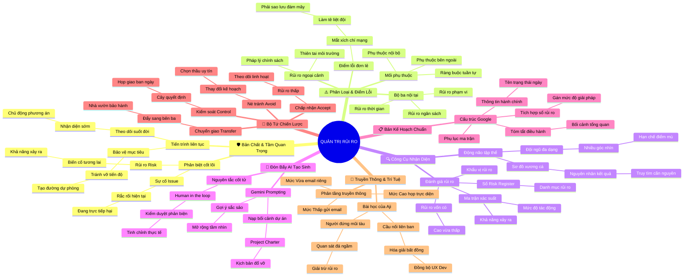

# 🧠 BẢN ĐỒ TƯ DUY TINH GỌN (4-5 TẦNG): HỌC PHẦN 4 - QUẢN TRỊ RỦI RO HIỆU QUẢ

## 1. Sơ Đồ Tư Duy Trực Quan (Mermaid Mindmap Tinh Gọn)

---

## 2. Cây Phân Cấp Tri Thức Gợi Nhớ Nhanh 4-5 Tầng (Active Recall Hierarchy)

- 📌 **Bản Chất & Tầm Quan Trọng (Risk vs. Issue)**
  - 🔹 *Phân biệt rạch ròi:* ➔ *Risk là giả định tương lai* ➔ *Issue là sự cố hiện tại* ➔ *Tiên liệu trước để không bị động*
  - 🔹 *Tiến trình liên tục:* ➔ *Theo dõi xuyên suốt vòng đời* ➔ *Tạo con đường chuyển hướng* ➔ *Bảo vệ tiêu chí thành công*
- 📌 **Phân Loại & Điểm Lỗi (Common Risks & SPOF)**
  - 🔹 *Bộ ba nội tại:* ➔ *Thời gian Time* ➔ *Ngân sách Budget* ➔ *Phạm vi Scope*
  - 🔹 *Điểm lỗi đơn lẻ SPOF:* ➔ *Sập máy chủ lưu trữ* ➔ *Cả nhóm bị đóng băng* ➔ *Thiết lập sao lưu đám mây Cloud*
  - 🔹 *Mối phụ thuộc Dependencies:* ➔ *Nội bộ thiết kế xong mới code* ➔ *Bên ngoài thời tiết hạn hán* ➔ *Quản trị mắt xích*
- 📌 **Công Cụ Nhận Diện (Identification Tools)**
  - 🔹 *Động não đa chức năng:* ➔ *Nhóm nhân sự đa dạng* ➔ *Sơ đồ xương cá Ishikawa* ➔ *Lần ngược tìm nguyên nhân gốc*
  - 🔹 *Ma trận Xác suất - Tác động:* ➔ *Probability & Impact* ➔ *Inherent Risk Rating* ➔ *Xếp hạng Cao Vừa Thấp*
- 📌 **Đòn Bẩy AI Tạo Sinh (GenAI for Risk Identification)**
  - 🔹 *Prompting trên Gemini:* ➔ *Nạp bối cảnh Project Charter* ➔ *Thách thức kịch bản đổ vỡ* ➔ *Mở rộng danh mục rủi ro*
  - 🔹 *Human-in-the-loop:* ➔ *Con người kiểm duyệt* ➔ *Loại bỏ ý chung chung* ➔ *Động não phương án giảm thiểu*
- 📌 **Kế Hoạch Quản Trị Rủi Ro (Risk Management Plan)**
  - 🔹 *Cấu trúc tài liệu sống Google:* ➔ *Header hành chính & Status* ➔ *Executive Summary* ➔ *Tích hợp Risk Register*
- 📌 **Bộ Tứ Chiến Lược Giảm Thiểu (4 Mitigation Strategies)**
  - 🔹 *Né tránh Avoid:* ➔ *Đổi nhà thầu hay trễ hạn* ➔ *Triệt tiêu mầm mống* ➔ *Kế hoạch an toàn*
  - 🔹 *Chấp nhận Accept:* ➔ *Chấp nhận chậm chậu cây 2 ngày* ➔ *Đỡ tốn 2 tuần tìm thầu mới* ➔ *Linh hoạt thực tế*
  - 🔹 *Kiểm soát Control:* ➔ *Dùng Cây quyết định* ➔ *Họp giao ban hàng ngày* ➔ *Giám sát sát sườn*
  - 🔹 *Chuyển giao Transfer:* ➔ *Thuê ngoài nhà vườn chuyên nghiệp* ➔ *Bảo hành cây 100%* ➔ *Không mất tiền túi*
- 📌 **Truyền Thông & Trí Tuệ Aji (Communication & Aji Story)**
  - 🔹 *Phân tầng kênh giao tiếp:* ➔ *Thấp qua email tuần* ➔ *Vừa qua email Urgent* ➔ *Cao họp trực tiếp bảo vệ niềm tin*
  - 🔹 *Người đứng mũi tàu Aji:* ➔ *Quan sát đá ngầm phía trước* ➔ *Giải trừ rủi ro De-risk* ➔ *Hóa giải lệch pha UX vs Dev*

---

## 3. Bảng Neo Trí Nhớ Từ Khóa Vàng (Memory Anchor Cheat Sheet)

| Từ Khóa Cốt Lõi | Phần Trong Tài Liệu | Bản Chất / Vai Trò (3-5 từ) | Tín Hiệu Gợi Nhớ (Memory Trigger) |
| :--- | :--- | :--- | :--- |
| **Risk vs. Issue** | Phần I: Bản Chất | Bất định tương lai vs sự cố | Dự báo thời tiết vs cơn mưa rào |
| **SPOF** | Phần II: Điểm Lỗi | Mắt xích chí mạng chết người | Một mắt xích đứt làm tuột cả xích xe |
| **Dependencies** | Phần II: Phụ Thuộc | Ràng buộc trước sau công việc | Cây cầu nối liền hai bờ sông |
| **Ishikawa Diagram** | Phần III: Công Cụ | Sơ đồ xương cá truy nguyên nhân | Bộ xương cá với các nhánh gai |
| **Probability & Impact** | Phần III: Ma Trận | Đo lường xác suất và tác động | Chiếc lưới lọc bắt rủi ro lớn |
| **Inherent Risk** | Phần III: Rủi Ro Vốn Có | Mức nghiêm trọng nguyên bản | Độ độc của một loài nấm rừng |
| **Risk Appetite** | Phần III: Khẩu Vị | Mức chấp nhận rủi ro tổ chức | Chiếc dạ dày chịu được đồ cay nóng |
| **GenAI Prompting** | Phần IV: AI Rủi Ro | Đòn bẩy AI tìm bãi mìn | Kính soi đêm hồng ngoại phát hiện mìn |
| **Human-in-the-loop** | Phần IV: AI Rủi Ro | Con người kiểm duyệt cuối cùng | Người gác cổng thẩm định tài liệu |
| **Risk Register** | Phần V: Kế Hoạch | Sổ đăng ký danh mục rủi ro | Cuốn sổ y bạ theo dõi bệnh án |
| **Risk Mitigation** | Phần VI: Chiến Lược | 4 giải pháp hóa giải hiểm họa | Tấm khiên chắn tên và gươm đao |
| **Decision Tree** | Phần VI: Chiến Lược | Cây quyết định phân tích lan tỏa | Nhánh cây rẽ lối ngã ba đường |
| **Tiered Communication** | Phần VII: Truyền Thông | Phân tầng thông báo theo cấp độ | Đèn tín hiệu giao thông Xanh Vàng Đỏ |
| **De-risking** | Phần VII: Aji Story | Giải trừ rủi ro từ sớm | Thuyền trưởng đứng mũi tàu quét đá ngầm |
