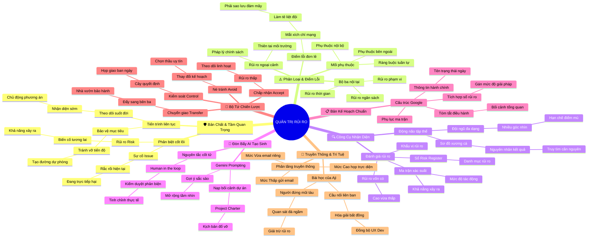

# Tóm Tắt Chương 4: Quản Trị Rủi Ro Hiệu Quả (Managing Risks Effectively)

## 1. Thông điệp cốt lõi (Core Message)
> Quản trị rủi ro không phải là hành vi né tránh thực tại một cách sợ hãi mà là tư duy của người thuyền trưởng đứng nơi mũi tàu vượt đại dương: chủ động phân biệt giữa Rủi ro tiềm ẩn (Risk) và Sự cố hiện hữu (Issue), triệt tiêu các Điểm lỗi đơn lẻ (Single Point of Failure), vận dụng Ma trận Xác suất - Tác động kết hợp đòn bẩy AI để biến bất định thành 4 chiến lược tác chiến sắc bén (Né tránh, Chấp nhận, Kiểm soát, Chuyển giao).

---

## 2. Lược Đồ Phân Bổ Cấu Trúc Tài Liệu (Content Distribution Overview)

| Phần / Đề Mục Tài Liệu Gốc | Nội Dung Trọng Tâm | Số Luận Điểm Đại Diện |
| :--- | :--- | :---: |
| **Phần I: Bản Chất & Tầm Quan Trọng Của Quản Trị Rủi Ro** *(Importance of Risk Management)* | Phân biệt sống còn giữa Risk (tương lai) vs Issue (hiện tại), quản trị rủi ro là tiến trình liên tục, bảo vệ dự án khỏi bờ vực đổ vỡ. | 2 Luận điểm |
| **Phần II: Các Loại Rủi Ro Kinh Điển & Điểm Lỗi Đơn Lẻ** *(Common Risks & Single Point of Failure)* | Bộ ba rủi ro nội tại (Thời gian, Ngân sách, Phạm vi), rủi ro ngoại cảnh, mối nguy điểm lỗi đơn lẻ (SPOF) và mạng lưới phụ thuộc. | 2 Luận điểm |
| **Phần III: Công Cụ Nhận Diện & Ma Trận Xác Suất - Tác Động** *(Risk Identification Tools & Probability Matrix)* | Động não với đội ngũ đa dạng, sơ đồ xương cá Ishikawa, sổ đăng ký Risk Register, đo lường Rủi ro vốn có và Khẩu vị rủi ro. | 2 Luận điểm |
| **Phần IV: Đòn Bẩy AI Tạo Sinh (GenAI) Trong Dự Báo Rủi Ro** *(GenAI Risk Identification: Gemini Prompts)* | Kỹ thuật Prompt Engineering trên Gemini để phát hiện các bãi mìn tiềm ẩn, nguyên tắc Human-in-the-loop và đối thoại kịch bản xấu. | 2 Luận điểm |
| **Phần V: Xây Dựng Bản Kế Hoạch Quản Trị Rủi Ro Chuẩn Mực** *(Risk Management Plan Documentation)* | Cấu trúc tài liệu sống chuẩn Google: Thông tin hành chính, Tóm tắt điều hành, tích hợp Sổ đăng ký rủi ro và Phụ lục ma trận. | 1 Luận điểm |
| **Phần VI: Bộ Tứ Chiến Lược Giảm Thiểu Rủi Ro** *(Risk Mitigation Strategies: Avoid, Accept, Control, Transfer)* | Bản chất 4 chiến lược: Né tránh (Avoid), Chấp nhận (Accept), Giảm thiểu/Kiểm soát (Reduce/Control) với Cây quyết định, và Chuyển giao (Transfer). | 2 Luận điểm |
| **Phần VII: Nghệ Thuật Truyền Thông & Bài Học Của Aji Tại Google** *(Communicating Risks & Aji's Wisdom)* | Phân tầng kênh giao tiếp theo mức độ rủi ro (Email vs Họp trực diện); Aji: Người đứng mũi tàu giải trừ rủi ro (De-risk) và hóa giải xung đột UX vs Dev. | 2 Luận điểm |
| **Tổng cộng** | **Bao quát 100% cấu trúc 7 mảng nội dung tài liệu gốc** | **13 Luận điểm** |

---

## 3. Luận điểm quan trọng theo cấu trúc tài liệu (Key Takeaways: 13 Luận Điểm Chuyên Sâu)

### 📑 PHẦN I: BẢN CHẤT & TẦM QUAN TRỌNG CỦA QUẢN TRỊ RỦI RO

1. **PHÂN BIỆT RẠCH RÒI GIỮA RỦI RO (RISK) VÀ VẤN ĐỀ PHÁT SINH (ISSUE)**
   - **Bản chất & Phân tích chuyên sâu:** Rủi ro (Risk) là một sự kiện bất định có tiềm năng xảy ra trong tương lai (câu hỏi giả định "Điều gì sẽ xảy ra nếu?"). Khi một rủi ro thực sự xảy ra ngoài đời thực, nó chính thức chuyển hóa thành một Vấn đề phát sinh (Issue)—một sự cố hiện hữu đang trực tiếp gây đau đầu và đe dọa dự án ngay trong hiện tại. Quản trị rủi ro là chủ động chuẩn bị kế hoạch ứng phó từ trước để rủi ro không có cơ hội biến thành sự cố tàn phá.
   - **Phương pháp / Công cụ / Quy trình đi kèm:** Khung phân biệt rủi ro vs sự cố (Risk vs. Issue Protocol), Kế hoạch hành động giảm thiểu (Mitigation Plan).
   - **Ví dụ thực tế đời thường:** Khả năng ngày mai trời mưa to trong buổi tiệc ngoài trời là Rủi ro (Risk); khi mây đen kéo đến và cơn mưa trút nước làm ướt sũng bàn ghế thì đó đã biến thành Sự cố (Issue).

2. **QUẢN TRỊ RỦI RO LÀ TIẾN TRÌNH HỆ THỐNG LIÊN TỤC, KHÔNG PHẢI BÀI TẬP LÀM MỘT LẦN**
   - **Bản chất & Phân tích chuyên sâu:** Quản trị rủi ro không thể làm xong trong giai đoạn lập kế hoạch rồi bỏ xó. Đó là một hoạt động tác nghiệp xuyên suốt vòng đời dự án. Việc liên tục theo dõi rủi ro giúp PM nắm rõ kế hoạch của mình đang linh hoạt hay cứng nhắc đến mức nào, tạo ra các con đường chuyển hướng thay thế (contingency paths) để bảo vệ các tiêu chí thành công cốt lõi ngay cả khi kế hoạch ban đầu bị đổ vỡ.
   - **Phương pháp / Công cụ / Quy trình đi kèm:** Vòng lặp quản trị rủi ro liên tục (Continuous Risk Management Cycle), Kế hoạch chuyển hướng dự phòng (Contingency Rerouting).
   - **Ví dụ thực tế đời thường:** Dự án làm báo cáo thị trường: Nếu chuyên viên phân tích dữ liệu nòng cốt bất ngờ xin nghỉ việc giữa chừng, PM có sẵn hồ sơ của một đối tác phân tích dữ liệu thuê ngoài độc lập để bàn giao việc ngay trong 24 giờ mà không bị vỡ hạn xuất bản.

---

### 📑 PHẦN II: CÁC LOẠI RỦI RO KINH ĐIỂN & ĐIỂM LỖI ĐƠN LẺ

3. **TAM GIÁC RỦI RO NỘI TẠI VÀ CÁC BIẾN SỐ NGOẠI CẢNH (EXTERNAL RISKS)**
   - **Bản chất & Phân tích chuyên sâu:** Dự án chịu sự đe dọa từ 3 nhóm rủi ro nội tại kinh điển: (1) Rủi ro thời gian (Time Risks) làm chậm trễ dây chuyền; (2) Rủi ro ngân sách (Budget Risks) dẫn tới cạn kiệt dòng tiền và bội chi; (3) Rủi ro phạm vi (Scope Risks) khiến sản phẩm đầu ra không được khách hàng nghiệm thu. Bên cạnh đó là Rủi ro ngoại cảnh (External Risks) nằm ngoài tầm kiểm soát trực tiếp như thiên tai bão lũ, biến động chuỗi cung ứng toàn cầu hay sự thay đổi đột ngột của luật pháp chính phủ.
   - **Phương pháp / Công cụ / Quy trình đi kèm:** Phân loại rủi ro (Risk Breakdown Structure - RBS), Rà soát rủi ro ngoại cảnh (PESTLE Analysis).
   - **Ví dụ thực tế đời thường:** Dự án Plant Pals tại Office Green: Trang web không kịp hoàn thiện là Rủi ro thời gian; giá cây cảnh nhập khẩu tăng vọt là Rủi ro ngân sách; trang trại nhà vườn bị hạn hán bất thường làm chết cây là Rủi ro ngoại cảnh.

4. **NHẬN DIỆN VÀ TRIỆT TIÊU ĐIỂM LỖI ĐƠN LẺ (SINGLE POINT OF FAILURE - SPOF)**
   - **Bản chất & Phân tích chuyên sâu:** Điểm lỗi đơn lẻ (SPOF) là một mắt xích hiểm yếu duy nhất trong hệ thống mà nếu nó gặp sự cố, toàn bộ cỗ máy dự án sẽ bị tê liệt hoàn toàn ngay lập tức. Các mối quan hệ phụ thuộc công việc (Dependencies)—đặc biệt là mối phụ thuộc tuần tự Finish-to-Start—chính là nơi tiềm ẩn các điểm lỗi đơn lẻ. Trách nhiệm của PM là thiết kế cấu trúc dự phòng kép (Redundancy) để xóa bỏ hoàn toàn các điểm lỗi chí mạng này.
   - **Phương pháp / Công cụ / Quy trình đi kèm:** Phân tích điểm lỗi đơn lẻ (SPOF Analysis), Thiết kế hệ thống dự phòng kép (System Redundancy), Quản lý mối phụ thuộc nội bộ vs bên ngoài (Dependencies Management).
   - **Ví dụ thực tế đời thường:** Dự án lưu trữ toàn bộ dữ liệu trên một máy chủ nội bộ duy nhất tại văn phòng: Nếu mất điện hoặc cháy máy chủ, cả công ty ngồi chơi xơi nước. PM triệt tiêu SPOF bằng cách đồng bộ dữ liệu tự động lên dịch vụ đám mây (Cloud Backup).

---

### 📑 PHẦN III: CÔNG CỤ NHẬN DIỆN & MA TRẬN XÁC SUẤT - TÁC ĐỘNG

5. **ĐỘNG NÃO ĐA DẠNG VÀ SƠ ĐỒ XƯƠNG CÁ ISHIKAWA ĐÀO SÂU NGUYÊN NHÂN GỐC RỄ**
   - **Bản chất & Phân tích chuyên sâu:** Nhận diện rủi ro một mình sẽ dẫn tới vô số điểm mù. PM phải triệu tập một đội ngũ đa dạng (nhân sự kỳ cựu lẫn nhân sự mới, kỹ thuật lẫn kinh doanh) dựa trên ma trận RACI để thực hiện phiên động não (Brainstorming). Vận dụng Biểu đồ nguyên nhân - kết quả (Cause-and-Effect / Fishbone / Ishikawa) giúp lần ngược từ một rủi ro tiềm tàng ở đầu cá về các nhánh xương để khoanh vùng chính xác các nhóm nguyên nhân sâu xa.
   - **Phương pháp / Công cụ / Quy trình đi kèm:** Phiên động não rủi ro có cấu trúc (Structured Brainstorming), Sơ đồ xương cá Ishikawa (Fishbone Diagram).
   - **Ví dụ thực tế đời thường:** Rủi ro "Nhà cung cấp giao cây trễ hạn": Sơ đồ xương cá bóc tách 4 nhánh nguyên nhân gồm: Quy trình đặt hàng chậm trễ, Nhân viên phụ trách xin nghỉ phép, Xe tải hỏng hóc, và Nhà vườn thiếu hàng tồn kho.

6. **MA TRẬN XÁC SUẤT - TÁC ĐỘNG VÀ ĐO LƯỜNG RỦI RO VỐN CÓ (INHERENT RISK)**
   - **Bản chất & Phân tích chuyên sâu:** Danh sách rủi ro sau khi động não thường rất dài; PM không thể dàn trải nguồn lực cho mọi thứ mà phải đưa vào Sổ đăng ký rủi ro (Risk Register) và đánh giá qua Ma trận Xác suất - Tác động (Probability and Impact Matrix). Sự kết hợp giữa Xác suất (Cao/Trung bình/Thấp) và Tác động (Cao/Trung bình/Thấp) xác định Mức xếp hạng Rủi ro vốn có (Inherent Risk Rating). Các rủi ro ở mức Trung bình và Cao là nhóm ưu tiên bắt buộc phải xây dựng kế hoạch ứng phó chi tiết theo Khẩu vị rủi ro (Risk Appetite) của tổ chức.
   - **Phương pháp / Công cụ / Quy trình đi kèm:** Sổ đăng ký rủi ro (Risk Register), Ma trận Xác suất và Tác động (Probability and Impact Matrix), Đánh giá rủi ro vốn có (Inherent Risk Assessment), Khẩu vị rủi ro (Risk Appetite Guidelines).
   - **Ví dụ thực tế đời thường:** Rủi ro website bị hacker tấn công (Xác suất Thấp nhưng Tác động Cực cao $\to$ Inherent Risk Cao $\to$ Bắt buộc mua gói bảo mật nhiều lớp); Rủi ro chậu cây bị trầy xước nhẹ (Xác suất Trung bình, Tác động Thấp $\to$ Inherent Risk Thấp $\to$ Chỉ cần theo dõi).

---

### 📑 PHẦN IV: ĐÒN BẨY AI TẠO SINH (GENAI) TRONG DỰ BÁO RỦI RO

7. **KHAI PHÓNG SỨC MẠNH GEMINI TRONG PHÁT HIỆN "BÃI MÌN" TIỀM ẨN**
   - **Bản chất & Phân tích chuyên sâu:** Bản điều lệ dự án (Project Charter) ban đầu thường chỉ liệt kê các rủi ro hiển nhiên. Trí tuệ nhân tạo tạo sinh (GenAI) như Gemini là một trợ lý đồng hành đắc lực giúp mở rộng tầm nhìn của PM. Bằng cách nạp đầy đủ bối cảnh dự án (Role - Task - Context - Constraints) và trực tiếp đặt câu hỏi thách thức: "Những điều gì có nguy cơ đổ vỡ hoặc đi chệch hướng trong dự án này?", AI sẽ phân tích dữ liệu và gợi ý hàng loạt kịch bản rủi ro sắc sảo mà con người dễ bỏ sót.
   - **Phương pháp / Công cụ / Quy trình đi kèm:** Kỹ thuật viết Prompt nhận diện rủi ro cho GenAI (Risk Prompt Engineering), Tải trực tiếp tài liệu Project Charter vào Gemini Advanced.
   - **Ví dụ thực tế đời thường:** Khi lập kế hoạch phát triển Dog Wellness App: Prompt cho Gemini liệt kê rủi ro $\to$ Gemini phát hiện ngay rủi ro pháp lý về việc ứng dụng đưa ra lời khuyên y tế sai lệch khiến thú cưng bị ngộ độc thực phẩm và phòng khám thú y đối tác có thể khởi kiện.

8. **NGUYÊN TẮC HUMAN-IN-THE-LOOP: PHẢN BIỆN VÀ TINH CHỈNH ĐẦU RA CỦA AI**
   - **Bản chất & Phân tích chuyên sâu:** AI tạo sinh có tốc độ sản sinh văn bản cực nhanh nhưng không thể thay thế óc phán đoán nghề nghiệp của người quản lý. Các gợi ý của AI có thể chứa những điểm quá chung chung hoặc không khớp với thực tế nội bộ. PM phải đóng vai trò màng lọc kiểm duyệt cuối cùng (Human-in-the-loop): chọn lọc các rủi ro thực sự phù hợp, đào sâu thêm ngữ cảnh, và cùng AI động não các giải pháp giảm thiểu thích đáng.
   - **Phương pháp / Công cụ / Quy trình đi kèm:** Nguyên tắc con người kiểm duyệt (Human-in-the-loop Protocol), Quy trình hội thoại lặp tinh chỉnh rủi ro (Iterative Prompt Refinement).
   - **Ví dụ thực tế đời thường:** Gemini gợi ý 20 rủi ro cho ứng dụng chăm sóc chó: PM loại bỏ 8 rủi ro viển vông, giữ lại 12 rủi ro sát sườn và tiếp tục prompt yêu cầu Gemini: "Hãy gợi ý 3 phương án giảm thiểu rủi ro cho từng mục trên theo đúng ngân sách 50.000 USD".

---

### 📑 PHẦN V: XÂY DỰNG BẢN KẾ HOẠCH QUẢN TRỊ RỦI RO CHUẨN MỰC

9. **CẤU TRÚC TÀI LIỆU SỐNG CHUẨN MỰC TẠI GOOGLE**
   - **Bản chất & Phân tích chuyên sâu:** Một Kế hoạch quản trị rủi ro (Risk Management Plan) chuyên nghiệp theo chuẩn Google là một "tài liệu sống" được tổ chức khoa học: (1) Phần hành chính: Tên dự án, Tác giả biên soạn, Trạng thái (In Progress $\to$ Final), Ngày tạo và Ngày cập nhật gần nhất; (2) Mục tiêu tài liệu và Bản tóm tắt điều hành (Executive Summary); (3) Sổ đăng ký rủi ro tích hợp nêu rõ từng rủi ro, mức Inherent Risk và kế hoạch giảm thiểu cụ thể; (4) Phụ lục ma trận định lượng.
   - **Phương pháp / Công cụ / Quy trình đi kèm:** Mẫu kế hoạch quản trị rủi ro chuẩn Google (Google Standard Risk Management Plan Template), Kiểm soát phiên bản tài liệu (Document Versioning & Status).
   - **Ví dụ thực tế đời thường:** Bản kế hoạch quản trị rủi ro dự án Plant Pals: Ghi rõ tác giả là Rowena, trạng thái Final ngày 15/10, tóm tắt điều hành khẳng định dự án cam kết giao cây xanh cho 100 khách hàng văn phòng và đính kèm bảng giải pháp họp giao ban hàng ngày với nhà vườn.

---

### 📑 PHẦN VI: BỘ TỨ CHIẾN LƯỢC GIẢM THIỂU RỦI RO

10. **LỰA CHỌN GIỮA NÉ TRÁNH (AVOID) VÀ CHẤP NHẬN (ACCEPT)**
    - **Bản chất & Phân tích chuyên sâu:** Khi đối mặt với rủi ro, PM không được hành động theo cảm tính mà lựa chọn một trong 4 chiến lược: (1) Né tránh (Avoid) loại bỏ hoàn toàn nguyên nhân gây rủi ro bằng cách thay đổi kế hoạch (chẳng hạn không thuê nhà thầu phụ hay trễ hẹn); (2) Chấp nhận (Accept) chủ động đón nhận rủi ro khi xác suất và tác động đều Thấp, hoặc khi chi phí để ngăn ngừa nó còn tốn kém hơn nhiều so với việc chấp nhận sự chậm trễ nhỏ.
    - **Phương pháp / Công cụ / Quy trình đi kèm:** Chiến lược Né tránh rủi ro (Risk Avoidance), Chiến lược Chấp nhận rủi ro chủ động (Active Risk Acceptance).
    - **Ví dụ thực tế đời thường:** Nhà cung cấp báo loại chậu men trắng đang hết hàng, nhập về trễ 2 ngày: PM quyết định Chấp nhận (Accept) chậm 2 ngày thay vì hủy hợp đồng và mất 2 tuần tìm nhà cung cấp mới; nhưng nếu nhà cung cấp có tiếng lừa đảo, PM dứt khoát Né tránh (Avoid) bằng việc chọn đối tác khác.

11. **KIỂM SOÁT BẰNG CÂY QUYẾT ĐỊNH (REDUCE/CONTROL) VÀ CHUYỂN GIAO (TRANSFER)**
    - **Bản chất & Phân tích chuyên sâu:** (3) Giảm thiểu hoặc kiểm soát (Reduce or Control) áp dụng các biện pháp chủ động để hạ thấp xác suất hoặc mức độ thiệt hại của rủi ro, sử dụng Cây quyết định (Decision Tree) để nhìn thấy tác động lan tỏa; (4) Chuyển giao (Transfer) đẩy rủi ro sang cho bên thứ ba gánh vác (mua bảo hiểm hàng hóa, ký hợp đồng thuê ngoài với điều khoản phạt vi phạm, thuê nhà vườn chuyên nghiệp tự chịu rủi ro sâu bệnh).
    - **Phương pháp / Công cụ / Quy trình đi kèm:** Cây quyết định giảm thiểu rủi ro (Decision Tree Flowchart), Chiến lược Chuyển giao rủi ro (Risk Transference Mechanisms: Insurance, Outsourcing, Warranties).
    - **Ví dụ thực tế đời thường:** Trồng cây xanh cho văn phòng: Tự ươm cây tại công ty thì rủi ro chết cây do sâu bệnh rất cao $\to$ PM Chuyển giao (Transfer) bằng cách thuê trọn gói nhà vườn chịu trách nhiệm bảo hành cây sống 100%, cây nào héo nhà vườn phải tự đổi cây mới.

---

### 📑 PHẦN VII: NGHỆ THUẬT TRUYỀN THÔNG & BÀI HỌC CỦA AJI TẠI GOOGLE

12. **PHÂN TẦNG TRUYỀN THÔNG VỀ RỦI RO THEO CẤP ĐỘ NGHIÊM TRỌNG**
    - **Bản chất & Phân tích chuyên sâu:** Giấu nhẹm rủi ro là con đường ngắn nhất dẫn đến việc đánh mất niềm tin của các bên liên quan. Truyền thông về rủi ro phải được phân tầng minh bạch: Rủi ro cấp độ Thấp gửi qua email cập nhật định kỳ; Rủi ro cấp độ Trung bình trao đổi qua email riêng có đính kèm kế hoạch giảm thiểu và gắn nhãn "Khẩn cấp" (Urgent); Rủi ro cấp độ Cao bắt buộc phải đưa thành mục riêng trong chương trình nghị sự của cuộc họp trực tiếp để xin ý kiến và huy động thêm nguồn lực hỗ trợ từ ban lãnh đạo.
    - **Phương pháp / Công cụ / Quy trình đi kèm:** Chiến lược truyền thông rủi ro phân tầng (Tiered Risk Communication Protocol), Báo cáo tình trạng dự án minh bạch (Transparent Status Reporting).
    - **Ví dụ thực tế đời thường:** Khi dự án đối mặt rủi ro trễ tiến độ 2 tuần vì thiếu lập trình viên cao cấp: PM không gửi email chung chung mà đặt lịch họp khẩn với Giám đốc Sản phẩm, trình bày rõ ma trận rủi ro và xin phê duyệt ngân sách điều động thêm 1 kỹ sư từ chi nhánh khác hỗ trợ.

13. **VAI TRÒ NGƯỜI ĐỨNG NƠI MŨI TÀU VÀ GIẢI TRỪ RỦI RO (DE-RISK): BÀI HỌC CỦA AJI**
    - **Bản chất & Phân tích chuyên sâu:** Aji (Senior Program Manager tại Google) ví von PM như người đứng nơi mũi tàu vượt đại dương quan sát chân trời để đảm bảo con tàu không đâm phải đá ngầm. Các dự án lớn luôn có mối phụ thuộc chằng chịt, không bao giờ là một ốc đảo cô lập. Nhiệm vụ của PM là giải trừ rủi ro (De-risk) bằng cách lùi lại một bước, đào sâu các điểm mù giữa các phòng ban. Khi nhận thấy sự mơ hồ trong việc đối chiếu giữa bản thiết kế giao diện (UX Mocks) và thực tế lập trình, Aji lập tức triệu tập họp chung để phát hiện và hóa giải xung đột ngầm ngay từ đầu trước khi quá muộn.
    - **Phương pháp / Công cụ / Quy trình đi kèm:** Triết lý giải trừ rủi ro (De-risking Philosophy), Cầu nối liên chức năng UX vs Engineering (Cross-functional Alignment), Văn hóa hợp tác tháo gỡ điểm nghẽn.
    - **Ví dụ thực tế đời thường:** Nhìn vào bản vẽ mô phỏng giao diện tuyệt đẹp của đội thiết kế: Aji nhận ra các kỹ sư backend chưa hề xây dựng API tương thích; cuộc họp 5 phút do Aji triệu tập đã giúp hai bên nhận ra độ lệch hướng và cùng nhau chỉnh lại thiết kế kỹ thuật, cứu dự án khỏi thảm họa đổ vỡ ngày bấm nút.

---

## 4. Kế hoạch hành động (Action Plan: 18 việc cụ thể)

#### Nhóm 1: Hành động ngay hôm nay (Micro-habits dưới 2 phút - 5 việc)
- [ ] **Hành động 1:** Rà soát lại công việc đang làm và tự hỏi: "Nếu việc này phát sinh sự cố, đây là Rủi ro tiềm ẩn (Risk) hay đã là Sự cố hiện hữu (Issue)?".
- [ ] **Hành động 2:** Kiểm tra xem hệ thống tài liệu dự án của bạn có điểm sao lưu dự phòng trên đám mây (Cloud Backup) để triệt tiêu điểm lỗi đơn lẻ (SPOF) chưa.
- [ ] **Hành động 3:** Gán ngay mức độ Xác suất (Cao/Vừa/Thấp) và Tác động (Cao/Vừa/Thấp) cho một mối lo lắng lớn nhất trong công việc hiện tại.
- [ ] **Hành động 4:** Thử nhập một prompt vào Gemini yêu cầu liệt kê 5 rủi ro tiềm ẩn cho dự án bạn đang phụ trách.
- [ ] **Hành động 5:** Lưu lại sơ đồ 4 chiến lược giảm thiểu rủi ro (Né tránh, Chấp nhận, Kiểm soát, Chuyển giao) vào sổ tay làm việc.

#### Nhóm 2: Kế hoạch rèn luyện trong tuần (Áp dụng vào công việc & đời sống - 7 việc)
- [ ] **Hành động 6:** Tổ chức một buổi họp động não nhận diện rủi ro với đội ngũ đa chức năng, sử dụng sơ đồ xương cá Ishikawa để tìm nguyên nhân gốc rễ.
- [ ] **Hành động 7:** Lập Sổ đăng ký rủi ro (Risk Register) hoàn chỉnh trên Google Sheets với các cột: Rủi ro, Xác suất, Tác động, Inherent Risk, Biện pháp giảm thiểu, Người phụ trách.
- [ ] **Hành động 8:** Xác định ít nhất 1 Điểm lỗi đơn lẻ (Single Point of Failure) trong quy trình vận hành hiện tại và xây dựng phương án dự phòng kép.
- [ ] **Hành động 9:** Vẽ một Cây quyết định (Decision Tree) để lựa chọn phương án giảm thiểu tối ưu cho một rủi ro cấp độ Cao.
- [ ] **Hành động 10:** Soạn thảo bản Kế hoạch quản trị rủi ro (Risk Management Plan) theo đúng biểu mẫu chuẩn Google gồm Tóm tắt điều hành và Sổ đăng ký rủi ro.
- [ ] **Hành động 11:** Thực hiện truyền thông rủi ro phân tầng: Gửi email cảnh báo rủi ro cấp Trung bình có gắn nhãn "Urgent" kèm phương án hành động cho bên liên quan.
- [ ] **Hành động 12:** Đặt lịch rà soát lại các mối phụ thuộc công việc (Dependencies) và kế hoạch nghỉ phép của các nhân sự chủ chốt trong tháng tới.

#### Nhóm 3: Thói quen duy trì & Chuyển hóa lâu dài (Phát triển bền vững - 6 việc)
- [ ] **Hành động 13:** Rèn luyện phản xạ "Người đứng mũi tàu quan sát đá ngầm" như Aji: Luôn nhìn xa trông rộng và chủ động giải trừ rủi ro (De-risk) từ sớm.
- [ ] **Hành động 14:** Duy trì thói quen cập nhật Sổ đăng ký rủi ro định kỳ hàng tuần, không để tài liệu trở thành văn bản chết.
- [ ] **Hành động 15:** Xây dựng văn hóa an toàn tâm lý trong tổ chức, khuyến khích các thành viên chủ động báo cáo rủi ro tiềm ẩn mà không sợ bị phán xét.
- [ ] **Hành động 16:** Khảo sát và xác lập Khẩu vị rủi ro (Risk Appetite) rõ ràng với ban lãnh đạo cho từng loại hình dự án.
- [ ] **Hành động 17:** Tận dụng tối đa trí tuệ nhân tạo tạo sinh (GenAI) như một đối tác phản biện rủi ro thường trực trong mọi khâu lập kế hoạch.
- [ ] **Hành động 18:** Thiết lập các hợp đồng chuyển giao rủi ro (Transfer) thông qua bảo hiểm và điều khoản bảo hành dịch vụ chặt chẽ với các nhà thầu bên ngoài.

---

## 5. Câu hỏi tự ngẫm (Reflection: 24 câu hỏi sâu sắc)

#### Nhóm 1: Tự vấn Nhận thức & Hệ tư duy (Self-Awareness & Mindset: 6 câu)
1. Tôi có đang điều hành công việc với tâm lý chủ quan, cho rằng mọi việc sẽ suôn sẻ 100% đúng như kế hoạch trên giấy không?
2. Khi một sự cố bất ngờ nổ ra, phản xạ đầu tiên của tôi là giữ bình tĩnh tìm nguyên nhân gốc rễ hay rơi vào hoảng loạn và đổ lỗi?
3. Tôi có đang phân biệt rạch ròi giữa việc "lo lắng mơ hồ" với việc "quản trị rủi ro có hệ thống bằng công cụ" không?
4. Trực giác của tôi có đủ nhạy bén để nhận ra một rủi ro tiềm ẩn ngay cả khi các báo cáo số liệu bề mặt vẫn đang hiển thị màu xanh an toàn?
5. Tôi có thực sự coi việc lường trước các kịch bản tồi tệ nhất là một biểu hiện của sự dũng cảm và trách nhiệm nghề nghiệp không?
6. Bản thân tôi có phong cách quản lý chấp nhận rủi ro cao hay thuộc tuýp người thận trọng né tránh rủi ro?

#### Nhóm 2: Nhận diện Thói quen & Điểm mù (Habits & Blind Spots: 6 câu)
7. Đâu là những Điểm lỗi đơn lẻ (SPOF) về mặt con người, công nghệ hoặc nhà cung cấp trong dự án của tôi mà tôi chưa có phương án thay thế?
8. Tôi có thói quen giấu nhẹm các rủi ro cấp cao vì sợ làm phật lòng sếp hoặc khách hàng không?
9. Tôi có mời đầy đủ các nhân sự mới và nhân sự trái ngành tham gia phiên động não rủi ro để tận dụng góc nhìn đa dạng của họ chưa?
10. Sổ đăng ký rủi ro của tôi có đang được cập nhật định kỳ không hay chỉ được viết một lần lúc khởi động rồi bỏ xó?
11. Tôi có đang quá lạm dụng chiến lược "Chấp nhận rủi ro" (Accept) chỉ vì sự lười biếng không muốn lập phương án ứng phó không?
12. Có mối phụ thuộc công việc (Dependency) nào với phòng ban khác mà tôi chưa hề xác nhận lịch trình chính thức với họ không?

#### Nhóm 3: Ứng dụng Thực tế & Giải quyết Vấn đề (Practical Application & Problem Solving: 6 câu)
13. Nếu một rủi ro có tác động tàn phá cao nhưng xác suất xảy ra chỉ 5%, tôi sẽ thuyết phục ban giám đốc đầu tư chi phí giảm thiểu ra sao?
14. Làm thế nào để vận dụng sơ đồ xương cá Ishikawa để tìm ra nguyên nhân sâu xa của hiện tượng trễ tiến độ bàn giao thường xuyên trong nhóm?
15. Tôi có thể cấu trúc một prompt trên Gemini như thế nào để bóc tách toàn bộ rủi ro chuỗi cung ứng của một sản phẩm mới trong 1 phút?
16. Khi phát hiện hai đội ngũ thiết kế và lập trình đang hiểu sai lệch về sản phẩm như câu chuyện của Aji, tôi sẽ hành động cụ thể ra sao trong 24 giờ đầu?
17. Bằng cách nào tôi có thể xây dựng một Cây quyết định (Decision Tree) thuyết phục khách hàng chấp nhận chuyển giao rủi ro cho nhà thầu phụ?
18. Tôi sẽ truyền thông ra sao với ban lãnh đạo khi một rủi ro tiềm tàng chính thức biến thành sự cố (Issue) làm trễ hạn chót 1 tuần?

#### Nhóm 4: Bứt phá Giới hạn & Chuyển hóa Tương lai (Breakthrough & Transformation: 6 câu)
19. Làm thế nào để năng lực "Giải trừ rủi ro" (De-risking) trở thành thương hiệu cá nhân xuất sắc nhất khẳng định vị thế Senior PM của tôi?
20. Nếu phải dẫn dắt một dự án trị giá hàng chục triệu đô la với hàng ngàn biến số, hệ thống quản trị rủi ro của tôi cần được nâng cấp ra sao?
21. Bằng cách nào tôi có thể biến công tác quản trị rủi ro từ một quy trình kiểm soát khô khan thành một nét văn hóa đồng đội gắn kết và thấu cảm?
22. Tôi sẽ kết hợp sức mạnh phân tích dự đoán của AI và trực giác kinh nghiệm của con người như thế nào để đi trước thời đại trong việc đón đầu rủi ro?
23. Làm sao để một tổ chức có thể học hỏi và chuyển hóa triệt để từ những thất bại và sự cố trong quá khứ thành tài sản cạnh tranh vô giá?
24. Một năm nữa nhìn lại, phong cách lãnh đạo của tôi sẽ vững chãi và bản lĩnh ra sao khi tôi luôn làm chủ mọi giông bão trên hải trình sự nghiệp?

---

## 6. Bản Đồ Tư Duy Trực Quan (Visual Mindmap Overview - Tinh Gọn 4-5 Tầng)

