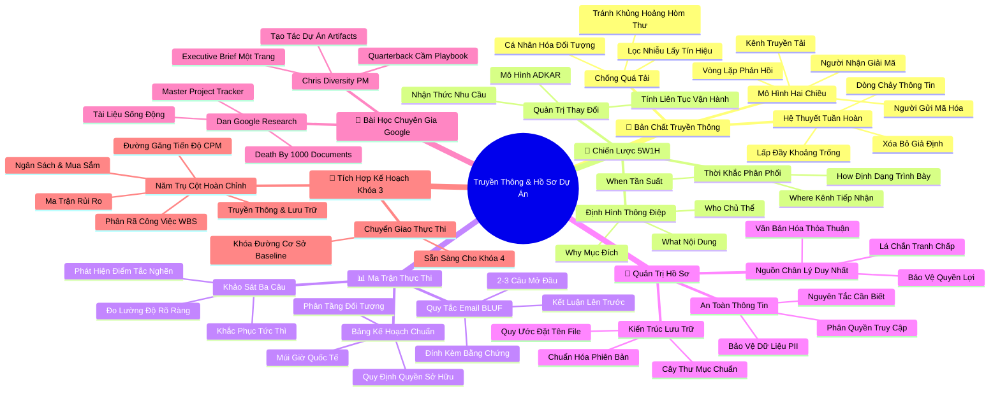

# Bản Đồ Tư Duy Chuyên Sâu: Tổ Chức Truyền Thông Và Hồ Sơ Dự Án
*(Organizing Communication and Documentation — Mindmap System)*

---

## 1. HỆ THỐNG MERMAID MINDMAP (4–5 CẤP ĐỘ)

---

## 2. CÂY PHÂN RÃ HỌC TẬP CHỦ ĐỘNG (ACTIVE RECALL HIERARCHY)

- **TRUYỀN THÔNG & HỒ SƠ DỰ ÁN (COMMUNICATION & DOCUMENTATION)**
  - 📡 **Bản chất truyền thông trong dự án**
    - ➔ *Hệ tuần hoàn huyết mạch*
      - ➔ Duy trì dòng chảy thông suốt giữa các bộ phận đa chức năng
      - ➔ Lấp đầy khoảng trống thông tin, ngăn chặn giả định sai lầm
      - ➔ Bài học Rowena: Hòa giải xung đột yêu cầu kỹ thuật và trải nghiệm người dùng
    - ➔ *Mô hình truyền thông hai chiều*
      - ➔ Người gửi mã hóa ➔ Kênh truyền tải ➔ Người nhận giải mã ➔ Vòng lặp phản hồi
      - ➔ Không có xác nhận phản hồi (Acknowledge) coi như chưa truyền thông
    - ➔ *Chữa lành vấn nạn quá tải thông tin (Information Overload)*
      - ➔ Chắt lọc tín hiệu (Signal) khỏi tạp âm (Noise)
      - ➔ Phân loại mức độ quan tâm của từng bên liên quan
      - ➔ Loại bỏ thói quen CC vô tội vạ
  - 🧭 **Chiến lược lập kế hoạch truyền thông (5W1H)**
    - ➔ *Bộ khung 5W1H định hướng*
      - ➔ What: Nội dung thông điệp (tiến độ, thay đổi, rào cản)
      - ➔ Why: Mục đích truyền tải (thông báo, phê duyệt, phối hợp)
      - ➔ Who: Đối tượng tiếp nhận và Người chịu trách nhiệm phát ngôn
      - ➔ When: Tần suất (hàng ngày, hàng tuần, hàng tháng, đột xuất)
      - ➔ Where: Kênh trao đổi (Email, Slack, Meeting, Dashboard)
      - ➔ How: Định dạng thể hiện (Slide, Spreadsheet, Báo cáo tóm tắt)
    - ➔ *Quản trị sự thay đổi (Change Management)*
      - ➔ Ứng dụng mô hình ADKAR làm dịu sự kháng cự tâm lý
      - ➔ Bảo đảm tính liên tục trong vận hành kinh doanh (Operational Continuity)
  - 📊 **Chi tiết hóa ma trận kế hoạch truyền thông**
    - ➔ *Bảng kế hoạch truyền thông thực chiến (Communication Plan Sheet)*
      - ➔ Cấu trúc 8 cột chuẩn mực
      - ➔ Phân tầng Stakeholders (Ban điều hành vs Nhóm cốt lõi)
      - ➔ Thiết lập quy định múi giờ cho đội ngũ làm việc từ xa
    - ➔ *Nghệ thuật Email công việc: Quy tắc BLUF (Bottom Line Up Front)*
      - ➔ Đưa yêu cầu hành động và kết luận lên 2-3 câu mở đầu
      - ➔ Nêu rõ thời hạn và hệ quả nếu không xử lý
      - ➔ Cung cấp dữ liệu chi tiết ở phần thân email
    - ➔ *Khảo sát tối ưu 3 câu hỏi (Pulse Survey)*
      - ➔ Đo lường độ rõ ràng của mục tiêu dự án
      - ➔ Phát hiện tình trạng tắc nghẽn thông tin hoặc kênh gây phiền hà
      - ➔ Cải tiến luồng truyền thông ngay trong chu kỳ tiếp theo
  - 📁 **Quản trị hệ thống tài liệu và hồ sơ dự án**
    - ➔ *Nguồn chân lý duy nhất (Single Source of Truth)*
      - ➔ Nguyên tắc: "Chưa ghi chép nghĩa là chưa xảy ra"
      - ➔ Lưu vết mọi thay đổi vào Nhật ký Thay đổi (Change Log)
      - ➔ Bảo vệ PM trước các tranh chấp phát sinh
    - ➔ *Bảo mật thông tin & Quyền truy cập*
      - ➔ Tuân thủ nghiêm ngặt Nguyên tắc Cần Biết (Need-to-Know Basis)
      - ➔ Thiết lập ma trận phân quyền (Viewer, Commenter, Editor)
      - ➔ Bảo vệ tuyệt đối Thông tin định danh cá nhân (PII)
    - ➔ *Kiến trúc lưu trữ khoa học*
      - ➔ Phân chia cây thư mục theo 5 giai đoạn dự án
      - ➔ Ban hành quy ước đặt tên file chuẩn ISO: `[DựÁn]_[Loại]_[PhiênBản]_[Ngày]`
  - 🌟 **Bài học thực chiến từ chuyên gia Google**
    - ➔ *Dan (Google Research): Chống lại "Death by a thousand documents"*
      - ➔ Ngăn chặn mê hồn trận các file rời rạc
      - ➔ Xây dựng Master Project Tracker / Master Document tập trung
      - ➔ Duy trì tài liệu sống (Living Document) tự động cập nhật
    - ➔ *Chris (Diversity PM at Google): Nghệ thuật tạo tác dự án (Artifacts)*
      - ➔ Hiện vật dự án là bằng chứng định lượng duy nhất về năng lực PM
      - ➔ Đóng vai trò Tiền vệ kiến thiết (Quarterback) cầm cuốn Playbook
      - ➔ Thiết kế Executive Brief 1 trang phục vụ ra quyết định và thăng tiến
  - 🎯 **Tích hợp toàn diện Khóa học 3: Lập kế hoạch dự án**
    - ➔ *Năm trụ cột ngũ hành của Lập kế hoạch*
      - ➔ Phân rã công việc (WBS & RACI)
      - ➔ Phương pháp Đường găng & Tiến độ (CPM & PERT)
      - ➔ Dự toán chi phí & Đấu thầu (Cost Baseline & Procurement)
      - ➔ Quản trị rủi ro & Ma trận giảm thiểu (Risk Register)
      - ➔ Kế hoạch truyền thông & Tài liệu hóa (Comm Plan & Master Hub)
    - ➔ *Khóa đường cơ sở (Baseline Lock) & Chuyển giao sang Thực thi (Khóa 4)*

---

## 3. BẢNG NEO KÝ THỨC (MEMORY ANCHOR CHEAT SHEET)

| Khái Niệm Cốt Lõi | Điểm Neo Trực Quan (Mental Anchor) | Câu Kích Hoạt Tư Duy (Trigger Prompt) | Ứng Dụng Thực Chiến Tức Thì |
| :--- | :--- | :--- | :--- |
| **Hệ tuần hoàn dự án** | Trái tim bơm máu đi khắp cơ thể | *"Thông tin đang chảy hay đang bị đông máu cục bộ?"* | Phát hiện và khai thông ngay các điểm nghẽn trao đổi giữa các phòng ban. |
| **Bộ lọc Signal-to-Noise** | Chiếc radio điều chỉnh đúng tần số | *"Email này mang lại tín hiệu giá trị hay chỉ là tạp âm?"* | Cắt giảm người nhận CC; cá nhân hóa báo cáo theo đúng quyền hạn đối tượng. |
| **Khung 5W1H** | Chiếc la bàn 6 hướng | *"Tôi đã trả lời đủ 6 câu hỏi trước khi bấm gửi chưa?"* | Xây dựng ma trận truyền thông 8 cột cho toàn bộ dự án trên Google Sheets. |
| **Quy tắc BLUF** | Viên đạn bắn thẳng hồng tâm | *"Kết luận và yêu cầu nằm ở dòng số mấy của email?"* | Viết kết luận, hạn chót và yêu cầu duyệt ngay tại 2-3 câu đầu tiên của email. |
| **Khảo sát 3 câu** | Nhiệt kế đo sức khỏe đội ngũ | *"Đội ngũ có thực sự hiểu điều tôi vừa truyền đạt không?"* | Gửi form khảo sát nhanh hàng tuần để kiểm tra luồng thông tin của nhóm. |
| **Single Source of Truth** | Cuốn kinh thánh mở giữa quảng trường | *"Nếu có tranh cãi, tài liệu nào sẽ là phán quyết tối cao?"* | Lưu toàn bộ quyết định, phạm vi, ngân sách vào kho tài liệu tập trung. |
| **Nguyên tắc Cần Biết** | Cánh cửa phòng két sắt ngân hàng | *"Ai thực sự cần xem dữ liệu này để làm việc?"* | Thu hồi các link chia sẻ công khai; khóa quyền truy cập dữ liệu PII và tài chính. |
| **Death by 1000 Docs** | Rừng rậm dây leo che khuất mặt trời | *"Một người mới mất bao lâu để tìm thấy tài liệu cần thiết?"* | Tạo Master Project Hub duy nhất tổng hợp tất cả link vệ tinh của dự án. |
| **Quarterback & Playbook** | Tiền vệ chỉ huy trên sân bóng bầu dục | *"Tôi đang chạy lung tung hay đang điều phối theo chiến thuật?"* | Sử dụng tài liệu làm vũ khí dẫn dắt nhóm và làm Portfolio năng lực cá nhân. |
| **Ngũ hành Lập kế hoạch** | Ngôi nhà 5 cột trụ vững chãi | *"Kế hoạch của tôi đã sẵn sàng chịu bão thực thi chưa?"* | Tích hợp WBS, Tiến độ, Ngân sách, Rủi ro, Truyền thông thành bộ IPMP hoàn chỉnh. |
