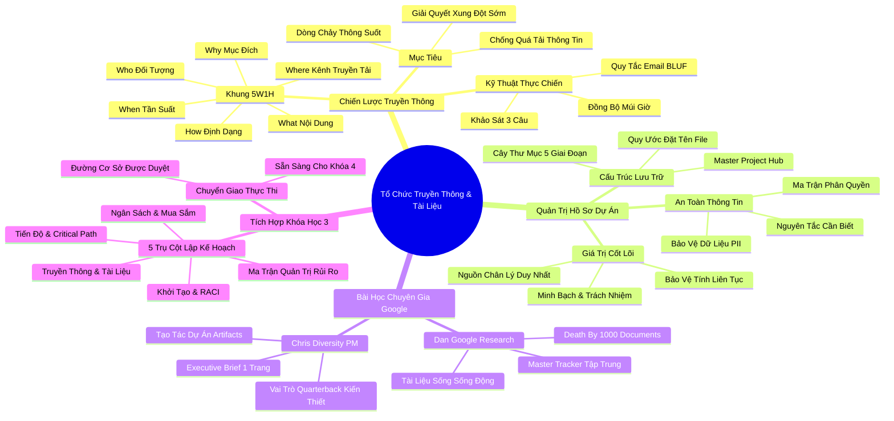

# Tóm Tắt Chuyên Sâu: Tổ Chức Truyền Thông Và Hồ Sơ Dự Án
*(Organizing Communication and Documentation — Google Project Management)*

---

## THÔNG ĐIỆP CỐT LÕI (CORE ESSENCE)

> **"Dự án không thất bại vì thiếu năng lực kỹ thuật, mà sụp đổ vì sự tắc nghẽn thông tin và sự phân mảnh của hồ sơ lưu trữ."**  
> Trong giai đoạn lập kế hoạch, người quản lý dự án (Project Manager - PM) nắm giữ vai trò như một "nhạc trưởng điều phối thông tin" và "người bảo vệ tri thức". Bằng cách kiến tạo một **Kế hoạch Truyền thông (Communication Plan)** sắc bén dựa trên 5W1H và thiết lập **Kho tài liệu tập trung (Centralized Documentation)** đóng vai trò là Nguồn Chân Lý Duy Nhất (Single Source of Truth), PM giúp mọi thành viên và các bên liên quan (Stakeholders) nắm bắt đúng thông điệp, đúng thời điểm, đúng kênh tiếp nhận. Qua đó, loại bỏ triệt để hiện tượng "chết chìm trong hàng ngàn văn bản" (Death by a thousand documents), bảo vệ thông tin định danh cá nhân (PII), và biến các hiện vật dự án (Artifacts) thành minh chứng năng lực quản trị chuyên nghiệp đỉnh cao.

---

## TỔNG QUAN PHÂN BỔ NỘI DUNG

| Phần | Nội Dung Cốt Lõi | Các Khái Niệm / Công Cụ Trọng Tâm | Giá Trị Thực Chiến |
| :--- | :--- | :--- | :--- |
| **Phần I** | **Tầm quan trọng của truyền thông trong dự án** | Dòng chảy thông tin, Rào cản truyền thông, Quá tải thông tin (Information Overload), Truyền thông 2 chiều | Giúp đội ngũ hiểu rõ kỳ vọng, giải quyết xung đột sớm và duy trì sự gắn kết bền vững. |
| **Phần II** | **Bắt đầu xây dựng kế hoạch truyền thông** | Khung 5W1H (What, Why, Who, When, Where, How), Quản trị sự thay đổi (Change Management), Tính liên tục vận hành | Định hình rõ mục tiêu chiến lược và luồng truyền tải trước khi chọn công cụ kỹ thuật. |
| **Phần III** | **Chi tiết hóa ma trận kế hoạch truyền thông** | Bảng ma trận truyền thông (Communication Matrix/Sheet), Phân tầng Stakeholder, Nguyên tắc email 2-3 câu, Múi giờ quốc tế | Tối ưu hóa tần suất và định dạng trao đổi, chống lạm phát cuộc họp và email rác. |
| **Phần IV** | **Giá trị của tài liệu và hồ sơ dự án** | Kho lưu trữ tập trung, Nhãn nhận diện, Tính minh bạch (Visibility), Quyền truy cập (Permissions), PII | Bảo vệ tính liên tục khi thay đổi nhân sự và ngăn ngừa rủi ro rò rỉ dữ liệu nhạy cảm. |
| **Phần V** | **Tổ chức và quản trị hệ thống tài liệu** | Cấu trúc thư mục chuẩn, Tài liệu trung tâm liên kết (Master Hub/Tracker), Dashboard tổng quan | Giúp bất kỳ ai tìm thấy tài liệu cần thiết chỉ trong vòng dưới 30 giây. |
| **Phần VI** | **Bài học thực tiễn từ Dan (Google Research)** | "Death by a thousand documents", Tài liệu sống (Living Document), Tinh gọn hóa liên kết | Chuyển đổi từ quản lý phân mảnh sang hệ thống điều phối tinh gọn và tự động hóa cập nhật. |
| **Phần VII** | **Bài học thực tiễn từ Chris (Diversity PM at Google)** | Tạo tác dự án (Artifacts), Executive Brief, Vai trò Quarterback cầm Playbook | Tận dụng tài liệu làm vũ khí thương lượng, xây dựng uy tín cá nhân và phục vụ thăng tiến. |
| **Phần VIII**| **Tổng kết toàn bộ Khóa học 3: Lập kế hoạch dự án** | Tích hợp toàn diện: Khởi tạo $\to$ Kế hoạch $\to$ Ngân sách $\to$ Rủi ro $\to$ Truyền thông | Hoàn thiện bức tranh lập kế hoạch, sẵn sàng chuyển giao sang Giai đoạn Thực thi (Khóa 4). |

---

## BÀI HỌC THEN CHỐT THEO TỪNG PHẦN (KEY TAKEAWAYS)

### PHẦN I: TẦM QUAN TRỌNG CỦA TRUYỀN THÔNG TRONG DỰ ÁN

#### 1. Truyền thông là hệ tuần hoàn huyết mạch của dự án
- **Phân tích bản chất & Tư duy cốt lõi**:
  - Truyền thông không chỉ đơn thuần là việc phát tán email hay triệu tập các cuộc họp, mà là nghệ thuật duy trì dòng chảy thông tin thông suốt giữa các bộ phận có chuyên môn và lợi ích khác nhau.
  - Khi thiếu truyền thông chủ động, các khoảng trống thông tin (Information Voids) sẽ tự động bị lấp đầy bởi các giả định sai lầm, tin đồn thất thiệt và sự bất an tâm lý của các bên liên quan.
  - Trường hợp của Rowena tại Google chứng minh: Khi một chuyên viên thiết kế UX cảm thấy quá tải và bị cô lập do các yêu cầu tính năng mâu thuẫn từ phía Kỹ thuật và Marketing, chính sự can thiệp truyền thông kịp thời của PM đã phân định lại ưu tiên và giải tỏa điểm nghẽn tinh thần.
- **Công cụ / Khung phương pháp / Công thức ứng dụng**:
  - *Mô hình Truyền thông 2 chiều (Two-Way Communication Model)*: Người gửi $\to$ Mã hóa $\to$ Kênh $\to$ Giải mã $\to$ Người nhận $\to$ **Phản hồi (Feedback Loop)**. Không có phản hồi xác nhận nghĩa là truyền thông chưa hoàn tất.
- **Ví dụ thực tiễn sinh động (Real-world Scenario)**:
  - Một kỹ sư phần mềm backend hiểu nhầm rằng tính năng thanh toán thẻ tín dụng không cần hỗ trợ mã OTP trong bản MVP do PM chỉ nói miệng trong hành lang. Hậu quả là trước ngày ra mắt 3 ngày, bộ phận Pháp chế (Legal & Compliance) chặn toàn bộ việc phát hành. Nếu PM có một ghi chú xác nhận bằng văn bản và cuộc đối thoại 2 chiều, lỗi lầm chết người này đã được ngăn chặn.

#### 2. Vấn nạn quá tải thông tin (Information Overload) và cách chữa lành
- **Phân tích bản chất & Tư duy cốt lõi**:
  - Gửi quá nhiều thông tin cũng độc hại không kém việc giấu giếm thông tin. Hiện tượng "Information Overload" khiến các Stakeholder quan trọng bỏ qua các cảnh báo khẩn cấp vì hòm thư bị nhấn chìm bởi các email CC vô nghĩa.
  - Phẩm chất của một PM xuất sắc thể hiện ở khả năng chắt lọc tín hiệu (Signal) khỏi tạp âm (Noise). Mỗi thông điệp gửi đi phải được cá nhân hóa theo mức độ quan tâm và quyền hạn của người nhận.
- **Công cụ / Khung phương pháp / Công thức ứng dụng**:
  - *Bộ lọc Tín hiệu Tinh gọn (Signal-to-Noise Ratio Filter)*: Chỉ gửi thông tin chi tiết kỹ thuật cho Core Team; chỉ gửi tóm tắt chỉ số tiến độ, chi phí và quyết định chiến lược cho Ban điều hành (Executive Sponsors).
- **Ví dụ thực tiễn sinh động (Real-world Scenario)**:
  - Thay vì CC Giám đốc Tài chính (CFO) vào 50 chuỗi email trao đổi về lỗi giao diện của app, PM chỉ gửi một bản tin tóm tắt 3 dòng hàng tuần: "Chi phí thực tế: Đang bám sát ngân sách (+1.5%); Rủi ro: Không có phát sinh vượt thẩm quyền; Cần phê duyệt: Hợp đồng mua bản quyền máy chủ trị giá 15.000 USD". CFO phản hồi duyệt ngay trong 5 phút.

---

### PHẦN II: BẮT ĐẦU XÂY DỰNG KẾ HOẠCH TRUYỀN THÔNG (5W1H)

#### 3. Khung 5W1H – La bàn định hướng chiến lược truyền thông
- **Phân tích bản chất & Tư duy cốt lõi**:
  - Kế hoạch truyền thông không thể xây dựng theo cảm tính. Nó phải là một văn bản có cấu trúc trả lời mạch lạc 6 câu hỏi:
    1. **Điều gì (What)**: Nội dung thông điệp là gì (tiến độ, rào cản, ngân sách, thay đổi phạm vi)?
    2. **Tại sao (Why)**: Mục đích truyền tải là gì (để thông báo, để xin phê duyệt, hay để phối hợp hành động)?
    3. **Ai (Who)**: Đối tượng tiếp nhận là ai và ai là người chịu trách nhiệm phát ngôn?
    4. **Khi nào (When)**: Tần suất gửi là khi nào (hàng ngày, hàng tuần, hàng tháng, hay đột xuất theo sự kiện)?
    5. **Ở đâu (Where)**: Kênh truyền thông nào là phù hợp nhất (Email, Slack/Teams, Bảng tính Google Sheets, Cuộc họp trực tiếp)?
    6. **Như thế nào (How)**: Định dạng trình bày ra sao (Báo cáo tổng quan Dashboard, Slide thuyết trình, Biên bản họp Minutes)?
- **Công cụ / Khung phương pháp / Công thức ứng dụng**:
  - *Khung 5W1H Communication Charter*: Ma trận liên kết trực tiếp giữa Mục tiêu truyền thông và Kênh phân phối.
- **Ví dụ thực tiễn sinh động (Real-world Scenario)**:
  - Khi dự án triển khai hệ thống ERP nội bộ gặp lỗi trễ hạn 2 tuần, nếu không có khung 5W1H, PM có thể hoảng loạn gửi email toàn công ty. Dựa vào 5W1H, PM xác định: What = Thông báo điều chỉnh lịch thử nghiệm; Who = Nhóm Trưởng bộ phận chịu ảnh hưởng; Where = Cuộc họp ngắn 15 phút kèm Slide 1 trang; Why = Để họ bố trí lại lịch trực của nhân viên vận hành.

#### 4. Truyền thông gắn liền với Quản trị Thay đổi (Change Management)
- **Phân tích bản chất & Tư duy cốt lõi**:
  - Bản chất của mọi dự án là tạo ra sự thay đổi (quy trình mới, công cụ mới, tổ chức mới). Con người về mặt sinh học luôn có xu hướng kháng cự lại sự thay đổi.
  - Truyền thông chính là công cụ số một để làm dịu sự kháng cự này. Nó giải thích rõ lý do "Tại sao phải thay đổi" trước khi áp đặt "Phải làm như thế nào", giúp đảm bảo tính liên tục trong hoạt động kinh doanh (Operational Continuity).
- **Công cụ / Khung phương pháp / Công thức ứng dụng**:
  - *Mô hình Chuyển đổi ADKAR (Awareness $\to$ Desire $\to$ Knowledge $\to$ Ability $\to$ Reinforcement)*: Truyền thông phải đánh trúng giai đoạn Nhận thức (Awareness) và Thúc đẩy mong muốn (Desire) của nhân sự trước khi đào tạo kỹ thuật.
- **Ví dụ thực tiễn sinh động (Real-world Scenario)**:
  - Công ty chuyển đổi từ phần mềm chấm công vân tay sang nhận diện khuôn mặt AI. Thay vì đùng một cái ban hành quy định phạt, PM truyền thông trước 1 tháng về lợi ích: "Giảm thời gian xếp hàng lúc 8h sáng từ 10 phút xuống 2 giây, không lo quên thẻ". Tỷ lệ đồng thuận của nhân viên đạt trên 95%.

---

### PHẦN III: CHI TIẾT HÓA MA TRẬN KẾ HOẠCH TRUYỀN THÔNG

#### 5. Thiết kế Bảng ma trận kế hoạch truyền thông chuẩn mực
- **Phân tích bản chất & Tư duy cốt lõi**:
  - Một bảng kế hoạch truyền thông thực chiến (Communication Plan Sheet) cần tối thiểu 8 cột thông tin:
    1. *Loại hình truyền thông (Communication Type)*
    2. *Mục đích (Purpose)*
    3. *Đối tượng mục tiêu (Target Audience)*
    4. *Kênh phân phối (Channel/Platform)*
    5. *Tần suất (Frequency)*
    6. *Người chịu trách nhiệm / Người gửi (Owner/Sender)*
    7. *Định dạng / Tài liệu đính kèm (Format/Artifact)*
    8. *Ghi chú / Múi giờ đặc thù (Timezone/Notes)*
- **Công cụ / Khung phương pháp / Công thức ứng dụng**:
  - Bảng tính Google Sheets / Excel được chia sẻ công khai trong thư mục dự án để mọi thành viên tự tra cứu khi cần tương tác.
- **Ví dụ thực tiễn sinh động (Real-world Scenario)**:
  - Ma trận quy định: "Daily Standup" $\to$ Kênh Google Meet $\to$ 15 phút lúc 9:00 AM $\to$ Core Team $\to$ Owner: Scrum Master; "Monthly Executive Newsletter" $\to$ Kênh Email PDF $\to$ Ngày cuối tháng $\to$ Sponsors & C-Levels $\to$ Owner: Project Manager.

#### 6. Nghệ thuật truyền thông email: Quy tắc "2-3 câu mở đầu" (BLUF)
- **Phân tích bản chất & Tư duy cốt lõi**:
  - Lãnh đạo cấp cao không có thời gian đọc email dài 5 trang A4. Nếu thông điệp quan trọng nhất nằm ở đoạn văn cuối cùng, dự án của bạn sẽ bị đình trệ.
  - Quy tắc vàng: Đưa kết luận / yêu cầu hành động lên ngay 2-3 câu đầu tiên (Bottom Line Up Front - BLUF). Sau đó mới đến bối cảnh, dữ liệu chi tiết và các phương án đề xuất.
- **Công cụ / Khung phương pháp / Công thức ứng dụng**:
  - *Cấu trúc Email BLUF*:
    - **Dòng 1**: Mục đích email & Quyết định cần phê duyệt trước ngày X.
    - **Dòng 2-3**: Tác động tài chính / tiến độ nếu không duyệt.
    - **Phần thân**: Chi tiết luận điểm hỗ trợ gạch đầu dòng.
    - **Phần kết**: Liên kết tới tài liệu gốc.
- **Ví dụ thực tiễn sinh động (Real-world Scenario)**:
  - Tiêu đề: `[CẦN DUYỆT TRƯỚC 17H HÔM NAY] Bổ sung chi phí máy chủ dự án CRM`.  
    Dòng mở đầu: "Chào anh Nam, em cần anh phê duyệt khoản chi phí 3.000 USD để nâng cấp RAM máy chủ trước 17h hôm nay. Nếu không duyệt, hệ thống sẽ sập khi chạy thử nghiệm tải vào sáng mai. Chi tiết báo giá và so sánh 3 nhà cung cấp em đính kèm bên dưới."

#### 7. Điều phối truyền thông đội ngũ đa quốc gia và Khảo sát tối ưu 3 câu
- **Phân tích bản chất & Tư duy cốt lõi**:
  - Trong môi trường làm việc từ xa (Remote/Hybrid) và đa quốc gia, múi giờ là rào cản vô hình nhưng nguy hiểm nhất. Không bao giờ đặt lịch họp vào 2 giờ sáng theo giờ của một chi nhánh mà không có sự thỏa thuận trước.
  - Để kiểm tra hiệu quả truyền thông, không dùng khảo sát dài dòng 30 câu khiến nhân viên phát ngán. Áp dụng Khảo sát Tối ưu 3 câu hỏi (Pulse Survey) định kỳ.
- **Công cụ / Khung phương pháp / Công thức ứng dụng**:
  - *Khảo sát Truyền thông 3 câu*:
    1. *Bạn có nắm rõ ưu tiên hàng đầu của dự án tuần này không? (Thang điểm 1-5)*
    2. *Kênh trao đổi hiện tại có gây phiền toái hoặc quá tải cho bạn không? (Có/Không & Góp ý)*
    3. *Thông tin nào bạn cảm thấy mình đang bị thiếu để hoàn thành nhiệm vụ?*
- **Ví dụ thực tiễn sinh động (Real-world Scenario)**:
  - Nhờ khảo sát 3 câu, PM phát hiện nhóm kỹ sư tại Tokyo luôn nhận được thông báo thay đổi tính năng lúc 18h tối (khi họ đã tan làm), dẫn đến việc sáng hôm sau họ code nhầm phiên bản cũ. PM lập tức dời lịch chốt spec sang 13h chiều giờ Tokyo.

---

### PHẦN IV: GIÁ TRỊ CỦA TÀI LIỆU VÀ HỒ SƠ DỰ ÁN

#### 8. Hồ sơ dự án là "Nguồn chân lý duy nhất" (Single Source of Truth)
- **Phân tích bản chất & Tư duy cốt lõi**:
  - Tài liệu dự án không phải là thủ tục hành chính quan liêu để đối phó; nó là bằng chứng lịch sử, kim chỉ nam hành động và lá chắn bảo vệ PM khi xảy ra tranh chấp.
  - Nếu một quyết định thay đổi chỉ được thỏa thuận qua chat Slack cá nhân hoặc nói miệng trong bữa trưa, quyết định đó coi như **chưa từng tồn tại**. Mọi quyết định then chốt bắt buộc phải được văn bản hóa và cập nhật vào hồ sơ chính thức.
- **Công cụ / Khung phương pháp / Công thức ứng dụng**:
  - *Nguyên tắc "If it's not documented, it didn't happen"*: Mọi thay đổi về Phạm vi (Scope), Thời gian (Schedule), Chi phí (Budget) phải được lưu vết trong Nhật ký Thay đổi (Change Log).
- **Ví dụ thực tiễn sinh động (Real-world Scenario)**:
  - Khách hàng một mực khẳng định họ từng yêu cầu thêm tính năng quét mã QR trong cuộc họp 2 tháng trước. PM lịch sự mở lại Biên bản họp (Meeting Minutes) ngày hôm đó có chữ ký xác nhận của đại diện khách hàng, trong đó ghi rõ: "Tính năng mã QR được thống nhất dời sang Giai đoạn 2". Khách hàng hoàn toàn tâm phục khẩu phục.

#### 9. Bảo mật dữ liệu, Phân quyền truy cập và Bảo vệ thông tin cá nhân (PII)
- **Phân tích bản chất & Tư duy cốt lõi**:
  - Minh bạch (Visibility) không đồng nghĩa với việc mở toang cửa cho tất cả mọi người xem mọi thứ. PM phải tuân thủ nghiêm ngặt **Nguyên tắc Cần Biết (Need-to-Know Basis)**.
  - Rò rỉ Thông tin Định danh Cá nhân (Personally Identifiable Information - PII) như số CMND/CCCD, thông tin thẻ tín dụng, hồ sơ y tế, mức lương nhân sự có thể dẫn đến hậu quả pháp lý hình sự và phá hủy uy tín công ty.
- **Công cụ / Khung phương pháp / Công thức ứng dụng**:
  - *Ma trận Phân quyền Tài liệu (Document Permission Matrix)*:
    - *Toàn công ty/Stakeholders*: Chỉ cấp quyền "Chỉ xem" (Viewer) trên Dashboard và Newsletter.
    - *Core Team*: Quyền "Nhận xét" (Commenter) hoặc "Chỉnh sửa" (Editor) trên các file kỹ thuật liên quan.
    - *Dữ liệu Tài chính/PII*: Mã hóa, lưu ở thư mục bảo mật riêng biệt, chỉ cấp quyền cho Sponsor và PM.
- **Ví dụ thực tiễn sinh động (Real-world Scenario)**:
  - Trong dự án khảo sát trải nghiệm khách hàng, một nhân viên thực tập vô tình để file Google Sheets chứa 50.000 số điện thoại và email khách hàng ở chế độ "Bất kỳ ai có liên kết đều xem được" (Public link). PM nhờ rà soát bảng phân quyền hàng tuần đã phát hiện và khóa quyền ngay trong vòng 2 giờ trước khi dữ liệu bị đối thủ quét mất.

---

### PHẦN V: TỔ CHỨC VÀ QUẢN TRỊ HỆ THỐNG TÀI LIỆU

#### 10. Kiến trúc thư mục chuẩn hóa và Quy ước đặt tên file
- **Phân tích bản chất & Tư duy cốt lõi**:
  - Một kho tài liệu lộn xộn với các file mang tên `Ke-hoach-final.docx`, `Ke-hoach-final-sua.docx`, `Ke-hoach-final-moi-nhat-chot-2.docx` là dấu hiệu rõ nhất của một dự án nghiệp dư sắp đổ vỡ.
  - Phải thiết lập cây thư mục chuẩn hóa ngay từ Ngày đầu tiên (Day 1) và ban hành quy ước đặt tên file có gắn số hiệu phiên bản và ngày tháng (ISO 8601: YYYY-MM-DD).
- **Công cụ / Khung phương pháp / Công thức ứng dụng**:
  - *Cấu trúc Thư mục Dự án Chuẩn (Standard Folder Structure)*:
    - `01_Initiation/` (Project Charter, Stakeholder Register)
    - `02_Planning/` (Project Plan, WBS, Schedule, Budget, RACI, Comm Plan, Risk Register)
    - `03_Execution/` (Meeting Minutes, Status Reports, Deliverables)
    - `04_Monitoring_Control/` (Change Requests, Quality Audit Logs)
    - `05_Closing/` (Final Report, Acceptance Sign-off, Retrospective)
  - *Cú pháp đặt tên file*: `[TênDựÁn]_[LoạiTàiLiệu]_[PhiênBản]_[YYYY-MM-DD]` (Ví dụ: `ProjectX_RiskRegister_v2.1_2026-09-21.xlsx`).
- **Ví dụ thực tiễn sinh động (Real-world Scenario)**:
  - Nhờ quy ước đặt tên file chuẩn, khi kiểm toán viên nội bộ yêu cầu cung cấp hồ sơ nghiệm thu kỹ thuật cách đây 6 tháng, PM chỉ mất đúng 15 giây để gõ tìm kiếm và gửi đường link chính xác, gây ấn tượng tuyệt đối về tính kỷ luật chuyên nghiệp.

---

### PHẦN VI & VII: BÀI HỌC THỰC TIỄN TỪ GOOGLE RESEARCH & DIVERSITY PM

#### 11. Bài học của Dan: Chống lại "Death by a Thousand Documents" bằng Master Tracker
- **Phân tích bản chất & Tư duy cốt lõi**:
  - Dan, một PM kỳ cựu tại Google Research, chia sẻ về cạm bẫy tạo ra hàng trăm file tài liệu rời rạc cho từng tính năng nhỏ, khiến cả đội ngũ bị lạc lối trong mê hồn trận các đường link.
  - Giải pháp đột phá là kiến tạo một **Tài liệu Điều phối Trung tâm (Master Document / Master Tracker)**. Đây là một tài liệu sống (Living Document) chứa mục lục liên kết trực tiếp đến toàn bộ tài liệu con, kèm theo trạng thái thời gian thực của từng đầu việc.
- **Công cụ / Khung phương pháp / Công thức ứng dụng**:
  - *Master Project Hub (Single-Page Dashboard)*: Một trang Google Docs hoặc Notion đóng vai trò cổng chào (Portal). Bất kỳ ai bước vào dự án chỉ cần mở duy nhất 1 link này là có thể đi tới mọi tài nguyên khác.
- **Ví dụ thực tiễn sinh động (Real-world Scenario)**:
  - Khi một kỹ sư mới vào dự án (Onboarding), thay vì gửi 40 email chứa 40 link khác nhau, Dan chỉ gửi đúng 1 link: `go/project-zenith-hub`. Kỹ sư này tự đọc hướng dẫn, cài đặt môi trường và bắt tay vào làm việc ngay trong ngày đầu tiên mà không cần làm phiền ai.

#### 12. Bài học của Chris: Tạo tác dự án (Artifacts) là hiện thân của năng lực lãnh đạo
- **Phân tích bản chất & Tư duy cốt lõi**:
  - Chris, Quản lý dự án phụ trách chương trình Đa dạng và Hòa nhập (Diversity & Inclusion) tại Google, nhấn mạnh: Các tạo tác dự án (Artifacts) như Báo cáo Điều hành (Executive Brief), Biểu đồ Gantt, Ma trận RACI chính là "sản phẩm vật chất" duy nhất chứng minh năng lực của PM.
  - PM đóng vai trò như một **Quarterback (Tiền vệ kiến thiết trong bóng bầu dục Mỹ)**: Người cầm cuốn sách chiến thuật (Playbook) trên tay, quan sát toàn sân, gọi tên chiến thuật và ném quả bóng chuẩn xác đến từng cầu thủ để ghi điểm.
  - Những tài liệu này không chỉ phục vụ dự án hiện tại, mà còn là "Portfolio" đắt giá giúp PM vượt qua các cuộc phỏng vấn tuyển dụng cấp cao tại các tập đoàn công nghệ hàng đầu thế giới.
- **Công cụ / Khung phương pháp / Công thức ứng dụng**:
  - *Executive Brief Template (Bản tóm lược điều hành 1 trang)*:
    - *Tiêu đề dự án & Người phụ trách*
    - *Mục tiêu kinh doanh (Business Objectives)*
    - *Hiện trạng (Status: Xanh / Vàng / Đỏ)*
    - *Các mốc quan trọng tiếp theo (Upcoming Milestones)*
    - *Các rào cản cần Lãnh đạo hỗ trợ giải tỏa (Asks/Blockers)*
- **Ví dụ thực tiễn sinh động (Real-world Scenario)**:
  - Trong buổi phỏng vấn vị trí Senior PM tại Google, Chris không chỉ nói về kỹ năng giao tiếp chung chung. Anh chiếu trực tiếp một bản tóm lược điều hành ẩn danh (Sanitized Executive Brief) mà anh từng thiết kế để điều phối ngân sách 5 triệu USD. Nhà tuyển dụng quyết định tuyển dụng ngay lập tức vì thấy rõ tư duy quản trị trực quan vượt trội.

---

### PHẦN VIII: TỔNG KẾT TOÀN BỘ KHÓA HỌC 3: LẬP KẾ HOẠCH DỰ ÁN

#### 13. Mảnh ghép hoàn chỉnh của Giai đoạn Lập kế hoạch (Planning Phase)
- **Phân tích bản chất & Tư duy cốt lõi**:
  - Khóa học 3 đã trang bị trọn vẹn bộ công cụ ngũ hành của lập kế hoạch:
    1. *Khởi đầu lập kế hoạch (Work Breakdown Structure & RACI)* $\to$ Xác định Ai làm Việc gì.
    2. *Xây dựng tiến độ (Critical Path Method & PERT)* $\to$ Xác định Thời gian và Thứ tự tối ưu.
    3. *Quản trị ngân sách & Mua sắm (Cost Baseline & Procurement)* $\to$ Xác định Chi phí và Đối tác cung ứng.
    4. *Quản trị rủi ro (Risk Matrix & Mitigation Strategies)* $\to$ Dự phòng bất trắc và bảo toàn mục tiêu.
    5. *Tổ chức truyền thông & Tài liệu (Comm Plan & Master Hub)* $\to$ Duy trì dòng chảy thông tin và lưu giữ tri thức.
  - Không có kế hoạch nào là hoàn hảo 100%, nhưng có một kế hoạch chi tiết giúp PM chủ động ứng biến thay vì bị động chịu trận khi bước sang Giai đoạn Thực thi (Execution Phase - Khóa học 4).
- **Công cụ / Khung phương pháp / Công thức ứng dụng**:
  - *Bộ Kế hoạch Dự án Tích hợp (Integrated Project Management Plan - IPMP)*: Tập hợp toàn bộ các kế hoạch thành phần đã được phê duyệt và khóa đường cơ sở (Baseline).
- **Ví dụ thực tiễn sinh động (Real-world Scenario)**:
  - Một dự án xây dựng trung tâm dữ liệu gặp sự cố đứt gãy chuỗi cung ứng chip toàn cầu. Nhờ Kế hoạch tích hợp có sẵn: Đường găng (CPM) lập tức tính ra các công việc có thể làm song song; Nhật ký rủi ro kích hoạt nhà cung cấp dự phòng đã ký hợp đồng khung; Kế hoạch truyền thông tự động gửi bản tin điều chỉnh cho Ban điều hành. Dự án vượt qua khủng hoảng mà không bị đội ngân sách.

---

## KẾ HOẠCH HÀNH ĐỘNG THỰC THI (ACTION PLAN)

### 1. Thói quen vi mô hàng ngày (Micro-habits)
- [ ] **Rà soát hòm thư theo nguyên tắc BLUF**: Viết mọi email công việc với kết luận và yêu cầu hành động nằm ở 2 câu đầu tiên.
- [ ] **Lưu trữ tức thì**: Không lưu bất kỳ tài liệu dự án nào trên màn hình máy tính cá nhân (Desktop); đưa ngay vào đúng thư mục trên Cloud Drive.
- [ ] **Kiểm tra quyền truy cập link**: Trước khi gửi bất kỳ đường link tài liệu nào cho người khác, luôn mở tab ẩn danh (Incognito) để kiểm tra xem link có bị lỗi phân quyền không.
- [ ] **Ghi chú 2 phút sau cuộc họp**: Viết và gửi ngay 3-5 gạch đầu dòng về các quyết định (Decisions) và người chịu trách nhiệm (Action Items) sau mỗi cuộc họp kết thúc.
- [ ] **Lắng nghe tích cực 2 chiều**: Luôn đặt câu hỏi xác nhận lại ("Theo như tôi hiểu thì ý bạn là... đúng không?") trước khi kết luận một vấn đề kỹ thuật.

### 2. Kế hoạch triển khai tuần này (Immediate Implementation)
- [ ] **Thiết lập Bảng Ma trận Truyền thông**: Tạo bảng tính Google Sheets gồm 8 cột chuẩn hóa cho dự án hiện tại và chia sẻ cho toàn bộ Core Team.
- [ ] **Xây dựng Cây Thư mục Dự án Chuẩn**: Tái cấu trúc lại thư mục lưu trữ của dự án theo mô hình 5 giai đoạn (`01_Initiation` đến `05_Closing`).
- [ ] **Tạo Trang Chủ Dự án (Master Project Hub)**: Soạn một trang Google Docs tổng hợp tất cả các liên kết quan trọng nhất của dự án và ghim (Pin) vào kênh chat chung.
- [ ] **Thực hiện Khảo sát Truyền thông 3 câu**: Gửi form khảo sát ngắn cho các thành viên trong nhóm để đo lường độ hài lòng về luồng thông tin hiện tại.
- [ ] **Kiểm toán quyền bảo mật dữ liệu PII**: Rà soát lại tất cả các file chứa thông tin khách hàng hoặc tài chính nội bộ, thu hồi các link chia sẻ công khai không an toàn.
- [ ] **Ban hành Quy ước đặt tên file**: Gửi thông báo ngắn hướng dẫn toàn đội ngũ về cú pháp đặt tên file có phiên bản và ngày tháng (YYYY-MM-DD).

### 3. Chuyển đổi trung và dài hạn (Long-term Mastery)
- [ ] **Xây dựng Bộ Portfolio Tạo tác (Artifact Portfolio)**: Tập hợp và khử định danh các bản kế hoạch truyền thông, báo cáo điều hành xuất sắc để làm hồ sơ năng lực cá nhân.
- [ ] **Chuẩn hóa quy trình Quản trị Tri thức (Knowledge Management)**: Thiết lập kho lưu trữ bài học kinh nghiệm (Retrospective Archives) để các dự án sau tái sử dụng.
- [ ] **Tối ưu hóa hệ thống Báo cáo Tự động (Automated Dashboard)**: Kết nối dữ liệu từ bảng tiến độ và ngân sách lên Google Looker Studio hoặc Notion Dashboard để lãnh đạo tự tra cứu thời gian thực.
- [ ] **Rèn luyện kỹ năng đàm phán và thuyết trình điều hành**: Nâng cao năng lực trình bày các bản tóm tắt ngắn (Executive Brief) trước các cấp Phó Chủ tịch và Tổng Giám đốc.
- [ ] **Thiết lập cơ chế kiểm toán tài liệu định kỳ**: Mỗi quý một lần, tổ chức rà soát lưu trữ và dọn dẹp các tài liệu rác hoặc hết hạn sử dụng.

---

## CÂU HỎI TỰ VẤN & PHẢN TƯ (REFLECTION QUESTIONS)

### Góc phần tư 1: Tự nhận thức (Self-Awareness)
1. *Tôi đang dành bao nhiêu phần trăm thời gian mỗi ngày để trả lời các câu hỏi lặp đi lặp lại do thiếu tài liệu lưu trữ tập trung?*
2. *Các email tôi gửi đi có thực sự ngắn gọn, rõ ràng, hay tôi đang trút toàn bộ suy nghĩ chưa được gọt giũa lên người đọc?*
3. *Tôi có đang vô tình biến mình thành "điểm nghẽn cổ chai" (Bottleneck) khi mọi thông tin đều phải đi qua tôi mới đến được người khác?*
4. *Khi một thành viên trong nhóm làm sai yêu cầu, phản xạ đầu tiên của tôi là trách móc họ hay tự soi xét lại xem chỉ dẫn của mình đã rõ ràng chưa?*
5. *Tôi có cảm thấy bất an khi chia sẻ toàn bộ tài liệu dự án cho người khác vì sợ mất đi quyền lực thông tin của mình không?*
6. *Tôi đã từng bao giờ gửi nhầm một tài liệu có dữ liệu nhạy cảm cho người không có thẩm quyền tiếp nhận chưa?*

### Góc phần tư 2: Tư duy phản biện (Critical Inquiry)
7. *Cuộc họp định kỳ hàng tuần hiện tại có thực sự cần thiết không, hay nó có thể được thay thế bằng một bản cập nhật Dashboard bất đồng bộ?*
8. *Làm thế nào để phân biệt giữa việc "Minh bạch thông tin" và việc "Gây ô nhiễm tiếng ồn thông tin" cho các bên liên quan?*
9. *Nếu hôm nay tôi đột ngột nghỉ phép 2 tuần vì lý do sức khỏe, dự án có tiếp tục chạy trơn tru dựa trên tài liệu sẵn có hay sẽ bị tê liệt hoàn toàn?*
10. *Hệ thống phân quyền tài liệu hiện tại của dự án đã thực sự tuân thủ Nguyên tắc Cần Biết (Need-to-Know) chưa?*
11. *Tại sao nhiều kỹ sư giỏi lại rất ngại viết tài liệu kỹ thuật, và tôi có thể làm gì để biến việc viết tài liệu trở nên dễ dàng và được tôn vinh?*
12. *Kênh truyền thông nào đang ngốn nhiều thời gian nhất của đội ngũ nhưng mang lại giá trị thực tế thấp nhất?*

### Góc phần tư 3: Thách thức giới hạn (Limit Expansion)
13. *Làm sao tôi có thể cắt giảm 50% độ dài của các bản báo cáo tiến độ hiện tại mà vẫn truyền tải được 100% các thông điệp cốt lõi?*
14. *Nếu tôi phải quản lý một đội ngũ phân tán ở 5 múi giờ khác nhau không thể họp chung, tôi sẽ thiết kế luồng truyền thông bất đồng bộ ra sao?*
15. *Bằng cách nào tôi có thể biến một trang Master Project Hub thành nơi mà mọi người yêu thích ghé thăm mỗi sáng thay vì bắt buộc phải vào?*
16. *Làm thế nào để đo lường định lượng được ROI (Hiệu quả đầu tư) của một kế hoạch truyền thông dự án bài bản?*
17. *Nếu Ban Giám đốc chỉ cho tôi đúng 60 giây để báo cáo hiện trạng dự án trong thang máy, tôi sẽ nói những số liệu nào?*
18. *Tôi có thể ứng dụng các công cụ AI tạo sinh (GenAI) hiện nay như thế nào để tự động hóa việc tóm tắt biên bản họp và cập nhật nhật ký dự án?*

### Góc phần tư 4: Cam kết chuyển hóa (Transformative Commitment)
19. *Hành động cụ thể đầu tiên tôi sẽ làm vào 8h sáng mai để xóa bỏ tình trạng "chết chìm trong tài liệu" của dự án là gì?*
20. *Tôi cam kết áp dụng quy tắc email BLUF (2-3 câu mở đầu) cho 100% email gửi đi từ ngày hôm nay như thế nào?*
21. *Tôi sẽ dành ra bao nhiêu giờ trong tuần này để cùng nhóm rà soát và chuẩn hóa lại toàn bộ cây thư mục lưu trữ?*
22. *Khi bàn giao dự án sang giai đoạn thực thi, tôi sẽ làm gì để đảm bảo đội ngũ vận hành tiếp nhận tài liệu với sự hào hứng cao nhất?*
23. *Tôi sẽ chọn ra những tạo tác dự án xuất sắc nào để đưa vào hồ sơ năng lực cá nhân nhằm chuẩn bị cho nấc thang sự nghiệp tiếp theo?*
24. *Lời hứa danh dự của tôi với tư cách là một Project Manager chuyên nghiệp đối với tính chính trực và bảo mật của dữ liệu dự án là gì?*

---

## BẢN ĐỒ TƯ DUY TỔNG QUAN (VISUAL MINDMAP)

