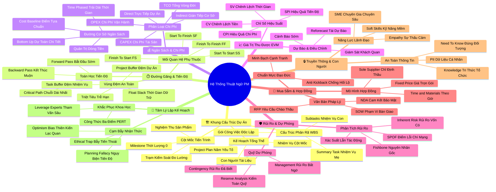

# Bản Đồ Tư Duy Chuyên Sâu: Bảng Thuật Ngữ Và Định Nghĩa Chuẩn Quốc Tế
*(Glossary and Definitions — Mindmap System)*

---

## 1. HỆ THỐNG MERMAID MINDMAP (4–5 CẤP ĐỘ)

---

## 2. CÂY PHÂN RÃ HỌC TẬP CHỦ ĐỘNG (ACTIVE RECALL HIERARCHY)

- **HỆ THỐNG THUẬT NGỮ QUẢN TRỊ DỰ ÁN CHUẨN QUỐC TẾ (GLOSSARY & ONTOLOGY)**
  - 🏗️ **Khung cấu trúc và phân rã dự án**
    - ➔ *Cấu trúc phân rã công việc (Work Breakdown Structure - WBS)*
      - ➔ Summary Task: Đề mục lớn gom nhóm các công việc bên dưới
      - ➔ Subtasks: Các nhiệm vụ con chia nhỏ để dễ quản lý
      - ➔ Work Package: Gói việc nhỏ nhất có thể gán người chịu trách nhiệm và dự toán chi phí
    - ➔ *Cột mốc (Milestone)*
      - ➔ Thời lượng bằng 0 ($Duration = 0$)
      - ➔ Đánh dấu sự chuyển giao giai đoạn hoặc hoàn thành sản phẩm chủ chốt
    - ➔ *Kế hoạch dự án (Project Plan)*
      - ➔ Tích hợp 5 yếu tố: Nhiệm vụ, Cột mốc, Con người, Tài liệu, Thời gian
  - ⏱️ **Đường găng và toán học tiến độ (Critical Path Method)**
    - ➔ *Toán học Đường găng (Critical Path)*
      - ➔ Chuỗi nhiệm vụ dài nhất quyết định ngày kết thúc dự án
      - ➔ Float / Slack = Thời gian dự trữ cho phép trì hoãn ($Float = 0$ trên đường găng)
      - ➔ Forward Pass: Duyệt xuôi tìm Ngày bắt đầu sớm nhất (ES) và Kết thúc sớm nhất (EF)
      - ➔ Backward Pass: Duyệt ngược tìm Ngày kết thúc muộn nhất (LF) và Bắt đầu muộn nhất (LS)
    - ➔ *Bốn mối quan hệ phụ thuộc (Dependencies)*
      - ➔ FS (Finish-to-Start): A xong $\to$ B bắt đầu (Phổ biến nhất)
      - ➔ SS (Start-to-Start): A bắt đầu $\to$ B bắt đầu song song
      - ➔ FF (Finish-to-Finish): A xong $\to$ B xong đồng thời
      - ➔ SF (Start-to-Finish): A bắt đầu $\to$ B mới được kết thúc
    - ➔ *Hệ thống đệm (Buffers)*
      - ➔ Task Buffer: Đệm riêng cho từng nhiệm vụ có độ bất định cao
      - ➔ Project Buffer: Đệm chung toàn dự án đặt ở cuối lịch trình
  - 💰 **Ngân sách, chi phí và tài chính dự án**
    - ➔ *Đường cơ sở ngân sách (Cost Baseline)*
      - ➔ Mốc ngân sách tham chiếu được phê duyệt chính thức
      - ➔ Bottom-up Approach: Ước tính từ dưới lên cho độ chính xác cao nhất
      - ➔ Time-phase a budget: Trải đều ngân sách theo thời gian để quản trị dòng tiền (Cash Flow)
    - ➔ *Phân loại chi phí và Vòng đời tài sản*
      - ➔ CAPEX: Chi phí vốn đầu tư tài sản cố định lâu dài
      - ➔ OPEX: Chi phí vận hành hàng ngày
      - ➔ Direct Costs: Chi phí trực tiếp cho dự án
      - ➔ Indirect Costs: Chi phí gián tiếp vận hành chung
      - ➔ Total Cost of Ownership (TCO): Tổng chi phí sở hữu từ mua sắm đến tiêu hủy
  - 📈 **Quản trị giá trị thu được (Earned Value Management - EVM)**
    - ➔ *Bốn chỉ số vàng đo lường hiệu suất*
      - ➔ CPI (Cost Performance Index): $EV / AC$ ($>1.0$: Tốt; $<1.0$: Thâm hụt)
      - ➔ SPI (Schedule Performance Index): $EV / PV$ ($>1.0$: Nhanh; $<1.0$: Chậm)
      - ➔ CV (Cost Variance): $EV - AC$
      - ➔ SV (Schedule Variance): $EV - PV$
    - ➔ *Reforecast*: Tái dự báo ngân sách định kỳ dựa trên xu hướng chi tiêu thực tế
  - 🛡️ **Quản trị rủi ro và quỹ dự phòng**
    - ➔ *Nhận diện và định lượng rủi ro*
      - ➔ Inherent Risk: Rủi ro vốn có = Xác suất $\times$ Mức độ tác động
      - ➔ Single Point of Failure (SPOF): Điểm lỗi đơn lẻ có nguy cơ làm sụp đổ toàn bộ hệ thống
      - ➔ Fishbone Diagram: Biểu đồ xương cá mổ xẻ nguyên nhân gốc rễ (Root Cause)
    - ➔ *Phân biệt hai tầng quỹ dự phòng*
      - ➔ Contingency Reserves: Dự phòng rủi ro đã biết (Known-Unknowns) do PM quản lý
      - ➔ Management Reserves: Dự phòng rủi ro bất ngờ (Unknown-Unknowns) do C-Level quản lý
      - ➔ Reserve Analysis: Kiểm toán lượng dự phòng còn lại định kỳ
  - 🤝 **Mua sắm, đấu thầu và hợp đồng pháp lý**
    - ➔ *Văn kiện đấu thầu*
      - ➔ Statement of Work (SOW): Mô tả phạm vi công việc và tiêu chuẩn nghiệm thu
      - ➔ Request for Proposal (RFP): Lời mời thầu cạnh tranh gửi các nhà cung ứng
      - ➔ Non-Disclosure Agreement (NDA): Thỏa thuận bảo mật kinh doanh
    - ➔ *Các loại hợp đồng mua sắm*
      - ➔ Fixed Contract: Hợp đồng trọn gói (Nhà thầu chịu rủi ro trượt giá)
      - ➔ Time & Materials (T&M): Hợp đồng theo giờ và vật tư (Bên mua chịu rủi ro)
      - ➔ Sole-supplier: Chỉ định thầu một đơn vị duy nhất
    - ➔ *Đạo đức nghề nghiệp*
      - ➔ Cấm tuyệt đối Hoa hồng đen / Tiền lại quả (Kickbacks)
  - 🔒 **Truyền thông, bảo mật và con người**
    - ➔ *Bảo mật thông tin*
      - ➔ Need-to-know Basis: Chỉ chia sẻ đúng người cần biết vào đúng thời điểm
      - ➔ Personally Identifiable Information (PII): Bảo vệ tuyệt đối thông tin định danh cá nhân
    - ➔ *Quản trị tri thức & Kỹ năng lãnh đạo*
      - ➔ Knowledge Management: Lưu trữ tập trung bài học kinh nghiệm
      - ➔ Empathy (Thấu cảm) & Soft Skills (Kỹ năng mềm)
      - ➔ Subject Matter Expert (SME): Chuyên gia chuyên môn sâu làm cố vấn
  - 🧠 **Tâm lý học và thiên kiến nhận thức**
    - ➔ *Hai cạm bẫy tâm lý phổ biến*
      - ➔ Optimism Bias: Thiên kiến lạc quan thái quá về tương lai
      - ➔ Planning Fallacy: Ngụy biện đánh giá thấp thời gian và chi phí
    - ➔ *Giải pháp khoa học*: Công thức ước tính 3 điểm PERT và tham vấn chuyên gia (SME)

---

## 3. BẢNG NEO KÝ THỨC (MEMORY ANCHOR CHEAT SHEET)

| Khái Niệm Cốt Lõi | Điểm Neo Trực Quan (Mental Anchor) | Câu Kích Hoạt Tư Duy (Trigger Prompt) | Ứng Dụng Thực Chiến Tức Thì |
| :--- | :--- | :--- | :--- |
| **WBS (100% Rule)** | Khối Rubik xếp khít từng viên | *"Các phần việc con đã cộng lại đủ 100% việc mẹ chưa?"* | Chia nhỏ dự án thành các gói việc độc lập, không trùng lặp và không bỏ sót. |
| **Critical Path (Float = 0)** | Sợi dây chun căng đứt ngay nếu kéo | *"Nhiệm vụ này trễ 1 ngày thì dự án có trễ theo không?"* | Theo dõi sát sao các công việc có $Float = 0$ mỗi sáng; không cho phép trễ hạn. |
| **Forward / Backward Pass** | Người đi bộ từ đầu đến cuối rồi đi lùi | *"Đâu là ngày sớm nhất và muộn nhất việc này phải chạy?"* | Tính toán ES, EF, LS, LF để phát hiện khoảng thời gian dự trữ (Float). |
| **Cost Baseline (S-Curve)** | Đường ray xe lửa dẫn lối ngân sách | *"Chúng ta đang tiêu tiền theo đúng đường ray đã duyệt không?"* | So sánh chi phí thực tế với đường cơ sở để kiểm soát độ lệch giải ngân. |
| **TCO (Total Cost)** | Phần chìm khổng lồ của tảng băng trôi | *"Chi phí mua rẻ nhưng chi phí nuôi nó 5 năm là bao nhiêu?"* | Luôn tính cả tiền bảo trì, bản quyền và vận hành trước khi quyết định mua. |
| **EVM (CPI & SPI)** | Đồng hồ tốc độ và nhiên liệu trên xe | *"Mỗi 1 đồng bỏ ra đang thu về bao nhiêu cent giá trị thật?"* | Tính $CPI = EV/AC$ và $SPI = EV/PV$ hàng tuần để báo cáo trung thực. |
| **SPOF (Single Point)** | Cây cầu độc đạo bắc qua vực thẳm | *"Nếu người này nghỉ việc hoặc máy chủ này sập thì sao?"* | Lập tức xây dựng mắt xích dự phòng (Redundancy) để xóa bỏ điểm lỗi đơn lẻ. |
| **Contingency vs Management** | Ví tiền trong túi vs Két sắt ở nhà | *"Rủi ro này tôi được tự quyết tiền hay phải xin Giám đốc?"* | Dùng Contingency cho rủi ro đã nhận diện; trình duyệt Management cho bất khả kháng. |
| **SOW & RFP** | Bản thiết kế nhà kèm thư mời thầu | *"Nhà thầu có biết chính xác tiêu chuẩn nghiệm thu là gì không?"* | Viết tiêu chuẩn định lượng rõ ràng vào SOW trước khi ký kết hợp đồng. |
| **Planning Fallacy & PERT** | Kính lúp phóng to các nguy cơ tiềm ẩn | *"Tôi có đang quá lạc quan khi nghĩ 2 ngày là xong không?"* | Áp dụng công thức PERT $(O+4M+P)/6$ để ép bản thân tính đến kịch bản xấu. |
