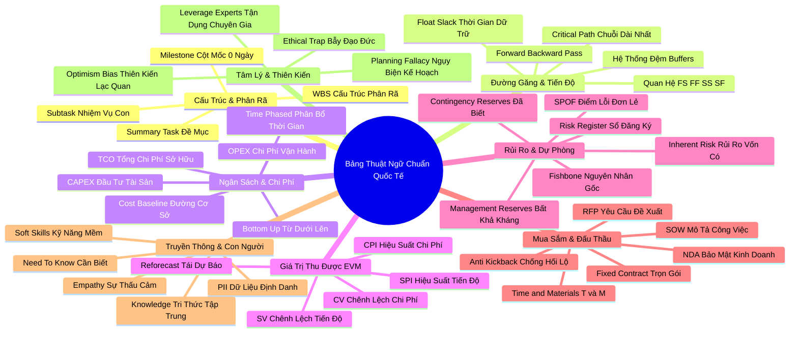

# Tóm Tắt Chuyên Sâu: Bảng Thuật Ngữ Và Định Nghĩa Chuẩn Quốc Tế
*(Glossary and Definitions — Google Project Management Course 3)*

---

## THÔNG ĐIỆP CỐT LÕI (CORE ESSENCE)

> **"Ngôn ngữ là ranh giới của tư duy. Người quản lý dự án chỉ có thể kiểm soát những gì họ có thể gọi tên một cách chính xác."**  
> Bảng thuật ngữ của Khóa học 3 không đơn thuần là một cuốn từ điển định nghĩa khô khan; nó là một **Hệ Thống Bản Thể Học (Ontology)** hoàn chỉnh của ngành Quản trị Dự án chuẩn mực quốc tế (theo chuẩn PMI / Google). Việc làm chủ từng khái niệm — từ toán học tiến độ (*Critical Path, Forward/Backward Pass*), tài chính dự toán (*Cost Baseline, CAPEX/OPEX, EVM*), kiến trúc rủi ro (*SPOF, Reserve Analysis*), cơ chế đấu thầu (*SOW, RFP*), cho đến bảo mật thông tin (*PII, Need-to-know*) — giúp người quản lý dự án chuyển hóa từ một người làm việc theo cảm tính thành một nhà lãnh đạo chiến lược sở hữu tư duy hệ thống sắc bén và uy tín chuyên môn không thể tranh cãi.

---

## TỔNG QUAN PHÂN BỔ NỘI DUNG

| Cụm Chủ Đề | Phạm Vi Thuật Ngữ Bao Hàm | Các Khái Niệm Trọng Tâm | Giá Trị Thực Chiến |
| :--- | :--- | :--- | :--- |
| **Cụm 1: Khung Cấu Trúc & Phân Rã** | Thuật ngữ W, S, M, P | WBS, Milestone, Summary Task, Subtasks, Project Plan, Project Task | Chia nhỏ dự án phức tạp thành các gói công việc có thể ước tính và giao quyền. |
| **Cụm 2: Đường Găng & Tiến Độ Toán Học** | Thuật ngữ C, B, F, E, L, S, N, G | Critical Path, Forward/Backward Pass, Float/Slack, Buffer, FS/FF/SS/SF, Gantt, Network Diagram | Tối ưu hóa dòng thời gian, xác định chính xác ngày hoàn thành sớm nhất và vùng đệm an toàn. |
| **Cụm 3: Ngân Sách, Chi Phí & Tài Chính** | Thuật ngữ B, C, D, I, F, O, T | Budget, Cost Baseline, CAPEX/OPEX, Direct/Indirect Costs, Cash Flow, TCO, Time-phase | Hoạch định dòng tiền minh bạch, kiểm soát tổng chi phí sở hữu vòng đời dài hạn. |
| **Cụm 4: Quản Trị Giá Trị Thu Được (EVM)** | Thuật ngữ E, C, S, R | EVM, CPI, SPI, CV, SV, Reforecast | Đo lường hiệu suất thực tế khách quan, phát hiện thâm hụt ngân sách và trễ hạn tức thì. |
| **Cụm 5: Quản Trị Rủi Ro & Dự Phòng** | Thuật ngữ R, I, C, M, S | Risk Register, Inherent Risk, Contingency vs Management Reserves, SPOF, Fishbone | Bảo vệ dự án trước các điểm lỗi chí mạng và lập quỹ dự phòng khoa học. |
| **Cụm 6: Mua Sắm, Hợp Đồng & Pháp Lý** | Thuật ngữ P, S, R, F, T, N, K, V | Procurement, SOW, RFP, Fixed Contract, T&M, Sole-supplier, NDA, Kickback | Đấu thầu minh bạch, quản trị đối tác cung ứng và triệt tiêu rủi ro tham nhũng. |
| **Cụm 7: Truyền Thông, Bảo Mật & Con Người** | Thuật ngữ C, N, P, K, E, S | Comm Plan, Need-to-know, PII, Knowledge Management, Empathy, Soft Skills, SME | Bảo vệ dữ liệu nhạy cảm, chống rò rỉ thông tin và gắn kết đội ngũ đa chức năng. |
| **Cụm 8: Tâm Lý Học & Thiên Kiến Nhận Thức** | Thuật ngữ P, O, E | Planning Fallacy, Optimism Bias, Ethical Trap, Leverage Experts | Nhận diện cạm bẫy tâm lý chủ quan khi lập dự toán và ra quyết định. |

---

## BÀI HỌC THEN CHỐT THEO TỪNG CỤM CHỦ ĐỀ (KEY TAKEAWAYS)

### CỤM 1: KHUNG CẤU TRÚC & PHÂN RÃ CÔNG VIỆC (WBS & MILESTONES)

#### 1. WBS, Cột mốc (Milestones) và Thứ bậc phân rã công việc
- **Phân tích bản chất & Tư duy cốt lõi**:
  - **Cấu trúc phân rã công việc (Work Breakdown Structure - WBS)** là xương sống của mọi kế hoạch. Nó phân cấp từ Nhiệm vụ tóm tắt (Summary Task) xuống các Nhiệm vụ con (Subtasks) và Gói công việc (Work Packages) cụ thể.
  - **Cột mốc (Milestone)** có thời lượng bằng 0 (Duration = 0), đóng vai trò như các trạm kiểm soát (Checkpoints) đo lường sự tiến bộ và gắn liền với việc bàn giao một sản phẩm chủ chốt.
- **Công cụ / Khung phương pháp / Công thức ứng dụng**:
  - *Quy tắc 100%*: Tổng phạm vi của các Subtasks ở cấp dưới phải bằng chính xác 100% phạm vi của Summary Task ở cấp trên; không thừa, không thiếu.
- **Ví dụ thực tiễn sinh động (Real-world Scenario)**:
  - Trong dự án phát triển xe điện, Summary Task "Hệ thống truyền động" được phân rã thành: Pin Lithium, Động cơ điện và Bộ điều khiển Inverter. Milestone hoàn thành là: "Khởi động thử nghiệm động cơ trên sa bàn thành công (0 ngày)".

---

### CỤM 2: ĐƯỜNG GĂNG & TOÁN HỌC TIẾN ĐỘ DỰ ÁN

#### 2. Đường găng (Critical Path), Float/Slack và Thuật toán Duyệt xuôi/ngược
- **Phân tích bản chất & Tư duy cốt lõi**:
  - **Đường găng (Critical Path)** là chuỗi nhiệm vụ dài nhất quyết định thời gian tối thiểu để hoàn thành dự án. Nhiệm vụ trên đường găng có Thời gian dự trữ bằng không ($Float = 0$).
  - **Duyệt xuôi (Forward Pass)** tính toán Ngày bắt đầu sớm nhất (ES) và Kết thúc sớm nhất (EF). **Duyệt ngược (Backward Pass)** tính Ngày kết thúc muộn nhất (LF) và Bắt đầu muộn nhất (LS).
- **Công cụ / Khung phương pháp / Công thức ứng dụng**:
  - $Float = LS - ES = LF - EF$.
  - Nếu $Float = 0 \to$ Thuộc Đường găng (Critical).
  - Nếu $Float > 0 \to$ Có khoảng đệm trì hoãn an toàn.
- **Ví dụ thực tiễn sinh động (Real-world Scenario)**:
  - Công việc "Thi công móng tòa nhà" có $ES = 0$, $EF = 30$, $LS = 0$, $LF = 30 \to Float = 0$ (Đường găng). Công việc "Lắp đặt biển quảng cáo ngoài trời" có $ES = 10$, $EF = 15$, $LS = 40$, $LF = 45 \to Float = 30$ ngày (Không thuộc đường găng, có thể hoãn 30 ngày mà không trễ ngày khánh thành).

#### 3. Bốn mối quan hệ phụ thuộc (FS, FF, SS, SF) và Hệ thống Đệm (Buffers)
- **Phân tích bản chất & Tư duy cốt lõi**:
  - *Finish-to-Start (FS)*: Phổ biến nhất (A xong $\to$ B mới bắt đầu).
  - *Start-to-Start (SS)*: Hai việc cùng khởi động song song (Đào hào $\to$ Rải cáp quang).
  - *Finish-to-Finish (FF)*: Hai việc phải cùng hoàn tất đồng thời (Kiểm thử phần mềm $\to$ Viết tài liệu hướng dẫn).
  - *Start-to-Finish (SF)*: Hiếm gặp (Ca trực mới bắt đầu thì ca cũ mới được kết thúc).
  - **Task Buffer vs Project Buffer**: Đệm nhiệm vụ gắn vào việc cụ thể; Đệm dự án gom chung ở cuối để chống trượt hạn toàn cục.
- **Công cụ / Khung phương pháp / Công thức ứng dụng**:
  - *Sơ đồ mạng lưới PDM (Precedence Diagramming Method)*.
- **Ví dụ thực tiễn sinh động (Real-world Scenario)**:
  - Dự án sơn nhà: Phải sơn xong lớp lót thì mới sơn lớp phủ ngoài (Mối quan hệ FS). Nhóm thợ tạo một Task Buffer 4 giờ để chờ sơn lót khô trước khi thi công tiếp.

---

### CỤM 3: NGÂN SÁCH, DỰ TOÁN VÀ CHI PHÍ TÀI CHÍNH

#### 4. Đường cơ sở ngân sách (Cost Baseline), Dự toán từ dưới lên và Phân bổ theo thời gian
- **Phân tích bản chất & Tư duy cốt lõi**:
  - **Đường cơ sở ngân sách (Cost Baseline)** là mốc ngân sách được phê duyệt chính thức dùng để so sánh tiến độ giải ngân thực tế.
  - **Dự toán từ dưới lên (Bottom-up Approach)**: Bóc tách từng hạng mục chi phí của từng gói việc nhỏ rồi cộng dồn lên, cho độ chính xác cao nhất.
  - **Phân bổ theo thời gian (Time-phase a budget)**: Trải đều chi phí theo từng tháng/quý để quản trị dòng tiền (Cash Flow), tránh tình trạng cạn kiệt vốn lưu động giữa chừng.
- **Công cụ / Khung phương pháp / Công thức ứng dụng**:
  - *Đường cong chữ S (S-Curve)*: Biểu diễn tích lũy chi phí theo thời gian (chậm ở đầu, dốc mạnh ở giữa, phẳng dần ở cuối).
- **Ví dụ thực tiễn sinh động (Real-world Scenario)**:
  - Dự án 120.000 USD được chia đều: Tháng 1 chi 10.000 USD (Khảo sát), Tháng 2-4 chi 30.000 USD/tháng (Phát triển), Tháng 5 chi 20.000 USD (Nghiệm thu). Nhờ phân bổ theo thời gian, phòng Kế toán chuẩn bị đủ tiền mặt từng tháng mà không phải vay ngân hàng chịu lãi sớm.

#### 5. Phân loại chi phí: CAPEX vs OPEX, Chi phí trực tiếp vs Gián tiếp, và TCO
- **Phân tích bản chất & Tư duy cốt lõi**:
  - **CAPEX (Chi phí vốn)**: Mua sắm tài sản cố định dùng lâu dài (Máy chủ, Tòa nhà, Bản quyền vĩnh viễn) $\to$ Khấu hao nhiều năm.
  - **OPEX (Chi phí vận hành)**: Chi phí tiêu hao hàng ngày (Điện toán đám mây Cloud, Lương tháng, Thuê văn phòng) $\to$ Tính vào chi phí năm hiện tại.
  - **Tổng chi phí sở hữu (Total Cost of Ownership - TCO)**: Tính toàn bộ vòng đời tài sản (Mua sắm + Vận hành + Bảo trì + Tiêu hủy).
- **Công cụ / Khung phương pháp / Công thức ứng dụng**:
  - $\text{TCO} = \text{Chi phí Mua sắm (CAPEX)} + \sum \text{Chi phí Vận hành hằng năm (OPEX)} - \text{Giá trị thanh lý còn lại}$.
- **Ví dụ thực tiễn sinh động (Real-world Scenario)**:
  - Máy chủ tự lắp đặt có giá mua ban đầu là 10.000 USD (CAPEX rẻ), nhưng chi phí điện lạnh, bảo trì và quản trị viên tốn 5.000 USD/năm (OPEX cao $\to$ TCO 5 năm = 35.000 USD). Thuê dịch vụ Google Cloud có chi phí 4.000 USD/năm (CAPEX = 0 $\to$ TCO 5 năm = 20.000 USD). Nhờ tính TCO, PM chọn giải pháp Cloud giúp tiết kiệm 15.000 USD cho công ty.

---

### CỤM 4: QUẢN TRỊ GIÁ TRỊ THU ĐƯỢC (EARNED VALUE MANAGEMENT - EVM)

#### 6. Các chỉ số hiệu suất toán học: CPI, SPI, CV, SV
- **Phân tích bản chất & Tư duy cốt lõi**:
  - Quản trị giá trị thu được (EVM) là công cụ tối thượng để trả lời câu hỏi: *"Với số tiền đã tiêu, chúng ta đã thực sự nhận lại được bao nhiêu giá trị công việc?"*
  - Nếu chỉ nhìn vào số tiền đã giải ngân mà không gắn với khối lượng hoàn thành, PM sẽ rơi vào ảo tưởng an toàn.
- **Công cụ / Khung phương pháp / Công thức ứng dụng**:
  - **Chỉ số hiệu suất chi phí (CPI)**: $\text{CPI} = \frac{EV}{AC}$.
    - $\text{CPI} > 1.0$: Tiết kiệm chi phí (Tốt).
    - $\text{CPI} < 1.0$: Đội ngân sách (Nguy hiểm).
  - **Chỉ số hiệu suất tiến độ (SPI)**: $\text{SPI} = \frac{EV}{PV}$.
    - $\text{SPI} > 1.0$: Vượt tiến độ (Tốt).
    - $\text{SPI} < 1.0$: Chậm tiến độ (Cần cảnh báo).
  - **Chênh lệch chi phí (CV)**: $CV = EV - AC$.
  - **Chênh lệch tiến độ (SV)**: $SV = EV - PV$.
- **Ví dụ thực tiễn sinh động (Real-world Scenario)**:
  - Dự án tại mốc 3 tháng: Giá trị kế hoạch $PV = 50.000$ USD; Chi phí thực tế đã chi $AC = 60.000$ USD; Nhưng khối lượng công việc mới hoàn thành trị giá $EV = 40.000$ USD.  
    $\text{CPI} = 40.000 / 60.000 = 0.67$ (Mỗi 1 USD bỏ ra chỉ thu về 67 cent giá trị).  
    $\text{SPI} = 40.000 / 50.000 = 0.80$ (Chậm tiến độ 20%). Báo động đỏ được kích hoạt ngay lập tức.

---

### CỤM 5: QUẢN TRỊ RỦI RO & DỰ PHÒNG TÀI CHÍNH

#### 7. Ma trận Xác suất - Tác động, SPOF và Phân biệt Dự phòng
- **Phân tích bản chất & Tư duy cốt lõi**:
  - **Rủi ro vốn có (Inherent Risk)** = Xác suất (Probability) $\times$ Mức độ tác động (Impact).
  - **Điểm lỗi đơn lẻ (Single Point of Failure - SPOF)**: Một mắt xích duy nhất mà nếu nó đứt gãy, toàn bộ hệ thống dự án sẽ sụp đổ hoàn toàn. Bắt buộc phải triệt tiêu SPOF bằng các phương án dự phòng (Redundancy).
  - **Dự phòng rủi ro đã xác định (Contingency Reserves)**: Dành cho rủi ro "Đã biết - Chưa xảy ra" (Known-Unknowns), nằm trong quyền quyết định của PM.
  - **Dự phòng quản lý (Management Reserves)**: Dành cho rủi ro "Chưa từng biết - Bất khả kháng" (Unknown-Unknowns), nằm dưới quyền kiểm soát của Ban giám đốc.
- **Công cụ / Khung phương pháp / Công thức ứng dụng**:
  - *Sổ đăng ký rủi ro (Risk Register)* & *Biểu đồ xương cá (Fishbone/Ishikawa)* để tìm nguyên nhân gốc rễ (Root Cause).
- **Ví dụ thực tiễn sinh động (Real-world Scenario)**:
  - Một dự án app ngân hàng chỉ có duy nhất 1 kỹ sư biết mật khẩu quản trị máy chủ gốc $\to$ Đây là SPOF chí mạng. PM yêu cầu lưu khóa bảo mật vào két sắt phần mềm phân quyền cho 3 người. Khi kỹ sư kia đột ngột xin nghỉ việc, dự án vẫn vận hành bình thường.

---

### CỤM 6: MUA SẮM, ĐẤU THẦU VÀ QUẢN TRỊ HỢP ĐỒNG

#### 8. SOW, RFP, Các loại hợp đồng và Đạo đức đấu thầu
- **Phân tích bản chất & Tư duy cốt lõi**:
  - **Bản mô tả phạm vi công việc (Statement of Work - SOW)**: Văn bản pháp lý định rõ ranh giới bàn giao, tiêu chuẩn kỹ thuật và điều kiện nghiệm thu.
  - **Yêu cầu đề xuất (Request for Proposal - RFP)**: Tài liệu phát hành công khai để mời thầu cạnh tranh.
  - **Hợp đồng trọn gói (Fixed-Price)**: Nhà thầu chịu rủi ro đội chi phí; phù hợp khi phạm vi cực kỳ rõ ràng.
  - **Hợp đồng thời gian & vật liệu (Time & Materials - T&M)**: Bên mua chịu rủi ro; trả tiền theo giờ làm thực tế, phù hợp khi phạm vi linh hoạt, nghiên cứu phát triển.
  - **Quy tắc đạo đức**: Cấm tuyệt đối hành vi "Hoa hồng đen/Lại quả" (Kickbacks) và vi phạm Thỏa thuận bảo mật (NDA).
- **Công cụ / Khung phương pháp / Công thức ứng dụng**:
  - *Quy trình Đấu thầu 4 bước*: Lập SOW $\to$ Phát hành RFP $\to$ Đánh giá hồ sơ thầu $\to$ Ký kết Hợp đồng & Giám sát.
- **Ví dụ thực tiễn sinh động (Real-world Scenario)**:
  - Khi thuê công ty xây dựng làm trụ sở văn phòng mới với thiết kế bản vẽ chi tiết 100%, PM chọn Hợp đồng trọn gói (Fixed Contract) 500.000 USD. Khi giá cát và xi măng tăng vọt, nhà thầu phải tự chịu chi phí phát sinh mà không được đòi thêm tiền của chủ đầu tư.

---

### CỤM 7: TRUYỀN THÔNG, BẢO MẬT & QUẢN TRỊ CON NGƯỜI

#### 9. Nguyên tắc Need-to-Know, Bảo mật PII và Quản trị Tri thức
- **Phân tích bản chất & Tư duy cốt lõi**:
  - **Nguyên tắc Thực sự cần biết (Need-to-know Basis)**: Chỉ cung cấp đúng thông tin cần thiết cho đúng đối tượng vào đúng thời điểm; không thừa thãi.
  - **Thông tin định danh cá nhân (PII)**: Dữ liệu nhạy cảm nhận dạng con người (Email, Điện thoại, Lương, Căn cước) phải được mã hóa và bảo vệ nghiêm ngặt theo luật an ninh mạng.
  - **Quản trị tri thức (Knowledge Management)**: Đảm bảo toàn bộ bài học kinh nghiệm, biên bản họp và tài liệu sống được lưu trữ tập trung (Master Hub) để thế hệ sau kế thừa.
- **Công cụ / Khung phương pháp / Công thức ứng dụng**:
  - *Ma trận Phân quyền Tài liệu (Role-Based Access Control - RBAC)*.
- **Ví dụ thực tiễn sinh động (Real-world Scenario)**:
  - Khi khảo sát thị trường, PM chỉ lưu kết quả phân tích thống kê chung trên Google Drive công khai của dự án. File chứa danh sách 10.000 số điện thoại và địa chỉ nhà khách hàng (PII) được mã hóa trong thư mục riêng chỉ có PM và Luật sư trưởng tiếp cận được.

---

### CỤM 8: TÂM LÝ HỌC & THIÊN KIẾN NHẬN THỨC TRONG LẬP KẾ HOẠCH

#### 10. Ngụy biện lập kế hoạch (Planning Fallacy) và Thiên kiến lạc quan (Optimism Bias)
- **Phân tích bản chất & Tư duy cốt lõi**:
  - **Thiên kiến lạc quan (Optimism Bias)**: Xu hướng tâm lý bẩm sinh tin rằng dự án của mình sẽ suôn sẻ hơn người khác, thời tiết sẽ luôn đẹp và đối tác sẽ luôn giao hàng đúng hẹn.
  - **Ngụy biện lập kế hoạch (Planning Fallacy)**: Thói quen đánh giá thấp thời gian và chi phí cần thiết, đồng thời đánh giá quá cao năng suất làm việc của đội ngũ.
  - Giải pháp để chữa lành căn bệnh này là **Tham vấn Chuyên gia (Leverage Experts)** và sử dụng dữ liệu lịch sử của các dự án tương tự (Reference Class Forecasting).
- **Công cụ / Khung phương pháp / Công thức ứng dụng**:
  - *Kỹ thuật Ước tính PERT 3 điểm*: $\text{Thời gian kỳ vọng} = \frac{O + 4M + P}{6}$ (Ép buộc người lập kế hoạch phải tính đến kịch bản Bi quan $P$).
- **Ví dụ thực tiễn sinh động (Real-world Scenario)**:
  - Nhóm lập trình viên tự tin tuyên bố: "Tính năng đăng nhập này em làm chỉ mất đúng 2 ngày". PM nhận diện ngay Ngụy biện lập kế hoạch, liền hỏi: "Nếu máy chủ xác thực của đối tác bị lỗi kết nối thì mất bao lâu?". Sau khi thảo luận cùng Chuyên gia bảo mật (SME), con số thực tế được chốt là 6 ngày.

---

## KẾ HOẠCH HÀNH ĐỘNG THỰC THI (ACTION PLAN)

### 1. Thói quen vi mô hàng ngày (Micro-habits)
- [ ] **Sử dụng chuẩn xác thuật ngữ chuyên môn**: Dùng đúng từ ngữ chuẩn quốc tế (WBS, Critical Path, Milestone, Buffer) trong các cuộc họp thay vì dùng các từ mơ hồ như "mấy việc to", "khoảng thời gian rảnh".
- [ ] **Rà soát đường găng buổi sáng**: Mở biểu đồ tiến độ và kiểm tra ngay trạng thái của các nhiệm vụ có $Float = 0$.
- [ ] **Định danh rủi ro theo cặp**: Mỗi khi một thành viên nêu ra một mối lo ngại, luôn yêu cầu họ định lượng theo cặp: Xác suất (%) và Mức độ tác động (Thấp/TB/Cao).
- [ ] **Kiểm tra nguyên tắc Cần Biết**: Tự hỏi trước khi bấm chia sẻ file: "Người này có thực sự cần biết dữ liệu này để làm công việc của họ không?".
- [ ] **Ghi chép thuật ngữ mới**: Dành 5 phút mỗi ngày đọc lại 3 thuật ngữ trong sổ tay để khắc sâu phản xạ từ vựng.

### 2. Kế hoạch triển khai tuần này (Immediate Implementation)
- [ ] **Kiểm toán Đường găng dự án hiện tại**: Sử dụng kỹ thuật Forward Pass và Backward Pass để tính toán chính xác giá trị Float cho toàn bộ nhiệm vụ.
- [ ] **Thiết lập bảng theo dõi chỉ số CPI & SPI**: Đưa công thức tính EVM vào bảng tính theo dõi tiến độ hàng tuần để đo lường hiệu suất tài chính thực tế.
- [ ] **Rà soát triệt tiêu Điểm lỗi đơn lẻ (SPOF)**: Tổ chức một buổi họp ngắn 30 phút rà soát các mắt xích công nghệ, con người hoặc nhà cung ứng độc quyền để lập kế hoạch dự phòng.
- [ ] **Phân tách quỹ Dự phòng rủi ro và Dự phòng quản lý**: Làm việc với Giám đốc Tài chính để chốt rõ hạn mức Contingency Reserves (do PM nắm) và Management Reserves (do C-Level nắm).
- [ ] **Chuẩn hóa hợp đồng và điều khoản SOW**: Rà soát lại tất cả các bản SOW đang ký với nhà thầu bên ngoài, bổ sung tiêu chuẩn nghiệm thu định lượng rõ ràng.

### 3. Chuyển đổi trung và dài hạn (Long-term Mastery)
- [ ] **Xây dựng Từ điển WBS chuẩn của tổ chức**: Thiết lập bộ khung thư viện WBS mẫu cho các loại hình dự án phổ biến trong công ty để tái sử dụng.
- [ ] **Chuyển đổi văn hóa ước tính theo dữ liệu lịch sử**: Loại bỏ hoàn toàn phương pháp ước tính theo cảm tính; bắt buộc áp dụng công thức PERT 3 điểm và tham vấn chuyên gia (SME).
- [ ] **Thiết lập hệ sinh thái Quản trị Tri thức (Knowledge Base)**: Xây dựng cổng tra cứu bài học kinh nghiệm và kho tài liệu mẫu chuẩn hóa cho toàn bộ bộ phận PMO.
- [ ] **Huấn luyện đội ngũ về Đạo đức nghề nghiệp và Pháp lý**: Tổ chức các buổi hội thảo chia sẻ về phòng chống hối lộ (Anti-kickback), bảo vệ PII và cam kết bảo mật (NDA).
- [ ] **Đạt chứng chỉ Quản trị Dự án Quốc tế (PMP / Google PM Certificate)**: Hoàn thành toàn bộ lộ trình học tập, củng cố vốn từ vựng chuyên môn để chuẩn bị cho kỳ thi cấp chứng chỉ chuyên nghiệp.

---

## CÂU HỎI TỰ VẤN & PHẢN TƯ (REFLECTION QUESTIONS)

### Góc phần tư 1: Tự nhận thức (Self-Awareness)
1. *Tôi có thực sự hiểu rõ bản chất toán học của các chỉ số như CPI, SPI, Float hay tôi chỉ đang ghi nhớ các định nghĩa một cách máy móc?*
2. *Khi giao tiếp với các bên liên quan, tôi có đang sử dụng thuật ngữ chuyên môn để giúp họ hiểu rõ vấn đề hay để phô diễn sự uyên bác của bản thân?*
3. *Bản thân tôi có đang mắc phải Thiên kiến lạc quan (Optimism Bias) mỗi khi lập dự toán thời gian cho các dự án tâm huyết của mình không?*
4. *Tôi có thói quen kiểm tra Điểm lỗi đơn lẻ (SPOF) của chính bản thân mình trong dự án không (nếu tôi ốm, ai thay tôi điều phối)?*
5. *Tôi cảm thấy thế nào khi một chuyên gia cấp dưới phản bác phương pháp ước tính chi phí của tôi bằng các số liệu lịch sử xác thực?*

### Góc phần tư 2: Tư duy phản biện (Critical Inquiry)
6. *Tại sao việc nhầm lẫn giữa Contingency Reserves (Dự phòng rủi ro) và Management Reserves (Dự phòng quản lý) có thể dẫn tới khủng hoảng tài chính nghiêm trọng?*
7. *Trong trường hợp nào thì Hợp đồng theo Thời gian và Vật liệu (T&M) lại vượt trội hơn Hợp đồng trọn gói (Fixed Contract), dù nó khiến bên mua chịu nhiều rủi ro hơn?*
8. *Làm thế nào để phân định ranh giới mong manh giữa "Kỹ năng gây ảnh hưởng tích cực" và "Thao túng tâm lý / Cạm bẫy đạo đức" trong quản trị dự án?*
9. *Nếu chỉ số CPI của dự án là 1.2 (rất tiết kiệm) nhưng SPI là 0.7 (rất chậm), liệu dự án này có thực sự được coi là thành công hay không?*
10. *Nguyên tắc Cần Biết (Need-to-know) có mâu thuẫn với triết lý Văn hóa Minh bạch (Radical Transparency) trong môi trường Agile không?*

### Góc phần tư 3: Thách thức giới hạn (Limit Expansion)
11. *Làm thế nào tôi có thể giải thích khái niệm Critical Path (Đường găng) cho một đứa trẻ 10 tuổi hoặc một Tổng giám đốc không có chuyên môn kỹ thuật trong vòng 60 giây?*
12. *Nếu ngân sách dự án bị cắt giảm 30% ngay trước ngày khởi động, tôi sẽ sử dụng các thuật ngữ và công cụ nào trong bảng này để tái đàm phán phạm vi?*
13. *Bằng cách nào hệ thống Quản trị Tri thức có thể giúp doanh nghiệp tiết kiệm hàng triệu USD chi phí thử sai từ các dự án thất bại trong quá khứ?*
14. *Làm sao để lượng hóa được giá trị kinh tế của "Sự thấu cảm" (Empathy) và "Kỹ năng mềm" trong việc duy trì tiến độ đường găng của dự án?*
15. *Nếu một đối tác tiềm năng ngỏ ý gửi "quà cảm ơn" trị giá 5% hợp đồng, tôi sẽ vận dụng những nguyên tắc pháp lý và đạo đức nào để từ chối một cách dứt khoát và khôn khéo nhất?*

### Góc phần tư 4: Cam kết chuyển hóa (Transformative Commitment)
16. *Thuật ngữ nào trong bảng này mà tôi cảm thấy mình còn mơ hồ nhất, và tôi cam kết sẽ nghiên cứu sâu và áp dụng nó vào dự án ngay trong tuần này?*
17. *Tôi sẽ bắt đầu rèn luyện thói quen tính toán Đường găng và Float cho các dự án cá nhân và công việc của mình như thế nào?*
18. *Lời cam kết danh dự của tôi về việc không bao giờ thỏa hiệp với các Cạm bẫy đạo đức (Ethical Traps) và luôn minh bạch trong báo cáo EVM là gì?*
19. *Tôi sẽ chia sẻ và lan tỏa ngôn ngữ quản trị dự án chuẩn mực này đến các thành viên trong đội ngũ của mình bằng phương pháp nào?*
20. *Tôi sẽ biến bảng thuật ngữ này thành bệ phóng vững chắc như thế nào để chinh phục Giai đoạn Thực thi (Execution) trong chặng đường tiếp theo?*

---

## BẢN ĐỒ TƯ DUY TỔNG QUAN (VISUAL MINDMAP)

