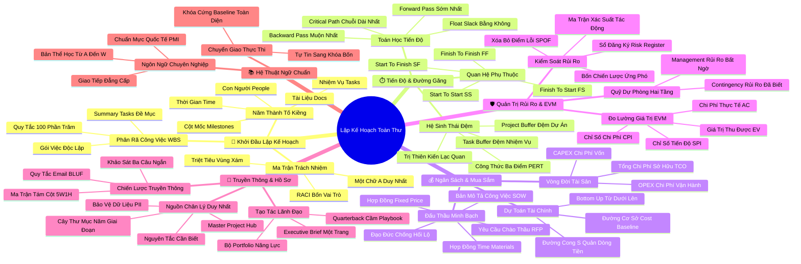

# Bản Đồ Tư Duy Chuyên Sâu Toàn Thư: Lập Kế Hoạch Dự Án — Kết Nối Toàn Diện
*(Master Mindmap System: Project Planning: Putting It All Together — Google Project Management)*

---

## 1. HỆ THỐNG MERMAID MINDMAP TOÀN THƯ (4–5 CẤP ĐỘ)

---

## 2. CÂY PHÂN RÃ HỌC TẬP CHỦ ĐỘNG TOÀN KHÓA (MASTER ACTIVE RECALL HIERARCHY)

- **LẬP KẾ HOẠCH DỰ ÁN TOÀN THƯ (PROJECT PLANNING MASTER ONTOLOGY)**
  - 🎯 **Chương 1: Khởi đầu giai đoạn lập kế hoạch (Beginning the Planning Phase)**
    - ➔ *Chuyển giao từ Hiến chương sang Kế hoạch thi công*
      - ➔ Biến mục tiêu trừu tượng thành các sản phẩm bàn giao đo lường được
    - ➔ *Năm thành tố kiềng 5 chân (The 5 Components)*
      - ➔ Nhiệm vụ (Tasks), Cột mốc (Milestones), Con người (People), Tài liệu (Docs), Thời gian (Time)
    - ➔ *Cấu trúc phân rã công việc (Work Breakdown Structure - WBS)*
      - ➔ Quy tắc 100%: Tổng việc con bao quát chính xác 100% việc mẹ
      - ➔ Bóc tách đến Gói công việc (Work Package) để dễ giao việc và dự toán
    - ➔ *Ma trận phân nhiệm RACI*
      - ➔ R (Responsible): Người trực tiếp làm
      - ➔ A (Accountable): Người chịu trách nhiệm giải trình duy nhất (1 chữ A/việc)
      - ➔ C (Consulted): Chuyên gia được tham vấn 2 chiều
      - ➔ I (Informed): Các bên liên quan nhận thông báo 1 chiều
  - ⏱️ **Chương 2: Xây dựng kế hoạch dự án & Tiến độ (Building a Project Plan)**
    - ➔ *Toán học Đường găng (Critical Path Method - CPM)*
      - ➔ Chuỗi công việc dài nhất quyết định thời gian tối thiểu của dự án
      - ➔ Khoảng thời gian dự trữ (Float / Slack): $Float = 0$ trên đường găng
      - ➔ Forward Pass (Duyệt xuôi: ES/EF) & Backward Pass (Duyệt ngược: LS/LF)
    - ➔ *Bốn mối quan hệ phụ thuộc (Dependencies)*
      - ➔ FS (Finish-to-Start), SS (Start-to-Start), FF (Finish-to-Finish), SF (Start-to-Finish)
    - ➔ *Hệ thống đệm và Khắc phục thiên kiến*
      - ➔ Project Buffer tập trung ở cuối dự án chống định luật Parkinson
      - ➔ Công thức ước tính 3 điểm PERT: $\mu = (O + 4M + P) / 6$
      - ➔ Trị dứt điểm Thiên kiến Lạc quan (Optimism Bias) và Ngụy biện Kế hoạch (Planning Fallacy)
  - 💰 **Chương 3: Quản lý ngân sách và Mua sắm (Budgeting & Procurement)**
    - ➔ *Dự toán chi phí khoa học*
      - ➔ Bottom-up Estimating: Dự toán từ dưới lên cho độ chính xác cao nhất
      - ➔ Phê duyệt và cố định Đường cơ sở Ngân sách (Cost Baseline)
      - ➔ Time-phase budget: Trải đều chi phí theo Đường cong chữ S (S-Curve) để quản trị dòng tiền
    - ➔ *Phân loại chi phí và Tổng chi phí sở hữu*
      - ➔ CAPEX (Chi phí vốn tài sản dài hạn) vs OPEX (Chi phí vận hành hàng ngày)
      - ➔ Total Cost of Ownership (TCO): Đánh giá toàn bộ vòng đời từ mua sắm đến tiêu hủy
    - ➔ *Nghệ thuật Mua sắm và Đấu thầu*
      - ➔ Statement of Work (SOW): Bản mô tả phạm vi công việc và tiêu chuẩn nghiệm thu
      - ➔ Request for Proposal (RFP): Lời mời thầu cạnh tranh
      - ➔ Hợp đồng Trọn gói (Fixed-Price) vs Hợp đồng Thời gian & Vật tư (T&M)
      - ➔ Đạo đức nghề nghiệp: Cấm tiền lại quả (Kickbacks), bảo vệ bí mật bằng NDA
  - 🛡️ **Chương 4: Quản trị rủi ro hiệu quả (Managing Risks Effectively)**
    - ➔ *Quy trình quản trị rủi ro 3 bước*
      - ➔ Nhận diện (Brainstorming, Delphi, Checklist) $\to$ Sổ đăng ký rủi ro (Risk Register)
      - ➔ Phân tích & Định lượng: Ma trận Xác suất - Tác động (Probability & Impact Matrix)
      - ➔ Tìm nguyên nhân gốc rễ (Root Cause) bằng Biểu đồ xương cá (Fishbone)
    - ➔ *Triệt tiêu Điểm lỗi đơn lẻ (Single Point of Failure - SPOF)*
      - ➔ Xóa bỏ các mắt xích độc đạo làm sụp đổ hệ thống bằng phương án dự phòng (Redundancy)
    - ➔ *Bốn chiến lược ứng phó rủi ro*
      - ➔ Né tránh (Avoid), Giảm thiểu (Mitigate), Chuyển giao (Transfer), Chấp nhận (Accept)
    - ➔ *Phân lập hai tầng quỹ dự phòng*
      - ➔ Contingency Reserves: Rủi ro đã nhận diện (Known-Unknowns) do PM quản lý
      - ➔ Management Reserves: Rủi ro bất khả kháng (Unknown-Unknowns) do Ban giám đốc nắm
  - 📢 **Chương 5: Tổ chức truyền thông và Hồ sơ dự án (Communication & Documentation)**
    - ➔ *Kế hoạch truyền thông chiến lược (5W1H)*
      - ➔ Ma trận 8 cột giải quyết trọn vẹn: What, Why, Who, When, Where, How, Owner, Timezone
      - ➔ Chống quá tải thông tin (Information Overload)
      - ➔ Quy tắc viết email BLUF (Bottom Line Up Front): Kết luận và hành động ở 2 câu đầu
      - ➔ Khảo sát nhanh 3 câu hỏi (Pulse Survey) kiểm tra sức khỏe truyền thông
    - ➔ *Quản trị tài liệu và Nguồn chân lý duy nhất (Single Source of Truth)*
      - ➔ Chống lại "Death by a thousand documents" bằng Master Project Hub / Tracker
      - ➔ Cây thư mục chuẩn 5 giai đoạn và Quy ước đặt tên file có phiên bản & ngày tháng
      - ➔ Tuân thủ Nguyên tắc Cần Biết (Need-to-know Basis) và Bảo vệ Dữ liệu Định danh Cá nhân (PII)
    - ➔ *Tạo tác dự án (Artifacts) và Vai trò Lãnh đạo*
      - ➔ PM như Tiền vệ kiến thiết (Quarterback) cầm cuốn Playbook điều phối
      - ➔ Thiết kế Executive Brief 1 trang phục vụ báo cáo lãnh đạo và xây dựng Portfolio năng lực
  - 📚 **Chương 6: Bảng thuật ngữ và Định nghĩa chuẩn quốc tế (Glossary & Ontology)**
    - ➔ *Làm chủ ngôn ngữ chuyên ngành từ A đến W*
      - ➔ Quản trị giá trị thu được (EVM): Chỉ số CPI ($EV/AC$) và SPI ($EV/PV$)
      - ➔ Chuẩn mực quốc tế PMI / Google, tự tin thi các chứng chỉ chuyên nghiệp
      - ➔ Đóng gói toàn bộ Kế hoạch Dự án Tích hợp (IPMP), sẵn sàng bứt phá sang Giai đoạn Thực thi (Khóa 4)

---

## 3. BẢNG NEO KÝ THỨC TOÀN THƯ (MASTER MEMORY ANCHOR CHEAT SHEET)

| Khái Niệm Cốt Lõi | Điểm Neo Trực Quan (Mental Anchor) | Câu Kích Hoạt Tư Duy (Trigger Prompt) | Ứng Dụng Thực Chiến Tức Thì |
| :--- | :--- | :--- | :--- |
| **Chiếc kiềng 5 chân** | Chiếc bàn ngũ giác vững chãi | *"Kế hoạch này có đủ 5 chân: Việc, Mốc, Người, Hồ sơ, Giờ chưa?"* | Luôn tích hợp đủ 5 yếu tố trước khi công bố kế hoạch cho đội ngũ. |
| **Quy tắc WBS 100%** | Bức tranh ghép hình hoàn hảo | *"Các mảnh ghép con cộng lại có thừa hay thiếu mảnh nào không?"* | Bóc tách công việc triệt để, không bỏ sót và không chèn việc ngoài phạm vi. |
| **Ma trận RACI** | Bốn biển chỉ dẫn trên ngã tư | *"Ai là người duy nhất phải chịu trách nhiệm giải trình nếu việc này hỏng?"* | Khóa cứng duy nhất 1 chữ A cho mỗi gói công việc trong bảng phân nhiệm. |
| **Đường găng (CPM)** | Sợi dây đàn căng nhất trên cây đàn | *"Nhiệm vụ này trễ 1 ngày thì cả dự án có trễ 1 ngày không?"* | Rà soát các công việc có $Float = 0$ đầu tiên mỗi buổi sáng làm việc. |
| **Công thức PERT** | Chiếc cân 3 đĩa đo độ bất định | *"Tôi đã ép bản thân tính đến kịch bản xấu nhất chưa?"* | Luôn tính thời gian kỳ vọng theo công thức $(O + 4M + P) / 6$. |
| **Cost Baseline** | Đồng hồ công-tơ-mét đo quãng đường | *"Chúng ta đang tiêu tiền nhanh hơn hay chậm hơn đường cơ sở?"* | Vẽ đường cong S-Curve để so sánh chi phí thực tế với kế hoạch giải ngân. |
| **Tổng chi phí TCO** | Tảng băng trôi với phần chìm khổng lồ | *"Chi phí mua rẻ nhưng chi phí nuôi nó 5 năm tới là bao nhiêu?"* | Tính gộp chi phí mua sắm, bảo trì, vận hành và tiêu hủy trước khi mua. |
| **SPOF (Single Point)** | Mắt xích mỏng manh trên sợi xích sắt | *"Nếu người này hoặc máy chủ này gặp sự cố thì dự án có chết không?"* | Xây dựng mắt xích dự phòng (Redundancy) ngay lập tức để triệt tiêu SPOF. |
| **Contingency vs Management** | Ví tiền tiêu vặt vs Tài khoản tiết kiệm | *"Rủi ro này tôi được tự xuất quỹ hay phải trình lên Ban giám đốc?"* | Chi tiêu Contingency cho rủi ro đã nhận diện; trình Management cho biến cố bất ngờ. |
| **Chỉ số EVM (CPI & SPI)** | Bảng chỉ số sinh tồn của bệnh nhân | *"Mỗi 1 USD chi ra đang thu về bao nhiêu cent giá trị nghiệm thu thực tế?"* | Tính $CPI = EV/AC$ và $SPI = EV/PV$ hàng tuần để phát hiện thâm hụt sớm. |
| **Quy tắc Email BLUF** | Mũi tên bắn trúng hồng tâm đích | *"Yêu cầu phê duyệt và hạn chót nằm ở dòng thứ mấy của email?"* | Đưa kết luận và yêu cầu hành động lên ngay 2-3 câu đầu tiên của email. |
| **Master Project Hub** | Ngôi nhà trung tâm kết nối mọi con đường | *"Một nhân sự mới mất bao lâu để tìm thấy tài liệu họ cần?"* | Gom toàn bộ link tài liệu của dự án vào 1 trang duy nhất và ghim lên đầu kênh chat. |
| **Quarterback & Playbook** | Vị chỉ huy cầm cuốn cẩm nang chiến thuật | *"Tôi đang chạy theo sự vụ hay đang dẫn dắt dự án theo chiến lược?"* | Biến các tạo tác dự án thành công cụ điều phối và làm Portfolio năng lực cá nhân. |
| **Khóa Baseline Toàn Diện** | Chiếc chìa khóa vặn chặt ổ khóa xuất phát | *"Kế hoạch đã sẵn sàng để đội ngũ tự tin bước vào giai đoạn thực thi chưa?"* | Chốt phê duyệt Kế hoạch tích hợp (IPMP) và tự tin tiến sang Khóa học 4. |
