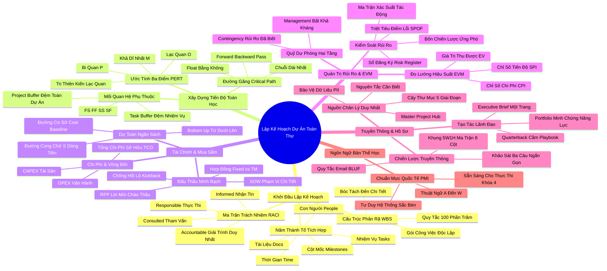

# Tóm Tắt Tổng Quan Toàn Thư: Lập Kế Hoạch Dự Án — Kết Nối Toàn Diện
*(Master Executive Summary: Project Planning: Putting It All Together — Google Project Management Professional Certificate)*

---

## THÔNG ĐIỆP CỐT LÕI TỐI CAO (GRAND MASTER ESSENCE)

> **"Một kế hoạch xuất sắc không phải là một văn kiện bất biến dự đoán chính xác tương lai, mà là một hệ thống vận hành tích hợp giúp đội ngũ điều hướng sự bất định với sự tự tin tuyệt đối."**  
> Khóa học 3: *Lập Kế Hoạch Dự Án: Kết Nối Toàn Diện (Project Planning: Putting It All Together)* thuộc Chứng chỉ Chuyên nghiệp Quản trị Dự án của Google là mắt xích quan trọng nhất biến các mục tiêu chiến lược trừu tượng trong Hiến chương Dự án (Project Charter) thành một bản thiết kế thi công cụ thể, khả thi và có thể đo lường định lượng.  
> Thông qua sự cộng hưởng của **Ngũ Hành Lập Kế Hoạch**:
> 1. **Cấu trúc & Trách nhiệm**: Phân rã công việc (WBS) và Ma trận phân nhiệm (RACI).
> 2. **Tiến độ & Thời gian**: Toán học đường găng (Critical Path Method - CPM) và Ước tính 3 điểm (PERT).
> 3. **Tài chính & Mua sắm**: Đường cơ sở ngân sách (Cost Baseline), Tổng chi phí sở hữu (TCO) và Đấu thầu minh bạch (SOW/RFP).
> 4. **Bảo toàn Mục tiêu**: Quản trị rủi ro đa tầng (Risk Matrix, SPOF, Quỹ dự phòng Contingency & Management Reserves).
> 5. **Huyết mạch Vận hành**: Kế hoạch truyền thông (5W1H, BLUF) và Nguồn chân lý hồ sơ duy nhất (Single Source of Truth / Master Project Hub).  
> Người quản lý dự án chuyển hóa từ một "người dập lửa sự vụ" thành một **Nhà Kiến Thiết Chiến Lược (Strategic Architect)**, sẵn sàng dẫn dắt dự án vượt qua mọi giông bão của Giai đoạn Thực thi (Execution).

---

## TỔNG QUAN HỆ THỐNG 6 CHƯƠNG TOÀN KHÓA HỌC

| STT | Chương / Học Phần | Trọng Tâm Chiến Lược | Công Cụ & Khung Phương Pháp Cốt Lõi | Giá Trị Chuyển Hóa Năng Lực |
| :---: | :--- | :--- | :--- | :--- |
| **01** | **Bắt đầu Giai đoạn Lập kế hoạch** *(Beginning the Planning Phase)* | Chuyển giao từ Khởi tạo; Khám phá 5 thành tố của Kế hoạch; Phân rã phạm vi và Phân định trách nhiệm. | 5 Thành tố (Tasks, Milestones, People, Docs, Time), WBS (Quy tắc 100%), Ma trận RACI. | Làm chủ phạm vi, xóa bỏ vùng xám trách nhiệm, ngăn chặn xung đột vai trò. |
| **02** | **Xây dựng Kế hoạch Dự án** *(Building a Project Plan)* | Lập lịch trình toán học; Xử lý mối phụ thuộc; Tìm đường găng và Khắc phục thiên kiến lập kế hoạch. | Critical Path Method (CPM), Forward/Backward Pass, Float/Slack, 4 Dependencies (FS/FF/SS/SF), PERT 3 điểm, Gantt & Kanban. | Nắm chắc thời gian tối thiểu hoàn thành, chủ động điều phối đệm thời gian chống trượt hạn. |
| **03** | **Quản lý Ngân sách và Mua sắm** *(Managing Budgeting & Procurement)* | Dự toán tài chính từ dưới lên; Kiểm soát chi phí vòng đời; Đấu thầu minh bạch và Đạo đức hợp đồng. | Bottom-up Budgeting, Cost Baseline, CAPEX vs OPEX, TCO, SOW, RFP, Hợp đồng Fixed vs T&M, Chống Kickback. | Làm chủ dòng tiền, tối ưu hóa tổng chi phí sở hữu, bảo vệ dự án trước rủi ro pháp lý. |
| **04** | **Quản trị Rủi ro Hiệu quả** *(Managing Risks Effectively)* | Nhận diện biến cố tiềm ẩn; Lượng hóa xác suất/tác động; Xóa bỏ điểm lỗi đơn lẻ; Xây dựng 2 tầng quỹ dự phòng. | Risk Register, Ma trận Xác suất - Tác động, Triệt tiêu SPOF, 4 Chiến lược (Né tránh, Giảm thiểu, Chuyển giao, Chấp nhận), Contingency vs Management Reserves. | Bảo toàn tính mạng của dự án trước những cú sốc thị trường và sự cố kỹ thuật bất ngờ. |
| **05** | **Tổ chức Truyền thông và Hồ sơ** *(Organizing Communication & Docs)* | Thiết lập dòng chảy thông tin thông suốt; Chống quá tải hòm thư; Quản trị hồ sơ tập trung và Bảo mật dữ liệu. | Ma trận Truyền thông 5W1H, Quy tắc Email BLUF, Khảo sát 3 câu, Master Project Hub, Nguyên tắc Need-to-know, Bảo vệ PII, Executive Brief. | Giúp toàn đội ngũ đồng thuận 100%, bảo vệ tính liên tục của dự án, biến tạo tác thành hồ sơ năng lực. |
| **06** | **Bảng Thuật ngữ và Định nghĩa** *(Glossary and Definitions)* | Hệ thống hóa toàn bộ bản thể học thuật ngữ quốc tế chuẩn PMI / Google từ A đến W. | EVM (CPI/SPI/CV/SV), SOW, RFP, Baseline, Float, SPOF, PDM, Planning Fallacy, Knowledge Management. | Định hình tư duy ngôn ngữ chuyên nghiệp, giao tiếp đẳng cấp quốc tế, tự tin thi các chứng chỉ PM. |

---

## 15 BÀI HỌC THEN CHỐT TOÀN DIỆN (MASTER KEY TAKEAWAYS)

### TRỤ CỘT I: CẤU TRÚC VÀ TRÁCH NHIỆM (PHẠM VI & CON NGƯỜI)

#### 1. Nguyên lý 5 thành tố tích hợp của một Bản Kế hoạch Hoàn chỉnh
- **Phân tích bản chất & Tư duy cốt lõi**:
  - Bản kế hoạch dự án không phải là một biểu đồ tiến độ đơn lẻ. Nó là một thực thể sống tích hợp hài hòa 5 thành tố không thể tách rời: **Nhiệm vụ (Tasks)**, **Cột mốc (Milestones)**, **Con người (People)**, **Hồ sơ tài liệu (Documentation)**, và **Thời gian (Time)**.
  - Thiếu bất kỳ thành tố nào, chiếc kiềng 5 chân của dự án sẽ sụp đổ: Có nhiệm vụ mà thiếu thời gian sẽ biến thành lời hứa suông; có con người mà thiếu tài liệu sẽ tạo ra sự hiểu nhầm; có cột mốc mà thiếu người chịu trách nhiệm sẽ dẫn đến sự vô chủ.
- **Công cụ & Khung phương pháp**: Khung Kiến Trúc Kế Hoạch Dự Án Tích Hợp (Integrated Project Plan Framework).
- **Ví dụ thực tiễn**: Trong dự án triển khai hệ thống thanh toán số cho chuỗi siêu thị, PM không chỉ liệt kê các đầu việc lập trình mà còn gắn liền từng đầu việc với kỹ sư phụ trách, tài liệu quy chuẩn kỹ thuật API, thời hạn hoàn thành và mốc kiểm thử chấp nhận của người dùng (UAT Milestone).

#### 2. Nghệ thuật phân rã WBS và Quy tắc 100% không khoan nhượng
- **Phân tích bản chất & Tư duy cốt lõi**:
  - Không ai có thể quản lý một tảng đá nguyên khối nặng 10 tấn, nhưng bất kỳ ai cũng có thể vận chuyển 10.000 viên sỏi nhỏ. **Cấu trúc phân rã công việc (Work Breakdown Structure - WBS)** là công cụ tư duy chuyển hóa sự phức tạp áp đảo thành những gói công việc (Work Packages) cụ thể, độc lập và có thể dự toán chính xác.
  - **Quy tắc 100%**: Các nhánh con ở cấp dưới khi cộng lại phải bao quát chính xác 100% phạm vi của nhánh mẹ ở cấp trên; không được phép bỏ sót bất kỳ hạng mục nào và tuyệt đối không chèn thêm các công việc nằm ngoài phạm vi thỏa thuận.
- **Công cụ & Khung phương pháp**: WBS Hierarchy (Dự án $\to$ Giai đoạn $\to$ Đề mục lớn $\to$ Gói công việc $\to$ Nhiệm vụ chi tiết).
- **Ví dụ thực tiễn**: Xây dựng một ngôi nhà: WBS chia thành Móng, Khung, Hoàn thiện nội thất, Hệ thống điện nước. Phần Móng lại bóc tách thành Đào đất, Đổ bê tông lót, Buộc thép, Đổ bê tông dầm móng. Không có bất kỳ chi phí phát sinh nào lọt ra ngoài WBS.

#### 3. Ma trận RACI – Triệt tiêu hoàn toàn vùng xám trách nhiệm
- **Phân tích bản chất & Tư duy cốt lõi**:
  - "Lắm sãi không ai đóng cửa chùa" là căn bệnh kinh niên phá hủy các dự án. Khi một nhiệm vụ bị hỏng, mọi người sẽ đổ lỗi cho nhau nếu vai trò không được định danh rõ ràng bằng văn bản.
  - Ma trận RACI phân định ranh giới dứt khoát: Chỉ có duy nhất **1 chữ A (Accountable - Người chịu trách nhiệm giải trình)** cho mỗi nhiệm vụ; chữ **R (Responsible - Người trực tiếp thực thi)** đảm bảo có bàn tay làm việc; chữ **C (Consulted - Người được tham vấn)** cung cấp chuyên môn hai chiều; và chữ **I (Informed - Người được thông báo)** nhận tin một chiều.
- **Công cụ & Khung phương pháp**: Ma trận RACI (Responsible, Accountable, Consulted, Informed).
- **Ví dụ thực tiễn**: Khi soạn thảo hợp đồng mua sắm máy chủ: Chuyên viên Pháp chế là **R** (viết hợp đồng); Project Manager là **A** (duyệt và chịu trách nhiệm trước Ban giám đốc); Kỹ sư trưởng là **C** (tham vấn cấu hình); và Trưởng phòng Kế toán là **I** (nhận thông báo ngày ký để chuẩn bị tiền).

---

### TRỤ CỘT II: TOÁN HỌC TIẾN ĐỘ VÀ ĐƯỜNG GĂNG (THỜI GIAN)

#### 4. Phương pháp Đường găng (CPM) và Khoảng thời gian dự trữ (Float/Slack)
- **Phân tích bản chất & Tư duy cốt lõi**:
  - Trong một mạng lưới gồm hàng trăm công việc đan xen, làm thế nào để PM biết công việc nào là "sống còn" cần dồn toàn lực giám sát? Câu trả lời là **Phương pháp Đường găng (Critical Path Method - CPM)**.
  - Đường găng là chuỗi các nhiệm vụ nối tiếp dài nhất từ đầu đến cuối dự án. Điểm đặc trưng toán học của đường găng là **Thời gian dự trữ bằng không ($Float = 0$)**. Bất kỳ một ngày chậm trễ nào trên đường găng sẽ tự động đẩy lùi ngày khánh thành của toàn bộ dự án đúng một ngày.
- **Công cụ & Khung phương pháp**: Thuật toán Duyệt xuôi (Forward Pass) tìm ES/EF; Thuật toán Duyệt ngược (Backward Pass) tìm LS/LF; Công thức $Float = LS - ES = LF - EF$.
- **Ví dụ thực tiễn**: Trong dự án phóng vệ tinh: Chế tạo tên lửa đẩy và Đăng ký tần số quỹ đạo nằm trên Đường găng ($Float = 0$). Thiết kế logo kỷ niệm có $Float = 45$ ngày. PM tuyệt đối không phân bổ tài nguyên sang làm logo nếu tên lửa đẩy đang có nguy cơ trễ hạn dù chỉ 1 giờ.

#### 5. Bốn mối quan hệ phụ thuộc và Hệ sinh thái Đệm thời gian (Buffers)
- **Phân tích bản chất & Tư duy cốt lõi**:
  - Các công việc trong dự án không đứng độc lập mà liên kết chặt chẽ qua 4 quan hệ logic: **FS (Kết thúc đến Bắt đầu - phổ biến nhất)**, **SS (Bắt đầu song song)**, **FF (Kết thúc đồng thời)**, và **SF (Bắt đầu đến Kết thúc)**.
  - Để bảo vệ dự án trước các biến số bất khả kháng mà không làm phình to lịch trình một cách giả tạo, PM phải áp dụng chiến lược **Thời gian đệm tập trung (Project Buffer)** đặt ở cuối dự án thay vì nhồi nhét đệm vào từng nhiệm vụ con (Task Buffers), tránh kích hoạt Định luật Parkinson (công việc sẽ tự giãn nở để lấp đầy thời gian được giao).
- **Công cụ & Khung phương pháp**: Sơ đồ mạng lưới PDM (Precedence Diagramming Method) và Quản trị Chuỗi tới hạn (Critical Chain Project Management - CCPM).
- **Ví dụ thực tiễn**: Trong xây dựng phần mềm: Viết tài liệu hướng dẫn và Kiểm thử hệ thống có quan hệ FF (phải cùng kết thúc vào ngày nghiệm thu). Thay vì cho mỗi lập trình viên cộng thêm 3 ngày nghỉ ngơi, PM thu hồi toàn bộ số ngày đó để tạo một Project Buffer 2 tuần ở cuối dự án.

#### 6. Chữa lành Thiên kiến Lạc quan bằng Công thức PERT 3 điểm
- **Phân tích bản chất & Tư duy cốt lõi**:
  - Con người có xu hướng tâm lý tự nhiên mắc phải **Thiên kiến Lạc quan (Optimism Bias)** và **Ngụy biện Lập kế hoạch (Planning Fallacy)**: Luôn tin rằng thời tiết sẽ đẹp, không ai ốm đau và code sẽ chạy ngay trong lần đầu tiên.
  - Kỹ thuật Đánh giá và Rà soát Chương trình (PERT) buộc người lập kế hoạch phải đối diện với thực tế bằng cách thu thập 3 kịch bản: Lạc quan ($O$), Khả dĩ nhất ($M$), và Bi quan ($P$).
- **Công cụ & Khung phương pháp**: Công thức Ước tính PERT: $\mu = \frac{O + 4M + P}{6}$; Độ lệch chuẩn: $\sigma = \frac{P - O}{6}$.
- **Ví dụ thực tiễn**: Đào tạo nhân viên mới: Lạc quan = 3 ngày; Khả dĩ nhất = 5 ngày; Bi quan (nếu hệ thống mạng nội bộ sập) = 13 ngày.  
  Thời gian kỳ vọng PERT: $(3 + 4 \times 5 + 13) / 6 = 36 / 6 = 6$ ngày. Con số 6 ngày này thực tế và đáng tin cậy hơn con số 5 ngày cảm tính rất nhiều.

---

### TRỤ CỘT III: TÀI CHÍNH, ĐẦU TƯ VÀ ĐẤU THẦU (TIỀN TỆ)

#### 7. Đường cơ sở Ngân sách (Cost Baseline) và Dự toán từ dưới lên (Bottom-up)
- **Phân tích bản chất & Tư duy cốt lõi**:
  - Dự toán từ trên xuống (Top-down) chỉ hữu ích cho việc ước lượng sơ bộ ban đầu. Để vận hành dự án, PM bắt buộc phải thực hiện **Dự toán từ dưới lên (Bottom-up)**: Đi từ các gói công việc nhỏ nhất trong WBS, nhân khối lượng với đơn giá tài nguyên (Resource Cost Rates), rồi cộng dồn lên từng cấp.
  - Sau khi được phê duyệt, ngân sách được "đóng băng" thành **Đường cơ sở Ngân sách (Cost Baseline)** và phân bổ trải dài theo thời gian (Time-phased Budget) tạo thành Đường cong chữ S (S-Curve) giúp doanh nghiệp chủ động chuẩn bị dòng tiền mặt (Cash Flow).
- **Công cụ & Khung phương pháp**: Bottom-up Cost Aggregation & S-Curve Cash Flow Management.
- **Ví dụ thực tiễn**: Một dự án marketing 100.000 USD được bóc tách: Thiết kế banner (50 cái $\times$ 100 USD = 5.000 USD); Thuê Influencer (3 người $\times$ 15.000 USD = 45.000 USD); Chạy quảng cáo số (50.000 USD). Mọi con số đều có căn cứ hợp đồng thay vì con số ước chừng vô căn cứ.

#### 8. Phân biệt CAPEX vs OPEX và Tối ưu Tổng chi phí Sở hữu (TCO)
- **Phân tích bản chất & Tư duy cốt lõi**:
  - **CAPEX (Chi phí vốn)** là tiền mua sắm tài sản cố định mang lại giá trị nhiều năm (như xây nhà xưởng, mua máy chủ phần cứng); **OPEX (Chi phí vận hành)** là tiền tiêu hao hằng ngày để duy trì hoạt động (tiền điện, lương, thuê dịch vụ SaaS).
  - Một PM có tầm nhìn chiến lược không bao giờ chỉ nhìn vào giá mua ban đầu. Họ luôn đánh giá **Tổng chi phí Sở hữu (Total Cost of Ownership - TCO)** suốt vòng đời sản phẩm: Giá mua + Chi phí triển khai + Chi phí bảo trì/vận hành hàng năm + Chi phí đào tạo - Giá trị thanh lý.
- **Công cụ & Khung phương pháp**: Mô hình Phân tích Vòng đời Chi phí TCO (Life-Cycle Costing).
- **Ví dụ thực tiễn**: Mua máy in công nghiệp giá 5.000 USD (mực in 500 USD/hộp, in được 1.000 trang) so với máy in giá 8.000 USD (mực in 200 USD/hộp, in được 5.000 trang). Sau 3 năm sử dụng với 100.000 trang in, chiếc máy đắt tiền ban đầu lại giúp doanh nghiệp tiết kiệm hơn 25.000 USD chi phí vận hành.

#### 9. Nghệ thuật Mua sắm: SOW, RFP, Cơ cấu Hợp đồng và Đạo đức Nghề nghiệp
- **Phân tích bản chất & Tư duy cốt lõi**:
  - Mua sắm (Procurement) là nghệ thuật mở rộng năng lực của tổ chức thông qua các nhà thầu bên ngoài. Ranh giới của việc mua sắm thành công nằm ở **Bản mô tả phạm vi công việc (Statement of Work - SOW)** cực kỳ chi tiết kèm tiêu chuẩn nghiệm thu định lượng.
  - Lựa chọn đúng loại hình hợp đồng: **Hợp đồng trọn gói (Fixed-Price)** khi phạm vi rõ ràng (nhà thầu chịu rủi ro); **Hợp đồng Thời gian và Vật liệu (Time & Materials - T&M)** khi dự án cần nghiên cứu linh hoạt (bên mua chịu rủi ro).
  - Tuyệt đối giữ vững chuẩn mực đạo đức: Nói không với tiền lại quả (Kickbacks) và luôn bảo vệ bí mật kinh doanh bằng Thỏa thuận bảo mật (NDA).
- **Công cụ & Khung phương pháp**: Quy trình Mua sắm 4 giai đoạn (SOW $\to$ RFP $\to$ Proposal Evaluation $\to$ Contract Admin).
- **Ví dụ thực tiễn**: Thuê công ty thiết kế nội thất: PM soạn SOW quy định rõ từng loại gỗ, độ dày kính, hạn chót thi công và điều khoản phạt 1%/ngày nếu trễ hạn. Hợp đồng ký theo dạng trọn gói Fixed-Price. Khi giá gỗ trên thị trường tăng vọt 20%, chủ đầu tư hoàn toàn được bảo vệ về mặt tài chính.

---

### TRỤ CỘT IV: QUẢN TRỊ RỦI RO VÀ ĐO LƯỜNG HIỆU SUẤT (AN TOÀN & KIỂM SOÁT)

#### 10. Kiến trúc Quản trị Rủi ro Đa tầng và Triệt tiêu Điểm lỗi Đơn lẻ (SPOF)
- **Phân tích bản chất & Tư duy cốt lõi**:
  - Rủi ro không phải là điều xấu; rủi ro là một biến cố bất định trong tương lai có thể mang lại thiệt hại (tiêu cực) hoặc cơ hội (tích cực). Quản trị rủi ro là việc chủ động kiểm soát số phận của dự án thay vì phó mặc cho may rủi.
  - Công cụ trung tâm là **Sổ đăng ký rủi ro (Risk Register)** kết hợp **Ma trận Xác suất - Tác động (Probability & Impact Matrix)**.
  - Nhiệm vụ sống còn số 1 của PM là truy tìm và triệt tiêu mọi **Điểm lỗi đơn lẻ (Single Point of Failure - SPOF)** — nơi mà sự sụp đổ của một cá nhân, một máy chủ hoặc một nhà cung cấp có thể làm tê liệt toàn bộ hệ thống.
- **Công cụ & Khung phương pháp**: Risk Register, Risk Matrix 3x3 hoặc 5x5, Fishbone Diagram (Nguyên nhân gốc rễ), Phân tích SPOF.
- **Ví dụ thực tiễn**: Một dự án thương mại điện tử chỉ có một cổng thanh toán trực tuyến duy nhất. Nếu cổng này bị bảo trì vào ngày siêu khuyến mãi 11/11, công ty sẽ mất trắng hàng tỷ đồng. PM nhận diện đây là SPOF và chủ động tích hợp thêm 2 cổng thanh toán dự phòng trước ngày mở bán.

#### 11. Bốn Chiến lược Ứng phó và Phân lập Hai tầng Quỹ Dự phòng
- **Phân tích bản chất & Tư duy cốt lõi**:
  - Đối với mỗi rủi ro đã nhận diện, PM có 4 chiến lược kinh điển: **Né tránh (Avoid)**, **Giảm thiểu (Mitigate)**, **Chuyển giao (Transfer)** (như mua bảo hiểm hoặc thuê ngoài), và **Chấp nhận (Accept)**.
  - Cần phân biệt rõ ràng hai tầng quỹ dự phòng:
    1. **Dự phòng rủi ro đã xác định (Contingency Reserves)**: Dành cho rủi ro "Đã biết - Chưa xảy ra" (Known-Unknowns), nằm trong Đường cơ sở chi phí và thuộc thẩm quyền giải ngân của PM.
    2. **Dự phòng quản lý (Management Reserves)**: Dành cho rủi ro "Hoàn toàn bất ngờ" (Unknown-Unknowns), nằm ngoài đường cơ sở và chỉ có Ban lãnh đạo cấp cao mới có quyền phê duyệt.
- **Công cụ & Khung phương pháp**: Kỹ thuật Phân tích Dự phòng (Reserve Analysis) định kỳ.
- **Ví dụ thực tiễn**: Xây dựng cầu cảng: Rủi ro gặp đá ngầm đã được khảo sát địa chất $\to$ Lập Contingency Reserve 50.000 USD (PM tự quyết khi thi công chạm đá). Rủi ro chiến tranh hoặc động đất 8 độ Richter $\to$ Thuộc Management Reserve do Hội đồng quản trị nắm giữ.

#### 12. Giám sát Hiệu suất Khách quan bằng Quản trị Giá trị Thu được (EVM)
- **Phân tích bản chất & Tư duy cốt lõi**:
  - Không có công cụ nào phơi bày sự thật về sức khỏe của dự án tàn nhẫn và chính xác hơn **Quản trị Giá trị Thu được (Earned Value Management - EVM)**.
  - Bằng cách liên kết ba đại lượng: **Giá trị kế hoạch (PV)**, **Chi phí thực tế (AC)**, và **Giá trị thu được từ sản phẩm thực tế (EV)**, EVM xóa bỏ hoàn toàn các báo cáo tiến độ mang tính cảm tính hoặc che giấu sự thật.
- **Công cụ & Khung phương pháp**:
  - $\text{CPI} = \frac{EV}{AC}$ (Hiệu suất chi phí: $>1.0$ là tiết kiệm; $<1.0$ là đội chi phí).
  - $\text{SPI} = \frac{EV}{PV}$ (Hiệu suất tiến độ: $>1.0$ là vượt tiến độ; $<1.0$ là chậm tiến độ).
- **Ví dụ thực tiễn**: Sau 6 tháng, ngân sách dự kiến tiêu là 100.000 USD ($PV$), kế toán báo đã chi đúng 100.000 USD ($AC$). Ban giám đốc nghĩ mọi thứ rất tốt. Nhưng PM tính toán khối lượng công việc thực tế được nghiệm thu chỉ đạt 70.000 USD ($EV$).  
  $\text{CPI} = 70.000 / 100.000 = 0.70$ và $\text{SPI} = 70.000 / 100.000 = 0.70$. Thực tế dự án đang vừa chậm 30% tiến độ vừa lãng phí 30% ngân sách. Nhờ EVM, PM lập tức tái cấu trúc lại nhóm làm việc.

---

### TRỤ CỘT V: HUYẾT MẠCH TRUYỀN THÔNG VÀ HỒ SƠ TÀI LIỆU (VẬN HÀNH & KẾ THỪA)

#### 13. Kế hoạch Truyền thông 5W1H và Quy tắc Email BLUF
- **Phân tích bản chất & Tư duy cốt lõi**:
  - Truyền thông là hệ tuần hoàn của dự án. Một kế hoạch truyền thông chuẩn mực (Communication Plan) phải giải quyết trọn vẹn 6 câu hỏi: **What (Nội dung)**, **Why (Mục đích)**, **Who (Đối tượng tiếp nhận)**, **When (Tần suất)**, **Where (Kênh truyền thông)**, và **How (Định dạng trình bày)**.
  - Chống lại vấn nạn "Quá tải thông tin" (Information Overload) bằng **Quy tắc BLUF (Bottom Line Up Front)**: Đưa kết luận, yêu cầu phê duyệt và hạn chót lên ngay 2-3 câu đầu tiên của email.
- **Công cụ & Khung phương pháp**: Communication Matrix 8 cột và Cấu trúc Email BLUF.
- **Ví dụ thực tiễn**: Thay vì viết email dài lê thê về sự cố đứt cáp mạng, PM gửi email cho Giám đốc Điều hành: `[CẦN DUYỆT TRƯỚC 12H] Chi 2.000 USD kích hoạt đường truyền 4G dự phòng để cứu sự kiện trực tuyến chiều nay. Nếu không duyệt trước 12h, 5.000 khách hàng sẽ không thể đăng nhập hội thảo. Chi tiết kỹ thuật đính kèm bên dưới.` Giám đốc duyệt ngay trong 2 phút.

#### 14. Nguồn Chân lý Duy nhất (Single Source of Truth) và Master Project Hub
- **Phân tích bản chất & Tư duy cốt lõi**:
  - Căn bệnh "Chết chìm trong hàng ngàn văn bản" (Death by a thousand documents) của Dan tại Google Research là lời cảnh tỉnh: Tạo ra quá nhiều tài liệu rời rạc sẽ giết chết sự tập trung của đội ngũ.
  - PM phải thiết lập một **Kho lưu trữ tập trung (Centralized Documentation)** đóng vai trò là "Nguồn chân lý duy nhất". Toàn bộ các liên kết vệ tinh phải được tích hợp vào một trang chủ duy nhất: **Tài liệu Điều phối Trung tâm (Master Project Hub / Master Tracker)**.
  - Tuân thủ nghiêm ngặt **Nguyên tắc Cần Biết (Need-to-know Basis)** và bảo vệ an toàn dữ liệu **Thông tin Định danh Cá nhân (PII)**.
- **Công cụ & Khung phương pháp**: Cây thư mục chuẩn 5 giai đoạn, Quy ước đặt tên file chuẩn ISO 8601, và Master Document Hub.
- **Ví dụ thực tiễn**: Tại Google, một trang Master Hub duy nhất lưu trữ liên kết đến: Kế hoạch WBS, Biểu đồ Gantt, Sổ đăng ký rủi ro, Biên bản họp và Danh bạ liên lạc. Bất kỳ kỹ sư hay lãnh đạo nào cần thông tin chỉ cần bookmark duy nhất 1 đường link này.

#### 15. Tạo tác Dự án (Artifacts) là Minh chứng Năng lực Lãnh đạo Đỉnh cao
- **Phân tích bản chất & Tư duy cốt lõi**:
  - Như Chris (Diversity PM tại Google) đã khẳng định: PM đóng vai trò như một **Tiền vệ kiến thiết (Quarterback)** trên sân bóng bầu dục — người cầm cuốn sách chiến thuật (Playbook) trên tay để điều phối trận đấu.
  - Các tạo tác dự án (Artifacts) như Báo cáo Tóm lược Điều hành (Executive Brief 1 trang), Ma trận RACI, Biểu đồ CPM chính là những sản phẩm vật chất cụ thể chứng minh tư duy mạch lạc và năng lực lãnh đạo của PM. Đây chính là bộ "Portfolio" đắt giá nhất giúp PM thăng tiến và chinh phục các cơ hội nghề nghiệp toàn cầu.
- **Công cụ & Khung phương pháp**: Executive Brief One-Pager Template & Portfolio Artifacts.
- **Ví dụ thực tiễn**: Trong buổi phỏng vấn vị trí Giám đốc Dự án Cấp cao, thay vì kể lể kinh nghiệm chung chung, ứng viên trình chiếu một bản Executive Brief mẫu 1 trang mô tả cách họ đã cứu vãn một dự án 10 triệu USD bị chậm tiến độ bằng phương pháp CPM và EVM. Ứng viên được nhận với mức lương tối đa của khung tuyển dụng.

---

## KẾ HOẠCH HÀNH ĐỘNG THỰC THI TOÀN KHÓA HỌC (MASTER ACTION PLAN)

### 1. Thói quen vi mô hàng ngày (Micro-habits)
- [ ] **Khởi đầu ngày mới với Đường găng**: Luôn mở bảng tiến độ kiểm tra trạng thái của các nhiệm vụ có $Float = 0$ trước khi mở hòm thư email.
- [ ] **Viết email chuẩn BLUF**: Đặt kết luận, yêu cầu hành động và thời hạn lên 2 câu đầu tiên của 100% email trao đổi công việc.
- [ ] **Nguyên tắc "Chưa ghi chép là chưa tồn tại"**: Viết ngay 3-5 gạch đầu dòng tóm tắt quyết định sau mỗi cuộc trao đổi trực tiếp hoặc chat nhanh.
- [ ] **Lưu trữ tập trung tức thì**: Đưa ngay tài liệu mới vào đúng cấu trúc thư mục trên Cloud; tuyệt đối không để file rải rác trên màn hình Desktop.
- [ ] **Tư duy định lượng rủi ro**: Mỗi khi nghe thấy một mối lo ngại, lập tức phân tích nó thành cặp số: Xác suất (%) và Mức độ tác động (1-5).

### 2. Kế hoạch triển khai tuần này (Immediate Implementation)
- [ ] **Kiểm toán lại Dự án Hiện tại theo 5 Thành tố**: Rà soát xem dự án của bạn có đang thiếu thành tố nào trong bộ ngũ hành (Tasks, Milestones, People, Docs, Time) hay không.
- [ ] **Thiết lập lại Ma trận RACI chuẩn hóa**: Họp với các trưởng nhóm để chốt lại duy nhất 1 chữ A cho mỗi gói công việc quan trọng.
- [ ] **Tính toán Đường găng và Float bằng phần mềm**: Nhập toàn bộ công việc và mối phụ thuộc vào Google Sheets / MS Project / Asana để xác định đường găng chính xác.
- [ ] **Xây dựng Bảng Kế hoạch Truyền thông 5W1H**: Lập bảng ma trận truyền thông 8 cột cho toàn bộ các bên liên quan từ nhân viên đến ban giám đốc.
- [ ] **Thiết lập Trang Master Project Hub**: Tạo một trang văn bản tổng hợp duy nhất chứa toàn bộ các liên kết quan trọng của dự án và chia sẻ cho đội ngũ.
- [ ] **Kiểm tra an toàn bảo mật PII**: Rà soát lại tất cả các bảng tính chứa dữ liệu khách hàng hoặc lương thưởng, khóa quyền truy cập công khai.
- [ ] **Khởi tạo Sổ đăng ký rủi ro (Risk Register)**: Liệt kê tối thiểu 10 rủi ro tiềm ẩn lớn nhất của dự án kèm kế hoạch giảm thiểu cụ thể.

### 3. Chuyển đổi trung và dài hạn (Long-term Mastery)
- [ ] **Hoàn thiện Bộ Kế hoạch Dự án Tích hợp (IPMP)**: Đóng gói toàn bộ các kế hoạch thành phần (Phạm vi, Tiến độ, Ngân sách, Mua sắm, Rủi ro, Truyền thông) và trình duyệt khóa Baseline chính thức.
- [ ] **Áp dụng Giám sát EVM định kỳ**: Đo lường hai chỉ số CPI và SPI hàng tháng để đưa vào báo cáo gửi Hội đồng quản trị.
- [ ] **Chuẩn hóa Thư viện WBS và SOW mẫu của Tổ chức**: Xây dựng kho tài liệu mẫu để rút ngắn 50% thời gian lập kế hoạch cho các dự án tương lai.
- [ ] **Xây dựng Bộ Hồ sơ Năng lực Cá nhân (PM Artifact Portfolio)**: Tuyển chọn và làm sạch định danh 5 tạo tác xuất sắc nhất bạn đã làm trong khóa học để phục vụ thăng tiến.
- [ ] **Thiết lập Văn hóa Quản trị Tri thức (Knowledge Sharing)**: Tổ chức các buổi họp đúc kết bài học kinh nghiệm (Retrospective) sau mỗi cột mốc lớn và lưu trữ tập trung.
- [ ] **Sẵn sàng chuyển giao sang Giai đoạn Thực thi (Execution Phase)**: Nắm vững bộ công cụ lập kế hoạch để tự tin bước sang Khóa học 4: *Thực thi Dự án: Vận hành Dự án trong Thực tế*.

---

## CÂU HỎI TỰ VẤN & PHẢN TƯ TOÀN DIỆN (MASTER REFLECTION QUESTIONS)

### Góc phần tư 1: Tự nhận thức (Self-Awareness)
1. *Phong cách lập kế hoạch của tôi từ trước đến nay thiên về cảm tính, thói quen hay dựa trên dữ liệu toán học và quy chuẩn khoa học?*
2. *Tôi có xu hướng né tránh việc thảo luận về các kịch bản rủi ro tồi tệ nhất vì sợ làm giảm nhuệ khí của đội ngũ hay không?*
3. *Bản thân tôi có đang đóng vai trò là "người giải quyết sự vụ" hay đang thực sự là "nhạc trưởng điều phối chiến lược" của dự án?*
4. *Khi đối diện với áp lực từ Ban giám đốc đòi rút ngắn 30% tiến độ, phản xạ đầu tiên của tôi là gật đầu tuân lệnh hay mở biểu đồ Đường găng để thương lượng dựa trên dữ liệu?*
5. *Tôi có đang vô tình tích trữ thông tin để duy trì quyền lực cá nhân thay vì chia sẻ minh bạch cho đội ngũ dựa trên Nguồn chân lý duy nhất?*
6. *Tôi cảm thấy thế nào khi một chỉ số EVM (CPI hoặc SPI) cho thấy dự án của mình đang kém hiệu quả: Tôi muốn che giấu nó hay dùng nó làm đòn bẩy cải tổ?*

### Góc phần tư 2: Tư duy phản biện (Critical Inquiry)
7. *Tại sao việc lập kế hoạch quá chi tiết đến từng phút từng giây trong môi trường biến động nhanh lại nguy hiểm không kém việc hoàn toàn không có kế hoạch?*
8. *Làm thế nào để cân bằng giữa yêu cầu "Đảm bảo chất lượng nghiêm ngặt" với áp lực "Tối ưu hóa ngân sách và chi phí sở hữu TCO"?*
9. *Nếu một thành viên quan trọng trong nhóm không đồng ý với vai trò được phân bổ trong ma trận RACI, giải pháp lãnh đạo tận gốc ở đây là gì?*
10. *Trong trường hợp nào thì việc chấp nhận một Điểm lỗi đơn lẻ (SPOF) là một quyết định kinh doanh có tính toán, và khi nào nó là sự vô trách nhiệm nghề nghiệp?*
11. *Tại sao các dự án công nghệ lớn trên thế giới vẫn thường xuyên bị đội ngân sách và trễ hạn dù có trong tay những công cụ lập kế hoạch hiện đại nhất?*
12. *Nguyên tắc bảo mật "Need-to-know" và tinh thần "Minh bạch triệt để (Radical Transparency)" trong văn hóa doanh nghiệp hiện đại có thực sự triệt tiêu nhau không?*

### Góc phần tư 3: Thách thức giới hạn (Limit Expansion)
13. *Làm sao tôi có thể cắt giảm 40% thời gian họp hành hàng tuần của dự án mà mức độ thấu hiểu mục tiêu của toàn đội ngũ vẫn tăng lên gấp đôi?*
14. *Nếu toàn bộ ngân sách dự án bị cắt giảm một nửa nhưng mục tiêu bàn giao không thay đổi, tôi sẽ tái cấu trúc WBS và hợp đồng mua sắm ra sao để sinh tồn?*
15. *Tôi có thể ứng dụng Trí tuệ Nhân tạo Tạo sinh (GenAI) vào khâu nào trong quy trình lập kế hoạch để tăng tốc độ bóc tách WBS và viết SOW lên 10 lần?*
16. *Bằng cách nào tôi có thể biến một bản Kế hoạch Quản trị Rủi ro từ một tập tài liệu nằm im trong ngăn kéo thành một công cụ thảo luận sôi nổi trong mỗi buổi sáng?*
17. *Nếu tôi phải xây dựng một dự án với một đội ngũ 100% làm việc từ xa ở 10 quốc gia khác nhau chưa từng gặp mặt, tôi sẽ thiết kế Master Project Hub như thế nào để gắn kết họ?*
18. *Làm thế nào để lượng hóa được giá trị kinh tế của niềm tin và sự thấu cảm (Empathy) trong việc giữ chân nhân tài trên đường găng dự án?*

### Góc phần tư 4: Cam kết chuyển hóa (Transformative Commitment)
19. *Ba nguyên tắc vàng nào trong toàn bộ Khóa học 3 mà tôi cam kết sẽ khắc cốt ghi tâm và áp dụng vào công việc quản trị dự án mỗi ngày kể từ hôm nay?*
20. *Tôi sẽ bắt đầu xây dựng bộ Hồ sơ Năng lực Tạo tác Dự án (Artifact Portfolio) của cá nhân mình như thế nào để sẵn sàng cho bước nhảy vọt sự nghiệp trong vòng 12 tháng tới?*
21. *Lời thề danh dự của tôi về tính chính trực trong việc báo cáo số liệu tiến độ, ngân sách EVM và bảo vệ dữ liệu PII của khách hàng là gì?*
22. *Tôi sẽ làm gì để truyền cảm hứng và đào tạo lại tư duy lập kế hoạch bài bản này cho các đồng nghiệp và cấp dưới trong tổ chức của mình?*
23. *Khi bước sang Khóa học 4 (Thực thi dự án), tôi sẽ chuẩn bị tâm thế ra sao để bảo vệ đường cơ sở (Baseline) trước những biến cố không thể tránh khỏi của thực tế?*
24. *Định nghĩa mới của tôi về một "Project Manager Xuất Sắc" sau khi hoàn thành toàn bộ khóa học này là gì?*
25. *Hành động cụ thể đầu tiên tôi sẽ thực hiện ngay trong vòng 24 giờ tới để nâng tầm dự án hiện tại của mình lên chuẩn mực chuyên nghiệp quốc tế là gì?*

---

## BẢN ĐỒ TƯ DUY TỔNG QUAN TOÀN THƯ (MASTER MERMAID MINDMAP)

