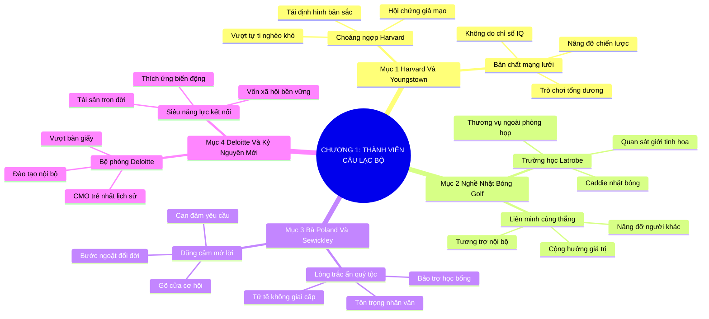

# SƠ ĐỒ TƯ DUY TRỰC QUAN: CHƯƠNG 1: TRỞ THÀNH THÀNH VIÊN CỦA CÂU LẠC BỘ (BECOMING A MEMBER OF THE CLUB)
* **Thuộc phần**: Phần 1: Tư Duy Kết Nối (The Mindset)
* **Tác phẩm**: Đừng Bao Giờ Đi Ăn Một Mình (Never Eat Alone) - Keith Ferrazzi
* **Chuẩn hóa**: Document Structure-Anchored v2.4 (Không nhãn meta thừa, phản ánh 100% cấu trúc tài liệu)

---

## 🌳 SƠ ĐỒ TƯ DUY MERMAID (4-5 TẦNG CHI TIẾT)

---

## 🧬 BẢNG PHÂN CẤP TRUY HỒI CHỦ ĐỘNG (ACTIVE RECALL HIERARCHY)
Cấu trúc hóa tri thức theo các nhánh tài liệu phục vụ ôn tập nhanh và khắc sâu trí nhớ:

| 📑 Nhánh Mục Tài Liệu | 🔑 Từ Khóa Vàng / Khái Niệm | 📝 Nội Dung Truy Hồi Chủ Động (Active Recall) |
| :--- | :--- | :--- |
| Mục 1: Harvard Và Youngstown | **Vượt tự ti nghèo khó** | Xuất thân không định nghĩa tương lai; sự khác biệt cốt lõi nằm ở mạng lưới quan hệ nâng đỡ nhau. |
| Mục 1: Harvard Và Youngstown | **Tư duy tổng dương** | Thành công không phải cạnh tranh triệt hạ mà là cuộc đua nâng đỡ nhau cùng tiến bước. |
| Mục 2: Bài Học Caddie Latrobe | **Trường học sân golf** | Quan sát các doanh nhân thành đạt trên sân golf để hiểu cách thương vụ nảy mầm từ sự gắn kết thân tình. |
| Mục 2: Bài Học Caddie Latrobe | **Liên minh cùng thắng** | Giới tinh hoa duy trì sức mạnh bằng nguyên tắc tương trợ và ưu tiên đầu tư cho nhau. |
| Mục 3: Bà Poland Và Sewickley | **Lòng trắc ẩn & Dũng cảm mở lời** | Sự tử tế của bà Poland và lòng dũng cảm gõ cửa xin giúp đỡ đã mở ra cánh cửa học viện Sewickley. |
| Mục 4: Deloitte & Kỷ Nguyên Mới | **Vốn xã hội bền vững** | Chủ động nâng tầm ảnh hưởng tại Deloitte và biến mạng lưới kết nối thành siêu năng lực đổi đời. |

---

## ⚡ BẢNG NEO TRÍ NHỚ NHANH (MEMORY ANCHOR CHEAT SHEET)
Tóm tắt cô đọng các công thức và quy tắc hành động của chương:

| 📑 Phần/Mục Tài Liệu | 📌 Khái Niệm Cốt Lõi | ⚖️ Nguyên Lý Vàng | 🚀 Hành Động Chuyển Hóa Ngay |
| :--- | :--- | :--- | :--- |
| Mục 1: Harvard & Youngstown | **Tư duy tổng dương** | Từ bỏ cạnh tranh triệt hạ, chọn liên minh cùng thắng | Mở rộng cơ hội cho mọi người |
| Mục 2: Bài học sân golf | **Quan sát ngầm** | Học hỏi phong thái giao tiếp của người thành đạt | Gắn kết tự nhiên ngoài phòng họp |
| Mục 3: Bà Poland | **Dũng cảm yêu cầu** | Can đảm mở lời xin sự giúp đỡ đĩnh đạc | Mở khóa những cánh cửa tưởng chừng kiên cố |
| Mục 4: Deloitte | **Vốn xã hội** | Chủ động tạo ảnh hưởng nội bộ để thăng tiến | Xây dựng tài sản quan hệ trọn đời |

