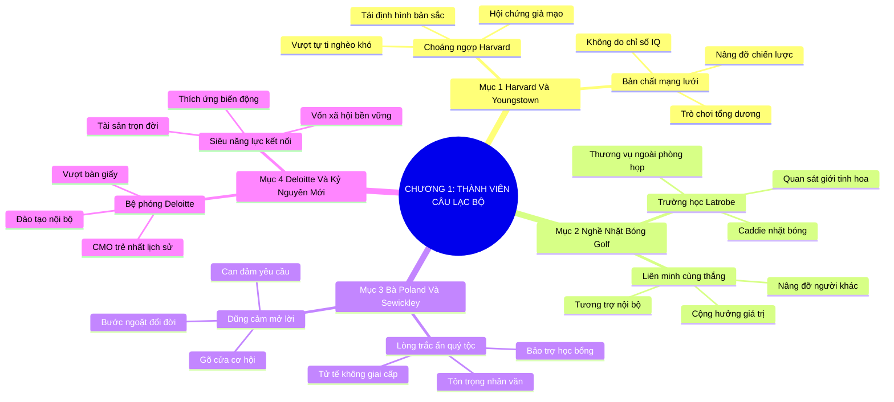

# TÓM TẮT CHƯƠNG SÁCH: CHƯƠNG 1: TRỞ THÀNH THÀNH VIÊN CỦA CÂU LẠC BỘ (BECOMING A MEMBER OF THE CLUB)
* **Thuộc phần**: Phần 1: Tư Duy Kết Nối (The Mindset)
* **Tác giả**: Keith Ferrazzi (với Tahl Raz)
* **Chuẩn hóa cấu trúc**: Document Structure-Anchored v2.4

---

## 🌟 THÔNG ĐIỆP CỐT LÕI (CORE MESSAGE)
> Thành công không phải là kết quả của nỗ lực đơn độc hay cạnh tranh triệt hạ, mà bắt nguồn từ mạng lưới liên minh chiến lược: Dám vượt qua định kiến xuất thân nghèo khó, học hỏi lòng hào phóng của giới tinh hoa và xây dựng quan hệ phụng sự lẫn nhau là đòn bẩy vĩ đại nhất để bước vào 'câu lạc bộ' của những người dẫn đầu.

---

## 📊 LƯỢC ĐỒ PHÂN BỔ CẤU TRÚC TÀI LIỆU
Bảng đối chiếu tỷ lệ và cấu trúc luận điểm bám sát các đề mục thực tế trong tài liệu:

| 📑 Đề Mục Trong Tài Liệu Gốc | 🎯 Số Lượng Luận Điểm Chuyên Sâu |
| :--- | :---: |
| Mục 1: Cơn Choáng Ngợp Ngày Đầu Tại Harvard & Tuổi Thơ Gian Khó (Youngstown) | 2 |
| Mục 2: Bài Học Về Nghề Nhặt Bóng Golf & Bản Chất Của Sự Liên Kết (Latrobe CC) | 2 |
| Mục 3: Lòng Trắc Ẩn Từ Bà Poland & Cánh Cửa Học Viện Sewickley | 2 |
| Mục 4: Thực Thi Nghệ Thuật Kết Nối Tại Deloitte & Sức Mạnh Mạng Lưới Kỷ Nguyên Mới | 2 |
| **Tổng cộng toàn chương** | **8 Luận Điểm** |

---

## 💡 HỆ THỐNG LUẬN ĐIỂM QUAN TRỌNG (KEY TAKEAWAYS)

#### 📑 PHẦN: MỤC 1: CƠN CHOÁNG NGỢP NGÀY ĐẦU TẠI HARVARD & TUỔI THƠ GIAN KHÓ (YOUNGSTOWN)

##### 1. Vượt qua hội chứng kẻ giả mạo (Imposter Syndrome) từ xuất thân nghèo khó
* **Phân Tích Chuyên Sâu**: Lớn lên tại thị trấn thép Youngstown trong một gia đình công nhân nghèo khó, Keith Ferrazzi từng trải qua cảm giác lạc lõng và choáng ngợp tột cùng khi bước chân vào Trường Kinh doanh Harvard. Tuy nhiên, thay vì thu mình phòng thủ, ông nhận ra rằng xuất thân không định nghĩa tương lai; sự khác biệt cốt lõi giữa người nghèo và giới tinh hoa không nằm ở chỉ số IQ mà nằm ở mạng lưới quan hệ xã hội nâng đỡ nhau.
* **Công Cụ / Phương Pháp Đi Kèm**: Tái định hình bản sắc cá nhân (Identity Reframing), Kỹ thuật vượt qua hội chứng Imposter.
* **Ví Dụ Thực Tế Ứng Dụng**: Biến nỗi mặc cảm con nhà công nhân thành động lực quan sát và học hỏi phong thái giao tiếp đỉnh cao của giới quý tộc.

##### 2. Bản chất phi cạnh tranh của thành công bền vững
* **Phân Tích Chuyên Sâu**: Tư duy cạnh tranh triệt hạ (Zero-Sum Game) là cái bẫy giam hãm con người trong sự cô độc. Thành công thực sự là một trò chơi có tổng dương, nơi chiến thắng của bạn tỷ lệ thuận với số lượng người mà bạn đã nâng đỡ và cùng tiến bước tới đích.
* **Công Cụ / Phương Pháp Đi Kèm**: Mô hình tư duy tổng dương (Positive-Sum Game Mindset).
* **Ví Dụ Thực Tế Ứng Dụng**: Chia sẻ tài liệu ôn thi tại Harvard cho bạn bè thay vì giấu giếm để tranh điểm số cao nhất.

#### 📑 PHẦN: MỤC 2: BÀI HỌC VỀ NGHỀ NHẶT BÓNG GOLF & BẢN CHẤT CỦA SỰ LIÊN KẾT (LATROBE CC)

##### 3. Trường học cuộc đời trên sân golf Latrobe
* **Phân Tích Chuyên Sâu**: Làm caddie nhặt bóng golf cho các doanh nhân thành đạt là bài học khai sáng vĩ đại nhất của Keith. Ông nhận ra rằng các thương vụ triệu đô và quyết định bổ nhiệm nhân sự hiếm khi diễn ra trong phòng họp lạnh lùng; chúng nảy nở từ sự gắn kết thân tình và tin cậy trên sân golf.
* **Công Cụ / Phương Pháp Đi Kèm**: Phương pháp quan sát ngầm (Shadow Observation), Kết nối ngoài công sở.
* **Ví Dụ Thực Tế Ứng Dụng**: Quan sát cách các chủ tịch tập đoàn chia sẻ cơ hội đầu tư và giúp đỡ con cái của nhau trong các vòng golf 18 lỗ.

##### 4. Tập trung nâng đỡ nhau cùng thắng (Win-Win Alliance)
* **Phân Tích Chuyên Sâu**: Giới thượng lưu duy trì vị thế không phải bằng sự ích kỷ mà bằng nguyên tắc tương trợ nội bộ bền chặt. Họ hiểu rằng việc nâng đỡ một người bạn thành công sẽ quay trở lại làm giàu cho chính mạng lưới của mình.
* **Công Cụ / Phương Pháp Đi Kèm**: Nguyên lý liên minh tương hỗ (Mutual Uplift Principle).
* **Ví Dụ Thực Tế Ứng Dụng**: Các thành viên câu lạc bộ golf luôn ưu tiên sử dụng dịch vụ và đầu tư vào dự án của các thành viên khác.

#### 📑 PHẦN: MỤC 3: LÒNG TRẮC ẨN TỪ BÀ POLAND & CÁNH CỬA HỌC VIỆN SEWICKLEY

##### 5. Sức mạnh của lòng trắc ẩn và sự quan tâm chân thành từ bà Poland
* **Phân Tích Chuyên Sâu**: Bà Poland—người phụ nữ quý tộc bảo trợ gia đình Keith—đã dạy cho ông bài học về sự tử tế không phân biệt giai cấp. Lòng trắc ẩn và sự tôn trọng đối đãi với người khác bằng tình người nguyên bản là chiếc chìa khóa vạn năng mở khóa mọi tâm hồn.
* **Công Cụ / Phương Pháp Đi Kèm**: Trí tuệ cảm xúc nhân văn (Humanitarian Emotional Intelligence), Bài học bà Poland.
* **Ví Dụ Thực Tế Ứng Dụng**: Bà Poland viết thư tay và đích thân bảo trợ học bổng giúp Keith bước chân vào Học viện Sewickley danh giá.

##### 6. Lòng dũng cảm dám mở lời yêu cầu sự giúp đỡ
* **Phân Tích Chuyên Sâu**: Thế giới đầy rẫy những con người nhân hậu sẵn sàng giúp đỡ, nhưng họ không thể giúp nếu bạn không dám cất tiếng nói. Người cha của Keith đã can đảm bước tới gõ cửa nhờ sự nâng đỡ của bà chủ, mở ra bước ngoặt đổi đời cho con trai.
* **Công Cụ / Phương Pháp Đi Kèm**: Kỹ thuật yêu cầu hỗ trợ đĩnh đạc (Courageous Ask Protocol).
* **Ví Dụ Thực Tế Ứng Dụng**: Can đảm đề xuất học bổng toàn phần và bày tỏ khát vọng học tập mãnh liệt trước hội đồng tuyển sinh Sewickley.

#### 📑 PHẦN: MỤC 4: THỰC THI NGHỆ THUẬT KẾT NỐI TẠI DELOITTE & SỨC MẠNH MẠNG LƯỚI KỶ NGUYÊN MỚI

##### 7. Khởi động chiến lược kết nối thực chiến tại Deloitte
* **Phân Tích Chuyên Sâu**: Gia nhập Deloitte với tư cách chuyên viên tư vấn tập sự, Keith không giới hạn bản thân trong bàn giấy. Ông chủ động kết nối với các đối tác cấp cao, nghiên cứu các xu hướng internet mới nổi và tổ chức các buổi hội thảo đào tạo nội bộ, nhanh chóng thăng tiến trở thành Giám đốc Tiếp thị (CMO) trẻ nhất lịch sử công ty.
* **Công Cụ / Phương Pháp Đi Kèm**: Chiến lược nâng tầm ảnh hưởng nội bộ (Internal Network Leverage).
* **Ví Dụ Thực Tế Ứng Dụng**: Chủ động gửi các bản phân tích xu hướng thị trường cho ban điều hành Deloitte để đề xuất thành lập mảng tư vấn tiếp thị số.

##### 8. Mạng lưới quan hệ: Siêu năng lực đổi đời trong kỷ nguyên số
* **Phân Tích Chuyên Sâu**: Trong nền kinh tế thông tin kết nối toàn cầu, kiến thức chuyên môn có thể bị lỗi thời nhanh chóng, nhưng mạng lưới những mối quan hệ tin cậy và chân thành là tài sản bền vững duy nhất giúp bạn thích ứng và bứt phá trước mọi biến động thị trường.
* **Công Cụ / Phương Pháp Đi Kèm**: Mô hình vốn xã hội bền vững (Social Capital as Ultimate Asset).
* **Ví Dụ Thực Tế Ứng Dụng**: Chuyển đổi suôn sẻ từ vị trí CMO tại Deloitte sang CMO tại Starwood Hotels nhờ sự tín nhiệm của các cố vấn cấp cao.

---

## 🎯 KẾ HOẠCH HÀNH ĐỘNG TOÀN DIỆN (ACTION PLAN)
### ⚡ Cấp độ 1: Thói quen vi mô (Micro-habits < 2 phút mỗi ngày)
- [ ] Viết ra giấy 3 nỗi sợ hãi hoặc tự ti lớn nhất về xuất thân của bạn và tái định khung nó
- [ ] Liệt kê 5 người thành đạt trong ngành mà bạn khao khát được học hỏi phong thái
- [ ] Can đảm gửi 1 lời nhắn ngỏ ý xin lời khuyên từ 1 người cố vấn xuất chúng trong tuần này
- [ ] Quan sát và ghi chép cách các nhà lãnh đạo cấp cao giao tiếp trong cuộc họp tiếp theo
- [ ] Giúp đỡ 1 đồng nghiệp hoàn thành công việc mà không đòi hỏi bất kỳ sự đền đáp nào

### 📅 Cấp độ 2: Thói quen tuần & Dự án ngắn hạn (Weekly Habits)
- [ ] Nhắc nhở bản thân về nguyên tắc trò chơi tổng dương mỗi khi có ý định đố kỵ
- [ ] Tìm hiểu về lịch sử thành công của một người có xuất thân nghèo khó để truyền cảm hứng
- [ ] Tự tay viết một bức thư cảm ơn gửi đến người đã từng giúp đỡ bạn bước vào sự nghiệp
- [ ] Xung phong nhận một nhiệm vụ mới tại công ty để mở rộng quan hệ với các phòng ban khác
- [ ] Trò chuyện thân mật với một nhân viên cấp dưới hoặc người phục vụ với sự tôn trọng tối cao

### 🚀 Cấp độ 3: Chiến lược chuyển hóa dài hạn (Long-term Strategy)
- [ ] Rà soát lại hồ sơ năng lực cá nhân để sẵn sàng nắm bắt các cơ hội học bổng/thăng tiến
- [ ] Luyện tập phong thái bắt tay đĩnh đạc, mỉm cười và nhìn thẳng vào mắt người đối diện
- [ ] Chia sẻ một tài liệu chuyên môn quý giá cho nhóm làm việc để tạo giá trị chung
- [ ] Từ bỏ thói quen làm việc đơn độc, chủ động tìm kiếm bạn đồng hành cho dự án mới
- [ ] Tự cam kết: Sẽ không bao giờ để hoàn cảnh xuất thân giới hạn tầm nhìn tương lai

---

## ❓ BỘ CÂU HỎI TỰ VẤN & PHẢN TƯ SUY NGẪM (REFLECTION QUESTIONS)
### Nhóm 1: Nhận thức thực tại & Thói quen hiện tại
1. Bạn có từng cảm thấy mình là 'kẻ giả mạo' khi bước vào những môi trường sang trọng không?
2. Xuất thân và hoàn cảnh gia đình thời niên thiếu đã ảnh hưởng đến lòng tự tin của bạn ra sao?
3. Tại sao sự khác biệt giữa người thành công và người thất bại không nằm ở IQ mà ở mạng lưới quan hệ?
4. Bạn quan sát được những bài học ứng xử nào từ cách những người thành đạt đối đãi với người xung quanh?
5. Lòng dũng cảm dám mở lời yêu cầu sự giúp đỡ đã từng mang lại bước ngoặt nào cho bạn chưa?

### Nhóm 2: Thách thức tâm lý & Rào cản nội tâm
6. Điều gì ngăn cản bạn bước tới kết bạn với những người có địa vị xã hội cao hơn?
7. Bạn đang nhìn nhận sự nghiệp như một cuộc cạnh tranh một mất một còn hay một liên minh cùng thắng?
8. Ai là 'bà Poland' trong cuộc đời bạn—người đã trao cho bạn niềm tin và lòng trắc ẩn đầu tiên?
9. Bạn đã làm gì để đền đáp hoặc tiếp nối sự tử tế mà những ân nhân đã dành cho bạn?
10. Tại sao làm việc chăm chỉ một mình trong phòng kín lại không đủ để chạm tới đỉnh cao sự nghiệp?

### Nhóm 3: Chiến lược hành động & Ứng dụng thực tế
11. Khi một người đồng nghiệp thành công rực rỡ, cảm xúc đầu tiên của bạn là tự hào hay ghen tị?
12. Làm thế nào để xây dựng phong thái đĩnh đạc và tự tin ngay cả khi trong túi chưa có tiền?
13. Bạn có sẵn sàng giúp đỡ một người trẻ tuổi có xuất thân khó khăn như cách Keith từng được nâng đỡ?
14. Keith Ferrazzi đã biến thời gian làm việc tại Deloitte thành bệ phóng kết nối như thế nào?
15. Những giá trị nhân văn nào giúp xóa nhòa khoảng cách giai cấp và địa vị trong giao tiếp?

### Nhóm 4: Chuyển hóa tư duy & Tầm nhìn dài hạn
16. Bạn có tin rằng bất kỳ ai cũng có thể trở thành 'thành viên của câu lạc bộ' nếu có tư duy đúng?
17. Làm sao để lòng can đảm không bị biến thành sự liều lĩnh thiếu tôn trọng trong tiếp cận người lớn?
18. Mạng lưới quan hệ hiện tại của bạn đang nâng đỡ bạn bay cao hay kéo bạn dậm chân tại chỗ?
19. Tại sao nói: 'Thành công không phải là việc bạn biết cái gì, mà là bạn biết ai và ai tin tưởng bạn'?
20. Bước đi táo bạo đầu tiên bạn sẽ thực hiện trong tuần này để mở rộng cánh cửa cơ hội là gì?

---

## 🧠 SƠ ĐỒ TƯ DUY TRỰC QUAN (MINDMAP)

