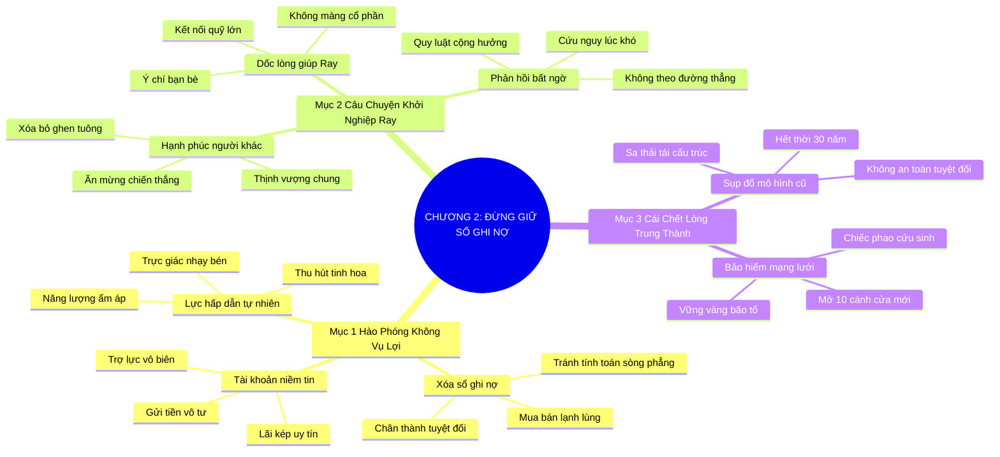

# SƠ ĐỒ TƯ DUY TRỰC QUAN: CHƯƠNG 2: ĐỪNG BAO GIỜ GIỮ SỔ GHI NỢ (DON'T KEEP SCORE)
* **Thuộc phần**: Phần 1: Tư Duy Kết Nối (The Mindset)
* **Tác phẩm**: Đừng Bao Giờ Đi Ăn Một Mình (Never Eat Alone) - Keith Ferrazzi
* **Chuẩn hóa**: Document Structure-Anchored v2.4 (Không nhãn meta thừa, phản ánh 100% cấu trúc tài liệu)

---

## 🌳 SƠ ĐỒ TƯ DUY MERMAID (4-5 TẦNG CHI TIẾT)

---

## 🧬 BẢNG PHÂN CẤP TRUY HỒI CHỦ ĐỘNG (ACTIVE RECALL HIERARCHY)
Cấu trúc hóa tri thức theo các nhánh tài liệu phục vụ ôn tập nhanh và khắc sâu trí nhớ:

| 📑 Nhánh Mục Tài Liệu | 🔑 Từ Khóa Vàng / Khái Niệm | 📝 Nội Dung Truy Hồi Chủ Động (Active Recall) |
| :--- | :--- | :--- |
| Mục 1: Hào Phóng Không Vụ Lợi | **Xóa sổ ghi nợ** | Chấm dứt tính toán sòng phẳng; giúp đỡ vô điều kiện để xây dựng sự chân thành tối cao. |
| Mục 1: Hào Phóng Không Vụ Lợi | **Tài khoản niềm tin** | Mỗi hành động tử tế là một khoản tiền gửi tích lũy lãi kép vào tài khoản niềm tin xã hội. |
| Mục 2: Câu Chuyện Khởi Nghiệp Ray | **Dốc lòng giúp Ray** | Hết mình nâng đỡ bạn bè khởi nghiệp mà không đòi hỏi cổ phần chứng minh sức mạnh của sự cho đi. |
| Mục 2: Câu Chuyện Khởi Nghiệp Ray | **Phản hồi phi tuyến tính** | Giá trị trao đi sẽ quay trở lại từ những hướng bất ngờ nhất qua mạng lưới cộng hưởng. |
| Mục 3: Sự Sụp Đổ Lòng Trung Thành | **Sụp đổ mô hình cũ** | Lòng trung thành công ty trọn đời đã chấm dứt; không còn khái niệm an toàn tuyệt đối từ tổ chức. |
| Mục 3: Sự Sụp Đổ Lòng Trung Thành | **Bảo hiểm mạng lưới** | Mạng lưới quan hệ cá nhân tin cậy là chính sách bảo hiểm sự nghiệp vững chắc nhất. |

---

## ⚡ BẢNG NEO TRÍ NHỚ NHANH (MEMORY ANCHOR CHEAT SHEET)
Tóm tắt cô đọng các công thức và quy tắc hành động của chương:

| 📑 Phần/Mục Tài Liệu | 📌 Khái Niệm Cốt Lõi | ⚖️ Nguyên Lý Vàng | 🚀 Hành Động Chuyển Hóa Ngay |
| :--- | :--- | :--- | :--- |
| Mục 1: Hào phóng | **Xóa sổ ghi nợ** | Cho đi không toan tính đổi chác | Xây dựng sự chân thành tuyệt đối |
| Mục 1: Hào phóng | **Tài khoản niềm tin** | Tích lũy uy tín qua từng việc tốt thầm lặng | Tạo dòng trợ lực vô biên cho tương lai |
| Mục 2: Giúp đỡ Ray | **Nâng đỡ vô điều kiện** | Hỗ trợ bạn bè hết mình không màng vụ lợi | Nhận lại sự cộng hưởng thịnh vượng bền lâu |
| Mục 3: Cái chết trung thành | **Bảo hiểm mạng lưới** | Xây dựng quan hệ trước khi công ty sa thải | Tạo phao cứu sinh cho sự nghiệp |

