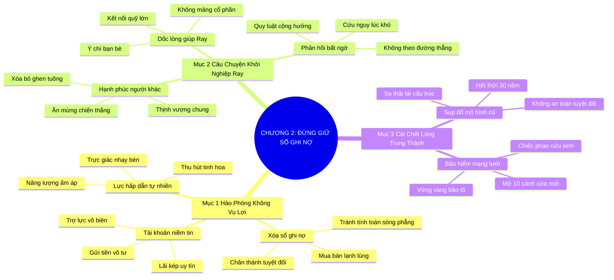

# TÓM TẮT CHƯƠNG SÁCH: CHƯƠNG 2: ĐỪNG BAO GIỜ GIỮ SỔ GHI NỢ (DON'T KEEP SCORE)
* **Thuộc phần**: Phần 1: Tư Duy Kết Nối (The Mindset)
* **Tác giả**: Keith Ferrazzi (với Tahl Raz)
* **Chuẩn hóa cấu trúc**: Document Structure-Anchored v2.4

---

## 🌟 THÔNG ĐIỆP CỐT LÕI (CORE MESSAGE)
> Cho đi vô điều kiện là lực hấp dẫn tối thượng: Chấm dứt thói quen tính toán đổi chác sòng phẳng, liên tục hỗ trợ người khác hết mình như câu chuyện khởi nghiệp của Ray để xây dựng tài khoản niềm tin khổng lồ trước sự sụp đổ của mô hình trung thành doanh nghiệp.

---

## 📊 LƯỢC ĐỒ PHÂN BỔ CẤU TRÚC TÀI LIỆU
Bảng đối chiếu tỷ lệ và cấu trúc luận điểm bám sát các đề mục thực tế trong tài liệu:

| 📑 Đề Mục Trong Tài Liệu Gốc | 🎯 Số Lượng Luận Điểm Chuyên Sâu |
| :--- | :---: |
| Mục 1: Triết Lý Của Sự Hào Phóng Không Vụ Lợi (Unconditional Generosity) | 3 |
| Mục 2: Câu Chuyện Khởi Nghiệp Của Ray & Sức Mạnh Trao Đi (Helping Ray) | 3 |
| Mục 3: Sự Sụp Đổ Của Trung Thành Doanh Nghiệp & Tính Bền Vững Mạng Lưới (Death of Loyalty) | 2 |
| **Tổng cộng toàn chương** | **8 Luận Điểm** |

---

## 💡 HỆ THỐNG LUẬN ĐIỂM QUAN TRỌNG (KEY TAKEAWAYS)

#### 📑 PHẦN: MỤC 1: TRIẾT LÝ CỦA SỰ HÀO PHÓNG KHÔNG VỤ LỢI (UNCONDITIONAL GENEROSITY)

##### 1. Cái bẫy tai hại của 'Cuốn sổ ghi nợ' trong quan hệ
* **Phân Tích Chuyên Sâu**: Những kẻ nghiệp dư luôn giữ một 'cuốn sổ ghi nợ' trong đầu: 'Tôi giúp anh điều này, anh nợ tôi điều kia'. Tư duy đổi chác sòng phẳng biến mọi cuộc giao tiếp thành thương vụ mua bán lạnh lùng, giết chết sự chân thành và khiến người khác luôn cảnh giác phòng thủ.
* **Công Cụ / Phương Pháp Đi Kèm**: Xóa bỏ cuốn sổ ghi nợ (Destroy the Scorecard Mindset), Tư duy hào phóng vô điều kiện.
* **Ví Dụ Thực Tế Ứng Dụng**: Không bao giờ nhắc lại việc mình từng giới thiệu khách hàng cho bạn khi cần nhờ họ một việc nhỏ.

##### 2. Xây dựng tài khoản niềm tin xã hội (Emotional Bank Account)
* **Phân Tích Chuyên Sâu**: Mỗi hành động giúp đỡ vô tư là một khoản tiền gửi vào 'tài khoản niềm tin' của bạn trong cộng đồng. Khi bạn liên tục gửi vào mà không vội vàng rút ra, uy tín của bạn tích lũy theo lãi kép, tạo ra dòng trợ lực vô biên sẵn sàng xuất hiện khi bạn cần.
* **Công Cụ / Phương Pháp Đi Kèm**: Mô hình tài khoản niềm tin lãi kép (Compounding Social Capital).
* **Ví Dụ Thực Tế Ứng Dụng**: Dành 5 năm liên tục giúp đỡ các bạn trẻ khởi nghiệp, sau này khi thành lập quỹ đầu tư được cả cộng đồng ủng hộ.

##### 3. Lực hấp dẫn của sự cho đi chân thành
* **Phân Tích Chuyên Sâu**: Con người có trực giác cực kỳ nhạy bén để nhận biết sự chân thành hay toan tính. Người hào phóng thực sự toát ra một năng lượng ấm áp tự nhiên, thu hút những con người xuất chúng nhất tự nguyện đồng hành và cống hiến.
* **Công Cụ / Phương Pháp Đi Kèm**: Năng lượng thu hút tự nhiên (Authentic Attraction Energy).
* **Ví Dụ Thực Tế Ứng Dụng**: Được nhiều đối tác lớn chủ động tìm đến hợp tác vì danh tiếng 'người luôn hết lòng vì bạn bè'.

#### 📑 PHẦN: MỤC 2: CÂU CHUYỆN KHỞI NGHIỆP CỦA RAY & SỨC MẠNH TRAO ĐI (HELPING RAY)

##### 4. Bài học từ câu chuyện dốc lòng giúp đỡ Ray
* **Phân Tích Chuyên Sâu**: Khi người bạn Ray ấp ủ ý tưởng kinh doanh nhưng thiếu vốn và quan hệ, Keith đã dành hàng chục giờ kết nối Ray với các nhà đầu tư mạo hiểm và chuyên gia hàng đầu mà không hề đòi hỏi một xu cổ phần. Sự thành công rực rỡ của Ray sau đó đã trở thành minh chứng sống động cho sức mạnh của sự nâng đỡ.
* **Công Cụ / Phương Pháp Đi Kèm**: Nâng đỡ không đòi hỏi (Altruistic Sponsorship Protocol - Case of Ray).
* **Ví Dụ Thực Tế Ứng Dụng**: Giới thiệu Ray với 5 quỹ đầu tư lớn nhất New York chỉ vì tin tưởng vào phẩm chất và ý chí của bạn.

##### 5. Hạnh phúc khi nhìn thấy người khác tỏa sáng
* **Phân Tích Chuyên Sâu**: Đỉnh cao của sự trưởng thành cảm xúc là tìm thấy niềm vui đích thực trong sự thành công của người khác. Khi bạn không còn so đo đố kỵ, bạn giải phóng hoàn toàn tâm trí khỏi sự ghen tuông và hòa nhập vào dòng chảy thịnh vượng chung.
* **Công Cụ / Phương Pháp Đi Kèm**: Tâm hỷ xả trong kinh doanh (Compersion / Joy in Others' Success).
* **Ví Dụ Thực Tế Ứng Dụng**: Ăn mừng chiến thắng gọi vốn của bạn bè như thể đó chính là chiến thắng của bản thân mình.

##### 6. Quy luật phản hồi bất ngờ của vũ trụ
* **Phân Tích Chuyên Sâu**: Sự giúp đỡ bạn trao đi hiếm khi quay trở lại theo đường thẳng từ chính người nhận; nó thường quay trở lại từ những hướng bất ngờ nhất thông qua mạng lưới cộng hưởng niềm tin.
* **Công Cụ / Phương Pháp Đi Kèm**: Quy luật phản hồi phi tuyến tính (Non-Linear Reciprocity Law).
* **Ví Dụ Thực Tế Ứng Dụng**: Giúp đỡ một sinh viên thực tập, 5 năm sau vị phụ huynh của bạn đó tình cờ là chủ tịch tập đoàn ký hợp đồng lớn với bạn.

#### 📑 PHẦN: MỤC 3: SỰ SỤP ĐỔ CỦA TRUNG THÀNH DOANH NGHIỆP & TÍNH BỀN VỮNG MẠNG LƯỚI (DEATH OF LOYALTY)

##### 7. Cái chết của mô hình lòng trung thành doanh nghiệp trọn đời
* **Phân Tích Chuyên Sâu**: Thời kỳ cống hiến 30 năm cho một công ty để đổi lấy lương hưu an toàn đã vĩnh viễn kết thúc. Khủng hoảng kinh tế và làn sóng sa thải hàng loạt chứng minh rằng công ty không thể bảo đảm tương lai cho bạn; chỉ có mạng lưới quan hệ cá nhân mới là chiếc phao cứu sinh bền vững duy nhất.
* **Công Cụ / Phương Pháp Đi Kèm**: Nhận thức sự sụp đổ lòng trung thành doanh nghiệp (The Death of Corporate Loyalty).
* **Ví Dụ Thực Tế Ứng Dụng**: Hàng ngàn nhân sự cấp cao bị cắt giảm đột ngột trong các đợt tái cấu trúc tập đoàn lớn.

##### 8. Mạng lưới quan hệ: Bảo hiểm thất nghiệp tối thượng
* **Phân Tích Chuyên Sâu**: Mạng lưới những người bạn tri kỷ và đối tác tin cậy chính là chính sách bảo hiểm sự nghiệp vững chắc nhất. Khi một cánh cửa công ty đóng lại, mạng lưới sẽ lập tức mở ra mười cánh cửa cơ hội mới cho bạn.
* **Công Cụ / Phương Pháp Đi Kèm**: Chính sách bảo hiểm mạng lưới (The Network Safety Net).
* **Ví Dụ Thực Tế Ứng Dụng**: Tìm được vị trí điều hành mới chỉ trong vòng 2 tuần sau khi rời công ty cũ nhờ các cuộc gọi từ bạn bè trong ngành.

---

## 🎯 KẾ HOẠCH HÀNH ĐỘNG TOÀN DIỆN (ACTION PLAN)
### ⚡ Cấp độ 1: Thói quen vi mô (Micro-habits < 2 phút mỗi ngày)
- [ ] Xóa bỏ hoàn toàn ý nghĩ 'người này đang nợ mình' trong tâm trí bạn hôm nay
- [ ] Giúp đỡ 1 người bạn giải quyết khó khăn mà tuyệt đối không mong đợi đền đáp
- [ ] Viết lời chúc mừng chân thành gửi đến 1 người bạn vừa đạt được thành tựu lớn
- [ ] Chia sẻ một cơ hội kinh doanh mà bạn không phục vụ hết cho một đồng nghiệp
- [ ] Đánh giá lại mức độ phụ thuộc sự nghiệp của bạn vào một công ty duy nhất

### 📅 Cấp độ 2: Thói quen tuần & Dự án ngắn hạn (Weekly Habits)
- [ ] Dành 1 giờ mỗi tuần tư vấn miễn phí cho các dự án khởi nghiệp của bạn bè
- [ ] Gửi tài liệu nghiên cứu giá trị cho một đối tác đang cần mà không tính phí
- [ ] Thực hành thói quen ăn mừng thành công của người khác bằng sự hoan hỷ chân thật
- [ ] Xây dựng 'tài khoản niềm tin' bằng cách gửi gắm ít nhất 3 hành động tử tế mỗi tuần
- [ ] Tránh tuyệt đối việc mặc cả ơn nghĩa hoặc nhắc lại sự giúp đỡ trong quá khứ

### 🚀 Cấp độ 3: Chiến lược chuyển hóa dài hạn (Long-term Strategy)
- [ ] Kết nối 1 người bạn đang thất nghiệp với một cơ hội tuyển dụng phù hợp
- [ ] Tự nhắc nhở: Cho đi là cách tốt nhất để xây dựng sự an toàn sự nghiệp
- [ ] Đọc lại câu chuyện về cách Keith giúp đỡ Ray để truyền cảm hứng hào phóng
- [ ] Quan sát xem bạn đang 'gửi vào' hay 'rút ra' nhiều hơn từ các mối quan hệ
- [ ] Sống mỗi ngày với tâm thế: 'Mình có thể trao thêm giá trị gì cho thế giới?'

---

## ❓ BỘ CÂU HỎI TỰ VẤN & PHẢN TƯ SUY NGẪM (REFLECTION QUESTIONS)
### Nhóm 1: Nhận thức thực tại & Thói quen hiện tại
1. Bạn có đang giữ một 'cuốn sổ ghi nợ' vô hình về những ân nghĩa trong tâm trí không?
2. Cảm giác của bạn thế nào khi ai đó giúp bạn nhưng lập tức đòi hỏi bạn phải trả ơn?
3. Tại sao lòng hào phóng không toan tính lại là lực hấp dẫn mạnh nhất trong kinh doanh?
4. Câu chuyện giúp đỡ Ray của Keith Ferrazzi để lại bài học gì về tình bạn tri kỷ?
5. Bạn phản ứng ra sao khi một người bạn thân đạt được thành công vượt trội hơn bạn?

### Nhóm 2: Thách thức tâm lý & Rào cản nội tâm
6. Sự giúp đỡ bạn từng trao đi đã từng quay trở lại với bạn từ những hướng bất ngờ nào?
7. Tại sao mô hình lòng trung thành công ty trọn đời lại hoàn toàn sụp đổ trong thời đại này?
8. Nếu ngày mai bạn mất việc, bạn có bao nhiêu người bạn sẵn lòng mở rộng cánh cửa đón nhận bạn?
9. Tài khoản niềm tin xã hội của bạn hiện tại đang có số dư dồi dào hay đang bị thấu chi?
10. Điều gì ngăn cản bạn chia sẻ cơ hội làm ăn tốt cho người khác cùng làm?

### Nhóm 3: Chiến lược hành động & Ứng dụng thực tế
11. Làm thế nào để phân biệt giữa lòng hào phóng thông thái và sự cả tin mù quáng?
12. Bạn có cảm thấy nhẹ nhõm hơn khi xóa bỏ hoàn toàn sự tính toán sòng phẳng trong tình cảm?
13. Khi bạn giúp đỡ người khác hết mình, điều gì xảy ra với sự tự tin nội tại của bạn?
14. Một mối quan hệ dựa trên sự đổi chác có thể tồn tại được qua những biến cố lớn không?
15. Làm sao để xây dựng một mạng lưới bảo hiểm sự nghiệp vững chắc trước làn sóng sa thải?

### Nhóm 4: Chuyển hóa tư duy & Tầm nhìn dài hạn
16. Bạn có nhớ cảm giác ấm áp khi nhận được sự nâng đỡ vô tư từ một người xa lạ không?
17. Tại sao người chỉ biết thu vén cho riêng mình lại thường là người cô độc nhất khi sa cơ?
18. Việc đầu tư vào thành công của người khác mang lại lợi ích gì cho tổ chức của bạn?
19. Định nghĩa về 'sự giàu có đích thực' của bạn đã thay đổi như thế nào sau chương sách này?
20. Ai là người bạn sẽ chủ động giúp đỡ vô điều kiện ngay trong ngày hôm nay?

---

## 🧠 SƠ ĐỒ TƯ DUY TRỰC QUAN (MINDMAP)

