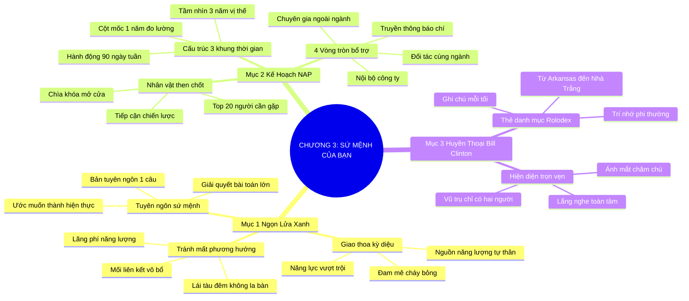

# SƠ ĐỒ TƯ DUY TRỰC QUAN: CHƯƠNG 3: SỨ MỆNH CỦA BẠN LÀ GÌ? (WHAT'S YOUR MISSION?)
* **Thuộc phần**: Phần 1: Tư Duy Kết Nối (The Mindset)
* **Tác phẩm**: Đừng Bao Giờ Đi Ăn Một Mình (Never Eat Alone) - Keith Ferrazzi
* **Chuẩn hóa**: Document Structure-Anchored v2.4 (Không nhãn meta thừa, phản ánh 100% cấu trúc tài liệu)

---

## 🌳 SƠ ĐỒ TƯ DUY MERMAID (4-5 TẦNG CHI TIẾT)

---

## 🧬 BẢNG PHÂN CẤP TRUY HỒI CHỦ ĐỘNG (ACTIVE RECALL HIERARCHY)
Cấu trúc hóa tri thức theo các nhánh tài liệu phục vụ ôn tập nhanh và khắc sâu trí nhớ:

| 📑 Nhánh Mục Tài Liệu | 🔑 Từ Khóa Vàng / Khái Niệm | 📝 Nội Dung Truy Hồi Chủ Động (Active Recall) |
| :--- | :--- | :--- |
| Mục 1: Ngọn Lửa Xanh Sứ Mệnh | **Ngọn Lửa Xanh** | Điểm giao thoa giữa đam mê cháy bỏng và năng lực vượt trội; tạo ra năng lượng kết nối tự thân. |
| Mục 1: Ngọn Lửa Xanh Sứ Mệnh | **Tuyên ngôn sứ mệnh** | Đúc kết mục tiêu cuộc đời thành tuyên ngôn 1 câu rõ ràng để định hướng mọi mối quan hệ. |
| Mục 2: Kế Hoạch Hành Động NAP | **Cấu trúc 3 khung thời gian** | Kế hoạch NAP gồm: Tầm nhìn 3 năm, Cột mốc 1 năm và Kế hoạch hành động 90 ngày cụ thể. |
| Mục 2: Kế Hoạch Hành Động NAP | **Nhân vật then chốt** | Xác định rõ danh sách 20 nhân vật quan trọng nắm giữ chìa khóa mở ra mục tiêu của bạn. |
| Mục 3: Huyền Thoại Bill Clinton | **Thẻ ghi chú Rolodex** | Ghi chép tỉ mỉ tên tuổi và sở thích của từng người gặp mỗi ngày tạo nên vốn quan hệ phi thường. |
| Mục 3: Huyền Thoại Bill Clinton | **Hiện diện trọn vẹn** | Dành trọn vẹn sự chú tâm và ánh mắt cho người đối diện khiến họ cảm thấy mình vô cùng quan trọng. |

---

## ⚡ BẢNG NEO TRÍ NHỚ NHANH (MEMORY ANCHOR CHEAT SHEET)
Tóm tắt cô đọng các công thức và quy tắc hành động của chương:

| 📑 Phần/Mục Tài Liệu | 📌 Khái Niệm Cốt Lõi | ⚖️ Nguyên Lý Vàng | 🚀 Hành Động Chuyển Hóa Ngay |
| :--- | :--- | :--- | :--- |
| Mục 1: Ngọn lửa xanh | **Blue Flame Matrix** | Giao thoa giữa đam mê và năng lực | Tìm ra sứ mệnh dẫn đường sự nghiệp |
| Mục 2: Kế hoạch NAP | **Mô hình NAP 3 cấp** | 3 Năm tầm nhìn + 1 Năm cột mốc + 90 Ngày hành động | Chuyển hóa sứ mệnh thành kế hoạch tiếp xúc |
| Mục 2: Kế hoạch NAP | **Nhân vật then chốt** | Lập danh sách 20 người cần tiếp cận | Tập trung năng lượng vào mục tiêu đúng đắn |
| Mục 3: Bill Clinton | **Hiện diện trọn vẹn** | Lắng nghe chăm chú và ghi chú sau cuộc gặp | Chinh phục lòng tin của mọi người |

