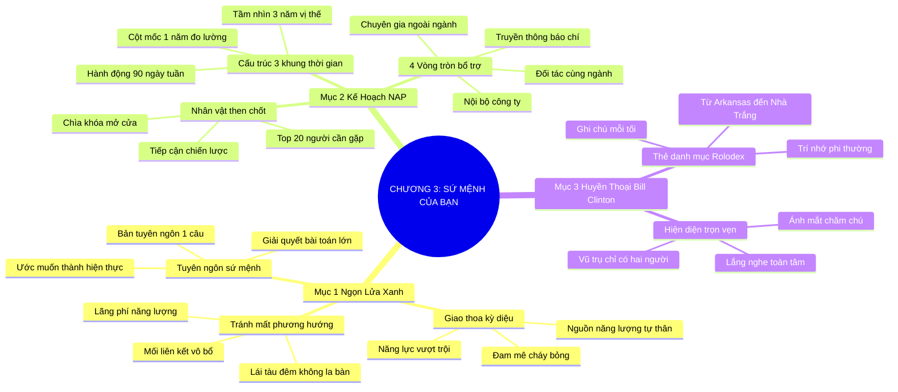

# TÓM TẮT CHƯƠNG SÁCH: CHƯƠNG 3: SỨ MỆNH CỦA BẠN LÀ GÌ? (WHAT'S YOUR MISSION?)
* **Thuộc phần**: Phần 1: Tư Duy Kết Nối (The Mindset)
* **Tác giả**: Keith Ferrazzi (với Tahl Raz)
* **Chuẩn hóa cấu trúc**: Document Structure-Anchored v2.4

---

## 🌟 THÔNG ĐIỆP CỐT LÕI (CORE MESSAGE)
> Định hướng chiến lược bằng Ngọn Lửa Xanh (The Blue Flame): Hợp nhất đam mê cháy bỏng với năng lực vượt trội, chuyển hóa thành Kế hoạch Hành động Kết nối (NAP) 3 năm và học tập bậc thầy kết nối Tổng thống Bill Clinton.

---

## 📊 LƯỢC ĐỒ PHÂN BỔ CẤU TRÚC TÀI LIỆU
Bảng đối chiếu tỷ lệ và cấu trúc luận điểm bám sát các đề mục thực tế trong tài liệu:

| 📑 Đề Mục Trong Tài Liệu Gốc | 🎯 Số Lượng Luận Điểm Chuyên Sâu |
| :--- | :---: |
| Mục 1: Ngọn Lửa Xanh Và Điểm Giao Thoa Của Sự Nghiệp (The Blue Flame Concept) | 3 |
| Mục 2: Thiết Lập Bản Kế Hoạch Hành Động Kết Nối (The Networking Action Plan - NAP) | 3 |
| Mục 3: Hồ Sơ Đại Sảnh Danh Vọng Nhà Kết Nối: Tổng Thống Bill Clinton | 2 |
| **Tổng cộng toàn chương** | **8 Luận Điểm** |

---

## 💡 HỆ THỐNG LUẬN ĐIỂM QUAN TRỌNG (KEY TAKEAWAYS)

#### 📑 PHẦN: MỤC 1: NGỌN LỬA XANH VÀ ĐIỂM GIAO THOA CỦA SỰ NGHIỆP (THE BLUE FLAME CONCEPT)

##### 1. Khái niệm Ngọn Lửa Xanh (The Blue Flame)
* **Phân Tích Chuyên Sâu**: Ngọn lửa xanh là điểm giao thoa kỳ diệu giữa Niềm đam mê cháy bỏng (điều bạn yêu thích sâu sắc) và Năng lực vượt trội (điều bạn làm giỏi nhất). Khi tìm thấy ngọn lửa xanh, công việc không còn là gánh nặng mệt mỏi mà trở thành nguồn năng lượng tự thân bất tận thu hút mọi nguồn lực xung quanh.
* **Công Cụ / Phương Pháp Đi Kèm**: Ma trận Ngọn Lửa Xanh (The Blue Flame Matrix: Passion x Competence).
* **Ví Dụ Thực Tế Ứng Dụng**: Kết hợp niềm đam mê ẩm thực với năng lực công nghệ để sáng lập nền tảng kết nối đầu bếp tại gia.

##### 2. Sự nguy hiểm của việc kết nối không phương hướng
* **Phân Tích Chuyên Sâu**: Giao lưu kết nối mà không có sứ mệnh rõ ràng giống như lái tàu giữa biển đêm không la bàn. Bạn sẽ lãng phí thời gian vào những cuộc gặp vô bổ, cạn kiệt năng lượng và xây dựng những mối liên kết không phục vụ cho mục tiêu cuộc đời.
* **Công Cụ / Phương Pháp Đi Kèm**: La bàn sứ mệnh cuộc đời (Mission Compass Audit).
* **Ví Dụ Thực Tế Ứng Dụng**: Tham gia hàng chục sự kiện giao lưu mỗi tháng nhưng không biết mình muốn đạt được vị trí gì trong 3 năm tới.

##### 3. Viết ra tuyên ngôn sứ mệnh cá nhân rõ ràng
* **Phân Tích Chuyên Sâu**: Một mục tiêu không được viết ra giấy chỉ là một ước muốn viển vông. Hãy đúc kết sứ mệnh cuộc đời bạn thành một bản tuyên ngôn ngắn gọn, truyền cảm hứng và trả lời câu hỏi: Bạn muốn giải quyết vấn đề lớn nào cho thế giới?
* **Công Cụ / Phương Pháp Đi Kèm**: Bản tuyên ngôn sứ mệnh 1 câu (One-Sentence Mission Statement).
* **Ví Dụ Thực Tế Ứng Dụng**: 'Sứ mệnh của tôi là giúp 1.000 doanh nghiệp vừa và nhỏ chuyển đổi số thành công trong 5 năm tới'.

#### 📑 PHẦN: MỤC 2: THIẾT LẬP BẢN KẾ HOẠCH HÀNH ĐỘNG KẾT NỐI (THE NETWORKING ACTION PLAN - NAP)

##### 4. Cấu trúc Kế hoạch Hành động Kết nối (NAP) 3 cấp độ thời gian
* **Phân Tích Chuyên Sâu**: Bản kế hoạch NAP biến sứ mệnh thành hành động cụ thể thông qua 3 khung thời gian: Cấp 1 (Tầm nhìn 3 năm: Vị thế đỉnh cao); Cấp 2 (Cột mốc 1 năm: Kết quả đo lường được); Cấp 3 (Kế hoạch hành động 90 ngày: Các bước đi thực tế hàng tuần).
* **Công Cụ / Phương Pháp Đi Kèm**: Mô hình NAP 3 cấp độ thời gian (The 3-Tier NAP Architecture: 3-Year, 1-Year, 90-Day).
* **Ví Dụ Thực Tế Ứng Dụng**: Mục tiêu 3 năm trở thành giám đốc tiếp thị, cột mốc 1 năm hoàn thành chứng chỉ quốc tế, 90 ngày tới kết nối 15 giám đốc trong ngành.

##### 5. Xác định danh sách nhân vật then chốt (Key People Target List)
* **Phân Tích Chuyên Sâu**: Để đạt được mục tiêu trong NAP, bạn phải trả lời câu hỏi: 'Ai là những người nắm giữ chiếc chìa khóa mở ra cánh cửa đó?'. Lập danh sách cụ thể tên tuổi các nhà lãnh đạo, chuyên gia và cố vấn cần tiếp cận.
* **Công Cụ / Phương Pháp Đi Kèm**: Bản đồ nhân vật then chốt (Key Stakeholders Target Mapping).
* **Ví Dụ Thực Tế Ứng Dụng**: Liệt kê đích danh 20 tổng giám đốc và chuyên gia đầu ngành công nghệ cần xây dựng mối quan hệ trong năm nay.

##### 6. Bản đồ mạng lưới vòng tròn quan hệ bổ trợ
* **Phân Tích Chuyên Sâu**: Phân chia danh sách kết nối theo các vòng tròn chiến lược: Vòng tròn nội bộ công ty, Vòng tròn đối tác cùng ngành, Vòng tròn chuyên gia ngoài ngành và Vòng tròn truyền thông báo chí để hỗ trợ toàn diện cho NAP.
* **Công Cụ / Phương Pháp Đi Kèm**: Bản đồ 4 vòng tròn kết nối bổ trợ (4-Circle Network Mapping).
* **Ví Dụ Thực Tế Ứng Dụng**: Phân bổ thời gian tương tác đồng đều giữa các nhóm đối tượng để không bị mất cân bằng.

#### 📑 PHẦN: MỤC 3: HỒ SƠ ĐẠI SẢNH DANH VỌNG NHÀ KẾT NỐI: TỔNG THỐNG BILL CLINTON

##### 7. Bậc thầy ghi nhớ và kết nối: Huyền thoại Bill Clinton
* **Phân Tích Chuyên Sâu**: Bill Clinton nổi tiếng với khả năng kết nối phi thường: Mỗi tối trước khi đi ngủ từ thời trẻ, ông đều ghi lại tên và chi tiết về những người ông đã gặp trong ngày vào các tấm thẻ danh mục (Rolodex Cards). Sự tỉ mỉ và trí nhớ phi thường về con người đã đưa ông từ một cậu bé nghèo Arkansas trở thành Tổng thống Mỹ.
* **Công Cụ / Phương Pháp Đi Kèm**: Phương pháp thẻ ghi chú Rolodex (The Clinton Rolodex Habit).
* **Ví Dụ Thực Tế Ứng Dụng**: Bill Clinton nhớ chính xác tên vợ và sở thích câu cá của một cử tri từng gặp thoáng qua 5 năm trước.

##### 8. Sức mạnh của sự hiện diện trọn vẹn (Total Presence)
* **Phân Tích Chuyên Sâu**: Khi Bill Clinton bắt tay và nói chuyện với ai, người đó cảm thấy như thể cả vũ trụ chỉ có hai người. Ánh mắt chăm chú, bàn tay ấm áp và sự lắng nghe trọn vẹn khiến bất kỳ ai cũng cảm thấy mình vô cùng quan trọng.
* **Công Cụ / Phương Pháp Đi Kèm**: Năng lực hiện diện trọn vẹn (The Total Presence Aura - Clinton Charisma).
* **Ví Dụ Thực Tế Ứng Dụng**: Không nhìn lơ đãng xung quanh khi bắt tay; tập trung toàn bộ ánh mắt và nụ cười vào người đối diện.

---

## 🎯 KẾ HOẠCH HÀNH ĐỘNG TOÀN DIỆN (ACTION PLAN)
### ⚡ Cấp độ 1: Thói quen vi mô (Micro-habits < 2 phút mỗi ngày)
- [ ] Viết ra điểm giao thoa giữa đam mê lớn nhất và năng lực tốt nhất của bạn (Ngọn Lửa Xanh)
- [ ] Soạn thảo bản Kế hoạch Hành động Kết nối (NAP) cho 3 năm tới
- [ ] Liệt kê danh sách 20 nhân vật then chốt bạn bắt buộc phải tiếp cận trong năm nay
- [ ] Chia nhỏ mục tiêu năm thành các cột mốc hành động cụ thể cho 90 ngày tới
- [ ] Áp dụng thói quen ghi chú thông tin người mới gặp vào cuối mỗi ngày như Bill Clinton

### 📅 Cấp độ 2: Thói quen tuần & Dự án ngắn hạn (Weekly Habits)
- [ ] Thực hành sự hiện diện trọn vẹn: nhìn thẳng vào mắt và lắng nghe không xao nhãng
- [ ] Viết tuyên ngôn sứ mệnh cá nhân 1 câu và dán lên bàn làm việc
- [ ] Loại bỏ 3 cuộc gặp gỡ không phục vụ cho sứ mệnh và mục tiêu trong NAP của bạn
- [ ] Đọc tiểu sử thời trẻ của Bill Clinton để học hỏi kỹ năng kết nối chính trị
- [ ] Xác định 3 kỹ năng bạn cần rèn luyện thêm để phục vụ cho ngọn lửa xanh

### 🚀 Cấp độ 3: Chiến lược chuyển hóa dài hạn (Long-term Strategy)
- [ ] Tìm kiếm 1 người cố vấn có thể phản biện và hoàn thiện bản kế hoạch NAP của bạn
- [ ] Thiết lập bảng tính theo dõi tiến độ tiếp cận danh sách 20 nhân vật then chốt
- [ ] Rà soát lại NAP vào ngày Chủ Nhật hàng tuần để điều chỉnh lịch trình tiếp xúc
- [ ] Chuẩn bị câu trả lời 30 giây ấn tượng cho câu hỏi: 'Sứ mệnh cuộc đời bạn là gì?'
- [ ] Cam kết kiên trì theo đuổi ngọn lửa xanh bất chấp những cám dỗ ngắn hạn

---

## ❓ BỘ CÂU HỎI TỰ VẤN & PHẢN TƯ SUY NGẪM (REFLECTION QUESTIONS)
### Nhóm 1: Nhận thức thực tại & Thói quen hiện tại
1. Ngọn Lửa Xanh (điểm giao thoa giữa đam mê và năng lực) của bạn hiện tại là gì?
2. Bạn đã từng lãng phí thời gian tham gia các cuộc gặp gỡ xã giao vô bổ vì thiếu sứ mệnh chưa?
3. Nếu chỉ được chọn 1 mục tiêu lớn nhất để đạt được trong 3 năm tới, mục tiêu đó là gì?
4. Ai là 5 người nắm giữ chiếc chìa khóa mở ra cánh cửa thành công cho mục tiêu của bạn?
5. Bill Clinton đã dạy chúng ta bài học gì về sức mạnh của việc ghi chép thông tin con người?

### Nhóm 2: Thách thức tâm lý & Rào cản nội tâm
6. Cảm giác của bạn thế nào khi trò chuyện với một người luôn nhìn lơ đãng đi chỗ khác?
7. Làm thế nào để luyện tập năng lực 'hiện diện trọn vẹn' trong từng cuộc đối thoại hàng ngày?
8. Bản kế hoạch hành động kết nối (NAP) của bạn đã đủ cụ thể và đo lường được chưa?
9. Tại sao viết mục tiêu ra giấy lại có sức mạnh biến ước mơ thành hiện thực?
10. Bạn xử lý thế nào khi ngọn lửa đam mê của bạn bị người thân hoặc bạn bè nghi ngờ?

### Nhóm 3: Chiến lược hành động & Ứng dụng thực tế
11. Có rào cản tâm lý nào khiến bạn ngần ngại đưa tên những nhân vật lớn vào danh sách NAP?
12. Làm sao để việc theo đuổi sứ mệnh không biến bạn thành một kẻ tính toán lạnh lùng?
13. Tuyên ngôn sứ mệnh 1 câu của bạn có đủ sức truyền cảm hứng cho người khác không?
14. Khi một người hỏi 'Bạn có thể giúp gì cho tôi?', bạn sẽ trả lời dựa trên ngọn lửa xanh ra sao?
15. Sự kiên định theo đuổi sứ mệnh qua năm tháng tạo ra uy tín cá nhân của bạn như thế nào?

### Nhóm 4: Chuyển hóa tư duy & Tầm nhìn dài hạn
16. Bạn có sẵn sàng từ chối những cơ hội kiếm tiền nhanh nếu nó đi ngược lại sứ mệnh dài hạn?
17. Thói quen ghi chú thẻ Rolodex của Bill Clinton có thể số hóa trên điện thoại như thế nào?
18. Một người có sứ mệnh rõ ràng toát ra sức hút lãnh đạo khác biệt ra sao?
19. Nhìn lại 1 năm qua, bạn đã tiến gần hơn bao nhiêu bước tới mục tiêu trong NAP của mình?
20. Hành động đầu tiên bạn sẽ làm tối nay để hoàn thiện bản kế hoạch NAP của mình là gì?

---

## 🧠 SƠ ĐỒ TƯ DUY TRỰC QUAN (MINDMAP)

