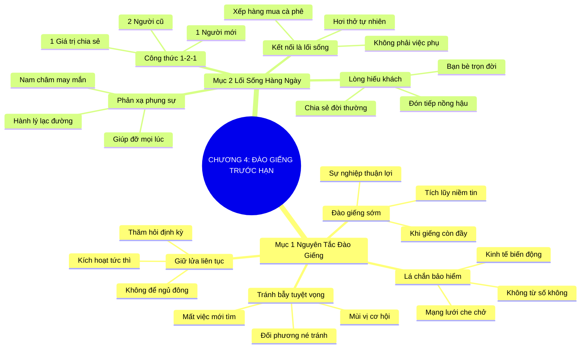

# SƠ ĐỒ TƯ DUY TRỰC QUAN: CHƯƠNG 4: ĐÀO GIẾNG TRƯỚC KHI BẠN THẤY KHÁT (DIG YOUR WELL BEFORE THIRSTY)
* **Thuộc phần**: Phần 1: Tư Duy Kết Nối (The Mindset)
* **Tác phẩm**: Đừng Bao Giờ Đi Ăn Một Mình (Never Eat Alone) - Keith Ferrazzi
* **Chuẩn hóa**: Document Structure-Anchored v2.4 (Không nhãn meta thừa, phản ánh 100% cấu trúc tài liệu)

---

## 🌳 SƠ ĐỒ TƯ DUY MERMAID (4-5 TẦNG CHI TIẾT)

---

## 🧬 BẢNG PHÂN CẤP TRUY HỒI CHỦ ĐỘNG (ACTIVE RECALL HIERARCHY)
Cấu trúc hóa tri thức theo các nhánh tài liệu phục vụ ôn tập nhanh và khắc sâu trí nhớ:

| 📑 Nhánh Mục Tài Liệu | 🔑 Từ Khóa Vàng / Khái Niệm | 📝 Nội Dung Truy Hồi Chủ Động (Active Recall) |
| :--- | :--- | :--- |
| Mục 1: Nguyên Tắc Đào Giếng Trước Khi Thấy Khát | **Tránh bẫy tuyệt vọng** | Không bao giờ đợi đến khi mất việc hay gặp khó khăn mới liên lạc nhờ vả người khác. |
| Mục 1: Nguyên Tắc Đào Giếng Trước Khi Thấy Khát | **Đào giếng sớm** | Chủ động xây dựng quan hệ và giúp đỡ người khác khi sự nghiệp đang thuận lợi nhất. |
| Mục 1: Nguyên Tắc Đào Giếng Trước Khi Thấy Khát | **Lá chắn bảo hiểm** | Mạng lưới quan hệ ấm áp là chính sách bảo hiểm vững chắc nhất trước mọi biến động kinh tế. |
| Mục 2: Biến Kết Nối Thành Lối Sống Hàng Ngày | **Kết nối là lối sống** | Biến kết nối thành hơi thở tự nhiên trong mọi sinh hoạt đời thường thay vì gánh nặng công việc. |
| Mục 2: Biến Kết Nối Thành Lối Sống Hàng Ngày | **Công thức 1-2-1** | Kỷ luật mỗi ngày: 1 người mới, 2 người cũ và 1 giá trị chia sẻ để nuôi dưỡng mạng lưới đồ sộ. |
| Mục 2: Biến Kết Nối Thành Lối Sống Hàng Ngày | **Phản xạ phụng sự** | Chủ động giúp đỡ mọi người xung quanh mọi lúc mọi nơi để thu hút vận may và thiện cảm. |

---

## ⚡ BẢNG NEO TRÍ NHỚ NHANH (MEMORY ANCHOR CHEAT SHEET)
Tóm tắt cô đọng các công thức và quy tắc hành động của chương:

| 📑 Phần/Mục Tài Liệu | 📌 Khái Niệm Cốt Lõi | ⚖️ Nguyên Lý Vàng | 🚀 Hành Động Chuyển Hóa Ngay |
| :--- | :--- | :--- | :--- |
| Mục 1: Đào giếng sớm | **Tránh bẫy tuyệt vọng** | Không gọi điện nhờ vả khi vừa sa thải | Xây dựng sự tin cậy từ thuở bình yên |
| Mục 1: Đào giếng sớm | **Lá chắn bảo hiểm** | Nuôi dưỡng mạng lưới khi chưa cần đến | Sẵn sàng đón nhận trợ lực khi bão tố |
| Mục 2: Lối sống kết nối | **Công thức 1-2-1** | 1 người mới, 2 người cũ, 1 giá trị chia sẻ | Tạo nhịp điệu tương tác bền bỉ mỗi ngày |
| Mục 2: Lối sống kết nối | **Phản xạ phụng sự** | Giúp đỡ mọi lúc mọi nơi không tính toán | Biến lòng tốt thành thói quen tự nhiên |

