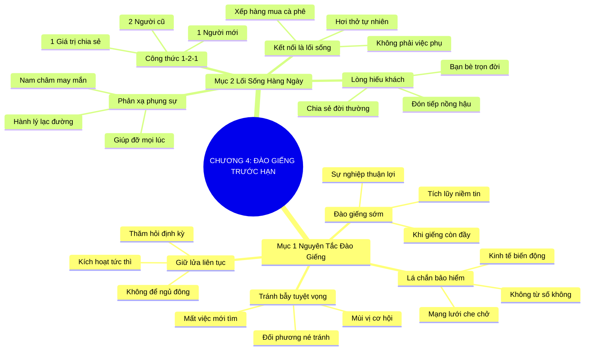

# TÓM TẮT CHƯƠNG SÁCH: CHƯƠNG 4: ĐÀO GIẾNG TRƯỚC KHI BẠN THẤY KHÁT (DIG YOUR WELL BEFORE THIRSTY)
* **Thuộc phần**: Phần 1: Tư Duy Kết Nối (The Mindset)
* **Tác giả**: Keith Ferrazzi (với Tahl Raz)
* **Chuẩn hóa cấu trúc**: Document Structure-Anchored v2.4

---

## 🌟 THÔNG ĐIỆP CỐT LÕI (CORE MESSAGE)
> Chủ động xây dựng quan hệ khi chưa cần đến: Đừng đợi đến khi bị sa thải hay bế tắc mới cuống cuồng đi tìm sự giúp đỡ—hãy biến kết nối thành lối sống thường nhật để mạng lưới luôn sẵn sàng cứu trợ bạn.

---

## 📊 LƯỢC ĐỒ PHÂN BỔ CẤU TRÚC TÀI LIỆU
Bảng đối chiếu tỷ lệ và cấu trúc luận điểm bám sát các đề mục thực tế trong tài liệu:

| 📑 Đề Mục Trong Tài Liệu Gốc | 🎯 Số Lượng Luận Điểm Chuyên Sâu |
| :--- | :---: |
| Mục 1: Nguyên Tắc Đào Giếng Trước Khi Chết Khát (Dig Your Well Before You Are Thirsty) | 4 |
| Mục 2: Biến Kết Nối Thành Một Lối Sống Hàng Ngày (Networking As A Daily Habit) | 4 |
| **Tổng cộng toàn chương** | **8 Luận Điểm** |

---

## 💡 HỆ THỐNG LUẬN ĐIỂM QUAN TRỌNG (KEY TAKEAWAYS)

#### 📑 PHẦN: MỤC 1: NGUYÊN TẮC ĐÀO GIẾNG TRƯỚC KHI CHẾT KHÁT (DIG YOUR WELL BEFORE YOU ARE THIRSTY)

##### 1. Sai lầm của việc chỉ kết nối khi rơi vào tuyệt vọng
* **Phân Tích Chuyên Sâu**: Hầu hết mọi người chỉ nhấc máy gọi cho người khác khi vừa bị mất việc, công ty sắp phá sản hoặc cần vay tiền gấp. Sự tiếp cận trong cơn tuyệt vọng toát ra mùi vị cơ hội, tạo áp lực nặng nề và khiến đối phương muốn né tránh.
* **Công Cụ / Phương Pháp Đi Kèm**: Nhận diện bẫy tiếp cận tuyệt vọng (Desperation Approach Trap).
* **Ví Dụ Thực Tế Ứng Dụng**: Bất ngờ gọi điện cho bạn bè sau 3 năm bặt vô âm tín chỉ để nộp CV nhờ xin việc.

##### 2. Quy luật đào giếng khi trời còn chưa nắng hạn
* **Phân Tích Chuyên Sâu**: Xây dựng mối quan hệ là quá trình tích lũy niềm tin qua năm tháng. Bạn phải đào giếng khi bạn đang có đầy đủ nước ngọt, tức là khi sự nghiệp đang thuận lợi, sẵn sàng giúp đỡ người khác mà không đòi hỏi đền đáp.
* **Công Cụ / Phương Pháp Đi Kèm**: Chiến lược đào giếng sớm (Dig The Well Early Strategy).
* **Ví Dụ Thực Tế Ứng Dụng**: Mời cà phê và hỗ trợ kết nối khách hàng cho đồng nghiệp ngay khi công việc của bạn đang thành công rực rỡ.

##### 3. Bảo hiểm quan hệ cá nhân trước rủi ro kinh tế
* **Phân Tích Chuyên Sâu**: Trong một nền kinh tế đầy biến động, một mạng lưới quan hệ ấm áp là tấm lá chắn bảo hiểm an toàn nhất. Khi giông bão ập đến, bạn không cần phải bắt đầu từ con số không; mạng lưới sẽ lập tức dang tay che chở bạn.
* **Công Cụ / Phương Pháp Đi Kèm**: Mạng lưới lá chắn bảo vệ (Relational Safety Net Protocol).
* **Ví Dụ Thực Tế Ứng Dụng**: Được các cựu đồng nghiệp và đối tác chung tay góp vốn tái khởi nghiệp ngay sau khi dự án cũ gặp khó khăn.

##### 4. Duy trì sự ấm áp liên tục thay vì để ngủ đông
* **Phân Tích Chuyên Sâu**: Mối quan hệ giống như đống lửa trại; nếu bạn không liên tục tiếp củi bằng những lời hỏi thăm nhỏ, nó sẽ tàn lụi và nguội lạnh. Duy trì sự ấm áp định kỳ giúp bạn kích hoạt trợ lực tức thì khi cần.
* **Công Cụ / Phương Pháp Đi Kèm**: Quy tắc duy trì ngọn lửa quan hệ (Campfire Relational Maintenance).
* **Ví Dụ Thực Tế Ứng Dụng**: Định kỳ 2-3 tháng gửi một tin nhắn hỏi thăm ngắn gọn để giữ sợi dây liên lạc luôn thông suốt.

#### 📑 PHẦN: MỤC 2: BIẾN KẾT NỐI THÀNH MỘT LỐI SỐNG HÀNG NGÀY (NETWORKING AS A DAILY HABIT)

##### 5. Kết nối không phải là công việc phụ thêm (Networking as a Lifestyle)
* **Phân Tích Chuyên Sâu**: Đừng xem việc kết nối là một nhiệm vụ nặng nề phải làm thêm sau giờ làm việc. Hãy biến nó thành hơi thở và phong cách sống tự nhiên: kết nối khi đứng xếp hàng mua cà phê, khi đi máy bay, hay khi tham gia các hoạt động thiện nguyện.
* **Công Cụ / Phương Pháp Đi Kèm**: Tích hợp kết nối vào đời sống (Seamless Lifestyle Integration).
* **Ví Dụ Thực Tế Ứng Dụng**: Bắt chuyện thân thiện với người ngồi cạnh trên chuyến bay và phát hiện họ là đối tác cung ứng tiềm năng.

##### 6. Kỷ luật xây dựng điểm chạm hàng ngày
* **Phân Tích Chuyên Sâu**: Một nhà kết nối bậc thầy duy trì thói quen tiếp xúc đều đặn: Mỗi ngày trò chuyện với 1 người mới, hỏi thăm 2 người bạn cũ và chia sẻ 1 thông tin giá trị. Nhỏ giọt nhưng liên tục sẽ tạo nên mạng lưới đồ sộ.
* **Công Cụ / Phương Pháp Đi Kèm**: Công thức điểm chạm 1-2-1 hàng ngày (Daily 1-2-1 Touchpoint Habit).
* **Ví Dụ Thực Tế Ứng Dụng**: Dành 20 phút mỗi sáng để thực hiện đúng công thức 1-2-1 trước khi bắt đầu giải quyết công việc chuyên môn.

##### 7. Mở rộng lòng hiếu khách và chia sẻ cuộc sống
* **Phân Tích Chuyên Sâu**: Đón tiếp bạn bè và đối tác bằng sự nồng hậu, cởi mở chia sẻ những câu chuyện đời thường giản dị. Sự ấm áp chân thành sẽ biến mọi người xung quanh thành những người bạn trung thành suốt đời.
* **Công Cụ / Phương Pháp Đi Kèm**: Nghệ thuật tiếp đãi nhân văn (Warm Hospitality Mindset).
* **Ví Dụ Thực Tế Ứng Dụng**: Mời một người bạn mới quen cùng ghé thăm gia đình và thưởng thức bữa tối ấm cúng.

##### 8. Thực hành tâm thế sẵn sàng giúp đỡ mọi lúc mọi nơi
* **Phân Tích Chuyên Sâu**: Bất cứ khi nào bạn nhìn thấy một ai đó gặp khó khăn—dù là xách hành lý nặng, lạc đường hay cần một lời khuyên nhỏ—hãy chủ động đưa tay giúp đỡ. Tinh thần phụng sự hàng ngày là thỏi nam châm thu hút may mắn.
* **Công Cụ / Phương Pháp Đi Kèm**: Phản xạ phụng sự tức thời (Instant Help Reflex).
* **Ví Dụ Thực Tế Ứng Dụng**: Chủ động hướng dẫn một người khách bối rối tìm phòng họp tại tòa nhà văn phòng.

---

## 🎯 KẾ HOẠCH HÀNH ĐỘNG TOÀN DIỆN (ACTION PLAN)
### ⚡ Cấp độ 1: Thói quen vi mô (Micro-habits < 2 phút mỗi ngày)
- [ ] Rà soát danh bạ và chọn 3 người bạn cũ đã lâu không gặp để gửi tin nhắn hỏi thăm
- [ ] Bắt chuyện với 1 người lạ khi đứng xếp hàng hoặc chờ đợi trong ngày hôm nay
- [ ] Thực hiện công thức 1-2-1: 1 người mới, 2 người cũ, 1 giá trị chia sẻ
- [ ] Mời 1 đồng nghiệp đi uống cà phê để tìm hiểu về những khó khăn họ đang gặp
- [ ] Tuyệt đối tránh việc chỉ liên lạc khi bản thân có việc cần nhờ vả

### 📅 Cấp độ 2: Thói quen tuần & Dự án ngắn hạn (Weekly Habits)
- [ ] Đặt lịch nhắc nhở hàng tháng để chăm sóc nhóm bạn bè thân cận (Tier 1)
- [ ] Giúp đỡ 1 người lạ một việc nhỏ mà không chờ đợi họ cảm ơn
- [ ] Đọc lại bài học về nguyên tắc đào giếng sớm để củng cố tư duy chủ động
- [ ] Chia sẻ một bài báo hay về ngành nghề cho 3 người bạn cùng lĩnh vực
- [ ] Luôn mang theo danh thiếp hoặc chuẩn bị sẵn mã QR kết nối trên điện thoại

### 🚀 Cấp độ 3: Chiến lược chuyển hóa dài hạn (Long-term Strategy)
- [ ] Đăng ký tham gia một câu lạc bộ hoặc hội thảo chuyên môn trong tháng tới
- [ ] Luyện tập nụ cười thân thiện và ánh mắt cởi mở khi bước vào thang máy
- [ ] Gửi quà chúc mừng sinh nhật cho một đối tác quan trọng trước 1 tuần
- [ ] Viết nhật ký cuối ngày ghi nhận những điểm chạm kết nối bạn đã thực hiện
- [ ] Biến việc kết nối thành niềm vui sống tự nhiên thay vì gánh nặng xã giao

---

## ❓ BỘ CÂU HỎI TỰ VẤN & PHẢN TƯ SUY NGẪM (REFLECTION QUESTIONS)
### Nhóm 1: Nhận thức thực tại & Thói quen hiện tại
1. Bạn có đang đợi đến khi 'chết khát' mới bắt đầu đi tìm giếng nước không?
2. Lần gần nhất bạn nhận được một cuộc gọi từ người quen cũ chỉ để nhờ vả, bạn cảm thấy thế nào?
3. Tại sao việc xây dựng quan hệ khi đang ở đỉnh cao sự nghiệp lại dễ dàng hơn khi thất bại?
4. Bạn duy trì 'ngọn lửa trại' quan hệ của mình bằng những hành động nhỏ nhặt nào hàng tuần?
5. Điều gì ngăn cản bạn biến việc kết nối thành một lối sống tự nhiên mỗi ngày?

### Nhóm 2: Thách thức tâm lý & Rào cản nội tâm
6. Bạn cảm thấy ra sao khi bắt chuyện với một người lạ hoàn toàn trên chuyến bay hay xe buýt?
7. Mạng lưới quan hệ của bạn có đủ mạnh để bảo vệ bạn nếu công ty hiện tại phá sản không?
8. Làm thế nào để việc hỏi thăm bạn bè không bị hiểu lầm là có toan tính vụ lợi?
9. Công thức điểm chạm 1-2-1 có khả thi với lịch trình làm việc bận rộn của bạn không?
10. Tại sao sự ấm áp và lòng hiếu khách lại có sức mạnh gắn kết con người sâu sắc đến vậy?

### Nhóm 3: Chiến lược hành động & Ứng dụng thực tế
11. Bạn có sẵn sàng giúp đỡ một người xa lạ mà bạn biết chắc sẽ không bao giờ gặp lại họ?
12. Làm sao để vượt qua sự e ngại khi chủ động liên lạc lại với một người bạn đã mất liên lạc 5 năm?
13. Chi phí thực sự của việc không chịu 'đào giếng sớm' trong sự nghiệp là gì?
14. Khi một người bạn cũ bất ngờ nhắn tin hỏi thăm không vụ lợi, cảm xúc của bạn thế nào?
15. Bạn có hệ thống nào để nhắc nhở việc chăm sóc mạng lưới quan hệ định kỳ không?

### Nhóm 4: Chuyển hóa tư duy & Tầm nhìn dài hạn
16. Tại sao tinh thần phụng sự hàng ngày lại là thỏi nam châm thu hút vận may lớn nhất?
17. Bạn phân bổ thời gian trong tuần cho việc duy trì quan hệ như thế nào?
18. Một cơ hội bất ngờ nào từng đến với bạn từ một cuộc trò chuyện tình cờ đời thường?
19. Tại sao nói: 'Người thành công nhất là người luôn sẵn sàng chia sẻ nguồn nước ngọt khi giếng đầy'?
20. Ai là 3 người bạn bạn sẽ chủ động 'đào giếng' và gửi tin nhắn hỏi thăm ngay chiều nay?

---

## 🧠 SƠ ĐỒ TƯ DUY TRỰC QUAN (MINDMAP)

