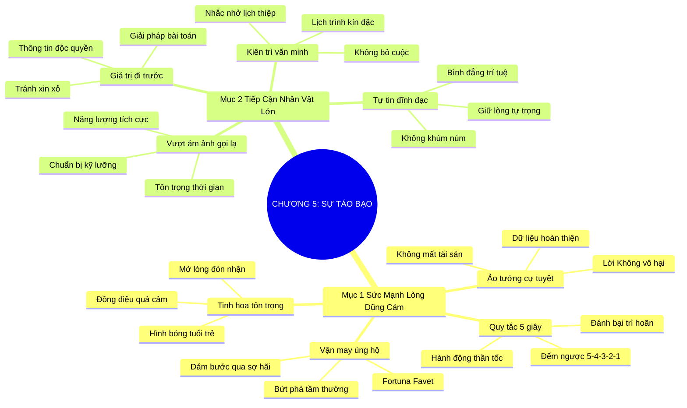

# SƠ ĐỒ TƯ DUY TRỰC QUAN: CHƯƠNG 5: THIÊN TÀI CỦA SỰ TÁO BẠO (THE GENIUS OF AUDACITY)
* **Thuộc phần**: Phần 1: Tư Duy Kết Nối (The Mindset)
* **Tác phẩm**: Đừng Bao Giờ Đi Ăn Một Mình (Never Eat Alone) - Keith Ferrazzi
* **Chuẩn hóa**: Document Structure-Anchored v2.4 (Không nhãn meta thừa, phản ánh 100% cấu trúc tài liệu)

---

## 🌳 SƠ ĐỒ TƯ DUY MERMAID (4-5 TẦNG CHI TIẾT)

---

## 🧬 BẢNG PHÂN CẤP TRUY HỒI CHỦ ĐỘNG (ACTIVE RECALL HIERARCHY)
Cấu trúc hóa tri thức theo các nhánh tài liệu phục vụ ôn tập nhanh và khắc sâu trí nhớ:

| 📑 Nhánh Mục Tài Liệu | 🔑 Từ Khóa Vàng / Khái Niệm | 📝 Nội Dung Truy Hồi Chủ Động (Active Recall) |
| :--- | :--- | :--- |
| Mục 1: Sức Mạnh Của Lòng Dũng Cảm | **Vận may ủng hộ** | Vận may luôn mỉm cười với người dũng cảm; can đảm hành động là đòn bẩy bứt phá tầm thường. |
| Mục 1: Sức Mạnh Của Lòng Dũng Cảm | **Ảo tưởng cự tuyệt** | Lời từ chối không làm bạn mất đi thứ gì; đó chỉ là dữ liệu để hoàn thiện cách tiếp cận. |
| Mục 1: Sức Mạnh Của Lòng Dũng Cảm | **Quy tắc 5 giây** | Đếm ngược 5-4-3-2-1 để hành động ngay lập tức trước khi não bộ dựng lên hàng rào phòng thủ. |
| Mục 2: Tiếp Cận Nhân Vật Tầm Cỡ | **Giá trị đi trước** | Luôn mang theo giải pháp hoặc thông tin giá trị trước khi xin phép được gặp gỡ. |
| Mục 2: Tiếp Cận Nhân Vật Tầm Cỡ | **Kiên trì văn minh** | Nhẹ nhàng theo dõi lại sau 7-10 ngày với thông tin hữu ích mới để thể hiện sự kiên định. |
| Mục 2: Tiếp Cận Nhân Vật Tầm Cỡ | **Tự tin đĩnh đạc** | Giữ vững lòng tự trọng nghề nghiệp và phong thái bình đẳng trí tuệ trước các nhân vật quyền lực. |

---

## ⚡ BẢNG NEO TRÍ NHỚ NHANH (MEMORY ANCHOR CHEAT SHEET)
Tóm tắt cô đọng các công thức và quy tắc hành động của chương:

| 📑 Phần/Mục Tài Liệu | 📌 Khái Niệm Cốt Lõi | ⚖️ Nguyên Lý Vàng | 🚀 Hành Động Chuyển Hóa Ngay |
| :--- | :--- | :--- | :--- |
| Mục 1: Lòng dũng cảm | **Quy tắc 5 giây** | Đếm 5-4-3-2-1 và nhấc máy hành động | Vượt qua sự chần chừ và nỗi sợ hãi |
| Mục 1: Lòng dũng cảm | **Giải mẫn cảm từ chối** | Xem lời từ chối là dữ liệu cải tiến | Xây dựng tâm lý vững vàng không tổn thương |
| Mục 2: Tiếp cận quyền lực | **Giá trị đi trước** | Mang giải pháp hữu ích trước khi nhờ vả | Tạo sự chú ý và tôn trọng tức thì |
| Mục 2: Tiếp cận quyền lực | **Tự tin đĩnh đạc** | Giữ phong thái đĩnh đạc không khúm núm | Định vị bản thân ngang hàng với cơ hội lớn |

