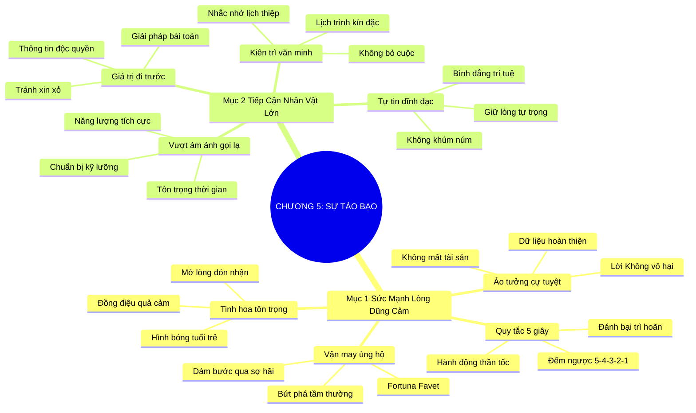

# TÓM TẮT CHƯƠNG SÁCH: CHƯƠNG 5: THIÊN TÀI CỦA SỰ TÁO BẠO (THE GENIUS OF AUDACITY)
* **Thuộc phần**: Phần 1: Tư Duy Kết Nối (The Mindset)
* **Tác giả**: Keith Ferrazzi (với Tahl Raz)
* **Chuẩn hóa cấu trúc**: Document Structure-Anchored v2.4

---

## 🌟 THÔNG ĐIỆP CỐT LÕI (CORE MESSAGE)
> Vận may luôn mỉm cười với người dũng cảm: Vượt qua nỗi sợ hãi bị từ chối bằng quy tắc 5 giây táo bạo, chủ động tiếp cận các nhân vật tầm cỡ trên nền tảng đề xuất giá trị độc quyền đi trước.

---

## 📊 LƯỢC ĐỒ PHÂN BỔ CẤU TRÚC TÀI LIỆU
Bảng đối chiếu tỷ lệ và cấu trúc luận điểm bám sát các đề mục thực tế trong tài liệu:

| 📑 Đề Mục Trong Tài Liệu Gốc | 🎯 Số Lượng Luận Điểm Chuyên Sâu |
| :--- | :---: |
| Mục 1: Sức Mạnh Của Lòng Dũng Cảm Và Sự Bạo Dạn (Fortune Favors The Bold) | 4 |
| Mục 2: Bài Học Về Cuộc Gọi Lạ & Nghệ Thuật Tiếp Cận Nhân Vật Tầm Cỡ (Reaching Out To Power) | 4 |
| **Tổng cộng toàn chương** | **8 Luận Điểm** |

---

## 💡 HỆ THỐNG LUẬN ĐIỂM QUAN TRỌNG (KEY TAKEAWAYS)

#### 📑 PHẦN: MỤC 1: SỨC MẠNH CỦA LÒNG DŨNG CẢM VÀ SỰ BẠO DẠN (FORTUNE FAVORS THE BOLD)

##### 1. Châm ngôn La Tinh: Vận may ủng hộ người dũng cảm
* **Phân Tích Chuyên Sâu**: Ngạn ngữ cổ La Tinh 'Fortuna Eruditis Favet' khẳng định: Vận may luôn mỉm cười với những người dám hành động táo bạo. Sự khác biệt lớn nhất giữa người thành công và kẻ tầm thường không phải là tài năng mà là lòng can đảm dám bước qua nỗi sợ để nắm bắt cơ hội.
* **Công Cụ / Phương Pháp Đi Kèm**: Tư duy táo bạo bứt phá (The Audacity Advantage), Ngạn ngữ cổ La Tinh.
* **Ví Dụ Thực Tế Ứng Dụng**: Dám gửi thư trực tiếp cho CEO tập đoàn hàng đầu đề xuất giải pháp marketing mới khi mới là sinh viên tốt nghiệp.

##### 2. Giải phẫu ảo tưởng về nỗi sợ bị từ chối
* **Phân Tích Chuyên Sâu**: Nỗi sợ bị cự tuyệt là rào cản tâm lý lớn nhất khiến con người tê liệt. Tuy nhiên, điều tồi tệ nhất có thể xảy ra khi bạn ngỏ lời là một lời 'Không', và bạn hoàn toàn không mất đi bất kỳ thứ gì so với trước khi ngỏ lời. Lời từ chối chỉ đơn giản là dữ liệu để bạn hoàn thiện cách tiếp cận.
* **Công Cụ / Phương Pháp Đi Kèm**: Giải mẫn cảm tâm lý từ chối (Rejection Immunity Drill).
* **Ví Dụ Thực Tế Ứng Dụng**: Nhận ra rằng bị từ chối một cuộc hẹn cà phê không hề làm tổn hại đến năng lực hay giá trị bản thân.

##### 3. Quy tắc 5 giây vượt qua sự do dự
* **Phân Tích Chuyên Sâu**: Khi một ý tưởng kết nối xuất hiện trong đầu, não bộ sẽ tìm mọi lý do trì hoãn trong vòng 5 giây. Đếm ngược 5-4-3-2-1 và lập tức nhấc máy hoặc bước tới chào hỏi sẽ giúp bạn vượt qua sự sợ hãi trước khi bộ não kịp dựng lên hàng rào phòng thủ.
* **Công Cụ / Phương Pháp Đi Kèm**: Quy tắc 5 giây hành động (The 5-Second Audacity Rule).
* **Ví Dụ Thực Tế Ứng Dụng**: Nhìn thấy diễn giả bước xuống sân khấu, đếm đến 3 và lập tức bước tới bắt tay chào hỏi.

##### 4. Phẩm chất táo bạo được giới tinh hoa tôn trọng
* **Phân Tích Chuyên Sâu**: Những nhà lãnh đạo kiệt xuất nhất đều là những người từng dám bứt phá và táo bạo trong quá khứ. Họ luôn nhìn thấy hình bóng tuổi trẻ của mình ở những người trẻ tuổi dám nghĩ, dám làm và dám tiếp cận họ với sự đĩnh đạc.
* **Công Cụ / Phương Pháp Đi Kèm**: Sự đồng điệu của lòng quả cảm (Audacity Resonance with Leaders).
* **Ví Dụ Thực Tế Ứng Dụng**: Vị tổng giám đốc đồng ý tiếp một sinh viên trẻ chỉ vì ấn tượng với sự bạo dạn và thông minh của lá thư xin gặp.

#### 📑 PHẦN: MỤC 2: BÀI HỌC VỀ CUỘC GỌI LẠ & NGHỆ THUẬT TIẾP CẬN NHÂN VẬT TẦM CỠ (REACHING OUT TO POWER)

##### 5. Vượt qua nỗi ám ảnh về cuộc gọi tiếp cận người lạ
* **Phân Tích Chuyên Sâu**: Gọi điện cho một nhân vật tầm cỡ không quen biết là thử thách cân não. Để thành công, bạn phải chuẩn bị kỹ lưỡng mệnh đề giá trị, nói chuyện với năng lượng tích cực và sự tôn trọng tối cao đối với thời gian của họ.
* **Công Cụ / Phương Pháp Đi Kèm**: Kỹ thuật tiếp cận đỉnh cao (Executive Cold Outreach Protocol).
* **Ví Dụ Thực Tế Ứng Dụng**: Chuẩn bị sẵn kịch bản 1 trang và luyện tập trước gương 3 lần trước khi bấm số gọi cho chủ tịch hiệp hội.

##### 6. Nguyên tắc mang lại giá trị độc quyền đi trước
* **Phân Tích Chuyên Sâu**: Đừng bao giờ tiếp cận một nhân vật lớn với đôi bàn tay trắng hoặc thái độ xin xỏ. Hãy mang đến cho họ một thông tin thị trường mới, một góc nhìn đột phá hoặc giải pháp cho bài toán họ đang trăn trở.
* **Công Cụ / Phương Pháp Đi Kèm**: Mệnh đề giá trị đi trước (Value-First Entry Proposition).
* **Ví Dụ Thực Tế Ứng Dụng**: Gửi một bản nghiên cứu đối thủ cạnh tranh ngắn gọn trước khi xin phép được trò chuyện 10 phút.

##### 7. Sự kiên trì lịch thiệp và không bỏ cuộc
* **Phân Tích Chuyên Sâu**: Các nhân vật lớn thường có lịch trình kín đặc. Nếu họ chưa trả lời, đừng vội nản lòng. Tiếp tục theo dõi lịch sự sau 1-2 tuần với một thông tin giá trị mới sẽ chứng minh sự nghiêm túc và kiên định của bạn.
* **Công Cụ / Phương Pháp Đi Kèm**: Kiên trì không quấy rầy (Polite Persistence Protocol).
* **Ví Dụ Thực Tế Ứng Dụng**: Gửi lại email lần 2 sau 10 ngày kèm bài báo mới liên quan đến đề tài đã trao đổi.

##### 8. Tự tin đĩnh đạc, không khúm núm hạ mình
* **Phân Tích Chuyên Sâu**: Tiếp cận tầng lớp quyền lực đòi hỏi sự khiêm nhường nhưng phải giữ vững lòng tự trọng. Nếu bạn khúm núm nịnh bợ, họ sẽ xem thường bạn; nếu bạn đĩnh đạc và bình đẳng về mặt trí tuệ, họ sẽ tôn trọng và mở lòng đón nhận bạn.
* **Công Cụ / Phương Pháp Đi Kèm**: Phong thái đĩnh đạc bình đẳng (Poised Equality Stance).
* **Ví Dụ Thực Tế Ứng Dụng**: Nói chuyện với giọng điệu trầm ấm, rõ ràng, mắt nhìn thẳng và trình bày quan điểm một cách tự tin.

---

## 🎯 KẾ HOẠCH HÀNH ĐỘNG TOÀN DIỆN (ACTION PLAN)
### ⚡ Cấp độ 1: Thói quen vi mô (Micro-habits < 2 phút mỗi ngày)
- [ ] Áp dụng quy tắc 5 giây đếm ngược để thực hiện 1 việc bạn đang chần chừ hôm nay
- [ ] Chọn ra 1 nhân vật có tầm ảnh hưởng lớn trong ngành mà bạn luôn sợ tiếp cận
- [ ] Soạn thảo một thông điệp tiếp cận mang lại giá trị thực sự cho nhân vật đó
- [ ] Đứng thẳng người, mỉm cười và hít thở sâu trước khi bấm số gọi điện
- [ ] Thực hành bài tập giải mẫn cảm từ chối: sẵn sàng đón nhận 3 lời từ chối tuần này

### 📅 Cấp độ 2: Thói quen tuần & Dự án ngắn hạn (Weekly Habits)
- [ ] Tiếp cận và bắt tay làm quen với một diễn giả tại sự kiện tiếp theo bạn tham dự
- [ ] Loại bỏ những từ ngữ tự ti như 'Em xin lỗi làm phiền anh' khi mở đầu câu chuyện
- [ ] Chuẩn bị một đề xuất giải pháp 1 trang cực kỳ ngắn gọn để gửi cho lãnh đạo
- [ ] Luyện tập phong thái tự tin đĩnh đạc trước gương mỗi sáng 2 phút
- [ ] Gửi lại email nhắc nhở lịch sự sau 7 ngày nếu đối tác lớn chưa kịp phản hồi

### 🚀 Cấp độ 3: Chiến lược chuyển hóa dài hạn (Long-term Strategy)
- [ ] Đọc các câu chuyện về sự can đảm của các nhà sáng lập nổi tiếng thế giới
- [ ] Tự hỏi bản thân: 'Điều tồi tệ nhất có thể xảy ra là gì, và mình có chịu đựng được không?'
- [ ] Nhận ra rằng người xuất chúng luôn trân trọng những người trẻ có lòng can đảm
- [ ] Ghi lại cảm xúc chiến thắng bản thân sau khi thực hiện một hành động táo bạo
- [ ] Cam kết: Sẽ không bao giờ để nỗi sợ hãi cướp đi những cơ hội lớn của cuộc đời

---

## ❓ BỘ CÂU HỎI TỰ VẤN & PHẢN TƯ SUY NGẪM (REFLECTION QUESTIONS)
### Nhóm 1: Nhận thức thực tại & Thói quen hiện tại
1. Lần gần nhất bạn hành động thực sự táo bạo trong sự nghiệp là khi nào, và kết quả ra sao?
2. Nỗi sợ bị từ chối đã từng khiến bạn đánh mất những cơ hội đổi đời nào trong quá khứ?
3. Tại sao ngạn ngữ La Tinh lại khẳng định rằng vận may luôn mỉm cười với người dũng cảm?
4. Bạn cảm thấy thế nào về quy tắc 5 giây đếm ngược để đánh bại sự chần chừ?
5. Khi tiếp cận một nhân vật quyền lực, bạn có giữ được phong thái bình đẳng và tự trọng không?

### Nhóm 2: Thách thức tâm lý & Rào cản nội tâm
6. Tại sao việc mang lại giá trị đi trước lại là chìa khóa mở toang cánh cửa của người bận rộn?
7. Lời từ chối có thực sự đáng sợ như trí tưởng tượng của bạn vẽ ra không?
8. Bạn học được điều gì về lòng can đảm từ câu chuyện của Keith Ferrazzi?
9. Sự khác biệt giữa một người 'táo bạo đĩnh đạc' và một kẻ 'liều lĩnh thô lỗ' là gì?
10. Khi ai đó không trả lời thư của bạn, bạn thường suy diễn tiêu cực hay kiên trì văn minh?

### Nhóm 3: Chiến lược hành động & Ứng dụng thực tế
11. Giới lãnh đạo cấp cao thường đánh giá cao những phẩm chất nào ở một người mới tiếp cận?
12. Làm thế nào để luyện tập sự tự tin trong giọng nói khi gọi điện thoại cho người lạ?
13. Bạn có sẵn sàng đặt mục tiêu bị từ chối 10 lần trong tháng này để rèn luyện bản lĩnh không?
14. Một bức thư tiếp cận xuất sắc cần chứa đựng những yếu tố nào để được hồi âm?
15. Nỗi sợ hãi lớn nhất trong tâm trí bạn hiện tại là gì, và làm sao để đối diện với nó?

### Nhóm 4: Chuyển hóa tư duy & Tầm nhìn dài hạn
16. Tại sao những người thành công nhất lại thường là những người từng bị từ chối nhiều nhất?
17. Làm sao để giữ vững lòng can đảm khi xung quanh toàn những lời bàn lùi và nghi ngờ?
18. Phong thái đĩnh đạc của bạn có thể rèn luyện được thông qua những thói quen hàng ngày nào?
19. Tại sao nói: 'Không hành động chính là thất bại tồi tệ nhất' trong nghệ thuật kết nối?
20. Hành động táo bạo nhất bạn sẽ dũng cảm thực hiện ngay trong sáng mai là gì?

---

## 🧠 SƠ ĐỒ TƯ DUY TRỰC QUAN (MINDMAP)

