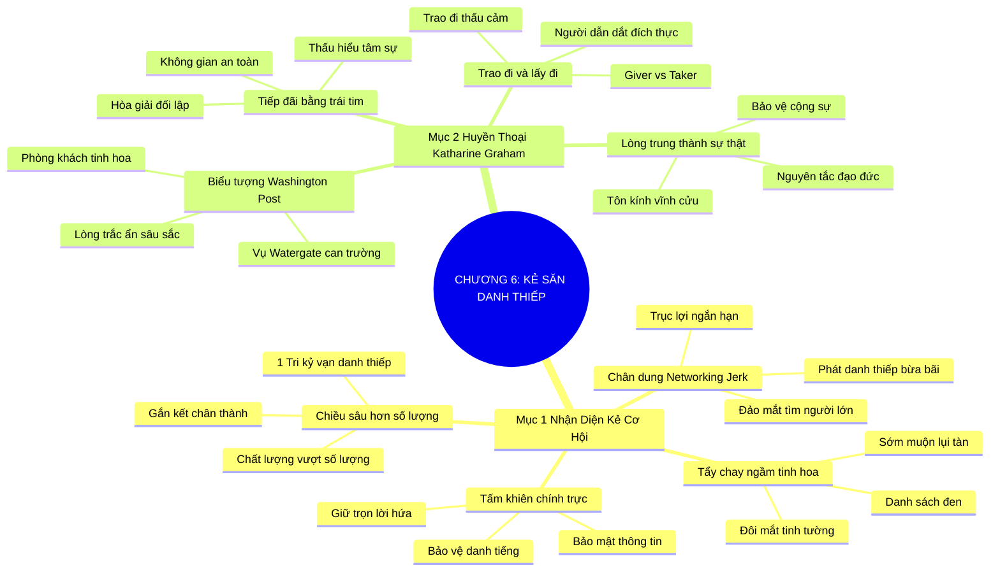

# SƠ ĐỒ TƯ DUY TRỰC QUAN: CHƯƠNG 6: KẺ SĂN DANH THIẾP (THE NETWORKING JERK)
* **Thuộc phần**: Phần 1: Tư Duy Kết Nối (The Mindset)
* **Tác phẩm**: Đừng Bao Giờ Đi Ăn Một Mình (Never Eat Alone) - Keith Ferrazzi
* **Chuẩn hóa**: Document Structure-Anchored v2.4 (Không nhãn meta thừa, phản ánh 100% cấu trúc tài liệu)

---

## 🌳 SƠ ĐỒ TƯ DUY MERMAID (4-5 TẦNG CHI TIẾT)

---

## 🧬 BẢNG PHÂN CẤP TRUY HỒI CHỦ ĐỘNG (ACTIVE RECALL HIERARCHY)
Cấu trúc hóa tri thức theo các nhánh tài liệu phục vụ ôn tập nhanh và khắc sâu trí nhớ:

| 📑 Nhánh Mục Tài Liệu | 🔑 Từ Khóa Vàng / Khái Niệm | 📝 Nội Dung Truy Hồi Chủ Động (Active Recall) |
| :--- | :--- | :--- |
| Mục 1: Nhận Diện Kẻ Cơ Hội | **Chân dung kẻ săn danh thiếp** | Kẻ cơ hội chỉ lo phát danh thiếp và trục lợi; biến kết nối thành mua bán thô thiển. |
| Mục 1: Nhận Diện Kẻ Cơ Hội | **Tẩy chay ngầm tinh hoa** | Giới tinh hoa nhanh chóng nhận diện và loại trừ những kẻ cơ hội ra khỏi vòng tròn tin cậy. |
| Mục 1: Nhận Diện Kẻ Cơ Hội | **Chiều sâu quan hệ** | Một người bạn tri kỷ chân thành có giá trị hơn hàng ngàn chiếc danh thiếp vô hồn. |
| Mục 2: Bậc Thầy Katharine Graham | **Biểu tượng Washington Post** | Katharine Graham quy tụ giới tinh hoa bằng lòng dũng cảm, sự chính trực và lòng trắc ẩn sâu xa. |
| Mục 2: Bậc Thầy Katharine Graham | **Không gian an toàn tâm lý** | Biến ngôi nhà thành không gian an toàn để các nhân vật quyền lực được giãi bày tâm sự. |
| Mục 2: Bậc Thầy Katharine Graham | **Tư duy Trao đi vs Lấy đi** | Người dẫn dắt đích thực đến sự kiện để trao đi sự nâng đỡ chứ không phải để lấy đi cơ hội. |

---

## ⚡ BẢNG NEO TRÍ NHỚ NHANH (MEMORY ANCHOR CHEAT SHEET)
Tóm tắt cô đọng các công thức và quy tắc hành động của chương:

| 📑 Phần/Mục Tài Liệu | 📌 Khái Niệm Cốt Lõi | ⚖️ Nguyên Lý Vàng | 🚀 Hành Động Chuyển Hóa Ngay |
| :--- | :--- | :--- | :--- |
| Mục 1: Kẻ săn danh thiếp | **Tránh bẫy cơ hội** | Không phát danh thiếp bừa bãi và đảo mắt tìm kiếm | Tập trung xây dựng chiều sâu gắn kết |
| Mục 1: Kẻ săn danh thiếp | **Tấm khiên chính trực** | Giữ trọn lời hứa và bảo mật thông tin | Bảo vệ danh tiếng trường tồn |
| Mục 2: Katharine Graham | **Phòng khách tinh hoa** | Tiếp đãi bằng lòng chân thành và sự chu đáo | Quy tụ những tâm hồn kiệt xuất |
| Mục 2: Katharine Graham | **Tư duy Trao đi** | Đến sự kiện để cống hiến và nâng đỡ người khác | Định vị phẩm giá người dẫn dắt |

