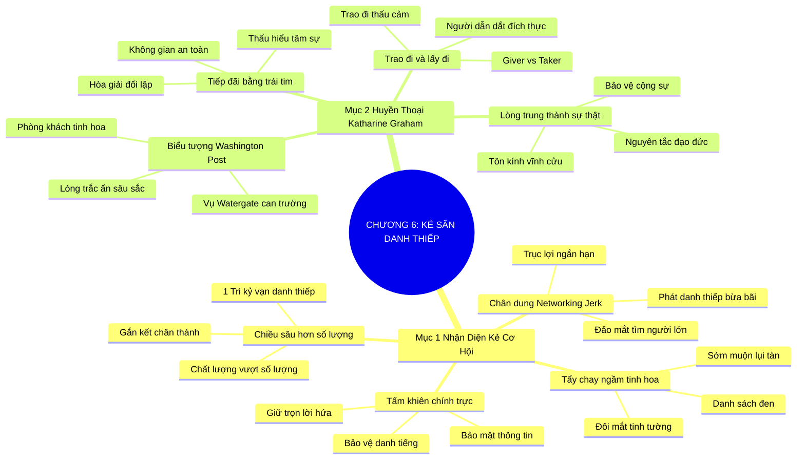

# TÓM TẮT CHƯƠNG SÁCH: CHƯƠNG 6: KẺ SĂN DANH THIẾP (THE NETWORKING JERK)
* **Thuộc phần**: Phần 1: Tư Duy Kết Nối (The Mindset)
* **Tác giả**: Keith Ferrazzi (với Tahl Raz)
* **Chuẩn hóa cấu trúc**: Document Structure-Anchored v2.4

---

## 🌟 THÔNG ĐIỆP CỐT LÕI (CORE MESSAGE)
> Chính trực là nền tảng tối cao: Nhận diện và loại trừ tư duy 'Kẻ săn danh thiếp' cơ hội vụ lợi, học tập phong cách kết nối đầy chiều sâu và lòng trắc ẩn của biểu tượng Katharine Graham để xây dựng uy tín bất biến.

---

## 📊 LƯỢC ĐỒ PHÂN BỔ CẤU TRÚC TÀI LIỆU
Bảng đối chiếu tỷ lệ và cấu trúc luận điểm bám sát các đề mục thực tế trong tài liệu:

| 📑 Đề Mục Trong Tài Liệu Gốc | 🎯 Số Lượng Luận Điểm Chuyên Sâu |
| :--- | :---: |
| Mục 1: Nhận Diện Những Kẻ Cơ Hội Và Thao Túng Trong Mạng Lưới (The Networking Jerk Unmasked) | 4 |
| Mục 2: Hồ Sơ Đại Sảnh Danh Vọng Nhà Kết Nối: Bà Katharine Graham | 4 |
| **Tổng cộng toàn chương** | **8 Luận Điểm** |

---

## 💡 HỆ THỐNG LUẬN ĐIỂM QUAN TRỌNG (KEY TAKEAWAYS)

#### 📑 PHẦN: MỤC 1: NHẬN DIỆN NHỮNG KẺ CƠ HỘI VÀ THAO TÚNG TRONG MẠNG LƯỚI (THE NETWORKING JERK UNMASKED)

##### 1. Chân dung của 'Kẻ săn danh thiếp' (The Networking Jerk)
* **Phân Tích Chuyên Sâu**: Kẻ săn danh thiếp là những kẻ cơ hội chỉ quan tâm đến việc phát thật nhiều danh thiếp tại các sự kiện, liên tục đảo mắt tìm kiếm những người quan trọng hơn khi đang nói chuyện với bạn, và chỉ tiếp cận người khác khi muốn trục lợi cá nhân. Họ biến nghệ thuật kết nối thành sự mua bán thô thiển.
* **Công Cụ / Phương Pháp Đi Kèm**: Bộ nhận diện kẻ cơ hội (The Networking Jerk Checklist), Đạo đức kết nối.
* **Ví Dụ Thực Tế Ứng Dụng**: Vừa bắt tay bạn vừa liếc nhìn quanh phòng xem có tổng giám đốc nào bước vào để chạy sang làm quen.

##### 2. Sự tẩy chay ngầm của cộng đồng tinh hoa
* **Phân Tích Chuyên Sâu**: Giới lãnh đạo xuất chúng có đôi mắt cực kỳ tinh tường. Những kẻ săn danh thiếp cơ hội nhanh chóng bị nhận diện và đưa vào 'danh sách đen' ngầm của cộng đồng. Sự nghiệp của họ có thể bùng lên chốc lát nhờ mánh khóe nhưng sẽ nhanh chóng lụi tàn.
* **Công Cụ / Phương Pháp Đi Kèm**: Cơ chế đào thải tự nhiên của mạng lưới (The Elite Blacklist Mechanism).
* **Ví Dụ Thực Tế Ứng Dụng**: Không một đối tác nào muốn làm việc chung lần thứ hai với người chỉ biết lợi dụng quan hệ để bán hàng.

##### 3. Chiều sâu quan hệ vượt trội số lượng danh thiếp
* **Phân Tích Chuyên Sâu**: Một mối quan hệ tri kỷ có giá trị gấp mười ngàn chiếc danh thiếp vô hồn nằm trong ngăn kéo. Hãy tập trung xây dựng sự gắn kết chân thành, tin cậy sâu sắc với một vài người bạn chiến lược thay vì chạy theo số lượng ảo.
* **Công Cụ / Phương Pháp Đi Kèm**: Nguyên lý chiều sâu quan hệ (Depth Over Breadth Principle).
* **Ví Dụ Thực Tế Ứng Dụng**: Dành trọn cả buổi tối trò chuyện sâu sắc với 2 người bạn mới thay vì chạy quanh bắt tay 50 người tại tiệc cocktail.

##### 4. Sự chính trực: Vũ khí bảo vệ uy tín trường tồn
* **Phân Tích Chuyên Sâu**: Trong thế giới kinh doanh phẳng, uy tín của bạn lan truyền nhanh hơn bạn nghĩ. Giữ trọn lời hứa, bảo mật thông tin và luôn đối xử tử tế với tất cả mọi người là tấm khiên vững chắc nhất bảo vệ danh tiếng của bạn.
* **Công Cụ / Phương Pháp Đi Kèm**: Tấm khiên chính trực (The Integrity Shield Protocol).
* **Ví Dụ Thực Tế Ứng Dụng**: Từ chối tiết lộ thông tin nội bộ của đối tác cũ dù được đối tác mới hứa hẹn trả thù lao lớn.

#### 📑 PHẦN: MỤC 2: HỒ SƠ ĐẠI SẢNH DANH VỌNG NHÀ KẾT NỐI: BÀ KATHARINE GRAHAM

##### 5. Biểu tượng Katharine Graham: Người phụ nữ thép của tờ Washington Post
* **Phân Tích Chuyên Sâu**: Katharine Graham, chủ tịch huyền thoại của tập đoàn Washington Post, là biểu tượng đỉnh cao của nghệ thuật kết nối chân chính. Bà không dùng thủ thuật; bà quy tụ các tổng thống, nhà ngoại giao, nhà báo và học giả hàng đầu về phòng khách nhà mình bằng sự chân thành, lòng dũng cảm và lòng trắc ẩn sâu xa.
* **Công Cụ / Phương Pháp Đi Kèm**: Mô hình phòng khách tinh hoa (The Graham Salon Diplomacy - Katharine Graham).
* **Ví Dụ Thực Tế Ứng Dụng**: Dũng cảm bảo vệ các phóng viên vụ Watergate bất chấp áp lực đe dọa khủng khiếp từ Nhà Trắng.

##### 6. Nghệ thuật tiếp đãi bằng trái tim và sự chu đáo tối cao
* **Phân Tích Chuyên Sâu**: Katharine Graham biến ngôi nhà của mình thành nơi hội tụ của những tâm hồn kiệt xuất. Bà nhớ rõ từng sở thích, mối bận tâm và luôn tạo ra không gian an toàn tuyệt đối để những nhân vật quyền lực nhất được cởi mở giãi bày tâm sự.
* **Công Cụ / Phương Pháp Đi Kèm**: Không gian an toàn tâm lý (Psychological Safety Hosting).
* **Ví Dụ Thực Tế Ứng Dụng**: Tổ chức những bữa tối ấm cúng nơi cả hai đảng phái đối lập đều có thể ngồi lại trò chuyện hòa nhã.

##### 7. Lòng trung thành với sự thật và đồng nghiệp
* **Phân Tích Chuyên Sâu**: Sức mạnh kết nối của Katharine Graham bắt nguồn từ nhân cách kiên định và lòng trung thành tuyệt đối với sự thật và các cộng sự. Khi bạn bảo vệ đội ngũ và giữ vững nguyên tắc đạo đức, bạn giành được sự tôn kính vĩnh cửu của xã hội.
* **Công Cụ / Phương Pháp Đi Kèm**: Lãnh đạo bằng lòng trung thành và sự thật (Truth & Loyalty Leadership).
* **Ví Dụ Thực Tế Ứng Dụng**: Sẵn sàng đối mặt với nguy cơ phá sản của tờ báo để bảo vệ quyền tự do báo chí và các phóng viên điều tra.

##### 8. Bài học đối chiếu: Kẻ săn danh thiếp vs. Bậc thầy phụng sự
* **Phân Tích Chuyên Sâu**: Kẻ săn danh thiếp đến sự kiện để 'lấy đi' danh thiếp và cơ hội; bậc thầy kết nối như Katharine Graham đến để 'trao đi' sự thấu cảm, sự nâng đỡ và không gian đối thoại văn minh. Đó là ranh giới giữa kẻ cơ hội và người dẫn dắt.
* **Công Cụ / Phương Pháp Đi Kèm**: Thước đo tư duy: Lấy đi vs. Trao đi (Giver vs. Taker Paradigm).
* **Ví Dụ Thực Tế Ứng Dụng**: Được cả thế giới nghiêng mình kính cẩn trong ngày tang lễ vì những đóng góp nhân văn vĩ đại cho xã hội.

---

## 🎯 KẾ HOẠCH HÀNH ĐỘNG TOÀN DIỆN (ACTION PLAN)
### ⚡ Cấp độ 1: Thói quen vi mô (Micro-habits < 2 phút mỗi ngày)
- [ ] Tự kiểm điểm bản thân xem có từng bộc lộ hành vi của 'kẻ săn danh thiếp' không
- [ ] Tập trung lắng nghe 100% ánh mắt khi nói chuyện, tuyệt đối không nhìn dáo dác quanh phòng
- [ ] Hạn chế phát danh thiếp bừa bãi; chỉ trao khi đã có cuộc đối thoại ý nghĩa
- [ ] Đọc cuốn tự truyện đoạt giải Pulitzer 'Personal History' của Katharine Graham
- [ ] Tạo ra một không gian trò chuyện an toàn, chân thành cho bạn bè và đồng nghiệp

### 📅 Cấp độ 2: Thói quen tuần & Dự án ngắn hạn (Weekly Habits)
- [ ] Giữ kín thông tin riêng tư mà người khác đã tin tưởng tâm sự với bạn
- [ ] Loại bỏ ngay thói quen chỉ tìm đến người khác khi bản thân cần trục lợi
- [ ] Chủ động hỏi: 'Tôi có thể hỗ trợ điều gì cho dự án của anh?' khi gặp đối tác mới
- [ ] Từ chối tham gia vào các cuộc bàn tán nói xấu người khác sau lưng
- [ ] Bảo vệ danh dự và uy tín của đồng nghiệp khi họ gặp khó khăn hoặc chỉ trích

### 🚀 Cấp độ 3: Chiến lược chuyển hóa dài hạn (Long-term Strategy)
- [ ] Thực hành lòng biết ơn đối với những người phục vụ thầm lặng trong sự kiện
- [ ] Giữ trọn lời hứa dù là lời hứa nhỏ nhất với một người mới quen
- [ ] Đánh giá lại mạng lưới: Bạn đang có bao nhiêu người bạn tri kỷ thực sự?
- [ ] Rèn luyện phong thái tiếp đãi nồng hậu và ấm áp tại nhà riêng
- [ ] Cam kết xây dựng sự nghiệp trên nền tảng chính trực và sự phụng sự bền vững

---

## ❓ BỘ CÂU HỎI TỰ VẤN & PHẢN TƯ SUY NGẪM (REFLECTION QUESTIONS)
### Nhóm 1: Nhận thức thực tại & Thói quen hiện tại
1. Bạn đã bao giờ cảm thấy khó chịu khi nói chuyện với một 'kẻ săn danh thiếp' chưa?
2. Những hành vi nào trong giao tiếp khiến bạn lập tức mất lòng tin vào đối phương?
3. Tại sao giới tinh hoa lại có cơ chế tẩy chay ngầm rất nhanh đối với những kẻ cơ hội?
4. Katharine Graham đã chứng minh điều gì về sức mạnh của sự chính trực và lòng trắc ẩn?
5. Bạn đang tìm kiếm chiều sâu trong quan hệ hay chỉ chạy theo số lượng bạn bè trên mạng?

### Nhóm 2: Thách thức tâm lý & Rào cản nội tâm
6. Cảm giác của bạn thế nào khi đang nói chuyện mà người đối diện lại liếc mắt tìm người khác?
7. Làm thế nào để bảo vệ bản thân khỏi sự lợi dụng của những kẻ cơ hội thao túng?
8. Tại sao lòng trung thành với sự thật và đồng đội lại là vũ khí bảo vệ danh tiếng tối thượng?
9. Bạn muốn được nhớ đến như một 'kẻ săn danh thiếp lanh lợi' hay một 'người bạn tri kỷ đáng tin'?
10. Điều gì tạo nên sự khác biệt giữa phòng khách của Katharine Graham và một buổi tiệc cocktail thông thường?

### Nhóm 3: Chiến lược hành động & Ứng dụng thực tế
11. Bạn có đang giữ lời hứa nhỏ nhất với những người xung quanh không?
12. Làm sao để xây dựng một không gian an toàn tâm lý nơi mọi người dám nói thật với bạn?
13. Sự cám dỗ lớn nhất khiến con người đánh đổi lòng chính trực để lấy lợi ích ngắn hạn là gì?
14. Khi một người bạn gặp hoạn nạn, bạn có dám đứng ra bảo vệ họ như Katharine Graham bảo vệ phóng viên?
15. Tại sao tư duy 'trao đi' luôn chiến thắng áp đảo tư duy 'lấy đi' trong cuộc đời dài hạn?

### Nhóm 4: Chuyển hóa tư duy & Tầm nhìn dài hạn
16. Bạn cảm nhận thế nào về trách nhiệm bảo mật thông tin trong các mối quan hệ kinh doanh?
17. Làm thế nào để từ chối một yêu cầu không phù hợp mà vẫn giữ được sự tôn trọng lẫn nhau?
18. Một tấm gương về sự chính trực trong cuộc đời mà bạn luôn noi theo là ai?
19. Tại sao nói: 'Uy tín là thứ mất nhiều năm để xây dựng nhưng có thể bị phá hủy trong 5 giây'?
20. Hành động cụ thể nào bạn sẽ thực hiện hôm nay để thể hiện sự chính trực tuyệt đối của mình?

---

## 🧠 SƠ ĐỒ TƯ DUY TRỰC QUAN (MINDMAP)

