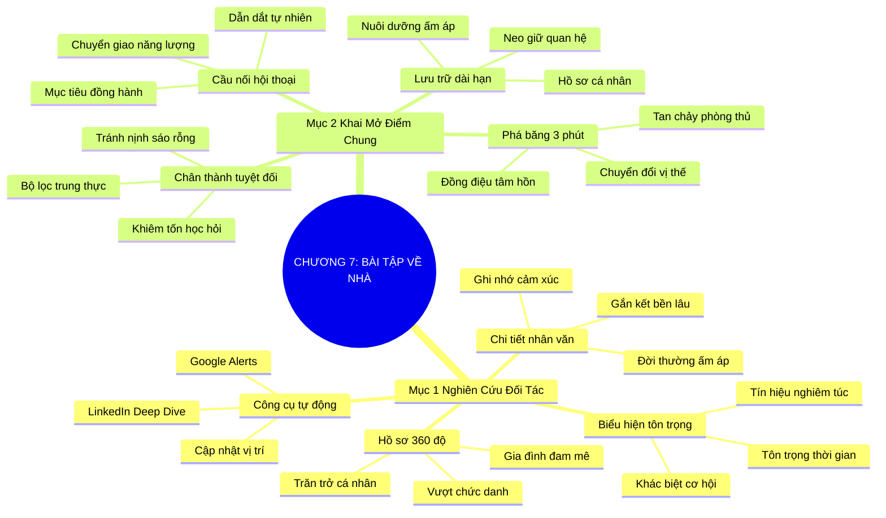

# SƠ ĐỒ TƯ DUY TRỰC QUAN: CHƯƠNG 7: CHUẨN BỊ BÀI TẬP VỀ NHÀ (DO YOUR HOMEWORK)
* **Thuộc phần**: Phần 2: Bộ Kỹ Năng Thực Chiến (The Skill Set)
* **Tác phẩm**: Đừng Bao Giờ Đi Ăn Một Mình (Never Eat Alone) - Keith Ferrazzi
* **Chuẩn hóa**: Document Structure-Anchored v2.4 (Không nhãn meta thừa, phản ánh 100% cấu trúc tài liệu)

---

## 🌳 SƠ ĐỒ TƯ DUY MERMAID (4-5 TẦNG CHI TIẾT)

---

## 🧬 BẢNG PHÂN CẤP TRUY HỒI CHỦ ĐỘNG (ACTIVE RECALL HIERARCHY)
Cấu trúc hóa tri thức theo các nhánh tài liệu phục vụ ôn tập nhanh và khắc sâu trí nhớ:

| 📑 Nhánh Mục Tài Liệu | 🔑 Từ Khóa Vàng / Khái Niệm | 📝 Nội Dung Truy Hồi Chủ Động (Active Recall) |
| :--- | :--- | :--- |
| Mục 1: Nghiên Cứu Đối Tác Trước Cuộc Gặp | **Hồ sơ 360 độ** | Tìm hiểu sở thích, gia đình, giá trị vượt ra ngoài chức danh công việc. |
| Mục 1: Nghiên Cứu Đối Tác Trước Cuộc Gặp | **Tín hiệu tôn trọng** | Sự chuẩn bị kỹ lưỡng chứng minh bạn trân trọng con người và thời gian của họ. |
| Mục 1: Nghiên Cứu Đối Tác Trước Cuộc Gặp | **Chi tiết nhân văn** | Cảm xúc ấm áp từ các câu chuyện đời thường đánh bại mọi số liệu báo cáo khô khan. |
| Mục 2: Biến Điểm Chung Thành Cầu Nối Cảm Xúc | **Phá băng 3 phút** | Điểm tương đồng về đam mê, xuất thân làm tan biến hàng rào phòng thủ ngay lập tức. |
| Mục 2: Biến Điểm Chung Thành Cầu Nối Cảm Xúc | **Chân thành tuyệt đối** | Không tâng bốc giả tạo, luôn khiêm tốn hỏi han và học hỏi sở thích của đối phương. |
| Mục 2: Biến Điểm Chung Thành Cầu Nối Cảm Xúc | **Lưu trữ bền vững** | Ghi chú lại điểm chung vào danh bạ để nuôi dưỡng kết nối dài hạn qua năm tháng. |

---

## ⚡ BẢNG NEO TRÍ NHỚ NHANH (MEMORY ANCHOR CHEAT SHEET)
Tóm tắt cô đọng các công thức và quy tắc hành động của chương:

| 📑 Phần/Mục Tài Liệu | 📌 Khái Niệm Cốt Lõi | ⚖️ Nguyên Lý Vàng | 🚀 Hành Động Chuyển Hóa Ngay |
| :--- | :--- | :--- | :--- |
| Mục 1: Nghiên cứu đối tác | **Hồ sơ 360 độ** | Tìm hiểu gia đình, đam mê, trường cũ trước cuộc gặp | Dành 15 phút rà soát thông tin đối tác trên mạng |
| Mục 1: Nghiên cứu đối tác | **Sự tôn trọng** | Chuẩn bị kỹ là thông điệp coi trọng tối cao | Gửi tín hiệu nghiêm túc và chuyên nghiệp |
| Mục 2: Điểm chung cảm xúc | **Phá băng 3 phút** | Chạm vào sở thích chung để xóa bỏ hàng rào nghi kỵ | Hỏi han về thể thao, ẩm thực trước khi bàn hợp đồng |
| Mục 2: Điểm chung cảm xúc | **Cầu nối hội thoại** | Chuyển từ đam mê chung sang tinh thần hợp tác dự án | Gắn kết tự nhiên không gượng ép |

