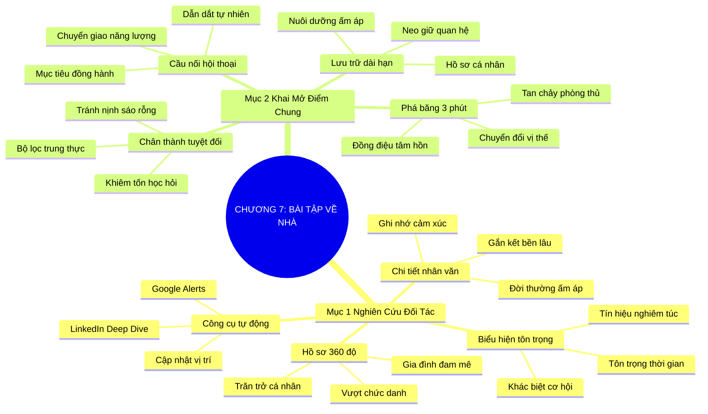

# TÓM TẮT CHƯƠNG SÁCH: CHƯƠNG 7: CHUẨN BỊ BÀI TẬP VỀ NHÀ (DO YOUR HOMEWORK)
* **Thuộc phần**: Phần 2: Bộ Kỹ Năng Thực Chiến (The Skill Set)
* **Tác giả**: Keith Ferrazzi (với Tahl Raz)
* **Chuẩn hóa cấu trúc**: Document Structure-Anchored v2.4

---

## 🌟 THÔNG ĐIỆP CỐT LÕI (CORE MESSAGE)
> Sự chuẩn bị kỹ lưỡng là cha đẻ của mọi sự may mắn: Nghiên cứu thấu đáo về con người, sở thích và gia đình của đối tác trước mỗi cuộc gặp sẽ biến sự căng thẳng phòng thủ thành kết nối cảm xúc chân thành ngay trong 3 phút đầu tiên.

---

## 📊 LƯỢC ĐỒ PHÂN BỔ CẤU TRÚC TÀI LIỆU
Bảng đối chiếu tỷ lệ và cấu trúc luận điểm bám sát các đề mục thực tế trong tài liệu:

| 📑 Đề Mục Trong Tài Liệu Gốc | 🎯 Số Lượng Luận Điểm Chuyên Sâu |
| :--- | :---: |
| Mục 1: Nghệ Thuật Nghiên Cứu Đối Tác Trước Mỗi Cuộc Gặp Gỡ (Researching Your Contacts) | 4 |
| Mục 2: Biến Điểm Chung Thành Cây Cầu Kết Nối Cảm Xúc (Finding Common Ground) | 4 |
| **Tổng cộng toàn chương** | **8 Luận Điểm** |

---

## 💡 HỆ THỐNG LUẬN ĐIỂM QUAN TRỌNG (KEY TAKEAWAYS)

#### 📑 PHẦN: MỤC 1: NGHỆ THUẬT NGHIÊN CỨU ĐỐI TÁC TRƯỚC MỖI CUỘC GẶP GỠ (RESEARCHING YOUR CONTACTS)

##### 1. Nghiên cứu hồ sơ 360 độ vượt ngoài ranh giới chức danh công việc
* **Phân Tích Chuyên Sâu**: Phần lớn mọi người chỉ tìm hiểu qua loa tên tuổi, chức danh và doanh thu công ty đối tác trước buổi gặp. Tuy nhiên, đằng sau mỗi vị CEO hay nhà đàm phán quyền lực luôn là một con người bằng xương bằng thịt với những sở thích, giá trị nhân sinh và niềm tự hào cá nhân sâu sắc. Việc tìm hiểu trường học cũ, môn thể thao yêu thích, các tổ chức từ thiện đang bảo trợ, hay thành tích thể thao/nghệ thuật của con cái họ chính là chìa khóa vàng giúp bạn tiếp cận đúng tần số tâm hồn của đối phương.
* **Công Cụ / Phương Pháp Đi Kèm**: Hồ sơ nghiên cứu 360 độ (Pre-Meeting Dossier), Bảng ma trận thông tin cá nhân 4x4 (Gia đình, Đam mê, Sự nghiệp, Trăn trở), Công cụ Google Alerts & LinkedIn Deep Dive.
* **Ví Dụ Thực Tế Ứng Dụng**: Keith Ferrazzi luôn dành ít nhất vài giờ trước mỗi cuộc gặp với các CEO tập đoàn lớn để đọc phỏng vấn báo chí, tìm hiểu con cái họ chơi môn thể thao nào, từ đó mở đầu câu chuyện bằng lời chúc mừng chiến thắng bóng đá của con họ thay vì số liệu tài chính khô khan.

##### 2. Sự chuẩn bị là biểu hiện tối cao của lòng tôn trọng
* **Phân Tích Chuyên Sâu**: Khi bạn bước vào phòng họp và cho thấy bạn đã bỏ thời gian, công sức để hiểu rõ về lịch sử và định hướng của đối tác, bạn phát đi một tín hiệu ngầm vô cùng mạnh mẽ: 'Tôi coi trọng thời gian của bạn, tôi tôn trọng con người bạn và tôi đến đây với sự nghiêm túc tuyệt đối'. Điều này ngay lập tức phân biệt bạn với hàng trăm kẻ cơ hội chỉ muốn đến để bán hàng hay nhờ vả qua loa.
* **Công Cụ / Phương Pháp Đi Kèm**: Quy tắc tôn trọng phát thanh (Respect Anchor), Bản tóm tắt bối cảnh 1 trang (One-Page Briefing).
* **Ví Dụ Thực Tế Ứng Dụng**: Trước buổi phỏng vấn xin việc hoặc gọi vốn, ứng viên trình bày chi tiết về định hướng chiến lược 3 năm tới của công ty dựa trên các bài phỏng vấn gần nhất của nhà sáng lập, khiến ban giám đốc ấn tượng sâu sắc.

##### 3. Khai thác những chi tiết nhân văn đời thường thay vì con số thương mại
* **Phân Tích Chuyên Sâu**: Con người có thể nhanh chóng quên đi biểu đồ doanh thu hay các điều khoản hợp đồng sau cuộc họp, nhưng họ sẽ ghi nhớ mãi cảm giác ấm áp khi một đối tác nhớ rõ chuyến chạy marathon vừa qua hay sở thích sưu tầm tranh cổ của họ. Những chi tiết đời thường đánh thức bản năng kết nối người-với-người nguyên bản nhất.
* **Công Cụ / Phương Pháp Đi Kèm**: Nhật ký ghi chú nhân văn (Human Detail Log), Kỹ thuật lắng nghe chủ động tìm kiếm từ khóa cảm xúc.
* **Ví Dụ Thực Tế Ứng Dụng**: Hỏi han chân thành về chuyến nghỉ dưỡng gia đình tại vùng biển miền Trung mà đối tác vừa chia sẻ trên mạng xã hội trước khi mở tài liệu đàm phán.

##### 4. Thiết lập hệ thống thông tin tình báo quan hệ tự động
* **Phân Tích Chuyên Sâu**: Để không bị động trước các cuộc gặp đột xuất, một nhà kết nối chuyên nghiệp phải xây dựng thói quen theo dõi tin tức về các nhân vật chủ chốt trong ngành liên tục thông qua các bộ lọc tự động, giúp cập nhật tức thời khi họ thay đổi vị trí công tác hoặc nhận giải thưởng.
* **Công Cụ / Phương Pháp Đi Kèm**: Google Alerts theo tên nhân vật & công ty, RSS feed tin tức ngành, Bảng theo dõi nhân sự trọng điểm.
* **Ví Dụ Thực Tế Ứng Dụng**: Nhận thông báo tự động khi một đối tác cũ vừa được bổ nhiệm chức danh Phó Tổng Giám đốc và lập tức gửi thiệp chúc mừng trong vòng 24 giờ.

#### 📑 PHẦN: MỤC 2: BIẾN ĐIỂM CHUNG THÀNH CÂY CẦU KẾT NỐI CẢM XÚC (FINDING COMMON GROUND)

##### 5. Khai thông điểm giao thoa cảm xúc trong 3 phút đầu tiên
* **Phân Tích Chuyên Sâu**: Điểm giao thoa chung (Common Ground) là chất xúc tác mạnh nhất làm tan chảy lớp băng phòng thủ của thế giới thương trường. Khi tìm ra một điểm chung chân thực—dù là cùng lớn lên ở thị trấn nhỏ, cùng yêu thích ẩm thực vùng cao hay cùng đam mê chạy bộ—cuộc gặp gỡ ngay lập tức chuyển đổi trạng thái từ 'đàm phán đối đầu' sang 'chia sẻ thân tình giữa hai người bạn'.
* **Công Cụ / Phương Pháp Đi Kèm**: Quy tắc 3 phút phá băng cảm xúc (The 3-Minute Icebreaker), Bản đồ điểm tương đồng sở thích (Interest Affinity Map).
* **Ví Dụ Thực Tế Ứng Dụng**: Keith nhận ra đối tác cũng từng làm caddie tại sân golf thời niên thiếu, hai bên hào hứng kể lại kỷ niệm nhặt bóng và trở thành bạn bè thân thiết trước khi thảo luận hợp đồng triệu đô.

##### 6. Chân thành tuyệt đối, nói không với tâng bốc gượng gạo
* **Phân Tích Chuyên Sâu**: Điểm chung chỉ có sức mạnh khi nó bắt nguồn từ sự đồng cảm chân thực. Mọi sự giả vờ hiểu biết hay ca tụng nịnh nọt sáo rỗng về sở thích của đối tác đều rất dễ bị phát hiện và sẽ phá hủy hoàn toàn uy tín của bạn.
* **Công Cụ / Phương Pháp Đi Kèm**: Bộ lọc trung thực nội tại (Authenticity Filter), Thừa nhận sự tò mò học hỏi nếu chưa hiểu biết về sở thích của đối tác.
* **Ví Dụ Thực Tế Ứng Dụng**: Thay vì giả vờ am hiểu về rượu vang cổ, hãy thành thật: 'Tôi biết anh là chuyên gia rượu vang, tôi rất tò mò muốn học hỏi xem làm sao phân biệt được các niên vụ vang Pháp'.

##### 7. Chuyển giao năng lượng tích cực từ điểm chung sang mục tiêu công việc
* **Phân Tích Chuyên Sâu**: Sau khi tạo được sự gắn kết cảm xúc ban đầu qua điểm tương đồng, bạn cần khéo léo điều hướng cuộc đối thoại sang mục tiêu chuyên môn một cách tự nhiên, giữ trọn vẹn sự cởi mở và thiện chí của cả hai bên.
* **Công Cụ / Phương Pháp Đi Kèm**: Kỹ thuật cầu nối hội thoại (Conversational Bridge Technique: 'Chính tinh thần kỷ luật của môn chạy bộ đó cũng là cách chúng tôi tiếp cận dự án này...').
* **Ví Dụ Thực Tế Ứng Dụng**: Sử dụng bài học kiên trì từ các giải chạy marathon mà cả hai cùng tham gia để làm bàn đạp giải thích cam kết đồng hành vượt khó trong dự án chung.

##### 8. Lưu trữ điểm tương đồng vào hồ sơ quan hệ dài hạn
* **Phân Tích Chuyên Sâu**: Điểm chung không chỉ dùng cho một cuộc gặp duy nhất mà là sợi dây neo giữ mối quan hệ lâu dài. Việc lưu lại chi tiết này giúp các lần tái liên lạc sau nhiều tháng, nhiều năm luôn giữ được sự ấm áp và gần gũi.
* **Công Cụ / Phương Pháp Đi Kèm**: Trường dữ liệu 'Common Ground' trong phần mềm quản lý quan hệ cá nhân (Personal CRM/Notion).
* **Ví Dụ Thực Tế Ứng Dụng**: Ghi chú 'thích xe đạp địa phương' vào hồ sơ khách hàng, 6 tháng sau gửi một bài báo về cung đường trekking mới mở tại Tây Bắc.

---

## 🎯 KẾ HOẠCH HÀNH ĐỘNG TOÀN DIỆN (ACTION PLAN)
### ⚡ Cấp độ 1: Thói quen vi mô (Micro-habits < 2 phút mỗi ngày)
- [ ] Dành 15-30 phút tìm kiếm hồ sơ LinkedIn, bài báo gần nhất của đối tác trước mỗi cuộc họp tuần tới
- [ ] Tạo trường 'Sở thích & Điểm chung' trong danh bạ điện thoại hoặc file ghi chú liên lạc
- [ ] Cài đặt Google Alerts cho 5 đối tác quan trọng nhất để nhận tin tức tự động
- [ ] Chuẩn bị sẵn 2-3 câu hỏi phá băng về đề tài nhân văn/đời sống cho cuộc gặp ngày mai
- [ ] Tìm hiểu trường học cũ, quê hương của khách hàng chuẩn bị đàm phán

### 📅 Cấp độ 2: Thói quen tuần & Dự án ngắn hạn (Weekly Habits)
- [ ] Kiểm tra xem đối tác có bảo trợ quỹ từ thiện hoặc câu lạc bộ thể thao nào không
- [ ] Luyện tập câu nói mở đầu phá băng dựa trên điểm chung trong 3 phút đầu
- [ ] Ghi chú ngay lại 1 chi tiết thú vị mà đối tác vừa chia sẻ sau khi kết thúc cuộc họp
- [ ] Chia sẻ một bài viết hay về môn thể thao đối tác thích kèm tin nhắn ngắn gọn
- [ ] Rà soát danh sách 10 khách hàng lớn để cập nhật thông tin đời tư nhân văn

### 🚀 Cấp độ 3: Chiến lược chuyển hóa dài hạn (Long-term Strategy)
- [ ] Tự đánh giá lại mức độ chuẩn bị bài tập về nhà trước các cuộc họp gần nhất
- [ ] Thiết lập bảng tóm tắt 1 trang (One-Page Briefing) cho các cuộc đàm phán lớn
- [ ] Đặt câu hỏi chân thành xin học hỏi nếu đối tác đam mê một lĩnh vực bạn chưa biết
- [ ] Tuyệt đối tránh mở đầu cuộc họp bằng việc đi thẳng vào báo cáo khô khan
- [ ] Xây dựng thư mục lưu trữ bài nghiên cứu về các chuyên gia hàng đầu trong ngành

---

## ❓ BỘ CÂU HỎI TỰ VẤN & PHẢN TƯ SUY NGẪM (REFLECTION QUESTIONS)
### Nhóm 1: Nhận thức thực tại & Thói quen hiện tại
1. Bạn thường dành bao nhiêu phút để tìm hiểu về đối tác trước khi bước vào một cuộc họp quan trọng?
2. Lần gần nhất bạn bước vào phòng họp mà chỉ biết sơ sài chức danh của đối phương là khi nào, và kết quả ra sao?
3. Bạn có thực sự xem việc nghiên cứu đời tư nhân văn của đối tác là sự tôn trọng hay chỉ là mánh khóe?
4. Những chi tiết nào về gia đình, sở thích thường tạo ra sự rung cảm lớn nhất trong các cuộc tiếp xúc?
5. Làm thế nào để phân biệt giữa việc nghiên cứu chân thành với hành vi soi mói đời tư quá đà?

### Nhóm 2: Thách thức tâm lý & Rào cản nội tâm
6. Bạn đã từng phá vỡ sự lạnh lùng của một đối tác khó tính nhờ một sở thích chung chưa?
7. Nếu không tìm thấy bất kỳ điểm chung nào trên mạng xã hội, bạn sẽ làm gì để khai mở nó trong cuộc gặp?
8. Bạn có đang sử dụng các công cụ cảnh báo tin tức tự động để theo dõi mạng lưới quan hệ không?
9. Tại sao những con số doanh thu lại nhanh chóng bị lãng quên trong khi cảm xúc kết nối lại được ghi nhớ?
10. Bạn sẽ phản ứng ra sao nếu phát hiện đối phương cũng đã 'làm bài tập về nhà' rất kỹ về bạn?

### Nhóm 3: Chiến lược hành động & Ứng dụng thực tế
11. Bạn có giữ thói quen ghi chú lại thông tin nhân văn ngay sau khi rời khỏi quán cà phê không?
12. Làm sao để việc khen ngợi sở thích của đối tác không trở thành lời tâng bốc nịnh nọt sáo rỗng?
13. Bạn có sẵn sàng thành thật thừa nhận mình chưa hiểu về đam mê của đối tác để xin họ chỉ dẫn không?
14. Việc tìm điểm chung có giúp bạn vượt qua nỗi sợ hãi khi gặp gỡ những nhân vật quyền lực không?
15. Bạn có lưu trữ các thông tin điểm chung này vào một hệ thống danh bạ bài bản không?

### Nhóm 4: Chuyển hóa tư duy & Tầm nhìn dài hạn
16. Ba câu hỏi mở đầu yêu thích nhất của bạn để khơi gợi sở thích của người đối diện là gì?
17. Khi phát hiện đối tác có cùng quê hương hoặc trường đại học, bạn tận dụng điều đó như thế nào?
18. Bạn cảm thấy thế nào khi một đối tác nhớ chính xác tên con cái hay chuyến du lịch của bạn?
19. Tại sao sự chuẩn bị kỹ lưỡng lại được gọi là 'cha đẻ của mọi sự may mắn' trong kết nối?
20. Kế hoạch hành động cụ thể của bạn để nâng cấp quy trình chuẩn bị trước cuộc họp tuần này là gì?

---

## 🧠 SƠ ĐỒ TƯ DUY TRỰC QUAN (MINDMAP)

