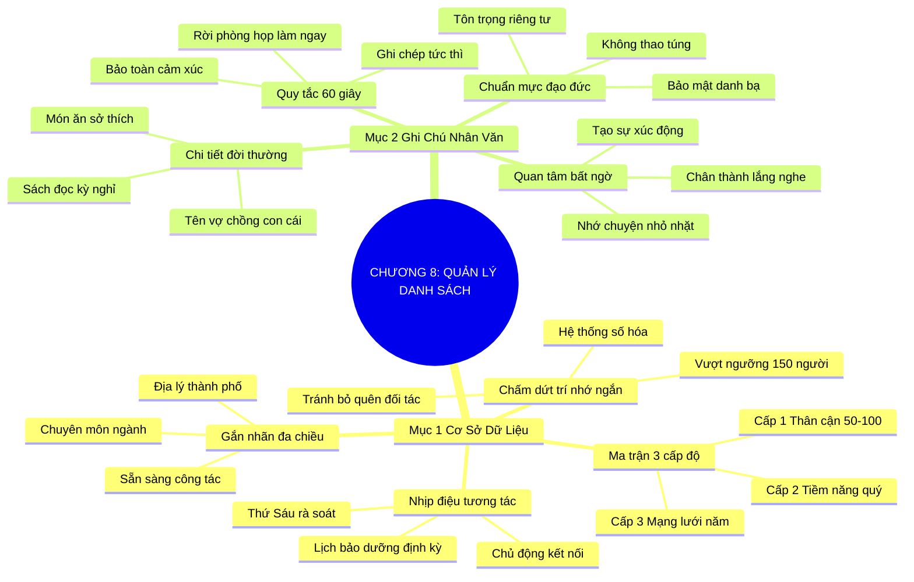

# SƠ ĐỒ TƯ DUY TRỰC QUAN: CHƯƠNG 8: GHI NHỚ VÀ QUẢN LÝ DANH SÁCH (TAKE NAMES)
* **Thuộc phần**: Phần 2: Bộ Kỹ Năng Thực Chiến (The Skill Set)
* **Tác phẩm**: Đừng Bao Giờ Đi Ăn Một Mình (Never Eat Alone) - Keith Ferrazzi
* **Chuẩn hóa**: Document Structure-Anchored v2.4 (Không nhãn meta thừa, phản ánh 100% cấu trúc tài liệu)

---

## 🌳 SƠ ĐỒ TƯ DUY MERMAID (4-5 TẦNG CHI TIẾT)

---

## 🧬 BẢNG PHÂN CẤP TRUY HỒI CHỦ ĐỘNG (ACTIVE RECALL HIERARCHY)
Cấu trúc hóa tri thức theo các nhánh tài liệu phục vụ ôn tập nhanh và khắc sâu trí nhớ:

| 📑 Nhánh Mục Tài Liệu | 🔑 Từ Khóa Vàng / Khái Niệm | 📝 Nội Dung Truy Hồi Chủ Động (Active Recall) |
| :--- | :--- | :--- |
| Mục 1: Cơ Sở Dữ Liệu Quan Hệ Chuyên Nghiệp | **Chấm dứt trí nhớ** | Não bộ không thể quản lý hàng ngàn liên lạc; cần số hóa và phân tầng khoa học. |
| Mục 1: Cơ Sở Dữ Liệu Quan Hệ Chuyên Nghiệp | **3 Cấp độ danh bạ** | Cấp 1 (Thân cận - hàng tháng), Cấp 2 (Tiềm năng - hàng quý), Cấp 3 (Mở rộng - hàng năm). |
| Mục 1: Cơ Sở Dữ Liệu Quan Hệ Chuyên Nghiệp | **Nhịp điệu kết nối** | Thiết lập lịch chăm sóc định kỳ chủ động thay vì chờ có việc mới tìm đến. |
| Mục 2: Thói Quen Ghi Chú Nhân Văn | **Quy tắc 60 giây** | Dành 1 phút ngay sau cuộc gặp để lưu lại thông tin gia đình, sở thích vào điện thoại. |
| Mục 2: Thói Quen Ghi Chú Nhân Văn | **Chi tiết đời thường** | Nhớ tên con cái, món ăn thích, chuyến du lịch để tạo sự ấm áp vượt trội. |
| Mục 2: Thói Quen Ghi Chú Nhân Văn | **Quan tâm sâu sắc** | Hỏi thăm chân thành các chi tiết nhỏ chứng minh bạn lắng nghe bằng cả trái tim. |

---

## ⚡ BẢNG NEO TRÍ NHỚ NHANH (MEMORY ANCHOR CHEAT SHEET)
Tóm tắt cô đọng các công thức và quy tắc hành động của chương:

| 📑 Phần/Mục Tài Liệu | 📌 Khái Niệm Cốt Lõi | ⚖️ Nguyên Lý Vàng | 🚀 Hành Động Chuyển Hóa Ngay |
| :--- | :--- | :--- | :--- |
| Mục 1: Cơ sở dữ liệu | **Hệ thống 3 cấp độ** | Cấp 1 (Thân cận), Cấp 2 (Tiềm năng), Cấp 3 (Mở rộng) | Phân loại danh bạ và gán lịch chăm sóc định kỳ |
| Mục 1: Cơ sở dữ liệu | **Gắn thẻ địa phương** | Lọc nhanh liên lạc theo thành phố trước chuyến đi | Tối ưu hóa các buổi cà phê công tác |
| Mục 2: Ghi chú nhân văn | **Quy tắc 60 giây** | Ghi lại chi tiết cá nhân ngay sau khi rời cuộc họp | Lưu tên người thân, sở thích vào danh bạ điện thoại |
| Mục 2: Ghi chú nhân văn | **Quan tâm bất ngờ** | Nhắc lại chuyện cũ để chứng minh sự chân thành | Tạo sự xúc động sâu sắc trong lần tái liên lạc |

